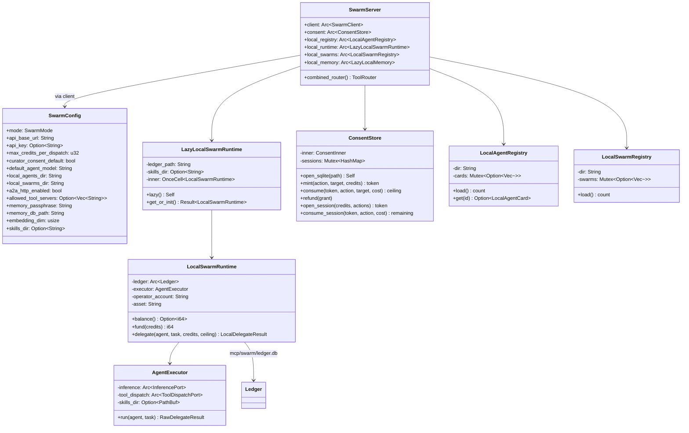
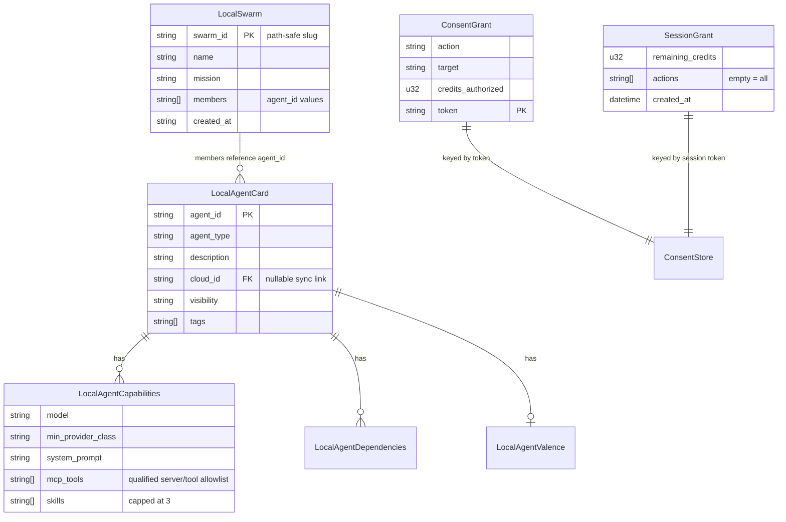

# Swarm Systems — Reference: The 52-Tool Surface and Components

A reference for the `hkask-mcp-swarm` tool surface, the panel components, and
the two skills. The surface is pinned by `tool_surface_is_exactly_52_registered_tools`
(`hkask_mcp_swarm.rs:361-434`) — 27 ABW + 25 local, both sets always
registered in either mode; `kask.swarm.mode` selects the substrate, not the
surface.

## Component class diagram

<!-- DIAGRAM_ALIGNMENT
id: DIAG-SWARM-020
verified_date: 2026-08-13
verified_against: kask/mcp-servers/hkask-mcp-swarm/src/hkask_mcp_swarm.rs:122-129; kask/mcp-servers/hkask-mcp-swarm/src/config.rs:67-132; kask/mcp-servers/hkask-mcp-swarm/src/local_runtime.rs:39-83; kask/mcp-servers/hkask-mcp-swarm/src/agent_executor.rs:43-52; kask/mcp-servers/hkask-mcp-swarm/src/consent.rs:55-68; kask/mcp-servers/hkask-mcp-swarm/src/local_registry.rs:53-65; kask/mcp-servers/hkask-mcp-swarm/src/local_swarms.rs:53-65
status: VERIFIED
-->

## Tool surface (53)

### ABW tools (27) — cloud, `mode: abw`

| Tool                       | Purpose                                              | Gate                      |
| -------------------------- | ---------------------------------------------------- | ------------------------- |
| `swarm_list_agents`        | catalogue read                                       | none                      |
| `swarm_get_swarm`          | workspace detail                                     | none                      |
| `swarm_get_agent`          | agent detail                                         | none                      |
| `swarm_list_apps`         | ABW apps                                             | none                      |
| `swarm_ontology_templates` | ontology templates                                  | none                      |
| `swarm_execute_agent`      | one LLM call (text consult)                          | none                      |
| `swarm_hire_cost`          | pre-hire cost check (`within_budget`)                | read                      |
| `swarm_request_consent`    | mint single-use consent token                        | auth required              |
| `swarm_authorize_session`  | pre-authorize session budget (headless)              | —                         |
| `swarm_hire`               | hire (own `/add` 2 cr; third-party `/hire` 5 cr base) | consent + ceiling         |
| `swarm_delegate`           | delegate (1 cr + tokens)                             | consent + ceiling         |
| `swarm_delegate_and_wait`  | delegate + poll for response                         | consent + ceiling         |
| `swarm_fanout`             | parallel multi-agent fan-out (cap `MAX_FANOUT_ABW`)  | consent per dispatch      |
| `swarm_run_status`         | run status / messages                                | read                      |
| `swarm_generate_prompt`    | generate agent prompt                                | read                      |
| `swarm_generate_ontology`  | generate ontology                                   | read                      |
| `swarm_create_agent`       | create ABW agent                                     | auth                      |
| `swarm_create_swarm`       | create ABW workspace (per-agent hire loop)           | consent per agent         |
| `swarm_xaman`              | Xaman Ek curator session                             | consent (curate action)   |
| `swarm_create_app`         | create ABW app                                       | auth                      |
| `swarm_fire`               | remove from roster                                   | auth                      |
| `swarm_delete_agent`       | delete ABW agent                                     | auth                      |
| `swarm_delete_swarm`       | delete ABW workspace                                 | auth                      |
| `swarm_search_knowledge`   | ABW knowledge-graph search                           | read                      |
| `swarm_publish_checks`     | pre-publish validation                               | read                      |
| `swarm_publish_agent`     | catalogue publish                                    | auth                      |
| `swarm_fork_agent`         | derivative fork                                     | auth                      |

Source: `cloud_swarm_tools.rs:27-1854` (router at `:26`).

### Local tools (26) — `mode: local`

| Tool                          | Purpose                                              | Gate                      |
| ----------------------------- | ---------------------------------------------------- | ------------------------- |
| `swarm_list_local_agents`     | list local registry                                  | none                      |
| `swarm_clone_to_local`        | clone ABW card to local (filters `allowed_tool_servers`) | auth                  |
| `swarm_push_to_cloud`         | push local card to ABW (sets `cloud_id`)             | auth                      |
| `swarm_remove_local`          | remove local agent                                   | none                      |
| `swarm_create_local_agent`    | create local agent card                              | none                      |
| `swarm_reconfigure_local_agent` | update local agent card                            | none                      |
| `swarm_create_local_swarm`    | create local swarm                                   | none                      |
| `swarm_list_local_swarms`     | list local swarms                                    | none                      |
| `swarm_get_local_swarm`       | local swarm detail                                   | none                      |
| `swarm_delete_local_swarm`    | delete local swarm                                   | none                      |
| `swarm_add_agent_local`       | add agent to local swarm                             | none                      |
| `swarm_remove_agent_local`    | remove agent from local swarm                        | none                      |
| `swarm_delegate_local`        | delegate (skill cascade + tool loop, debits ledger)  | per-dispatch ceiling      |
| `swarm_fanout_local`          | parallel fan-out (sequential to avoid ledger TOCTOU) | per-dispatch ceiling      |
| `swarm_pipeline_local`       | sequential pipeline (`{{prev_output}}` substitution) | per-dispatch ceiling      |
| `swarm_evaluate_local`        | deterministic task-success evaluator                  | none                      |
| `swarm_execute_plan_local`    | execute a plan with per-step evaluators              | per-dispatch ceiling      |
| `swarm_ai_assist`             | composition guidance via `swarm-compose-guide` skill | none                      |
| `swarm_fund_local`            | deposit local credits (optional)                     | none                      |
| `swarm_balance_local`         | read balance (may be negative)                       | none                      |
| `swarm_local_history`         | read recent transactions                             | none                      |
| `swarm_search_knowledge_local` | prefix-scoped semantic-memory search                | none                      |
| `swarm_generate_prompt_local` | local LLM prompt authoring aid                        | none                      |
| `swarm_generate_ontology_local` | local LLM ontology authoring aid                    | none                      |
| `swarm_a2a_send`              | A2A protocol message dispatch (in-process)          | per-dispatch ceiling      |
| `swarm_a2a_card`              | A2A agent card discovery                             | none                      |

Source: `local_tools.rs:42-1395` (router at `:41`), `ledger_tools.rs:20-119`
(router at `:20`), `knowledge_tools.rs:12` (router at `:12`),
`a2a_tools.rs:12` (router at `:12`). The combined router is
`cloud_swarm_router + ledger_router + local_router + a2a_router + knowledge_router`
(`hkask_mcp_swarm.rs:132-140`). The 52-tool surface is pinned by
`tool_surface_is_exactly_52_registered_tools` (`hkask_mcp_swarm.rs:361-434`).

## Data model

<!-- DIAGRAM_ALIGNMENT
id: DIAG-SWARM-021
verified_date: 2026-08-13
verified_against: kask/mcp-servers/hkask-mcp-swarm/src/local_registry.rs:18-93; kask/mcp-servers/hkask-mcp-swarm/src/local_swarms.rs:28-38; kask/mcp-servers/hkask-mcp-swarm/src/consent.rs:21-41
status: VERIFIED
-->

## Storage layout (D28 — Standardized Artifact Storage)

| Artifact              | Default path                                  | Env override                       |
| --------------------- | --------------------------------------------- | ---------------------------------- |
| Local ledger          | `mcp/swarm/ledger.db` (under hKask data dir)  | `HKASK_SWARM_LEDGER_PATH`          |
| Consent store         | `mcp/swarm/consent.db` (under hKask data dir) | `HKASK_SWARM_CONSENT_STORE`        |
| Local agent cards     | `agents/local/curated/<id>/agent_card.json`   | `HKASK_LOCAL_AGENTS_DIR`           |
| Local swarms          | `agents/local/swarms/<id>/swarm.json`         | `HKASK_LOCAL_SWARMS_DIR`           |
| Local semantic memory | `swarm_memory.db` (under hKask data dir)      | `HKASK_SWARM_MEMORY_DB`            |

The ledger and consent paths are resolved via
`hkask_types::agent_paths::mcp_server_db("swarm", "ledger"|"consent")` and
`resolve_under_data_dir` (`hkask_mcp_swarm.rs:154-167`, `:219-230`). Both swarm
server processes (governed `McpRuntime` and per-project `ContextServerStore`)
compute the same consent path, which is what makes consent tokens consumable
across processes (`hkask_mcp_swarm.rs:149-153`).

## Configuration (`SwarmConfig`)

Defaults live in the `Default` impl (`config.rs:134-163`) — the single
source of truth. Env vars override. Key fields:

| Field                     | Default                       | Env var                          |
| ------------------------- | ----------------------------- | -------------------------------- |
| `mode`                    | `Abw`                         | `HKASK_SWARM_MODE`               |
| `api_base_url`            | `https://agent-bestiary.world` | —                               |
| `max_credits_per_dispatch` | `50`                          | `HKASK_ABW_MAX_CREDITS`          |
| `curator_consent_default` | `false`                       | `HKASK_SWARM_CURATOR_CONSENT`    |
| `default_agent_model`     | `claude-haiku-4-5-20251001`   | `HKASK_ABW_DEFAULT_AGENT_MODEL`  |
| `local_agents_dir`        | `agents/local/curated`        | `HKASK_LOCAL_AGENTS_DIR`         |
| `local_swarms_dir`        | `agents/local/swarms`         | `HKASK_LOCAL_SWARMS_DIR`          |
| `a2a_http_enabled`        | `false`                       | `HKASK_A2A_HTTP_ENABLE`          |
| `allowed_tool_servers`    | `None` (no filter)            | `HKASK_MCP_SERVER_IDS`            |
| `memory_passphrase`       | `allostery`                   | `HKASK_SWARM_MEMORY_PASSPHRASE`  |
| `memory_db_path`          | `swarm_memory.db`             | `HKASK_SWARM_MEMORY_DB`           |
| `embedding_dim`           | `1024`                        | `HKASK_SWARM_EMBEDDING_DIM`       |
| `skills_dir`              | `None` (skill-blind)          | `HKASK_SKILLS_DIR`                |

The server's `Default` must stay in sync with `KaskSwarmSettings::default()` in
`kask/crates/kask_bridge/src/settings.rs` — the bridge emits env vars from its
`Default`; this server reads them in `from_env` (`config.rs:136-145`).

## Consent gate

`ConsentStore` (`consent.rs:55-58`) has two backends:

- `Memory` — session-scoped per-process store (tests + fallback when the
  shared store cannot be opened). A grant does not survive a server restart.
- `Sqlite` — production default. Shared and restart-durable across the
  governed and per-project swarm server processes. Single-use is enforced
  atomically via the DELETE-affected-rows check — two processes racing on the
  same token cannot double-spend it (`consent.rs:46-54`).

Grants expire after `CONSENT_TTL_SECS = 3600` (`consent.rs:76`). Validation
(`validate_grant`, `consent.rs:94-117`) checks expiry, scope (action +
target), and over-spend — shared by both backends so the logic doesn't drift.

## Spend gate

The single enforcement surface for the four spend-mutating ABW tools
(`swarm_hire`, `swarm_delegate`, `swarm_create_swarm`, `swarm_xaman`)
(`spend_gate.rs:1-14`). Two-phase shape:

1. `authorize_*` consumes the consent token, re-verifies the cost against
   ABW, and enforces the per-dispatch ceiling — returning an `Authorization`
   carrying the refund grant.
2. `complete_*` executes the spend (HTTP POST), refunding the authorization
   on transient failure. On success the authorization is dropped (the token
   stays consumed).

`SpendAuth` (`spend_gate.rs:35-38`) selects single-use vs session;
`Settlement` (`spend_gate.rs:74-77`) reconciles — single-use refunds the
consumed grant on failure; session deducts on success and does nothing on
failure.

## Local runtime

`LocalSwarmRuntime` (`local_runtime.rs:73-83`) owns the spending policy
(ceiling check, cost computation, spend recording — no balance gate). The
agent-run policy (skill cascade, tool-loop orchestration) lives in
`AgentExecutor` (`agent_executor.rs:43-52`). The executor returns a
`RawDelegateResult` (`agent_executor.rs:32-38`) — it does NOT debit the
ledger; the runtime debits after the agent run succeeds
(`agent_executor.rs:9-12`).

Constants:

- `MAX_TOOL_ROUNDS = 4` (`agent_executor.rs:22`) — bounds cost amplification.
- `MAX_SKILLS_PER_DELEGATION = 3` (`agent_executor.rs:27`) — bounds context
  bloat.
- `MAX_FANOUT = 10` (`local_runtime.rs:491`) — local fan-out cap.

## Panel components

| Component          | Location                                       |
| ------------------ | ---------------------------------------------- |
| `SwarmPanel`       | `crates/swarm_panel/src/swarm_panel.rs:445`    |
| `PanelMode` enum   | `crates/swarm_panel/src/swarm_panel.rs:387`    |
| `SwarmFilter` enum | `crates/swarm_panel/src/swarm_panel.rs:377`    |
| `init` (wiring)    | `crates/swarm_panel/src/swarm_panel.rs:328`     |
| `fetch_all`        | `crates/swarm_panel/src/fetch.rs:21`           |
| `clone_to_local` / `push_to_cloud` | `crates/swarm_panel/src/fetch.rs:424` / `:467` |
| `open_swarm_detail` / `fire_agent` | `crates/swarm_panel/src/swarm_ops.rs:25` / `:237` |
| `begin_hire` / `confirm_hire` | `crates/swarm_panel/src/hire.rs:21` / `:123` |
| `begin_publish` / `confirm_publish` | `crates/swarm_panel/src/hire.rs:289` / `:342` |
| `steer_system_prompt` | `crates/swarm_panel/src/swarm_panel.rs:148`  |
| `panel_button.rs`  | `crates/swarm_panel/src/panel_button.rs:13`    |

## Source citations

| Symbol                             | Location                                                                |
| ---------------------------------- | ----------------------------------------------------------------------- |
| `SwarmServer` struct               | `kask/mcp-servers/hkask-mcp-swarm/src/hkask_mcp_swarm.rs:122-129`        |
| `combined_router`                  | `kask/mcp-servers/hkask-mcp-swarm/src/hkask_mcp_swarm.rs:132-140`        |
| `run` (server entry)               | `kask/mcp-servers/hkask-mcp-swarm/src/hkask_mcp_swarm.rs:169-352`        |
| `resolve_consent_store_path` (D28) | `kask/mcp-servers/hkask-mcp-swarm/src/hkask_mcp_swarm.rs:154-167`        |
| Ledger path default (D28)          | `kask/mcp-servers/hkask-mcp-swarm/src/hkask_mcp_swarm.rs:219-230`        |
| `SwarmConfig` / `Default`          | `kask/mcp-servers/hkask-mcp-swarm/src/config.rs:67-132` / `:134-163`    |
| `resolve_local_agents_dir`         | `kask/mcp-servers/hkask-mcp-swarm/src/config.rs:177-185`                 |
| `ConsentGrant` / `SessionGrant`    | `kask/mcp-servers/hkask-mcp-swarm/src/consent.rs:21-30` / `:37-41`       |
| `ConsentStore` / `ConsentInner`    | `kask/mcp-servers/hkask-mcp-swarm/src/consent.rs:55-63`                  |
| `CONSENT_TTL_SECS`                 | `kask/mcp-servers/hkask-mcp-swarm/src/consent.rs:76`                     |
| `validate_grant` / `validate_session` | `kask/mcp-servers/hkask-mcp-swarm/src/consent.rs:94` / `:125`         |
| `SpendAuth` / `Settlement`         | `kask/mcp-servers/hkask-mcp-swarm/src/spend_gate.rs:35-38` / `:74-77`   |
| `resolve_auth`                     | `kask/mcp-servers/hkask-mcp-swarm/src/spend_gate.rs:44-60`               |
| `authorize_hire` / `complete_hire` | `kask/mcp-servers/hkask-mcp-swarm/src/spend_gate.rs:169` / `:317`        |
| `authorize_delegate` / `complete_delegate` | `kask/mcp-servers/hkask-mcp-swarm/src/spend_gate.rs:377` / `:452` |
| `LazyLocalSwarmRuntime`            | `kask/mcp-servers/hkask-mcp-swarm/src/local_runtime.rs:39-43`            |
| `LocalSwarmRuntime`                | `kask/mcp-servers/hkask-mcp-swarm/src/local_runtime.rs:73-83`            |
| `LocalSwarmRuntime::delegate`      | `kask/mcp-servers/hkask-mcp-swarm/src/local_runtime.rs:362-483`          |
| `LocalDelegateResult`              | `kask/mcp-servers/hkask-mcp-swarm/src/local_runtime.rs:495-549`         |
| `MAX_FANOUT`                       | `kask/mcp-servers/hkask-mcp-swarm/src/local_runtime.rs:491`             |
| `AgentExecutor` / `RawDelegateResult` | `kask/mcp-servers/hkask-mcp-swarm/src/agent_executor.rs:43` / `:32`   |
| `MAX_TOOL_ROUNDS` / `MAX_SKILLS_PER_DELEGATION` | `kask/mcp-servers/hkask-mcp-swarm/src/agent_executor.rs:22` / `:27` |
| `LocalAgentCard` / `LocalAgentCapabilities` | `kask/mcp-servers/hkask-mcp-swarm/src/local_registry.rs:18` / `:71` |
| `LocalSwarm` / `LocalSwarmRegistry` | `kask/mcp-servers/hkask-mcp-swarm/src/local_swarms.rs:28` / `:53`       |
| `swarm_request_consent` / `swarm_authorize_session` | `kask/mcp-servers/hkask-mcp-swarm/src/cloud_swarm_tools.rs:452` / `:506` |
| `swarm_delegate_local` / `swarm_fanout_local` / `swarm_pipeline_local` | `kask/mcp-servers/hkask-mcp-swarm/src/local_tools.rs:64` / `:119` / `:216` |
| `swarm_fund_local` / `swarm_balance_local` / `swarm_local_history` | `kask/mcp-servers/hkask-mcp-swarm/src/ledger_tools.rs:29` / `:66` / `:99` |
| `swarm_a2a_send`                   | `kask/mcp-servers/hkask-mcp-swarm/src/a2a_tools.rs:24`                   |
| `to_a2a_card` / `task_from_response` | `kask/mcp-servers/hkask-mcp-swarm/src/a2a.rs:51` / `:113`               |
| `SwarmPanel` / `PanelMode`         | `crates/swarm_panel/src/swarm_panel.rs:445` / `:387`                     |
| `fetch_all`                        | `crates/swarm_panel/src/fetch.rs:21-417`                                 |
| `begin_hire` / `confirm_hire`      | `crates/swarm_panel/src/hire.rs:21-117` / `:123-272`                    |
| `steer_system_prompt`              | `crates/swarm_panel/src/swarm_panel.rs:148-326`                          |
