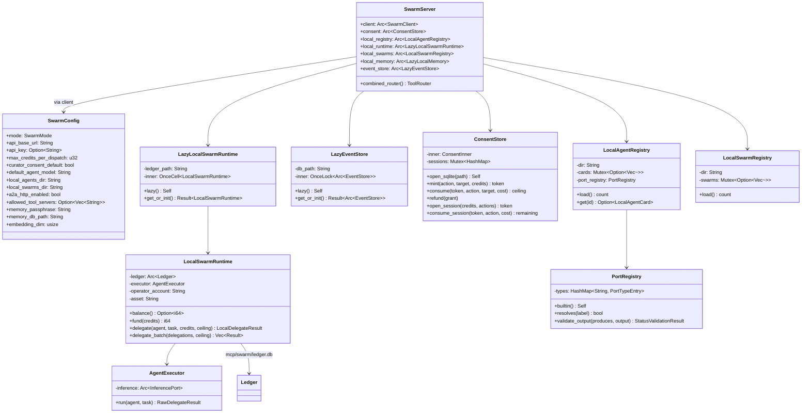
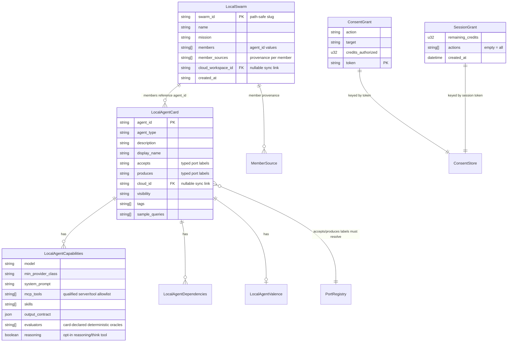

# Swarm Systems — Reference: The 82-Tool Surface and Components

A reference for the `hkask-mcp-swarm` tool surface, the typing layer, the
gates, and the panel components. The registered surface is **82 tools**
(47 cloud + 35 local), all registered in either mode; `kask.swarm.mode`
selects the substrate, not the surface.

The count is grounded in the build script: `build.rs` scans `src/*.rs` for
`pub(crate) async fn swarm_*` signatures and emits the canonical
`pub const TOOL_NAMES` (`build.rs:30-31`, emitted at `build.rs:52-56`),
included at `hkask_mcp_swarm.rs:113`. Replicating the build-script regex
against the current tree yields exactly 82 names:
`cloud_swarm_tools.rs` 47, `local_tools.rs` 25, `ledger_tools.rs` 3,
`knowledge_tools.rs` 4, `a2a_tools.rs` 3.

**Enforcement status (IS vs OUGHT):** the build-script doc comment
(`build.rs:5-6`) and the panel's test comment
(`crates/swarm_panel/src/swarm_panel.rs:3792-3797`) both advertise a
server-side test pinning `TOOL_NAMES` against the live
`combined_router()` surface (the panel comment names
`tool_surface_is_exactly_53_registered_tools`). **No such test exists in
the current tree** — `hkask_mcp_swarm.rs` contains only
`default_db_paths_follow_standardized_layout` (`:425-443`) and two
`smoke_tests` (`:453-561`), none of which counts tools. The enforcement
that DOES exist is panel-side: `panel_tool_names_match_server`
(`swarm_panel.rs:3801-3830`) asserts `parse::SWARM_TOOLS` is a re-export
of `hkask_mcp_swarm::TOOL_NAMES` (pointer equality, so no drift is
possible), that every name starts with `swarm_`, and that there are no
`steer_prompt_mentions_only_known_tools` (`swarm_panel.rs:4312`)
catches any `swarm_*` name the Steer prompt advertises that is not in the
const. A server-side count-pinning test is **not yet enforced**.

## Component class diagram

<!-- DIAGRAM_ALIGNMENT
id: DIAG-SWARM-020
verified_date: 2026-08-28
verified_against: kask/mcp-servers/hkask-mcp-swarm/src/hkask_mcp_swarm.rs:153-171; kask/mcp-servers/hkask-mcp-swarm/src/config.rs:67-128; kask/mcp-servers/hkask-mcp-swarm/src/local_runtime.rs:44-47,55-58,135-150; kask/mcp-servers/hkask-mcp-swarm/src/agent_executor.rs:14-17; kask/mcp-servers/hkask-mcp-swarm/src/consent.rs:55-63; kask/mcp-servers/hkask-mcp-swarm/src/local_registry.rs:212-219; kask/mcp-servers/hkask-mcp-swarm/src/local_swarms.rs:93; kask/mcp-servers/hkask-mcp-swarm/src/port_registry.rs:69-72
status: VERIFIED
-->

## Tool surface (82)

### Cloud tools (47) — ABW, defined in `cloud_swarm_tools.rs` (router at `:149`)

Every cloud tool calls `client.require_auth()`
(`abw_client.rs:44-49`) except `swarm_authorize_session`. The six
spend-mutating tools (`swarm_hire`, `swarm_delegate`,
`swarm_delegate_and_wait`, `swarm_fanout`, `swarm_create_swarm`,
`swarm_xaman`, per `hkask_mcp_swarm.rs:62-63`) additionally route through
the consent/session spend gate (`spend_gate.rs:1-22`).

**Catalogue and workspace reads**

| Tool                           | Purpose                                    | Definition |
| ------------------------------ | ------------------------------------------ | ---------- |
| `swarm_list_agents`            | catalogue read                             | `cloud_swarm_tools.rs:155` |
| `swarm_get_swarm`              | workspace detail                           | `:219` |
| `swarm_get_agent`              | agent detail                               | `:272` |
| `swarm_run_status`             | run status / messages                      | `:871` |
| `swarm_search_knowledge`       | ABW knowledge-graph search                 | `:1676` |
| `swarm_ontology_templates`     | ontology templates                         | `:366` |
| `swarm_execute_agent`          | one LLM call (text consult)               | `:393` |
| `swarm_generate_prompt`        | generate agent prompt                     | `:925` |
| `swarm_generate_ontology`      | generate ontology                          | `:975` |
| `swarm_publish_checks`         | pre-publish validation                     | `:1801` |

**Consent and spend**

| Tool                       | Purpose                                              | Definition |
| -------------------------- | ---------------------------------------------------- | ---------- |
| `swarm_hire_cost`          | pre-hire cost check (`within_budget`)                | `:456` |
| `swarm_request_consent`    | mint single-use consent token (auth required so an agent cannot self-authorize, `:538-542`) | `:529` |
| `swarm_authorize_session`  | pre-authorize session budget (headless) — the one cloud tool with no `require_auth` call | `:583` |
| `swarm_hire`               | hire (consent/session + ceiling via `authorize_hire`/`complete_hire`, `spend_gate.rs:169`/`:317`) | `:621` |
| `swarm_delegate`           | delegate (consent/session via `authorize_delegate`/`complete_delegate`, `spend_gate.rs:377`/`:452`) | `:685` |
| `swarm_delegate_and_wait`  | delegate + poll for response                         | `:753` |
| `swarm_fanout`             | parallel multi-agent fan-out (cap `MAX_FANOUT_ABW = 10`, `:1393`) | `:1373` |
| `swarm_create_swarm`       | create ABW workspace (per-agent hire loop)           | `:1072` |
| `swarm_xaman`              | Xaman Ek curator session (refund guarded by `CuratorSession`, `cloud_swarm/curator.rs:23-24`) | `:1223` |

**Lifecycle**

| Tool                       | Purpose                                    | Definition |
| -------------------------- | ------------------------------------------ | ---------- |
| `swarm_create_agent`       | create ABW agent                           | `:1020` |
| `swarm_fire`               | remove from roster                         | `:1479` |
| `swarm_delete_agent`       | delete ABW agent                           | `:1525` |
| `swarm_delete_swarm`       | delete ABW workspace (team-scoped route)   | `:1616` |
| `swarm_publish_agent`      | catalogue publish                          | `:1840` |
| `swarm_fork_agent`         | derivative fork                            | `:1910` |

**Apps**

| Tool                           | Purpose                          | Definition |
| ------------------------------ | -------------------------------- | ---------- |
| `swarm_list_apps`              | list ABW apps                    | `:327` |
| `swarm_get_app`                | app detail                       | `:1963` |
| `swarm_create_app`             | create ABW app                   | `:1304` |
| `swarm_create_app_direct`      | create app from a full manifest  | `:1998` |
| `swarm_update_app`             | update app metadata              | `:2071` |
| `swarm_publish_app`            | publish app                      | `:2148` |
| `swarm_archive_app`            | archive app                      | `:2191` |
| `swarm_spawn_app_workspace`    | spawn a workspace from an app    | `:2234` |
| `swarm_list_app_workspaces`    | list an app's workspaces         | `:2293` |
| `swarm_get_app_schema`         | read an app's schema            | `:2332` |
| `swarm_fork_workspace_to_app` | fork a workspace into an app     | `:2370` |

**Workspace files and actions**

| Tool                               | Purpose                       | Definition |
| ---------------------------------- | ----------------------------- | ---------- |
| `swarm_workspace_list_actions`     | workspace action log          | `:2419` |
| `swarm_workspace_pending_actions`  | pending escalations           | `:2459` |
| `swarm_workspace_mutate_document`  | mutate a workspace document   | `:2500` |
| `swarm_workspace_fork_state`       | fork workspace state          | `:2571` |
| `swarm_workspace_accept_action`    | accept a pending action       | `:2635` |
| `swarm_workspace_reject_action`    | reject a pending action       | `:2691` |
| `swarm_workspace_annotate`         | annotate workspace state      | `:2745` |
| `swarm_workspace_list_annotations` | list annotations              | `:2810` |
| `swarm_workspace_list_files`       | list workspace files          | `:2855` |
| `swarm_workspace_read_file`        | read a workspace file         | `:2894` |
| `swarm_workspace_write_file`      | write a workspace file        | `:2941` |

### Local tools (35)

**Delegation execution — `local_tools.rs` (router at `:156`)**

| Tool                          | Purpose                                              | Definition |
| ----------------------------- | ---------------------------------------------------- | ---------- |
| `swarm_delegate_local`        | delegate (skill cascade + tool loop, debits ledger; runs card-declared evaluators, `:214-240`) | `:176` |
| `swarm_fanout_local`          | fan-out; default sequential, `parallel=true` runs inference concurrently with batched debit (`:322-345`); cap `MAX_FANOUT = 10` (`local_runtime.rs:736`) | `:294` |
| `swarm_pipeline_local`        | sequential pipeline (`{{prev_output}}` substitution; cap `MAX_PIPELINE_STEPS = 10`, `:524`) | `:509` |
| `swarm_execute_plan_local`    | execute a plan with per-step evaluators (cap `MAX_FANOUT`, `:1966`); writes the task board | `:1954` |
| `swarm_evaluate_local`        | deterministic task-success evaluator (contains / not_contains / regex / exit_code / file_exists, `run_evaluator` `:43-81`) | `:1907` |
| `swarm_eval_suite_local`      | eval suite over a case dataset (cap `MAX_SUITE_CASES = 10`, `:2230`) | `:2218` |
| `swarm_eval_agent_local`      | rollout harness: N tasks × M repeats (caps `MAX_EVAL_TASKS = 10` `:25`, `DEFAULT_EVAL_REPEATS = 3` `:30`, `MAX_EVAL_REPEATS = 10` `:31`, `MAX_EVAL_ROLLOUTS = 50` `:36`) | `:2473` |
| `swarm_task_board`            | read per-swarm persistent task progress (`task_board.json`) | `:2176` |
| `swarm_ai_assist`             | composition guidance; runs the deterministic contract floor first (`contract.rs:19-35`) | `:1671` |

**Local agent store — `local_tools.rs`**

| Tool                          | Purpose                                    | Definition |
| ----------------------------- | ------------------------------------------ | ---------- |
| `swarm_list_local_agents`     | list local registry                        | `:628` |
| `swarm_clone_to_local`        | clone ABW card to local (filters `allowed_tool_servers`) | `:667` |
| `swarm_push_to_cloud`         | push local card to ABW (sets `cloud_id`)   | `:854` |
| `swarm_remove_local`          | remove local agent                         | `:951` |
| `swarm_create_local_agent`    | create local agent card                    | `:1029` |
| `swarm_reconfigure_local_agent` | update local agent card                  | `:1126` |

**Local swarm membership — `local_tools.rs`**

| Tool                          | Purpose                                    | Definition |
| ----------------------------- | ------------------------------------------ | ---------- |
| `swarm_create_local_swarm`    | create local swarm                         | `:1191` |
| `swarm_list_local_swarms`     | list local swarms                          | `:1223` |
| `swarm_get_local_swarm`       | local swarm detail                         | `:1246` |
| `swarm_delete_local_swarm`    | delete local swarm                         | `:1278` |
| `swarm_add_agent_local`       | add agent to local swarm                   | `:1310` |
| `swarm_remove_agent_local`    | remove agent from local swarm              | `:1343` |
| `swarm_update_local_swarm`    | update name/mission in place               | `:1378` |
| `swarm_clone_local_swarm`     | clone a local swarm (fresh id, same roster) | `:1418` |
| `swarm_push_local_swarm`       | push local swarm to ABW as a workspace     | `:1453` |
| `swarm_pull_swarm_to_local`   | pull an ABW workspace roster to local      | `:1596` |

**Ledger — `ledger_tools.rs` (router at `:20`)**

| Tool                          | Purpose                                    | Definition |
| ----------------------------- | ------------------------------------------ | ---------- |
| `swarm_fund_local`            | deposit local credits (optional)           | `:29` |
| `swarm_balance_local`         | read balance (may be negative; error, not 0, on failed measurement `:85-95`) | `:71` |
| `swarm_local_history`         | read recent transactions (default 50, cap 500, `:119`) | `:109` |

**Knowledge — `knowledge_tools.rs` (router at `:12`)**

| Tool                              | Purpose                                        | Definition |
| --------------------------------- | ---------------------------------------------- | ---------- |
| `swarm_search_knowledge_local`    | prefix-scoped EAV semantic-memory search; degrades to `memory_unconfigured` note | `:23` |
| `swarm_recall_local`              | recall prior turns from the shared knowledgebase by semantic similarity (spans all agents/swarms) | `:73` |
| `swarm_generate_prompt_local`    | local LLM prompt authoring aid                 | `:128` |
| `swarm_generate_ontology_local`   | local LLM ontology authoring aid               | `:194` |

**A2A — `a2a_tools.rs` (router at `:18`)**

| Tool                       | Purpose                                    | Definition |
| -------------------------- | ------------------------------------------ | ---------- |
| `swarm_a2a_send`           | A2A message dispatch (in-process)          | `:30` |
| `swarm_a2a_card`           | A2A agent card discovery                   | `:86` |
| `swarm_a2a_broadcast`      | broadcast a message to a swarm's members   | `:135` |

The combined router is
`cloud_swarm_router + ledger_router + local_router + a2a_router + knowledge_router`
(`hkask_mcp_swarm.rs:165-171`). Both tool sets are always registered in
either mode — `kask.swarm.mode` selects the substrate, not the surface.

## Typing layer (port labels are type references, not free strings)

The `PortRegistry` (`port_registry.rs:69-72`) converts `accepts`/`produces`
labels on `LocalAgentCard` into references against a registered type set.
The built-in seed is `BUILTIN_PORT_TYPES = ["text", "json", "task",
"task_result"]` (`port_registry.rs:41`); `task_result` carries the shared
output schema (`task_result_schema`, `port_registry.rs:53-63`) so both
swarm and kata-kanban validate `task` agent outputs against one source.

- **Admission gate (enforced):** `validate_typing`
  (`local_registry.rs:46-63`) rejects a card whose `accepts`/`produces`
  labels resolve to nothing — enforced on every `LocalAgentRegistry::load`
  and on create/clone. Third-party (ABW catalogue) labels are admitted via
  the `port_types.json` extension file
  (`PORT_TYPES_FILE`, `local_registry.rs:195`; promoted by
  `promote_imported_port_types`, `local_registry.rs:294-332`).
- **Runtime bind check (deliberately minimal):** `check_bind`
  (`local_runtime.rs:721-729`) returns `Some(true)` only when the card
  declares `accepts: ["text"]` (universal accept) and `None` for everything
  else. The runtime free-text classification heuristic was **deleted** —
  it had no correct setting (`local_runtime.rs:708-720` documents the
  deletion). Runtime bind matching against structured labels is the typing
  layer's unfinished transition, not a current gate.
- **Output validation (enforced when a schema exists):**
  `PortRegistry::validate_output` (`port_registry.rs:132-170`) checks the
  agent's output against the schema for its `produces` type after each
  `swarm_delegate_local` (`validate_produces`, `local_tools.rs:2751`,
  invoked at `local_tools.rs:246`). The validator
  (`schema_validate.rs:60`) supports exactly 7 keywords (type, properties,
  required, items, enum, const, oneOf — `schema_validate.rs:10-18`); an
  unsupported keyword is **never a pass** — it surfaces as
  `ValidationStatus::UnsupportedSchema` (`schema_validate.rs:222-229`),
  and `NoSchema` means only label resolution was checked.

## Data model

<!-- DIAGRAM_ALIGNMENT
id: DIAG-SWARM-021
verified_date: 2026-08-28
verified_against: kask/mcp-servers/hkask-mcp-swarm/src/local_registry.rs:74-112,137-177; kask/mcp-servers/hkask-mcp-swarm/src/local_swarms.rs:35-52; kask/mcp-servers/hkask-mcp-swarm/src/consent.rs:21-41; kask/mcp-servers/hkask-mcp-swarm/src/port_registry.rs:41
status: VERIFIED
-->

## Storage layout (D28 — Standardized Artifact Storage)

| Artifact              | Default path                                    | Env override                       |
| --------------------- | ----------------------------------------------- | ---------------------------------- |
| Local ledger          | `mcp/swarm/ledger.db` (under hKask data dir)    | `HKASK_SWARM_LEDGER_PATH`          |
| Consent store         | `mcp/swarm/consent.db` (under hKask data dir)  | `HKASK_SWARM_CONSENT_STORE`        |
| Rollout event store   | `mcp/swarm/events.db` (under hKask data dir)   | `HKASK_SWARM_EVENTS_PATH`          |
| Local agent cards     | `mcp/swarm/agents/curated/<id>/agent_card.json` | `HKASK_LOCAL_AGENTS_DIR`          |
| Port-type extensions  | `<agents dir>/port_types.json`                  | — (lives in the agents dir)        |
| Local swarms          | `mcp/swarm/swarms/<id>/swarm.json`              | `HKASK_LOCAL_SWARMS_DIR`           |
| Per-swarm task board  | `mcp/swarm/swarms/<id>/task_board.json`         | — (lives in the swarms dir)        |
| Local semantic memory | `mcp/swarm/memory.db` (under hKask data dir)   | `HKASK_SWARM_MEMORY_DB`            |

The ledger, consent, and events paths are resolved via
`hkask_types::agent_paths::mcp_server_db("swarm", …)` +
`resolve_under_data_dir` (`hkask_mcp_swarm.rs:269-280`, `:290-300`,
`:186-199`) and pinned by `default_db_paths_follow_standardized_layout`
(`hkask_mcp_swarm.rs:425-443`). The agents/swarms/memory defaults moved
under the per-server `mcp/swarm/` subtree
(`config.rs:83-95`, `:116-122`) — older docs placed them at
`agents/local/…` and `swarm_memory.db` at the data root; that layout is
stale. Both swarm server processes (governed `McpRuntime` and per-project
`ContextServerStore`) compute the same consent path, which is what makes
consent tokens consumable across processes (`hkask_mcp_swarm.rs:181-185`).

## Configuration (`SwarmConfig`)

Defaults live in the `Default` impl (`config.rs:130-164`) — the single
source of truth. Env vars override in `from_env` (`config.rs:216-319`).
Key fields:

| Field                     | Default                       | Env var                          |
| ------------------------- | ----------------------------- | -------------------------------- |
| `mode`                    | `Abw`                         | `HKASK_SWARM_MODE`               |
| `api_base_url`            | `https://agent-bestiary.world` | `HKASK_ABW_API_URL`             |
| `max_credits_per_dispatch` | `50`                         | `HKASK_ABW_MAX_CREDITS`          |
| `curator_consent_default` | `false`                       | `HKASK_SWARM_CURATOR_CONSENT`    |
| `default_agent_model`     | `hkask_inference::model_constants::DEFAULT_AGENT_MODEL` | `HKASK_ABW_DEFAULT_AGENT_MODEL` |
| `local_agents_dir`        | `mcp/swarm/agents/curated`    | `HKASK_LOCAL_AGENTS_DIR`         |
| `local_swarms_dir`        | `mcp/swarm/swarms`            | `HKASK_LOCAL_SWARMS_DIR`         |
| `a2a_http_enabled`        | `false`                       | `HKASK_A2A_HTTP_ENABLE`          |
| `allowed_tool_servers`    | `None` (no filter)            | `HKASK_MCP_SERVER_IDS`           |
| `memory_passphrase`       | `hkask_keystore::passphrase::DEFAULT_PASSPHRASE` (last-resort fallback) | `HKASK_DB_PASSPHRASE` |
| `memory_db_path`          | `mcp/swarm/memory.db`         | `HKASK_SWARM_MEMORY_DB`           |
| `embedding_dim`           | `1024`                        | `HKASK_SWARM_EMBEDDING_DIM`      |

There is no `skills_dir` field — an older revision of this table listed
one; the current struct (`config.rs:67-128`) has none. The server's
`Default` must stay in sync with `KaskSwarmSettings::default()` in
`kask/crates/kask_bridge/src/settings.rs` (`config.rs:132-143` names the
seam). The ABW API key is not an env var read by `from_env` — it arrives
via the `ServerContext` credentials map (`hkask_mcp_swarm.rs:206`) and is
declared as an optional credential requirement (`:414-417`).
`memory_passphrase` likewise arrives primarily as the `HKASK_DB_PASSPHRASE`
credential (via the governed-launch allowlist), overriding the config in
`run()` (`hkask_mcp_swarm.rs:210-224`); `from_env` reads
`HKASK_DB_PASSPHRASE` as the env fallback (`config.rs:259-262`) and the
struct default is the last resort. There is no
`HKASK_SWARM_MEMORY_PASSPHRASE` — the separate swarm passphrase was
removed; one passphrase covers every kask SQLCipher DB.

## Consent gate

`ConsentStore` (`consent.rs:55-58`) has two backends:

- `Memory` — session-scoped per-process store (tests + fallback when the
  shared store cannot be opened). A grant does not survive a server
  restart.
- `Sqlite` — production default (`hkask_mcp_swarm.rs:376-394`). Shared and
  restart-durable across the governed and per-project swarm server
  processes. Single-use is enforced atomically via the DELETE-affected-rows
  check — two processes racing on the same token cannot double-spend it
  (`consent.rs:462-470`).

Grants expire after `CONSENT_TTL_SECS = 3600` (`consent.rs:76`). Validation
(`validate_grant`, `consent.rs:94-117`) checks expiry, scope (action +
target), and over-spend; `validate_session` (`consent.rs:125`) does the
same for sessions — shared by both backends so the logic doesn't drift.

## Spend gate

The single enforcement surface for the spend-mutating ABW tools
(`spend_gate.rs:1-22`). Two-phase shape:

1. `authorize_*` consumes the consent token (or validates the session at
   cost 0), re-verifies the cost against ABW, and enforces the
   per-dispatch ceiling — returning an `Authorization` carrying the
   refund grant.
2. `complete_*` executes the spend (HTTP POST), refunding the authorization
   on transient failure. On success the authorization is dropped (the token
   stays consumed). The refund invariant is structural: `complete_*` owns
   the authorization by value and refunds on every `Err` path
   (`spend_gate.rs:9-14`).

`SpendAuth` (`spend_gate.rs:35-38`) selects single-use vs session;
`resolve_auth` (`spend_gate.rs:44-60`) rejects both-set and neither-set
(empty strings treated as absent); `Settlement` (`spend_gate.rs:74-77`)
reconciles — single-use refunds the consumed grant on failure; session
deducts on success and does nothing on failure. `swarm_xaman`'s two-step
session lifecycle uses `Authorization::refund` via the `CuratorSession`
drop guard (`cloud_swarm/curator.rs:23-24`) instead of a single
`complete_*`.

## Local runtime

`LocalSwarmRuntime` (`local_runtime.rs:135-150`) owns the spending policy
(ceiling check `:484-490`, cost computation `:544-545`, spend recording —
no balance gate, `:492-507`). The agent-run policy (skill cascade,
tool-loop orchestration) lives in `AgentExecutor`
(`agent_executor.rs:200+`). The executor returns a `RawDelegateResult` —
it does NOT debit the ledger (`agent_executor.rs:9-12`); the runtime
debits after the agent run succeeds (`debit_and_build`,
`local_runtime.rs:536-600`).

Constants:

- `MAX_TOOL_ROUNDS = 4` (`agent_executor.rs:22`) — bounds cost
  amplification; each round is a full inference call.
- `MAX_FANOUT = 10` (`local_runtime.rs:736`) — local fan-out and
  plan-execution cap.
- `MAX_PIPELINE_STEPS = 10` (`local_tools.rs:524`).
- `MAX_FANOUT_ABW = 10` (`cloud_swarm_tools.rs:1393`).

`delegate_batch` (`local_runtime.rs:612-706`) runs inference concurrently
via a tokio `JoinSet` and debits the ledger sequentially after all
completions — the TOCTOU-safe parallel path behind
`swarm_fanout_local(parallel=true)`.

`LocalDelegateResult` (`local_runtime.rs:740-815`) carries `agent_id`,
`response`, `model`, `tokens_used`, `cost` (capped at
`credits_authorized`), `cost_uncapped`, `balance` (`Option<i64>` — `None`
on a failed measurement, never fabricated), `latency_ms`, `tool_calls`,
`task_success` (a `TaskSuccessVerdict` with `provenance`,
`local_runtime.rs:875-890`), `bind_matched`, `rollout_id`, and
`reasoning_steps`.

## Panel components

| Component          | Location                                       |
| ------------------ | ---------------------------------------------- |
| `SwarmPanel`       | `crates/swarm_panel/src/swarm_panel.rs:611`   |
| `PanelMode` enum (Browse, Author, Compose, AppAuthor, Steer) | `crates/swarm_panel/src/swarm_panel.rs:494-507` |
| `SwarmFilter` enum | `crates/swarm_panel/src/swarm_panel.rs:364`    |
| `init` (wiring)    | `crates/swarm_panel/src/swarm_panel.rs:315`    |
| `steer_system_prompt` | `crates/swarm_panel/src/swarm_panel.rs:155` |
| `set_mode`         | `crates/swarm_panel/src/swarm_panel.rs:1175`   |
| `ensure_steer_conversation` (via `hkask_steer::ensure_steer`) | `crates/swarm_panel/src/swarm_panel.rs:1303-1309` |
| `create_agent` / `create_swarm` / `ask_xaman` | `crates/swarm_panel/src/swarm_panel.rs:1398` / `:1596` / `:1885` |
| `fetch_all`        | `crates/swarm_panel/src/fetch.rs:21`           |
| `clone_to_local` / `push_to_cloud_swarm` | `crates/swarm_panel/src/fetch.rs:586` / `:629` |
| `open_swarm_detail` / `fire_agent` | `crates/swarm_panel/src/swarm_ops.rs:30` / `:502` |
| `begin_hire` / `confirm_hire` | `crates/swarm_panel/src/hire.rs:21` / `:123` |
| `begin_publish` / `confirm_publish` | `crates/swarm_panel/src/hire.rs:290` / `:343` |
| `parse::SWARM_TOOLS` (re-export of `TOOL_NAMES`) | `crates/swarm_panel/src/parse.rs:324-331` |

## Source citations

| Symbol                             | Location                                                                |
| ---------------------------------- | ----------------------------------------------------------------------- |
| `SwarmServer` struct               | `kask/mcp-servers/hkask-mcp-swarm/src/hkask_mcp_swarm.rs:153-161`        |
| `combined_router`                  | `kask/mcp-servers/hkask-mcp-swarm/src/hkask_mcp_swarm.rs:165-171`        |
| `TOOL_NAMES` include               | `kask/mcp-servers/hkask-mcp-swarm/src/hkask_mcp_swarm.rs:113`           |
| `TOOL_NAMES` generation            | `kask/mcp-servers/hkask-mcp-swarm/build.rs:30-31,52-56`                  |
| `run` (server entry)               | `kask/mcp-servers/hkask-mcp-swarm/src/hkask_mcp_swarm.rs:201-420`        |
| `resolve_consent_store_path` (D28) | `kask/mcp-servers/hkask-mcp-swarm/src/hkask_mcp_swarm.rs:186-199`        |
| Ledger / events path defaults (D28)| `kask/mcp-servers/hkask-mcp-swarm/src/hkask_mcp_swarm.rs:269-280,290-300`|
| Consent store open + fallback      | `kask/mcp-servers/hkask-mcp-swarm/src/hkask_mcp_swarm.rs:376-394`        |
| A2A HTTP gateway (opt-in)          | `kask/mcp-servers/hkask-mcp-swarm/src/hkask_mcp_swarm.rs:330-366`         |
| `SwarmConfig` / `Default` / `from_env` | `kask/mcp-servers/hkask-mcp-swarm/src/config.rs:67-128` / `:130-164` / `:216-319` |
| `ConsentGrant` / `SessionGrant`    | `kask/mcp-servers/hkask-mcp-swarm/src/consent.rs:21-30` / `:37-41`       |
| `CONSENT_TTL_SECS`                 | `kask/mcp-servers/hkask-mcp-swarm/src/consent.rs:76`                     |
| `validate_grant` / `validate_session` | `kask/mcp-servers/hkask-mcp-swarm/src/consent.rs:94` / `:125`         |
| DELETE-affected-rows single-use    | `kask/mcp-servers/hkask-mcp-swarm/src/consent.rs:462-470`                |
| `SpendAuth` / `Settlement` / `resolve_auth` | `kask/mcp-servers/hkask-mcp-swarm/src/spend_gate.rs:35-38` / `:74-77` / `:44-60` |
| `authorize_hire` / `complete_hire` | `kask/mcp-servers/hkask-mcp-swarm/src/spend_gate.rs:169` / `:317`        |
| `authorize_delegate` / `complete_delegate` | `kask/mcp-servers/hkask-mcp-swarm/src/spend_gate.rs:377` / `:452` |
| `CuratorSession` refund guard      | `kask/mcp-servers/hkask-mcp-swarm/src/cloud_swarm/curator.rs:23-24`      |
| `LazyLocalSwarmRuntime` / `LazyEventStore` | `kask/mcp-servers/hkask-mcp-swarm/src/local_runtime.rs:44-47` / `:55-58` |
| `LocalSwarmRuntime`                | `kask/mcp-servers/hkask-mcp-swarm/src/local_runtime.rs:135-150`          |
| `LocalSwarmRuntime::delegate`      | `kask/mcp-servers/hkask-mcp-swarm/src/local_runtime.rs:473-519`          |
| `delegate_batch`                   | `kask/mcp-servers/hkask-mcp-swarm/src/local_runtime.rs:612-706`          |
| `check_bind`                       | `kask/mcp-servers/hkask-mcp-swarm/src/local_runtime.rs:721-729`          |
| `MAX_FANOUT`                       | `kask/mcp-servers/hkask-mcp-swarm/src/local_runtime.rs:736`              |
| `LocalDelegateResult` / `TaskSuccessVerdict` | `kask/mcp-servers/hkask-mcp-swarm/src/local_runtime.rs:740-815` / `:875-890` |
| `AgentExecutor::run` / `MAX_TOOL_ROUNDS` | `kask/mcp-servers/hkask-mcp-swarm/src/agent_executor.rs:200` / `:22` |
| `LocalAgentCard` / `LocalAgentCapabilities` | `kask/mcp-servers/hkask-mcp-swarm/src/local_registry.rs:74` / `:137` |
| `validate_typing` / `PORT_TYPES_FILE` | `kask/mcp-servers/hkask-mcp-swarm/src/local_registry.rs:46-63` / `:195` |
| `PortRegistry` / `BUILTIN_PORT_TYPES` | `kask/mcp-servers/hkask-mcp-swarm/src/port_registry.rs:69-72` / `:41` |
| `schema_validate::validate` / `ValidationStatus` | `kask/mcp-servers/hkask-mcp-swarm/src/schema_validate.rs:60` / `:222-229` |
| `LocalSwarm` / `LocalSwarmRegistry` | `kask/mcp-servers/hkask-mcp-swarm/src/local_swarms.rs:35` / `:93`       |
| `TaskEntry` / `TaskStatus`          | `kask/mcp-servers/hkask-mcp-swarm/src/task_board.rs:20-45` / `:50-59`    |
| `run_evaluator`                    | `kask/mcp-servers/hkask-mcp-swarm/src/local_tools.rs:43-81`              |
| `swarm_delegate_local`             | `kask/mcp-servers/hkask-mcp-swarm/src/local_tools.rs:176-282`           |
| `swarm_fanout_local` / `swarm_pipeline_local` | `kask/mcp-servers/hkask-mcp-swarm/src/local_tools.rs:294` / `:509` |
| `swarm_execute_plan_local` / `swarm_task_board` | `kask/mcp-servers/hkask-mcp-swarm/src/local_tools.rs:1954` / `:2176` |
| `swarm_eval_suite_local` / `swarm_eval_agent_local` | `kask/mcp-servers/hkask-mcp-swarm/src/local_tools.rs:2218` / `:2473` |
| `swarm_fund_local` / `swarm_balance_local` / `swarm_local_history` | `kask/mcp-servers/hkask-mcp-swarm/src/ledger_tools.rs:29` / `:71` / `:109` |
| `swarm_recall_local`               | `kask/mcp-servers/hkask-mcp-swarm/src/knowledge_tools.rs:73`             |
| `swarm_a2a_send` / `swarm_a2a_broadcast` | `kask/mcp-servers/hkask-mcp-swarm/src/a2a_tools.rs:30` / `:135`    |
| A2A in-process transport            | `kask/mcp-servers/hkask-mcp-swarm/src/a2a.rs:1-12`                       |
| `SwarmClient` / `require_auth`     | `kask/mcp-servers/hkask-mcp-swarm/src/abw_client.rs:15` / `:44-49`        |
| Composition contract floor         | `kask/mcp-servers/hkask-mcp-swarm/src/contract.rs:19-35`                  |
| `panel_tool_names_match_server`    | `crates/swarm_panel/src/swarm_panel.rs:3801-3830`                        |