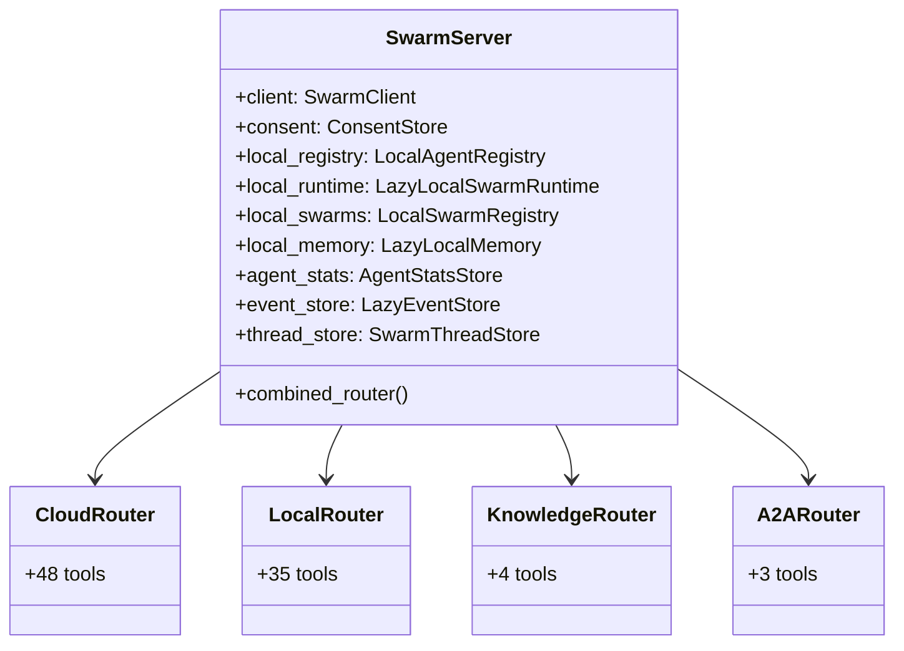

# Swarm Systems — Reference: Tools and Components

`hkask-mcp-swarm` registers 90 tools: 48 cloud and 42 non-cloud (35 local,
4 knowledge, 3 A2A). The server pins the live count, name-set equality,
and cloud partition (`kask/mcp-servers/hkask-mcp-swarm/src/hkask_mcp_swarm.rs`). The build
script derives both lists from `swarm_*` function signatures and router
annotations (`kask/mcp-servers/hkask-mcp-swarm/build.rs:34-81`).

## Component map

<!-- DIAGRAM_ALIGNMENT
id: DIAG-SWARM-020
verified_date: 2026-09-23
verified_against: kask/mcp-servers/hkask-mcp-swarm/src/hkask_mcp_swarm.rs (tool_surface_tests); kask/mcp-servers/hkask-mcp-swarm/src/local_tools.rs (local_router); kask/mcp-servers/hkask-mcp-swarm/src/knowledge_tools.rs (knowledge_router); kask/mcp-servers/hkask-mcp-swarm/src/a2a_tools.rs (a2a_router)
status: VERIFIED
-->

## Cloud tools — 48

All 48 are defined in
`kask/mcp-servers/hkask-mcp-swarm/src/cloud_swarm_tools.rs:157-2850`:

| Group | Tools |
| --- | --- |
| Catalogue and workspace | `swarm_list_agents`, `swarm_get_swarm`, `swarm_get_agent`, `swarm_update_agent`, `swarm_run_status`, `swarm_search_knowledge`, `swarm_ontology_templates`, `swarm_generate_prompt`, `swarm_generate_ontology` |
| Authorization and execution | `swarm_execute_agent`, `swarm_hire_cost`, `swarm_request_consent`, `swarm_authorize_session`, `swarm_hire`, `swarm_delegate`, `swarm_delegate_and_wait`, `swarm_fanout`, `swarm_create_swarm`, `swarm_xaman` |
| Agent and workspace lifecycle | `swarm_create_agent`, `swarm_fire`, `swarm_delete_agent`, `swarm_delete_swarm`, `swarm_publish_checks`, `swarm_publish_agent`, `swarm_fork_agent` |
| Apps | `swarm_list_apps`, `swarm_get_app`, `swarm_create_app`, `swarm_create_app_direct`, `swarm_update_app`, `swarm_publish_app`, `swarm_archive_app`, `swarm_spawn_app_workspace`, `swarm_list_app_workspaces`, `swarm_get_app_schema`, `swarm_fork_workspace_to_app` |
| Workspace actions and files | `swarm_workspace_list_actions`, `swarm_workspace_pending_actions`, `swarm_workspace_mutate_document`, `swarm_workspace_fork_state`, `swarm_workspace_accept_action`, `swarm_workspace_reject_action`, `swarm_workspace_annotate`, `swarm_workspace_list_annotations`, `swarm_workspace_list_files`, `swarm_workspace_read_file`, `swarm_workspace_write_file` |

## Non-cloud tools — 42

### Local tools — 35

Defined in `kask/mcp-servers/hkask-mcp-swarm/src/local_tools.rs`:

| Group | Tools |
| --- | --- |
| Delegation and workflow | `swarm_delegate_local` (standalone), `swarm_delegate_in_thread_local` (member), `swarm_fanout_local`, `swarm_pipeline_local`, `swarm_workflow_check_local`, `swarm_run_workflow_local`, `swarm_observed_seams_local`, `swarm_execute_plan_local`, `swarm_thread_local`, `swarm_list_local_threads` |
| Fleet and evaluation | `swarm_fleet_digest_local`, `swarm_who_answers_local`, `swarm_select_agent_local`, `swarm_evaluate_local`, `swarm_task_board`, `swarm_eval_suite_local`, `swarm_eval_agent_local` |
| Agent registry | `swarm_list_local_agents`, `swarm_get_local_agent`, `swarm_clone_to_local`, `swarm_push_to_cloud`, `swarm_remove_local`, `swarm_create_local_agent`, `swarm_reconfigure_local_agent`, `swarm_ai_assist` |
| Local swarms and synchronization | `swarm_create_local_swarm`, `swarm_list_local_swarms`, `swarm_get_local_swarm`, `swarm_delete_local_swarm`, `swarm_add_agent_local`, `swarm_remove_agent_local`, `swarm_update_local_swarm`, `swarm_clone_local_swarm`, `swarm_push_local_swarm`, `swarm_pull_swarm_to_local` |

`swarm_get_local_agent` returns the full local card and measured execution
statistics. `swarm_workflow_check_local` validates a declared workflow before
execution. A provided `swarm_id` binds supported dispatches to roster
membership and the ordered encrypted member conversation; without it they
remain standalone. The eval suite's `swarm_id` only selects the task board.

### Knowledge tools — 4

Defined in `kask/mcp-servers/hkask-mcp-swarm/src/knowledge_tools.rs:23-229`:

- `swarm_search_knowledge_local`
- `swarm_recall_local`
- `swarm_generate_prompt_local`
- `swarm_generate_ontology_local`

### A2A tools — 3

Defined in `kask/mcp-servers/hkask-mcp-swarm/src/a2a_tools.rs:30-172`:

- `swarm_a2a_send`
- `swarm_a2a_card`
- `swarm_a2a_broadcast`

## Typing and validation

The built-in port registry and schema-bearing types live in
`kask/mcp-servers/hkask-mcp-swarm/src/port_registry.rs:41-170`. Agent-card
admission rejects unresolved `accepts` or `produces` labels
(`kask/mcp-servers/hkask-mcp-swarm/src/local_registry.rs:46-63`). Runtime task
classification is deliberately not guessed; only universal `text` is a
positive bind (`kask/mcp-servers/hkask-mcp-swarm/src/local_runtime.rs:708-729`).

The minimal schema validator supports `type`, `properties`, `required`,
`items`, `enum`, `const`, and `oneOf`; unsupported keywords produce
`UnsupportedSchema`
(`kask/mcp-servers/hkask-mcp-swarm/src/schema_validate.rs:10-18,222-229`).

## Local result model

`LocalDelegateResult` and its task-success and reliance data are defined with
the local runtime public surface
(`kask/mcp-servers/hkask-mcp-swarm/src/local_runtime.rs:135-150`). Agent
execution statistics are persisted and surfaced by local-agent detail/list
operations (`kask/mcp-servers/hkask-mcp-swarm/src/agent_stats.rs:12-18,175-185`).
The event store records rollout and observed-seam evidence through the local
tools; task progress is read through `swarm_task_board`
(`kask/mcp-servers/hkask-mcp-swarm/src/local_tools.rs:2812-3138`).

## Configuration and storage

`SwarmServer` owns the cloud client, consent store, local registries/runtime,
local knowledge, statistics, and event store
(`kask/mcp-servers/hkask-mcp-swarm/src/hkask_mcp_swarm.rs:157-170`). The shared
consent-store path defaults to `mcp/swarm/consent.db`
(`kask/mcp-servers/hkask-mcp-swarm/src/hkask_mcp_swarm.rs:188-205`). The server
resolves the one shared `HKASK_DB_PASSPHRASE` through the canonical MCP helper
before opening encrypted local memory
(`kask/mcp-servers/hkask-mcp-swarm/src/hkask_mcp_swarm.rs:208-253`).

## Further reading

- [Swarm explanation](./explanation.md)
- [Swarm procedures](./how-to.md)
