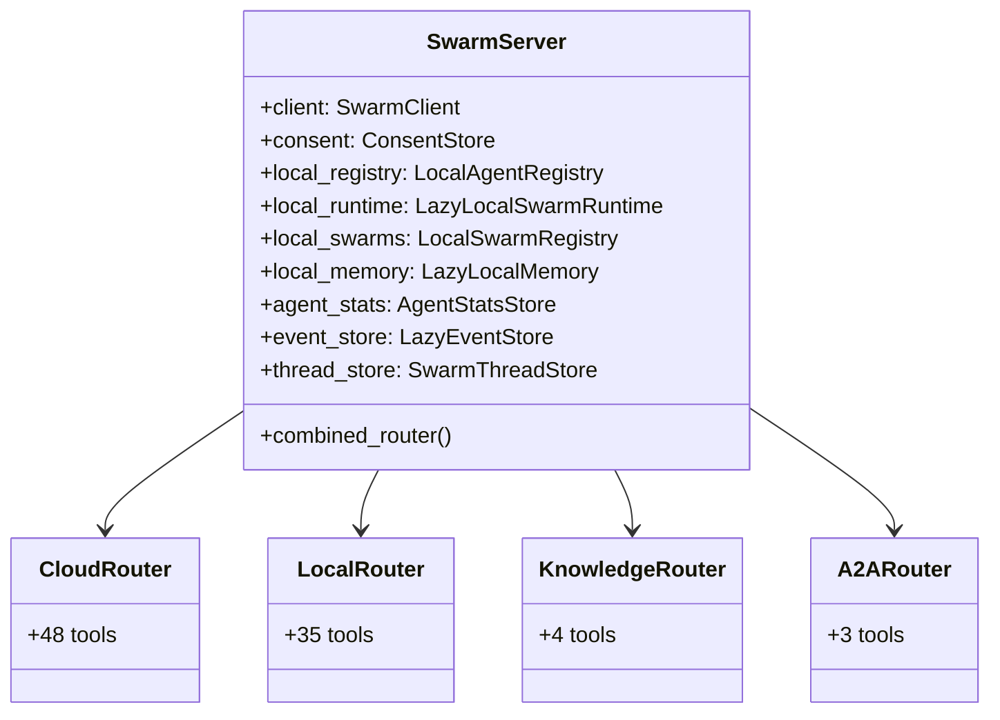
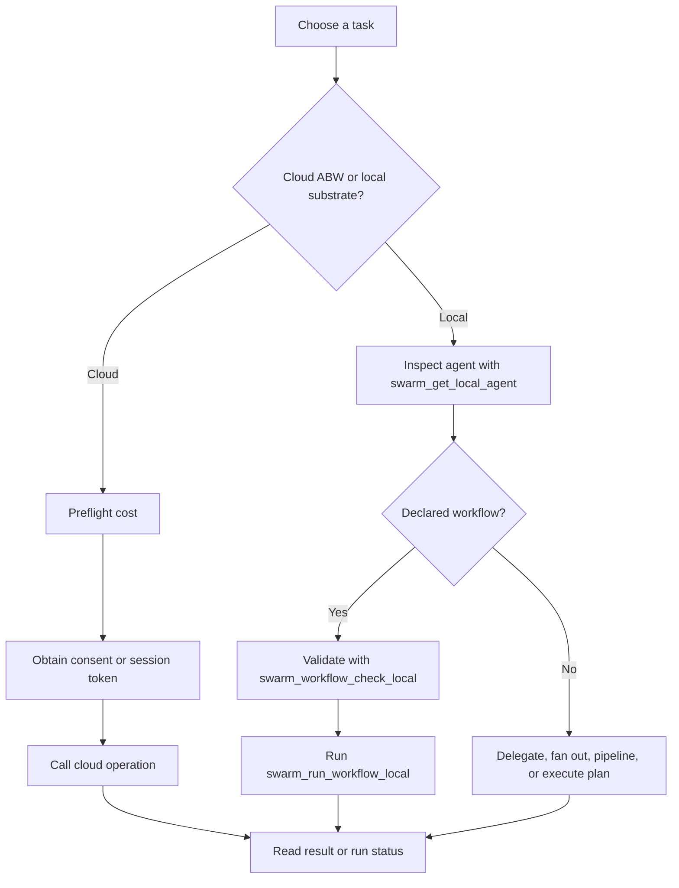

# Swarm Systems — Reference: Tools and Components

`hkask-mcp-swarm` registers 90 tools: 48 cloud and 42 non-cloud (35 local,
4 knowledge, 3 A2A). The server pins the live count, name-set equality,
and cloud partition (`kask/mcp-servers/hkask-mcp-swarm/src/hkask_mcp_swarm.rs`). The build
script derives both lists from `swarm_*` function signatures and router
annotations (`kask/mcp-servers/hkask-mcp-swarm/build.rs:34-81`).

## Component map

```mermaid
classDiagram
    class SwarmServer {
        +client: SwarmClient
        +consent: ConsentStore
        +local_registry: LocalAgentRegistry
        +local_runtime: LazyLocalSwarmRuntime
        +local_swarms: LocalSwarmRegistry
        +local_memory: LazyLocalMemory
        +agent_stats: AgentStatsStore
        +event_store: LazyEventStore
        +thread_store: SwarmThreadStore
        +combined_router()
    }
    class CloudRouter {
        +48 tools
    }
    class LocalRouter {
        +35 tools
    }
    class KnowledgeRouter {
        +4 tools
    }
    class A2ARouter {
        +3 tools
    }
    SwarmServer --> CloudRouter
    SwarmServer --> LocalRouter
    SwarmServer --> KnowledgeRouter
    SwarmServer --> A2ARouter
```

<!-- DIAGRAM_ALIGNMENT
id: DIAG-SWARM-020
verified_date: 2026-09-23
verified_against: kask/mcp-servers/hkask-mcp-swarm/src/hkask_mcp_swarm.rs (tool_surface_tests); kask/mcp-servers/hkask-mcp-swarm/src/local_tools.rs (local_router); kask/mcp-servers/hkask-mcp-swarm/src/knowledge_tools.rs (knowledge_router); kask/mcp-servers/hkask-mcp-swarm/src/a2a_tools.rs (a2a_router)
status: VERIFIED
-->

## Cloud tools — 48

All 48 are defined in
`kask/mcp-servers/hkask-mcp-swarm/src/cloud_swarm_tools.rs:157-2850`:

| Group | Tools |
| --- | --- |
| Catalogue and workspace | `swarm_list_agents`, `swarm_get_swarm`, `swarm_get_agent`, `swarm_update_agent`, `swarm_run_status`, `swarm_search_knowledge`, `swarm_ontology_templates`, `swarm_generate_prompt`, `swarm_generate_ontology` |
| Authorization and execution | `swarm_execute_agent`, `swarm_hire_cost`, `swarm_request_consent`, `swarm_authorize_session`, `swarm_hire`, `swarm_delegate`, `swarm_delegate_and_wait`, `swarm_fanout`, `swarm_create_swarm`, `swarm_xaman` |
| Agent and workspace lifecycle | `swarm_create_agent`, `swarm_fire`, `swarm_delete_agent`, `swarm_delete_swarm`, `swarm_publish_checks`, `swarm_publish_agent`, `swarm_fork_agent` |
| Apps | `swarm_list_apps`, `swarm_get_app`, `swarm_create_app`, `swarm_create_app_direct`, `swarm_update_app`, `swarm_publish_app`, `swarm_archive_app`, `swarm_spawn_app_workspace`, `swarm_list_app_workspaces`, `swarm_get_app_schema`, `swarm_fork_workspace_to_app` |
| Workspace actions and files | `swarm_workspace_list_actions`, `swarm_workspace_pending_actions`, `swarm_workspace_mutate_document`, `swarm_workspace_fork_state`, `swarm_workspace_accept_action`, `swarm_workspace_reject_action`, `swarm_workspace_annotate`, `swarm_workspace_list_annotations`, `swarm_workspace_list_files`, `swarm_workspace_read_file`, `swarm_workspace_write_file` |

## Non-cloud tools — 42

### Local tools — 35

Defined in `kask/mcp-servers/hkask-mcp-swarm/src/local_tools.rs`:

| Group | Tools |
| --- | --- |
| Delegation and workflow | `swarm_delegate_local` (standalone), `swarm_delegate_in_thread_local` (member), `swarm_fanout_local`, `swarm_pipeline_local`, `swarm_workflow_check_local`, `swarm_run_workflow_local`, `swarm_observed_seams_local`, `swarm_execute_plan_local`, `swarm_thread_local`, `swarm_list_local_threads` |
| Fleet and evaluation | `swarm_fleet_digest_local`, `swarm_who_answers_local`, `swarm_select_agent_local`, `swarm_evaluate_local`, `swarm_task_board`, `swarm_eval_suite_local`, `swarm_eval_agent_local` |
| Agent registry | `swarm_list_local_agents`, `swarm_get_local_agent`, `swarm_clone_to_local`, `swarm_push_to_cloud`, `swarm_remove_local`, `swarm_create_local_agent`, `swarm_reconfigure_local_agent`, `swarm_ai_assist` |
| Local swarms and synchronization | `swarm_create_local_swarm`, `swarm_list_local_swarms`, `swarm_get_local_swarm`, `swarm_delete_local_swarm`, `swarm_add_agent_local`, `swarm_remove_agent_local`, `swarm_update_local_swarm`, `swarm_clone_local_swarm`, `swarm_push_local_swarm`, `swarm_pull_swarm_to_local` |

`swarm_get_local_agent` returns the full local card and measured execution
statistics. `swarm_workflow_check_local` validates a declared workflow before
execution. A provided `swarm_id` binds supported dispatches to roster
membership and the ordered encrypted member conversation; without it they
remain standalone. The eval suite's `swarm_id` only selects the task board.

### Knowledge tools — 4

Defined in `kask/mcp-servers/hkask-mcp-swarm/src/knowledge_tools.rs:23-229`:

- `swarm_search_knowledge_local`
- `swarm_recall_local`
- `swarm_generate_prompt_local`
- `swarm_generate_ontology_local`

### A2A tools — 3

Defined in `kask/mcp-servers/hkask-mcp-swarm/src/a2a_tools.rs:30-172`:

- `swarm_a2a_send`
- `swarm_a2a_card`
- `swarm_a2a_broadcast`

## Typing and validation

The built-in port registry and schema-bearing types live in
`kask/mcp-servers/hkask-mcp-swarm/src/port_registry.rs:41-170`. Agent-card
admission rejects unresolved `accepts` or `produces` labels
(`kask/mcp-servers/hkask-mcp-swarm/src/local_registry.rs:46-63`). Runtime task
classification is deliberately not guessed; only universal `text` is a
positive bind (`kask/mcp-servers/hkask-mcp-swarm/src/local_runtime.rs:708-729`).

The minimal schema validator supports `type`, `properties`, `required`,
`items`, `enum`, `const`, and `oneOf`; unsupported keywords produce
`UnsupportedSchema`
(`kask/mcp-servers/hkask-mcp-swarm/src/schema_validate.rs:10-18,222-229`).

## Local result model

`LocalDelegateResult` and its task-success and reliance data are defined with
the local runtime public surface
(`kask/mcp-servers/hkask-mcp-swarm/src/local_runtime.rs:135-150`). Agent
execution statistics are persisted and surfaced by local-agent detail/list
operations (`kask/mcp-servers/hkask-mcp-swarm/src/agent_stats.rs:12-18,175-185`).
The event store records rollout and observed-seam evidence through the local
tools; task progress is read through `swarm_task_board`
(`kask/mcp-servers/hkask-mcp-swarm/src/local_tools.rs:2812-3138`).

## Configuration and storage

`SwarmServer` owns the cloud client, consent store, local registries/runtime,
local knowledge, statistics, and event store
(`kask/mcp-servers/hkask-mcp-swarm/src/hkask_mcp_swarm.rs:157-170`). The shared
consent-store path defaults to `mcp/swarm/consent.db`
(`kask/mcp-servers/hkask-mcp-swarm/src/hkask_mcp_swarm.rs:188-205`). The server
resolves the one shared `HKASK_DB_PASSPHRASE` through the canonical MCP helper
before opening encrypted local memory
(`kask/mcp-servers/hkask-mcp-swarm/src/hkask_mcp_swarm.rs:208-253`).

## Procedures

These procedures use the current 90-tool surface: 48 cloud tools and 42
non-cloud tools (`kask/mcp-servers/hkask-mcp-swarm/src/hkask_mcp_swarm.rs:1029-1052`).

### Choose the execution path

```mermaid
flowchart TD
    A[Choose a task] --> B{Cloud ABW or local substrate?}
    B -->|Cloud| C[Preflight cost]
    C --> D[Obtain consent or session token]
    D --> E[Call cloud operation]
    B -->|Local| F[Inspect agent with swarm_get_local_agent]
    F --> G{Declared workflow?}
    G -->|Yes| H[Validate with swarm_workflow_check_local]
    H --> I[Run swarm_run_workflow_local]
    G -->|No| J[Delegate, fan out, pipeline, or execute plan]
    E --> K[Read result or run status]
    I --> K
    J --> K
```

<!-- DIAGRAM_ALIGNMENT
id: DIAG-SWARM-010
verified_date: 2026-09-16
verified_against: kask/mcp-servers/hkask-mcp-swarm/src/cloud_swarm_tools.rs:530-925; kask/mcp-servers/hkask-mcp-swarm/src/local_tools.rs:223-638; kask/mcp-servers/hkask-mcp-swarm/src/local_tools.rs:702-909
status: VERIFIED
-->

### Hire or delegate through ABW

1. Call `swarm_hire_cost` before hiring
   (`kask/mcp-servers/hkask-mcp-swarm/src/cloud_swarm_tools.rs:530-605`).
2. Obtain a single-use token with `swarm_request_consent`, or open a bounded
   headless session with `swarm_authorize_session`
   (`kask/mcp-servers/hkask-mcp-swarm/src/cloud_swarm_tools.rs:606-686`).
3. Pass exactly one authorization form to `swarm_hire`, `swarm_delegate`,
   `swarm_delegate_and_wait`, `swarm_fanout`, `swarm_execute_agent`,
   `swarm_create_swarm`, or `swarm_xaman`. These operations route through the
   cloud authorization path in their definitions
   (`kask/mcp-servers/hkask-mcp-swarm/src/cloud_swarm_tools.rs:467-528,687-925,1160-1387,1452-1555`).
4. For asynchronous workspace work, inspect `swarm_run_status`
   (`kask/mcp-servers/hkask-mcp-swarm/src/cloud_swarm_tools.rs:926-977`).

### Delegate to a local swarm member

1. Select a local swarm and inspect its roster with `swarm_get_local_swarm`.
2. Call `swarm_delegate_in_thread_local` with `swarm_id`, a roster member's
   `agent_name`, and the task. Nonmembers are refused before inference. The
   next member receives the earlier committed turns as ordered chat messages.
3. Read the same durable conversation with `swarm_thread_local`; Steer shows
   the selected local swarm's turns beside the Curator conversation. Use
   `swarm_list_local_threads` to find retained history after swarm deletion.
   A cloned swarm begins with an empty conversation.

`swarm_delegate_local` is a **standalone** agent call: it accepts an agent
name and task without a swarm and neither reads nor writes member turns.
Local calls require no ABW consent token. Declared tool and output-contract
checks still apply (`kask/mcp-servers/hkask-mcp-swarm/src/local_runtime.rs`).

### Run a declared workflow safely

1. Inspect the agent with `swarm_get_local_agent`.
2. Call `swarm_workflow_check_local`; do not start execution if the declared
   workflow is invalid (`kask/mcp-servers/hkask-mcp-swarm/src/local_tools.rs:748-795`).
3. Call `swarm_run_workflow_local` with `swarm_id` when its stages must
   participate in that swarm's ordered conversation; omitting it runs a
   standalone workflow. The tool also records observed handoff seams.
4. Use `swarm_observed_seams_local` to compare observed handoffs with declared
   ports (`kask/mcp-servers/hkask-mcp-swarm/src/local_tools.rs:911-1014`).

### Fan out, pipeline, or execute a plan

- `swarm_fanout_local`, `swarm_pipeline_local`, and `swarm_run_workflow_local`
  use the shared conversation when `swarm_id` is supplied; without it they
  run standalone. Scoped fanout is ordered, so `parallel: true` with
  `swarm_id` is rejected instead of silently changing its meaning.
- `swarm_execute_plan_local` uses the shared conversation when `swarm_id` is
  supplied; it also records task progress on the swarm's task board.
  Omitting `swarm_id` keeps execution standalone.
- `swarm_task_board` reports progress and verdicts, **not** the conversation.

### Measure agent or swarm reliability

Use `swarm_eval_agent_local` for repeated single-agent rollouts and
`swarm_eval_suite_local` for multi-delegation cases. These are standalone
evaluations, not member conversation turns. The suite's optional `swarm_id`
selects task-board progress only; it does not admit members to the thread.

### Move agents and swarms between local and cloud

- `swarm_clone_to_local`, `swarm_push_to_cloud`, `swarm_remove_local`,
  `swarm_create_local_agent`, and `swarm_reconfigure_local_agent` manage local
  cards and cloud linkage
  (`kask/mcp-servers/hkask-mcp-swarm/src/local_tools.rs:1173-1905`).
- Local swarm CRUD and membership tools are defined at
  `kask/mcp-servers/hkask-mcp-swarm/src/local_tools.rs:1906-2127`.
- `swarm_push_local_swarm` and `swarm_pull_swarm_to_local` synchronize swarm
  composition with ABW
  (`kask/mcp-servers/hkask-mcp-swarm/src/local_tools.rs:2128-2335`).

## Further reading

- [Swarm explanation](./explanation.md)
