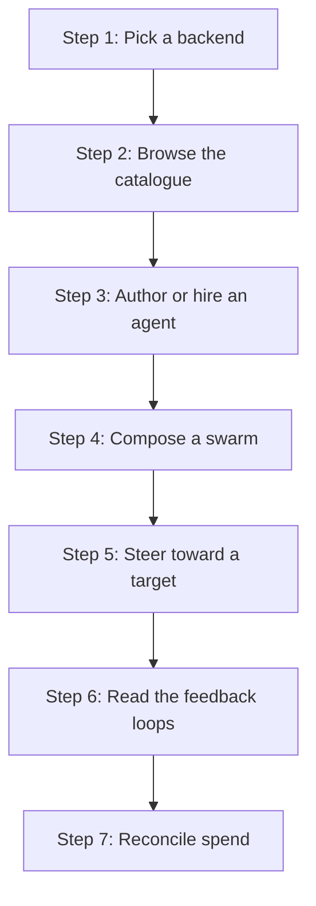

# Swarm Systems — Tutorial: Operate Your First Swarm

This tutorial walks an operator through composing, steering, and reconciling
an agent swarm in zed-kask. You will learn the three components (the panel, the
MCP server, and the two skills), pick a backend, compose a swarm, steer it
toward a target condition, and read the feedback loops that govern its
behavior. By the end you can run a swarm in either backend and know what each
loop is doing.

## What you are operating

The zed-kask swarm system is three components that compose into one feedback
loop:

1. **The Swarm Panel** (`crates/swarm_panel`) — a center-pane `Item` with four
   modes: Browse, Author, Compose, Steer. Open it from the status bar
   (`SwarmPanelButton`, `panel_button.rs:13`) or the View menu's `Toggle`
   action (`swarm_panel.rs:79`).
2. **The swarm MCP server** (`hkask-mcp-swarm`) — 50 tools (27 ABW + 23 local)
   that talk to one of two substrates, selected by `kask.swarm.mode`
   (`swarm_panel.rs:1814`). It is launched by two independent paths
   (`McpRuntime` app-global + `ContextServerStore` per-project) — both correct
   by design.
3. **Two skills** — `swarm-intelligence` (the planner, a 10-step PDCA cascade)
   and `swarm-steering` (the actuator, the execute-and-feed-back directive).

See the [architecture diagram](../../diagrams/flowchart-swarm-architecture.md)
for the component layout and the [feedback-loop map](../../diagrams/flowchart-swarm-feedback-loops.md)
for the loops this tutorial exercises.

## Learning path



<!-- DIAGRAM_ALIGNMENT
id: DIAG-DIA-SWARM-TUT
verified_date: 2026-08-03
verified_against: crates/swarm_panel/src/swarm_panel.rs:79,1814; author.rs:16; compose.rs:14; kask/mcp-servers/hkask-mcp-swarm/src/hkask_mcp_swarm.rs:350
status: VERIFIED
-->

## Step 1: Pick a backend

The backend (`kask.swarm.mode`) selects the substrate, not the tool surface —
all 50 tools are always registered.

- **`abw`** (default): routes to Agent Bestiary World (cloud). Requires the ABW
  Pro-tier API key. Spend is consent-gated and wallet-reconciled.
- **`local`**: runs on the zed-kask substrate — `hkask-inference` + `hkask-ledger`
  (operator-funded SQLite) + `hkask-guard` (I/O scanning). No ABW round-trips.
  The ledger starts at 0; fund it with `swarm_fund_local` before delegating, or
  `swarm_delegate_local` returns `PaymentRequired`. There is no consent token
  in local mode — the balance check is the gate (`swarm_panel.rs:149`).

Toggle it in the panel header (the `Abw`/`Local` buttons call `set_swarm_mode`,
`swarm_panel.rs:1814`). Toggling drops any open Steer conversation so the next
entry rebuilds with the new mode.

## Step 2: Browse the catalogue

`Browse` mode lists agents and swarms. The filter (`SwarmFilter`, `:312`) scopes
the list to All / Swarms / Agents. `fetch_all` (`:578`) pulls both cloud and
local rosters. Use `swarm_list_agents` (ABW) or `swarm_list_local_agents` (local)
under the hood. Clone a cloud agent to local with `swarm_clone_to_local`
(cloud agents carry a `cloud_id` to track the sync link); push a local agent
back with `swarm_push_to_cloud`.

## Step 3: Author or hire an agent

`Author` mode (`author.rs:16`) creates a new agent: name, description,
system prompt, agent type. `create_agent` (`:1907`) calls `swarm_create_agent`
(ABW) or `swarm_create_local_agent` (local). Before hiring in ABW, call
`swarm_hire_cost` and check `within_budget`; if false, raise
`HKASK_ABW_MAX_CREDITS` (default 50) rather than attempting the hire
(`swarm_panel.rs:191`). The panel's `begin_hire`/`confirm_hire` flow
(`:1409`/`:1511`) shows the cost breakdown (base + required + optional).

## Step 4: Compose a swarm

`Compose` mode (`:653`) names the swarm and its mission, then either adds
agents manually or asks Xaman Ek (`ask_xaman`, `:2145`) for suggestions
(`swarm_xaman`). `create_swarm` (`:1973`) calls `swarm_create_swarm`. Compound
agents declare `dependencies { required, optional }` and auto-hire their team.

This is where the `swarm-intelligence` skill earns its keep: in `Steer` mode
it composes the swarm for you via its PDCA cascade. See Step 5.

## Step 5: Steer toward a target

`Steer` mode (`:296`) lazily builds a curator `ConversationView`
(`ensure_steer_conversation`, `:1870`) scoped to the swarm MCP server. Its
system prompt (`steer_system_prompt`, `:100`) tells the Kask Curator about the
50-tool surface, the active backend, and the `swarm-intelligence` skill.

Tell the curator what you want (e.g., "compose a research swarm for the X
task" or "steer my swarm to reduce cost without losing coverage"). The curator
invokes `swarm-intelligence`, which runs SENSE → ORIENT → DECIDE → FILTER → ACT
→ CHECK → CONVERGE → LOOP (see the [PDCA cascade diagram](../../diagrams/flowchart-swarm-pdca-cascade.md)).
Pass the backend in the skill's `context` so the cascade selects the right
data source and gate:

```json
{"mode": "local", "swarm_id": "ws-1"}
```

Without `mode`, the templates default to `abw` and the skill steers the wrong
backend (`swarm_panel.rs:175`). Via slash command:
`/swarm-intelligence mode=local swarm_id=ws-1 compose my swarm`.

If your task has a **deterministic oracle** (test pass/fail, schema validation,
exit code), pass `task_success` in the context as `{"pass": true/false}`. If
the task is open-ended with no oracle, **omit** it — the skill falls back to
the three swarm-health axes and the human Go See loop covers the gap. Never use
an LLM to score `task_success`; the judge must be deterministic (Gap S3 in the
[audit](../../audits/swarm-cybernetics-semantics-audit.md)).

## Step 6: Read the feedback loops

The swarm runs four coupled loops (see the [feedback-loop map](../../diagrams/flowchart-swarm-feedback-loops.md)):

- **Loop A (PDCA convergence):** the planner's inner loop. Converges when the
  swarm-state distance `d` stops moving (`|d_i − d_{i−1}| < 0.03` for 3
  iterations).
- **Loop B (C5/C6 steering):** the actuator. In steering mode the Curator runs
  `swarm_delegate_local` per emitted call, collects `LocalDelegateResult`s, and
  feeds them back as `delegate_results`. This is what activates fault
  attribution (C5) and reconfigure (C6).
- **Loop C (credit/consent algedonic):** the budget loop. A 402 or
  un-acknowledged curator dispatch escalates regardless of `d` — a broken
  algedonic channel is never read as "no deviation."
- **Loop D (Go See):** the human meta-loop. When the second-order monitor (C1)
  detects a reasoning loop or sensor-truth divergence, it recommends `go_see`.
  Descend with the checklist; this is the gap-cover for open tasks.

The two known structural gaps (binary `ok` fidelity on Loop B; C4 latency
sensed but not regulated) are documented in the
[audit](../../audits/swarm-cybernetics-semantics-audit.md) — read it before
relying on Loop B for tasks without an oracle.

## Step 7: Reconcile spend

In ABW mode, `swarm_run_status` and `/api/wallet/transactions` reconcile spend
(`loop_closure = 1.0` requires every dispatch's `estimated_credits` to match).
In local mode, `swarm_balance_local` and `swarm_local_history` are the
reconciliation surface (the local ledger's recent transactions). A depleted
local balance is sensed **reactively** (`PaymentRequired` at delegate time) —
read `swarm_balance_local` before planning a delegation to sense it
proactively (Loop C fidelity, audit Gap C-fidelity).

## Next steps

- [How-to: Compose and Steer a Swarm](./how-to.md) — procedural recipes.
- [Reference: The 50-Tool Surface](./reference.md) — every tool, grouped.
- [Explanation: Why the Loops Are Shaped This Way](./explanation.md) — the
  cybernetic rationale and the two structural gaps.
- [Swarm Cybernetics/Semantics Audit](../../audits/swarm-cybernetics-semantics-audit.md)
  — the full gap + per-property loop analysis.