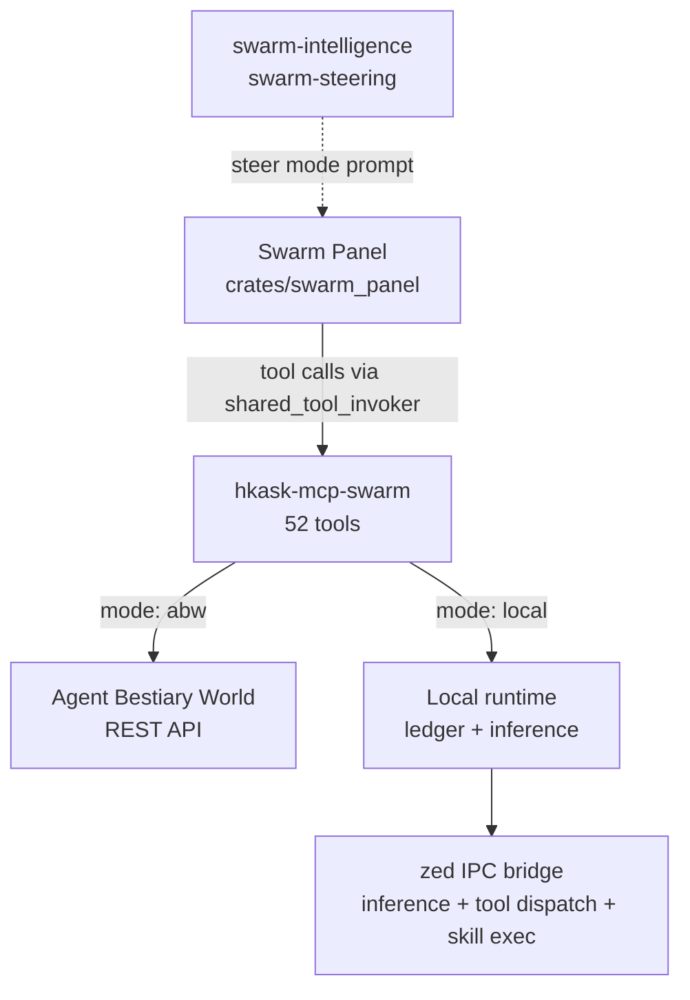
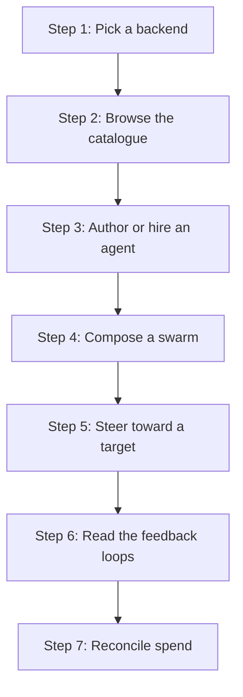
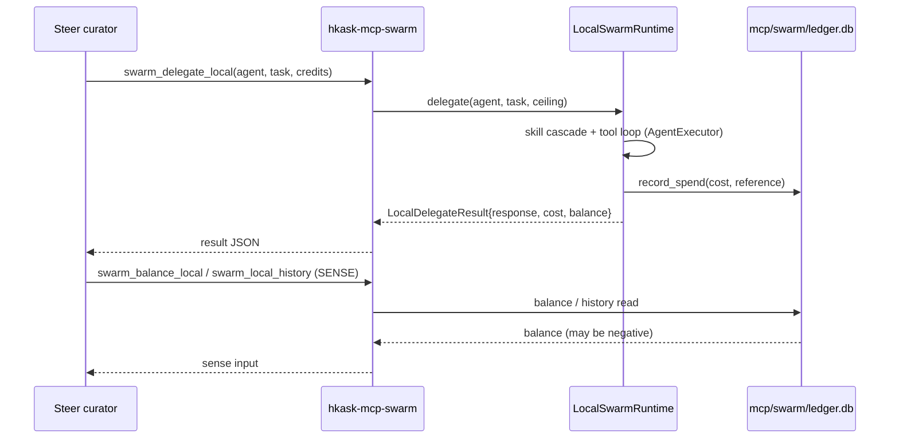

# Swarm Systems — Tutorial: Operate Your First Swarm

This tutorial walks an operator through composing, steering, and reconciling
an agent swarm in zed-kask. You will learn the three components (the panel, the
MCP server, and the two skills), pick a backend, compose a swarm, steer it
toward a target condition, and read the feedback loops that govern its
behavior. By the end you can run a swarm in either backend and know what each
loop is doing.

## What you are operating

The zed-kask swarm system is three components that compose into one feedback
loop:

1. **The Swarm Panel** (`crates/swarm_panel`) — a center-pane `Item` with four
   modes: Browse, Author, Compose, Steer. Open it from the status bar
   (`SwarmPanelButton`, `panel_button.rs:13`) or the View menu's `Toggle`
   action (`swarm_panel.rs:328`).
2. **The swarm MCP server** (`hkask-mcp-swarm`) — 52 tools (27 ABW + 25 local)
   that talk to one of two substrates, selected by `kask.swarm.mode`. It is
   launched by two independent paths (`McpRuntime` app-global +
   `ContextServerStore` per-project) — both correct by design.
3. **Two skills** — `swarm-intelligence` (the planner, a 10-step PDCA cascade)
   and `swarm-steering` (the actuator, the execute-and-feed-back directive).

<!-- DIAGRAM_ALIGNMENT
id: DIAG-SWARM-001
verified_date: 2026-08-13
verified_against: crates/swarm_panel/src/swarm_panel.rs:328,98; kask/mcp-servers/hkask-mcp-swarm/src/hkask_mcp_swarm.rs:122-143,169-352; kask/mcp-servers/hkask-mcp-swarm/src/local_runtime.rs:122-130
status: VERIFIED
-->

## Learning path

<!-- DIAGRAM_ALIGNMENT
id: DIAG-SWARM-002
verified_date: 2026-08-13
verified_against: crates/swarm_panel/src/swarm_panel.rs:387-395; kask/mcp-servers/hkask-mcp-swarm/src/hkask_mcp_swarm.rs:361-434
status: VERIFIED
-->

## Step 1: Pick a backend

The swarm server has two substrates, selected by `kask.swarm.mode` (default
`abw`):

- **`abw`** — Agent Bestiary World cloud. Credits buy someone else's compute.
  Spend is gated by consent tokens (`consent.rs:21-30`) and a per-dispatch
  ceiling (`spend_gate.rs:74-95`).
- **`local`** — your machine, your inference credentials. No consent token, no
  funding gate; the ledger records spend rather than authorizing it
  (`local_runtime.rs:381-396`).

Pick `local` for this tutorial — it works without an ABW API key and lets you
see the loop end-to-end. Set the mode in your settings file or via the panel's
mode switch (`swarm_panel.rs:839-883`).

## Step 2: Browse the catalogue

Open the Swarm Panel from the View menu (`Toggle` action, `swarm_panel.rs:338`)
or the status bar button. The panel starts in `Browse` mode
(`PanelMode::Browse`, `swarm_panel.rs:387-395`) and calls `fetch_all`
(`fetch.rs:21-417`), which dispatches three spawn groups: cloud agents, cloud
swarms, and local swarms. The local agents fetch is chained inside the cloud
agents task to prevent a race where the cloud fetch's `retain` wipes
`Synced`/`Local` entries the local fetch just added (`fetch.rs:33-52`).

In `local` mode you will see local agents from `agents/local/curated/<id>/agent_card.json`
(`local_registry.rs:18-47`) and local swarms from
`agents/local/swarms/<id>/swarm.json` (`local_swarms.rs:28-38`). An empty list
is the normal initial state.

## Step 3: Author or hire an agent

In `Author` mode (`PanelMode::Author`, `swarm_panel.rs:389`) the panel calls
`create_agent` (`swarm_panel.rs:944-1101`), which writes a new
`agent_card.json` to the local registry. The card carries
`capabilities.mcp_tools` (qualified `server/tool` names — the allowlist for
tool dispatch through the zed IPC bridge) and `capabilities.skills` (capped at
3, executed through the zed-side `ManifestExecutor` before the LLM call)
(`local_registry.rs:71-93`).

In `abw` mode you would instead hire an existing ABW agent through the
cost/consent flow (`hire.rs:21-117` for the cost preflight,
`hire.rs:123-272` for the consent-gated hire).

## Step 4: Compose a swarm

Switch to `Compose` mode (`PanelMode::Compose`, `swarm_panel.rs:390`). The
panel calls `create_swarm` (`swarm_panel.rs:1107-1314`), which writes a
`swarm.json` to `agents/local/swarms/<id>/` (`local_swarms.rs:42-49`). A local
swarm is just a named grouping of local agent ids — `members` are
`LocalAgentCard::agent_id` values; resolution to a card happens at delegation
time (`local_swarms.rs:20-27`).

## Step 5: Steer toward a target

Switch to `Steer` mode (`PanelMode::Steer`, `swarm_panel.rs:394`). The panel
builds a system prompt via `steer_system_prompt` (`swarm_panel.rs:148-326`)
that tells the curator agent it is scoped to the `swarm` MCP server and that
the `swarm-intelligence` skill is available for composition/steering. The
curator's `SkillTool` discovers the skill from the `<available_skills>` list
in its base system prompt; this prompt adds the swarm-specific context
(active workspace, current backend mode, the skill's purpose).

The curator runs the `swarm-intelligence` PDCA cascade (planner) and emits a
plan; the `swarm-steering` skill (actuator) takes the plan and produces the
exact `swarm_delegate_local` sequence plus the re-invoke instruction.

## Step 6: Read the feedback loops

<!-- DIAGRAM_ALIGNMENT
id: DIAG-SWARM-003
verified_date: 2026-08-13
verified_against: kask/mcp-servers/hkask-mcp-swarm/src/local_tools.rs:64-107; kask/mcp-servers/hkask-mcp-swarm/src/local_runtime.rs:362-483; kask/mcp-servers/hkask-mcp-swarm/src/ledger_tools.rs:29-118; kask/mcp-servers/hkask-mcp-swarm/src/hkask_mcp_swarm.rs:219-230
status: VERIFIED
-->

The delegation returns a `LocalDelegateResult` carrying `response`, `model`,
`tokens_used`, `cost`, `cost_uncapped`, `balance` (may be `None` on a failed
measurement — never fabricated to 0), `latency_ms`, `tool_calls`, and
`executed_skills` (`local_runtime.rs:495-549`). The SENSE phase reads
`swarm_balance_local` (`ledger_tools.rs:66-89`) and `swarm_local_history`
(`ledger_tools.rs:99-118`) as the sense inputs for the next PDCA iteration.

## Step 7: Reconcile spend

In `local` mode the ledger is accounting, not authorization
(`ledger_tools.rs:1-13`). A negative balance is normal — it is the operator's
unreconciled local spend, not a fault. `swarm_fund_local`
(`ledger_tools.rs:29-53`) deposits credits so the balance reads as "remaining"
rather than "consumed"; it does not gate delegation.

In `abw` mode the spend gate is structural: `authorize_hire` /
`authorize_delegate` (`spend_gate.rs:169-310`, `:377-446`) consume the consent
token, re-verify the cost against ABW, and enforce the per-dispatch ceiling;
`complete_hire` / `complete_delegate` (`spend_gate.rs:317-371`, `:452-480`)
execute the spend and refund the authorization on transient failure.

## Source citations

| Symbol / concept             | Location                                                                |
| ---------------------------- | ----------------------------------------------------------------------- |
| `SwarmPanel` struct          | `crates/swarm_panel/src/swarm_panel.rs:445-513`                        |
| `PanelMode` enum             | `crates/swarm_panel/src/swarm_panel.rs:387-395`                         |
| `init` (View menu wiring)    | `crates/swarm_panel/src/swarm_panel.rs:328-374`                          |
| `fetch_all` (3 spawn groups) | `crates/swarm_panel/src/fetch.rs:21-417`                                 |
| `create_agent` / `create_swarm` | `crates/swarm_panel/src/swarm_panel.rs:944-1101` / `:1107-1314`       |
| `steer_system_prompt`        | `crates/swarm_panel/src/swarm_panel.rs:148-326`                         |
| `begin_hire` / `confirm_hire` | `crates/swarm_panel/src/hire.rs:21-117` / `:123-272`                    |
| `SwarmServer` struct         | `kask/mcp-servers/hkask-mcp-swarm/src/hkask_mcp_swarm.rs:122-129`        |
| `combined_router` (52 tools) | `kask/mcp-servers/hkask-mcp-swarm/src/hkask_mcp_swarm.rs:132-140`       |
| `run` (server entry)         | `kask/mcp-servers/hkask-mcp-swarm/src/hkask_mcp_swarm.rs:169-352`        |
| `LocalAgentCard`             | `kask/mcp-servers/hkask-mcp-swarm/src/local_registry.rs:18-47`          |
| `LocalSwarm`                 | `kask/mcp-servers/hkask-mcp-swarm/src/local_swarms.rs:28-38`            |
| `LocalSwarmRuntime::delegate` | `kask/mcp-servers/hkask-mcp-swarm/src/local_runtime.rs:362-483`         |
| `LocalDelegateResult`        | `kask/mcp-servers/hkask-mcp-swarm/src/local_runtime.rs:495-549`         |
| `swarm_fund_local` / `swarm_balance_local` / `swarm_local_history` | `kask/mcp-servers/hkask-mcp-swarm/src/ledger_tools.rs:29` / `:66` / `:99` |
| `ConsentGrant`               | `kask/mcp-servers/hkask-mcp-swarm/src/consent.rs:21-30`                 |
| `SpendAuth` / `Settlement`   | `kask/mcp-servers/hkask-mcp-swarm/src/spend_gate.rs:35-77`               |
| `authorize_hire` / `complete_hire` | `kask/mcp-servers/hkask-mcp-swarm/src/spend_gate.rs:169` / `:317`   |
| Ledger path default (D28)    | `kask/mcp-servers/hkask-mcp-swarm/src/hkask_mcp_swarm.rs:219-230`       |
| Consent store path (D28)     | `kask/mcp-servers/hkask-mcp-swarm/src/hkask_mcp_swarm.rs:154-167`        |
