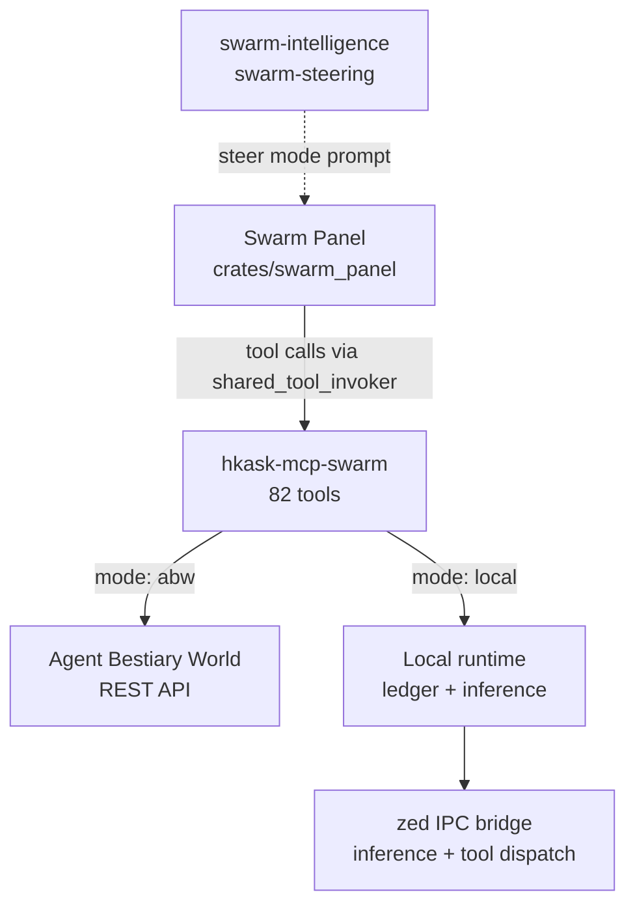
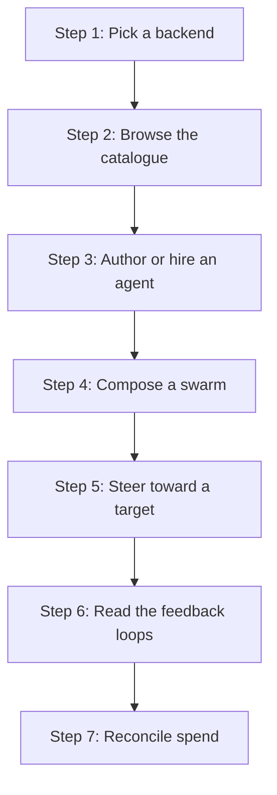
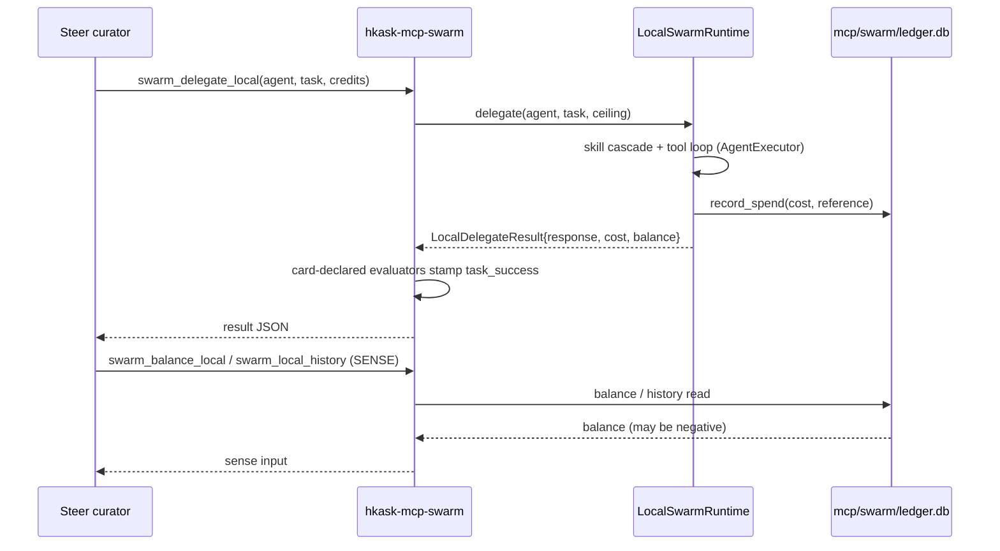

# Swarm Systems — Tutorial: Operate Your First Swarm

This tutorial walks an operator through composing, steering, and reconciling
an agent swarm in zed-kask. You will learn the three components (the panel,
the MCP server, and the two skills), pick a backend, compose a swarm, steer
it toward a target condition, and read the feedback loops that govern its
behavior. By the end you can run a swarm in either backend and know what
each loop is doing.

## What you are operating

The zed-kask swarm system is three components that compose into one feedback
loop:

1. **The Swarm Panel** (`crates/swarm_panel`) — a center-pane `Item` with
   five modes: Browse, Author, Compose, AppAuthor, Steer
   (`swarm_panel.rs:494-507`). Open it from the status bar or the View
   menu's `Toggle` action (wired in `init`, `swarm_panel.rs:315`).
2. **The swarm MCP server** (`hkask-mcp-swarm`) — 82 tools (47 cloud + 35
   local; the count is generated by `build.rs:30-31` into `TOOL_NAMES`,
   included at `hkask_mcp_swarm.rs:113`) that talk to one of two
   substrates, selected by `kask.swarm.mode`. It is launched by two
   independent paths (`McpRuntime` app-global + `ContextServerStore`
   per-project) — both correct by design. Note: the panel itself no longer
   gates any capability on the mode — both backends are always available to
   it (`swarm_panel.rs:391-392`).
3. **Two skills** — `swarm-intelligence` (the planner, a PDCA cascade) and
   `swarm-steering` (the actuator, the execute-and-feed-back directive).

<!-- DIAGRAM_ALIGNMENT
id: DIAG-SWARM-001
verified_date: 2026-08-28
verified_against: crates/swarm_panel/src/swarm_panel.rs:315,494-507; kask/mcp-servers/hkask-mcp-swarm/src/hkask_mcp_swarm.rs:113,153-171,201-420; kask/mcp-servers/hkask-mcp-swarm/build.rs:30-31
status: VERIFIED
-->

## Learning path

<!-- DIAGRAM_ALIGNMENT
id: DIAG-SWARM-002
verified_date: 2026-08-28
verified_against: crates/swarm_panel/src/swarm_panel.rs:494-507; kask/mcp-servers/hkask-mcp-swarm/src/hkask_mcp_swarm.rs:113
status: VERIFIED
-->

## Step 1: Pick a backend

The swarm server has two substrates, selected by `kask.swarm.mode`
(default `abw`, `config.rs:145`):

- **`abw`** — Agent Bestiary World cloud. Credits buy someone else's
  compute. Spend is gated by consent tokens (`consent.rs:21-30`) and a
  per-dispatch ceiling (`spend_gate.rs:1-22`).
- **`local`** — your machine, your inference credentials. No consent
  token, no funding gate; the ledger records spend rather than authorizing
  it (`local_runtime.rs:492-507`).

Pick `local` for this tutorial — it works without an ABW API key and lets
you see the loop end-to-end. Set `kask.swarm.mode` in your settings file;
the panel reads the setting into `last_swarm_mode`
(`swarm_panel.rs:722`) and surfaces it in the Steer prompt, but does not
gate any panel capability on it (`swarm_panel.rs:391-392`).

## Step 2: Browse the catalogue

Open the Swarm Panel from the View menu or the status bar button. The panel
starts in `Browse` mode (`PanelMode::Browse`, `swarm_panel.rs:494`) and
calls `fetch_all` (`fetch.rs:21`). The fetches are sequenced, not racing:
the cloud swarms fetch runs after the cloud agents fetch (so the API-key
status is known before failure handling runs), and the local agents fetch
is chained inside the same task so the cloud fetch's `retain` cannot wipe
`Synced`/`Local` entries the local fetch just added (`fetch.rs:37-52`).

In `local` mode you will see local agents from
`mcp/swarm/agents/curated/<id>/agent_card.json` (default
`local_agents_dir`, `config.rs:151`) and local swarms from
`mcp/swarm/swarms/<id>/swarm.json` (`config.rs:152`). An empty list is the
normal initial state — a missing directory yields zero entries, not an
error (`hkask_mcp_swarm.rs:232-235`).

## Step 3: Author or hire an agent

In `Author` mode (`PanelMode::Author`, `swarm_panel.rs:495`) the panel
calls `create_agent` (`swarm_panel.rs:1398`), which writes a new
`agent_card.json` to the local registry. The card carries
`capabilities.mcp_tools` (qualified `server/tool` names — the allowlist for
tool dispatch; a call for a tool not listed is never dispatched,
`agent_executor.rs:211-233`), `capabilities.skills`, and optionally
`capabilities.evaluators` (card-declared deterministic oracles,
`local_registry.rs:158-166`) and `capabilities.reasoning` (opt-in
`reasoning/think` tool, `local_registry.rs:167-176`). Cards also carry
typed `accepts`/`produces` port labels, which must resolve to a registered
type at admission (`validate_typing`, `local_registry.rs:46-63`).

In `abw` mode you would instead hire an existing ABW agent through the
cost/consent flow (`hire.rs:21` for the cost preflight, `hire.rs:123` for
the consent-gated hire).

## Step 4: Compose a swarm

Switch to `Compose` mode (`PanelMode::Compose`, `swarm_panel.rs:496`). The
panel calls `create_swarm` (`swarm_panel.rs:1596`), which writes a
`swarm.json` to the swarms directory. A local swarm is a named grouping of
local agent ids — `members` are `LocalAgentCard::agent_id` values, each
with a provenance entry in `member_sources` (`local_swarms.rs:35-52`);
resolution to a card happens at delegation time.

## Step 5: Steer toward a target

Switch to `Steer` mode (`PanelMode::Steer`, `swarm_panel.rs:504`). The
panel calls `ensure_steer_conversation` (`swarm_panel.rs:1303`), which
delegates to `hkask_steer::ensure_steer` (`swarm_panel.rs:1305`) — the
shared Steer-surface helper that verifies the prompt's tool advertisement
against the server's generated `TOOL_NAMES` and lands the scoped curator
conversation. The system prompt is built by `steer_system_prompt`
(`swarm_panel.rs:155`), which tells the curator agent it is scoped to the
`swarm` MCP server, names the current backend mode, and that the
`swarm-intelligence` skill is available for composition/steering.

The curator runs the `swarm-intelligence` PDCA cascade (planner) and emits
a plan; the `swarm-steering` skill (actuator) takes the plan and produces
the exact `swarm_delegate_local` sequence plus the re-invoke instruction.

## Step 6: Read the feedback loops

<!-- DIAGRAM_ALIGNMENT
id: DIAG-SWARM-003
verified_date: 2026-08-28
verified_against: kask/mcp-servers/hkask-mcp-swarm/src/local_tools.rs:176-282; kask/mcp-servers/hkask-mcp-swarm/src/local_runtime.rs:473-519,536-600; kask/mcp-servers/hkask-mcp-swarm/src/ledger_tools.rs:29-133; kask/mcp-servers/hkask-mcp-swarm/src/hkask_mcp_swarm.rs:269-280
status: VERIFIED
-->

The delegation returns a `LocalDelegateResult` carrying `agent_id`,
`response`, `model`, `tokens_used`, `cost`, `cost_uncapped`, `balance`
(`None` on a failed measurement — never fabricated to 0,
`local_runtime.rs:531-535`), `latency_ms`, `tool_calls`, `task_success`,
`bind_matched`, `rollout_id`, and `reasoning_steps`
(`local_runtime.rs:740-815`). When the agent's card declares evaluators,
the server runs them and stamps `task_success` with
`provenance: DeterministicEvaluator` (`local_tools.rs:214-240`) — the card
carries its own oracle. The SENSE phase reads `swarm_balance_local`
(`ledger_tools.rs:71`) and `swarm_local_history` (`ledger_tools.rs:109`)
as the sense inputs for the next PDCA iteration, and `swarm_task_board`
(`local_tools.rs:2176`) reads durable per-task progress written by
`swarm_execute_plan_local`.

## Step 7: Reconcile spend

In `local` mode the ledger is accounting, not authorization
(`ledger_tools.rs:4-13`). A negative balance is normal — it is the
operator's unreconciled local spend, not a fault. `swarm_fund_local`
(`ledger_tools.rs:29`) deposits credits so the balance reads as "remaining"
rather than "consumed"; it does not gate delegation.

In `abw` mode the spend gate is structural: `authorize_hire` /
`authorize_delegate` (`spend_gate.rs:169` / `:377`) consume the consent
token, re-verify the cost against ABW, and enforce the per-dispatch
ceiling; `complete_hire` / `complete_delegate` (`spend_gate.rs:317` /
`:452`) execute the spend and refund the authorization on transient
failure.

## Source citations

| Symbol / concept             | Location                                                                |
| ---------------------------- | ----------------------------------------------------------------------- |
| `SwarmPanel` struct          | `crates/swarm_panel/src/swarm_panel.rs:611`                              |
| `PanelMode` enum (5 modes)   | `crates/swarm_panel/src/swarm_panel.rs:494-507`                         |
| `init` (View menu wiring)    | `crates/swarm_panel/src/swarm_panel.rs:315`                             |
| `fetch_all` (sequenced fetches) | `crates/swarm_panel/src/fetch.rs:21-52`                              |
| `create_agent` / `create_swarm` | `crates/swarm_panel/src/swarm_panel.rs:1398` / `:1596`              |
| `steer_system_prompt`        | `crates/swarm_panel/src/swarm_panel.rs:155`                             |
| `ensure_steer_conversation` | `crates/swarm_panel/src/swarm_panel.rs:1303-1309`                       |
| `begin_hire` / `confirm_hire` | `crates/swarm_panel/src/hire.rs:21` / `:123`                           |
| `SwarmServer` struct         | `kask/mcp-servers/hkask-mcp-swarm/src/hkask_mcp_swarm.rs:153-161`        |
| `combined_router` (82 tools) | `kask/mcp-servers/hkask-mcp-swarm/src/hkask_mcp_swarm.rs:165-171`        |
| `TOOL_NAMES` (generated)     | `kask/mcp-servers/hkask-mcp-swarm/src/hkask_mcp_swarm.rs:113`            |
| `run` (server entry)         | `kask/mcp-servers/hkask-mcp-swarm/src/hkask_mcp_swarm.rs:201-420`        |
| `LocalAgentCard`             | `kask/mcp-servers/hkask-mcp-swarm/src/local_registry.rs:74-112`         |
| `LocalSwarm`                 | `kask/mcp-servers/hkask-mcp-swarm/src/local_swarms.rs:35-52`            |
| `LocalSwarmRuntime::delegate` | `kask/mcp-servers/hkask-mcp-swarm/src/local_runtime.rs:473-519`       |
| `LocalDelegateResult`        | `kask/mcp-servers/hkask-mcp-swarm/src/local_runtime.rs:740-815`         |
| `swarm_fund_local` / `swarm_balance_local` / `swarm_local_history` | `kask/mcp-servers/hkask-mcp-swarm/src/ledger_tools.rs:29` / `:71` / `:109` |
| `ConsentGrant`               | `kask/mcp-servers/hkask-mcp-swarm/src/consent.rs:21-30`                 |
| `SpendAuth` / `Settlement`   | `kask/mcp-servers/hkask-mcp-swarm/src/spend_gate.rs:35-38` / `:74-77`   |
| `authorize_hire` / `complete_hire` | `kask/mcp-servers/hkask-mcp-swarm/src/spend_gate.rs:169` / `:317` |
| Ledger path default (D28)    | `kask/mcp-servers/hkask-mcp-swarm/src/hkask_mcp_swarm.rs:269-280`       |
| Consent store path (D28)     | `kask/mcp-servers/hkask-mcp-swarm/src/hkask_mcp_swarm.rs:186-199`       |