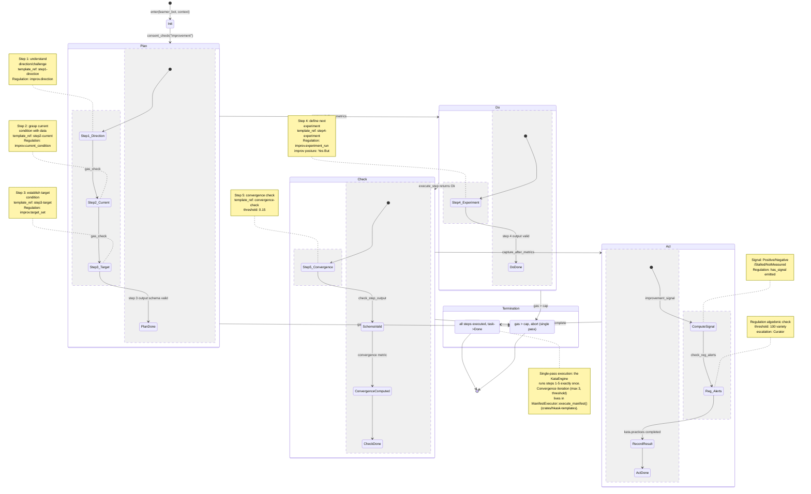
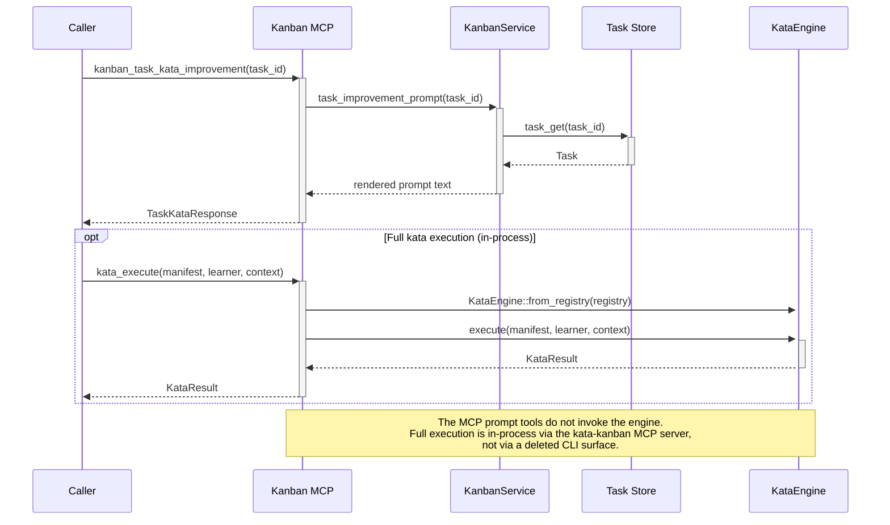
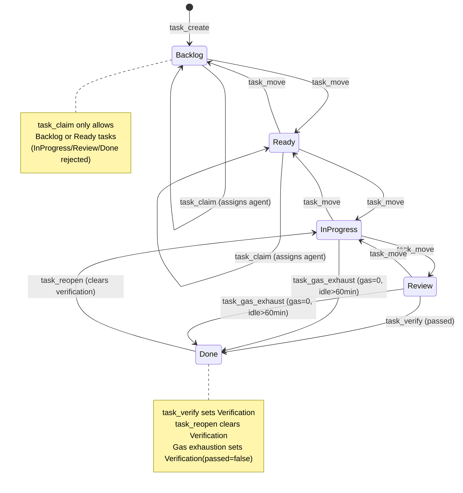

# Skills and Composition

Design, invoke, audit, publish, and compose hKask skills. Skills are PDCA (Plan-Do-Check-Act) templates loaded from a two-zone model and executed in-process by the `BridgeManifestExecutor` (D1), which implements the `SkillManifestExecutor` trait defined in zed's `agent` crate. This guide also covers building MCP servers that provide tool surfaces for skills and agents — in zed-kask, MCP servers register as builtin in-process servers inside the editor, not as standalone binaries started via a CLI.

---

## Skill Anatomy

A skill consists of three layers:

```
.agents/skills/my-skill/               ← Private zone (source of truth)
├── SKILL.md                            ← YAML front matter + markdown body

registry/templates/my-skill/            ← Registry layer (canonical per P5.1)
├── manifest.yaml                       ← FlowDef manifest
└── *.j2                                ← Jinja2 templates
```

- **`SKILL.md`** has YAML front matter (`name`, `visibility`, `namespace`, `description`) and a markdown body. It is a generated companion for development tooling.
- **`manifest.yaml`** declares the template set and, for FlowDef skills, convergence criteria and energy budget.
- **`*.j2` files** are Jinja2 templates rendered at invocation time with context variables.

### Two-Zone Model

| Zone | Directory | Purpose |
|------|-----------|---------|
| Private | `.agents/skills/` | Source of truth, author's working copies |
| Public | `skills/` | Export surface, generated by the skill publish workflow (the former `kask skill publish` CLI has been removed; publishing is now handled in-process or via the skill maintenance tooling) |

```
.agents/skills/                    (private zone — source of truth)
├── coding-guidelines/
│   └── SKILL.md
├── diagnose/
│   └── SKILL.md
└── ...

skills/                             (public zone — export surface)
├── mdz-axolotl--bugstalker/
│   └── SKILL.md  (visibility: public, namespace: mdz-axolotl)
└── ...

registry/templates/                 (registry layer — canonical source per P5.1)
├── coding-guidelines/
│   ├── manifest.yaml
│   └── *.j2
├── diagnose/
│   ├── manifest.yaml
│   └── *.j2
└── ...
```

**P5.1 rule:** The registry crate (`manifest.yaml` + `*.j2`) is the canonical source. `SKILL.md` is a generated companion. When they disagree, the registry is authoritative.

### Skill Domain Types

Skills fall into three domains, inferred from their registry manifest by `SkillLoader::infer_domain_from_registry()`:

| Domain | Template Type | Behavior |
|--------|--------------|----------|
| **FlowDef** | `FlowDef` | PDCA cycle with convergence threshold, energy budget, and loop action — the skill iterates autonomously |
| **KnowAct** | `KnowAct` | Knowledge-action template — provides reasoning guidance (one-shot) |
| **WordAct** | `WordAct` | Word-action template — provides language-level guidance (one-shot) |

FlowDef is the most powerful: it runs until it converges on a quality threshold, exhausts its energy budget, or escalates to the Curator.

Domain inference rules:
- If any `FlowDef` template exists in `manifest.yaml` → `FlowDef`
- Else if any `KnowAct` template exists → `KnowAct`
- Else if any `WordAct` template exists → `WordAct`
- Else (no registry layer) → `KnowAct` (reasoning companion)

---

## Listing and Checking Skills

Skill listing, status, and auditing are performed in-process through the zed-kask agent panel, the kask panel (D10), or the skill maintenance tooling. The former `kask skill list`, `kask skill status`, and `kask skill audit` standalone CLI commands have been removed.

### List Available Skills

Invoke the skill-listing surface from the agent panel or kask panel. The output shows the two-zone layout (private `.agents/skills/` and public `skills/`) with visibility, namespace, and content hash per skill:

```
  private zone (.agents/skills/):
    coding-guidelines           visibility=private  namespace=-              hash=abc123def456
    diagnose                    visibility=private  namespace=-              hash=789012abc345
    ...

  public zone (skills/):
    mdz-axolotl--bugstalker     visibility=public   namespace=mdz-axolotl   hash=def456abc123
    ...
```

Filter by visibility through the panel's filter controls.

### Check Skill Status

Compare private source vs. published copy by querying the skill status surface with a skill name. The output reports whether the private and public zones are in sync:

```
Skill: diagnose
  Private zone: .agents/skills/diagnose
  Visibility:   private
  Source hash:  abc123def456
  Public zone:  (not published)
  Status:       private (not exported)
```

When published and in sync:

```
  Public zone:  skills/mdz-axolotl--diagnose
  Published by: mdz-axolotl
  Public hash:  abc123def456
  Status:       in sync
```

When stale:

```
  Status:  local changes since last publish — re-publish to update
```

### Skill Auditing

Run a dual-layer audit to check skill health through the skill maintenance tooling or agent panel. The audit checks:
- Registry manifest presence (`registry/templates/<id>/manifest.yaml`)
- Template file existence (Jinja2 `.j2` files referenced in manifest)
- Content hash consistency between private and public zones
- SKILL.md front matter validity

Output example:

```
Skill audit report (fail_below=0.80)

skill                          score         status active defects
my-skill                        1.00         active    yes 0
coding-guidelines               1.00         active    yes 0
diagnose                        0.85         active    yes 1
    - Template "analyze.j2" referenced in manifest but not found
```

The audit can fail below a configurable threshold (default 0.8) and emit JSON for CI consumption.

---

## Designing a Skill

### Writing a `manifest.yaml`

Create `registry/templates/my-skill/manifest.yaml`:

```yaml
# Manifest for my-skill
templates:
  - path: plan.j2
    type: FlowDef
  - path: do.j2
    type: FlowDef
  - path: check.j2
    type: FlowDef
  - path: act.j2
    type: FlowDef

# FlowDef-specific fields
convergence:
  threshold: 0.05        # Output delta must drop below this to converge
  max_iterations: 10     # Hard cap on PDCA iterations

gas:
  cap: 500               # Maximum energy budget in abstract units
  per_iteration: 50      # Energy reserved per iteration

loop:
  action: "If not converged, iterate with refined context"
```

**Convergence threshold** controls when the PDCA cycle stops. After each iteration, the output delta (difference from the previous iteration) is measured. If delta < threshold, the skill converges and returns its output.

- **Threshold = 0.0**: converge on zero delta (exact match to previous output)
- **Threshold = 0.05**: converge when outputs are 95%+ similar (typical for reasoning skills)
- **Threshold = 0.10+**: converge earlier (use for skills where refinement has diminishing returns)

**Gas budget** represents the skill's energy budget. Each iteration reserves a portion. The PDCA cycle stops when gas is exhausted. Gas uses a hold-settle pattern: reserved before invocation, settled after, with refunds for over-estimates.

**Loop action** is a natural-language instruction injected between PDCA iterations. It guides the LLM on how to refine its approach based on the previous output.

### Writing Templates (`.j2` Files)

Templates are Jinja2 files rendered with context variables at invocation time. The standard PDCA structure:

**`plan.j2` — Plan phase:**

```jinja2
You are executing the "my-skill" skill. This is the PLAN phase.

Context: {{ context }}

Based on the context above, develop a structured plan for achieving the goal.
Consider:
1. What information is needed
2. What tools should be used
3. What intermediate outputs are required

Return your plan as a numbered list.
```

**`do.j2` — Do phase:**

```jinja2
You are executing the "my-skill" skill. This is the DO phase.

Plan:
{{ plan_output }}

Context: {{ context }}

Execute the plan above. Use the available tools. Report your results.
```

**`check.j2` — Check phase:**

```jinja2
You are executing the "my-skill" skill. This is the CHECK phase.

Expected outcome: {{ plan_output }}
Actual outcome: {{ do_output }}

Evaluate:
1. Did the execution match the plan?
2. Are the results complete and correct?
3. What gaps or errors exist?

Return a concise assessment.
```

**`act.j2` — Act phase:**

```jinja2
You are executing the "my-skill" skill. This is the ACT phase.

Assessment: {{ check_output }}

Based on the assessment:
1. If issues were found, propose corrective actions
2. If complete, produce the final output
3. If stuck, request escalation to the Curator

Return your action.
```

### Context Variables

The following context variables are automatically available during template rendering:

| Variable | Source | Description |
|----------|--------|-------------|
| `{{ context }}` | User-supplied | The original invocation context (query, prompt, parameters) |
| `{{ plan_output }}` | Previous PDCA phase | Output from the Plan phase |
| `{{ do_output }}` | Previous PDCA phase | Output from the Do phase |
| `{{ check_output }}` | Previous PDCA phase | Output from the Check phase |
| `{{ iteration }}` | FlowDef engine | Current PDCA iteration number |

### Writing the `SKILL.md`

Create `.agents/skills/my-skill/SKILL.md`:

```markdown
---
name: my-skill
visibility: private
namespace: my-namespace
description: A custom PDCA skill for automated code review
---

# My Skill

This skill performs an automated code review using a PDCA cycle:
- **Plan:** Analyze the code structure and identify review targets
- **Do:** Execute the review using available tools
- **Check:** Validate findings against quality criteria
- **Act:** Produce a review report with recommendations
```

The `visibility` field controls where the skill appears:

| Value | Zone | Description |
|-------|------|-------------|
| `private` | `.agents/skills/` only | Author's working copy; not exported |
| `public` | Both zones | Available to all; published to `skills/` |
| `shared` | Both zones | Available to authenticated agents |

### Deriving SKILL.md from the Registry

The skill-maintenance tooling reverse-translates the SKILL.md companion from the registry crate. It reads `registry/templates/<name>/manifest.yaml` + `*.j2`, renders the `skill-maintenance/skill-maintenance-reverse` KnowAct template, infers the SKILL.md content via the default model, and writes `.agents/skills/<name>/SKILL.md`. This is the P5.1 derivation path — SKILL.md is generated, not hand-authored. The former `kask skill derive` CLI has been removed; derivation is invoked through the skill-maintenance skill or the agent panel.

---

## Testing a Skill Locally

### Step 1: Verify Discovery

List skills through the agent panel or kask panel (D10). Your skill should appear in the private zone.

### Step 2: Check Status

Query the skill status surface for your skill name to confirm the private/public zone state.

### Step 3: Audit Health

Run the skill audit through the skill-maintenance tooling to verify manifest/template consistency.

### Step 4: Invoke from the Agent Panel

Open the zed-kask agent panel and invoke the skill:

```
/skill my-skill "Review the authentication module in src/auth.rs"
```

The agent panel routes this through the in-process `BridgeManifestExecutor` (D1, implementing the `SkillManifestExecutor` trait):

1. **Lookup** — Skill ID resolved against the loaded registry
2. **Template rendering** — Jinja2 templates rendered with context variables
3. **System prompt prepended** — Tool-awareness preamble added automatically
4. **Inference** — Rendered template sent to the inference port via the guard layer (D4) (`temperature: 0.3`, `max_tokens: 2048`)
5. **Regulation span** — `reg.tool.skill_execute` emitted

---

## Publishing Skills

To make a private skill available in the public zone, use the skill-maintenance tooling or agent panel publish workflow (the former `kask skill publish` CLI has been removed). Publishing:

1. Copies the skill directory from `.agents/skills/<name>/` to `skills/<namespace>--<name>/`
2. Sets `visibility: public` in the published copy's SKILL.md
3. Sets `namespace` to the current agent name
4. Emits a `reg.skill` span (`skill_published`)

After publishing, verify by querying the skill status surface for your skill name.

---

## Invoking Skills

Skills are invoked in-process through the `BridgeManifestExecutor` (D1, implementing the `SkillManifestExecutor` trait), which is wired into zed-kask's `agent_skills` and `agent/tools/skill_tool.rs`. The former `kask skill execute` CLI and the `hkask-mcp-skill` MCP server have been removed — skill execution is now native, not routed through a separate MCP server. The `SkillTool` resolves the executor at invocation time (not session-creation time) so sessions created before the deferred post-login wiring pick up the executor on later invocations.

### Via the Agent Panel

Open the zed-kask agent panel and invoke a skill:

```
/skill diagnose "My application crashes on startup"
```

The agent panel routes this through the `skill_tool`, which calls the `BridgeManifestExecutor` directly in-process. Alternatively, skills can be invoked through bundles:

```
/bundle diagnose coding-guidelines
```

### Via the Kask Panel

In the kask panel (D10), navigate to the skills surface, select a skill, and invoke it with context. The kask panel routes through the same in-process `BridgeManifestExecutor` (D1) as the agent panel.

### What Happens During Execution

When a skill is invoked in-process:

1. **Lookup** — The skill ID is resolved against the loaded registry of `SkillDef` entries. The `BridgeManifestExecutor::has_manifest()` check determines whether a `registry/manifests/<name>.yaml` exists; if so, the cascade runs. If not, the `SkillTool` returns the no-manifest envelope (body injection is disabled in zed-kask — the SKILL.md body is never injected).
2. **Task injection** — The user's task (from `SkillToolInput.task`) is injected into the cascade context as `task` so templates can reference `{{ task }}` instead of running blind.
3. **Template rendering** — The skill's Jinja2 template is rendered with the provided context variables.
4. **System prompt prepended** — A tool-awareness preamble is added:

   ```
   You are executing a skill template. Follow its instructions precisely.
   The calling agent has access to MCP tools including filesystem
   (fs.read, fs.write, fs.edit, fs.search, shell.exec), memory
   (episodic/semantic recall), web search, and context condensation.
   If the skill references tools outside this set, adapt the approach
   or report the missing capability.
   ```

5. **Inference** — The rendered template is sent to the inference port via the guard layer (D4) with `temperature: 0.3`, `max_tokens: 2048`.
6. **Final-result extraction** — The `BridgeManifestExecutor` extracts the final step result via `extract_final_step_result()`, which parses the ordinal from `step_N_result` keys and picks the highest (HashMap iteration order is randomized, so `values().last()` would pick an arbitrary step).
7. **Regulation span** — `reg.tool.skill_execute` is emitted with the skill ID and result.

### Convergence (FlowDef Skills Only)

FlowDef skills have a convergence threshold declared in their manifest. The PDCA cycle iterates until:

1. The output delta between iterations falls below the convergence threshold, OR
2. The energy budget is exhausted, OR
3. The maximum iteration count is reached

Convergence is validated by `FlowDefValidationReport` in `hkask-types::flowdef_validation`.

### Gas Consumption

Every skill execution consumes **gas** from the agent's energy budget:

1. `McpRuntime::invoke` / `ToolGovernance` estimates cost via `EnergyEstimator::estimate_cost()`
2. Gas is **reserved** before invocation (hold-settle pattern)
3. After invocation, actual gas is **settled** — if actual < reserved, the difference is refunded

Gas consumption is observable via Regulation spans. Query the in-process Regulation span surface (kask panel or agent panel) and look for `reg.tool.invoked` (pre-invocation) and `reg.tool.completed` (post-invocation with settled cost). The former `kask regulation alerts` CLI has been removed.

### Error Handling

| Error | Cause | Resolution |
|-------|-------|------------|
| `Skill 'X' not found` | Skill ID not in the loaded registry | List skills through the agent panel to see available IDs; ensure zed-kask was launched from the skill's project root |
| `Inference failed` | Inference port error | Check inference backend configuration via zed-kask's `CredentialsProvider` (D9); ensure the provider API key is set |
| `Template render error` | Jinja2 syntax error in skill template | Run the skill audit through the skill-maintenance tooling to detect template drift |

---

## Composing Skill Bundles

Bundle composition is driven in-process by the **skill-bundler** skill, which uses the bundle types in `crates/hkask-templates/src/bundle/`. The former `BundleService` in the deleted `hkask-services-skill` crate and the `kask bundle compose/list/show/apply/evolve/skills/off` CLI commands have been removed.

### Creating a Bundle

Invoke the skill-bundler skill from the agent panel with the skills to compose:

```
skill: skill-bundler
skills: coding-guidelines,idiomatic-rust
name: rust-review-bundle
visibility: shared
```

The skill-bundler performs inference-driven analysis to produce a coordinated `BundleManifest`.

### Creating a Bundle Programmatically

The bundle composition types (`BundleManifest`, `BundleConflict`, `BundleComplementarity`, cascade ordering) live in `crates/hkask-templates/src/bundle/`. In-process code can construct and validate a `BundleManifest` directly:

```rust
use hkask_templates::bundle::manifest::BundleManifest;
use hkask_types::Visibility;

// Construct or load a BundleManifest, then validate it.
let manifest: BundleManifest = /* ... */;
let report = manifest.validate();
assert!(report.is_valid());
```

The former `BundleService::compose()` entry point (which drove the LLM-based composition) was removed with `hkask-services-skill`; use the skill-bundler skill for inference-driven composition.

### What Happens During Composition

The `compose()` method performs these steps:

1. **Resolve skills** from the registry — validates that all skill IDs exist
2. **Smart deduplication** — checks if a bundle with these exact skills already exists; returns it with a warning if so
3. **Polarity classification** — each skill is classified as Generative, Evaluative, Regulative, or Procedural
4. **Conflict detection** — identifies conflicting skill polarities and declares resolutions
5. **Complementarity identification** — finds skills that enhance each other
6. **Phase separation** — skills are organized into Pre → Core → Post cascade phases
7. **Inference-driven manifest generation** — the LLM produces a `BundleManifest` JSON
8. **Validation** — the manifest passes through `BundleManifest::validate()`
9. **Registration** — the bundle is stored in `BundleRegistryIndex`

### Cascade Ordering

The composition prompt enforces these ordering rules:

- Divergent (Generative) and convergent (Evaluative) skills must not share a phase
- Cascade depth must not exceed 7
- At least one Procedural (productive) skill is required
- Each skill may have ≤10 lexicon terms
- A convergence criterion must be declared

The resulting manifest's `steps` array carries `phase` (Pre/Core/Post), `ordinal`, `action`, `gas_cap`, and `timeout_seconds` for each step in the cascade.

### Bundle Management

Bundle management (list, show, apply, evolve) is performed in-process through the agent panel or kask panel (D10). The former `kask bundle list/show/apply/evolve/skills/off` CLI commands have been removed. Bundles are session-scoped: applying a bundle activates its cascade for the current agent session; deactivating is a no-op since bundles do not persist beyond the session.

### Bundle Manifest Structure

```json
{
  "id": "rust-review-bundle",
  "name": "Rust Review Bundle",
  "description": "Reviews Rust code against idiomatic patterns and coding guidelines",
  "version": "1.0.0",
  "editor": "alice",
  "visibility": "shared",
  "skills": [
    {"id": "coding-guidelines", "polarity": "regulative", "lexicon_terms": [...]},
    {"id": "idiomatic-rust", "polarity": "evaluative", "lexicon_terms": [...]}
  ],
  "conflicts": [],
  "complementarities": [],
  "steps": [
    {"ordinal": 1, "action": "analyze", "phase": "pre", "gas_cap": 2000},
    {"ordinal": 2, "action": "review", "phase": "core", "gas_cap": 5000}
  ]
}
```

### Testing Composed Skills

1. **Check warnings**: `result.warnings` contains zone-visibility mismatches and composition notes
2. **Verify validation**: If `manifest.validate().is_valid()` fails, inspect `validation.errors`
3. **Test cascade execution**: Run each step in order and verify outputs match expectations
4. **Check idempotency**: Composing the same skill set twice returns the existing bundle

---

## Skill Routing and Discovery

Two meta-skills govern how tasks find the right skills: **skill-router** matches tasks to installed skills, and **skill-discovery** acquires new skills when gaps are found. They compose in a feedback loop.

### How It Works

```
task-breakdown (decompose)
  → emits skill_match_query per slice
    → skill-router (match)
      → full coverage → ranked recommendations with invocation hints
      → partial/none → uncovered_capabilities
        → skill-discovery (detect-gap → search → evaluate → install)
          → new skill installed → catalog grows → router has better coverage
```

### skill-router

Given a task description and the installed skill catalog, skill-router scores each skill 0.0–1.0 on three dimensions:

| Dimension | Weight | What it measures |
|-----------|--------|------------------|
| Capability overlap | 0.50 | Does the skill description cover the task core need? |
| Lexicon alignment | 0.25 | Do task verbs/nouns overlap with the skill `lexicon_terms`? |
| Trigger alignment | 0.25 | Does the task match the skill When-to-Use conditions? |

Coverage assessment: **full** (fit >= 0.80), **partial** (0.40-0.79), **none** (< 0.40). Partial/none emits `uncovered_capabilities` as gap signals for skill-discovery.

### skill-discovery

Four-phase PDCA pipeline: **detect-gap** (classify gaps: coverage, feature, automation, knowledge, governance, quality) → **search** (rank catalog candidates by fit) → **evaluate** (score format/quality/safety 0-22) → **convergence-check** (is the gap resolved?).

### Integration with Process Skills

Process skills (metacognition, gpa-evolution, kata-improvement, sequential-inquiry) emit `skill_match_query` fields in their decomposition/experiment outputs. The orchestrator feeds these to skill-router. Process skills do not call skill-router directly — they inherit routing through task-breakdown.

| Process skill | Output field | Fed to |
|---------------|-------------|--------|
| metacognition (decompose) | `skill_match_query` per sub-goal | skill-router |
| metacognition (calibrate) | `skill_match_queries` for untooled obstacles | skill-router |
| gpa-evolution (reflect) | `capability_gaps` from failure diagnosis | skill-discovery detect-gap |
| kata-improvement (experiment) | `skill_match_query` for next experiment | skill-router |
| sequential-inquiry (engine) | `skill_match_queries` when no delegate matches | skill-router |

### Orchestrator Role

The orchestrator (agent runtime) builds the `skill_catalog` array by extracting from each skill:
- `name`, `description`, `template_type`, `lexicon_terms` — from `registry/templates/*/manifest.yaml`
- `when_to_use` — from the "## When to Use" section of each skill SKILL.md

The `when_to_use` field is prose extracted from SKILL.md, not a structured manifest field. This avoids a schema migration across 50+ manifests.

### Regulation Spans

| Span | When emitted |
|------|-------------|
| `reg.skill.routing.matched` | skill-router produces a ranked recommendation |
| `reg.skill.routing.uncovered` | skill-router finds no matching skill (gap signal) |
| `reg.skill.discovery.gap_detected` | skill-discovery classifies a capability gap |
| `reg.skill.discovery.searched` | skill-discovery searches the catalog for candidates |
| `reg.skill.discovery.evaluated` | skill-discovery scores a candidate skill |

---

## Building MCP Servers

zed-kask hosts 10 MCP servers in-process (codegraph, companies, condenser, corpus, curator, kata-kanban, media, research, scenarios, training). Every server follows the same bootstrap pattern defined in `hkask-mcp-server`. In zed-kask, MCP servers register as builtin in-process servers inside the editor (D1–D3): the `context_server` transport hosts them natively, and servers are being refactored to take direct `KaskCore` handles instead of the stdio/daemon bootstrap. The former `kask mcp start <id>` CLI and the old per-crate `BUILTIN_SERVERS` tuple registry have been superseded by in-process registration against the canonical `kask_bridge::BUILT_IN_MCP_SERVERS` list.

### Prerequisites

- zed-kask source tree with `crates/hkask-mcp-server/` built
- A new crate under `mcp-servers/` named `<your-mcp-package>`
- Familiarity with the `rmcp` crate (the MCP protocol library hKask uses)

Add to your new crate's `Cargo.toml`:

```toml
[dependencies]
hkask-mcp-server = { path = "../../crates/hkask-mcp-server" }
hkask-types = { path = "../../crates/hkask-types" }
hkask-inference = { path = "../../crates/hkask-inference" }  # if you need inference
rmcp = { workspace = true }
serde = { workspace = true }
serde_json = { workspace = true }
tokio = { workspace = true }
tracing = { workspace = true }
dotenvy = { workspace = true }
```

### Step 1: Define the Server Struct

Use the `mcp_server!` macro from `hkask-mcp-server`. It generates the struct with a mandatory `webid` field plus your domain-specific fields, along with a `new()` constructor and a `ToolContext` implementation. The former `userpod`/`daemon` fields were removed when the daemon transport was deleted; semantic-memory recording now goes through `ToolContext::record_tool_outcome` (default: `reg.memory` warning; the macro's `impl_tool_context!` override: in-process `reg.memory` debug log). Thread-level memory via `RealMemoryPort` (D6) is the richer path.

```rust
// mcp-servers/<your-mcp-package>/src/lib.rs

use hkask_mcp_server::mcp_server;
use std::sync::Arc;
use hkask_types::InferencePort;

mcp_server! {
    /// Example MCP server — demonstrates the bootstrap pattern.
    pub struct ExampleServer {
        /// Optional inference port for LLM calls.
        inference_port: Option<Arc<dyn InferencePort>>,
        /// Your domain-specific state.
        items: std::collections::HashMap<String, String>,
    }
}
```

The macro generates a struct with `webid` and your custom fields, a `new()` constructor, and a `ToolContext` implementation. The server struct can have zero custom fields using the `;` variant:

```rust
mcp_server! {
    pub struct MinimalServer;
}
```

### Step 2: Define Tool Methods

Annotate methods with `#[tool(description = "...")]` and use `execute_tool` for Regulation span emission:

```rust
use hkask_mcp_server::server::execute_tool;
use rmcp::tool;

#[tool(description = "Liveness check")]
async fn example_ping(&self) -> String {
    execute_tool(self, "example_ping", async {
        Ok(serde_json::json!({
            "status": "ok",
            "server": "example",
        }))
    }).await
}
```

`execute_tool` wraps your logic with Regulation span emission (`reg.tool.{tool_name}`) and error mapping. Always use it for tool methods — never return raw `Result` from a `#[tool]` function.

For request types, derive `serde::Deserialize` and `rmcp::schemars::JsonSchema`:

```rust
use rmcp::schemars;
use serde::Deserialize;

#[derive(Debug, Deserialize, schemars::JsonSchema)]
pub struct StoreRequest {
    pub key: String,
    pub value: String,
}
```

### Step 3: Apply the `tool_router` Macro

Use rmcp's `#[tool_router(server_handler)]` attribute on the `impl` block that contains your `#[tool]`-annotated methods. It generates the `Server` trait implementation automatically — no manual `Server` impl is needed.

```rust
use rmcp::tool_router;

#[tool_router(server_handler)]
impl ExampleServer {
    #[tool(description = "Liveness check")]
    pub async fn example_ping(&self) -> String {
        execute_tool(self, "example_ping", async {
            Ok(serde_json::json!({"status": "ok", "server": "example"}))
        }).await
    }
}
```

### Step 4: Write the `run()` Function

Every hKask MCP server has a `run()` function that calls `run_server()` with a factory closure. In the in-process model (D3), this factory is invoked directly by zed-kask's `context_server` transport rather than spawning a stdio subprocess:

```rust
use hkask_mcp_server::{McpError, run_server, ServerContext};

pub async fn run() -> Result<(), McpError> {
    run_server(
        "example",
        env!("CARGO_PKG_VERSION"),
        |ctx: ServerContext| {
            let server = ExampleServer::new(
                ctx.webid,
                /* your custom fields */
            );
            Ok(server)
        },
        vec![],  // CredentialRequirements
    ).await
}
```

Two variants are available:
- **`run_server()`** — standard server with MCP negotiation (hosted in-process by zed-kask's transport)
- **`run_server_with_preloaded()`** — passes preloaded credentials (used by servers that need custom credentials before MCP handshake)

### Step 5: Write the Binary Entry Point

The binary entry point remains for standalone testing. In production, zed-kask loads the server in-process via the factory closure:

```rust
// mcp-servers/<your-mcp-package>/src/main.rs

#[tokio::main]
async fn main() -> Result<(), hkask_mcp_server::McpError> {
    hkask_mcp_example::run().await
}
```

The library's `run()` calls `hkask_mcp_server::run_server(name, version, factory, credentials)`, where `factory: FnOnce(ServerContext) -> Result<S, McpError>` receives a `ServerContext` and constructs the server struct. `ServerContext.webid` is resolved from `HKASK_WEBID` (falling back to anonymous if unset); `ServerContext.credentials` carries the resolved credential values for the `CredentialRequirement`s the server declared. No separate bootstrap step exists — `bootstrap_mcp_server()` and the `MCPBootstrap`/`userpod` concept were removed along with the daemon transport.

### Startup Failure Modes

Server startup can fail with `McpError` before reaching the MCP handshake:

| Failure | Result |
|---------|--------|
| `HKASK_DB_PASSPHRASE` set but missing its pair | `McpError::DatabasePassphrase` — server fails to start |
| Required `CredentialRequirement`s unresolved | `McpError::MissingCredentials` — server fails to start (optional credentials are skipped) |
| Storage driver error | `McpError::Storage` — server fails to start |
| Transport (rmcp) error | `McpError::Transport` — server fails to start |

`HKASK_WEBID` unset is **not** a startup failure — the server starts with an anonymous WebID and emits a `reg.memory` warning. Capability denials are not a startup concept in the current API; OCAP gating happens per-tool-invocation via `DelegationToken` verification in `McpRuntime::invoke`, not at server boot.

### Step 6: Register as an In-Process Builtin

Add your server to the canonical registry in `crates/kask_bridge/src/mcp_servers.rs` so zed-kask's in-process transport can discover and load it:

```rust
pub const BUILT_IN_MCP_SERVERS: &[BuiltinMcpServer] = &[
    // ... existing entries ...
    BuiltinMcpServer {
        id: "example",
        binary: "<your-mcp-package>",
        description: "Example — what it does",
    },   // ← add this entry
];
```

Each entry is a `BuiltinMcpServer { id, binary, description }` struct. In zed-kask, the `context_server` transport (D3) uses this registry to load servers in-process. The former `kask mcp start example` CLI has been removed; servers are loaded automatically by the editor at startup. As the in-process refactor (T3.0) progresses, servers will take direct `KaskCore` handles instead of the stdio/daemon bootstrap, and the `binary` field will be replaced by a direct factory registration. If you also add an `id`/`description`-only view, keep `BUILT_IN_MCP_SERVERS_IDS` and `BUILT_IN_MCP_SERVERS_PAIRS` in sync — the `ids_slice_matches_main_registry` and `pairs_slice_matches_main_registry` tests enforce this.

### Testing the Server

Manual test (stdio, for development):

```bash
cargo build -p <your-mcp-package>
HKASK_WEBID=<webid-uuid> cargo run -p <your-mcp-package>
```

In-process test (production path): launch zed-kask and verify the server appears in the kask panel (D10) or agent panel tool list. The former `kask daemon start` standalone daemon mode has been removed.

### Common Pitfalls

| Pitfall | Fix |
|---------|-----|
| Missing `#[tool]` attribute | Every public async method that should be an MCP tool must have `#[tool(description = "...")]` |
| Duplicate `ToolContext` impl | `mcp_server!` already calls `impl_tool_context!` — do not duplicate it |
| No Regulation spans emitted | Always wrap tool logic in `execute_tool(self, "tool_name", async { ... }).await` |
| Server starts as `"anonymous"` | Set `HKASK_WEBID` before starting (the server reads it at startup and falls back to anonymous if unset) |
| Server not loaded by zed-kask | Add a `BuiltinMcpServer { id, binary, description }` entry to `BUILT_IN_MCP_SERVERS` in `crates/kask_bridge/src/mcp_servers.rs` (and keep `_IDS`/`_PAIRS` in sync) |
| Tool name conflicts | Tool names are global across all MCP servers. Use a prefix convention (e.g., `example_ping`) |

---

## Common Skill Pitfalls

### Skill Not Found in Agent Panel

**Symptom:** `/skill my-skill` says "Skill 'my-skill' not found."

**Fix:** Ensure zed-kask was launched from the project root containing `.agents/skills/`. Skills are loaded at editor startup via `SkillLoader::load_into()` — they are not hot-reloaded.

### Published Skill Has Stale Content

**Symptom:** The skill status surface shows "local changes since last publish."

**Fix:** Re-publish the skill through the skill-maintenance tooling or agent panel publish workflow to update the public zone copy.

### Zone-Visibility Mismatch

**Symptom:** Warning at editor startup: "Skill 'X' is in the public zone but declares visibility: private."

**Fix:** Either move the skill to `.agents/skills/` (private zone), or change `visibility: public` or `visibility: shared` in the SKILL.md front matter.

### Manifest Not Found

**Symptom:** The skill list shows the skill but the audit reports no manifest.

**Fix:** Create `registry/templates/my-skill/manifest.yaml`. Without it, the skill domain defaults to `KnowAct` (reasoning companion).

### Template Rendering Fails

**Symptom:** Skill execution returns "Template render error."

**Fix:** Validate Jinja2 syntax in all `.j2` files. Ensure context variable names (`{{ context }}`, `{{ plan_output }}`, etc.) match exactly. Run the skill audit through the skill-maintenance tooling to detect missing templates.

---

## Related

- [zed-kask Host Architecture Plan](../architecture/zed-host-architecture-plan.md) — D1 (skill execution), D2 (Curator agent), D3 (in-process MCP transport), D10 (kask panel)
- [Sovereignty and Observability](sovereignty-and-observability.md) — Regulation spans emitted by skill execution
- [Magna Carta Reference](../reference/magna-carta.md) — P5.1 registry canonical source rule
---

## Inlined Diagrams

The following Mermaid diagrams were inlined from the former `docs/diagrams/` directory per DOCUMENTATION_STANDARDS §1.

### Kata PDCA Lifecycle State Machine

*Inlined from `docs/diagrams/state-kata-pdca.md`*


# Kata PDCA Lifecycle State Machine

## Description

The Improvement Kata PDCA cycle in `hkask-mcp-kata-kanban` (folded from `hkask-services-kata-kanban`) executes as a 5-step **singlepass** sequential pipeline within the `KataEngine` that maps to four conceptual PDCA phases. Each step runs an LLM inference via the registered template (e.g., `kata-improvement/improvement-step1-direction`), validates output against the step's `output_schema`, records a `StepExperience`, and emits Regulation spans. The `KataEngine::run_improvement_from()` iterates through steps **exactly once** (`for step in &manifest.steps` — no re-entry loop). The cycle is bounded by `gas.cap` (default 15,000). Metric capture flanks the execution: `metric_before` is captured pre-cycle and `metric_after` post-cycle, yielding an `ImprovementSignal` (Positive/Negative/Stalled/NotMeasured). Regulation algedonic alerts fire if variety deficit exceeds threshold.

**Convergence iteration lives elsewhere:** The convergence loop (`max_iterations`, threshold, re-entry with updated data) is implemented in `ManifestExecutor::execute_manifest()` in `crates/hkask-templates/src/executor.rs` — the Pattern A Skills Model execution engine. The kata engine is a *step executor* called within that loop; it does not drive convergence itself. In zed-kask, `KataEngine` is constructed and `execute()` is invoked in-process via the kata-kanban MCP server (one of the 11 in-process MCP servers); the deleted `kask kata start` CLI is gone. The kanban service's prompt-generation tools (`kanban_task_kata_improvement`) do not invoke the engine — they render prompt text only.

**Key source:** `mcp-servers/hkask-mcp-kata-kanban/src/kata.rs:333-486` (`execute` — single-pass orchestration), `mcp-servers/hkask-mcp-kata-kanban/src/kata/improvement.rs:20-121` (`run_improvement_from` — single-pass `for` loop, no re-entry), `mcp-servers/hkask-mcp-kata-kanban/src/kata/metrics.rs:6-133` (metric capture + signal).

**Convergence loop source:** `crates/hkask-templates/src/executor.rs:267-679` (`execute_manifest` — `'cascade: loop` with convergence check and re-entry at step 0), `crates/hkask-templates/src/executor.rs:746-799` (`check_convergence` — threshold + improvement ratio gating).



## Transition Summary

| From | To | Trigger | Source Location |
|------|----|---------|-----------------|
| `[*]` | `Init` | `KataEngine::execute("improvement", learner_bot, context)` | `kata/mod.rs:345` |
| `Init` | `Plan` | `consent_check("improvement", learner_bot)` passes | `kata/mod.rs:360-361` |
| `Step1_Direction` | `Step2_Current` | `execute_step()` returns, `gas + step_gas <= cap`, `check_step_output()` | `improvement.rs:54` |
| `Step2_Current` | `Step3_Target` | Same gas + output validation gates | `improvement.rs:54` |
| `Plan` | `Do` | `capture_before_metrics()` records Regulation counters | `kata/mod.rs:364` |
| `Do` | `Check` | `execute_step()` returns step 4 output | `improvement.rs:54` |
| `Check` | `Act` | `capture_after_metrics()` records post-cycle Regulation counters | `kata/mod.rs:379` |
| `Act` | `Done` | `improvement_signal` computed, `KataResult` returned (single pass complete) | `kata/mod.rs:380-398` |
| Any phase | `GasExceeded` | `gas_consumed + step_gas > gas.cap` | `improvement.rs:47-48` |
| *(Convergence iteration)* | — | Loop handled by `ManifestExecutor::execute_manifest()` (`crates/hkask-templates/src/executor.rs:267-679`), **not** in kata engine | `executor.rs:267` |

## PDCA → Kanban State Mapping

| PDCA Phase | Kanban `TaskStatus` | Regulation Event | Trigger |
|------------|---------------------|-----------|---------|
| **Plan** | `Backlog` | `reg.tool.kanban` (task created) | Kata-kanban MCP server `kanban_task_kata_improvement` (in-process, via Agent Panel or kask panel) |
| **Do** | `InProgress` | `reg.tool.kanban` (task moved) | Coaching Q4: "What is your next step?" |
| **Check** | `Review` | `reg.tool.kanban` (task verified) | Coaching Q5: task transitions to Review |
| **Act** | `Done` | `reg.tool.kanban` (task completed) | Verification passes |
| **Act** (fail) | `InProgress` | `reg.kata.improv.effectiveness` (degradation) | Verification fails → rework |

## Guard Conditions

- **Init → Plan:** Curator consent required for Improvement Kata; `consent_check` must return `Ok(())`. Self-consent suffices for Starter; Learner consent for Coaching.
- **Gas gate (any step):** `state.gas_consumed + step_gas > manifest.gas.cap` → `Err(KataError::GasExceeded)`. No soft continue; hard abort per `error_handling.on_gas_exceeded: abort`.
- **Output schema check:** If step has `output_schema`, all `properties` keys must exist in the inference output JSON. Missing keys → Regulation `debug!` log, check returns `false`.
- **Convergence threshold:** Default 0.15; `improvement_gate: threshold_only`. On `not_reached: escalate`, Curator is notified. **Note:** Convergence checking and re-iteration (`max_iterations: 3`, `min_iterations: 1`) are performed by `ManifestExecutor::execute_manifest()` in `crates/hkask-templates`, **not** by the kata engine. The kata engine is a single-pass executor consumed within that outer loop.
- **Regulation algedonic: `algedonic_threshold: 100` variety deficit → warning emitted to `reg.kata` target with `escalation_target: Curator`.

## Regulation Span Diagram

```
reg.prompt.kata.improvement
├── [pre-cycle]  kata_type="improvement", bot=<learner>
├── [per-step]   step=<ordinal>, action=<action>, bot=<learner>
├── [per-step]   step=<ordinal>, passed_check=<bool>
├── [post-step]  step=<ordinal>, gas=<consumed>
├── [post-cycle] steps=<completed>, gas=<consumed>, has_signal=<bool>
└── [algedonic]  namespace=<...>, severity, deficit, threshold
```

---

<!-- DIAGRAM_ALIGNMENT
id: DIAG-FW-005
verified_date: 2026-07-24
verified_against: mcp-servers/hkask-mcp-kata-kanban/src/kata.rs (execute:333-486), mcp-servers/hkask-mcp-kata-kanban/src/kata/improvement.rs (run_improvement_from:20-121 — single-pass for loop, no re-entry), mcp-servers/hkask-mcp-kata-kanban/src/kata/metrics.rs (capture_before/after:6-105, compute_improvement_signal:76-105), mcp-servers/hkask-mcp-kata-kanban/src/kata/manifest.rs (KataStep, KataManifest, convergence config), mcp-servers/hkask-mcp-kata-kanban/src/kanban/types/status.rs (TaskStatus transitions), registry/manifests/kata-improvement.yaml (step definitions, convergence parameters, Regulation spans:150-160), crates/hkask-templates/src/executor.rs (execute_manifest:209-686 — convergence loop, check_convergence:746-799)
status: VERIFIED (v3 — hkask-cli deleted; kata engine is invoked in-process; convergence loop is ManifestExecutor concern)
-->

## Cross-Reference

- [zed-kask Host Architecture Plan](../architecture/zed-host-architecture-plan.md) — D1–D10 integration seams (skill execution, Curator agent, in-process MCP transport)
- [`PRINCIPLES.md` § P6 — Space for UserPods](../architecture/core/PRINCIPLES.md#p6--space-for-userpods)
- [`kata.rs`](mcp-servers/hkask-mcp-kata-kanban/src/kata.rs) — `KataEngine::execute()` dispatch (L333-486)
- [`kata/improvement.rs`](mcp-servers/hkask-mcp-kata-kanban/src/kata/improvement.rs) — `run_improvement_from()` single-pass step loop (L20-121)
- [`executor.rs`](crates/hkask-templates/src/executor.rs) — `ManifestExecutor::execute_manifest()` convergence loop (L209-686), `check_convergence()` (L746-799)
- [`kata/metrics.rs`](mcp-servers/hkask-mcp-kata-kanban/src/kata/metrics.rs) — before/after capture, signal computation (L6-133)
- [`kanban/types/status.rs`](mcp-servers/hkask-mcp-kata-kanban/src/kanban/types/status.rs) — `TaskStatus` column-ordered transitions
- [`registry/manifests/kata-improvement.yaml`](registry/manifests/kata-improvement.yaml) — canonical step definitions, convergence params, Regulation spans


### Kata-Kanban Execution Boundary

*Inlined from `docs/diagrams/sequence-kata-kanban-execution.md`*


# Kata-Kanban Execution Boundary

This reference sequence separates the two Kata paths. The Kanban MCP exposes task-scoped **prompt generation**. Full Kata execution is available in-process through the kata-kanban MCP server, which constructs `KataEngine` directly and calls `execute()`. The MCP prompt tools do not invoke the engine; the distinction is operationally important because prompt generation does not execute the manifest's convergence, budget, or OCAP declarations.

> **Note:** The deleted `kask kata start` CLI is gone. Kata execution is invoked in-process — the kata-kanban MCP server (one of the 11 in-process MCP servers) constructs `KataEngine` and runs `execute()` within the zed-kask process. The Agent Panel and the kask panel (D10) are the user-facing entry points.



<!-- DIAGRAM_ALIGNMENT
id: DIAG-FW-006
verified_date: 2026-07-24
verified_against: mcp-servers/hkask-mcp-kata-kanban/src/lib.rs:656-686 (kanban_task_kata_improvement calls task_improvement_prompt); mcp-servers/hkask-mcp-kata-kanban/src/kanban/service_impl/kata.rs:104-177 (task_improvement_prompt); mcp-servers/hkask-mcp-kata-kanban/src/kata.rs:334-498 (KataEngine::execute)
status: VERIFIED (v3 — hkask-cli deleted; kata engine is invoked in-process via the kata-kanban MCP server)
-->

## Cross-reference


- [Kata PDCA lifecycle state machine](#kata-pdca-lifecycle-state-machine)
- [zed-kask Host Architecture Plan](../architecture/zed-host-architecture-plan.md) — D1–D10 integration seams

### Kanban Task Lifecycle State Machine

*Inlined from `docs/diagrams/state-kanban-task-lifecycle.md`*

This diagram shows the valid state transitions for a kanban `Task`. Transitions are column-ordered: forward one step or backward one step — no skipping. The `task_reopen` operation is a special backward transition from `Done` directly to `InProgress` (clearing verification), bypassing the one-step rule. Gas/rJoule exhaustion auto-completes a task from `InProgress` or `Review` directly to `Done` via `task_gas_exhaust`.

The gas feedback loop is wired: when a kata is executed in-process via the kata-kanban MCP server (with a `--task <id>` binding on the manifest), each inference call deducts its actual token cost from `task.gas_remaining` via `task_consume_gas`. When `gas_remaining` hits 0, the `unjam_fix` auto-completion path detects the exhausted task (after a 60-minute grace period) and completes it via `task_gas_exhaust`.



<!-- DIAGRAM_ALIGNMENT
id: DIAG-FW-008
verified_date: 2026-07-20
verified_against: mcp-servers/hkask-mcp-kata-kanban/src/kanban/types/status.rs:61-73 (can_transition_to), mcp-servers/hkask-mcp-kata-kanban/src/kanban/service_impl/service.rs:820-843 (task_reopen), mcp-servers/hkask-mcp-kata-kanban/src/kanban/service_impl/dejam.rs:180-207 (task_gas_exhaust), mcp-servers/hkask-mcp-kata-kanban/src/kanban/service_impl/service.rs:613-624 (task_claim status check)
status: VERIFIED
-->

