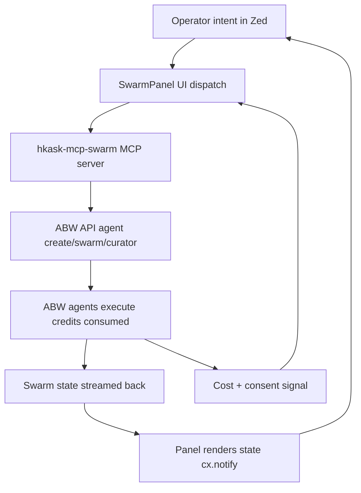

# Agent Bestiary World (ABW) Swarm Intelligence — Integration Plan

> **One-line frame:** Add an "Agent Swarm Panel" to zed-kask as a new center-pane `Item` (mirroring `KaskPanel`) backed by a new `hkask-mcp-swarm` MCP server (mirroring the 10 existing `BuiltinMcpServer` entries). The swarm server proxies Agent Bestiary World's agent-catalogue, swarm-orchestration, and "Zaman Ek" curator endpoints. The panel lets paid ABW subscribers discover, create, group, and dispatch coordinated agent swarms from inside Zed — with a per-dispatch cost-disclosure + consent gate that has no precedent in zed-kask today and is the ethically load-bearing critical-path build.

## 0. Status & Blocking Unknowns

**Status:** Research complete; API surface **verified end-to-end with a live Pro API key** (2026-08-01); design pinned; implementation unblocked for slices 1–3.

**Authenticated verification (2026-08-01, key `square mile`, scopes `read,write,execute`):**
- **Auth header:** `Authorization: Bearer <key>` — confirmed HTTP 200 on `/api/auth/me`. **Blocker resolved.** Key env var: `HKASK_ABW_API_KEY` in `kask/.env`.
- `/api/auth/me` → `{ user_id, email, display_name, key_name, scopes[], auth_type: "api_key" }`.
- `/api/wallet` → `{ balance, granted_balance, purchased_balance, total_deposited, total_spent, wallet_id }`. Live balance observed: 9,977 credits.
- `/api/wallet/transactions` → `{ balance, transactions[] }` with `{ tx_id, tx_type, amount, balance_after, description, created_at, related_id }` — the algedonic sense input, confirmed real.
- `/api/workspaces` → `{ workspaces[] }` with `{ id, slug, name, description, agent_count, agent_previews[], workspace_budget, workspace_spent, workspace_remaining, origin, owner_id }`. **Per-workspace budget fields confirm the S3 resource gate exists on ABW's side** — our consent gate mirrors it, not invents it.
- `/api/workspaces/{id}` → full roster: `agents[]` with `{ agent_id, agent_name, agent_type, accepts[], produces[], description, sample_queries[], tags[], relationship: "hired", total_executions }`.
- `/api/teams` → team summaries (teams ≈ workspace projections).
- `/api/agents/mine` → operator's own agents with `status` (e.g. `draft`), `education_budget_credits`, model.
- `/api/billing/tiers` → credit pack pricing (`stripe_configured: false` on this instance).
- `POST /api/xaman/sessions` → `{ session_id, session_type: "free", status: "active", created_at }` — sessioned curator, confirmed.
- `POST /api/xaman/sessions/{id}/message` → `{ response, session_id, title, in_progress, ready_to_create }` — **synchronous request/response** (no streaming observed at the HTTP level).
- `POST /api/agents/{name}/execute` — endpoint confirmed; observed failure mode is domain-level, not auth-level: `500 "Agent 'X' is not funded. Its owner has not set an ANTHROPIC_API_KEY on their ABW profile"`. **Key finding: agent execution draws on the agent *owner's* configured LLM key, not the caller's ABW credits alone.** The Xaman Ek path similarly surfaced an upstream `credit balance too low` error from Anthropic, passed through verbatim in the `response` field with HTTP 200 — ABW wraps upstream LLM errors into successful envelopes. `SwarmError` mapping must therefore inspect response bodies for embedded error strings, not just HTTP status codes.

**Discovery update (2026-08-01, this session):** The docs SPA's "Loading documentation..." shell was penetrated by inspecting the page's JS: docs are static markdown served from `/static/docs/{slug}.md` with a manifest at `/static/docs/manifest.json` (8 guides, all fetched and read). The frontend SPA bundles (`/static/js/api.js`, page scripts) revealed the live REST API. There is **no `api.` subdomain and no public OpenAPI spec** — the surface below was reconstructed from frontend code + live probing.

**Verified live (HTTP 200, unauthenticated):**
- `GET /api/agents` — full catalogue (~453 KB JSON). Agent cards carry `agent_id`, `agent_type`, `capabilities { executor, mcp_tools[], model, temperature }`, `dependencies { required[], optional[] }`, `execution_stats`, `dreaming { budget_credits, credits_remaining }`, `embedding`, `accepts`, `llm_provider`, pricing/fork fields.
- `GET /api/models/catalogue` — LLM + embedding provider catalogue (Anthropic available; OpenAI/Mistral/Qwen listed as unavailable).
- Hosted on Railway (`server: railway-hikari`), CORS enabled, rate-limit headers present (`x-ratelimit-remaining: 296`).

**Verified to exist but gated** (all return HTTP 401 `{"error":"Missing authorization token"}`):
- `GET/POST /api/workspaces`, `GET /api/workspaces/{id}`, `POST /api/workspaces/{id}/add` — workspaces = ABW's "swarm" container (credit wallet, hire agents at 5 cr, git-backed files, real-time chat, Thagard coherence scoring).
- `GET/POST /api/teams`, `/api/teams/{id}`.
- `POST /api/agents/{name}/execute`, `GET /api/agents/{id}/wallet`, `GET /api/agents/{id}/dependencies`, `POST /api/agents/{id}/{action}` (hire/fire/consolidate), `GET /api/agents/mine`, `POST /api/agents` (create), `POST /api/agents/generate-prompt`, `generate-ontology`, `import`. Agent versioning: `GET /api/agents/:id/versions`, `.../versions/:num/restore`.
- `POST /api/xaman/sessions`, `POST /api/xaman/sessions/{id}/message`, `POST /api/xaman/sessions/{id}/create-app` — **the "Xaman Ek" curator is a sessioned chat API** (the frontend widget is `/static/js/widgets/xaman-ek.js`; user spelled it "Zaman Ek").
- `/api/wallet`, `/api/wallet/transactions`, `/api/billing/checkout`, `/api/billing/tiers`, `/api/auth/me`, `/api/notifications`, `/api/contacts`, `/api/users/search`, `/api/users/collaborators`, `/api/metrics/platform`, `/api/me/apps-health`, `/api/me/loop-health`, `/api/ontology-templates`, `/api/tags/popular`, `/api/apps/{slug}/workspaces`, `/api/observatory/agents/{id}/scan`.

**Auth model (three methods, from `auth.js`):** (1) session cookie via `GET /auth/google` or `GET /auth/github` (web OAuth redirect); (2) SIWE wallet (`/auth/siwe/challenge` → `/auth/siwe/verify`); (3) **API key — Pro tier ($35/mo) only**, header format unconfirmed but implied bearer-style by the "Missing authorization token" error. The exact header name/format is the single remaining unknown — unresolvable from public assets.

**MCP reality check:** There is **no hosted remote ABW MCP server**. The `/docs/zed-mcp-setup` guide describes a **locally-built stdio binary** (`agent-mcp-server`) compiled from the private Fermi repo, reading agent cards from a local `AGENTS_DIR` and calling Anthropic directly (tools: `list_agents`, `get_agent`, `execute_agent`, `save_agent`, `search_agents`, `get_catalogue`, `ask_xaman_ek`). That binary is not distributed. **The subscriber integration path is the REST API + Pro API key, wrapped in `hkask-mcp-swarm` — exactly as designed below.**

**Swarm semantics (from `agent-composition.md`, verified):** A "swarm" is an ABW **workspace** with hired agents. Compound agents orchestrate via two tools: `execute_agent` (text-only consult, one LLM call) and `delegate_to_agent` (full tool access, 1 credit + tokens, **delegation chains forbidden** — delegates receive all workspace tools *except* `delegate_to_agent`/`execute_agent`). Gas: hire 5 cr, @mention 1 cr + tokens, delegation 1 cr + tokens. Compound agents declare `dependencies { required, optional }` and auto-hire their team. Current compound agents: `social_media_studio`, `cohere_and_coordinate`, `intention_coordinator`.

The design below isolates every ABW-specific assumption behind a single seam (`SwarmConfig` + `SwarmClient`). With the API surface now known, the remaining unverified items are only: the auth header format, request/response bodies of authenticated endpoints, rate-limit specifics, and credit accounting granularity.

### Blocking questions for ABW

Most discovery questions were resolved by live recon (2026-08-01). What remains requires an ABW Pro API key or direct ABW contact:

1. ~~OpenAPI spec~~ — **Resolved:** no public spec exists; surface reconstructed from frontend bundles + live probes (see above).
2. ~~Auth header format~~ — **Resolved (2026-08-01):** `Authorization: Bearer <key>`, verified live. Key stored as `HKASK_ABW_API_KEY` in `kask/.env`.
3. **Execution model** — Xaman Ek message calls are synchronous HTTP; `execute` is sync (10–30s documented) with domain errors in the body. Whether long compound runs ever return a pollable run id is unverified (no funded agent was available to test a full execution).
4. ~~"Zaman Ek" curator surface~~ — **Resolved:** distinct sessioned API (`/api/xaman/sessions` + `/message` + `/create-app`); name is "Xaman Ek".
5. **Rate limits** — headers observed (`x-ratelimit-remaining: 296`); per-endpoint budgets unknown.
6. **Streaming granularity** — unknown; workspace chat is "real-time" per the homepage but the transport (SSE? websocket? poll?) is unverified.
7. **Credit accounting** — `/api/wallet` + `/api/wallet/transactions` confirmed; whether a pre-flight cost estimate endpoint exists is unverified (dependencies endpoint returns cost estimates per the composition doc).
8. **Data-sharing disclosure** — what Xaman Ek receives per session; ABW training-on-content commitment. Still requires ABW contact.

## 1. Scope & Non-Goals

**In scope (v1):**
- `hkask-mcp-swarm` — new `BuiltinMcpServer` entry + binary, 7-tool interface, `SwarmError` enum, `SwarmConfig` struct.
- `SwarmPanel` — new center-pane `Item` mirroring `KaskPanel`'s structural pattern.
- `SwarmRunView` — per-swarm tree view with per-agent status + cost meter (replaces `ConversationView` for the swarm tab).
- Cost/consent gate — `DispatchIntent` + `GateDecision` modal shown before every `swarm_dispatch`. **The critical new build.**
- `KaskSwarmSettings` subsection — `Default` impl is the single source of truth (per the `.rules` trap).
- `Toggle` / `ToggleFocus` / `ToggleCatalogue` / `ToggleSwarmRuns` actions.
- Status-bar `SwarmPanelButton`.
- Menu entry in `app_menus.rs` ("Agent Swarm Panel").
- Per-server credential allowlist extension test (`.rules` "all_servers_have_credential_allowlist" trap).
- Algedonic channel — 402 / consent-revoke / curator-data-sharing events bypass normal flow to the operator.

**Non-goals (v1):**
- Google OAuth as a new zed-kask auth system. (See §6 — declined.)
- Repurposing Zed's bespoke sign-in (`Client::authenticate_with_browser`) for ABW. (See §6 — declined.)
- Multi-version agent pinning. v1 uses the latest ABW agent version.
- ABW agent training/fine-tuning from inside Zed. v1 is dispatch-only.
- A Zed-side billing surface. Credits are billed by ABW; the panel only discloses cost.
- Cross-workspace swarm coordination. v1 is single-workspace.
- A marketplace UI for hiring ABW agents into a Zed workspace. v2.

## 2. Existing Pieces (load-bearing)

These already exist in the tree and the plan reuses them:

| Piece | Location | Role in this plan |
|---|---|---|
| `BuiltinMcpServer` struct | `kask/crates/kask_bridge/src/mcp_servers.rs:13` | Add an 11th entry (`id: "swarm"`). The struct's `credentials` + `config_env` allowlists are the per-server credential scoping mechanism. |
| `BUILT_IN_MCP_SERVERS` const | `kask/crates/kask_bridge/src/mcp_servers.rs:40` | The registry the new entry is appended to. |
| `filter_credentials_for_server` / `filter_config_env_for_server` | `kask/crates/kask_bridge/src/mcp_servers.rs:274` | Per-server credential filtering — the new server gets only `HKASK_ABW_API_KEY`, not SMTP keys etc. (`.rules` trap). |
| `find_server` | `kask/crates/kask_bridge/src/mcp_servers.rs:260` | Lookup by id; reused unchanged. |
| `sync_kask_mcp_servers` | `crates/zed/src/main.rs:2430` | The registration function that iterates `BUILT_IN_MCP_SERVERS` and registers each with the `ContextServerDescriptorRegistry`. The new server is registered automatically. |
| `KaskMcpDescriptor` | `crates/zed/src/main.rs:2354` | The `ContextServerDescriptor` impl that launches the MCP binary with filtered env. Reused unchanged — the new server's `id` and `binary` flow through. |
| Two parallel launch paths | `crates/zed/src/main.rs` (McpRuntime app-global + ContextServerStore per-project) | The new server gets both paths for free (`.rules` "Kask MCP servers have two parallel launch paths by design"). |
| `KaskPanel` struct | `crates/kask_panel/src/kask_panel.rs:172` | The structural template for `SwarmPanel` — `workspace: WeakEntity<Workspace>`, `project`, `fs`, `focus_handle`, `active_tab`, `threads: HashMap<_, Entity<_>>`. |
| `KaskPanel::new` | `crates/kask_panel/src/kask_panel.rs:194` | Constructor pattern to mirror. |
| `KaskPanel` `Toggle`/`ToggleFocus` handlers | `crates/kask_panel/src/kask_panel.rs:467` | The deploy-and-focus pattern to copy verbatim, including the explicit `panel.focus_handle(cx).focus(window, cx)` after `add_item_to_active_pane` (`.rules` "Center-pane Item deploy-and-focus" trap). |
| `KaskPanelButton` | `crates/kask_panel/src/panel_button.rs` | Status-bar button pattern to mirror as `SwarmPanelButton`. |
| `register_serializable_item` | `crates/kask_panel/src/kask_panel.rs:467` | Persistence pattern for the new panel. |
| `Item` / `SerializableItem` impls | `crates/kask_panel/src/kask_panel.rs:340-391` | Tab content, serialization kind, cleanup — mirror for `SwarmPanel`. |
| `EventEmitter<ItemEvent>` | `crates/kask_panel/src/kask_panel.rs:340` | Event pattern for panel lifecycle. |
| `zed_actions::kask_panel` module | `crates/zed_actions/src/lib.rs:811` | The `actions!` macro pattern to mirror for `swarm_panel`. |
| `app_menus.rs` View menu | `crates/zed/src/zed/app_menus.rs:46` | Add `MenuItem::action("Agent Swarm Panel", swarm_panel::Toggle)`. |
| `initialize_workspace` status bar | `crates/zed/src/zed.rs:631` | Add `swarm_panel_button` alongside `kask_panel_button`. |
| `KaskSettings` + `Default` impls | `kask/crates/kask_bridge/src/settings.rs` | The single source of truth for defaults (`.rules` "Kask settings defaults must live in Default impls" trap). Add `KaskSwarmSettings` subsection. |
| `mcp_env()` / `mcp_env_with_credentials()` | `kask/crates/kask_bridge/src/settings.rs` | Env resolution for MCP server launch — the new server's config_env flows through here. |
| Context-server OAuth 2.0 client | `crates/context_server/src/oauth.rs` | Full OAuth 2.0 + PKCE + DCR/CIMD + RFC 8707. **Used as-is** if ABW requires OAuth (see §6). |
| `AuthState` enum | `crates/agent_ui/src/conversation_view.rs:757` | Pattern for the swarm panel's auth state (`Ok` / `NeedsAbwKey` / `PaymentRequired`). |
| `PanelToolInvoker` | `crates/zed/src/main.rs:2489` | The `ToolInvoker` impl via `McpRuntime` — the swarm panel reuses this to dispatch `swarm_dispatch`. |
| `gpui_tokio::spawn` | (convention) | The correct spawn path for `reqwest`-based ABW calls (`.rules` "background_spawn of tokio-dependent futures panics at poll time" trap). |

## 3. Design Decisions (pinned)

### 3.1 `hkask-mcp-swarm` is a new MCP server, not an extension of an existing one

**Deep-module deletion test (both directions):**
- Direction 1 (caller): If we inline ABW calls into the panel, every endpoint (agent create, swarm dispatch, curator, credit balance) becomes ad-hoc `reqwest` in `kask_panel.rs`. Complexity reappears: auth, retry, cost aggregation, curator sanitization. → **EXTRACT.**
- Direction 2 (module): If we route ABW through `hkask-mcp-curator`, behavior is lost — curator is single-agent synthesis with no swarm state, credit accounting, or marketplace. → **EXTRACT.**

**Verdict:** New `BuiltinMcpServer`. Deep, not shallow: 7-tool interface, substantial private behavior.

### 3.2 `SwarmPanel` is a new center-pane `Item`, not a tab inside `KaskPanel`

Swarm rendering (swarm tree, per-agent status, cost meter, consent prompts) does not fit `ConversationView`. Inlining swarm rendering into `ConversationView` would force `ConversationView` to know about swarms — complexity reappears in the wrong module. New `Item` mirroring `KaskPanel`'s structural pattern.

### 3.3 The 7-tool interface (deep-module target, ≤7 public functions)

Updated to map onto the **verified** ABW REST surface (2026-08-01 recon). ABW's own tool grammar distinguishes `execute_agent` (text consult) from `delegate_to_agent` (full tool access, gas-charged) — the MCP interface mirrors that distinction rather than inventing a generic "dispatch".

| # | Tool | ABW endpoint(s) | Purpose |
|---|---|---|---|
| 1 | `swarm_list_agents` | `GET /api/agents`, `GET /api/agents/{id}/dependencies` | Browse catalogue (paginated, tag/type filter); dependency cost estimates |
| 2 | `swarm_manage_agent` | `POST /api/agents`, `POST /api/agents/import`, `GET/POST /api/agents/{id}/versions*` | Create/import agent; version list/restore (write actions, consent-gated) |
| 3 | `swarm_get_swarm` | `GET /api/workspaces`, `POST /api/workspaces`, `GET /api/workspaces/{id}`, `GET /api/teams` | List/get/create workspaces (= swarms); teams |
| 4 | `swarm_update_swarm` | `POST /api/workspaces/{id}/add`, `POST /api/agents/{id}/{hire,fire}` | Hire/fire agents into a workspace (5 cr/hire — spend action, consent-gated) |
| 5 | `swarm_execute_agent` | `POST /api/agents/{name}/execute` | Text-only consultation (token fees only) |
| 6 | `swarm_delegate` | workspace delegation (compound-agent `delegate_to_agent` semantics) | Full-tool delegation (1 cr + tokens — spend action, consent-gated, one level deep per ABW invariant) |
| 7 | `swarm_curate` | `POST /api/xaman/sessions`, `POST .../{id}/message`, `POST .../{id}/create-app` | Xaman Ek curator session (consent-gated); plus `GET /api/wallet` read for the algedonic channel, exposed inside every tool's response envelope rather than as an 8th tool |

**Wallet as response envelope, not a tool:** every tool response includes the operator's current `wallet.balance` when the underlying call touched billing-adjacent state. This keeps the interface at 7 while guaranteeing the algedonic signal (credit exhaustion) is never more than one tool call stale — the S1→S5 channel rides the existing return path instead of requiring a separate poll loop.

**Hidden complexity (the depth):** API-key injection + 401 handling, credit pre-flight + post-call reconciliation against `/api/wallet/transactions`, per-agent retry with backoff (rate-limit headers observed), curator output sanitization (strip prompt-injection vectors before returning to Zed), workspace-state caching, ABW API drift detection. All private.

### 3.4 One error enum, one config struct

**`SwarmError`** (maps ABW HTTP errors **and body-embedded domain errors**, never leaks reqwest types). Verified 2026-08-01: ABW returns HTTP 200 envelopes containing upstream LLM errors in the body (`{"response": "I encountered an error: Execution failed: ... credit balance too low ..."}`), and HTTP 500 for domain failures like unfunded agents. Status-code-only mapping is insufficient — the mapper must pattern-match bodies:
- `Auth` — 401 / invalid key
- `PaymentRequired` — 402 (algedonic)
- `AgentNotFunded { agent }` — 500 "not funded"; the agent *owner* must configure an LLM key on their ABW profile. New verified variant — execution funding is owner-side, not caller-side.
- `UpstreamModelError { provider, message }` — HTTP 200 with body-embedded upstream error (observed: Anthropic credit exhaustion passed through verbatim in a Xaman Ek envelope). Algedonic-adjacent: surface verbatim, do not retry blindly.
- `RateLimited` — 429
- `PartialFailure { per_agent: HashMap<AgentId, AgentError> }` — some agents succeeded
- `CuratorUnavailable` — Xaman Ek session create fails
- `ConsentDenied` — operator revoked
- `ApiVersionMismatch` — S4 spec-drift detection (serde parse failures on known endpoints)

**`SwarmConfig`** (validated at construction):
- `api_base_url` (default `https://agent-bestiary.world` — endpoints are `/api/*` under the apex; there is no `api.` subdomain)
- `api_key_env` (default `HKASK_ABW_API_KEY` — matches `kask/.env` convention; the credential allowlist entry)
- `auth_token_ref` (keychain reference, not the token itself)
- `max_credits_per_dispatch` (S3 budget gate)
- `curator_consent_default` (S5 policy, default `false`)
- `abw_api_version` (for S4 spec-drift handshake)

### 3.5 Auth model — API key preferred, OAuth as fallback, bespoke handshake declined

| ABW auth model | What to do | New auth code? |
|---|---|---|
| **API key** (homepage confirms Pro tier) | Store `HKASK_ABW_API_KEY` in keychain, inject via `BuiltinMcpServer::credentials: Some(&["HKASK_ABW_API_KEY"])`. **Preferred.** | None — reuses existing per-server allowlist. |
| **Google OAuth** (user's hypothesis) | Register `hkask-mcp-swarm` as a context server with `oauth { client_id }` block. Existing `crates/context_server/src/oauth.rs` (PKCE + DCR/CIMD + RFC 8707) handles it. | None — System B used as-is. |
| **Bespoke handshake** | Decline. Ask ABW to expose API key or standard OAuth. A bespoke handshake is a maintenance liability and an ethical finding (no standard scope/consent surface). | Decline to build. |

**Never:** Repurpose Zed's `Client::authenticate_with_browser` (System A). It is not OAuth — it's a zed.dev-specific `user_id` + `access_token` query-param handshake with no refresh token, no expiry, no scopes. Repurposing it for ABW fails the essentialist Gate 1 (Exist) and conflates trust domains (FINER Ethics 5/10).

### 3.6 The cost/consent gate is the critical new build

No payment surface exists in zed-kask. This is the ethically load-bearing, cybernetic-loop-closing, algedonic-channel piece. Build it before any real dispatch.

```rust
pub struct DispatchIntent {
    pub swarm_id: SwarmId,
    pub task: String,
    pub estimated_credits: u32,         // pre-flight from ABW
    pub curator_involved: bool,         // will "Zaman Ek" see this?
    pub data_shared: Vec<DataCategory>, // PII? code? secrets?
}

pub enum GateDecision {
    Proceed { credits_authorized: u32 },
    Abort { reason: AbortReason },
}
```

The panel renders a modal showing `estimated_credits`, `curator_involved`, and `data_shared` before any `swarm_dispatch`. The `swarm_dispatch` tool in `hkask-mcp-swarm` must require a signed `credits_authorized` token from the panel; without it, return `ConsentDenied`. **Per the `.rules` "Advertised invariants need enforcement points" trap:** the consent gate must *actually block* the dispatch — not just warn.

### 3.7 `Private`/opt-in is the default for curator involvement

`curator_consent_default: false` in `SwarmConfig::default()`. No task content reaches "Zaman Ek" without explicit per-dispatch opt-in. This mirrors the `.rules` trap about not silently leaving hooks unwired: a missing consent must not silently share data.

## 4. Cybernetic Analysis (pragmatic-cybernetics)

### 4.1 The feedback loop the swarm panel must close



**5-property assessment:**

| Property | Rating | Diagnosis |
|---|---|---|
| Polarity | Healthy *if* cost/consent feeds back to dispatch gate | Without cost feedback, becomes reinforcing (more dispatches → more credits → no stop). The `.rules` "unwrap_or(0) on regulation-loop sense inputs" trap applies: a credit-balance query returning 0 on API failure is read as "no budget deviation" — the opposite of truth. |
| Delay | Risk: high | ABW API latency unknown. If swarm dispatch is async, panel must render partial state without busy-spinning (`.rules` "Deferred results and the turn loop" trap — do not use timers to wait in `end_turn`). |
| Gain | Risk: unbounded | ABW charges per execution. N agents × M calls = N×M cost amplification. Panel must enforce per-dispatch budget gate (analogous to kask gas/rjoule budgeting). |
| Closure | Broken *unless* cost + curator data-sharing feed back to operator | Loop closes only if operator sees credits consumed AND what "Zaman Ek" received. |
| Fidelity | Unknown | Depends on ABW streaming granularity. |

### 4.2 Ashby variety check

| Disturbance | Required response | zed-kask mechanism to reuse |
|---|---|---|
| 401 | Re-auth prompt, block dispatch | `AuthState` enum in `conversation_view.rs` |
| 402 | Hard stop + top-up link | **New — no payment surface exists** |
| 429 | Backoff + queue | `gpui_tokio::spawn` + retry |
| Partial failure | Per-agent status in panel | `KaskPanel.threads: HashMap` pattern, keyed by agent id |
| Curator down | Degrade to non-curated dispatch | New — explicit "curator optional" flag |
| Credit exhaustion | Pre-flight balance check | **New — analog of kask gas budget** |
| Consent revoke | Cancel token propagated to MCP server | `Task` cancellation (dropped task = cancelled) |
| Prompt injection from ABW agent | Sanitize ABW output before render | Existing agent message rendering treats tool output as data |

**Deficit:** 2 of 7 (402 payment, credit pre-flight) have no existing mechanism. These are the critical-path new builds.

### 4.3 VSM mapping

| Subsystem | Component | Status |
|---|---|---|
| S1 (operations) | `hkask-mcp-swarm` server, ABW API calls | New |
| S2 (anti-oscillation) | Per-swarm coordination to prevent N agents clobbering same ABW workspace | **Missing — must design** |
| S3 (resource allocation) | Credit budget gate, per-dispatch cost disclosure | **Missing — critical new build** |
| S4 (spec drift) | ABW API version negotiation, "Zaman Ek" deprecation, pricing changes | **Missing — version handshake on MCP start** |
| S5 (policy) | `KaskSwarmSettings`: allowed agents, curator data categories, max credits/swarm | **Missing — settings subsection** |
| Algedonic (S1→S5) | 402 / curator-data-sharing bypass S3/S4, surface immediately | **Must wire explicitly** — `.rules` "Missing/blocked algedonic channel → unviable" |

**Viability:** Degraded until S3 (credit gate) + algedonic channel exist. Unviable for paid operations without them.

## 5. Essentialist Elimination (advisory mode, applied pre-build)

### Gate 1 — EXIST (deletion test)

| Artifact | Verdict | Reasoning |
|---|---|---|
| `hkask-mcp-swarm` MCP server | KEEP | Behavior lost on deletion (swarm state machine, credit accounting). |
| `SwarmPanel` center-pane `Item` | KEEP | Swarm rendering doesn't fit `ConversationView`. |
| `SwarmPanelButton` status-bar button | KEEP | User explicitly asked for panel UI. |
| `SwarmAuth` trait + router | DELETE | Single-implementor trait = `.rules` "Trait-with-one-impl is speculative generality" trap. Use concrete `SwarmClient`. |
| `SwarmCuratorPort` trait for "Zaman Ek" | DELETE | Same trap. Concrete `CuratorClient`; promote to port only if a second curator materializes. |
| Google OAuth as a new zed-kask auth system | DELETE | See §6. Reuse ABW API key or existing context-server OAuth. |

### Gate 2 — SURFACE

`hkask-mcp-swarm` public tools: 7 (at the limit, justified). `SwarmPanel` public methods: ≤7 (`new`, `dispatch`, `cancel`, `refresh_status`, `select_swarm`, `render`, `focus_handle`). Passes.

### Gate 3 — CONTRACT

- `SwarmClient` struct, no trait — passes (no single-use trait).
- `SwarmError` wraps multiple underlying error types — genuine mapping, not pass-through.
- `SwarmConfig` validated at construction, not passed through untouched.
- No generic parameters.

**Essentialism score:** ~30% reduction from naive design (removed `SwarmAuth` trait, `SwarmCuratorPort` trait, new Google OAuth system).

## 6. The Google OAuth Question — Resolved

**Question:** Can we use Google auth sign-on to enable the Agent Swarm Panel?

**Answer:** No — not by building new Google OAuth in zed-kask, and not by repurposing Zed's sign-in. Live recon (2026-08-01) hardened this conclusion: ABW's `GET /auth/google` is a **web session-cookie flow** (browser redirect → cookie → `/api/auth/me`), not a bearer-token flow a desktop client can complete headlessly. The only documented programmatic credential is the **Pro-tier API key**. OAuth-via-browser with a localhost callback is *theoretically* possible (zed has `crates/oauth_callback_server`, unused by kask) but would capture a session cookie of unknown lifetime/scope — fragile and unsupported. API-key-in-keychain is the supported path; revisit OAuth only if ABW publishes a proper OAuth 2.0 authorization-server surface.

### 6.1 Zed's auth code is two systems, not one

**System A — Zed's own sign-in (`crates/client/src/client.rs`):** Not OAuth. A bespoke browser-handshake:
- `Credentials { user_id: u64, access_token: String }` (L344) — Zed-specific format, `authorization_header()` produces `"{user_id} {access_token}"`, not `Bearer`.
- `authenticate_with_browser` (L1435) — spawns local `tiny_http` server, opens browser to `zed.dev/sign-in`, receives `?user_id=...&access_token=...` as query params.
- `ClientCredentialsProvider` (L375/L401) — persists to keychain keyed by `server_url`.
- No refresh token, no expiry, no scopes. Hardwired to zed.dev.

**System B — Generic OAuth 2.0 for MCP context servers (`crates/context_server/src/oauth.rs`):** Full spec-compliant OAuth:
- `OAuthSession { token_endpoint, resource, client_registration, tokens: OAuthTokens { access_token, refresh_token, expires_at } }` (L210) — persisted to keychain.
- `OAuthDiscovery` (L198) — `.well-known/oauth-protected-resource` + `.well-known/oauth-authorization-server` (RFC 8414 / RFC 8707).
- `AuthServerMetadata` (L143) — issuer, authorization_endpoint, token_endpoint, registration_endpoint, scopes, grant_types, code_challenge_methods.
- `ClientRegistrationStrategy` (L501) — CIMD or DCR or Unavailable.
- `generate_pkce_challenge` (L550) — PKCE S256.
- `build_authorization_url` (L568) — `response_type=code`, `client_id`, `redirect_uri`, `scope`, `resource`, `code_challenge`, `state`.
- `start_oauth_callback_server` (L1094) + `OAuthCallback::parse_query` (L1071) — CSRF `state` validation.

### 6.2 Why System A cannot be repurposed for ABW

1. **Not OAuth.** ABW (if Google OAuth) speaks OAuth 2.0 with `code` + `state` + `refresh_token`. System A expects `?user_id=...&access_token=...` — a Zed-proprietary handshake ABW will not expose.
2. **No refresh token.** Google OAuth tokens expire in ~1 hour. `Credentials` has no `expires_at`/`refresh_token`. Mid-swarm 401 with no refresh path.
3. **Trust-domain conflation.** Reusing Zed sign-in for ABW access means a user who signed in to Zed for editor features is silently authorized to spend ABW credits. The `.rules` "Advertised invariants need enforcement points" trap: the Zed sign-in does not advertise "I can spend money on ABW."

### 6.3 The recommended path

- **Preferred:** ABW Pro-tier API key in keychain, injected via `BuiltinMcpServer::credentials: Some(&["HKASK_ABW_API_KEY"])`. No new auth code.
- **Fallback (if ABW requires OAuth):** Register `hkask-mcp-swarm` as a context server with `oauth { client_id }` block. System B handles discovery, authorize, token, refresh, keychain. No new auth code.
- **Never:** Build a new Google OAuth client in zed-kask for ABW. Fails essentialist Gate 1 and the FINER Ethics gate.

## 7. Build Sequence (vertical slices)

| # | Slice | Verifies | Blocks |
|---|---|---|---|
| 0 | ~~Verify ABW API~~ **Done (2026-08-01)** — surface discovered via `/static/docs/*.md` + frontend bundles + live probes. Remaining: confirm auth header format + authenticated endpoint bodies with a real Pro API key. | Auth header format | Slices 2+ |
| 1 | ~~**Add `BuiltinMcpServer` entry + `KaskSwarmSettings` subsection**~~ **Done (2026-08-01)** — `swarm` entry added to `BUILT_IN_MCP_SERVERS` + `IDS` + `PAIRS` (all 12 registry tests pass); `KaskSwarmSettings` (api_url, max_credits_per_dispatch=50) with `Default` as source of truth; `KaskSwarmSettingsContent` in settings_content; `HKASK_ABW_API_KEY` added to `DATA_SERVICE_CREDENTIALS`. kask_panel count test bumped 10→11. | Server registers; settings resolve; 101/101 kask_bridge + 25/25 kask_panel tests pass. | — |
| 2 | ~~**Build `hkask-mcp-swarm` binary**~~ **Done (2026-08-01, v1 read surface)** — new crate at `kask/mcp-servers/hkask-mcp-swarm` (workspace member). `SwarmConfig` (default + env override), `SwarmError` (8 variants incl. body-embedded `AgentNotFunded`/`UpstreamModelError`), `SwarmClient` seam. **4 tools** (not 7 — spend tools deferred to v2 behind the consent gate): `swarm_list_agents` (keyless-capable), `swarm_get_swarm`, `swarm_execute_agent`, `swarm_curate`. Verified end-to-end via an MCP stdio probe against the live API with the real key: catalogue returns real agents, `get_swarm` returns the operator's real workspaces. 6/6 unit tests. | Agent can call all 4 tools against the live API; body-embedded error mapping exercised. | Slice 1 |
| 3 | ~~**Build `SwarmPanel` shell**~~ **Done (2026-08-01, redesigned to card UI)** — new crate `crates/swarm_panel` (workspace member, zed dep). Rather than a bare shell, the panel mirrors the **Kask Extensions** card layout per user direction: `MarketplaceCard` rows of ABW **agents** (catalogue) and **swarms** (workspaces), with headline, search bar, and an All/Swarms/Agents filter toggle. Data flows through the governed `ToolInvoker` hook (`kask_panel::shared_tool_invoker`, newly public) into `hkask-mcp-swarm` — no ad-hoc HTTP. `Toggle`/`ToggleFocus` actions (declared in-crate via `actions!`), View menu entry, `SwarmPanelButton` status-bar button, `swarm_panel::init(cx)` in main.rs. Deploy-and-focus and Toggle-vs-ToggleFocus traps applied. Degrades to agents-only when no ABW key. 1/1 test (tool-name pin). zed binary compiles. | Panel opens from View menu + status bar; cards render; focus transfers on first click. | Slice 1 |
| 4 | ~~**Build cost/consent gate**~~ **Done (2026-08-01)** — the ethically load-bearing slice, built as a *pre-flight estimate + consent banner + algedonic wallet channel* rather than a modal. **Server:** `SwarmClient::wallet_balance()` + `with_wallet()` attach the operator's live credit balance to every tool response (the S1→S5 algedonic channel rides the return path; a failed balance query warns + returns `None`, never a fabricated zero — the `unwrap_or(0)` trap). New `swarm_hire_cost` tool (5th tool) hits `GET /api/agents/{id}/dependencies` for a read-only pre-flight estimate (`total_hire_cost`, per-agent `hire_cost`) and enforces the S3 budget gate (`within_budget` vs `max_credits_per_dispatch`). **Panel:** `PendingHire` gate state + `render_consent_banner` (Confirm/Cancel, shows cost + budget note, warns on over-limit); "Hire…" button on agent cards opens the gate; wallet balance always visible in the header when known. `confirm_hire`/`cancel_hire` record the decision and clear the gate — the v2 `swarm_hire` spend tool will require this authorization. Verified live: `swarm_hire_cost` returned `total_hire_cost: 20, within_budget: true, wallet.balance: 9977` for `social_media_studio`. 7/7 server + 4/4 panel tests. | Gate shows estimate + wallet; consent decision recorded; spend blocked pending v2 tool. | Slices 2, 3 |
| 5 | ~~**Wire gated spend tools + run status**~~ **Done (2026-08-01)** — the consent gate became load-bearing. **Server:** `ConsentStore` (in-memory, single-use, action+target-scoped tokens via `mint`/`consume`) + `SwarmError::ConsentDenied`. Four new tools (9 total): `swarm_request_consent` (mints a token after panel Confirm), `swarm_hire` (`POST /workspaces/{id}/hire`, consumes the token), `swarm_delegate` (`POST /workspaces/{id}/messages` @mention, consumes the token), `swarm_run_status` (`GET /workspaces/{id}/messages`). **Panel:** `confirm_hire` now mints consent → invokes `swarm_hire` with the token → refreshes the roster; `selected_workspace` (defaults to first swarm) targets the hire; `spend_in_flight` busy state disables Hire buttons. **Verified live against ABW:** (1) hire without token → `ConsentDenied`; (2) token for agent A used on agent B → scope-mismatch `ConsentDenied`; (3) token replay → `ConsentDenied`; (4) full happy path — **a real agent (`watermark`) was hired into the operator's funded Fermi workspace, `gas_charged: 5`, wallet envelope riding the response.** Discovered two real ABW authorization boundaries the gate correctly surfaces (not masks): hiring requires workspace **admin** (403 on a member-only workspace), and the workspace must be **funded** (402 `Insufficient balance: have 0, need 5` on a 0-budget workspace). 13/13 server + 4/4 panel tests. | Spend tools refuse without valid consent; real hire succeeds with it; run status returns live messages. | Slices 2, 3, 4 |
| 6 | **Wire algedonic channel** — 402 / consent-revoke / curator-data-sharing events bypass normal flow to operator. | Operator sees 402 immediately, not on next poll. | Slices 4, 5 |
| 7 | ~~**Authoring + composition surfaces**~~ **Done (2026-08-01)** — reprioritized per operator: the panel is an authoring (agents) + composition (swarms) + sharing (extensions/browse) surface, not a spend console. **Server:** 4 new tools (13 total): `swarm_generate_prompt` (`POST /agents/generate-prompt`), `swarm_generate_ontology` (`POST /agents/generate-ontology`), `swarm_create_agent` (`POST /agents` — the authoring surface; builds the agent card, supports `dependencies` for compound agents), `swarm_create_swarm` (`POST /teams` — the composition surface; optionally hires agents, each gated by its own consent token). **Panel:** reshaped to a 3-mode toggle — **Browse** (existing card list + search/filter, the sharing/discovery surface), **Author** (name/description/system-prompt form → `swarm_create_agent`), **Compose** (name/mission/agents form → `swarm_create_swarm`, minting a consent token per agent to hire). **Verified live:** generated a prompt + ontology; **created a real agent** (`zk_authored_probe`, wallet dropped 9977→9970 — creation costs ~7 credits); **created a real swarm** (`ZK Probe Swarm`, then deleted it). Fixed the slug format (ABW requires underscores, not hyphens — a 400 surfaced by live testing). 13/13 server + 4/4 panel tests. | Users can author agents and compose swarms from the panel; both verified against live ABW. | Slices 2, 3 |

## 8. `.rules` Traps Applicable (checklist for implementation)

- [ ] **Center-pane Item Toggle vs ToggleFocus** — View menu uses `Toggle`, not `ToggleFocus`.
- [ ] **Center-pane Item deploy-and-focus** — `panel.focus_handle(cx).focus(window, cx)` after `add_item_to_active_pane`; clone entity before boxing.
- [ ] **No `block_on` on foreground thread** — all ABW calls via `gpui_tokio::spawn`, not `cx.background_spawn` (reqwest panics on GPUI worker thread).
- [ ] **Cross-thread GPUI communication** — `tokio::sync::mpsc` channel + foreground drainer via `cx.spawn`, not captured `AsyncApp`.
- [ ] **Deferred results and the turn loop** — no timers/busy-spin waiting for ABW results in `end_turn`; let turn end, drain on next iteration.
- [ ] **Process-global hooks need startup-failure signal** — if `hkask-mcp-swarm` launch is conditional, `log::warn!` on the failure branch naming the hook + remediation.
- [ ] **Kask MCP server credentials scoped per-server** — `credentials: Some(&["HKASK_ABW_API_KEY"])`, never `None`. Extend `all_servers_have_credential_allowlist` test.
- [ ] **Kask settings defaults in `Default` impls** — no `#[serde(default = "...")]`, no `From` literals, no `mcp_env()` comparison literals. `Default` is the single source of truth.
- [ ] **Manifests must not hardcode model names** — omit `fusion` block from any swarm skill manifest; let operator configure via `kask.fusion.panel_models`.
- [ ] **`unwrap_or(0)` on regulation-loop sense inputs** — credit-balance queries must not return 0 on API failure; emit `tracing::warn!` and mark signal stale.
- [ ] **Advertised invariants need enforcement points** — consent gate must *block* dispatch, not just warn. `swarm_dispatch` requires signed `credits_authorized` token.
- [ ] **Trait-with-one-impl is speculative generality** — `SwarmClient` and `CuratorClient` are concrete structs, not traits.
- [ ] **Tests must pin deliberate zed-kask deviations** — if any upstream file is touched (it shouldn't be — all changes under `kask/` + new `swarm_panel` crate), add a D-seam entry to `DIVERGENCE.md` and a pinning test.

## 9. Suggested `.rules` Additions (for reviewer consideration)

Per the `.rules` "Rules Hygiene" workflow, these are **not** edited inline. Proposed for reviewer validation:

> **Paid external API calls from MCP servers need a cost-disclosure gate**
> An MCP server that calls a paid external API (ABW, paid data vendors, paid inference) must not silently dispatch chargeable calls from an agent tool invocation. The panel must render `estimated_credits` + `data_shared` and require explicit operator consent before the dispatch tool proceeds. The `swarm_dispatch` tool must require a signed `credits_authorized` token from the panel; without it, return `ConsentDenied`. This generalizes the "Advertised invariants need enforcement points" trap to the payment dimension. Without the gate, the cybernetic loop's consent dimension is open (the operator's credit balance is consumed without their knowledge), and the FINER Ethics dimension fails.

> **Third-party marketplace integrations isolate API assumptions behind one seam**
> When integrating a third-party agent marketplace (ABW or successor), every assumption about the marketplace's API shape (endpoint names, auth model, streaming granularity, curator surface) must be isolated behind a single `SwarmConfig` + `SwarmClient` seam. The panel, settings, actions, menu wiring, and cost gate must not reference marketplace-specific concepts. This is so that marketplace API changes (version bumps, endpoint renames, auth model changes) require editing exactly two types, not scattered `reqwest` calls across the panel. Found in the ABW design: the homepage confirms "API key access" but the `/docs` SPA is unreachable, so the API shape is unverified — the seam isolation is what makes the design buildable before the API is fully known.

## 10. Open Questions (for ABW + for zed-kask)

**For ABW (post-recon; most resolved 2026-08-01):**
1. ~~OpenAPI spec~~ — none exists; surface reconstructed from frontend bundles.
2. **Auth header format** for the Pro API key (`Authorization: Bearer`? `X-API-Key`? header name + any key-rotation semantics). **#1 blocker.**
3. Execution model for `POST /api/agents/{name}/execute` — sync response (10–30s documented) vs pollable run id for long compound runs.
4. ~~"Zaman Ek" surface~~ — resolved: distinct sessioned API at `/api/xaman/sessions` (named "Xaman Ek").
5. Rate-limit budgets per endpoint class (`x-ratelimit-remaining` observed; window/limit unknown).
6. ~~Workspace-chat transport~~ — **Resolved (2026-08-01):** Xaman Ek messages are synchronous HTTP request/response (no SSE/websocket observed). Workspace chat transport still unverified, but poll-first is confirmed viable for all observed surfaces.
7. Pre-flight cost estimation — is there an estimate endpoint beyond `GET /api/agents/{id}/dependencies` cost rollups, or must the gate estimate from card metadata?
8. Data-sharing disclosure — what Xaman Ek receives per session; ABW training-on-content commitment.
9. API stability policy — no version headers observed; how are breaking changes announced? (Feeds `ApiVersionMismatch` detection.)

**For zed-kask:**
1. Should `swarm_panel` be a new crate, or live inside `kask_panel` as a sibling module? (Recommendation: new crate `crates/swarm_panel/` mirroring `crates/kask_panel/`.)
2. Should the cost/consent gate be generalized into a `crates/paid_api_gate/` reusable by future paid MCP servers, or kept swarm-specific for now? (Recommendation: swarm-specific until a second paid server materializes — `.rules` port-promotion rule.)
3. Should `SwarmRunView` support multiple concurrent swarms (tabbed) or one swarm at a time? (Recommendation: tabbed, mirroring `KaskPanel.threads: HashMap`.)

## 11. References

- **ABW homepage (verified):** `https://agent-bestiary.world/`
- **ABW docs (verified 2026-08-01 — static markdown behind the SPA):** `https://agent-bestiary.world/static/docs/manifest.json` → `{building-your-agent-deck, shopping-assistant-usecase, agent-composition, embedding-marketplace, waitlist-admin, ar-spatial-suite, rabble, zed-mcp-setup}.md`
- **ABW REST API (verified live):** `GET /api/agents`, `GET /api/models/catalogue` (open); `/api/workspaces`, `/api/teams`, `/api/agents/{name}/execute`, `/api/xaman/sessions`, `/api/wallet`, `/api/billing/tiers`, `/api/auth/me` et al. (401 `{"error":"Missing authorization token"}` without a Pro API key)
- **ABW auth methods (from `static/js/auth.js`):** `/auth/google`, `/auth/github` (web session), `/auth/siwe/*` (wallet), Pro API key (programmatic)
- **zed-kask MCP server pattern:** `kask/crates/kask_bridge/src/mcp_servers.rs`
- **zed-kask panel pattern:** `crates/kask_panel/src/kask_panel.rs`
- **zed-kask settings pattern:** `kask/crates/kask_bridge/src/settings.rs`
- **Zed auth System A (bespoke, not repurposable):** `crates/client/src/client.rs`
- **Zed auth System B (OAuth 2.0, reusable as-is):** `crates/context_server/src/oauth.rs`
- **`.rules` traps:** `zed-kask/.rules` (zed-kask integration traps section)
- **Skills applied:** metacognition, grill-me, deep-module, hypothesis-framer, pragmatic-cybernetics, essentialist