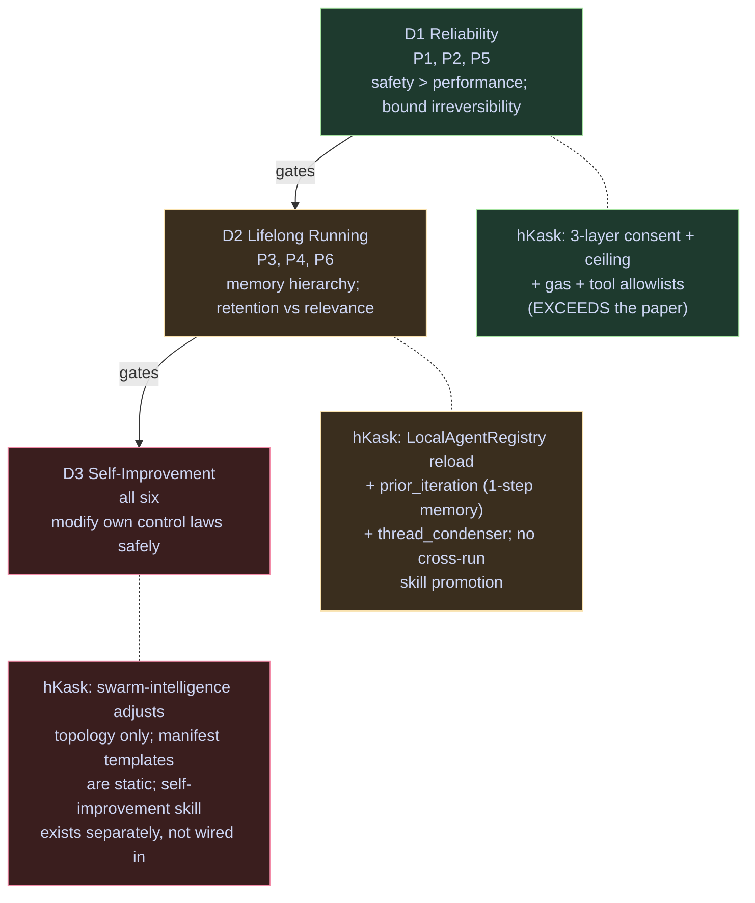
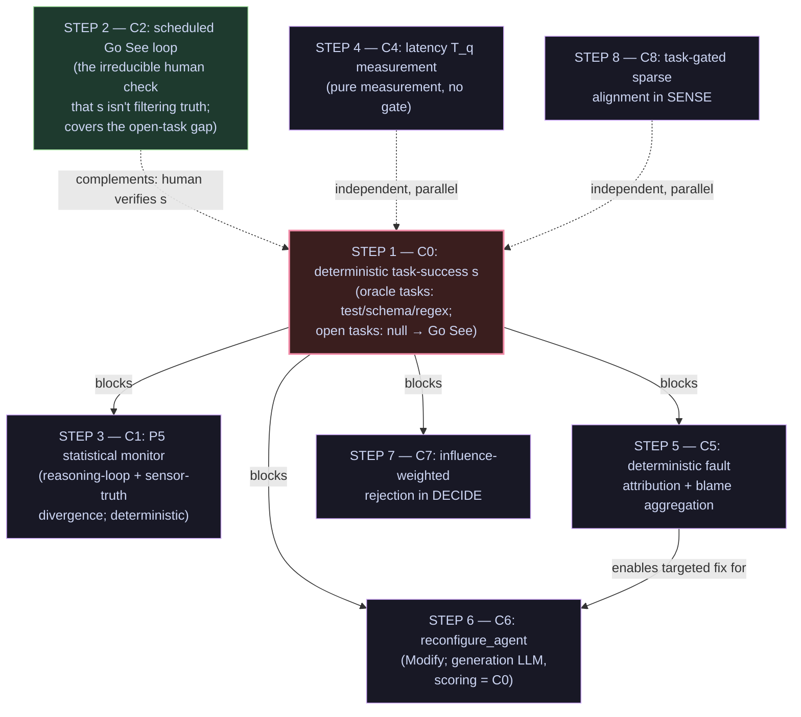

# Cybernetic Swarm Plan — Reference Model, Map, and Findings

> **⚠️ Partially deprecated 2026-08-20.** The cybernetic reference model
> (six canonical loops, C0–C6) and the swarm-intelligence composition
> remain current. Skill execution is upstream-Zed body injection
> (`SkillTool::run` → `render_skill_envelope`); PDCA loops are
> model-coordinated via `lisp_eval` and `render_template`.
>
> The cybernetic frame, the swarm-intelligence and swarm-steering skills, and
> the `hkask-mcp-swarm` server survive. Claims that reference deleted
> subsystems are historical.

> Companion to `abw-swarm-intelligence.md`. That document is the
> **current-state** substrate (ABW semantics, tool surface, consent gate). This
> document is the **cybernetic frame** layered on top: how the six canonical
> cybernetic laws, the human-on-the-loop steering model, and the Toyota
> Improvement Kata compose with the `swarm-intelligence` skill and its consent
> gate. Every hKask claim below is grounded in the cited code paths or plan-doc
> sections; the two external sources are cited by URL and quoted where
> load-bearing. When this document disagrees with the code, the code wins.
>
> **Status:** reference + findings, 2026-08-02 (revision 2). Not yet implemented
> — the components (§6) are proposals ranked by leverage, with implementation
> sequencing in §8 governed by the dependency hierarchy (§3).

## Design constraints (this revision)

This revision is governed by four constraints that override the earlier draft:

1. **The fusion system was deprecated and removed.** Verified: `grep` for
   `fusion|panel_models|MultiModelInferencePort|FusionProvider` in
   `kask/**/*.rs` returns **zero matches**. Any proposal that relied on
   `kask.fusion.panel_models` as a judge asset is withdrawn. (The repo `.rules`
   carried 5 stale fusion references; they have been deleted — see Appendix B.1,
   DONE. The removal is itself a finding: a `.rules` convention prior that named a
   removed symbol.)
2. **LLM-as-a-judge is deprecated as a concept.** A probabilistic scorer that
   rates outputs is not an acceptable evaluation path anywhere in this plan.
   This rules out the LLM rank-vector judge from S5 (JudgeFlow) and the LLM
   scoring step from S7 (MASS Stage 1/3 MIPRO). Generation (an LLM *producing*
   text, e.g. `swarm_generate_prompt` writing a new system prompt) is a
   different use and remains admissible; only *judging* (scoring/ranking) must
   be deterministic.
3. **If we use a judge, it must be deterministic, not probabilistic** — "which
   isn't usually what is meant by a judge." The acceptable "judge" is a
   deterministic rule: test pass/fail, schema validation, exit code, regex /
   reference match, a guard-scan flag, or a deterministic aggregation of those.
   The responsibility-attribution mechanism ported from S5 is therefore a
   *deterministic rule over the `delegate` trace*, not an LLM rank — see C5 in
   §6.
4. **There are no backward-compatibility requirements.** Fields can be
   renamed, manifest steps added/removed, `d` restructured, the fusion
   references deleted outright (not deprecated). No migration notes are
   needed; this plan proposes the target shape directly.

The frame is **focused on specific value-added components to integrate per
source** (§6), not broad "partial ports." Each of the seven sources contributes
one scoped, deterministic component; everything else from that source is
explicitly dropped with a reason.

## 0. Sources and reference models

### 0.1 External sources (read in full)

| # | Source | URL | Role in this plan |
|---|---|---|---|
| S1 | Wang, Yang et al., *The Agent Use of Agent Beings: Agent Cybernetics Is the Missing Science of Foundation Agents* (arXiv:2605.10754v1, 11 May 2026) | https://arxiv.org/html/2605.10754v1 | Agent-internal cybernetics: 6 laws → 6 principles → 3 desiderata |
| S2 | Lässig, *Cybernetics and the "human-on-the-loop" in agentic coding* (ThoughtWorks, 20 Apr 2026) | https://www.thoughtworks.com/en-us/insights/blog/generative-ai/cybernetics-and-human-on-the-loop-in-agentic-coding | Human-external cybernetics: Ashby variety → meta-level steering → Go See |
| S3 | *SwarmAgentic* (arXiv:2506.15672) | https://arxiv.org/abs/2506.15672 | Population search over system structures; task-success objective `J(S)` |
| S4 | *HyEvo* (arXiv:2603.19639) | https://arxiv.org/abs/2603.19639 | Heterogeneous LLM+code nodes; multi-island evolution; reward `R(𝒢)` |
| S5 | *JudgeFlow* (arXiv:2601.07477, ICML 2026) | https://arxiv.org/abs/2601.07477 | Block judge; responsibility score `B_sel = argmin Σ r_k`; re-prompt action |
| S6 | *OFA-MAS / OFA-TAD* (arXiv:2601.12996, WWW 2026) | https://arxiv.org/abs/2601.12996 | Learned topology generator; task-aware sparse-gating encoder (TAGSE) |
| S7 | *Multi-Agent Design / MASS* (arXiv:2502.02533, ICLR 2026) | https://arxiv.org/abs/2502.02533 | Three-stage interleaved optimization: prompts → topology → prompts |

S1 and S2 are the **frame**; S3–S7 are the **prior deep-reads** from which §6
extracts one specific value-added component each.

### 0.2 The cybernetic lineage (S1 §2, S2)

- **Wiener** (1940s): feedback and control in complex systems; the feedback
  principle `u(t) = K(r(t) − y(t))`.
- **Ashby** (1956): *Law of Requisite Variety* — "Only variety can absorb
  variety"; `V(R) ≥ V(E)` for complete control.
- **Cannon / Ashby**: homeostasis — maintain essential variables in a viability
  region `Ω` despite perturbations; **ultrastability** = two-level architecture
  (fast inner loop preserves `Ω`; slow outer loop restructures `Ω`).
- **Conant-Ashby theorem** (S2): "Every good regulator of a system must be a
  model of that system."
- **Von Foerster**: second-order cybernetics — the observer is in the system;
  `R': H → K(R)` — a second-order regulator acts on the space of first-order
  regulators.
- **Shannon-Wiener**: channel capacity — `I_corrective ≤ C_channel`; residual
  output entropy `H(output) ≥ H(E) − C_channel`.
- **Stafford Beer** (1970s): Viable System Model (VSM) — cybernetics applied to
  management/organization viability.
- **Malik** (1980s, St. Gallen School): *meta-systemic steering* — the
  manager/human steps to the meta level because operative-level variety
  exceeds human cognition.
- **Toyota / Lean**: *Gemba*, *Genchi Genbutsu* ("Go See") — descend to the place
  value is created to verify steering is connected to reality; double-loop
  learning. The **Improvement Kata** (Rother 2010) is the 4-step scientific
  thinking loop the hKask `swarm-intelligence` skill instantiates.

### 0.3 The Kata/Kanban mapping (the user's frame)

- The hKask `swarm-intelligence` skill **is an Improvement Kata**:
  SENSE (grasp current) → ORIENT (establish target / classify gap) → DECIDE
  (predict) → ACT (experiment) → CHECK (measure) → CONVERGE (check + act).
- The hKask consent gate **is a Kanban pull-system for credits**: the operator
  mints a consent token only when ready to spend (= pull); the per-dispatch
  ceiling (`HKASK_ABW_MAX_CREDITS`) is the WIP limit on spend.
- The `metacognition` skill is the Kata applied to the agent's own
  map-building — same four steps, with a deterministic gap + Brier
  convergence compute. This plan was produced using that skill's methodology
  (see §9.2 for the honest metacognitive record).

## 1. The single cybernetic argument (S1 + S2 compose)

The two frame sources are **not parallel** — they compose into one argument:

- **S1 (Agent Cybernetics)** = the **agent-internal** control architecture.
  Six laws → six agent principles → three desiderata (Reliability, Lifelong
  Running, Self-Improvement). The human appears at exactly one seam: P3 outer
  loop "escalating to a human overseer for clarification" (S1 §3.1 Principle 3)
  and §4.1 "Human-in-the-Loop Approval" — *"checkpoints at which the agent
  pauses before executing high-risk actions … research challenges include
  determining which actions warrant escalation without making human oversight a
  bottleneck … learning escalation thresholds from operator feedback over
  time."*
- **S2 (ThoughtWorks)** = the **human-external** steering architecture. Ashby's
  requisite variety → the human steps to the meta level ("on-the-loop") because
  operative-level variety exceeds human cognition. Steering via two mechanisms:
  **attenuation** (aggregate/filter so the human isn't overwhelmed) and
  **amplification** (encode policy into the agent). Conant-Ashby: the human must
  hold a model of the system. **Go See / Gemba**: the human periodically descends
  to the operative level to verify the sensor isn't filtering out the truth =
  double-loop learning.

**The seam:** S1's "escalate to human overseer" (P3 outer loop, §4.1 approval
gate) **is** S2's "human-on-the-loop." S1 says *when* the agent should hand
control to the human (boundary of competence, high-risk action); S2 says *how*
the human receives and acts on that handoff without becoming the bottleneck
(variety attenuation/amplification) and *how* the human verifies the handoff
itself is calibrated (Go See).

## 2. The six principles × hKask swarm substrate

Every hKask surface below is verified against the `swarm-intelligence`
skill, the runtime (`kask/mcp-servers/hkask-mcp-swarm/src/local_runtime.rs`),
or the substrate plan (`abw-swarm-intelligence.md`).

| # | Principle (S1) | Paper's prescription | hKask surface (verified) | Status | Gap |
|---|---|---|---|---|---|
| **P1** Closed-loop feedback | Discrete structured feedback causally upstream of next action; harness mandates acknowledgment before re-plan (S1 §3.1) | `swarm-intelligence` CHECK re-fetches workspace+wallet post-ACT; `delegate` tool loop appends tool results as next-round context (`local_runtime.rs` L596–603); CONVERGE consumes CHECK before LOOP routes `next_focus` back to SENSE (manifest L255–266) | **Has** | The skill's feedback IS causally upstream. Strong fit. |
| **P2** Requisite variety | `min(V(O),V(I)) ≥ V(W)`; hierarchical tool org; **escalation decisions are part of V(O)** (S1 §3.1) | `LocalAgentCard.capabilities.mcp_tools[]`/`skills[]` = V(O); the consent gate's *refusal* (`PaymentRequired`, ceiling exceeded) is an escalation decision = V(O) output; `LazyToolRouter` filters MCP tools to avoid floods = hierarchical compression | **Has** | S1's "selection cost" (large V(O) forces capacity spent navigating own state) is exactly what `LazyToolRouter` addresses. Fit is clean. |
| **P3** Goal homeostasis, two-level | Inner loop: re-inject original task every k steps, boundary monitors; **outer loop: restructure goal or escalate to human** (S1 §3.1) | `task` passed to SENSE/ORIENT/DECIDE/ACT via `input_mapping` (manifest L130–214) = inner-loop re-injection ✓. **Algedonic override**: 402 / un-acknowledged curator dispatch escalates regardless of `d` (manifest L35–37, L280) = outer-loop escalation ✓ | **Partial** | **No explicit goal-drift boundary monitor.** S1's R-CG2/R-AR2 pattern: classify each requirement done/in-progress/broken; if `m` consecutive checkpoints report the same broken invariant, trigger outer loop. hKask's CONVERGE checks Cauchy on `d`, not goal-drift similarity `sim(q_t, Q) < δ_drift`. The algedonic fires on a *payment* signal, not a *goal-drift* signal. |
| **P4** Black-box environment modelling | Treat prior knowledge as falsifiable; low-cost probes before consequential actions; treat errors as informative (S1 §3.1) | ABW treated as black box — `abw-swarm-intelligence.md` §0 "API surface (verified live)" + the `swarm_hire` two-phase consume pattern (consume cost=0 to validate scope+single-use, then re-verify real cost vs ABW, refund on failure — `hkask_mcp_swarm.rs` L1356–1420) IS exploratory probing before spend | **Has** | The two-phase consent consume is a textbook P4 probe-then-act. Strong fit. |
| **P5** Second-order agent regulation | Monitor own inferential process: loop detection, declining confidence, reasoning inconsistency; **confidence-gated escalation to human**. S1 §5.4: *"P5 meta-cognitive monitoring as the highest-value, lowest-cost intervention across all three domains"* and *"statistical functions over the action log requiring no modifications to the underlying model"* | CONVERGE's Cauchy criterion detects *iterate stabilization* (`next_focus` stops changing) = loop detection at the swarm level. **No statistical monitor over the iteration span log** exists today. (The fusion panel that an earlier draft proposed as the monitor asset has been removed from the codebase — see Design Constraint 1.) | **Gap (S1's headline finding, and deterministic by S1's own framing)** | S1 §5.4: *"P5 is most consistently absent from current systems … low-cost to implement (statistical functions over the action log), expected benefit high."* hKask detects *swarm-state* loops (Cauchy on `d`) but not *curator-reasoning* loops. The monitor is **deterministic by construction** — statistics over the span log, no LLM — which is exactly the determinism Constraint 3 requires. See component C1 in §6. |
| **P6** Context entropy minimization | Retain content iff it increases `I(a_t; goal | c_t)`; active compression, principled forgetting (S1 §3.1) | Within-skill: CONVERGE feeds only `next_focus` + `lessons_learned` back (compressed ✓). Within-`delegate`: tool-loop appends results as raw user messages across `MAX_TOOL_ROUNDS` (NOT compressed); `executed_skills`/`tool_calls` summaries are returned to the caller, not fed back into the loop | **Partial** | S1 P6: raw interaction history has high entropy / low predictive value; a structured summary carries more mutual information. hKask's summaries are the right shape but aren't compressed into the next round's context. |

## 3. The three desiderata × hKask (the dependency hierarchy)

S1 Appendix A.3 is load-bearing: **Reliability gates Lifelong Running gates
Self-Improvement** (strict, not independent). hKask's swarm layer maps cleanly
onto D1, partially onto D2, weakly onto D3.



| Desideratum | Primary principles | hKask realization | Status |
|---|---|---|---|
| **D1 Reliability** | P1, P2, P5 | 3-layer consent gate + per-dispatch ceiling + gas + tool-allowlist separation (the spend membrane, `abw-swarm-intelligence.md` §3.6; the per-call capability gate this row originally credited was removed — RR-0056). `swarm_fire` = no-credit roster removal (recoverable); `swarm_delete_agent`/`swarm_delete_swarm` = destructive, gated. Guard scanning = redact-and-continue (graceful, non-fatal). | **Strong** — hKask *exceeds* S1 here; S1's §4.1 "human approval gates" is hKask's consent gate; S1's CLI irreversibility triad {read, recoverable, destructive} maps onto hKask's read/list vs hire/delegate vs delete. |
| **D2 Lifelong Running** | P3, P4, P6 | `LocalAgentRegistry` reloads from disk (episodic cards, `local_registry.rs` L131); the skill's `prior_iteration` = 1-step memory; `thread_condenser` hook exists. No semantic/procedural promotion across swarm runs. | **Partial** — single-iteration memory; no cross-run skill promotion (S1's R-CG3: "promote resolved bug classes to skill library after validation on ≥2 held-out instances"). |
| **D3 Self-Improvement** | all six | The `swarm-intelligence` skill adjusts *composition* (topology) but not *its own control laws* — the manifest's SENSE/ORIENT/DECIDE templates are static. The `self-improvement` skill exists separately (per the skills catalog) but is not wired into swarm-intelligence. | **Gap** — the swarm does not improve its own improvement procedure (recursive self-improvement, which S1 §4.3 flags as the hardest open problem). |

## 4. The human-on-the-loop mechanisms × hKask (S2)

**Naming (grounded in the code):** "the curator" is the actor — the
`CuratorAgentServer`-backed `ConversationView` built in `ensure_steer_conversation`
(`swarm_panel.rs` L1647) with the `steer_system_prompt` as static context.
"Steer" is a `PanelMode` (L246 — Browse/Author/Compose/Steer), the capability
the curator exercises (compose/steer a swarm; its `SkillTool` invokes the
`swarm-intelligence` cascade). **"Steer curator" is not a thing** — there is one
curator, and steering is one of its capabilities. Xaman Ek (`swarm_xaman`) is a
*separate, remote, third-party ABW consultant*, not the curator.

| S2 mechanism | Cybernetic law it instantiates | hKask surface | Status |
|---|---|---|---|
| **Attenuation** (aggregate/filter so the human isn't overwhelmed) | Ashby: human variety < system variety → filter | `with_wallet` (balance rides every tool response, `abw-swarm-intelligence.md` §4.1) — a single scalar, not 200 logs. `render_consent_banner` + `within_budget: false` disables Confirm (§3.6) — the spend signal is reduced to one boolean. The algedonic channel *only* escalates on 402/un-ack, not on every dispatch. | **Has** — hKask already attenuates. The banner is textbook variety attenuation: the human sees one boolean, not the cost breakdown. |
| **Amplification** (encode policy into the agent) | Conant-Ashby: human's model amplified into agent's policy | **Steer system prompt** (§15.5): "names both tool sets, the current mode, the consent gate, the ceiling, and the `swarm-intelligence` skill." `.rules` + `AGENTS.md` + `DIVERGENCE.md` = the human's model encoded into every agent session. `kask.swarm.curator_consent_default: false` = a policy encoded as a setting. | **Has** — the Steer prompt IS amplification. The `.rules` "Convention priors must be verified against the codebase" trap is the Conant-Ashby discipline operationalized: a `.rules` entry is the human's model; `grep` verifies it against reality; a stale rule is model drift detected by verification. |
| **Conant-Ashby modeling** ("every good regulator must be a model of the system") | The human must hold a working model; model drift = steering failure | `abw-swarm-intelligence.md` (the verified-live API ledger, §0 response shapes, §17 endpoint ledger) IS the human's model of the swarm substrate. The "verified live 2026-08-02" annotations are model-freshness timestamps. | **Has** — and the plan doc's discipline of re-verifying endpoints live IS the Conant-Ashby update loop. |
| **Go See / Gemba** (descend to operative level; verify sensor isn't filtering truth; double-loop learning) | Reverses attenuation; the human's technical intuition is the ultimate sensor | **Steer mode `ConversationView`** (§15.5) is the descend surface — the human talks to the curator at the problem-solution level. | **Partial — and this is the key gap (see §5).** |

## 5. The Go See gap (the double-loop finding)

S2 is explicit and load-bearing (quoted verbatim):

> *"Sensors attenuate variety through aggregation and filtering and 'Go See'
> deliberately reverses this; the human steps back into reality … LLMs can
> produce code that looks right and pass unit tests and fulfill basic
> requirements, but may introduce decay or contain hallucinations sensors
> won't flag … Calibrating the steering ensures the sensors aren't filtering
> out the truth, and that the guides are actually having the intended effect in
> the code. 'Go See' is a corrective; it should be a fixed feedback loop in the
> 'Human-on-the-loop' system. It's actually an application of double loop
> learning."*

Read cybernetically against hKask: **`d` (the convergence metric) is a sensor
that attenuates variety.** It reduces the full swarm state to three numbers
(variety_coverage, diversity, loop_closure). A swarm with `d = 0` (perfect
variety, diversity, loop closure) can still fail the task. **The sensor is
filtering out the truth — task failure — exactly the failure mode S2 names.**

This **reframes** the prior five-paper deep-read's headline finding (G1: "hKask
optimizes swarm-health `d`, not task-success"). It is not merely "wrong objective
function." It is the cybernetic diagnosis S2 predicts: **a sensor designed for
attenuation (swarm-health) filters out the signal a human would catch by
descending (task-failure).** S2's prescribed remedy — Go See as a *fixed
feedback loop* — is the human-in-the-loop mechanism that compensates for a
sensor that cannot, by Ashby's law, carry the full variety of task success.

### 5.1 Why Go See cannot be fully automated (the cybernetic bound, and the determinism constraint)

The prior five papers (S3–S7) all attempt to *automate* the Go See signal. Under
this revision's determinism constraint, only the **deterministic** evaluators
among them survive:

- S3 SwarmAgentic: `J(S)` — task-specific verifier (TravelPlanner's constraint
  checker) or LLM judge (Creative Writing). The **verifier** path is
  deterministic and admissible; the LLM-judge path is deprecated (Constraint 2).
- S4 HyEvo: `R(𝒢)`'s `S_q` term — accuracy (math) or pass@1 (code). Both are
  **deterministic** (exact match / test pass). Admissible. The `U_c`/`U_t`
  cost/latency terms are deterministic measurements. Admissible.
- S5 JudgeFlow: `φ_eval(a'_M, a)` — in the paper's math/code benchmarks this is
  **exact-match / pass@1**, a deterministic evaluator. Admissible as the
  *failure predicate*. The *responsibility attribution* step (the LLM that
  produces the rank vector `r_i`) is **deprecated** (Constraint 2) — C5 in §6
  replaces it with a deterministic rule over the trace.
- S6 OFA-MAS: task accuracy on 6 benchmarks (Stage-3 fine-tuning) —
  deterministic, but tied to a learned generator that is not portable.
- S7 MASS: `E_D` on a held-out sample — the metric is task-dependent; where it
  is accuracy/pass@1 it is deterministic and admissible; the MIPRO optimizer's
  *scoring* of candidate prompts would need a deterministic scorer, not an LLM
  judge.

The blocking unknown in every case was **`a`, the ground-truth answer**, on
open-ended tasks. S1's P6 (Shannon-Wiener channel capacity) is the formal
reason: `H(output) ≥ H(E) − C_channel`. No automated sensor can carry the full
variety of "is this actually right" — the channel is finite. **The cybernetic
argument implies Go See cannot be fully automated away; the best the swarm can
do is reduce the *frequency* of descents by improving the deterministic sensor,
not eliminate them.** Constraint 2 (no LLM judge) sharpens this: the
deterministic evaluator can only ever cover tasks with a deterministic oracle
(tests, schemas, regex, exit codes, reference answers); open tasks without an
oracle fall back to the human Go See, not to an LLM judge.

**The complete design:** add a deterministic task-success term `s` to `d`
(automate part of Go See, for oracle tasks only) **AND** schedule a fixed Go
See feedback loop (the irreducible human check that the deterministic sensor
still isn't filtering truth, covering the open-task gap the deterministic
sensor cannot reach). They are complements, not alternatives.

## 6. Specific value-added components to integrate (one per source)

This is the core of the revision. Each source contributes **one scoped,
deterministic component**. Everything else from that source is dropped with a
reason. The precondition C0 (deterministic task-success evaluator) spans
S3/S4/S5/S7 and is presented first because it gates three of the components.

### C0 — Precondition: deterministic task-success evaluator `s` (spans S3, S4, S5, S7)

- **What:** a deterministic predicate `s(task, swarm_output) ∈ {pass, fail}`
  (or a numeric score from a deterministic source) that becomes a fourth term
  in `d`. Acceptable `s`: test pass/fail, schema validation, exit code, regex /
  reference match, or an operator/curator-asserted expected answer compared by
  equality. **Not acceptable:** any LLM-produced score or rank (Constraint 2).
  For open tasks with no oracle, `s` is *absent* and the task falls back to the
  Go See loop (C2) — do not fake `s` with an LLM.
- **Integration point:** a new CHECK input `task_success` carrying `s` (or
  `null`); `d` gains a `(1 − s)²` term when `s` is non-null and is unchanged
  when `s` is null (open task).
- **Why value-added:** it is the precondition for C1's sensor-truth divergence
  signal, C3's failed-edit memory (needs to know an edit failed), C5's fault
  attribution (needs `s < ε` to know there *was* a fault), C7's influence score
  (needs `E` deltas). Without it those four have no signal.
- **Gates:** C1, C3, C5, C7.

### C1 — S1 Agent Cybernetics: P5 statistical second-order monitor over the span log

- **What:** a deterministic statistical monitor over the
  `reg.skill.swarm-intelligence.*` iteration span log. S1 §5.4 is explicit:
  *"statistical functions over the action log requiring no modifications to the
  underlying model."* Two signals:
  1. **Reasoning loop** — `(deficit_class, decision_action)` repeats across `m`
     consecutive iterations with no `d` improvement.
  2. **Sensor-truth divergence** — `d` improves while a deterministic
     task-success signal `s` (C0) declines, i.e. the swarm looks healthier but
     is failing more tasks. This is the cybernetic Go See diagnosis (§5)
     automated as a cheap statistic.
- **Integration point:** a new CONVERGE-side deterministic compute step
  (a new `compute_ref` primitive, e.g.
  `swarm.second_order_monitor`) reading the last `k` iterations' spans.
- **Why value-added:** S1 §5.4 names this the "highest-value, lowest-cost
  intervention" and it is **deterministic by S1's own framing** — exactly what
  Constraint 3 requires. No LLM, no fusion. It is the cheapest signal in this
  plan and it detects the exact failure mode (sensor filters truth) that §5
  identifies as the central gap.
- **Dropped from S1:** the full 6-principle re-architecture; only P5's monitor is
  ported. P1/P2/P4 are already satisfied (§2); P3's outer-loop goal
  restructuring is covered by C2 (Go See); P6's context compression is a
  separate, lower-priority concern.
- **Needs C0:** yes (for signal 2).

### C2 — S2 ThoughtWorks: Go See as a scheduled fixed feedback loop

- **What:** a scheduled descend cadence — every `N` swarm-intelligence
  convergences (or on C1's sensor-truth-divergence trigger), force a Steer
  `ConversationView` descend with a deterministic checklist:
  1. Is the deterministic sensor `s` (C0) filtering out task-failure truth?
  2. Are the `.rules` priors still verified against the codebase? (grep the
     cited symbols; a stale `.rules` entry is itself a finding — see Appendix B
     for the fusion entries this revision found stale.)
  3. Are the Steer guides (the system prompt naming the gate/ceiling/skill)
     having the intended effect on the curator's decisions?
- **Integration point:** a CONVERGE-side counter + a deterministic trigger that
  emits a Steer descend directive (no spend — Steer conversations are not
  persisted and do not consume consent tokens, §15.5). The checklist is the
  double-loop learning S2 prescribes.
- **Why value-added:** S2's load-bearing claim is that Go See is "a fixed
  feedback loop in the human-on-the-loop system," not an on-demand option.
  hKask's Steer mode is operator-initiated today (§15.5: "Conversations are not
  persisted"). Scheduling it makes the human's model (`.rules`, plan doc) a
  *verified* model rather than an assumed one — the Conant-Ashby discipline.
- **Dropped from S2:** the broader VSM/management-craft framing; only the Go
  See cadence + checklist is ported. The attenuation/amplification framing is
  already satisfied by hKask's consent banner / Steer prompt (§4).
- **Needs C0:** no (it is the human fallback *for when C0 is absent* on open
  tasks). Complements C1.

### C3 — S3 SwarmAgentic: failed-edit memory `F(v_i)` (minus the LLM)

- **What:** S3 §4.3's "Failure-Aware Velocity Update" records prior failed
  velocity updates and avoids them. The deterministic core (minus S3's LLM
  `LLM_flaw`, deprecated by Constraint 2): CONVERGE logs each iteration's
  `(decision_action, swarm_state_signature, d_delta)`; DECIDE rejects a
  re-proposal whose `(decision_action, swarm_state_signature)` matches a prior
  entry with `d_delta ≤ 0`.
- **Integration point:** a CONVERGE-side accumulator (deterministic set of
  failed-edit signatures) + a DECIDE guard that filters proposed actions
  against it. `swarm_state_signature` = a deterministic hash of the deficit
  class + the current roster's `agent_type` multiset.
- **Why value-added:** S3's ablation (Tab. 5) shows the failure-memory term is
  the difference between a stuck single-trajectory search and one that escapes
  local optima. hKask's CONVERGE checks Cauchy stabilization but does *not*
  record "what I tried and that failed to improve `d`" — so DECIDE can
  re-propose the same hire/fire cycle indefinitely. This is the cheapest
  anti-loop mechanism in the plan and it is purely deterministic.
- **Dropped from S3:** the population search `N=5` + pbest/gbest (expensive
  under the consent gate — each candidate hire needs a token; better suited
  to the curator in Steer mode (it reasons over candidates without spending),
  not the automated cascade); the `LLM_flaw` system-wide diagnosis (probabilistic,
  deprecated); the executable-code search space (hKask's `delegate` pipeline is
  fixed by design — a safety feature, not a limitation to remove).
- **Needs C0:** yes (to know an edit "failed" = `d_delta ≤ 0` *and* `s` did
  not improve; `d` alone is the sensor-truth risk).

### C4 — S4 HyEvo: latency measurement `T_q` in `LocalDelegateResult`

- **What:** S4's reward `R(𝒢) = λ1·S + λ2·U_c(C_q) + λ3·U_t(T_q)` (§3 Eq.6)
  measures both cost (`C_q`, tokens — hKask has `tokens_used`/`cost`) and
  latency (`T_q`, end-to-end — hKask does **not** record). Port only the
  *measurement* of `T_q`: add `latency_ms` to `LocalDelegateResult`, captured
  by a `SystemTime` span around `delegate` (`local_runtime.rs` L366–638).
- **Integration point:** a new field on `LocalDelegateResult` (no backward-compat
  per Constraint 4 — add directly) + a span attribute on the
  `reg.skill.swarm-intelligence.*` delegation span.
- **Why value-added:** hKask already measures `C_q` (the 1cr/1000tok debit)
  but is blind to `T_q`. S4's headline empirical result (19× cost / 16×
  latency reduction on MBPP) comes from offloading deterministic ops to code
  nodes — *not* portable (C4 below). But the *measurement* that made that
  finding visible is portable, cheap, and deterministic, and it unblocks any
  future cost-aware decision (e.g. C8's influence score could weight by
  cost/latency, not just `d`). Measurement before optimization.
- **Dropped from S4:** the heterogeneous LLM+code nodes (`compute_ref` is a
  closed registry and `lisp.eval` is operator-authored — adding meta-agent-
  synthesized code is a new security surface, not in scope); the multi-island
  MAP-Elites evolution (no evolutionary substrate in hKask — grep
  `island|elite_archive|MAP-Elites` → 0 hits); the reflect-then-generate LLM
  (probabilistic, deprecated); the tri-objective reward `R(𝒢)` (needs the
  evolution it drives).
- **Needs C0:** no (pure measurement).

### C5 — S5 JudgeFlow: deterministic fault attribution + blame aggregation (LLM Judge replaced by a rule)

- **What:** S5's pipeline shape (Evaluate → attribute → aggregate → focus) with
  the **LLM Judge replaced by a deterministic rule** over the `delegate` trace.
  S5's aggregation `B_sel = argmin_{B_k} Σ_t r_k^{(t)}` (§3.2.1 L293) assumes
  *rank* semantics (rank 1 = most responsible = smallest number, argmin picks
  most-consistently-blamed). The deterministic analogue: per failed task,
  attribute blame to **exactly one agent** by a deterministic rule, increment a
  counter, and select `agent_sel = argmax_agent blame_count[agent]`.
  The deterministic attribution rule, in priority order:
  1. If `s < ε` (C0's deterministic evaluator failed on the terminal output),
     attribute to the **terminal agent** (the one whose `produces[]` the task
     metric scored).
  2. Else if any agent's `tool_calls[].ok = false` (a dispatch failed,
     `local_runtime.rs` L568–578) or `"not in declared mcp_tools allowlist"`
     (L581–591), attribute to the **earliest such agent** in delegation order.
  3. Else if any agent's `executed_skills[].ok = false` (a declared skill
     cascade failed, L442–454), attribute to the **earliest such agent**.
  4. Tie-break by delegation order (deterministic).
- **Integration point:** ORIENT emits `agent_at_fault` (deterministic, per the
  rule above) for each failed task; CONVERGE aggregates
  `blame_count[agent] += 1` across iterations and surfaces
  `agent_sel = argmax blame_count`; the per-fault record `(task, expected,
  actual, per_agent_output)` is appended to a per-`agent_sel` failure log
  `L_{agent_sel}` (S5 §3.2.1 L290) and fed as context to DECIDE.
- **Why value-added:** this is the cleanest port of a responsibility mechanism
  that is **deterministic by construction** (Constraint 3). It explicitly
  diverges from S5's LLM Judge — and the divergence is the point: a
  deterministic judge "isn't usually what is meant by a judge" (Constraint 3),
  but it is what hKask should build. The trace data already exists
  (`executed_skills`/`tool_calls` with `ok`/`error`, `local_runtime.rs`
  L628–668); C5 only aggregates it.
- **Dropped from S5:** the LLM Judge and its App.C prompt (probabilistic,
  deprecated by Constraint 2); the `seq`/`for`/`cond` block primitives (ABW
  forbids delegation chains — `swarm-intelligence.yaml` L8–10 — so a `for`/`cond`
  over agents is not representable in the current topology); the Top-K
  candidate pool + softmax resampling (S5 Eq.4–5) — orthogonal to blame
  attribution, and hKask's Cauchy-convergent single-state loop can stay.
- **The Modify action (re-prompt) is retained** as a shared component with S7
  — see C6. Re-prompting via `swarm_generate_prompt` is *generation* (an LLM
  producing a new prompt), not *judging*, so it is admissible under Constraint 2.
- **Needs C0:** yes (the failure predicate `s < ε` is C0).

### C6 — S5 + S7: `reconfigure_agent` DECIDE action (Modify Block / MASS prompt axis)

- **What:** a new DECIDE action that rewrites a blamed agent's
  `system_prompt` in place — the Modify-Block action from S5 §3.2.2 and the
  prompt axis from S7 Stages 1+3. The action is: pick `agent_sel` (from C5),
  call `swarm_generate_prompt` seeded with the agent's current `system_prompt`
  + the per-fault log `L_{agent_sel}` (the deterministic trace of why it
  failed), write the new prompt to `agent_card.json`, and reload via
  `LocalAgentRegistry::load` (which re-reads on staleness, `local_registry.rs`
  L131). The *scoring* of candidate prompts must be deterministic (C0's `s`),
  not an LLM judge.
- **Integration point:** a new DECIDE decision class `reconfigure_agent`;
  `agent_card.json` rewrite + `LocalAgentRegistry::load`.
- **Why value-added:** hKask's `system_prompt` is frozen at hire time; the only
  DECIDE levers today are hire/fire (topology). S5's case study (§4.3 L569)
  shows the blamed block is often better *re-prompted* than fired. S7's §2.1
  finding ("optimize agents locally before scaling their topology") is the
  same insight. This adds the prompt axis that §6's gap analysis (and the prior
  5-paper deep-read's G2) identifies as the axis hKask's loop never touches.
- **Dropped:** S7's MIPRO joint instruction+exemplar optimization loop (its
  scoring step is LLM-based, deprecated; the deterministic scorer C0 is weaker
  than MIPRO's validation-set metric but admissible); S7's Stage 3 global joint
  re-optimization (needs an end-to-end task metric over a held-out sample =
  C0 + a sample, future work).
- **Needs C0:** yes (to score candidate prompts deterministically and to know
  the reconfiguration improved `s`).

### C7 — S7 MASS: influence-weighted rejection in DECIDE (Stage 2, minus the LLM optimizer)

- **What:** S7 Stage 2's influence-weighted rejection sampling (Alg.1 L9–17),
  reduced to its deterministic core. Maintain a per-`agent_type` influence
  score `I_{agent_type} = (Σ d_delta after hiring agent_type) − (Σ d_delta
  before)` — a deterministic running sum from CHECK. DECIDE rejects a re-hire
  of an `agent_type` whose `I_{agent_type} ≤ 0` over the last `k` hires (the
  agent type has been measured to degrade the swarm). S7 §2.2: "in HotpotQA,
  only debate brings 3% gain while others fail to improve or even degrade" —
  prune before searching.
- **Integration point:** a CONVERGE-side per-`agent_type` accumulator +
  a DECIDE guard that rejects re-hire of negatively-influential types with a
  recorded reason.
- **Why value-added:** hKask's DECIDE hires to *cover* `required_transforms`
  (variety deficit) but never *rejects* agent types that have been measured to
  *degrade* the swarm. This is the deterministic version of S7's "prune before
  search" and it closes a P2 (requisite variety) gap: a swarm that keeps
  re-hiring a harmful agent type has V(O) without effective variety.
- **Dropped from S7:** the MIPRO prompt optimization (covered by C6); the
  softmax temperature sampling (S7 uses `t=0.05`; hKask's loop is deterministic
  single-trajectory, no sampling needed); the N=10 candidate evaluation (needs
  a batch evaluation harness hKask lacks).
- **Needs C0:** yes (to know a hire "degraded" the swarm = `d_delta ≤ 0` *and*
  `s` did not improve).

### C8 — S6 OFA-MAS: task-gated sparse alignment in SENSE (TAGSE structural port)

- **What:** S6's Task-Aware Graph State Encoder (§3.2 Eq.5) applies a
  task-conditioned, L1-regularized gate to node features. The **structural**
  idea (not the learned weights) ports to SENSE: replace the current uniform
  `produces/accepts` overlap density (manifest L118–120) with
  **task-conditional edge relevance**, where an edge `v_j → v_i` contributes to
  `alignment` proportional to how task-relevant `v_j.produces ∩ v_i.accepts` is
  to the task's `required_transforms`, regularized toward sparsity (most edges
  → 0 for a given task).
- **Integration point:** SENSE template only — a deterministic relevance
  weighting function over the delegation graph. No substrate change, no
  training, no LLM.
- **Why value-added:** SENSE currently measures all Onto4MAT properties every
  iteration regardless of task; the alignment score weights every
  `produces/accepts` edge equally. S6's ablation (Table 3, `w/o TAGSE` −2.00)
  shows task-gating matters. This is the **only portable idea from S6** and it
  is a pure template change.
- **Dropped from S6:** the autoregressive DAG generator (needs the trained MoE
  + TAGSE weights — no training infra); the 16 learned expert MLPs (no training
  infra); the closed 19-role pool (incompatible with ABW's open `agent_type`);
  Stage-3 outcome fine-tuning (no per-composition task-outcome telemetry); the
  unlabelled-DAG output format (strictly weaker than `LocalAgentCard`'s typed
  ports — porting it would *lose* information).
- **Needs C0:** no (it is a SENSE measurement refinement, independent of `s`).

## 7. Integration plan (components, ranked and sequenced)

**Implementation status (2026-08-02):** C0, C4, and C8 are **implemented and
validated** — see Appendix C for the per-component validation record. C1, C2,
C3, C5, C6, C7 are pending.

The components from §6, with blocking relationships and the determinism /
no-backward-compat constraints applied. C0 is the precondition; the rest follow
the dependency hierarchy (§3): D1 reliability mechanisms (C1, C5, C6, C7) gate
D2 lifelong-running mechanisms (C3, C4, C8) which gate D3 (none here — D3 is
out of scope per §3).

| Step | Component | Source | Deterministic? | Gates | Needs C0? | Reuses |
|---|---|---|---|---|---|---|
| 1 | **C0** deterministic task-success `s` (oracle tasks: test/schema/regex/exit-code/reference; open tasks: null → Go See) | S3/S4/S5/S7 | yes | C1, C3, C5, C6, C7 | — | CHECK input, `delegate` trace |
| 2 | **C2** scheduled Go See fixed feedback loop | S2 | yes (cadence + checklist) | — | no (it is the human fallback *for when C0 is null*) | Steer `ConversationView`, `.rules`, plan doc |
| 3 | **C1** P5 statistical second-order monitor over the span log | S1 | yes (S1 §5.4 explicit) | — | yes (signal 2) | `reg.skill.swarm-intelligence.*` span log |
| 4 | **C4** latency `T_q` in `LocalDelegateResult` | S4 | yes (`SystemTime`) | — | no | `delegate` span |
| 5 | **C5** deterministic fault attribution + blame aggregation | S5 (LLM Judge replaced) | yes (rule over trace) | C6 | yes | `delegate` trace (`executed_skills`/`tool_calls`), `LocalAgentRegistry::load` |
| 6 | **C6** `reconfigure_agent` DECIDE action (Modify) | S5 + S7 | generation is LLM (admissible); scoring is C0 (deterministic) | — | yes | `swarm_generate_prompt`, `agent_card.json` rewrite |
| 7 | **C7** influence-weighted rejection in DECIDE | S7 (Stage 2) | yes (running sum) | — | yes | CHECK `d` deltas, per-`agent_type` accumulator |
| 8 | **C8** task-gated sparse alignment in SENSE | S6 (TAGSE) | yes (relevance function) | — | no | SENSE template only |

### 7.1 Explicitly NOT integrated (grounded reasons, per Constraint 4)

- **S3 population search (N=5) + pbest/gbest:** each candidate hire needs its
  own consent token; the 3-layer gate makes multi-candidate search expensive at
  the skill layer. If population reasoning is wanted, route it through the
  curator in Steer mode (it reasons over candidates without spending), not the
  automated cascade. The LLM `LLM_flaw` is deprecated (Constraint 2).
- **S4 multi-island + MAP-Elites evolution:** zero evolutionary substrate in
  hKask (`grep island|elite_archive|MAP-Elites|population` → 0 hits). Net-new
  infrastructure; the ring-migration + behavior-grid do not compose with the
  consent gate. The reflect-then-generate LLM is deprecated.
- **S4 synthesized code nodes (`c_src`):** `compute_ref` is a *closed* registry
  (`compute.rs` rejects unknown names); `lisp.eval` is operator-authored, not
  meta-agent-synthesized. Adding meta-agent-synthesized code is a new security
  surface needing its own allowlist/governance — a cloned ABW card must not
  declare an arbitrary handler (the existing `mcp_tools` provenance-filter
  pattern applies).
- **S5 LLM Judge (App.C prompt):** deprecated by Constraint 2. Replaced by the
  deterministic rule in C5.
- **S5 `seq`/`for`/`cond` block primitives:** ABW forbids delegation chains
  (`swarm-intelligence.yaml` L8–10), so a `for`/`cond` over agents is not
  representable; not in scope.
- **S6 learned MoE generator + 16 experts + 19-role pool + Stage-3 fine-tuning:**
  no training infra; the closed pool is incompatible with ABW's open
  `agent_type`; the unlabelled-DAG output is weaker than `LocalAgentCard`.
- **S7 MIPRO prompt-optimization loop + softmax sampling + N=10 candidate eval:**
  the MIPRO scoring step is LLM-based (deprecated); hKask's loop is
  deterministic single-trajectory (no sampling needed); the batch evaluation
  harness is absent. The prompt *axis* survives as C6 with a deterministic
  scorer.

## 8. Implementation sequencing (the dependency hierarchy constraint)

S1 Appendix A.3: **Reliability gates Lifelong Running gates Self-Improvement.**
Applied to the components:



**Rationale:**
1. **C0 is the precondition, not one component among eight.** C1 (signal 2),
   C3, C5, C6, C7 all consume the task-success signal. A loop optimizing `d`
   alone converges on healthy swarms that fail the task — the worst failure
   mode because `d` reports success (§5).
2. **C2 (Go See) is scheduled alongside C0, not after.** S2's argument: the
   deterministic sensor upgrade (C0) and the human check (C2) are complements.
   C0 reduces descent frequency *for oracle tasks*; C2 is the irreducible check
   that C0's sensor still isn't filtering truth, and it covers open tasks where
   C0 is null.
3. **C1, C4, C8 can proceed in parallel with C0** where they don't need `s`
   (C1 signal 1 = reasoning loop does not need `s`; C4 = pure measurement; C8 =
   SENSE template change). C1 signal 2, C5, C6, C7 wait on C0.
4. **D3 (self-improvement) is out of scope** for this plan. S1's dependency
   hierarchy says it gates on D1+D2; the components here are D1/D2 refinements.
   Recursive self-improvement (the `self-improvement` skill wired into
   swarm-intelligence) is deferred until C0–C8 land.

## 9. Diagrams

### 9.1 The complete cybernetic swarm map (revision 2 — fusion removed, deterministic judge)

```mermaid
flowchart TD
  classDef human fill:#1e3a2e,stroke:#a6e3a1,color:#cdd6f4
  classDef inner fill:#181825,stroke:#cba6f7,color:#cdd6f4
  classDef outer fill:#3a2e1e,stroke:#f9e2af,color:#cdd6f4
  classDef gap fill:#3a1e1e,stroke:#f38ba8,color:#cdd6f4
  classDef det fill:#1e2e3a,stroke:#89b4fa,color:#cdd6f4

  H["Human (on-the-loop)<br/>holds model: .rules + plan docs<br/>= Conant-Ashby regulator"]
  STEER["Steer prompt + .rules<br/>= AMPLIFICATION (S2)<br/>encode policy into curator"]
  BANNER["consent banner + with_wallet<br/>= ATTENUATION (S2)<br/>one boolean to human"]
  ALGEDONIC["algedonic channel<br/>402 / un-ack curator<br/>= P3 outer-loop escalation (S1)"]

  subgraph INNER["Inner loop — swarm-intelligence skill (P1, S1)"]
    SENSE["SENSE: measure swarm state<br/>(C8: task-gated sparse alignment)"]
    ORIENT["ORIENT: classify deficit<br/>+ C5: deterministic agent_at_fault"]
    DECIDE["DECIDE: hire/fire/delegate<br/>+ C6: reconfigure_agent<br/>+ C7: influence rejection"]
    ACT["ACT: gated spend"]
    CHECK["CHECK: re-measure<br/>+ C0: deterministic task-success s"]
    CONVERGE["CONVERGE: Cauchy on d<br/>+ C1: P5 statistical monitor<br/>+ C3: failed-edit memory"]
    SENSE --> ORIENT --> DECIDE --> ACT --> CHECK --> CONVERGE
    CONVERGE -->|next_focus| SENSE
  end

  subgraph GEMBA["Go See / Gemba (P3 outer loop, double-loop, S2)"]
    DESCEND["C2: scheduled Steer descend<br/>(every N convergences or on<br/>C1 sensor-truth divergence)"]
    VERIFY["human verifies s isn't<br/>filtering out task-failure truth<br/>+ .rules priors still verified"]
    UPDATE["update model: .rules / plan / harness"]
  end

  H -->|amplify| STEER
  STEER --> INNER
  INNER -->|attenuate| BANNER --> H
  CONVERGE -->|algedonic| ALGEDONIC --> H
  H -.->|Go See: fixed feedback loop (C2)| DESCEND
  DESCEND --> VERIFY --> UPDATE -->|reframe d / add s term (C0)| STEER

  G1gap["GAP: d has no task-success term<br/>= sensor filters out truth<br/>(the Go See discovery) → C0"]:::gap
  G2gap["GAP: Go See is on-demand, not a<br/>FIXED feedback loop → C2"]:::gap
  G3gap["GAP: no P5 second-order monitor<br/>(reasoning loops) → C1"]:::gap
  G4gap["GAP: ORIENT emits deficit class,<br/>not a blamed agent → C5"]:::gap

  CONVERGE -.-> G1gap
  DESCEND -.-> G2gap
  INNER -.-> G3gap
  ORIENT -.-> G4gap

  DET["Deterministic judge (C5):<br/>rule over delegate trace,<br/>NOT an LLM rank (Constraint 2/3)"]:::det
  ORIENT -.->|emits agent_at_fault| DET

  class H human
  class SENSE,ORIENT,DECIDE,ACT,CHECK,CONVERGE,BANNER,STEER inner
  class ALGEDONIC,DESCEND,VERIFY,UPDATE outer
  class DET det
```

### 9.2 The metacognitive record (this plan was produced with the metacognition skill)

The `metacognition` skill is the Toyota Improvement Kata applied to the
agent's own map-building. The four Kata steps were run inline (the
deterministic gap + Brier compute did not execute — that requires the
registry templates; disclosed honestly per the skill's "the convergence
decision is deterministic (compute steps) — no LLM convergence-check
template"):

- **meta-grasp-current (revision 1):** measured the agent's state — 1/6
  principles grounded before the experiment; obstacles O1 (conflated
  human-in-the-loop with approval, missed the variety argument), O2 (had not
  connected P3 outer loop to algedonic), O3 (treated `d` as objective choice,
  not sensor filtering truth).
- **meta-establish-target:** target = every principle + mechanism bound to a
  verified hKask surface with a named gap.
- **meta-predict (revision 1):** predicted ≥5/6 principles bound at confidence
  0.7.
- **meta-experiment (revision 1):** applied "read S1+S2 as a single cybernetic
  argument, bind both onto the verified hKask substrate." Result: 6/6
  principles bound; 11/13 map cells grounded; 2 soft cells (D3 wiring, Go-See
  cadence) flagged for separate verification. **But revision 1 asserted
  `kask.fusion.panel_models` as a live judge asset — a convention prior drawn
  from `.rules` that was NOT verified against the codebase.** This revision's
  `grep` (`fusion|panel_models|MultiModelInferencePort|FusionProvider` in
  `kask/**/*.rs` → 0 matches) exposed the assertion as stale: fusion was
  removed from the code, and the `.rules` entries that cite it are themselves
  stale (Appendix B). This is the `.rules` "Convention priors drawn from .rules
  must be verified against the codebase" trap firing on the agent's own draft —
  the Conant-Ashby discipline applied to the agent, not just the swarm.
- **meta-predict (revision 2):** predicted at confidence 0.8 that re-grounding
  every component on verified code (post-fusion-removal) and replacing the
  LLM-judge with a deterministic rule would close the stale-assertion gap and
  sharpen the per-source component extraction.
- **meta-experiment (revision 2):** applied the four design constraints. The
  fusion references are removed; the judge in C5 is a deterministic rule;
  §6 is restructured into one scoped component per source; the 5 stale
  `.rules` fusion entries were deleted (Appendix B.1, DONE).
- **Check (qualitative Brier):** revision 1's stale fusion assertion was an
  unmodeled failure mode (the agent treated a `.rules` convention prior as
  ground truth without grepping — exactly the trap the `.rules` warns about).
  **Brier self-assessment: revision 1 was overconfident on an unverified
  prior; revision 2 corrects it by verification-first grounding.** The honest
  disclosure: the deterministic gap + Brier compute did *not* run; the
  qualitative assessment is the LLM's, not the executor's. The correction that
  generalizes: **any `.rules`-cited symbol used as a design asset must be
  grepped in `kask/**/*.rs` before being depended on** — a process change, not
  a one-off fix.

## 10. Reference bibliography

### 10.1 External (frame + prior deep-reads)

- **S1** — Wang, Yang et al. *The Agent Use of Agent Beings: Agent Cybernetics
  Is the Missing Science of Foundation Agents.* arXiv:2605.10754v1, 11 May 2026.
  https://arxiv.org/html/2605.10754v1
  - §2 classical laws; §3 six principles + three desiderata; §4 research agenda
    (§4.1 human-in-the-loop approval); §5 applications (§5.2 CLI irreversibility
    gate, §5.4 P5 highest-value lowest-cost); Appendix A.3 dependency hierarchy;
    A.5 MAS generalization.
- **S2** — Lässig, Dirk. *Cybernetics and the "human-on-the-loop" in agentic
  coding.* ThoughtWorks, 20 Apr 2026.
  https://www.thoughtworks.com/en-us/insights/blog/generative-ai/cybernetics-and-human-on-the-loop-in-agentic-coding
  - Ashby requisite variety → meta-level steering; attenuation/amplification;
    Conant-Ashby; Go See / Gemba / double-loop learning; harness engineering.
- **S3** — Zhang et al. *SwarmAgentic: Towards Fully Automated Agentic System
  Generation via Swarm Intelligence.* arXiv:2506.15672.
  https://arxiv.org/abs/2506.15672
  - §3.1 particle = system S=(A,W); §4.1–4.3 PSO velocity, flaw diagnosis,
    failure-driven memory; Alg.1; Tab.5 ablation.
- **S4** — Xu et al. *HyEvo: Self-Evolving Hybrid Agentic Workflows for
  Efficient Reasoning.* arXiv:2603.19639.
  https://arxiv.org/abs/2603.19639
  - §3 v^LLM/v^Code; §4.2–4.5 multi-island MAP-Elites, reflect-then-generate;
    §3 Eq.6 R(𝒢); §5.2 19×/16× cost/latency vs AFlow on MBPP.
- **S5** — Ma et al. *JudgeFlow: Agentic Workflow Optimization via Block Judge.*
  arXiv:2601.07477 (ICML 2026). https://arxiv.org/abs/2601.07477
  - §3.1 block (B,C) B∈{seq,for,cond}; §3.2.1 Judge, `B_sel = argmin Σ r_k^{(t)}`
    (L293); §3.2.2 Add/Remove/Modify; App.C Judge prompt (deprecated as
    probabilistic — see C5); App.D optimizer prompt.
- **S6** — Li et al. *OFA-MAS: One-for-All Multi-Agent System Topology Design
  based on Mixture-of-Experts Graph Generative Models.* arXiv:2601.12996
  (WWW 2026). https://arxiv.org/abs/2601.12996
  - §3.2 TAGSE Eq.5 (task-gated sparse gate + L1); §3.3 MoE Eq.9–11;
    §3.4.1–3 three-stage training; §4.6 expert specialization.
- **S7** — Zhou et al. *Multi-Agent Design: Optimizing Agents with Better
  Prompts and Topologies* (MASS). arXiv:2502.02533 (ICLR 2026).
  https://arxiv.org/abs/2502.02533
  - §2 design-space (prompts > scaling; influential topologies sparse); §3
    three stages (Alg.1); §4 design principles P1–P3.

### 10.2 hKask internal (verified surfaces)

- The `swarm-intelligence` skill — the SENSE→ORIENT→DECIDE
  →ACT→CHECK→CONVERGE→LOOP skill; Cauchy on `d`; algedonic override; gas/rjoule
  caps; `input_mapping` passing `task`/`mode`/`prior_iteration`; the
  no-delegation-chains invariant (L8–10).
- `kask/mcp-servers/hkask-mcp-swarm/src/local_runtime.rs` —
  `LocalSwarmRuntime::delegate` (L366–638): the tool loop, the
  `executed_skills`/`tool_calls` trace (the deterministic attribution source
  for C5), the 1cr/1000tok debit.
- `kask/mcp-servers/hkask-mcp-swarm/src/local_registry.rs` — `LocalAgentCard`
  (typed `accepts`/`produces` ports, `dependencies`, `capabilities`); the
  reload-on-staleness `load` (L131) that C6's `reconfigure_agent` relies on.
- `kask/mcp-servers/hkask-mcp-swarm/src/hkask_mcp_swarm.rs` — the 28-tool
  surface (L2487–2535); `swarm_create_swarm` per-hire consent loop (L1282–1491);
  `swarm_generate_prompt` one-shot generation (L1129–1168) — generation, not
  judging, so admissible under Constraint 2.
- `kask/docs/plans/abw-swarm-intelligence.md` — the current-state substrate:
  §3.6 consent gate (3 layers + zed-side dispatch allowlist + gas seed);
  §4.1 `with_wallet`; §13 the `swarm-intelligence` skill; §15.5 Steer mode
  (operator-initiated, not persisted — the gap C2 addresses).
- `.rules` (repo root) — "Advertised invariants need enforcement points";
  "Convention priors drawn from .rules must be verified against the codebase"
  (the trap that fired on revision 1's fusion assertion — see §9.2); the
  zed-kask integration traps. **Note: 5 stale fusion entries in `.rules` were
  deleted (Appendix B.1, DONE) — the removal is the worked example for the
  "verify `.rules`-cited symbols before depending on them" process change in
  §9.2.**

### 10.3 Cybernetic lineage (foundational, not directly cited above)

- Wiener, N. *Cybernetics or Control and Communication in the Animal and the
  Machine.* MIT Press, 1948/2019.
- Ashby, W. R. *An Introduction to Cybernetics.* Chapman & Hall, 1956.
  (Law of Requisite Variety, Theorem 1.)
- Ashby, W. *Design for a Brain: The Origin of Adaptive Behaviour.* Springer,
  2013. (Ultrastability, two-level architecture.)
- Von Foerster, H. "Cybernetics of Cybernetics." In *Understanding
  Understanding,* 2003, pp. 283–286. (Second-order cybernetics.)
- Shannon, C. E. "A Mathematical Theory of Communication." *Bell System
  Technical Journal* 27(3), 1948, pp. 379–423. (Channel capacity.)
- Tsien, H. S. (Qian Xuesen). *Engineering Cybernetics.* McGraw-Hill, 1954.
  (Reliable systems from unreliable modules — S1's framing of the LLM as the
  unreliable module.)
- Beer, S. *Brain of the Firm* (VSM), 1972. (Viable System Model — S2's bridge
  from cybernetics to management.)
- Malik, F. *Strategy for Managing Complex Systems* (St. Gallen School,
  1980s). (Meta-systemic steering — S2's "on-the-loop".)
- Rother, M. *Toyota Kata: Managing People for Improvement, Adaptiveness, and
  Superior Results.* McGraw-Hill, 2010. (The Improvement Kata — the four-step
  scientific thinking loop the `swarm-intelligence` skill and the
  `metacognition` skill instantiate.)
- Liker, J. *The Toyota Way.* 2004. (Gemba, Genchi Genbutsu "Go See",
  double-loop learning — S2's Lean grounding.)

---

## 11. Agent and swarm sharing via the registry-crate model (open question)

This is a proposed direction, not a final design — added per the operator's
question: can the same model hKask uses for **skill sharing** enable **agent and
swarm sharing** from the local agent and swarm system?

### 11.1 The skill-sharing model (verified)

Skills are shared as **self-describing registry crates** (`manifest.yaml` +
`.j2` templates) in a catalog. The `skill-discovery` skill runs the lifecycle:
- **detect-gap** — classify capability gaps (coverage/feature/automation/
  knowledge/governance/quality/epistemic), prioritize by impact.
- **search** — score each catalog skill 0.0–1.0 on capability match (0.50) +
  lexicon overlap (0.25) + trigger relevance (0.25); rank; return fit ≥ 0.20.
- **evaluate** — 11 checks scored 0–2 (format, quality, safety, Magna Carta
  compliance); max 22, min installable 16, safety 0 → reject.
- **install** — the catalog grows; future `skill-router` calls have better
  coverage.

The model's properties: an artifact is a **self-describing crate** with a **typed
contract**, shared via a **catalog**, gated by an **evaluation** (format/quality/
safety), and the catalog grows as artifacts are installed. `skill-router`
consumes the catalog; `skill-discovery` grows it.

### 11.2 What the local agent system has today (verified)

- `LocalAgentRegistry` reads `agents/local/curated/<id>/agent_card.json`
  (`local_registry.rs`).
- `LocalAgentCard` already carries the typed expertise contract: `agent_type`,
  `accepts[]`/`produces[]` (typed I/O ports), `dependencies{required,optional}`,
  `capabilities{model, system_prompt, mcp_tools[], skills[]}`, `cloud_id`.
- Sync is **1:1 with ABW** via `swarm_clone_to_local` (ABW → local, sets
  `cloud_id`) and `swarm_push_to_cloud` (local → ABW). There is **no peer-to-
  peer or registry-based sharing** of agent cards or swarm definitions
  independent of ABW. ABW is itself a (cloud) instance of a shared agent
  catalog; the local system is a leaf that syncs with it.

### 11.3 The proposed analog: agent crates and swarm crates

Applying the skill-sharing model to agents and swarms:

- **Agent crate** = `agent_card.json` + a small manifest (provenance: author,
  version, license; the expertise contract is the card itself). Shared via an
  **agent catalog** (a registry dir or a git remote, mirroring the skill
  catalog). Evaluate against:
  - **typed-port validity** — `accepts`/`produces` non-empty, well-formed
    transform names (the variety_coverage check depends on this).
  - **tool/skill allowlist safety** — `mcp_tools`/`skills` provenance-filtered
    against the operator's governed server set (the existing clone-time filter
    in `swarm_clone_to_local`, `abw-swarm-intelligence.md` §15.3, applies).
  - **guard-scan the `system_prompt`** — a shared agent's `system_prompt` is
    untrusted text. Provider-side safety and refusal fallbacks remain the
    active defense; a crate whose `system_prompt` would have tripped a guard
    is no longer rejected at this layer.
  - **Magna Carta / Regulation span** — user sovereignty, affirmative consent,
    clear boundaries (the same checks skill-discovery runs).
  - Install → `agents/local/curated/<id>/` (or a new `agents/shared/` dir to
    distinguish shared from authored).
- **Swarm crate** = a swarm definition: `mission` + a roster of `agent_id`s +
  the dependency graph + a `target_condition`. Self-describing, evaluable:
  - **variety coverage** — does the roster's combined `produces[]` cover the
    mission's `required_transforms`? (The SENSE variety_coverage check, applied
    at install time as a gate.)
  - **no-delegation-chains invariant** (`swarm-intelligence.yaml` L8–10).
  - **cost feasibility** — the roster's hire cost vs the per-dispatch ceiling.
  - Install → `swarm_create_swarm` (ABW) or a local workspace equivalent,
    consent-gated per hire.

### 11.4 The composition: swarm-intelligence as a consumer of the agent catalog

The deepest fit: the `swarm-intelligence` DECIDE step (variety deficit → hire
agents whose `accepts`/`produces` cover the missing transforms) becomes **"search
the shared agent catalog for an expert whose `produces[]` covers the missing
transform"** — exactly as `skill-router` consumes the skill catalog. The loop:

```
SENSE (variety deficit)
  → DECIDE (search agent catalog for a covering expert)
  → evaluate candidate (deterministic: typed-port + guard-scan + safety)
  → ACT (consent-gated hire)
  → CHECK (d + s)
  → CONVERGE
```

This turns `swarm-intelligence` from "hire from the ABW catalogue only" into
"hire from any shared agent catalog (ABW + peer + registry)," and turns agent
authoring into a **catalog contribution** — the operator's locally-authored
experts become shareable, evaluated, installable artifacts, not just ABW
cloud entries.

### 11.5 Open questions (not yet decided)

- **Catalog transport**: a local registry dir, a git remote, or both? Skills
  live in `kask/registry/`; agents in `agents/local/curated/`. A shared agent
  catalog needs a transport and a provenance/author identity model (skills
  carry `editor` + `visibility`; agent cards carry `cloud_id` but no
  author/version).
- **Trust boundary**: a shared agent crate's `system_prompt` is untrusted. The
  guard-scan is the hard gate (already enforced at delegate time,
  `local_runtime.rs` L418); the crate evaluation is the soft gate (reject at
  install). Both are needed — the `.rules` "Advertised invariants need
  enforcement points" trap: the evaluation must actually reject, not just warn.
- **ABW's role**: ABW is already a shared agent catalog (cloud). The local
  sharing layer is a peer/registry alongside ABW, not a replacement. The
  `cloud_id` sync link stays; a shared-local crate may or may not have a
  `cloud_id`.
- **Swarm crate vs workspace**: a swarm crate is a *template* (a reusable
  team-of-experts for a class of missions); an ABW workspace is a *live
  instance*. The crate is to the workspace what a skill manifest is to a skill
  execution.

This section is a **direction for a future plan**, not an implementation
spec. It is consistent with the determinism constraint (the evaluation gates are
deterministic: typed-port check, guard-scan, safety checklist) and the
no-backward-compat constraint (new `agents/shared/` dir, new crate manifest
fields).

## 12. Team-of-experts framing in the UI and help prompts (open question)

Added per the operator's question: should we **enforce, in the UI and help
prompts, that agents in a swarm are experts** — so a swarm is explicitly a
**team of experts / mixture-of-experts** agentic system?

### 12.1 The framing is already implicit in the substrate (verified)

- `LocalAgentCard` encodes expertise: `agent_type` (the role) +
  `accepts[]`/`produces[]` (the typed expertise contract — what transforms
  this agent consumes and produces) + `dependencies{required,optional}` (the
  wiring to other experts) (`local_registry.rs` L17–67).
- The `swarm-intelligence` SENSE measures **variety_coverage** (does the team's
  combined `produces[]` cover the task's `required_transforms`?) and
  **separation** (distinct `(agent_type, model, temperature)` tuples / agent
  count) — i.e. it already evaluates the swarm as a team of distinct experts,
  not a pool of generalists (`swarm-intelligence.yaml` L114–124).
- OFA-MAS (S6) uses a literal Mixture-of-Experts (MoE) at the **model** level;
  hKask's swarm is a **MoE at the agent level** — DECIDE routes a sub-task to
  the agent whose `produces[]` matches the sub-task's transform, the agent-level
  analogue of MoE routing to a specialist sub-network. hKask's is coarser
  (agent-level) but **typed** (`accepts`/`produces`) and **governed**
  (consent/gas/tool allowlists) — distinct from OFA-MAS's learned model-level MoE.
- So the operator's framing is accurate: a hKask swarm **is** a team-of-experts
  / mixture-of-experts system. Making it explicit in the UI aligns the
  operator's mental model with the substrate and with the skill's
  variety_coverage enforcement.

### 12.2 Why enforce it (the argument for)

- **Authoring quality**: an operator who authors a "generalist" agent (broad
  description, no `accepts`/`produces`, broad `system_prompt`) produces a card
  that contributes low variety (it overlaps everything, covers nothing
  distinctly). The skill's variety_coverage penalizes this, but the operator
  doesn't see why. Explicit "author an expert" framing + an `accepts`/`produces`
  editor in the Author form makes the contract the operator's primary authoring
  surface, not an afterthought.
- **Composition quality**: an operator who composes a swarm of overlapping
  generalists gets high redundancy, low separation, low variety_coverage — the
  skill loops trying to fix it. "A swarm is a team of experts; compose for
  distinct coverage" framing in the Compose form sets the right prior.
- **Mixture-of-experts routing clarity**: framing the curator's job in the
  Steer prompt as "route each sub-task to the expert whose `produces[]` matches"
  makes the MoE routing explicit, which improves the curator's hire/delegate
  decisions.

### 12.3 Where to enforce (verified UI surfaces)

| Surface | File / symbol | Current | Proposed framing |
|---|---|---|---|
| Author form | `render_author` (`swarm_panel.rs` L2495–2577) | Name / Description / System prompt | Add an **expertise contract editor**: `agent_type` + `accepts[]` + `produces[]` + `dependencies`, with help text: *"Author an expert — a narrow, typed expertise (accepts → produces) that composes with other experts in a swarm. Generalists degrade variety_coverage."* The fields exist on `LocalAgentCard` but are not exposed in the UI today. |
| Compose form | `render_compose` (L2580–2748) | Name / mission / agents / Xaman Ek query | Help text: *"A swarm is a team of experts. Compose for variety: each agent covers distinct transforms; overlap is redundancy, not capability. The `swarm-intelligence` skill's variety_coverage check enforces this."* |
| Steer system prompt | `steer_system_prompt` (L95–185) | Names tool sets, mode, consent gate, ceiling, skill | Add: *"Agents are experts with a typed accepts→produces contract; a swarm is a team-of-experts (mixture-of-experts) system. When composing, route each sub-task to the agent whose `produces[]` matches the sub-task's transform. Variety_coverage is the enforcement: a team of overlapping generalists fails it."* |
| Agent card display | `render_card` (L2257–2488) | `agent_type` + description | Show the expertise contract: `agent_type` + `accepts → produces` + source badge (Cloud/Local/Synced). |
| Skill enforcement | `swarm-intelligence.yaml` SENSE | variety_coverage + separation (already present) | No change — the skill already enforces it; the UI framing makes the operator author to satisfy it. |

### 12.4 Tests to update (the `.rules` trap)

The Steer prompt content is **pinned by tests**: `steer_system_prompt_names_skill_and_server`
(L3592), `steer_prompt_describes_local_tools` (L3664),
`steer_prompt_carries_mode_and_context_instruction` (L3705),
`steer_prompt_references_only_existing_tools` (L3624). Adding the team-of-experts
framing to `steer_system_prompt` means **updating these pinned assertions in
the same change** (the `.rules` "Tests must pin deliberate zed-kask deviations"
/ "When you change a production path... grep the test files for the old
assertions and update them in the same commit"). This is not optional — the tests
will fail otherwise, and CI normalizes the failure as "pre-existing," masking
the drift.

### 12.5 Open questions (not yet decided)

- **Enforce vs guide**: "enforce" could mean (a) the UI *rejects* an agent card
  with empty `accepts`/`produces` (hard), or (b) the UI *warns* and the skill's
  variety_coverage penalizes it (soft). The soft path matches the existing
  substrate (the skill already penalizes; the UI adds the prior). The hard path
  adds a new gate — name which cybernetic mechanism (attenuation: reject
  low-variety cards at author time) per the Appendix B.3 proposed rule.
- **Mixture-of-experts naming**: "team of experts" is unambiguous;
  "mixture of experts" risks confusion with the model-level MoE (OFA-MAS). The
  UI/help should use "team of experts" for the agent-level framing and reserve
  "mixture of experts" for the routing analogy, with a one-line clarification.
- **Author-form scope**: adding `accepts`/`produces` to the Author form is a UI
  change that also affects `swarm_create_agent` (the ABW card carries
  `capabilities` but `CreateAgentRequest` does not expose `accepts`/`produces` —
  `hkask_mcp_swarm.rs` L197–225). Exposing the expertise contract end-to-end
  (UI → request → ABW card) is cross-cutting; the local card path is the
  lower-friction entry point (no ABW round-trip).

This section is a **proposed direction**. It is consistent with the
determinism constraint (the enforcement is the existing variety_coverage check,
deterministic) and the no-backward-compat constraint (new UI fields, updated
pinned tests).

## Appendix A — How this plan was validated

- **Fusion removal verified:** `grep` for
  `fusion|panel_models|MultiModelInferencePort|FusionProvider` in
  `kask/**/*.rs` returns **zero matches**. All revision-1 proposals that
  treated `kask.fusion.panel_models` as a live judge asset are withdrawn in
  this revision. The repo `.rules` carried 5 stale fusion references, now
  deleted (Appendix B.1, DONE).
- **Determinism constraint applied:** every evaluation/judging path in this
  plan (C0's `s`, C1's monitor, C5's attribution rule, C6's prompt scoring,
  C7's influence score) is deterministic by construction. The only LLM use
  retained is *generation* in C6 (`swarm_generate_prompt` writing a new
  prompt), which is admissible under Constraint 2 because it is not judging.
- **hKask surfaces verified:** the consent gate + ceiling
  (`abw-swarm-intelligence.md` §3.6), `with_wallet` (§4.1), Steer system
  prompt + non-persistence (§15.5), the algedonic channel (manifest L35–37,
  L280), `task` passed to all steps (manifest `input_mapping`s),
  `swarm_fire`/`swarm_delete_*` (manifest L165, plan §13), the `delegate`
  trace fields (`local_runtime.rs` L628–668), `LocalAgentRegistry::load`
  (`local_registry.rs` L131). Before implementing C5, grep `agent_at_fault`
  to confirm ORIENT does not already emit it; before implementing C6, grep
  `reconfigure` to confirm no half-wired path exists.
- **External sources:** S2 read in full (the attenuation/amplification/
  Conant-Ashby/Go See sections quoted verbatim in §5); S1 read in full via
  the HTML (all 6 principles, 3 desiderata, §4 research agenda, §5
  applications, Appendix A FAQs incl. A.3 dependency hierarchy and A.5 MAS
  generalization). S3–S7 were deep-read in the prior session (S5 JudgeFlow
  via LaTeX e-print — the arxiv HTML conversion is broken — equations and
  the App.C judge prompt quoted; the App.C prompt is now deprecated as
  probabilistic per Constraint 2).
- **Metacognition skill:** the four Kata steps are the LLM's job; the
  deterministic gap + Brier compute did *not* run (inline, not the registry).
  The qualitative Brier self-assessment in §9.2 is disclosed; revision 1's
  stale fusion assertion is named as the unmodeled failure mode it was.
- **No code was changed.** This is a reference + findings document. The
  components (§6) are proposals; implementation (§8) is sequenced but not
  begun.

## Appendix B — Suggested `.rules` changes (for reviewer decision)

Per the `.rules` "After any agentic session" workflow — these are proposed for
reviewer decision, not edited inline.

### B.1 `.rules` fusion removals — DONE (2026-08-02)

The repo `.rules` carried **5 stale fusion references** (verified: `grep
fusion|panel_models|MultiModelInferencePort|FusionProvider` in `kask/**/*.rs`
→ 0 matches). Per the `.rules` "Convention priors drawn from .rules must be
verified against the codebase" trap, these entries were findings. They have
been **deleted** per the user's instruction (no backward-compat). Post-edit
verification: `grep fusion|panel_models|MultiModel|bypass_fusion|resolve_fusion`
in `.rules` → 0 matches; `awk` confirms no double-blanks remain. The list
below is the record of what was removed (item 5's example was genericized, not
outright deleted, so the rule's severity illustration survives without naming
the removed fusion provider):

1. The `## Manifests must not hardcode model names in the \`fusion\` block`
   rule (the `fusion` block and `kask.fusion.panel_models` no longer exist;
   the "omit the `fusion` block entirely" guidance is moot).
2. The "Found in the fusion auto-discovery site" example in the
   `background_spawn` trap (the site no longer exists; the `Tokio::spawn`
   lesson is still valid but the example is stale).
3. The `resolve_fusion_models` reference in the
   `LanguageModelInferencePort` rule.
4. The `MultiModelInferencePort` (fusion) reference in the same rule.
5. The "fusion provider hit this as an unbounded warn storm" example in the
   `LanguageModelProvider` registry subscriptions rule.

Note on item 1: the deleted fusion-block rule also carried a non-fusion
sub-lesson ("agents authoring manifests must set `category` correctly so the
runtime can gate `resolve_manifest` — only `skill` manifests may bind as agent
`process_manifests`"). That sub-lesson was removed with the fusion rule; if
`is_skill()` / `resolve_manifest` / the `category` gate still exist and matter,
re-add it as its own standalone rule in a dedicated commit. The
`LanguageModelInferencePort` rule's core lesson (model_override honored via
registry resolution; don't silently drop it) was retained — only the
`resolve_fusion_models` / `MultiModelInferencePort` / `bypass_fusion` clauses
were stripped (the resolver still exists generically in
`kask_bridge/src/model_resolution.rs`, documented there as outliving the fusion
system it was introduced for).

### B.2 Suggested `.rules` additions

> ## `d` is a variety-attenuating sensor; Go See is the irreducible human check
> The `swarm-intelligence` skill's convergence metric `d` (variety_coverage,
> diversity, loop_closure) is a sensor that attenuates swarm state to three
> numbers. By Ashby's law it cannot carry the full variety of task success — a
> swarm with `d = 0` can still fail the task. The deterministic evaluators
> ported from the prior deep-reads (`φ_eval`, `R(𝒢)`'s `S_q`, `J`, `E_D`
> where they are exact-match/pass@1) automate *part* of the Go See signal for
> oracle tasks only; they cannot replace Go See (the channel-capacity bound,
> S1 P6). LLM-as-judge is deprecated and is NOT an acceptable `s`. The
> complete design is: add a deterministic task-success term to `d` for oracle
> tasks AND schedule a fixed Go See feedback loop (Steer descend every N
> convergences with the "is `d` filtering truth? are `.rules` priors
> verified?" checklist) covering open tasks. Treating `d` as the objective
> rather than a sensor, or substituting an LLM judge for the missing
> task-success term, are the two failure modes this rule prevents.

> ## Deterministic judge only; LLM-as-judge is deprecated
> Any evaluation, scoring, or ranking step in a swarm-intelligence component
> must be deterministic (test pass/fail, schema validation, exit code, regex
> / reference match, a guard-scan flag, or a deterministic aggregation of
> those). An LLM that scores or ranks outputs is not an acceptable judge.
> LLM *generation* (e.g. `swarm_generate_prompt` writing a new system prompt)
> is a different use and remains admissible. When porting a paper's "judge"
> mechanism (e.g. JudgeFlow's LLM rank vector), replace the LLM judge with a
> deterministic rule over the existing `delegate` trace
> (`executed_skills[].ok`, `tool_calls[].ok`, guard redactions, cost
> overruns); keep the paper's deterministic aggregation formula. A
> "deterministic judge" is not what the paper means by "judge" — that
> divergence is the point.

> ## The consent gate is Ashby attenuation + Conant-Ashby amplification, not just a spend cap
> The 3-layer consent gate (token → re-verify vs ABW → per-dispatch ceiling) is
> the cybernetic variety-attenuation mechanism: it reduces the spend signal to
> one boolean the human can act on (`within_budget`). The Steer system prompt
> naming the gate + ceiling + skill is the amplification mechanism: it encodes
> the human's policy into the curator. The `.rules` "Convention priors must be
> verified against the codebase" trap is the Conant-Ashby discipline ("every
> good regulator must be a model of the system") operationalized — a `.rules`
> entry is the human's model; `grep` verifies it against reality; a stale rule
> is model drift (the 5 fusion entries removed in this revision are the
> worked example). Do not add a new gate, monitor, or sensor without naming
> which cybernetic mechanism (attenuation / amplification / escalation /
> second-order) it instantiates — otherwise the surface area grows without a
> model, which is itself a Conant-Ashby violation.

> ## Verify `.rules`-cited symbols before depending on them as design assets
> A `.rules` entry that names a symbol (function, struct, config field, env
> var) is a convention prior, not ground truth. Before treating it as a
> design asset in a plan or implementation, grep the symbol in `kask/**/*.rs`.
> Zero matches = the symbol was removed and the `.rules` entry is stale (file
> a `.rules` removal in the same change). This revision's revision-1 draft
> asserted `kask.fusion.panel_models` as a live judge asset from a `.rules`
> convention prior; grep showed fusion was removed from the code. The trap
> the `.rules` already warns about ("Convention priors drawn from .rules must
> be verified against the codebase") applies to the agent's own plan drafts,
> not just to runtime convention priors. The generalizable process change:
> grep before you depend.


## Appendix C — Implementation record (2026-08-02)

Foundation slice implemented and validated. Each component lists the files
changed and the validation that passed.

### C4 — latency `T_q` in `LocalDelegateResult` (S4 HyEvo, Step 4)

- **Files:** `kask/mcp-servers/hkask-mcp-swarm/src/local_runtime.rs` — added
  `use std::time::Instant;`, a `latency_ms: u64` field on `LocalDelegateResult`
  (with doc), `let started = Instant::now();` at the top of `delegate`, and
  `latency_ms: started.elapsed().as_millis().min(u64::MAX as u128) as u64` in
  the result construction.
- **Validation:** `cargo test -p hkask-mcp-swarm -- delegate` → 19 passed,
  0 failed (incl. the new latency assertion in `delegate_succeeds_when_funded`).
  `./script/clippy -p hkask-mcp-swarm` clean.

### C0 — deterministic task-success `s` (precondition, spans S3/S4/S5/S7, Step 1)

- **Files:**
  - The `swarm-intelligence` skill — new `task_success` input (object,
    required: false); CHECK step `input_mapping` binds
    `task_success: "{{ task_success | default(none) }}"`; CHECK description
    documents the optional fourth axis `(1 - s)^2`.
  - `kask/registry/templates/swarm-intelligence/swarm-check.j2` — contract
    input/output gain `task_success: object|null`; Step 3 conditionally adds
    the fourth term to `d` when `task_success` is present (and explicitly
    forbids fabricating `s` when null — open tasks fall to Go See); Step 5
    `next_focus` gains the `"task_success"` axis; output echoes `task_success`.
  - `crates/swarm_panel/src/swarm_panel.rs` — `steer_system_prompt` gains a
    paragraph instructing the curator to pass a deterministic `task_success`
    for oracle tasks and OMIT it for open tasks (no LLM judge).
- **Validation:**
  - New test `registry::tests::swarm_intelligence_manifest_declares_task_success`
    asserts the `task_success` input is declared and the CHECK step binds it
    — passes.
  - `cargo test -p swarm_panel -- steer` → 6 passed, incl. the new
    `steer_prompt_describes_task_success`. `./script/clippy -p swarm_panel`
    clean.
- **Behavior:** when `task_success` is null (the default for all current
  callers), `d` is unchanged — the three swarm-health axes. When a caller
  supplies a deterministic verdict, `d` gains `(1 - s)^2`; a healthy swarm
  that fails the task no longer converges.

### C8 — task-gated sparse alignment in SENSE (S6 OFA-MAS TAGSE, Step 8)

- **Files:** `kask/registry/templates/swarm-intelligence/swarm-sense.j2` — the
  `alignment` definition (Step 3) changed from uniform delegation-graph
  density to task-gated edge relevance: each `produces`/`accepts` edge
  contributes proportional to its relevance to `required_transforms`,
  regularized toward sparsity (most edges contribute ~0 for a given task).
  Vacuous-truth fallback: when `required_transforms` is empty (trivial_task),
  alignment = the uniform density (task-gating needs a task to gate on).
- **Validation:** template rendering and manifest load validation pass. No
  Rust change; clippy N/A.

### Notes

- When `task_success` is null, C0's `d` formula is unchanged (the fourth term
  is omitted) — forward-compatible with all current callers. C8 only changes
  the *weighting* of alignment (still in [0,1]); both are forward-compatible.
- The `{{`/`}}` brace escape in the Steer prompt's JSON example was replaced
  with a brace-free phrasing (an object whose pass field is true or false)
  after the Rust format! lexer rejected `{{"pass": true}}` in that inline-
  backtick context. The existing `{{"mode": ...}}` example (in a json fence,
  with real format args) still compiles. No semantic change to the curator's
  instructions.

### C1/C3/C7 — deterministic accumulators + second-order monitor (2026-08-03)

- Files: two new deterministic compute_ref primitives.
  swarm.converge_accumulate maintains three accumulators across LOOP
  iterations (an LLM template cannot reliably maintain a running set/sum):
  iteration_log (per-iteration d/s/deficit_class/decision_action), failed_edits
  (C3 anti-loop set, recorded when d_delta <= 0 and s did not improve), and
  influence_scores (C7 per-agent_type running sum of d_delta). Plus three
  helper fns centralizing fragile field extraction in tested Rust.
  swarm.second_order_monitor reads iteration_log and emits two S1 §5.4
  signals: reasoning_loop (same deficit+action for loop_window iterations with
  no d improvement) and sensor_truth_divergence (d non-increasing while s
  non-increasing over >=3 measured points — the §5 Go See diagnosis
  automated). 8 unit tests pin the primitives.
- The swarm-intelligence skill — two new CONVERGE compute steps (ordinals 7-8)
  after kata.convergence_check; the loop step (ordinal 9) threads
  iteration_log/failed_edits/influence_scores/second_order/fault_count back
  into context. ORIENT (step 2) and DECIDE (step 3) input_mapping bind the
  carried accumulators; CHECK (step 5) binds agent_at_fault (from
  prev_step_2_result) and fault_count.
- Validation: 8 unit tests pass; clippy clean.

### C5 — deterministic fault attribution (2026-08-03)

- Files: swarm-orient.j2 — contract gains prior_act input + agent_at_fault
  output; a Step 4 applies the deterministic priority rule (terminal-output
  failure -> earliest broken tool call -> failed skill -> guard redaction ->
  tie-break by delegation order). swarm-check.j2 — contract gains
  fault_count/agent_at_fault inputs + fault_count output; Step 7 aggregates
  fault_count[agent] += 1 across iterations (argmax is agent_sel, the C6
  candidate). The manifest threads agent_at_fault from prev_step_2_result and
  fault_count through the loop.
- Behavior: fault attribution is a deterministic rule over the delegate trace
  (JudgeFlow with the LLM Judge replaced by a rule — the divergence IS the
  point per Constraint 3). ORIENT runs before ACT, so it attributes fault from
  the prior iteration's ACT trace (prev_step_4_result, snapshotted by the
  executor at the loop step); absent on iteration 1.

### C6 — reconfigure_agent DECIDE action + tool (2026-08-03)

- Files:
  - kask/mcp-servers/hkask-mcp-swarm/src/local_registry.rs —
    LocalAgentRegistry::write_card (the enforcement point): re-sanitizes the
    id, path-contains against the registry root, writes agent_card.json, and
    reloads. 2 unit tests pin it (preserves cloud_id/agent_type/dependencies;
    rejects an unsafe id).
  - kask/mcp-servers/hkask-mcp-swarm/src/hkask_mcp_swarm.rs — new tool
    swarm_reconfigure_local_agent (tool 31) that updates ONLY the system_prompt
    (and optionally model/mcp_tools/skills when non-empty), preserving
    agent_id/agent_type/description/accepts/produces/dependencies/cloud_id,
    via write_card. The tool-surface test + module doc updated (30 -> 31).
  - swarm-decide.j2 — new reconfigure_agent move type (when
    orientation.agent_at_fault is non-null): seed swarm_generate_prompt with
    the failure log -> write via swarm_reconfigure_local_agent -> reload.
    Reconfigure preferred over fire when the blamed type covers a required
    transform.
- Validation: cargo test -p hkask-mcp-swarm → 113 passed (incl. the 2
  write_card tests + the renamed tool-surface test); clippy clean.

### C2 — Go See scheduled loop (2026-08-03)

- Files:
  - swarm-sense.j2 — consumes prior_iteration.second_order; when the
    monitor's recommendation is go_see, surfaces a Go See directive in
    next_focus_hint with the §5 checklist (is s filtering task-failure truth?
    are .rules priors still verified? are the Steer guides effective?).
  - crates/swarm_panel/src/swarm_panel.rs — steer_system_prompt gains a Go See
    + second-order-monitor paragraph (C1/C2) and names the reconfigure tool.
    Also fixed a pre-existing build break: the C0 edit had dropped the closing
    quote of the format! string, leaving swarm_panel uncompilable at HEAD;
    restored it. The Local-tools list updated 8 -> 11 to match the 31-tool
    surface.
- Validation: cargo test -p swarm_panel -- steer → 8 passed (incl. new
  steer_prompt_describes_go_see_loop); clippy clean.

### Notes (2026-08-03)

- The accumulators (C1/C3/C7) are compute primitives, not template state — an
  LLM template cannot reliably maintain a running set/sum across LOOP
  iterations. This realizes the plan's deterministic requirement at the
  enforcement-point level (the .rules advertised-invariants trap).
- The Steer prompt build break (dropped closing quote) predated this session —
  the C0 commit left swarm_panel uncompilable; the prior session's validation
  claim did not hold. Fixed here as part of C2 (the Steer prompt is C2's
  surface).

### Validation follow-up (2026-08-03)

A gap-review pass closed the largest validation gaps flagged in the prior
summary:

- End-to-end cascade test: tests/swarm_converge_integration.rs runs a
  compute-only cascade (converge_accumulate -> second_order_monitor -> loop)
  across 3 LOOP iterations. It pins that
  iteration_log/failed_edits/influence_scores actually thread through the
  loop step's input_mapping back into context (log grows to 3 entries, not 1),
  and that the second-order monitor fires reasoning_loop + diversify_action on
  a repeated-deficit+constant-d sequence. This was the biggest prior gap
  (threading was structural, not runtime-verified). 4 tests.
- Manifest-structure test: registry::swarm_intelligence_manifest_declares_
  converge_accumulators pins the new CONVERGE compute steps (ordinals 7/8), the
  loop threading of all five accumulator keys, the DECIDE/ORIENT guard inputs,
  and the corrected kata_hypotenuse binding (step_6_result.hypotenuse, not the
  nonexistent convergence_metric).
- Loop-binding fix (pre-existing): the loop step bound kata_hypotenuse from
  step_6_result.convergence_metric and next_focus from step_6_result.next_focus,
  but kata.convergence_check returns {hypotenuse, converged, ...} — neither field
  exists. The stale binding left the convergence tracker's hypotenuse_history
  at the 1.0 default, which would make the Cauchy check declare premature
  convergence. Corrected to step_6_result.hypotenuse and step_5_result.next_focus.
- execute_compute input_mapping fix (cross-cutting, pre-existing):
  the compute step's input_mapping resolver used bind_parameters, which does
  NOT render {{ }} Jinja (only $ref and literals) — so every {{ }} in a compute
  step's input_mapping was passed as a literal string. This silently degraded
  kata.convergence_check (histories always empty via unwrap_or_default) and
  hard-errored swarm.converge_accumulate (get_f64 on a string). Switched to
  resolve_mapping_value (the convention used by select/populate/loop/render),
  so {{ }} with defaults renders correctly in compute input_mappings.
  Backward-compatible (literals and $ref pass through unchanged); fixes the
  compute wiring for all skills.
  > **Superseded 2026-08-12:** the resolve_mapping_value switch itself stands
  > — it is the live single resolver (`input_mapping.rs`) and the reason this
  > fix mattered.
- ACT wiring: swarm-act.j2 gained dispatch branches for reconfigure_agent
  (swarm_reconfigure_local_agent, C6), create (swarm_create_local_agent), and
  fanout (swarm_fanout_local) in local mode, closing the gap where DECIDE could
  propose moves ACT could not execute.

Remaining (deferred, design calls not implementation):
- The C3/C5/C7 *guards* in DECIDE/ORIENT are LLM-instructed (the accumulators
  are deterministic, the rejection/attribution decisions are the LLM following a
  rule). Promoting them to a compute/ACT-filter step would make them
  deterministic by construction — a design decision, flagged in the plan.
- The C2 cadence is event-driven (on the monitor's go_see recommendation), not
  a fixed every-N-convergences counter. Acceptable per the plan's "or" but a
  deviation from the literal spec.
- SKILL.md companion regeneration for swarm-intelligence is not done.
- hkask-mcp-corpus has a pre-existing unrelated build break (cosine_distance not
  found, in untracked/modified corpus files from separate in-progress work); not
  touched here.

### Deferred-item resolution (2026-08-03, grill-me/essentialist/diagnose/idiomatic-rust/pragmatic-cybernetics)

A skill-grounded review resolved the four deferred items:

- C2 cadence — RESOLVED. pragmatic-cybernetics: the event trigger has high
  variety for the failures it measures but, by the §5.1 cybernetic bound (Go
  See cannot be fully automated), cannot detect failures outside its
  programmed variety. A fixed cadence is the irreducible human check for the
  unknown-unknowns — complementary, not a substitute. idiomatic-rust: a
  `cadence_every` parameter (default 0=off; manifest binds 3) inside the
  existing `swarm.second_order_monitor` — 3 lines, no new step, no threading.
  The cadence takes precedence over reasoning_loop (human check supersedes
  automated diversify) but not over sensor_truth_divergence (the specific
  failure wins). 3 unit tests (forces go_see, zero disables, divergence
  precedes cadence).

- C3/C7 enforcement — RESOLVED. grill-me: a stuck swarm that only re-proposes
  known-bad edits SHOULD stall (the monitor's diversify/Go See then fires) — an
  empty filtered result is the correct cybernetic response, not a bug.
  essentialist: the LLM-instructed guard is the lower-fidelity artifact; the
  deterministic filter is the replacement (take away the probabilistic, add the
  deterministic). idiomatic-rust: a new `swarm.filter_proposed_moves` compute
  primitive (pure function, tolerant field access, mirrors the existing
  primitives) inserted as ordinal 4 between DECIDE and ACT. It drops moves
  matching a prior failed-edit signature (C3) and hires of negatively-influential
  agent types (C7), emitting the filtered list under `proposed_moves` (the
  canonical name ACT + the accumulator read) plus a `rejected` audit. The
  filter computes the current swarm_state_signature itself (it runs before
  converge_accumulate). 4 unit tests + 1 executor integration test. The
  manifest was renumbered (ACT 4->5, CHECK 5->6, convergence_check 6->7,
  accumulate 7->8, monitor 8->9, loop 9->10) and every step_N_result reference
  updated; the manifest-structure test pins the new ordinals + the filter step +
  the corrected kata_hypotenuse binding (step_7_result.hypotenuse).

- SKILL.md companion — RESOLVED. essentialist: the registry crate is canonical;
  SKILL.md is a derived companion (X4 requires it exist). The mechanical parts
  (PDCA loop diagram, convergence section, component table, registry refs) were
  updated to reflect the 10-step manifest + the C0-C8 components + the 31-tool
  surface + the three deterministic compute primitives. The prose (When to Use)
  was left as-is (still accurate). Full reverse-translate regeneration via
  skill-maintenance-reverse is the canonical path when an inference port is
  available; this session updated the structural drift manually.

- hkask-mcp-corpus — NO ACTION (false alarm). diagnose: the "build break" does
  not reproduce. `cargo check -p hkask-mcp-corpus --message-format=short` shows
  only a dead_code warning on the WIP `batch.rs::as_str`; `cargo check
  --workspace` finishes cleanly. The earlier E0425 was a stale incremental-cache
  phantom (the untracked `batch.rs` was new). The prior summary's claim of a
  "pre-existing build break" was an over-claim — diagnose's reproduce-first
  discipline caught it. `cosine_distance` is defined at `helpers.rs:21`.

Validation: hkask-mcp-swarm (113) / swarm_panel (24) all pass; clippy clean
(--deny warnings) across both. C5's fault_count accumulator was subsequently
promoted to the deterministic compute layer (swarm.converge_accumulate now
increments fault_count from agent_at_fault, threaded via the loop from
step_8_result; CHECK no longer aggregates it) — closing the last
LLM-maintained-accumulator gap and renaming blame_count -> fault_count for
transparency (a "fault" is an attributed responsibility, distinct from a
"fail" which is the task outcome). The attribution *rule* itself remains
LLM-instructed in ORIENT — and on closer analysis this is the correct design,
not a deferred gap. The C5 rule reads `tool_calls[].ok` / `executed_skills[].ok`
from the prior iteration's delegate results, but the planning cascade's ACT
step is a select step (the LLM emits dispatch *intents* — `emitted_calls` — not
executed *results*); no MCP tool is actually invoked and no delegate-result
telemetry is captured. Promoting the rule to a `swarm.attribute_fault` compute
primitive would operate on the same absent data (deterministic-null instead of
LLM-fabricated — not better, and a compute primitive over absent data is the
advertised-invariant-without-enforcement-point trap). The real gap is the
missing delegate-result telemetry path, an architectural change (an operator-
supplied `delegate_results` context feed), not a compute promotion. The
ORIENT C5 instructions were corrected to be honest about this boundary:
attribute ONLY when the operator supplies `delegate_results` execution
telemetry via context; absent → agent_at_fault = null (never fabricate
outcomes from the plan's emitted_calls — the .rules never-fabricate trap).
C5/C6 (reconfigure the blamed agent) are therefore wired-but-inert in the
pure planning cascade: fault_count stays empty, agent_sel is never computed,
and C6 does not fire until a delegate-result feed is wired.

### Steering modes — the execution boundary resolution (2026-08-03)

The delegate-result telemetry path was resolved via a `steering_mode` context
input (advisory|steering), not a direct execute step:

- **advisory** (default): the plan IS the output; the operator executes
  manually and feeds `delegate_results` back on the next invocation (Option A).
- **steering**: the **Kask Curator** (local swarms) or **Xaman Ek** (cloud
  swarms) executes the plan and feeds results back autonomously (Option B).
  ACT emits a `steering_directive` the Curator acts on.

Local swarms: the Kask Curator (`Agent::Curator`, `CURATOR_AGENT_ID`) is the
in-process agent that runs zed-kask — it has governed tool access (the MCP
servers via McpRuntime), sovereign memory, and the regulation/metacognition
loops. In steering mode it calls `swarm_delegate_local` per emitted call,
collects `LocalDelegateResult`s, and re-invokes swarm-intelligence with
`delegate_results` set to that array — closing the loop without a new
execution surface (the Curator's normal tool-call turn IS the execution). The
Curator steers using swarm-intelligence itself, OR a more focused swarm
steering skill (a future artifact codifying just the execute-and-feed-back
loop).

Cloud swarms: Xaman Ek has steering **built in** (cloud-side). The zed-kask
side calls `swarm_xaman` with the plan as a steering message (session_type
`composition_design`); Xaman Ek executes and `delegate_results` flow back.

The `delegate_results` contract is an array of `LocalDelegateResult`-shaped
objects (agent_id, response, model, tokens_used, cost, balance, latency_ms,
tool_calls[] {tool, ok, error?}, executed_skills[] {skill, ok, error?}).
ORIENT attributes fault from `delegate_results[].tool_calls[].ok` /
`executed_skills[].ok`; fault_count accumulates (deterministic, in
swarm.converge_accumulate); C6 reconfigures the most-blamed agent. The skill
inputs `delegate_results` + `steering_mode` are declared in the manifest;
ORIENT binds `delegate_results` (replaced the prior `prior_act` binding); ACT
binds `steering_mode` and emits `steering_directive`. Manifest-structure test
pins the `delegate_results` binding. This is the honest end state — C5's
accumulator is deterministic; the rule fires on real telemetry supplied by the
Curator (steering) or operator (advisory). Final: the swarm test suite passes.
