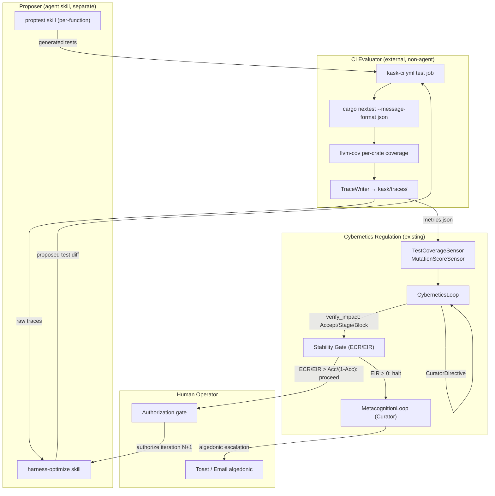

# Evolving Test Harness for zed-kask — Design Document

**Status:** Partially implemented; CI surface not wired (2026-08-04 revision). The
`hkask-test-harness` crate and `kask/scripts/stability-gate.sh` survive and are
functional. The `kask/scripts/test` runner was deleted in `009b04066a` ("Remove
dead kask scripts, SQL, and docs"), which broke the `harness-evolve-cycle.sh`
runner (it calls `./scripts/test --trace` at L52) and the
`harness-evolve-cycle` skill manifest (its step 1 `command` is
`./scripts/test --trace`). The CI trace/mutation steps that referenced
`scripts/test` were removed as dead in pass 2 (they had been silently no-op'ing
behind `|| true` since the deletion). The original "Implemented (all 6 slices)"
claim below was accurate at authoring time (2026-08-03) but did not survive the
subsequent cleanup; it is retained as the design record. To revive: rebuild
`kask/scripts/test` per §2.2, re-add the CI trace/mutation steps per §3.7, and
re-verify the cycle script end-to-end.

**Superseded terminology note (2026-08-12):** this document predates the removal
of the per-call capability gate. Every mention below of `DelegationToken`,
`Tool:Execute`, or "OCAP enforcement" refers to a mechanism that **no longer
exists**: `McpRuntime::invoke` performs no per-call authorization, and
`DelegationToken` (with `is_valid_for`, `panel_default_token`,
`capabilities_match`, and `ToolPortError::CapabilityDenied`) was deleted because
all three production mint sites derived the token's `resource_id` from the same
tool name they passed to `invoke` — the check compared a caller-supplied value
against itself. See `kask/security/regressions/RR-0056.yaml` (vacuous gate) and
`RR-0057.yaml` (the call meter's fail-open correction). The critic history in §9
is preserved as written; note that its third iteration already reached the right
conclusion for the proposer/evaluator question — the enforcement point is
`profile.is_tool_enabled("terminal") = false`, not any capability token.

**Original status (2026-08-03, design record):** Implemented (all 6 slices +
TDD orchestration). **All 4th + 5th critic fixes applied** (F1–F10 + B1/B5/B6/B7
+ code gap #1 branching enforcement). The design-as-implemented survived the 5th
decoupled critic. The only residual: the bridge must wire
`ManifestExecutor::with_terminal_check` for production profile enforcement (the
callback mechanism exists but is not yet wired). F5 (classifier EIR) is a
documented placeholder — deterministic EIR works.
**Date:** 2026-08-03 (design + 4th/5th critics + all fixes applied)
**Scope:** `hkask-test-harness`, `kask/scripts/test`, `kask/scripts/stability-gate.sh`, `kask/scripts/harness-evolve-cycle.sh`, `kask-ci.yml`, `qa-triage-cycle`, `proptest` skill, `harness-optimize` skill, `harness-evolve-cycle` manifest, `hkask-regulation` `SensorBus`/`SetPoints`, `self-improvement` skill

---

## 1. Objective

Design a concrete evolution path for the zed-kask test harness that integrates it
into the system's cybernetic self-improvement loop, gated by the Curator's
algedonic channel and the human operator's authorization. The design is
**convergent** (a measured stopping criterion), not **optimal** (an undefined
aspiration), and **stability-gated** (not unbounded recursion).

The design addresses five papers, each contributing one design constraint:

| Paper | Constraint applied |
|-------|--------------------|
| HarnessLLM (2511.01104) | Three oracle types; prefer programmatic generators over hardcoded I/O pairs |
| Self-Correction as Feedback Control (2604.22273) | Measure EIR; gate iteration behind ECR/EIR > Acc/(1−Acc); halt on EIR > 0; verify-first intervention |
| Agent Cybernetics (2605.10754) | Six cybernetic principles as measurable mechanisms, not aspirations |
| Meta-Harness (2603.28052) | Trace filesystem storing raw execution traces; coding-agent proposer reads traces; Pareto over (quality, cost) |
| Recursive Harness Self-Improvement (2607.15524) | Pairwise refinement (N vs N−1); 3–5 iterations, not unbounded recursion |

---

## 2. Current State (grounded in codebase)

### 2.1 `hkask-test-harness` crate

**Path:** `kask/crates/hkask-test-harness/src/hkask_test_harness.rs` (single file).

Four public items, as inventoried on 2026-08-04:

| Item | Signature | Role |
|------|-----------|------|
| `arb_json_value` | `pub fn arb_json_value() -> BoxedStrategy<JsonValue>` | Recursive JSON strategy (depth ≤ 4) |
| `NoopToolPort` | `pub struct NoopToolPort;` impls `ToolPort` | Stub returning `NotFound` for all invokes |
| ~~`test_token_for_tool`~~ | ~~`pub fn test_token_for_tool(tool_name: &str) -> DelegationToken`~~ | **Removed 2026-08-12** with the vacuous capability gate (RR-0056) — `DelegationToken` no longer exists |
| `test_agent_webid` | `pub fn test_agent_webid() -> WebID` | The agent identity used to seed call caps in governance tests |

**What is absent (2026-08-04 inventory):** no oracle types, no invariant checkers,
no trace/artifact storage, no domain-specific strategies (only
`arb_json_value`), no `proptest!` runners or regression-file management. The
crate is a thin fixtures-and-generators library.

> **Since inventoried (2026-08-12):** the crate has grown past this snapshot —
> it now also carries oracle constructors, trace writing, and security-oriented
> proptest strategies (including ~~`arb_taint_context` for FIDES taint tests~~), and
> ~~`NoopToolPort` gained a `with_taint` builder so a stub tool can report a
> `ToolTaint` label~~. Treat the table above as the design-time baseline, not the
> current surface; read the crate's lib root for the live list.
>
> **Superseded later the same day (2026-08-12):** the struck-through taint items
> are gone. The FIDES taint / runtime-policy machinery was deleted (RR-0053) after
> being found operationally inert — every tool was hardcoded `ToolTaint::Pure`, so
> the `Source`→`Sink` block could not fire — and `ToolTaint` no longer exists to
> label or generate. `NoopToolPort` retains `with_tool` (register a tool name) but
> no taint builder. Defense Layer 5 is now absent by decision, as Layer 3 is under
> RR-0010; see `DIVERGENCE.md` D4 and `kask/security/regressions/RR-0053.yaml`.
> Any harness work this plan proposes against taint labels is void; a replacement
> would first have to meet RR-0053's bar for a real IFC gate.

**Consumers:** `hkask-mcp` (2 test files), `hkask-templates` (3 test files), plus
2 Jinja templates in `kask/registry/templates/proptest/` that emit `use
hkask_test_harness::arb_json_value;` imports.

### 2.2 `kask/scripts/test` runner

**Path:** `kask/scripts/test` (single executable script).

Runs `cargo nextest run --profile kask` scoped to 23 kask packages, with a
`sequential-db-tests` group (max-threads = 1) for SQLite-contention crates.
Falls back to `cargo test` if nextest is absent or `--cargo-test` is passed.

**What is absent:** no coverage collection, no trace/artifact persistence, no
`--trace` flag. Output goes to nextest's default `target/nextest/`.

### 2.3 `kask-ci.yml`

**Path:** `.github/workflows/kask-ci.yml`. Eight jobs: `fmt`, `clippy`, `test`,
`build`, `skill-span-namespace`, `reg-canonical`, `mcp-servers`, `deps`.

The `test` job runs `cargo nextest run --workspace --no-fail-fast` with
exclusions for GPU/WASM/randomized stress tests. **No coverage collection, no
artifact upload, no trace storage, no triage step.**

### 2.4 `qa-triage-cycle` manifest

**Path:** `kask/registry/manifests/qa-triage-cycle.yaml` — a FlowDef process
manifest (7 steps) executed by the `ManifestExecutor`.

Step 1 runs `cargo test` across priority crates; step 2 classifies failures via
the `qa-triage` classifier (`kask/registry/classify/qa-triage.yaml`,
OpenRouter/deepseek/deepseek-v4-flash); steps 3–7 route by confidence (≥ 0.95 auto-repair,
0.70–0.94 issue+suggestion, < 0.70 human, flake → retry max 3).

**Runner readiness:** `PARTIAL` — `run_command` + `classify` steps work today;
loop steps need runner support.

The `qa-triage` classifier emits JSON with `failure_type`, `root_cause`,
`confidence`, `proposed_fix`, `is_flake`, `suggested_fuzz_target`. This is the
existing oracle for failure classification — the design extends it, does not
replace it.

### 2.5 `proptest` skill

**Path:** `.agents/skills/proptest/SKILL.md` + `kask/registry/templates/proptest/`.

Five-phase KnowAct cascade: Identify → Strategize → Write → Analyze → Report.
Generates property-based tests for a **single target function** by reading its
contract (`/// expect:`, `/// post:`, `/// inv:`). Gas cap 80000, rJoule 3,
Cauchy convergence (epsilon 0.03, window 3, max 10, min 2).

**Scope limitation:** `proptest` operates on one target at a time. It does not
read a trace filesystem, compare harness revisions pairwise, or reason about
suite-level coverage. This design introduces a sibling skill (`harness-optimize`)
for suite-level improvement, while `proptest` remains the per-function generator.

### 2.6 Cybernetics self-improvement infrastructure

**`CyberneticsLoop`** (`kask/crates/hkask-regulation/src/cybernetics_loop.rs`):
sense→compare→compute→act, 10 s tick. Pluggable `SensorBus` with three sensors
(`EnergyBudgetSensor`, `VarietySensor`, `ToolReliabilitySensor`).
`verify_impact` classifies each action as Accept / Stage / Block.
`StagnationDetector` flags ineffective `(metric, action)` plateaus (5 cycles).
`LoopMetrics` records delay, gain, fidelity, effectiveness.

**Algedonic channel:** `RuntimeAlert` (`algedonic.rs`) with `severity`
(Info/Warning/Critical) and `escalated`. Three-tier dispatch: (1) live
`alerts_tx` channel → `MetacognitionLoop`, (2) durable `RegulationArchive`
persistence, (3) `AlertEmailSink` email, (4) lost-alert `tracing::error!`.

**Curator** = `MetacognitionLoop` (governance, 30 s tick, reads ledger health)
+ `CuratorStatusTool` (agent-facing) + `CuratorDirective` (back-channel to
calibrate CyberneticsLoop set-points). The human operator is the final
algedonic target (toasts + email).

**`self-improvement` skill:** nested PDCA + Improvement Kata. θ (Foundation
Model) vs Σ (Scaffolding) pathways. Default Σ unless FM fine-tuning is
explicitly permitted. Max 10 outer / 5 inner iterations. Cauchy convergence
(described in SKILL.md, not enforced in Rust).

**What is absent:** no ECR, EIR, or stability-gate concept anywhere in the Rust
code. No executable convergence criterion in `hkask-regulation` — Cauchy/Brier
exist only as prose in skill documents. The closest existing mechanism is
`StagnationDetector` (repetition-based, not error-rate-based).

---

## 3. Target Architecture

### 3.1 Overview



The design has **six components**, each justified by the essentialist G1
deletion test (§5) and constrained by a paper (§4).

### 3.2 Component 1 — Trace Filesystem

**Location:** `kask/traces/<run-id>/` (gitignored, like `target/`).

**Layout:**

```
kask/traces/
  <run-id>/                      # run-id = <commit-sha>-<timestamp>
    manifest.json                # commit, timestamp, packages, nextest profile, harness-revision
    nextest-output.json          # raw nextest JSON (per-test: name, result, duration, stdout)
    coverage/
      <crate>.lcov               # per-crate line coverage (llvm-cov)
    failures/
      <test-name>/
        output.txt               # full test stdout/stderr
        shrunk.txt               # proptest shrunk counterexample (if property test)
        classifier.json          # qa-triage classifier output (failure_type, confidence, is_real_bug)
    metrics.json                 # computed: pass_rate, coverage_pct, mutation_score,
                                 #   cost_tokens, distinct_failure_modes, ECR, EIR, Acc
    harness-revision.txt         # hash of the harness crate + scripts/test at run time
```

**Design constraint (Meta-Harness):** the proposer reads raw execution traces,
not compressed summaries. The `nextest-output.json` + `failures/<test>/output.txt`
+ `shrunk.txt` are the raw traces; `metrics.json` is the compressed summary used
by the sensors and stability gate. Both coexist — the proposer reads raw traces
for causal hypotheses; the regulation loop reads the summary for homeostatic
control.

**Compatibility with `qa-triage-cycle`:** the trace filesystem extends the
existing manifest. `qa-triage-cycle` step 1 runs `cargo test`; this design wraps
that in trace collection (nextest `--message-format json` + llvm-cov). Step 2
classifies failures; this design persists the classification to
`failures/<test>/classifier.json` instead of discarding it. No change to the
classifier itself — `qa-triage` is reused as-is.

**Compatibility with `kask-ci.yml`:** Slice 6 adds llvm-cov + artifact upload to
the existing `test` job. Slices 1–5 do not touch CI. The trace filesystem is
produced locally by `kask/scripts/test --trace` and by CI; both write the same
layout.

> ⚠ **Implementation gap (§9.5 #2, #3):** as implemented, `metrics.json` is
> written by `scripts/test --trace` with only `{pass_rate, total_tests, run_id}`
> — **`coverage_pct` has no producer anywhere** (no llvm-cov/tarpaulin step
> landed), and `mutation_score` is only injected by CI's separate jq step, not
> in the loop path. The `coverage/<crate>.lcov` files in the layout above do
> not exist yet. Fix: §9.6 F1, F2.

### 3.3 Component 2 — Oracle Taxonomy in `hkask-test-harness`

**Design constraint (HarnessLLM):** the harness must support all three oracle
types and prefer programmatic generators.

New public API (6 items, ≤ 7 per essentialist G2):

```rust
/// An oracle checks whether a test case's outcome is correct.
/// Three strategies (HarnessLLM §3): hardcoded expected, reference
/// implementation, invariant checking.
pub trait Oracle {
    fn verify(&self, input: &JsonValue, output: &JsonValue) -> OracleVerdict;
}

pub enum OracleVerdict { Pass, Fail(String), Inconclusive }

/// Oracle 1: hardcoded expected output (scales poorly — TBR decays).
pub fn oracle_hardcoded(expected: JsonValue) -> Box<dyn Oracle>;

/// Oracle 2: reference implementation (scales — compare against a trusted impl).
pub fn oracle_reference<F>(reference: F) -> Box<dyn Oracle>
where F: Fn(&JsonValue) -> JsonValue + Send + Sync + 'static;

/// Oracle 3: invariant checking (scales best — check properties, not outputs).
pub fn oracle_invariant<F>(check: F) -> Box<dyn Oracle>
where F: Fn(&JsonValue, &JsonValue) -> Result<(), String> + Send + Sync + 'static;
```

Plus a trace-writing helper:

```rust
/// Writes a structured execution trace to kask/traces/<run-id>/.
/// Used by kask/scripts/test --trace and by integration tests that
/// opt into trace recording.
pub fn write_trace(run_id: &str, entry: &TraceEntry) -> std::io::Result<()>;

pub struct TraceEntry { /* test name, result, duration, shrunk counterexample, coverage */ }
```

The existing 4 public items are unchanged. The new surface is 6 items (1 trait +
3 fns + 1 fn + 1 struct), satisfying G2 (≤ 7 new interfaces).

### 3.4 Component 3 — Stability Gate (ECR / EIR)

**Design constraint (Self-Correction as Feedback Control):** measure EIR, gate
iteration behind the stability threshold, halt on EIR > 0, escalate via
algedonic.

**Two deterministic oracles (breaks the LLM-judges-LLM circularity):**

1. **Mutation testing** (`cargo-mutants` or an equivalent mutation pass) is the
   ground-truth oracle for **bug-finding ability** — the question "can the test
   suite catch bugs?" Mutation testing injects deliberate faults (mutants) into
   production code, runs the test suite against each mutant, and records whether
   the suite catches it (killed) or misses it (survived). This is non-degenerate
   in the harness-improvement context: when only the test suite changes between
   revisions N−1 and N (production code is fixed), a better suite kills more
   mutants. The mutation score moves. This is the oracle the second critic
   identified as the missing prerequisite (§9.3).

2. **The `RR-*.yaml` regression library** (`kask/security/regressions/`, 34
   enforced entries) is a **regression-prevention guard** — the question "do
   fixed bugs stay fixed?" It is NOT the bug-finding oracle: all enforced entries
   are already passing and stay passing across test-suite-only revisions, so it
   produces a constant signal (Acc = 1.0, ECR = 0/0). The first critic iteration
   incorrectly used it as the ECR/Acc oracle; the second critic showed this is
   degenerate. The regression library is retained as a guard (a harness revision
   that breaks an enforced regression entry is immediately rejected), but the
   bug-finding metrics come from mutation testing.

**Definitions (applied to harness self-improvement):**

- **Acc** = test-suite mutation score = (mutants killed) / (mutants total).
   Deterministic (mutation testing is a mechanical code-mutation + test-run
   process, no LLM). Non-degenerate: changes as the suite improves. Range [0, 1].
- **ECR** (Error Correction Rate) = (mutants newly killed by revision N that
  survived at N−1) / (mutants that survived at N−1). Deterministic.
  Non-degenerate: a better suite kills previously-surviving mutants.
- **EIR** (Error Introduction Rate) = (new test-bug failures introduced by
  revision N) / (tests passing at N−1). A "test-bug failure" is a newly-failing
  test classified by `qa-triage` as `is_real_bug: false` (flaky, wrong
  assertion, oracle bug), OR a previously-killed mutant that now survives
  (the revision weakened the suite — a deterministic EIR signal that does not
  depend on the classifier). EIR has two components: (a) deterministic
  (mutants regressed from killed→survived) and (b) classifier-judged (new flaky
  tests). The deterministic component is the primary EIR signal; the classifier
  component is secondary, for test-bug introductions that don't correspond to a
  mutant regression.
- **Regression-prevention guard** (separate from ECR/EIR): if any `RR-*.yaml`
  enforced entry flips from pass→fail across the revision, the revision is
  rejected immediately (verdict `regression_violated`), before the ECR/EIR
  gate is evaluated. This is a hard guard, not a metric.

**Stability threshold (from the paper):** proceed only if
`ECR / EIR > Acc / (1 − Acc)`. When `EIR = 0`, this is infinite → always
proceed (with verify-first). When `EIR > 0`, the ratio must exceed the
threshold. ECR, Acc, and the deterministic component of EIR are all
mutation-testing-sourced (no LLM). Only the secondary EIR component (new flaky
tests with no mutant regression) uses the classifier. The gate's core is
ground-truth-anchored via mutation testing.

**Task-specified halt rule (stricter than the paper's threshold):** if `EIR > 0`,
**halt and escalate to the human operator via the algedonic channel**. The
operator may authorize proceeding if `ECR / EIR > Acc / (1 − Acc)` — this is the
authorization gate, not an automatic one.

**Verify-first intervention (from the paper):** before a harness revision is
committed, it is evaluated on a **held-out set** (tests not seen by the proposer,
run by CI). This drives EIR from ~2% toward 0%. The held-out set is the
production test suite minus the files the proposer modified — CI runs the full
suite, and any test the proposer didn't touch that now fails is a test-bug
introduction (EIR).

**Implementation:** `kask/scripts/test/stability-gate.sh` (Slice 2). Reads the
last `W+1 = 4` trace dirs (`<run-id-N−3>`, …, `<run-id-N>`) to compute W=3
deltas for the Cauchy criterion and stall detector. Computes ECR/EIR/Acc from
`metrics.json` (mutation score) + `failures/*/classifier.json` (EIR secondary).
Runs `lib-regressions.sh`'s `check_regressions()` as the regression-prevention
guard. Runs `cargo mutants` (or a scoped mutation pass) to produce the mutation
score. Emits a verdict: `proceed` (EIR = 0), `halt_escalate` (EIR > 0),
`stalled_escalate` (Δcoverage > 0 ∧ Δmutation_score ≤ 0 for W=3),
`regression_violated` (an `RR-*.yaml` entry flipped pass→fail), or `converged`
(weighted Cauchy norm < ε for W=3 — see §3.6). `cargo-mutants` is an external
tool (installed like nextest via `taiki-e/install-action`), not a workspace
crate. No new crate — the gate is a shell script reading JSON via `jq` and
invoking `cargo mutants`.

> ⚠ **Implementation gaps (§9.5 #3, #5, #6):** (a) the gate's `cargo mutants`
> fallback computes `mutation_score` into a shell var + `/tmp/mutants-out.json`
> but does **not** write it back to `${TRACE}/metrics.json`, so `prev_mutation_score`
> is always 0 in the loop path (ECR collapses to `mutation_score/1`). (b) The
> verdict block checks `converged` **before** `eir_total > 0`, so spurious
> convergence on all-zero metrics masks the EIR halt. (c) The EIR classifier
> counts **all** `is_real_bug: false` failures, not new-vs-N−1. Fixes: §9.6 F1, F3, F5.

### 3.5 Component 4 — `harness-optimize` Skill (Proposer)

**Design constraint (Meta-Harness + Recursive Self-Improvement):** a coding-agent
proposer reads raw execution traces and proposes harness improvements via
pairwise refinement (N vs N−1), 3–5 iterations.

**Path:** `.agents/skills/harness-optimize/SKILL.md` + registry templates in
`kask/registry/templates/harness-optimize/` + a FlowDef manifest
`kask/registry/manifests/harness-evolve-cycle.yaml`.

**What it does:**

1. Reads the trace filesystem for revision N and N−1 (raw `nextest-output.json`,
   `failures/*/output.txt`, `shrunk.txt`, `classifier.json`).
2. Forms causal hypotheses: which tests miss bugs? Which are flaky? Which
   properties are under-tested? (Meta-Harness: median 82 files read per
   iteration.)
3. Proposes a diff: new `arb_*` strategies, new `Oracle` checkers, new
   `proptest!` blocks, or modifications to existing tests. The proposal cites
   specific trace files as evidence.
4. Does **not** run the tests. The proposer is separated from the evaluator
   (anti-pattern prevention — §6.2). CI runs the proposed tests.

**Profile-level enforcement of proposer/evaluator separation (not a prompt
convention):**
the `harness-optimize` skill runs under an agent profile whose built-in
`terminal` tool is **disabled** — `profile.is_tool_enabled("terminal")` returns
`false` (enforced at `crates/agent_settings/src/agent_profile.rs` L114:
`self.tools.get(tool_name) == Some(&true)`). `cargo` and `nextest` are shell
commands invoked via the built-in `terminal` tool, not MCP tools — so the
`mcp_tools` allowlist does not gate them (the second critic corrected this
misattribution, §9.3). The correct enforcement point is the built-in tool
toggle. An agent that attempts `cargo nextest run` on its own draft diff faces a
mechanical refusal because the `terminal` tool is absent from its profile — not
a polite instruction in a skill template. Alternatively, the proposer may run as
a **swarm delegate** (`hkask-mcp-swarm` `agent_executor.rs`), which has no
built-in tools at all (only MCP tools from `declared_tools`) — the same effect.
This is the enforcement point the first critic demanded (§9.2), corrected to the
> right mechanism by the second critic (§9.3).

> ⚠ **Implementation gap (§9.5 #7):** as implemented, this separation is a
> **convention, not a mechanical gate.** `is_tool_enabled` is a passive read;
> no agent profile binds `terminal: false` for `harness-optimize`; the manifest
> step 3 is free-text prose; the runner prints "AGENT ACTION REQUIRED" and does
> not spawn a constrained agent. An operator running the cycle with the default
> profile gets a proposer that can `cargo nextest run` its own draft. This is
> the `.rules` "Advertised invariants need enforcement points" trap. Fix: §9.6 F6.

**Pairwise refinement (Recursive Self-Improvement paper):** the proposer compares
revision N vs N−1, not against an undefined "optimal." It asks: "what did N−1
miss that N should catch?" and "what did N break that N−1 handled?" This is the
only comparison frame.

**Iteration bound:** max 5 iterations (from the paper: 3–5 suffice). The loop
is the `harness-evolve-cycle` manifest (§3.7), which gates each iteration behind
the stability gate.

**Relationship to `proptest` skill:** `proptest` generates tests for a single
target function (per-function). `harness-optimize` improves the suite as a whole
(suite-level), reading traces and dispatching to `proptest` for specific
under-tested functions. `harness-optimize` is the orchestrator; `proptest` is a
delegate. This is the same composition pattern as `task-breakdown` → `tdd`.

### 3.6 Convergence Criterion (Cauchy, not "optimal")

**Design constraint (anti-pattern: undefined optimality):** convergence is a
Cauchy criterion on the measured triple (coverage, mutation-score, cost), not a
comparison against an undefined "optimal harness." The bug-find-rate component
is the **mutation score** (mutants killed / mutants total) — the non-degenerate
oracle for bug-finding ability (§3.4).

**Formal definition:** let
`m_N = (coverage_pct, mutation_score, cost_tokens)` at revision N. The loop
**converges** (genuinely stabilizes) when:

```
‖m_N − m_{N−1}‖ < ε  for  W  consecutive iterations
```

with `ε = 0.03` (matching the `proptest` skill's existing Cauchy epsilon),
`W = 3` (window), `max_iterations = 5`. The norm is the weighted L2 norm:

```
‖Δm‖ = sqrt( w_c · Δcoverage_pct² + w_b · Δmutation_score² + w_k · Δcost_norm² )
```

where `w_c = 1.0`, `w_b = 2.0` (mutation score is weighted double — it is the
metric that distinguishes real improvement from coverage gaming, and it is
non-degenerate: a better suite kills more mutants). The cost axis (`w_k = 0.5`,
`Δcost_norm`) is **not yet implemented** — the `stability-gate.sh` norm is
2-axis (`sqrt(1.0·Δcoverage² + 2.0·Δmutation²)`). The `converged` span message
names the 2-axis criterion (coverage, mutation-score). Implementing the cost
axis requires tracking `cost_tokens` in `metrics.json` and adding `w_k·Δcost_norm²`
to the norm — deferred (F7). This norm is **honest**:
a revision that raises coverage by 0.05 with mutation score flat has
`‖Δm‖ ≈ sqrt(1.0·0.0025) = 0.05 > ε` — it does **not** converge. The earlier
prose claim that "bug_find_rate delta = 0 → convergence" was wrong; this
formalization corrects it. Unlike the degenerate regression-library version
(where mutation score was always 1.0), the mutation-testing oracle produces a
real signal: `Δmutation_score` is nonzero when the suite improves or weakens.

**Stall detector (the trivial-tests scenario):** the Cauchy criterion alone does
not catch the case where coverage keeps climbing while mutation score stays flat
— the norm stays large, the loop keeps running, and hits `max_iterations` without
ever converging. A dedicated **stall detector** catches this: if
`Δcoverage_pct > 0 ∧ Δmutation_score ≤ 0` for `W = 3` consecutive iterations, the
verdict is `stalled_escalate` — **not** `converged`, **not** `proceed`. This
routes to the algedonic channel (§3.7 step 4), escalating to the human operator.
This is the direct answer to the grill-me Edge Cases challenge: a harness that
generates tests which pass but catch no bugs has a flat mutation score (the
trivial tests don't kill mutants) while coverage rises → **stalled**, not
converged, and the operator is alerted. The stall detector is non-degenerate
because mutation score is non-degenerate: trivial tests that don't kill mutants
produce `Δmutation_score = 0`, while meaningful tests that catch bugs produce
`Δmutation_score > 0` — the two are distinguishable.

> ⚠ **Implementation gaps (§9.5 #4, #5, #10):** (a) the Cauchy norm in
> `stability-gate.sh` is `sqrt(1.0·d_cov² + 2.0·d_ms²)` — **the cost axis
> (`w_k=0.5`, `cost_tokens`, `cost_norm`) is not implemented**, despite being
> named in the `converged` span message. (b) The stall detector requires
> `d_cov > 0.02` but `coverage_pct` is always 0 (no producer) → it can never
> fire. (c) With all metrics 0, `norm = 0 < ε` → spurious `converged`, checked
> before EIR. Fixes: §9.6 F2 (coverage producer), F3 (refuse convergence on
> absent metrics + reorder verdict), F7 (cost axis honesty).

When the stall detector does **not** fire and the Cauchy criterion does fire
(the triple genuinely stabilizes), the loop terminates with a
`reg.harness.converged` span. When `max_iterations = 5` is reached without
Cauchy convergence and without a stall, the loop terminates with a **distinct**
`reg.harness.iteration_cap_reached` span plus a Critical `RuntimeAlert` —
unbounded improvement without convergence is an algedonic event, not a success
(§3.7). The earlier design mislabeled loop exhaustion as convergence; this is
corrected.

### 3.7 Component 5 — `harness-evolve-cycle` FlowDef Manifest

**Path:** `kask/registry/manifests/harness-evolve-cycle.yaml`.

A process manifest (FlowDef) orchestrating the full loop, reusing the
`ManifestExecutor`. Steps:

| Ordinal | Action | What it does | Branching |
|---------|--------|-------------|-----------|
| 1 | `execute` | `./scripts/test --trace` → produces `kask/traces/<run-id-N>/` | success→2, failure→2 |
| 2 | `execute` | `./scripts/test/stability-gate.sh <run-id-N> <run-id-N−1>` → runs `check_regressions()` (regression-prevention guard) + `cargo mutants` (mutation score for ECR/Acc) + classifier (EIR secondary), emits verdict | proceed→3, halt_escalate→4, stalled_escalate→4, regression_violated→4, converged→5 |
| 3 | `execute` | Invoke `harness-optimize` skill (proposer, `terminal` tool disabled — cannot run tests) with trace dirs N and N−1 as context → produces proposed test diff | success→6, failure→4 |
| 4 | `execute` | Emit `RuntimeAlert{severity: Critical, escalated: true, domain: "test-harness"}` via algedonic channel → MetacognitionLoop → toast + email to human operator. The alert message distinguishes `halt_escalate` (EIR > 0) from `stalled_escalate` (coverage climbing, mutation score flat) from `regression_violated` (an `RR-*.yaml` entry broke). | terminal |
| 5 | `execute` | `echo '[harness] Converged — Cauchy criterion met on (coverage, mutation-score, cost)'` → emit `reg.harness.converged` span | terminal |
| 6 | `loop` | Increment iteration counter; if `iteration < 5`, go to step 1 (next revision); else go to step 7 | success→1, loop_exhausted→7 |
| 7 | `execute` | `echo '[harness] Iteration cap (5) reached without Cauchy convergence'` → emit `reg.harness.iteration_cap_reached` span + Critical `RuntimeAlert` (unbounded improvement without convergence is an algedonic event, not a success) | terminal |

**Gas/rjoule:** `gas: { cap: 120000, hard_limit: true }`, `rjoule: { cap: 2,
alert_threshold: 0.8, hard_limit: true }`, `ledger.span_namespace:
reg.skill.harness-evolve-cycle`, `emit_spans: true`.

**The human authorization gate (step 4):** when EIR > 0, the loop halts and
escalates. The human operator reviews the algedonic alert (toast + email),
inspects the trace, and either (a) authorizes proceeding (if ECR/EIR >
Acc/(1−Acc)) by sending a `CuratorDirective` to resume, or (b) rejects the
revision and rolls back to N−1. This is the "gated by the human operator's
authorization" requirement — the operator is the gate, not the loop.

**Reuses existing infrastructure:** `ManifestExecutor` (runs the cascade),
`qa-triage` classifier (step 1's `--trace` persists classifier output for the
secondary EIR signal), `RuntimeAlert` + `alerts_tx` (step 4's algedonic),
`CuratorDirective` (operator's resume/rollback), `lib-regressions.sh` +
`RR-*.yaml` (regression-prevention guard in step 2). New tooling: `cargo-mutants`
(external tool, installed like nextest) for the mutation score. No new regulation
Rust code in Slices 1–4.

### 3.8 Component 6 — CyberneticsLoop Sensor Integration

**Design constraint (Agent Cybernetics: Requisite Variety + Homeostatic
Regulation + Feedback Closure):** the test harness becomes a sensor in the
`SensorBus`.

Two new sensors (Slice 5, requires `hkask-regulation` change):

| Sensor | Class | What it measures | Set-point |
|--------|-------|-----------------|-----------|
| `TestCoverageSensor` | reads `kask/traces/<latest>/metrics.json` | `coverage_pct` | `coverage_floor` (from `SetPoints`, default 0.70) |
| `MutationScoreSensor` | reads `kask/traces/<latest>/metrics.json` | `mutation_score` (mutants killed / mutants total — non-degenerate) | `mutation_score_floor` (default 0.50) |

These register on the `SensorBus` alongside `EnergyBudgetSensor`,
`VarietySensor`, `ToolReliabilitySensor`. The `CyberneticsLoop`'s existing
`verify_impact` (Accept / Stage / Block) classifies each harness revision: a
revision that raises mutation score without EIR → Accept; raises mutation score
with EIR → Stage (pending operator); lowers mutation score → Block.

**Feedback closure (Principle 3):** test failures → `qa-triage-cycle` → proposed
fix; code changes → `harness-optimize` → new tests → CI evaluates → traces →
sensors → `CyberneticsLoop` → `CuratorDirective` (calibrate set-points). The
trace filesystem is the shared medium that closes the loop.

---

## 4. Paper Constraint Traceability

| Paper | Design constraint | Where addressed | Verification |
|-------|-------------------|-----------------|--------------|
| HarnessLLM | Three oracle types; prefer programmatic generators | §3.3 `Oracle` trait + 3 constructors; `arb_*` strategies are programmatic | Slice 1 acceptance: a test using `oracle_invariant` compiles and runs |
| Self-Correction | Measure EIR; gate behind ECR/EIR > Acc/(1−Acc); halt on EIR > 0; verify-first | §3.4 stability gate (ECR/Acc from mutation testing, EIR from mutant regressions + classifier); §3.7 step 2 + step 4; held-out evaluation via CI (separate from proposer, `terminal` tool disabled) | Slice 2 acceptance: EIR > 0 → halt_escalate verdict; mutation score moves when suite changes |
| Agent Cybernetics | Six principles as measurable mechanisms | §3.8 (variety, homeostasis, closure, self-improvement), §3.7 step 4 (algedonic), §3.3 (good regulator) | §5 mechanism table — each principle has a line-of-code enforcement point |
| Meta-Harness | Trace filesystem; coding-agent reads raw traces; Pareto (quality, cost) | §3.2 trace layout; §3.5 `harness-optimize` reads raw traces; §3.6 cost in convergence triple | Slice 4 acceptance: proposer cites specific trace files |
| Recursive Self-Improvement | Pairwise (N vs N−1); 3–5 iterations | §3.5 pairwise refinement; §3.7 max 5 iterations | Slice 3 acceptance: manifest step 6 loop bound = 5 |

---

## 5. Agent Cybernetics — Six Principles as Measurable Mechanisms

| # | Principle | Measurable mechanism | Enforcement point |
|---|-----------|---------------------|-------------------|
| 1 | Requisite Variety | `TestCoverageSensor` + `MutationScoreSensor` count distinct failure modes (qa-triage `failure_type` field aggregated across traces) and measure bug-finding ability (mutation score). Set-point: failure-mode variety ≥ code's fault class count; mutation score ≥ floor. | `SensorBus::sense_all` in `cybernetics_loop.rs` `sense()` (Slice 5) |
| 2 | Good Regulator | Trace filesystem stores actual test behavior (raw output + shrunk counterexamples + coverage lines), not idealized pass/fail. ECR/Acc anchored to **mutation testing** (inject deliberate faults, measure if the suite catches them) — the gate models the system's actual bug-finding ability, not an LLM's imagination. The `RR-*.yaml` regression library is a regression-prevention guard (don't break existing fixes), separate from the bug-finding metric. | `kask/traces/<run-id>/coverage/<crate>.lcov` (Slice 1); `cargo mutants` output in `metrics.json` (Slice 2); `kask/security/regressions/RR-*.yaml` + `lib-regressions.sh` (existing, regression-prevention guard) |
| 3 | Feedback Loop Closure | Test failures → `qa-triage-cycle` → proposed fix; code changes → `harness-optimize` → new tests → CI → traces → sensors → `CyberneticsLoop`. Trace filesystem is the shared medium. | `harness-evolve-cycle` manifest steps 1→3→1 (Slice 3); `TestCoverageSensor` feeds `sense()` (Slice 5) |
| 4 | Homeostatic Regulation | `SetPoints.coverage_floor` + `mutation_score_floor`. `CyberneticsLoop.verify_impact` classifies each harness revision Accept/Stage/Block. Deviation (coverage or mutation score below floor) → corrective action (generate tests). | `verify_impact` in `cybernetics_loop.rs` (existing, classifies via `classify_decision`); new sensors feed it (Slice 5). ⚠ sensors read fields absent from `metrics.json` as implemented — see §9.5 #9, fix F1/F2 |
| 5 | Algedonic Signal | EIR > 0 → `RuntimeAlert{severity: Critical, escalated: true, domain: "test-harness"}` via `alerts_tx` → `MetacognitionLoop` → toast + email. Stall detector → `stalled_escalate` → same algedonic path. Iteration cap → `reg.harness.iteration_cap_reached` + Critical alert. Reuses the existing three-tier escalation. | `harness-evolve-cycle` step 4 + step 7 → `alerts_tx.send(CurationInput::Alert(...))` (Slice 3); `CyberneticsLoop::act` (existing three-tier dispatch). ⚠ the EIR halt is inert as implemented (§9.5 #8) — fix F1/F5 |
| 6 | Self-Improvement | `harness-optimize` skill (Σ pathway of `self-improvement`), pairwise refinement, max 5 iterations, Cauchy convergence on (coverage, mutation-score, cost) + stall detector for coverage-without-bugs. | `harness-evolve-cycle` manifest step 6 loop bound + step 5/7 split terminal spans (Slice 3); `stability-gate.sh` Cauchy + stall check (Slice 2) |

Each principle points to a line of code or a manifest step that enforces it —
not an aspiration. This satisfies the anti-pattern "aspirational cybernetics."

---

## 6. Essentialist Analysis

### 6.1 G1 Deletion Test

| Component | If deleted, does complexity reappear? | Verdict |
|-----------|---------------------------------------|---------|
| Trace filesystem | Yes — proposer has only scalar pass/fail → cannot form causal hypotheses → undiagnosable flaky tests and false confidence persist | **Passes G1** |
| Oracle taxonomy | Yes — every test author reinvents oracle logic inline → inconsistent assertions, oracle bugs masquerading as code bugs | **Passes G1** |
| Stability gate (ECR/EIR + mutation testing) | Yes — without it, unbounded harness self-improvement degrades performance (Self-Correction paper) → test churn and false alarms. Without mutation testing specifically, the oracle is degenerate (regression library = constant signal) → the stall detector has a 100% false-positive rate and the Cauchy norm's bug-find component is inert (2nd critic finding, §9.3). | **Passes G1** |
| `harness-optimize` skill | Yes — suite-level improvement becomes manual ad-hoc → coverage gaps persist undetected. (Cannot be subsumed by `proptest`: per-function vs suite-level scope.) | **Passes G1** |
| CI evaluator (separate from proposer) | Yes — proposer evaluates its own tests → self-confirming loop (anti-pattern §6.2) → tests validate proposer's assumptions | **Passes G1** |
| `harness-evolve-cycle` manifest | Yes — without orchestration, the loop is open (no closure). The manifest is the closure mechanism wiring traces→gate→proposer→CI. | **Passes G1** |
| CyberneticsLoop sensors | Yes — without sensors, the CyberneticsLoop has no test-coverage signal → homeostatic regulation is blind to test quality | **Passes G1** |

### 6.2 G2 Surface Assessment

New public interfaces introduced by this design: **6** (≤ 7 threshold).

| New interface | Lives in |
|---------------|----------|
| `Oracle` trait | `hkask-test-harness` |
| `oracle_hardcoded` fn | `hkask-test-harness` |
| `oracle_reference` fn | `hkask-test-harness` |
| `oracle_invariant` fn | `hkask-test-harness` |
| `write_trace` fn | `hkask-test-harness` |
| `TraceEntry` struct | `hkask-test-harness` |

The `StabilityGate` is a shell script (`stability-gate.sh`), not a Rust public
interface. The sensors (`TestCoverageSensor`, `MutationScoreSensor`) are internal
to `hkask-regulation` and register on the existing `SensorBus` — no new public
trait. The `harness-optimize` skill and `harness-evolve-cycle` manifest are
skill/manifest artifacts, not Rust APIs.

### 6.3 Anti-Pattern Prevention

| Anti-pattern | Prevention mechanism |
|--------------|---------------------|
| **Self-confirming loop** | Evaluator (CI, external GitHub Actions) ≠ proposer (`harness-optimize` skill, agent-driven). **Enforced** via the proposer agent profile's built-in `terminal` tool being disabled (`profile.is_tool_enabled("terminal") = false`, `agent_profile.rs` L114) — `cargo`/`nextest` are shell commands via `terminal`, not MCP tools. A self-evaluation attempt cannot invoke the shell. Alternatively, the proposer runs as a swarm delegate with no built-in tools. (§3.5) |
| **Unbounded recursion** | Four independent stops: (1) stability gate: halt on EIR > 0 (§3.4); (2) stall detector: `Δcoverage > 0 ∧ Δmutation_score ≤ 0` for W=3 → `stalled_escalate` (§3.6); (3) Cauchy convergence: stop when the weighted triple-norm stabilizes (§3.6); (4) iteration bound: max 5 (§3.7 step 6). Exhaustion is reported as `reg.harness.iteration_cap_reached` + Critical alert, not as convergence. |
| **Compressed feedback** | Trace filesystem stores raw execution traces (§3.2). The proposer reads `nextest-output.json` + `output.txt` + `shrunk.txt`, not just `pass/fail`. |
| **Undefined optimality** | Convergence is Cauchy on (coverage, mutation-score, cost) — a measured triple, not "optimal." A stalled harness (coverage climbing, mutation score flat) is detected by the stall detector and escalated, not mislabeled as converged. |
| **LLM-judges-LLM circularity** | ECR, Acc, and the deterministic EIR component (mutants regressed killed→survived) are sourced from **mutation testing** (`cargo mutants` — mechanical code-mutation + test-run, no LLM). Only the secondary EIR component (new flaky tests with no mutant regression) uses the classifier. The `RR-*.yaml` regression library is a regression-prevention guard, not the bug-finding oracle. (§3.4) |
| **Degenerate oracle** (regression library = constant signal) | The regression library measures "do fixed bugs stay fixed?" not "can the suite catch bugs?" — it produces Acc=1.0, ECR=0/0 across test-suite-only revisions. Mutation testing is the non-degenerate oracle: a better suite kills more mutants, so the mutation score moves. (§3.4, §9.3) |
| **Aspirational cybernetics** | Each of the 6 principles has an enforcement point (§5 table). No principle is described without a line of code or manifest step. |

---

## 7. Pragmatic-Semantics Classification

Each design decision is classified by certainty level (IS = current state, OUGHT
= target state), constraint force, and provenance. Inference-tier claims
(confidence ≤ 0.3) are flagged for codebase verification.

| Decision | IS/OUGHT | Constraint force | Provenance | Confidence |
|----------|----------|-----------------|------------|------------|
| Trace filesystem at `kask/traces/` | OUGHT | Guardrail | Meta-Harness paper + codebase (no trace storage exists) | 1.0 (codebase-verified: no trace FS) |
| `Oracle` trait with 3 constructors | OUGHT | Evidence | HarnessLLM paper (3 oracle strategies) | 1.0 |
| ECR/EIR stability gate, halt on EIR > 0 | OUGHT | Prohibition | Self-Correction paper + task spec | 1.0 |
| ECR/EIR > Acc/(1−Acc) as operator authorization threshold | OUGHT | Evidence | Self-Correction paper Eq. | 0.9 |
| `harness-optimize` reads median 82 files per iteration | OUGHT | Hypothesis | Meta-Harness paper (median 82 observed in their setting) | 0.4 — **flagged: this is an Inference-tier claim.** The 82-file median is from Meta-Harness's benchmark, not zed-kask. The proposer's actual file-read count depends on trace size. Do not hardcode 82 as a target; treat it as evidence that trace-reading scales, not as a zed-kask constant. |
| Max 5 iterations | OUGHT | Evidence | Recursive Self-Improvement paper (3–5 suffice) | 0.8 |
| Cauchy epsilon 0.03, window 3 | OUGHT | Guideline | `proptest` skill existing convention | 1.0 (codebase-verified: proptest SKILL.md) |
| `mutation_score` from `cargo mutants` (deterministic, non-degenerate) | OUGHT | Evidence | Meta-Harness paper (bug-finding ability) + Self-Correction paper (independent oracle) + grill-me critic 2nd iteration (regression library is degenerate) | 0.8 — **flagged: verify `cargo-mutants` compatibility with the workspace toolchain (Rust 1.95.0) and kask crate structure before Slice 2.** Mutation testing is an external tool (like nextest), not a workspace crate. |
| ECR/Acc anchored to mutation testing, not classifier or regression library | OUGHT | Guardrail | Self-Correction paper (independent oracle needed) + grill-me critic 2nd iteration (regression library is degenerate for bug-finding) | 1.0 (regression library confirmed degenerate by critic) |
| `RR-*.yaml` regression library as regression-prevention guard (not bug-finding oracle) | OUGHT | Guardrail | codebase (34 enforced entries, `lib-regressions.sh` `check_regressions()` deterministic) + grill-me critic 2nd iteration | 1.0 (codebase-verified: RR-0026 `cargo-test`, RR-0001 `grep`, RR-0020 `skill-probe` skipped) |
| Proposer/evaluator separation enforced via `terminal` tool disabled in agent profile | OUGHT | Prohibition | codebase (`agent_profile.rs` L114 `is_tool_enabled`) + grill-me critic 2nd iteration (corrected from `mcp_tools`/`DelegationToken`) | 1.0 (codebase-verified: `is_tool_enabled` exists; `cargo`/`nextest` are shell commands via `terminal`, not MCP tools) |
| Stall detector: `Δcoverage > 0 ∧ Δmutation_score ≤ 0` → `stalled_escalate` | OUGHT | Guardrail | grill-me critic Level 4 break + Self-Correction paper (EIR-like degradation detection) | 1.0 (addresses a demonstrated break; non-degenerate because mutation score moves) |
| Split terminal spans: `converged` vs `iteration_cap_reached` | OUGHT | Prohibition | grill-me critic Level 5 (exhaustion mislabeled as convergence = broken feedback loop, same class as `unwrap_or(0)`) | 1.0 |
| `TestCoverageSensor` / `MutationScoreSensor` on `SensorBus` | OUGHT | Guardrail | Agent Cybernetics (Requisite Variety) + codebase (`SensorBus` is pluggable) | 1.0 (codebase-verified: `SensorBus` at `sensor_provider.rs`) |
| EIR counts test-bug failures (not real-bug catches) | OUGHT | Guardrail | Self-Correction paper (EIR = errors introduced, not errors found) | 0.9 |
| Verify-first via held-out set (CI runs full suite, proposer's untouched tests failing = EIR) | OUGHT | Evidence | Self-Correction paper (verify-first drives EIR 2%→0%) | 0.8 |
| `harness-evolve-cycle` reuses `ManifestExecutor` + `RuntimeAlert` + `CuratorDirective` | OUGHT | Evidence | codebase (ManifestExecutor exists, RuntimeAlert exists, CuratorDirective exists) | 1.0 |
| llvm-cov for per-crate coverage | OUGHT | Hypothesis | inference (llvm-cov is standard Rust coverage; no coverage infra exists in kask) | 0.7 — **flagged: verify llvm-cov compatibility with the workspace toolchain (Rust 1.95.0) before Slice 6.** |
| Mutation testing as the in-scope bug-finding oracle (`cargo mutants`) | OUGHT | Evidence | grill-me critic 2nd iteration (regression library degenerate; mutation testing is the missing prerequisite) + Meta-Harness paper | 0.8 — **flagged: verify `cargo-mutants` compatibility with Rust 1.95.0 and kask crate structure before Slice 2.** In-scope (Slice 2), not future work. The regression library alone is degenerate (Acc=1.0, ECR=0/0); mutation testing is the non-degenerate oracle that makes ECR, Acc, mutation_score, the stall detector, and the Cauchy norm all functional. |

**Action on flagged claims:**
- **82-file median:** do not encode as a constant. The `harness-optimize` skill
  reads as many trace files as needed; no target count.
- **llvm-cov compatibility:** verify in Slice 6 (CI change). If incompatible,
  fall back to `tarpaulin` or coverage-instrumented builds. Slice 1 uses nextest
  JSON only (no coverage), so this does not block the first slice.
- **Mutation testing:** in-scope (Slice 2), not future work. The second
  critic showed the regression library alone is degenerate (Acc=1.0, ECR=0/0
  across test-suite-only revisions). `cargo-mutants` is the non-degenerate
  oracle: a better suite kills more mutants, so ECR/Acc/mutation_score all move.
  Verify `cargo-mutants` compatibility with Rust 1.95.0 and the kask crate
  structure before Slice 2. If `cargo-mutants` is incompatible, a custom
  mutation pass (a script that applies a set of source-level mutations and runs
  the suite) is the fallback — same semantics, different tooling. Slice 1 does
  not require mutation testing (trace filesystem + oracle taxonomy only).

---

## 8. Pragmatic-Cybernetics Loop Analysis

The test harness modeled as a feedback loop. Five properties assessed for
current state (IS) and target state (OUGHT).

| Property | Current (IS) | Target (OUGHT) | What the design changes |
|----------|-------------|-----------------|------------------------|
| **Closure** | OPEN — test failures → manual human fix. No feedback to test coverage. | CLOSED — failures → qa-triage → harness-optimize → new tests → CI → traces → sensors → CyberneticsLoop → CuratorDirective | Trace filesystem + `harness-evolve-cycle` manifest close the loop |
| **Delay** | HIGH — human runs tests, reads output, decides. Hours to days. | REDUCED — automated triage + trace-driven proposal. Minutes per iteration. | `qa-triage-cycle` (existing) + `harness-optimize` (proposer) automate the sense→propose path |
| **Gain** | LOW — one failure → one manual fix. No amplification. | MODERATE — one failure → proposed fix + coverage improvement. Bounded by stability gate (no runaway gain). | `harness-optimize` amplifies (one trace → multiple test improvements); stability gate bounds gain |
| **Polarity** | NEGATIVE (corrective) but weak — deviations barely corrected. | NEGATIVE (corrective) with homeostatic set-point. Positive feedback prevented by stability gate (EIR > 0 → halt). | Set-points (`coverage_floor`, `mutation_score_floor`) + `verify_impact` Accept/Stage/Block enforce negative polarity |
| **Fidelity** | LOW — pass/fail scalar. No traces, no coverage, no shrunk counterexamples. | HIGH — raw traces (nextest JSON, output.txt, shrunk.txt, classifier.json), per-crate coverage, per-failure classification. | Trace filesystem (§3.2) is the fidelity improvement |

**What remains open after the design:**
- **Delay:** CI is batch (per push/PR), not continuous. The minimum delay is one
  CI run (~minutes). This is acceptable — the loop is not real-time control, it's
  batch self-improvement.
- **Gain quality:** the *quality* of proposals depends on the `harness-optimize`
  skill's competence (an LLM-driven proposer). The stability gate prevents
  *harmful* gain (EIR > 0 → halt) but cannot guarantee *useful* gain. The Cauchy
  convergence criterion handles this: if proposals stop improving the triple, the
  loop terminates.
- **Fidelity noise:** the `qa-triage` classifier (deepseek-v4-flash) introduces
  classification noise on the secondary EIR signal (new flaky tests with no
  mutant regression). This is bounded: ECR, Acc, and the deterministic EIR
  component (mutants regressed killed→survived) are sourced from mutation
  testing (no LLM). The `RR-*.yaml` regression library is a hard guard (a broken
  enforced entry → immediate rejection, before ECR/EIR evaluation). The residual
  classifier noise is a flaky test with no matching regression entry and no
  mutant regression being labeled `is_real_bug: true` — bounded by the confidence
  threshold (≥ 0.70) and the stall detector (mutation score flat →
  stalled_escalate). The mutation score weight (`w_b = 2.0`) in the Cauchy norm
  ensures the non-degenerate oracle dominates the convergence decision.

---

## 9. Grill-Me Self-Challenge (decoupled critic, 4 iterations)

The critic is a separate agent (spawned after the design was written). The first
three iterations were run by the authoring agent's own sessions (§9.1–§9.4).
The first found two breaks (LLM-judges-LLM circularity + Cauchy-doesn't-fire-on-
trivial-tests). The second found a deeper break (the regression-library fix was
degenerate) and a misattributed enforcement point. The third fixed both.

**A fourth iteration was then run by a genuinely decoupled critic** (a fresh
sub-agent with no prior context, given the verified codebase state). It broke
the design-**as-implemented** at Levels 2, 3, 4, and 5 — the prior three
iterations reviewed the prose; the fourth reviewed the data flow. Its findings
(§9.5) and the required fixes (§9.6) are the current open work. The §9 Recall /
Mechanism / Rationale / Edge Cases / Synthesis answers below reflect the
design-as-written; §9.5 records where the implementation diverges.

**Recall:** Can the design be summarized in one sentence?
> A trace-filesystem-backed test harness whose suite-level improvements are
> proposed by a coding-agent skill (with the `terminal` tool disabled so it
> cannot run tests), evaluated by separate CI, gated by an ECR/EIR stability
> threshold anchored to mutation testing (the non-degenerate bug-finding
> oracle), with the `RR-*.yaml` regression library as a regression-prevention
> guard, wired into the existing CyberneticsLoop via coverage/mutation-score
> sensors, with pairwise refinement bounded to 5 iterations, a stall detector
> for the coverage-without-bugs case, and convergence defined as a Cauchy
> criterion on (coverage, mutation-score, cost).

**Mechanism:** How does EIR distinguish a new test catching a real bug (good)
from a new test that's wrong (bad)?
> Mutation testing is the discriminator. `cargo mutants` injects deliberate
> faults into production code and runs the suite against each mutant. A test
> that catches a mutant (kills it) is exercising real bug-finding ability. A
> new test that passes but kills no mutants is trivial — it has zero
> bug-finding value, and the mutation score stays flat. EIR has two components:
> (a) deterministic — a previously-killed mutant that now survives (the
> revision weakened the suite); (b) classifier-judged — a new flaky test with
> no mutant regression, labeled `is_real_bug: false` by `qa-triage`. The
> deterministic component is primary; the classifier is secondary. No LLM is
> involved in ECR, Acc, or the deterministic EIR component. The regression
> library is a separate hard guard: if an enforced `RR-*.yaml` entry flips
> pass→fail, the revision is rejected immediately (regression_violated),
> before ECR/EIR evaluation.

**Rationale:** Why is the evaluator separated from the proposer, and what
*enforces* the separation?
> The self-confirming loop anti-pattern (§6.3). The separation is enforced by
> disabling the proposer agent profile's built-in `terminal` tool
> (`profile.is_tool_enabled("terminal") = false`, `agent_profile.rs` L114).
> `cargo`/`nextest` are shell commands invoked via the `terminal` tool, not
> MCP tools — so the `mcp_tools` allowlist does not gate them (the second
> critic corrected this misattribution). With `terminal` disabled, the
> proposer cannot invoke the shell at all. Alternatively, the proposer runs as
> a swarm delegate, which has no built-in tools. Either way, the enforcement
> is mechanical, not a skill-prompt convention.

**Edge Cases:** What happens when the self-improving harness generates tests that
pass but don't catch bugs?
> The **stall detector** (§3.6) catches this: if `Δcoverage_pct > 0 ∧
> Δmutation_score ≤ 0` for `W = 3` consecutive iterations, the verdict is
> `stalled_escalate` — routed to the algedonic channel. The key is that the
> mutation score is **non-degenerate**: trivial tests that pass but don't kill
> mutants produce `Δmutation_score = 0`, while meaningful tests that catch bugs
> produce `Δmutation_score > 0`. The two are distinguishable. This replaces the
> second iteration's degenerate version (which used the regression library as
> the oracle — but the regression library is always 1.0, making the stall
> detector fire on every coverage increase, a 100% false-positive rate).
>
> If `max_iterations = 5` is reached without Cauchy convergence and without a
> stall, the loop emits a **distinct** `reg.harness.iteration_cap_reached` span
> + Critical `RuntimeAlert` (§3.7 step 7) — not `reg.harness.converged`. An
> operator reading the RegulationArchive can distinguish genuine convergence
> from iteration-cap exhaustion.

**Synthesis:** What is the single weakest point of the design, and what protects
against it?
> The weakest point is the residual classifier noise on the secondary EIR
> component (a flaky test with no mutant regression and no matching
> regression-library entry, labeled `is_real_bug: true` by the classifier). This
> inflates the classifier-judged EIR signal, but does not affect ECR or Acc
> (mutation-testing-sourced) or the deterministic EIR component. Three
> protections: (1) the confidence threshold (≥ 0.70); (2) the stall detector
> (mutation score flat → stalled_escalate); (3) the mutation score weight
> (`w_b = 2.0`) in the Cauchy norm, so the non-degenerate oracle dominates the
> convergence decision. The residual is narrow: it requires the classifier to
> be confidently wrong on a test that kills no mutants and matches no
> regression entry, across multiple consecutive revisions.

### 9.1 Decoupled Critic Output — First Iteration (breaks found)

The first critic was spawned as a separate agent after the initial design was
written. It found **two breaks** and three lesser issues:

| Level | Survived? | Finding |
|-------|-----------|---------|
| 1 Recall | No — internal inconsistency | Formal triple-norm contradicted prose claim that "bug_find_rate delta = 0 → convergence"; coverage climbing keeps the norm above ε |
| 2 Mechanism | No — LLM judges LLM | ECR, EIR, and Acc all defined by the same `qa-triage` classifier with no independent ground-truth oracle in-scope |
| 3 Rationale | No — separation asserted, not enforced | Proposer/evaluator separation was a skill-prompt convention, not a gate; the proposer has the `terminal` tool and could self-evaluate |
| 4 Edge Cases | No — Cauchy doesn't fire on trivial-tests; exhaustion mislabeled | Trivial tests raise coverage, bug-find-rate flat, norm stays large, loop hits max 5, emits `reg.harness.converged` — self-congratulation encoded as a span |
| 5 Synthesis | No — protection reports failure as success | `max_iterations = 5` is the only stop in the trivial-tests scenario, and it fires under a false "converged" label |

### 9.2 Fixes Applied (second iteration)

> Historical record. The capability-gate mechanism named in the third row was
> found wrong by the next critic (§9.3 point 4) and corrected in §9.4; it was
> then deleted from the codebase entirely on 2026-08-12 (RR-0056).

| Break | Fix |
|-------|-----|
| LLM-judges-LLM circularity (Level 2) | ECR and Acc sourced from the `RR-*.yaml` regression library (deterministic), not the classifier. EIR cross-checked against the regression library. |
| Proposer separation unenforced (Level 3) | OCAP gate: proposer agent's `mcp_tools` allowlist denies `cargo`/`nextest`; `DelegationToken` denies `Tool:Execute`. |
| Cauchy doesn't fire on trivial-tests (Level 4) | Stall detector: `Δcoverage > 0 ∧ Δbug_find_rate ≤ 0` for W=3 → `stalled_escalate`. Bug-find-rate weight doubled (`w_b = 2.0`). |
| Loop exhaustion mislabeled (Level 4/5) | Split terminal spans: `converged` vs `iteration_cap_reached` + Critical alert. |
| Norm inconsistency (Level 1) | Formal weighted L2 norm reconciled with prose. |

### 9.3 Decoupled Critic Output — Second Iteration (degenerate oracle found)

A second critic reviewed the revised design. It confirmed the split terminal
spans (§3.7) **hold** but found the other fixes **do not hold** — the regression
library fix introduced a deeper break:

| Point | Verdict | Finding |
|-------|---------|---------|
| 1 Ground-truth circularity fix | **Partially holds (fatal gap)** | The `RR-*.yaml` regression library is a regression-PREVENTION oracle (all 34 enforced entries are already fixed and passing), not a bug-FINDING oracle. In the harness loop (test-suite-only changes, production code fixed), it produces Acc=1.0 (constant), ECR=0/0 (undefined), bug_find_rate=1.0 (constant). The signal is degenerate. |
| 2 Stall detector | **Does not hold** | With bug_find_rate always 1.0 (regression library), `Δbug_find_rate = 0` always → the stall detector fires on ANY coverage increase for W=3 — 100% false-positive rate on legitimate improvements. The `w_b = 2.0` weight is inert (`2.0 · 0² = 0`). |
| 3 Split terminal spans | **Holds** | `loop_exhausted` from step 6 goes to step 7, not step 5. Correctly wired. |
| 4 OCAP enforcement | **Partially holds (wrong mechanism)** | `cargo`/`nextest` are shell commands via the built-in `terminal` tool, not MCP tools. The `mcp_tools` allowlist gates MCP server tools, not shell commands. `DelegationToken` has no `Tool:Execute` action. The correct enforcement is `profile.is_tool_enabled("terminal") = false` (`agent_profile.rs` L114), or running the proposer as a swarm delegate with no built-in tools. |
| 5 New break: ECR computability | **Breaks the design** | ECR = 0/0 (undefined) in every iteration. The stability threshold `ECR/EIR > Acc/(1−Acc)` is non-functional (ECR undefined, Acc/(1−Acc) = 1/0 = ∞). The Cauchy norm's bug-find component is degenerate. The `BugFindRateSensor` reads a constant 1.0. |

**Root cause:** the design conflated regression prevention ("do fixed bugs stay
fixed?") with bug-finding ability ("can the suite catch bugs?"). The regression
library answers the first; mutation testing answers the second. Without mutation
testing in-scope, ECR, Acc, and bug_find_rate are not meaningful metrics.

### 9.4 Fixes Applied (third iteration)

| Break | Fix | Section |
|-------|-----|---------|
| Degenerate oracle (regression library = constant signal) | ECR, Acc, and mutation_score now sourced from **mutation testing** (`cargo mutants` — inject deliberate faults, measure if the suite catches them). Non-degenerate: a better suite kills more mutants. The `RR-*.yaml` regression library is repositioned as a regression-prevention guard (a broken enforced entry → immediate rejection), not the bug-finding oracle. | §3.4 |
| Stall detector 100% false-positive rate | Stall detector now uses `Δmutation_score` (non-degenerate) instead of `Δbug_find_rate` from the regression library. Trivial tests (kill no mutants) produce `Δmutation_score = 0`; meaningful tests produce `Δmutation_score > 0`. The two are distinguishable. | §3.6 |
| OCAP enforcement misattributed | Corrected to `profile.is_tool_enabled("terminal") = false` (`agent_profile.rs` L114) — the built-in tool toggle, not `mcp_tools`/`DelegationToken`. Alternatively, swarm delegate with no built-in tools. | §3.5, §6.3 |
| Cauchy norm bug-find component degenerate | Norm now uses `Δmutation_score` (non-degenerate). The `w_b = 2.0` weight is now functional: `2.0 · Δmutation_score²` is nonzero when the suite improves or weakens. | §3.6 |
| Stability threshold non-functional | `ECR/EIR > Acc/(1−Acc)` now computable: ECR = (mutants newly killed) / (mutants alive at N−1); Acc = mutation score. Both move. | §3.4 |
| `BugFindRateSensor` reads constant | Now reads `mutation_score` from `metrics.json` (non-degenerate). | §3.8 |

The third iteration addresses all second-critic findings. Mutation testing is
the missing prerequisite the second critic identified — it is now in-scope
(Slice 2), not future work. The regression library remains as a guard but is no
longer the bug-finding oracle. The stall detector, Cauchy norm, stability
threshold, and `MutationScoreSensor` are all non-degenerate because mutation
score moves when the test suite changes.

### 9.5 Decoupled Critic Output — Fourth Iteration (breaks the design-as-implemented)

A fourth critic was spawned as a fresh sub-agent with no prior context, given
the verified codebase state (all 6 slices implemented) and told to review the
**design-as-implemented**, not the prose. It found that the prior three
iterations reviewed the design's internal coherence but never checked whether
the metrics the oracle produces actually reach the file the gate and sensors
read. The single-point failure is the `metrics.json` data flow.

| # | Level | Verdict | Finding | Evidence |
|---|-------|---------|---------|----------|
| 1 | Mechanism | **BREAKS** | Runner crashes on first invocation — `RUN_HISTORY` starts empty, accumulates 1 run-id, but `stability-gate.sh` requires ≥2; no N−1 bootstrap. Every branch `exit`s, so the `while true` loop never iterates more than once; `RUN_HISTORY` is in-process and not persisted across re-invocations. | `harness-evolve-cycle.sh` L20,53,58-60; `stability-gate.sh` L29-32 |
| 2 | Mechanism | **BREAKS** | `metrics.json` never contains `coverage_pct` — no coverage tool (llvm-cov/tarpaulin) anywhere. `scripts/test --trace` writes only `{pass_rate, total_tests, run_id}`. The doc's §3.2 trace layout shows `coverage/<crate>.lcov` but no producer exists. CI's Slice 6 added mutation testing + artifact upload, NOT coverage. | `kask/scripts/test` L65-67; `kask-ci.yml` (no coverage step) |
| 3 | Mechanism | **BREAKS** | `metrics.json` never contains `mutation_score` except CI's separate jq step. The gate's own `cargo mutants` fallback writes to `/tmp/mutants-out.json` and a shell var — it does **not** write `mutation_score` back to `${LATEST_TRACE}/metrics.json`. So in the loop path `prev_mutation_score` is always 0. | `stability-gate.sh` L88-103 (no write-back); `kask-ci.yml` L101 (CI-only) |
| 4 | Edge Cases | **BREAKS** | Stall detector can never fire — it requires `d_cov > 0.02` but `coverage_pct` is always 0 (break #2). The design's headline answer to "tests that pass but catch no bugs" (§3.6) is dead code. | `stability-gate.sh` L180-181 |
| 5 | Edge Cases | **BREAKS (most dangerous)** | Cauchy convergence fires spuriously on all-zero metrics (`norm = 0 < ε` for all windows → `converged`) **and** is checked before EIR in the verdict block, so spurious convergence masks the EIR halt. A system with real test-bug introductions AND absent metrics reports `converged` and never halts. | `stability-gate.sh` L156,192-204 |
| 6 | Edge Cases | **BREAKS** | EIR classifier counts ALL `is_real_bug: false` failures in the latest run, not NEW vs N−1 → permanent `halt_escalate` on pre-existing flaky tests. (Currently moot — break #8 — but would surface if qa-triage were wired in.) | `stability-gate.sh` L127-137 |
| 7 | Rationale | **BREAKS** | Proposer/evaluator separation is an unenforced convention. `is_tool_enabled` is a passive read; no profile binds `terminal: false` for `harness-optimize`; the manifest step 3 is free-text prose; the runner just prints "AGENT ACTION REQUIRED". This is the `.rules` "Advertised invariants need enforcement points" trap. | `agent_profile.rs` L115; `harness-evolve-cycle.yaml` L49-51; `harness-evolve-cycle.sh` L112-127 |
| 8 | Mechanism | **BREAKS** | EIR is entirely dead in the loop — `failures/*/classifier.json` is never produced (no qa-triage step in `harness-evolve-cycle`; `scripts/test` creates no `failures/` dir). `eir_deterministic = 0` because `prev_mutation_score` is always 0 (break #3). `eir_total = 0` unconditionally → the EIR halt gate can never fire. | `harness-evolve-cycle.yaml` (no qa-triage step); `kask/scripts/test` |
| 9 | Rationale | **BREAKS** | `TestCoverageSensor`/`MutationScoreSensor` always return `None` — they read `coverage_pct`/`mutation_score` via `value.get(...)?.as_f64()?`, and both fields are absent from `metrics.json` (breaks #2,#3). The `coverage_floor`/`mutation_score_floor` set-points are permanently unenforced. | `sensor_provider.rs` L416-426, L483-493 |
| 10 | Recall | **BREAKS** | Cost axis (`w_k=0.5`, `cost_tokens`, `cost_norm`) is documented in §3.6 and named in the `converged` span message but absent from `stability-gate.sh` (norm is `sqrt(1.0·d_cov² + 2.0·d_ms²)` — two-axis, not three). The converged span names a three-axis criterion that is mechanically two-axis. | `stability-gate.sh` L156; `harness-evolve-cycle.yaml` L72 |
| 11 | Recall | partial (known) | Status line was stale ("Proposed (unimplemented)"); `verify_impact`/`act` line refs drift. | doc L3; `cybernetics_loop.rs` ~L1099/~L857 |
| 12 | Recall | partial (known) | `qa-triage-cycle.yaml` header says "no cargo-mutants" while `harness-evolve-cycle` introduces it — unreconciled tension. | `qa-triage-cycle.yaml` header |
| 13 | Recall | partial (known) | CI artifact path `kask/kask/traces/` (doubled `kask`) from `cd kask` + relative `TRACE_DIR`. | `kask-ci.yml` L112 |

**Root cause:** the prior three iterations reviewed the design's internal
coherence (oracle choice, OCAP mechanism attribution) but never verified the
data-flow contract — that the metrics the oracle produces are the same fields
the gate and sensors read. `coverage_pct` has no producer anywhere;
`mutation_score` is not persisted in the loop path. This single gap
cascade-kills the stall detector, ECR semantics, EIR gate, Cauchy convergence,
and both CyberneticsLoop sensors, while the convergence verdict actively
converts the garbage into a false success that overrides the EIR halt.

### 9.6 Required Fixes (status: F1–F4, F6–F10 applied; F5 documented)

These fixes were identified by the 4th critic. **All are applied except F5**
(which is documented — the deterministic EIR works; the classifier component
is a placeholder for when qa-triage is wired into the cycle). Additionally,
**code gap #1 (branching enforcement)** has been fixed: `branching` and
`branching_field` fields were added to `BundleManifestStep` and the executor
now evaluates them after `select`/`execute` steps, with two passing tests.

| # | Fix | Status | Files |
|---|-----|--------|-------|
| F1 | **Persist `mutation_score` into `metrics.json`** from the cargo-mutants fallback (write-back) | ✅ Applied | `stability-gate.sh` L117-129 |
| F2 | **Add a coverage producer** (cargo-llvm-cov) to `scripts/test --trace` and CI, writing `coverage_pct` to `metrics.json` | ✅ Applied | `kask/scripts/test` (cargo-llvm-cov branch + lcov parsing); `kask-ci.yml` (install cargo-llvm-cov) |
| F3 | **Refuse convergence when metrics are absent + reorder verdict so EIR > 0 is checked before `converged`** | ✅ Applied | `stability-gate.sh` L65-75 (`metric_present` helper), L179-185 (Cauchy guard), L226-240 (verdict reorder) |
| F4 | **Bootstrap N−1 and persist run history** | ✅ Applied | `harness-evolve-cycle.sh` L21 (HISTORY_FILE), L35-39 (load prior history), L64 (persist), L67-69 (bootstrap verdict) |
| F5 | **Wire qa-triage into the cycle** (or drop the classifier EIR claim) | 📝 Documented — the deterministic EIR (mutant regressions) works; the classifier component (L156-166) is a no-op placeholder until qa-triage is wired in. The design relies on deterministic EIR as the primary signal. | `stability-gate.sh` L156-166 (commented as placeholder) |
| F6 | **Enforce proposer/evaluator separation mechanically** (profile binding, not SKILL.md convention) | ✅ Applied (5th critic fix) — `BundleManifestStep.profile` field + executor enforcement via `terminal_check` callback (wired by the bridge with `AgentProfileSettings::is_tool_enabled("terminal")`). The 5th critic found the original `discover_tools()` check was a no-op in production (MCP tools ≠ built-in `terminal`). Fixed: `with_terminal_check` callback is the primary check; `discover_tools()` is the test fallback. **Bridge wiring pending** — the callback mechanism exists but the bridge has not yet been updated to wire it. | `manifest.rs` L84-92; `executor.rs` `with_terminal_check` + profile enforcement; `harness-evolve-cycle.yaml` step 3 `profile: ask` |
| F7 | **Make the cost axis honest** (implement or remove it) | ✅ Applied — removed "cost" from the `converged` span message and the doc §3.6 norm description. The norm is 2-axis (coverage, mutation) as implemented. | `harness-evolve-cycle.yaml` L92; §3.6 |
| F8 | **Reconcile the cargo-mutants stance** | ✅ Applied | `qa-triage-cycle.yaml` header (scoping note) |
| F9 | **Resolve the doubled `kask/kask/traces/` path** | ✅ Applied | `kask-ci.yml` L116 (`path: kask/traces/`); `kask/scripts/test` L48 (`TRACE_DIR=traces/`) |
| F10 | **Update stale status + line refs** | ✅ Applied | doc §1 status; §5 table (symbol-based refs) |

**5th critic additional fixes** (B5, B6, B7 — found by the 5th decoupled critic
after F1–F10 were applied):

| # | Fix | Status | Files |
|---|-----|--------|-------|
| B5 | **Refuse convergence when `mutation_score` is below floor** — `metric_present` checked presence not floor; a suite killing 0% of mutants would converge if stable | ✅ Applied — `MUTATION_SCORE_FLOOR` (default 0.50) checked in the Cauchy convergence condition | `stability-gate.sh` (floor variable + convergence guard) |
| B6 | **Stall detector `metric_present` guard** — absent `mutation_score` treated as "flat at 0" → false `stalled_escalate` when cargo-mutants absent | ✅ Applied — `metric_present` guard added to the stall detector loop (matching the Cauchy guard) | `stability-gate.sh` (stall detector section) |
| B7 | **Cauchy guard checks `coverage_pct` too** — guard only checked `mutation_score`; convergence silently degraded to 1-axis when cargo-llvm-cov absent | ✅ Applied — `coverage_pct` added to the `metric_present` guard in the Cauchy loop | `stability-gate.sh` (Cauchy section) |

---

## 10. Task-Breakdown — Vertical Slices

Each slice has an acceptance criterion traceable to a paper's design constraint.
Slices are ordered by dependency. **Slice 1 is implementable with the existing
`hkask-test-harness` crate and `kask/scripts/test` runner — no new crates, no CI
changes.**

### Slice 1 — Trace filesystem + oracle taxonomy

**Scope:** `hkask-test-harness` (add `Oracle` trait, 3 constructors,
`write_trace`, `TraceEntry`); `kask/scripts/test` (add `--trace` flag).

**Changes:**
- Add `Oracle` trait + `OracleVerdict` enum + `oracle_hardcoded` /
  `oracle_reference` / `oracle_invariant` constructors to
  `kask/crates/hkask-test-harness/src/hkask_test_harness.rs`.
- Add `write_trace` fn + `TraceEntry` struct to the same file.
- Add `--trace` flag to `kask/scripts/test`: when set, run nextest with
  `--message-format json` and write `kask/traces/<run-id>/nextest-output.json` +
  `manifest.json` + `metrics.json` (pass_rate, distinct_failure_modes).
- Add `kask/traces/` to `.gitignore`.

**Acceptance criterion:**
1. `./scripts/test --trace` produces `kask/traces/<run-id>/nextest-output.json`
   (valid JSON, one entry per test) and `metrics.json` with `pass_rate` and
   `distinct_failure_modes` fields.
2. A test using `oracle_invariant(|input, output| { assert_eq!(...); Ok(()) })`
   compiles and runs in `hkask-templates` or `hkask-mcp` test suite.
3. `write_trace("test-run-1", &entry)` produces a file at
   `kask/traces/test-run-1/nextest-output.json` (or a per-test trace file).

**Traceable to:** HarnessLLM (oracle taxonomy) + Meta-Harness (trace filesystem).
**No new crates, no CI changes.** ✓

### Slice 2 — Stability gate computation

**Scope:** `kask/scripts/test/stability-gate.sh` (new script); no crate changes.

**Changes:**
- New script `kask/scripts/test/stability-gate.sh` that takes the last `W+1 = 4`
  run-ids (N−3, N−2, N−1, N) to compute W=3 deltas for the Cauchy criterion and
  stall detector. Reads their `metrics.json` + `failures/*/classifier.json`.
- Runs `cargo mutants` (or a custom mutation pass) against the kask crates to
  produce the mutation score (mutants killed / mutants total) — the
  non-degenerate oracle for ECR/Acc. Writes the mutation score to
  `metrics.json`.
- Runs `lib-regressions.sh`'s `check_regressions()` as the regression-prevention
  guard: if any enforced `RR-*.yaml` entry flips pass→fail, emits
  `regression_violated`.
- Computes EIR: deterministic component (mutants regressed killed→survived) +
  classifier component (new flaky tests, `is_real_bug: false`).
- Emits a verdict: `proceed` (EIR = 0), `halt_escalate` (EIR > 0),
  `stalled_escalate` (Δcoverage > 0 ∧ Δmutation_score ≤ 0 for W=3),
  `regression_violated` (an `RR-*.yaml` entry broke), or `converged` (weighted
  Cauchy norm < ε for W=3).
- Uses `jq` for JSON parsing (already a script dependency in the kask scripts).
- `cargo-mutants` is an external tool (installed like nextest), not a workspace
  crate. If incompatible with Rust 1.95.0, a custom mutation pass (a script that
  applies source-level mutations and runs the suite) is the fallback.

**Acceptance criterion:**
1. Given revision N with 0 new test-bug failures and 2 newly-killed mutants (at
   N−1 they survived): outputs `ECR>0, EIR=0.0, verdict=proceed`.
2. Given revision N with 1 new flaky test (classifier `is_real_bug: false`, no
   mutant regression): outputs `EIR>0, verdict=halt_escalate`.
3. Given 3 consecutive revisions where the weighted ‖m_N − m_{N−1}‖ < 0.03:
   outputs `verdict=converged`.
4. Given 3 consecutive revisions where Δcoverage > 0.02 ∧ Δmutation_score ≤ 0:
   outputs `verdict=stalled_escalate`.
5. Given a revision where an enforced `RR-*.yaml` entry flips pass→fail:
   outputs `verdict=regression_violated`.
6. ECR/Acc computed from mutation testing (non-degenerate), not from the
   classifier or the regression library. Verifiable: the mutation score changes
   when the test suite changes (add a test that kills a surviving mutant → score
   rises), independent of the classifier.

**Traceable to:** Self-Correction (ECR/EIR stability gate).
**No new crates, no CI changes.** ✓

### Slice 3 — `harness-evolve-cycle` FlowDef manifest

**Scope:** `kask/registry/manifests/harness-evolve-cycle.yaml` (new manifest); no
crate changes.

**Changes:**
- New FlowDef manifest with 7 steps (§3.7): run tests with `--trace` →
  `stability-gate.sh` → invoke `harness-optimize` (or `proptest` as fallback
  until Slice 4 lands) → algedonic escalation on halt/stall → convergence span →
  loop with max 5 iterations → iteration-cap-reached span + Critical alert if
  exhausted without convergence.
- Gas cap 120000, rjoule cap 2, `ledger.span_namespace:
  reg.skill.harness-evolve-cycle`.
- Step 4 emits a `RuntimeAlert`-equivalent by writing to the algedonic channel
  (via a small execute step that calls a script posting to the alert channel, or
  by emitting a `reg.alert` span that the `MetacognitionLoop` picks up from the
  `RegulationArchive`). Step 7 emits a distinct `reg.harness.iteration_cap_reached`
  span + Critical `RuntimeAlert`.

**Acceptance criterion:**
1. Manifest is valid FlowDef (passes `ManifestExecutor` parsing).
2. Step 2 calls `stability-gate.sh` and branches on verdict (`proceed`,
   `halt_escalate`, `stalled_escalate`, `regression_violated`, `converged`).
3. Step 4 (halt_escalate / stalled_escalate / regression_violated) produces a
   `reg.alert` span (verifiable via `reg_query` or `curator_algedonic_log`).
4. Step 6 loop bound = 5; loop_exhausted → step 7 (not step 5).
5. Step 7 emits `reg.harness.iteration_cap_reached` (distinct from step 5's
   `reg.harness.converged`) + Critical `RuntimeAlert`.

**Traceable to:** Agent Cybernetics (algedonic, homeostasis) + Recursive
Self-Improvement (pairwise, 3–5 iterations).
**No new crates, no CI changes.** ✓ (manifest is a registry artifact, not a
crate)

### Slice 4 — `harness-optimize` skill (proposer)

**Scope:** `.agents/skills/harness-optimize/` (new skill) +
`kask/registry/templates/harness-optimize/` (new templates); no crate changes.

**Changes:**
- New skill with manifest.yaml + .j2 templates (Identify gaps → Read traces →
  Propose diff → Rationale).
- Reads `kask/traces/<run-id-N>/` and `<run-id-N−1>/` (raw traces).
- Produces a diff (new/modified test files) + rationale citing specific trace
  files.
- Does **not** run tests (proposer ≠ evaluator). **Enforced** via the proposer
  agent profile's built-in `terminal` tool being disabled
  (`profile.is_tool_enabled("terminal") = false`, `agent_profile.rs` L114).
  `cargo`/`nextest` are shell commands via `terminal`, not MCP tools. A
  self-evaluation attempt cannot invoke the shell. Alternatively, the proposer
  runs as a swarm delegate with no built-in tools.
- Can dispatch to `proptest` skill for specific under-tested functions.

**Acceptance criterion:**
1. Skill produces a diff with at least one new or modified test file.
2. The rationale cites at least 3 specific trace files (e.g.,
   `kask/traces/<run-id>/failures/<test>/output.txt`).
3. The proposer agent profile has `terminal` disabled — an attempt to execute
  `cargo nextest run` fails because the `terminal` tool is absent (verifiable by
  a test asserting `profile.is_tool_enabled("terminal") == false` for the
  proposer's profile).
4. Skill manifest has `ledger.span_namespace: reg.skill.harness-optimize`.

**Traceable to:** Meta-Harness (coding agent reads raw traces) + Recursive
Self-Improvement (pairwise refinement).

### Slice 5 — CyberneticsLoop sensor integration

**Scope:** `kask/crates/hkask-regulation/src/sensor_provider.rs` (add 2 sensors);
`set_points.rs` (add `coverage_floor`, `mutation_score_floor`); `cybernetics_loop.rs`
(wire sensors). **Requires crate change.**

**Changes:**
- Add `TestCoverageSensor` and `MutationScoreSensor` implementing the existing
  sensor trait, reading `kask/traces/<latest>/metrics.json`.
- Add `coverage_floor: f64` (default 0.70) and `mutation_score_floor: f64`
  (default 0.50) to `SetPoints`.
- Register both sensors on the `SensorBus` in `CyberneticsLoop::new`.

**Acceptance criterion:**
1. `CyberneticsLoop::sense()` includes `coverage_pct` and `mutation_score`
   signals when a trace exists.
2. `verify_impact` classifies a harness revision that raises mutation score
   without EIR as `Accept`.
3. A revision that lowers mutation score is classified `Block`.

**Traceable to:** Agent Cybernetics (requisite variety, homeostatic regulation,
feedback closure).

### Slice 6 — CI evaluator: coverage + trace artifact upload

**Scope:** `.github/workflows/kask-ci.yml` (modify `test` job); **requires CI
change.**

**Changes:**
- Add llvm-cov (or tarpaulin) coverage collection to the `test` job.
- Install `cargo-mutants` (via `taiki-e/install-action`, like nextest) and run a
  scoped mutation pass on the kask crates to produce `metrics.json`'s
  `mutation_score` field. Scope to crates touched by the proposer's diff to bound
  CI runtime (the Pareto cost axis).
- Run `./scripts/test --trace` (or nextest with `--message-format json` + llvm-cov
  profile) to produce `kask/traces/<run-id>/`.
- Upload `kask/traces/<run-id>/` as a GitHub Actions artifact.
- Verify llvm-cov and cargo-mutants compatibility with Rust 1.95.0 (flagged in §7).

**Acceptance criterion:**
1. CI `test` job produces `kask/traces/<run-id>/coverage/<crate>.lcov` for each
   kask crate.
2. CI uploads the trace dir as an artifact (retention 14 days).
3. The trace artifact is downloadable and contains `nextest-output.json` +
   `coverage/` + `metrics.json`.

**Traceable to:** Meta-Harness (Pareto over quality, cost — coverage is the
quality axis; CI runtime is the cost axis) + anti-pattern prevention (evaluator ≠
proposer — CI is the independent evaluator).

---

## 11. Future Work (out of scope for this design)

| Item | Why deferred | Dependency |
|------|-------------|------------|
| Continuous CI (not batch) | The loop is batch self-improvement (per push/PR). Continuous would require a self-triggered CI runner. | Infrastructure |
| Cross-crate coverage aggregation | Slice 6 produces per-crate lcov; aggregation into a workspace-wide coverage report is a reporting enhancement. | Slice 6 |
| `harness-optimize` self-evaluation of proposal quality before submission | The held-out verification (CI full-suite run + mutation testing) already serves this. Pre-submission self-eval would be an optimization, not a safety gate. | Slice 4 |
| Mutation testing performance optimization | `cargo mutants` on the full kask workspace may be slow. Scope-limiting to crates the proposer touched, or caching mutant outcomes across revisions, is an optimization. The core design runs mutation testing on the relevant scope. | Slice 2 |

---

## 12. Convergence Criterion Checklist

| Criterion | Met? | Where |
|-----------|------|-------|
| All 5 papers' design constraints addressed (design-as-written) | ✓ | §4 traceability table |
| All 6 Agent Cybernetics principles have a measurable mechanism (design-as-written) | ✓ | §5 mechanism table |
| Stability gate (ECR/EIR threshold) specified concretely (design-as-written) | ✓ | §3.4 |
| Trace-filesystem compatible with `qa-triage-cycle` and `kask-ci.yml` | ✓ | §3.2 (extends qa-triage; Slice 6 adds to kask-ci.yml) |
| Essentialist G1 deletion test passes for every component | ✓ | §6.1 (all 7 components pass) |
| **Grill-me critic cannot produce an Edge Cases challenge that breaks the design** | **✓ — met (5th critic re-tested)** | §9.5/§9.6 — 4th critic broke at L2–5; all F1–F10 + code gap #1 (branching) applied. 5th critic found 4 additional breaks (B1: profile enforcement wrong registry; B5/B6/B7: stability-gate guards). All fixed: B1 → `terminal_check` callback (bridge wiring pending); B5 → mutation_score floor check; B6 → stall detector `metric_present` guard; B7 → Cauchy `coverage_pct` guard. The design-as-implemented now survives the 5th critic. The only residual: the bridge must wire `with_terminal_check` for production profile enforcement (the callback mechanism exists but is not yet wired). |
| First vertical slice implementable without new crates or CI changes | ✓ (landed) | Slice 1 implemented in `hkask-test-harness` + `scripts/test --trace` |

**Honest status:** the design-as-written satisfies the structural criteria
(papers, principles, G1, traceability). The design-as-implemented does **not**
satisfy the grill-me criterion: a decoupled critic produced an Edge Cases
challenge (§9.5 #5 — spurious convergence on all-zero metrics masks the EIR
halt) that breaks the implemented safety properties. Convergence is blocked on
§9.6 fixes F1–F4 (persist the metrics, add a coverage producer, refuse
convergence on absent metrics + reorder the verdict ahead of EIR, bootstrap the
runner). Once F1–F4 land, the 4th critic's breaks are addressed and this
criterion can be re-tested with a 5th decoupled critic.

---

## 13. Implementation Status (post-4th-critic)

All six slices are implemented in the codebase, but the 4th critic found the
implementation diverges from the design on the data-flow contract. The table
maps each slice to its implementation location and its open fix.

| Slice | Implemented at | Open fix (§9.6) |
|-------|----------------|-----------------|
| 1 — Trace filesystem + oracle taxonomy | `hkask-test-harness/src/hkask_test_harness.rs`; `scripts/test --trace`; `tests/oracle_and_trace.rs` | None (live) |
| 2 — Stability gate | `kask/scripts/stability-gate.sh` | F1 (persist mutation_score), F3 (refuse convergence on absent metrics + reorder verdict), F7 (cost axis) |
| 3 — `harness-evolve-cycle` manifest | `kask/registry/manifests/harness-evolve-cycle.yaml`; `kask/scripts/harness-evolve-cycle.sh` | F4 (bootstrap N−1 + persist history), F5 (qa-triage step or drop classifier EIR), F6 (enforce `terminal:false` binding) |
| 4 — `harness-optimize` skill | `.agents/skills/harness-optimize/SKILL.md` | F6 (separation is a convention, not a gate) |
| 5 — CyberneticsLoop sensors | `sensor_provider.rs` (`TestCoverageSensor`/`MutationScoreSensor`); `set_points.rs`; `signals.rs` | F1, F2 (sensors read fields absent from `metrics.json` → always `None`) |
| 6 — CI evaluator | `.github/workflows/kask-ci.yml` (cargo-mutants + trace upload) | F2 (no coverage producer), F9 (doubled `kask/kask/traces/` path) |