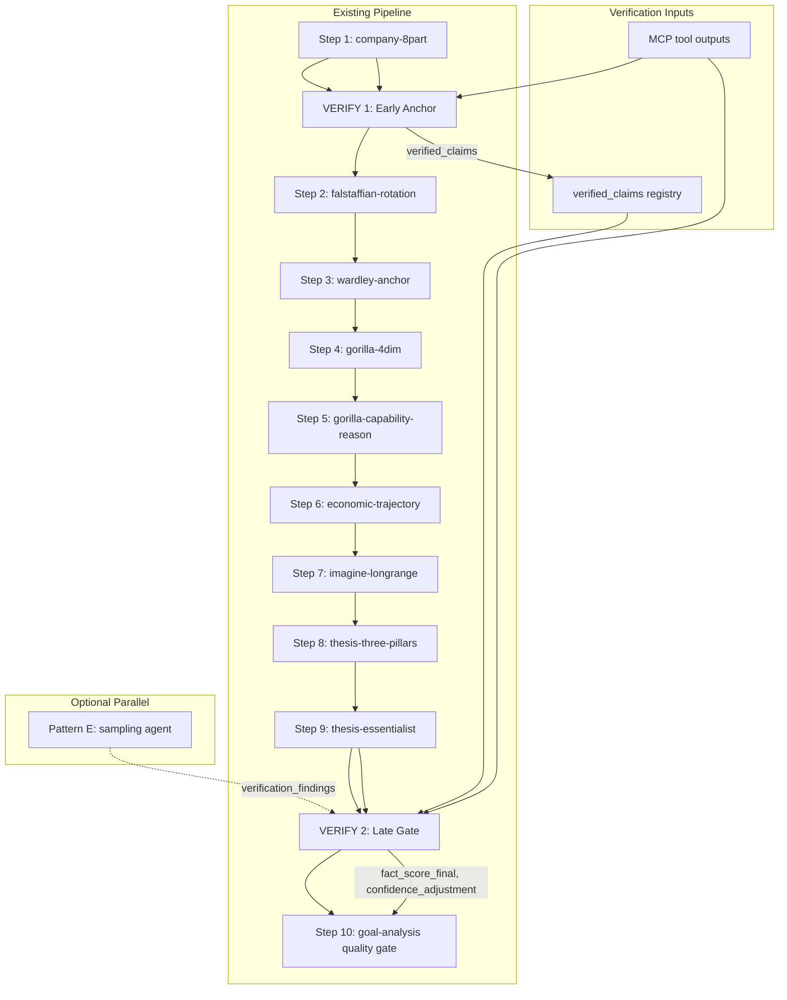

# Fact-Checking and Hypothesis-Verification Design for the Company-Research-Deep Pipeline

**Status:** Draft
**Last-Updated:** 2026-08-21
**Audience:** Skill authors, pipeline maintainers
**MDS Categories:** trust, composition
**Domain:** company-research-deep

---

## 1. Fact Score Definition

### Formula

```
fact_score = 0.35 × SAR + 0.35 × CVR + 0.30 × HFR
```

Where:

| Symbol | Name | Range | Weight |
|--------|------|-------|--------|
| SAR | Source-Anchored claim Ratio | [0, 1] or nil | 0.35 |
| CVR | Citation-Verified Ratio | [0, 1] or nil | 0.30 |
| HFR | Hallucination-Free Ratio | [0, 1] or nil | 0.30 |

Weights sum to 1.00. SAR and CVR carry equal weight (0.35) because they
are complementary evidence-grounding measures — SAR measures whether a
claim *has* a source, CVR measures whether the source *actually says*
what the claim asserts. HFR carries slightly less weight (0.30) because
it is the residual check after the first two have done the heavy lifting,
but it catches the class of errors the first two cannot (fabricated
numbers that happen to cite a real source for a different number).

**Deterministic validation** (via `lisp_eval`):

```
(+ (* 0.35 0.85) (* 0.35 0.90) (* 0.30 0.95)) = 0.8975
```

### Nil-Propagation Invariant

**If any sub-metric is nil (measurement failed), `fact_score` is nil —
not 0.0.** This enforces the `.rules` constraint: "no `unwrap_or(0)` on
verification signals — a failed fact check is a broken feedback loop,
not a zero score." A nil `fact_score` surfaces as a `data_gap` entry
naming the failed sub-metric and propagates a confidence penalty to the
THESIS quality gate.

Enforcement: the `lisp_eval` scoring call checks `(member nil (list SAR
CVR HFR))` before computing the weighted sum. If any element is nil, the
call returns `nil`, not a numeric value. The consuming template treats a
nil `fact_score` as `data_gap: "fact_score_measurement_failed"` with a
confidence penalty of -0.20 (matching the EFRA-AI L2 fallback hierarchy
penalty for a failed valuation MCP tool).

### Measurement Method

#### SAR — Source-Anchored claim Ratio

**Definition:** fraction of factual claims in the pipeline output that
trace to a named source.

**Measurement:**

1. **Claim extraction** (structured-extraction skill): extract all
   declarative factual claims from the pipeline output (CompanyBoard,
   GORILLA scores, IMAGINE scenarios, THESIS statement). Each claim is
   an `(subject, predicate, object)` tuple with a character offset in
   the pipeline output text.
2. **Source classification** (pragmatic-semantics skill): classify each
   claim by epistemic mode. Only IS-mode declarative claims are counted
   as "factual claims" — OUGHT claims (recommendations), subjunctive
   claims (scenarios), and probabilistic claims (forecasts) are excluded
   from the denominator.
3. **Source tracing**: for each factual claim, check whether it carries
   a source reference (MCP tool name + output key, transcript chunk_id,
   web search URL). A claim is "source-anchored" if and only if it
   references a named source that was actually called in the pipeline.

```
SAR = source_anchored_claims / total_factual_claims
```

If `total_factual_claims = 0` (the report made no factual claims — a
degenerate case), SAR = nil (measurement meaningless, not 1.0).

#### CVR — Citation-Verified Ratio

**Definition:** fraction of cited quotes and numbers that can be
verified against the source text via the listening skill's
retrieve-cite-verify process.

**Measurement:**

1. **Citation extraction**: extract all cited quotes and cited numbers
   from the pipeline output. A "cited quote" is a verbatim string
   attributed to a source. A "cited number" is a numeric value
   attributed to a source (transcript, 10-K, MCP tool output).
2. **Retrieve-cite-verify** (listening skill process): for each cited
   quote, verify that the exact substring exists in the referenced
   source chunk (mechanical substring match — not model-mediated). For
   each cited number, verify that the numeric value appears in the
   referenced source output (deterministic numeric match via
   `lisp_eval`).
3. A citation is "verified" if and only if the mechanical check passes.

```
CVR = verified_citations / total_citations
```

If `total_citations = 0`, CVR = nil. If the source text is unavailable
(MCP tool failed, transcript not fetched), CVR = nil for that citation
— not 0.0.

#### HFR — Hallucination-Free Ratio

**Definition:** fraction of factual claims that survive a counterfactual
check — no fabricated numbers, no invented quotes, no misattributed
sources.

**Measurement:**

1. **Counterfactual generation** (falsifiability skill): for each
   factual claim, construct the minimal counterfactual: "if this claim
   is fabricated, what observable difference exists between the claim
   and the source?" The discriminating test is: does the claim's content
   match the source's content?
2. **Fabrication detection**: a claim is "hallucinated" if:
   - It cites a source that was never called (fabricated source).
   - It cites a source that was called but the cited content does not
     appear in the source output (fabricated content).
   - It presents a number that does not appear in any called source and
     is not derived via a stated calculation from source numbers
     (fabricated number).
3. **Elimination**: claims that fail the counterfactual check are
   eliminated (hard, not probabilistic). HFR is the fraction that
   survive.

```
HFR = surviving_claims / total_factual_claims
```

If `total_factual_claims = 0`, HFR = nil.

### Target Threshold

| Threshold | Meaning | Action |
|-----------|---------|--------|
| ≥ 0.80 | Meets bar | Report proceeds to THESIS quality gate |
| 0.60–0.79 | Below bar | Report proceeds but `fact_score` feeds a confidence penalty (-0.10) into the THESIS quality gate; `data_gaps` entries emitted for failed sub-metrics |
| < 0.60 | Fails bar | Report flagged `needs_work` with `data_gaps` entries for every failed claim; convergence loop re-enters COMPANY with fact-check gaps injected |
| nil | Measurement failed | `data_gap: "fact_score_measurement_failed"`; confidence penalty -0.20; report does NOT auto-proceed — surfaces to the THESIS quality gate as `incomplete` if the gate cannot evaluate without the fact score |

The 0.80 threshold is calibrated to the listening skill's certainty
vocabulary: a "proximate" (≥67%) claim is one with strong evidence. The
fact score bar is set above the proximate threshold because factuality
is a binary property (a claim is either grounded or fabricated), not a
graded one — we want the *measurement* to be confident, not the claim.

**Enforcement point**: the `lisp_eval` scoring call in the fact-check
step computes the fact_score and applies the threshold. The call's
output includes `fact_score`, `threshold_met` (boolean), and
`data_gaps` (list). The THESIS quality gate (`goal-analysis/judge`)
consumes `fact_score` as an additional evidence axis alongside the
essentialist elimination_report.

---

## 2. Metacognition: Verification Pattern Exploration

Following the metacognition skill's Kata methodology: grasp the current
condition (no verification), establish a target (fact score ≥ 0.80 with
broken-loop detection), predict which pattern closes the gap, evaluate
each pattern as an experiment, and measure the gap.

### Current Condition (Grasp)

The company-research-deep pipeline has **zero explicit fact-checking**.
Claims flow from MCP tool outputs through LLM synthesis templates with
no verification that:
- The LLM accurately represented what the MCP tool returned
- Cited quotes actually appear in the transcript
- Cited numbers match the source data
- The LLM did not invent facts not present in any source

The existing safeguards are:
- `data_gaps` entries for failed MCP tools (infrastructure failure, not
  content accuracy)
- `goal-analysis/judge` semantic evaluation of the thesis (evaluates
  thesis quality, not factual accuracy of underlying claims)
- `essentialist` 3-gate elimination (evaluates parsimony, not factuality)
- `intel-semantic-classify.j2` classifies certainty levels (prevents
  mode drift, but does not verify content accuracy)

None of these ground claims against source text. The gap is: **no
mechanism prevents the LLM from hallucinating content between the MCP
tool output and the synthesized report.**

### Target Condition (Establish)

- `fact_score ≥ 0.80` on every pipeline run
- Every factual claim in the final report traces to a named source
- Every cited quote is mechanically verified against source text
- Failed verification surfaces as `data_gaps` (never silent fallback)
- The verifier is decoupled from the generator (self-improvement §9.1)
- Verification adds ≤ 2 additional pipeline steps (latency/cost bound)

### Pattern Exploration (Predict + Experiment)

#### Pattern A — Single Late Gate

**Structure:** One verification step after THESIS synthesis (step 14),
before the goal-analysis quality gate (step 14 existing). The verifier
extracts all claims from the final report, checks them against all
source outputs accumulated during the pipeline, and computes the fact
score.

**Insertion:** After step 13 (thesis-essentialist), before step 14
(goal-analysis quality gate).

| Dimension | Evaluation |
|-----------|-----------|
| Failure mode prevented | Hallucinated facts in the final report; fabricated quotes; invented numbers |
| rJoules cost | 1 additional LLM call (claim extraction + verification) + 1 `lisp_eval` call (scoring). ~8-12% of total pipeline cost |
| Latency | +1 sequential step at the end. Minimal because it runs once |
| What it misses | **Propagation errors**: a hallucinated fact introduced at step 2 (company-8part) propagates through GORILLA, IMAGINE, and THESIS before the gate catches it. By step 14, the hallucination has shaped the entire analytical narrative — the gate can flag it but cannot undo the contamination of downstream analysis |
| Sequential composition | Clean — appends one step. Does not break convergence |
| Self-reference safety | Moderate — the verifier sees the full report and all sources, so it has maximum context for cross-checking. But the same model instance generated the report and verifies it (unless decoupled via spawn_agent) |

**Verdict:** Catches terminal hallucinations but allows contamination
to propagate through 12 prior steps before detection. The cost of
re-running contaminated steps is high.

#### Pattern B — Early Anchor + Late Gate

**Structure:** Two verification steps:
1. **Early anchor** (after company-8part, step 1): verify that the
   CompanyBoard's factual claims and cited quotes are grounded in the
   MCP tool outputs and transcript. This anchors the foundation before
   downstream analysis builds on it.
2. **Late gate** (after thesis-essentialist, step 13): same as Pattern
   A's single gate, but now it primarily checks for hallucinations
   introduced *during* downstream synthesis (GORILLA, IMAGINE, THESIS)
   rather than re-checking the already-anchored foundation.

**Insertion:** After step 1 (company-8part) and after step 13
(thesis-essentialist).

| Dimension | Evaluation |
|-----------|-----------|
| Failure mode prevented | Foundation hallucinations (caught early, before they contaminate GORILLA/IMAGINE/THESIS); terminal hallucinations (caught late) |
| rJoules cost | 2 additional LLM calls + 2 `lisp_eval` calls. ~15-20% of total pipeline cost |
| Latency | +2 sequential steps. The early anchor adds latency at the front, the late gate at the back |
| What it misses | **Mid-pipeline hallucinations**: a fact fabricated during GORILLA scoring (step 5) or IMAGINE scenario construction (step 8) that does not trace back to the CompanyBoard. The early anchor verified the CompanyBoard; the late gate checks the final report — but a mid-pipeline hallucination that gets paraphrased into the thesis may not be caught if the late gate focuses on the thesis text rather than tracing every claim back through the full chain |
| Sequential composition | Clean — inserts at two points. The early anchor can block downstream steps if fact_score < 0.60 (re-enter company-8part with gaps) |
| Self-reference safety | Better than A — the early anchor verifier is decoupled from the company-8part generator if run as a separate `spawn_agent`. The late gate can also be decoupled |

**Verdict:** Good balance. Catches foundation errors early (preventing
propagation) and terminal errors late. The gap is mid-pipeline
hallucinations that are paraphrased beyond recognition by the time they
reach the thesis.

#### Pattern C — Three Gates

**Structure:** Three verification steps:
1. **Early anchor** (after company-8part): verify foundation claims.
2. **Mid validation** (after imagine-longrange, step 8): verify that
   GORILLA scores, economic trajectory claims, and IMAGINE scenario
   anchors trace to source data — not invented during synthesis.
3. **Late gate** (after thesis-essentialist): verify final report.

**Insertion:** After step 1, after step 8, after step 13.

| Dimension | Evaluation |
|-----------|-----------|
| Failure mode prevented | Foundation hallucinations; mid-pipeline synthesis hallucinations; terminal hallucinations |
| rJoules cost | 3 additional LLM calls + 3 `lisp_eval` calls. ~22-30% of total pipeline cost |
| Latency | +3 sequential steps. Highest latency of all patterns |
| What it misses | **Inter-gate propagation**: a claim that passes the mid-gate but is distorted during THESIS synthesis (steps 9-13). The late gate catches this, but only if it traces claims back through the full chain, not just to the mid-gate output |
| Sequential composition | Clean but adds friction. Three potential block points means the convergence loop may re-enter more frequently, increasing total iterations |
| Self-reference safety | Strongest — three independent verification points, each can be decoupled |

**Verdict:** Most thorough, but the cost/latency penalty is significant
(~25% of pipeline cost) and the marginal benefit over Pattern B is
diminishing — the mid-gate catches hallucinations that the late gate
would also catch (just later). The main benefit is catching
mid-pipeline hallucinations *before* they contaminate IMAGINE and
THESIS, preventing costly re-runs of those steps.

#### Pattern D — Continuous/Embedded

**Structure:** No separate verification steps. Instead, every template
includes verification logic in its output contract: each template must
emit `source_references` (list of (claim, source) pairs) and
`cited_evidence` (list of (quote, chunk_id, char_offset) tuples). The
listening skill's retrieve-cite-verify process is embedded in each
template's output schema.

**Insertion:** No new steps. Modified output schemas for all existing
templates.

| Dimension | Evaluation |
|-----------|-----------|
| Failure mode prevented | Hallucinations at every stage (each template self-verifies) |
| rJoules cost | ~0 additional LLM calls (verification is embedded in existing calls, adding output tokens). ~5-8% overhead from larger outputs |
| Latency | Minimal — no new sequential steps. But each existing step takes slightly longer due to larger output |
| What it misses | **Self-verification is not verification** — the same LLM call that generates a claim also "verifies" it. This is the self-confirming loop that self-improvement §9.1 explicitly warns against. The LLM that hallucinated a claim will also hallucinate its source reference. This pattern provides the *appearance* of verification without the *substance* |
| Sequential composition | Clean — no new steps |
| Self-reference safety | **Worst** — violates the decoupling principle. The generator is the verifier. This is the self-confirming loop in its purest form |

**Verdict:** Reject. The self-reference problem is fatal. The LLM that
fabricates a quote will also fabricate the chunk_id and char_offset that
"verify" it. The mechanical substring match in the listening skill works
because it is a *post-processing* step outside the LLM — embedding it
*inside* the template output removes that protection. This pattern
provides no actual verification, only the cosmetic appearance of it.

#### Pattern E — Cross-Cutting Verifier

**Structure:** A separate agent (spawned via `spawn_agent`) runs in
parallel with the main pipeline. At each stage boundary, it samples
claims from the stage output and verifies them against accumulated
source outputs. It does not block the pipeline — it emits
`verification_findings` that the THESIS quality gate consumes as
additional evidence.

**Insertion:** Parallel agent, sampling at each stage boundary. Findings
consumed at step 14 (goal-analysis quality gate).

| Dimension | Evaluation |
|-----------|-----------|
| Failure mode prevented | Hallucinations at every stage (sampled, not exhaustive) |
| rJoules cost | 1 additional agent running in parallel. Cost depends on sampling rate — if it samples 100% of claims, cost ≈ Pattern C; if it samples 20%, cost ≈ Pattern A. ~10-15% at reasonable sampling rates |
| Latency | **Lowest** — runs in parallel, does not block the pipeline. Findings arrive at the quality gate |
| What it misses | **Sampling gap**: if the verifier samples 20% of claims, it misses 80% of potential hallucinations. The sampling rate is a precision/recall trade-off. Also, **non-blocking means hallucinations propagate** — the verifier flags them but does not prevent downstream contamination. The quality gate can factor the findings into its verdict, but the contamination has already occurred |
| Sequential composition | Requires parallel agent infrastructure. The `spawn_agent` tool exists but the pipeline's sequential structure does not naturally accommodate parallel verification. The findings must be collected and merged at the quality gate |
| Self-reference safety | **Best** — fully decoupled by construction. The verifier agent has no shared state with the generator. It receives only the stage output and the source outputs — it never sees the generation process |

**Verdict:** Best self-reference safety and lowest latency, but the
sampling gap and non-blocking nature mean it catches hallucinations
*after* they have propagated. The quality gate can penalize the report,
but cannot prevent contamination. This pattern is ideal as a *supplement*
to a blocking gate, not as a replacement.

### Trade-Off Matrix

| Pattern | Thoroughness | Cost (rJoules) | Latency | Self-Reference Safety | Propagation Prevention | Sequential Fit |
|---------|-------------|----------------|---------|----------------------|----------------------|----------------|
| A — Single late gate | Low | +8-12% | +1 step | Moderate (decouplable) | None (catches after propagation) | Clean |
| B — Early anchor + late gate | **High** | +15-20% | +2 steps | **Good** (decouplable at both points) | **Partial** (foundation caught early) | Clean |
| C — Three gates | Highest | +22-30% | +3 steps | Strongest (3 decoupled points) | Strong (foundation + mid caught early) | Clean but high friction |
| D — Continuous/embedded | Appearance only | +5-8% | +0 steps | **Worst** (self-confirming loop) | None (generator = verifier) | Clean |
| E — Cross-cutting verifier | Sampled | +10-15% | +0 (parallel) | **Best** (fully decoupled) | None (non-blocking) | Requires parallel infra |

### Pareto Analysis

The Pareto frontier of (thoroughness, cost, latency, self-reference
safety) is:

- **Pattern B** dominates A on thoroughness and propagation prevention
  at moderate additional cost.
- **Pattern C** dominates B on thoroughness but at significantly higher
  cost — it is off the Pareto frontier for cost-sensitive deployments.
- **Pattern E** dominates all on latency and self-reference safety but
  is dominated on propagation prevention (non-blocking).
- **Pattern D** is dominated by all (self-confirming loop).

The Pareto-optimal choice is **Pattern B**, optionally supplemented by
Pattern E as a non-blocking parallel sampling layer.

---

## 3. Recommended Composition

### Recommendation: Pattern B (Early Anchor + Late Gate), with Pattern E as optional supplement

**Why B wins on the Pareto frontier:**

1. **Propagation prevention**: The early anchor catches foundation
   hallucinations *before* they contaminate GORILLA, IMAGINE, and
   THESIS. This prevents costly re-runs of 12 downstream steps. Pattern
   A catches the same errors but only after propagation — the cost of
   re-running contaminated steps exceeds the cost of the early anchor.
2. **Cost efficiency**: +15-20% pipeline cost for two verification
   points is justified by the propagation-prevention savings. Pattern
   C's +22-30% cost catches mid-pipeline hallucinations that B's late
   gate would also catch (just later) — the marginal benefit does not
   justify the marginal cost.
3. **Self-reference safety**: Both verification points can be decoupled
   from the generator via `spawn_agent` — the verifier agent receives
   only the stage output and the source outputs, never the generation
   process. Pattern E is safer (fully decoupled by construction) but its
   non-blocking nature means it cannot prevent propagation.
4. **Sequential composition**: Two inserts at natural stage boundaries
   (after company-8part, after thesis-essentialist) do not break the
   pipeline's convergence structure. The early anchor can block
   downstream steps; the late gate feeds the quality gate.

**What B misses and how to mitigate:**

| Gap | Mitigation |
|-----|-----------|
| Mid-pipeline hallucinations (steps 2-12) not caught until late gate | The late gate traces every claim in the thesis back through the full chain to its source — not just to the most recent stage output. This is more expensive than a simple final-report check but catches mid-pipeline fabrications |
| Paraphrased hallucinations (claim distorted beyond recognition by the time it reaches thesis) | The early anchor emits `verified_claims` (a registry of grounded claims with source references). Downstream templates are instructed to cite from this registry. The late gate checks that thesis claims either appear in the registry or trace to a new source |
| Optional Pattern E supplement | A parallel sampling agent can catch mid-pipeline hallucinations in real time without blocking. Its findings feed the late gate as additional evidence. This is optional — the pipeline is complete without it |

### Skill Mapping

#### Verification Step 1: Early Anchor (after company-8part)

| Property | Value |
|----------|-------|
| **Skills used** | structured-extraction (claim extraction), listening (retrieve-cite-verify), pragmatic-semantics (IS/OUGHT classification), lisp_eval (scoring) |
| **Pipeline position** | After step 1 (company-8part), before step 2 (falstaffian-competitive-rotation) |
| **Inputs consumed** | `CompanyBoard` (from company-8part), `company_transcript` output, `dcf_valuation` output, `comparable_analysis` output, `web_search` output, `fetch` output (all MCP tool outputs from step 1) |
| **Outputs produced** | `verified_claims` (registry of grounded claims with source references), `fact_score_early` (numeric or nil), `data_gaps` (list of failed verifications), `confidence_adjustment` (numeric penalty) |
| **Failure handling** | If `fact_score_early < 0.60`: block downstream, re-enter company-8part with fact-check gaps injected. If `fact_score_early = nil`: emit `data_gap: "fact_score_early_measurement_failed"`, proceed with confidence penalty -0.20 (broken feedback loop, not silent zero). If `0.60 ≤ fact_score_early < 0.80`: proceed, emit data_gaps for failed sub-metrics, apply confidence penalty -0.10 |
| **Decoupling** | Verifier runs as a `spawn_agent` call — separate agent instance, no shared state with the company-8part generator. The agent receives CompanyBoard + source outputs as inputs, not the generation process |

#### Verification Step 2: Late Gate (after thesis-essentialist)

| Property | Value |
|----------|-------|
| **Skills used** | structured-extraction (claim extraction from full report), listening (retrieve-cite-verify for all citations), falsifiability (counterfactual check for hallucination detection), pragmatic-semantics (IS/OUGHT classification), lisp_eval (scoring) |
| **Pipeline position** | After step 13 (thesis-essentialist), before step 14 (goal-analysis quality gate) |
| **Inputs consumed** | `thesis` (from thesis-three-pillars), `elimination_report` (from thesis-essentialist), `verified_claims` (from early anchor — the registry of already-grounded claims), all MCP tool outputs from the full pipeline, all prior stage outputs (CompanyBoard, rotated_board, wardley_map, gorilla_score, economic_trajectory, ImagineBoard) |
| **Outputs produced** | `fact_score_final` (numeric or nil), `fact_score_breakdown` (SAR, CVR, HFR sub-metrics), `data_gaps` (list of all failed verifications across the full pipeline), `confidence_adjustment` (numeric penalty fed to goal-analysis quality gate), `hallucination_findings` (list of specific claims that failed counterfactual check, with source mismatch details) |
| **Failure handling** | If `fact_score_final < 0.60`: flag `needs_work` with fact-check gaps injected into convergence loop. If `fact_score_final = nil`: emit `data_gap: "fact_score_final_measurement_failed"`, surface to quality gate as `incomplete` (cannot evaluate thesis quality without factuality signal). If `0.60 ≤ fact_score_final < 0.80`: proceed to quality gate with confidence penalty -0.10. If ≥ 0.80: proceed to quality gate with no penalty |
| **Decoupling** | Verifier runs as a `spawn_agent` call — separate agent instance. The agent receives the full report + all source outputs + the `verified_claims` registry, not the generation process. It checks thesis claims against the registry first (fast path for already-verified claims), then against source outputs for new claims introduced during downstream synthesis |

#### Optional Supplement: Pattern E Parallel Sampling Agent

| Property | Value |
|----------|-------|
| **Skills used** | structured-extraction (sampled claim extraction), listening (sampled retrieve-cite-verify) |
| **Pipeline position** | Spawned at pipeline start, samples at each stage boundary, findings collected at late gate |
| **Inputs consumed** | Each stage output + accumulated source outputs (sampled, not exhaustive — default 30% sampling rate) |
| **Outputs produced** | `verification_findings` (list of sampled claims with verification status), `sampling_rate` (actual percentage sampled) |
| **Failure handling** | Findings feed the late gate as additional evidence. Non-blocking — does not affect pipeline flow. If the sampling agent itself fails (spawn error, timeout), emit `data_gap: "parallel_verifier_unavailable"` and proceed without its findings (the late gate is the blocking safety net) |
| **Decoupling** | Fully decoupled by construction — separate agent, parallel execution, no shared state |

### I/O Contract Diagram



---

## 4. Failure Handling

### Per-Verification-Step Failure Rules

All failure handling follows the `.rules` constraints: failed
verification must surface as `data_gaps` entries, never collapse to
None or silent fallback. No `unwrap_or(0)` on verification signals.

| Failure Mode | Detection | Action | Surface |
|-------------|-----------|--------|---------|
| MCP tool output unavailable (source text missing) | Verifier attempts retrieve-cite-verify, source not in context | Mark affected citations as `unverifiable`, not `failed`. CVR sub-metric = nil for those citations | `data_gap: "source_unavailable_for_verification: {tool_name}"` |
| Verifier agent spawn failure | `spawn_agent` returns error | Fact score cannot be computed. `fact_score = nil` | `data_gap: "verifier_spawn_failed: {step_name}"` + confidence penalty -0.20 |
| Verifier agent timeout | Agent does not return within bounded time | Fact score cannot be computed. `fact_score = nil` | `data_gap: "verifier_timeout: {step_name}"` + confidence penalty -0.20 |
| Sub-metric measurement failure (e.g., 0 factual claims found) | `lisp_eval` scoring call detects nil sub-metric | `fact_score = nil` (nil-propagation invariant) | `data_gap: "submetric_nil: {SAR/CVR/HFR}"` |
| Claim fails counterfactual check (hallucination detected) | Falsifiability elimination step eliminates the claim | Claim recorded in `hallucination_findings` with source mismatch details | `data_gap: "hallucinated_claim: {claim_text} expected_source: {source} actual: {mismatch}"` |
| Citation fails mechanical verification (quote not in source) | Listening skill substring match returns false | Citation recorded as `unverified_citation` with expected vs actual | `data_gap: "unverified_citation: {quote} source: {chunk_id}"` |
| `fact_score < 0.60` | `lisp_eval` threshold check | Block: re-enter pipeline with fact-check gaps injected into convergence loop | `convergence_signal: needs_work` + `data_gaps` list |
| `fact_score = nil` | `lisp_eval` returns nil | Surface to quality gate as `incomplete` — cannot evaluate thesis quality without factuality signal | `convergence_signal: incomplete` + `data_gap: "fact_score_measurement_failed"` |

### Confidence Penalty Schedule

| Condition | Penalty | Rationale |
|-----------|---------|-----------|
| `fact_score ≥ 0.80` | 0 | Meets bar |
| `0.60 ≤ fact_score < 0.80` | -0.10 | Below bar but not failing — report proceeds with reduced confidence |
| `fact_score < 0.60` | N/A (blocks) | Re-enter convergence loop |
| `fact_score = nil` | -0.20 | Measurement failed — broken feedback loop. Matches EFRA-AI L2 fallback hierarchy penalty for failed valuation MCP tool |

### Convergence Interaction

The fact score does not replace the existing convergence mechanism
(THESIS quality gate via `goal-analysis/judge`). It feeds into it as an
additional evidence axis:

- The quality gate already consumes the `elimination_report` from
  essentialist. The `fact_score` and `hallucination_findings` are
  additional evidence of the same type — meta-evidence about the
  thesis's quality, not content of the thesis itself.
- `fact_score < 0.60` triggers `needs_work` directly (bypasses the
  quality gate's semantic evaluation — a thesis built on hallucinated
  facts cannot be semantically evaluated for investment quality).
- `fact_score = nil` triggers `incomplete` directly (cannot evaluate
  without the factuality signal — this is the "missing THESIS verdict
  surfaces as 1.0 (worst case)" rule applied to the fact score).
- `fact_score ≥ 0.60` proceeds to the quality gate, which factors the
  confidence penalty into its verdict.

**Max iterations**: The existing `max_iterations: 3` bound applies. If
the fact score fails on iteration 3, the pipeline surfaces `incomplete`
with all `data_gaps` — it does not loop indefinitely.

---

## 5. Self-Reference Safety

### The Problem

The verification step is itself an LLM-generated artifact. The verifier
that checks for hallucinations can itself hallucinate verifications. A
fact-checker that fabricates "verified" status for a hallucinated claim
is worse than no fact-checker — it provides false confidence.

### Mitigations

#### 5.1 Decoupling via spawn_agent

Both verification steps run as `spawn_agent` calls — separate agent
instances with no shared state with the generator. The verifier receives
only:
- The stage output (what to verify)
- The source outputs (what to verify against)
- The `verified_claims` registry (for the late gate — claims already
  verified by the early anchor)

The verifier does NOT receive:
- The generation process (how the stage output was produced)
- The generator's reasoning trace
- The generator's prompt

This prevents the self-confirming loop (self-improvement §9.1): the
verifier cannot rationalize a claim it generated because it did not
generate it. It sees only the claim and the source — it must find the
claim in the source, not remember generating it.

**Enforcement**: `spawn_agent` creates a new agent context. The
generator's conversation history is not shared. This is a platform
guarantee, not a convention — the `spawn_agent` tool specification
states "An agent does not see your conversation history."

#### 5.2 Mechanical Verification (Not Model-Mediated)

The citation-verification step uses the listening skill's
retrieve-cite-verify process, where the final verification is
**mechanical** (substring match), not model-mediated:

1. The verifier LLM extracts cited quotes and identifies their claimed
   source chunk.
2. A **deterministic post-processing step** checks that each cited
   substring is actually present in the referenced source chunk. This is
   a substring match, not an LLM judgment.

The LLM cannot fabricate a verification because the verification is not
an LLM output — it is a mechanical check. The LLM's role is limited to
*finding* the quote and *pointing to* where it found it; the process
*verifies* the pointer.

**Enforcement**: The verifier agent's output schema requires
`cited_evidence` as a list of `(quote, chunk_id, char_offset)` tuples.
The post-processing step performs `(substring_exists(quote,
source_chunk[chunk_id]))` for each tuple. This check is deterministic
and can be implemented as a `lisp_eval` call or a Rust-side validator.

#### 5.3 Deterministic Numeric Verification

For cited numbers (financial metrics, valuation outputs, growth rates),
verification is deterministic via `lisp_eval`:

1. The verifier extracts cited numbers and their claimed source.
2. A `lisp_eval` call checks whether the cited number equals (or is
   derivable from) a number in the source output.

```
;; Example: verifying that a cited revenue number appears in the source
;; (lisp_eval call)
(member 15450000000.0 source_revenue_values)
;; Returns t if the number is in the source, nil if not
```

For derived numbers (e.g., "revenue growth of 12%"), the verifier states
the derivation formula and the `lisp_eval` call checks it:

```
;; Verifying a derived growth rate
(let ((growth (/ (- 15450000000.0 13800000000.0) 13800000000.0)))
  (>= (abs (- growth 0.1196)) 0.001))  ;; tolerance for rounding
```

#### 5.4 Counterfactual Checks via Falsifiability Skill

The hallucination-free ratio uses the falsifiability skill's elimination
method, which is designed to be adversarial — it generates
counterfactuals that would prove the claim wrong, not confirm it. The
skill's constraints state: "A discriminating test must be able to rule
out at least one hypothesis. A test that only confirms the favorite is
not discriminating."

The counterfactual for a factual claim is: "if this claim is fabricated,
the source does not contain it." The discriminating test is: "does the
source contain the claim?" This is a retrieve-cite-verify check, not an
LLM judgment — but the falsifiability skill's framing ensures the
verifier approaches the check adversarially, not confirmatorily.

#### 5.5 What Remes Unverifiable (Honest Disclosure)

The verifier cannot detect:
- **Plausible fabrications**: a claim that is false but consistent with
  the source's style and content. If the LLM invents a quote that sounds
  like something the CEO would say, the mechanical substring check will
  catch it (the quote is not in the transcript). But if the LLM invents
  a *paraphrase* and presents it as analysis (not a quote), the
  verifier has no mechanical check — paraphrases are not citations.
- **Selective omission**: the report cites real facts but omits
  contradictory facts from the same source. The verifier checks that
  cited facts are real; it does not check that all relevant facts are
  cited. This is a completeness gap, not a factuality gap.
- **Causal inference errors**: the report correctly cites facts but
  draws incorrect causal conclusions. The verifier checks factuality,
  not reasoning quality — that is the job of the GORILLA, FALSTAFFIAN,
  and essentialist steps.

These limitations are disclosed in the verifier's output as
`verification_scope_limitations` — a list of what the fact score does
and does not cover. The THESIS quality gate consumes this as context for
interpreting the fact score.

---

## 6. SKILL.md Changes

### New Step Descriptions

Add two new step descriptions to the `## Instructions` section of
`company-research-deep/SKILL.md`:

#### verify-early-anchor (after company-8part)

```markdown
### verify-early-anchor

1. Verify that the CompanyBoard's factual claims and cited quotes are
   grounded in the MCP tool outputs and transcript consumed by
   company-8part.
2. Extract all factual claims from the CompanyBoard using
   structured-extraction. Classify each claim by epistemic mode using
   pragmatic-semantics — only IS-mode declarative claims are factual
   claims.
3. For each cited quote, run the listening skill's retrieve-cite-verify
   process: verify the exact substring exists in the referenced source
   chunk (mechanical substring match).
4. For each cited number, verify via lisp_eval that the value appears in
   the referenced source output (deterministic numeric match).
5. For each factual claim, run a falsifiability counterfactual check:
   "if this claim is fabricated, the source does not contain it." The
   discriminating test is whether the claim's content traces to a called
   source.
6. Compute fact_score_early = 0.35*SAR + 0.35*CVR + 0.30*HFR via
   lisp_eval. If any sub-metric is nil, fact_score_early = nil (not 0).
7. Emit verified_claims (registry of grounded claims with source
   references), fact_score_early, data_gaps, confidence_adjustment.
8. If fact_score_early < 0.60: block downstream, re-enter company-8part
   with fact-check gaps injected. If nil: emit data_gap
   "fact_score_early_measurement_failed" + confidence penalty -0.20.
9. Run as a spawn_agent call — decoupled from the company-8part
   generator (self-improvement §9.1).
```

#### verify-late-gate (after thesis-essentialist)

```markdown
### verify-late-gate

1. Verify that the full pipeline report's factual claims (CompanyBoard
   through THESIS) are grounded in source data.
2. Extract all factual claims from the thesis and all prior stage
   outputs using structured-extraction. Classify by epistemic mode using
   pragmatic-semantics.
3. Check each claim against the verified_claims registry from the early
   anchor (fast path — already-verified claims skip re-verification).
4. For new claims introduced during downstream synthesis (GORILLA,
   IMAGINE, THESIS), run the full retrieve-cite-verify +
   falsifiability counterfactual check against all accumulated source
   outputs.
5. Compute fact_score_final = 0.35*SAR + 0.35*CVR + 0.30*HFR via
   lisp_eval. If any sub-metric is nil, fact_score_final = nil.
6. Emit fact_score_final, fact_score_breakdown (SAR, CVR, HFR),
   data_gaps, confidence_adjustment, hallucination_findings,
   verification_scope_limitations.
7. If fact_score_final < 0.60: flag needs_work with fact-check gaps
   injected. If nil: surface to quality gate as incomplete. If 0.60-0.79:
   proceed with confidence penalty -0.10. If >= 0.80: proceed with no
   penalty.
8. fact_score_final and confidence_adjustment feed the goal-analysis
   quality gate as additional evidence alongside the elimination_report.
9. Run as a spawn_agent call — decoupled from all prior generators.
```

### Registry Template Additions

Add two new template descriptions to the `## Registry Templates` table:

```markdown
| `verify-early-anchor.j2` | Verification step 1. Extracts factual claims from the CompanyBoard, classifies them by epistemic mode (pragmatic-semantics), verifies cited quotes via retrieve-cite-verify (mechanical substring match), verifies cited numbers via lisp_eval (deterministic numeric match), runs falsifiability counterfactual checks for hallucination detection. Computes fact_score_early = 0.35*SAR + 0.35*CVR + 0.30*HFR. Emits verified_claims registry, fact_score_early, data_gaps, confidence_adjustment. Consumes CompanyBoard + all step-1 MCP tool outputs. Run as spawn_agent (decoupled from generator). |
| `verify-late-gate.j2` | Verification step 2. Extracts factual claims from the full pipeline report (thesis + all prior stage outputs), checks against verified_claims registry from early anchor (fast path), runs full verification on new claims introduced during downstream synthesis. Computes fact_score_final = 0.35*SAR + 0.35*CVR + 0.30*HFR. Emits fact_score_final, fact_score_breakdown, data_gaps, confidence_adjustment, hallucination_findings, verification_scope_limitations. Consumes thesis + elimination_report + verified_claims + all MCP tool outputs + all prior stage outputs. Run as spawn_agent (decoupled from generator). fact_score_final feeds the goal-analysis quality gate as additional evidence. |
```

### Convergence Section Update

Update the `## Convergence` section to document the fact score's role:

```markdown
The deep pipeline converges on the THESIS quality gate verdict:
investment_grade = 0.0 (fully converged), needs_work = 0.5 (re-enter
COMPANY with THESIS gaps injected), incomplete = 1.0 (escalate).
max_iterations: 3 bounds the loop.

The fact_score (from verify-late-gate) feeds the quality gate as
additional evidence: fact_score < 0.60 triggers needs_work directly
(bypasses semantic evaluation — a thesis built on hallucinated facts
cannot be evaluated for investment quality). fact_score = nil triggers
incomplete (cannot evaluate without factuality signal). fact_score ≥ 0.60
proceeds to semantic evaluation with confidence penalty factored in.
```

### Cross-Skill Composition Section Update

Add to the `## Cross-Skill Composition` section:

```markdown
- Verification step 1 (verify-early-anchor) reuses structured-extraction
  (claim extraction), listening (retrieve-cite-verify), pragmatic-semantics
  (IS/OUGHT classification), and falsifiability (counterfactual checks).
  Run as spawn_agent for decoupling (self-improvement §9.1).
- Verification step 2 (verify-late-gate) reuses the same skills plus the
  verified_claims registry from step 1. Run as spawn_agent for decoupling.
- The fact_score computation is a lisp_eval call (deterministic scoring,
  same pattern as GORILLA's fixed-weight scoring).
```

### Constraints Section Update

Add to the `## Constraints` section:

```markdown
- fact_score sub-metrics (SAR, CVR, HFR) use nil-propagation: if any
  sub-metric is nil, fact_score = nil (not 0). Enforced by lisp_eval
  scoring call.
- No unwrap_or(0) on fact_score — a nil fact_score surfaces as
  data_gap "fact_score_measurement_failed" with confidence penalty -0.20.
- Verification steps run as spawn_agent calls — decoupled from the
  generator to prevent the self-confirming loop (self-improvement §9.1).
- Citation verification is mechanical (substring match), not
  model-mediated — the LLM finds and points; the process verifies.
- The verifier discloses verification_scope_limitations (what it cannot
  detect: plausible fabrications, selective omission, causal inference
  errors) — advertised invariants point to enforcement.
```

---

## 7. .rules Additions

Proposed additions to `zed-kask/.rules` (or the company-research crate's
`.rules` if one exists). These follow the `.rules` hygiene guidelines:
non-obvious, repeatedly encountered, specific enough to act on.

```markdown
# Fact-checking pipeline traps

* Fact score sub-metrics use nil-propagation, not zero-fallback. If SAR, CVR, or HFR is nil (measurement failed), fact_score is nil — never `unwrap_or(0)`. A nil fact_score surfaces as `data_gap: "fact_score_measurement_failed"` with confidence penalty -0.20. This is the same pattern as "missing THESIS verdict surfaces as 1.0 (worst case)."

* Verification steps must run as `spawn_agent` calls, not inline LLM calls. The verifier that checks for hallucinations can itself hallucinate — decoupling via `spawn_agent` (separate agent context, no shared conversation history) is the self-improvement §9.1 enforcement. Inline verification is the self-confirming loop.

* Citation verification is mechanical (substring match), not model-mediated. The listening skill's retrieve-cite-verify process enforces no-fabrication by process: the LLM finds a quote and points to where it found it; a post-processing step checks the pointer. Do not replace this with an LLM judgment call — the LLM that fabricated a quote will also fabricate its verification.

* Cited numbers must be verified via `lisp_eval` (deterministic numeric match against source output), not by LLM judgment. A number that "looks right" is not a verified number — it must appear in the source output or be derivable via a stated formula from source numbers.

* The fact_score feeds the THESIS quality gate as additional evidence — it does not replace the `goal-analysis/judge` semantic evaluation. fact_score < 0.60 triggers `needs_work` directly (a thesis on hallucinated facts cannot be semantically evaluated), but fact_score ≥ 0.60 still requires the semantic quality gate. Two independent gates, not one.

* `verification_scope_limitations` must be disclosed in the verifier output. The fact score covers factuality (is the claim real?), not completeness (are all relevant facts cited?) or reasoning quality (are the causal conclusions correct?). Advertising a "high fact score" without disclosing what it does not cover violates the advertised-invariants-must-point-to-enforcement rule.
```

---

## Appendix: Fact Score Computation (lisp_eval Reference)

The fact score is computed by a `lisp_eval` call in each verification
step. The call takes three sub-metrics (SAR, CVR, HFR) and returns the
weighted sum, or nil if any sub-metric is nil.

**Scoring call (early anchor):**

```lisp
;; Inputs: SAR, CVR, HFR (each [0,1] or nil)
;; Output: fact_score (float or nil), threshold_met (bool), data_gaps (list)
(if (member nil (list sar cvr hfr))
    (list (cons 'fact_score 'nil)
          (cons 'threshold_met 'nil)
          (cons 'data_gaps (list "fact_score_measurement_failed")))
    (let ((score (+ (* 0.35 sar) (* 0.35 cvr) (* 0.30 hfr))))
      (list (cons 'fact_score score)
            (cons 'threshold_met (if (>= score 0.80) t nil))
            (cons 'below_bar (if (and (>= score 0.60) (< score 0.80)) t nil))
            (cons 'fails_bar (if (< score 0.60) t nil)))))
```

**Validated sample computation:**

```
(+ (* 0.35 0.85) (* 0.35 0.90) (* 0.30 0.95)) = 0.8975
;; threshold_met = true (0.8975 >= 0.80)
```

**Nil-propagation test:**

```
(member nil (list 0.85 nil 0.95))
;; Returns non-nil → fact_score = nil
;; data_gaps = ["fact_score_measurement_failed"]
```