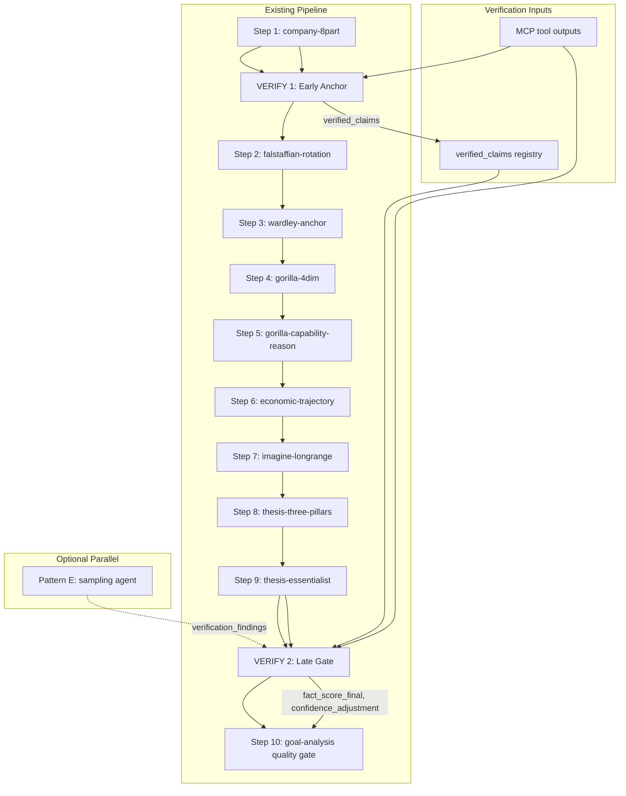

# Fact-Checking and Hypothesis-Verification Design for the Company-Research-Deep Pipeline

**Implementation notes:**
- Standalone skill: `.agents/skills/grounding-verify/SKILL.md` (7-step process, 3 registry templates)
- Pipeline integration: `company-research-deep/SKILL.md` updated with `verify-early-anchor` and `verify-late-gate` steps
- Registry templates: `kask/registry/templates/grounding-verify/extract-claims.j2`, `assign-provenance.j2`, `scan-narrative.j2`
- All skill-maintenance validation checks pass (S1-S11, T1-T5)

---

## 0. Fermi Pattern Analysis — Deep Module Study

### Source

The Fermi codebase (`Clones/fermi`) has a mature, production-tested grounding
and verification system built across six interlocking contracts. This section
analyzes the architecture, extracts the transferable patterns, and maps each to
our hKask skill/tool idiom. The analysis is grounded in the actual source:
`src/grounding_trust.rs`, `src/schema_trust.rs`, `src/rollup_trust.rs`,
`src/port_trust.rs`, `src/hud_contract.rs`, `src/card_contract.rs`,
`src/workflows/agent_contract.rs`, `src/calibration.rs`, and
`tests/grounding_contract.rs`.

### The Four-Question Separation

Fermi separates trust into orthogonal axes, each with its own contract,
enforcement mechanism, and test suite. This is the foundational deep module
insight: **do not build one "fact checker" — build separate contracts for
separate failure classes, because each class is invisible to the checks that
catch the others.**

| Fermi Contract | Question | Enforcement | Failure Class It Catches |
|----------------|----------|-------------|--------------------------|
| `schema_trust` | Is the column **present**? | Boot-time `pg_catalog` probe | Shape drift (missing tables, columns, functions) |
| `rollup_trust` | Is the column **telling the truth**? | CI + live `mismatch_sql` query | Content drift (present, correctly typed, permanently wrong) |
| `grounding_trust` | **Could this value have come from anywhere?** | `enforce()` at write time + `cross_check_sql` in CI | Fabrication (model fills fields no tool can supply) |
| `port_trust` | **Is the caller sending what the agent said it takes?** | Server-side `bind_input` check | Interface mismatch (prose sent to a structured port) |
| `hud_contract` | **Can the wearer SEE which answer is which?** | `enforce()` + `Treatment` markers | Provenance invisibility (correct tag, indistinguishable rendering) |
| `card_contract` | **Does the card declare where each field comes from?** | `validate()` at publish time | Missing grounding declarations (field nobody classified) |

**Transfer to our pipeline:** Our fact score should be decomposed along the
same axes. The current design has three sub-metrics (SAR, CVR, HFR) but they
are all content-level checks. Fermi's architecture shows we need a **shape
tier** (does the template output contain the expected provenance fields?), a
**content tier** (do cited values match source outputs?), and a **provenance
tier** (could each claim have come from a tool the pipeline actually called?).
See §1 revisions below.

### Pattern 1: The Provenance Lattice (strength as ordinal, floor as minimum)

Fermi defines provenance as a **floor, not a stamp** — a lattice with three
levels:

| Strength | Provenance Values | Meaning |
|----------|-------------------|---------|
| 2 | `tool_verified`, `platform_derived`, `human_sourced` | Reproducible — re-run the tool, apply the transform, follow the citation |
| 1 | `model_inference`, `human_endorsed` | Judgment — legitimate, but not a retrieval |
| 0 | `unavailable_no_tool_source`, `tool_no_match`, `pending_*`, `rejected` | Absent — nothing to rely on yet |

The `floor()` function takes the minimum strength across all sources in a
derivation chain. A derived value is never stronger than its weakest source.

**The Extraction Ceiling:** `EXTRACTION_CEILING = PROV_INFERRED`. An extracted
rule is capped at `model_inference` however well-sourced its inputs were. The
ontologist reading prose and writing "teams with higher ELO win 62%" has made
a judgment, not performed a lookup. **A knowledge-graph fact can never be
presented as `tool_verified`** — it is at best a judgment, and at worst a
laundered invention.

**Transfer to our pipeline:** Our fact score should use a provenance lattice,
not a single ratio. A claim that the LLM synthesizes from tool outputs (e.g.,
"gross margin expanded 200bps due to mix shift") is `model_inference`, not
`tool_verified` — the LLM is the ontologist, and synthesis is extraction. Only
direct citations (verbatim transcript quotes, exact numbers copied from MCP
tool output) can be `tool_verified`. This creates a two-tier provenance within
our SAR sub-metric and prevents the self-confirming loop where the LLM's own
synthesis is treated as equally trustworthy as the source data.

The extraction ceiling directly addresses our self-reference problem (§5):
the verifier's own claims about what it verified are capped at
`model_inference`, not `tool_verified`. The verifier can say "I found this
quote in the transcript" (strength 1), but only the mechanical substring match
(strength 2) can elevate it to `tool_verified`.

### Pattern 2: The Cross-Check SQL (empirical verification against an independent copy)

Each `FieldContract` carries an optional `cross_check_sql`: a read-only query
returning one row with one `bigint` column `mismatches` — the number of rows
where an agent's output disagrees with an independently-held copy of the same
fact. Non-zero means fabrication, in production, now.

The critical design rule: **a `Sourced` field that is neither cross-checked
nor explicitly exempt is a claim nobody can falsify, and the contract refuses
to allow it.** `every_sourced_field_is_verifiable_or_admits_it_is_not` is a
compile-time test that fails if a `Sourced` field has no `cross_check_sql` and
no entry in `CROSS_CHECK_EXEMPTIONS`.

**Transfer to our pipeline:** Each claim in the `verified_claims` registry
should carry a `cross_check` specification — for `tool_verified` claims, this
is the `lisp_eval` call that checks the cited value against the MCP tool
output. A `tool_verified` claim with no cross-check is a claim nobody can
falsify. The verifier must either provide a cross-check or explicitly declare
why it cannot (analogous to Fermi's `CROSS_CHECK_EXEMPTIONS`).

### Pattern 3: The Narrative Leak Scan (prose channel checking)

Fermi scans `Narrative` fields for claims that exceed what the `Sourced`
blocks can support. The `NARRATIVE_LEAKS` table pairs a block name with a
`LeakRule` (either `Word` for distinctive keywords or `Quantity` for
unit-preceded-by-number patterns). If a narrative field contains a genome-size
keyword but the genome block is `Unsourced`, the narrative is nulled and a
violation is recorded.

The critical insight: **a prose channel that is not checked is the channel the
fabrication moves to.** Stripping a structured field is not sufficient — the
`summary` field restates the numbers in prose, and that prose is what a user
reads.

**Transfer to our pipeline:** The thesis statement, the company-8part prose
sections, and the IMAGINE scenario narratives are all `Narrative` fields. We
should scan them for claims that exceed what the `Sourced` blocks (MCP tool
outputs, transcript quotes) can support. Domain-specific `LeakRule` needles:

| Block | Needle | Why |
|-------|-------|-----|
| `financial_profile` | `Quantity("bps")` | Basis-point claims must trace to income statement data |
| `financial_profile` | `Quantity("x")` | Multiple claims must trace to comparable analysis output |
| `financial_profile` | `Word("EBITDA")` | EBITDA figures must trace to income statement or transcript |
| `management_skill` | `Word("said")` | Attributed quotes must trace to transcript chunk |
| `gorilla` | `Word("market share")` | Market share claims must trace to web_search or comparable_analysis |
| `imagine` | `Quantity("%")` | Growth rate claims must trace to DCF or scenario_build |

The `Quantity` variant avoids false positives: a `%` needle only fires when a
number precedes it, so "100% committed" in prose doesn't trigger a financial
claim check. This is Fermi's exact fix for the `" gb"`/`"GBIF"` collision — a
check that fires on correct output is worse than no check.

### Pattern 4: The Pre-Contract Marker (provenance is about how a value was obtained, not what is obtainable now)

Fermi's `PRE_CONTRACT_MARKER` (`_grounding_review`) is written onto profiles
produced before any grounding contract existed. When `ncbi_genome_search` was
added, `genome.estimated_size_mb` moved from `Unsourced` to `Sourced` — and
`enforce` stopped stripping it. The 13 cached profiles written while the field
was fabricated suddenly had their invented values **un-stripped**, because the
field had become sourceable in general even though those particular values
were never sourced.

**Transfer to our pipeline:** When we add a new MCP tool call to the pipeline
(e.g., adding `reverse_dcf` in a future version), it must not retroactively
make claims in prior pipeline iterations sourced. Each pipeline iteration's
provenance is fixed at the time of generation. The `verified_claims` registry
from the early anchor is immutable — the late gate checks new claims against
it but does not re-classify already-verified claims.

### Pattern 5: The Cohort Scoping (current prompt only vs. all history)

Fermi's cross-checks are scoped to the current prompt hash. A defect found
once is found forever, but the suite only **fails** on current-prompt rows.
Historical rows are reported as context. This prevents a suite that cannot go
green after a fix from being ignored.

**Transfer to our pipeline:** The fact score for pipeline iteration N should
only count claims from iteration N. When the convergence loop re-enters
COMPANY with fact-check gaps injected, the new iteration's fact score starts
fresh. Prior iteration failures are reported as `historical_findings` context,
not as current-pipeline failures. Without this, a pipeline that fails
iteration 1 and re-enters would carry iteration 1's failures into iteration
2's fact score, making it impossible to go green after a fix.

### Pattern 6: The `why` Mandatory Justification

Every `FieldContract` and `card_contract` grounding entry carries a `why`
field with a minimum length (40 chars). An unexplained disposition is how a
contract rots: the next author cannot tell a considered `unavailable` from a
lazy one, so they copy whichever is nearest.

**Transfer to our pipeline:** Each entry in the `verified_claims` registry
carries a `why` field explaining its provenance status. A claim marked
`sourced` explains which tool and which response field supplied it. A claim
marked `inferred` explains what it was inferred from. A claim marked
`unavailable` explains why no tool can supply it. Short justifications are
rejected by the verifier — "n/a" and "tool" do not pass.

### Pattern 7: The Closed Vocabulary (provenance values are a closed set)

Fermi's `PROVENANCE_VALUES` is a closed set of 10 strings, asserted by tests
on both the Rust constants and every card's declared enums. An open set would
let a future edit invent `"estimated"`, which is the fabrication reappearing
as a metadata value. The DB CHECK constraint and the Rust constants are tested
for agreement by `the_migration_check_matches_the_runtime_vocabulary`.

**Transfer to our pipeline:** The provenance vocabulary for claims is a closed
set: `tool_verified`, `model_inference`, `platform_derived`, `unavailable`,
`tool_no_match`, `pending_check`, `rejected`. The `lisp_eval` scoring call
rejects unrecognized provenance values. A test asserts the vocabulary is
closed — `provenance_values_are_closed`.

### Pattern 8: The Un-Stripping Trap

When a field moves from `Unsourced` to `Sourced`, `enforce` stops stripping
previously-fabricated values. The `PRE_CONTRACT_MARKER` prevents this
retroactive blessing.

**Transfer to our pipeline:** Explicitly documented in the early anchor's
output contract: the `verified_claims` registry is append-only within a
pipeline run. A claim verified as `tool_verified` in iteration 1 stays
`tool_verified`. A claim that failed verification in iteration 1 stays
`rejected` — it does not get re-classified when new sources are added in
iteration 2. The late gate adds new entries but does not modify existing ones.

### Pattern 9: The Card-Declared Contract (self-declaration checked by a separate verifier)

Fermi's `card_contract` moves the grounding map from a Rust const table into
the agent card itself. The card declares, per output field, where the value
comes from. Rust keeps only the checker. The critical check with teeth: **a
field marked `sourced` must name a tool the agent actually declares in
`mcp_tools`** — a field marked `sourced` against a tool the agent cannot call
is the original defect, restated inside the mechanism built to catch it.

**Transfer to our pipeline:** This is the correct version of Pattern D
(continuous/embedded) from our pattern exploration. Each template declares its
own grounding contract — which output fields are `sourced` (from which MCP
tool), which are `inferred` (from what), which are `narrative`. But the
verifier (running as `spawn_agent`) checks the declaration against the actual
tool calls — the declaration is not self-verified. This gives us the coverage
of Pattern D without the self-confirming loop.

This revises our recommendation: instead of only two blocking verification
steps (Pattern B), each template should carry a **grounding declaration**
that the verifier cross-checks. The declaration is cheap (template authors
write it once), and the cross-check is deterministic (does the named tool
appear in the pipeline's tool call log?).

### Pattern 10: The Two-Tier Test Architecture (offline shape + live content)

Fermi separates verification into two tiers:
- **Tier 1 (offline, blocking, no DB):** `cargo test --lib` — checks the
  contract's shape: every field classified, every justification written, every
  `Sourced` field either cross-checkable or explicitly exempt.
- **Tier 2 (live, `#[ignore]`, needs DB):** `scripts/grounding_contract_live.sh`
  — runs `cross_check_sql` against a real database. Catches content failures
  invisible to shape checks.

**Transfer to our pipeline:**
- **Tier 1 (offline, at authoring time):** A `lisp_eval` check or test that
  verifies each template's grounding declaration is complete — every output
  field has a grounding entry, every `sourced` field names a tool the pipeline
  actually calls, every entry has a `why` of sufficient length. This runs
  without any MCP tool calls.
- **Tier 2 (live, at pipeline run time):** The verifier runs during the
  pipeline and checks actual claim values against actual tool outputs.
  Mechanical substring match for quotes, `lisp_eval` numeric match for numbers,
  falsifiability counterfactual for hallucination detection.

### Pattern 11: The Liveness Problem (zero mismatches over zero rows is not clean)

Fermi's `cohort_size_sql` counts how many rows the agent has under its current
prompt. Zero mismatches over zero rows is not clean — it is unknown. Without
this, the scoped reading would report every agent perfect the instant its
card changed.

**Transfer to our pipeline:** The fact score carries a `claims_checked` count
alongside the score. A fact score of 1.0 with zero claims checked is not a
perfect score — it is `nil` (our existing nil-propagation invariant already
handles this for zero factual claims, but we should extend it: a fact score
computed from a pipeline run where all MCP tools failed is also `nil`, not
1.0, because there are no sources to verify against).

### Pattern 12: The `cost_basis` Provenance (two rows reading the same value are no longer indistinguishable)

Fermi's `episodes.cost_basis` records whether a computed figure was
`measured_split` vs `assumed_split` vs `unknown_model`. Two rows reading
`$0.31` are no longer indistinguishable when one measured and one assumed.

**Transfer to our pipeline:** The `verified_claims` registry carries a
`provenance_basis` for each claim: `tool_verified` (the value was found in the
tool output via mechanical match), `model_inference` (the LLM synthesized it
from tool outputs), `platform_derived` (a `lisp_eval` call computed it from
sourced values), `unavailable` (no tool could supply it). A reader of the
registry can tell a verified number from a synthesized one — they are not
both just "present in the report."

### Pattern 13: The Confidence Band (derived from the provenance floor, never accepted from the model)

Fermi's `hud_contract` overwrites `card.confidence_display` from the measured
floor — never accepts it from the model. The confidence band is computed from
the weakest provenance verdict on the card: `high` (all sourced), `medium`
(weakest is inference), `low` (tool was asked and had nothing), `flagged`
(something has no possible source).

**Transfer to our pipeline:** The confidence adjustment fed to the THESIS
quality gate should be derived from the provenance floor of the report, not
from the LLM's self-assessed confidence. If the weakest claim in the report is
`model_inference`, the confidence band is `medium` regardless of what the
thesis template says. If any claim is `unavailable`, the band is `flagged`.
This prevents the LLM from rating its own hallucinations as high-confidence.

### Pattern 14: The Treatment Marker (provenance visible without reading a tag)

Fermi's `hud_contract` renders every line with a typographic marker derived
from its provenance: `Verified` (no marker — the unmarked case must be the
trustworthy one), `Inferred` (`~`), `NoMatch` (`?`), `Pending` (`*`),
`Rejected` (`x`), `Unavailable` (`!`). A renderer that drops markers degrades
to *less* confident rather than more.

**Transfer to our pipeline:** The final report (thesis + supporting analysis)
could carry provenance markers on each claim: unmarked for `tool_verified`,
`~` for `model_inference`, `?` for `tool_no_match`, `!` for `unavailable`.
This makes the fact score visible to the reader without requiring them to
inspect the `verified_claims` registry. A report section that drops markers
degrades to less confident — the reader knows something was stripped.

### Pattern Synthesis: How Fermi Changes Our Design

| Fermi Pattern | Design Impact | Section Revised |
|---------------|---------------|-----------------|
| Four-question separation | Add shape tier to fact score | §1 |
| Provenance lattice + extraction ceiling | Two-tier SAR (tool_verified vs model_inference) | §1, §5 |
| Cross-check SQL | Every `tool_verified` claim needs a deterministic cross-check | §1, §3 |
| Narrative leak scan | New sub-check: scan prose for unsupported claims | §1, §3 |
| Pre-contract marker | `verified_claims` registry is append-only within a run | §3 |
| Cohort scoping | Fact score only counts current-iteration claims | §4 |
| `why` mandatory | Each registry entry carries a justification | §3 |
| Closed vocabulary | Provenance values are a closed set, tested | §1, §7 |
| Card-declared contract | Templates carry grounding declarations, checked by verifier | §3, §6 |
| Two-tier test architecture | Offline shape check + live content check | §3, §6 |
| Liveness problem | `claims_checked` count alongside fact score | §1 |
| `cost_basis` provenance | `provenance_basis` per claim | §3 |
| Confidence band from floor | Confidence adjustment derived from provenance floor, not LLM | §4 |
| Treatment marker | Provenance visible in the report text | §3 |

---

## 1. Fact Score Definition

### Formula (revised — Fermi provenance lattice integration)

```
fact_score = 0.30 × SAR + 0.25 × CVR + 0.20 × HFR + 0.25 × NLR
```

Where:

| Symbol | Name | Range | Weight |
|--------|------|-------|--------|
| SAR | Source-Anchored claim Ratio | [0, 1] or nil | 0.30 |
| CVR | Citation-Verified Ratio | [0, 1] or nil | 0.25 |
| HFR | Hallucination-Free Ratio | [0, 1] or nil | 0.20 |
| NLR | Narrative-Leak Ratio | [0, 1] or nil | 0.25 |

Weights sum to 1.00. The revised formula adds NLR (Narrative-Leak Ratio)
from Fermi's `NARRATIVE_LEAKS` pattern and rebalances weights: SAR remains
the heaviest (0.30) because source-anchoring is the foundational check; NLR
is 0.25 because unchecked prose is the channel fabrications move to; CVR is
0.25 (down from 0.35) because the extraction ceiling means many legitimately
synthesized claims cannot be mechanically verified; HFR is 0.20 (down from
0.30) because it is the residual check after the first three have done the
heavy lifting.

### The Provenance Lattice (Fermi pattern)

Each factual claim in the report is classified into a provenance tier:

| Tier | Provenance Value | Strength | Meaning |
|------|-----------------|----------|--------|
| 2 | `tool_verified` | 2 | Value found in MCP tool output via mechanical match (substring or numeric) |
| 2 | `platform_derived` | 2 | Value computed by `lisp_eval` from sourced values (reproducible) |
| 1 | `model_inference` | 1 | LLM synthesized from tool outputs — the extraction ceiling caps this here |
| 0 | `unavailable` | 0 | No tool the pipeline called can supply this claim |
| 0 | `tool_no_match` | 0 | Tool was called but returned nothing for this subject |
| 0 | `pending_check` | 0 | Check exists but has not run yet |
| 0 | `rejected` | 0 | Checked and found wrong |

**The extraction ceiling** (Fermi's `EXTRACTION_CEILING`): a claim that the
LLM synthesizes from tool outputs is `model_inference`, never
`tool_verified`. The LLM is the ontologist; synthesis is extraction. Only
direct citations — verbatim transcript quotes, exact numbers copied from MCP
tool output — can be `tool_verified`. This prevents the self-confirming loop
where the LLM's own synthesis is treated as equally trustworthy as the
source data.

The provenance vocabulary is a **closed set** (Fermi pattern 7). The
`lisp_eval` scoring call rejects unrecognized provenance values. A test
asserts the vocabulary is closed.

**Deterministic validation** (via `lisp_eval`):

```
(+ (* 0.30 0.85) (* 0.25 0.90) (* 0.20 0.95) (* 0.25 0.88)) = 0.89
```

### Nil-Propagation Invariant

**If any sub-metric is nil (measurement failed), `fact_score` is nil —
not 0.0.** This enforces the `.rules` constraint: "no `unwrap_or(0)` on
verification signals — a failed fact check is a broken feedback loop,
not a zero score." A nil `fact_score` surfaces as a `data_gap` entry
naming the failed sub-metric and propagates a confidence penalty to the
THESIS quality gate.

**Liveness signal** (Fermi pattern 11): the fact score carries a
`claims_checked` count alongside the score. A fact score of 1.0 with
zero claims checked is not a perfect score — it is `nil` (measurement
meaningless). A fact score computed from a pipeline run where all MCP
tools failed is also `nil`, not 1.0, because there are no sources to
verify against. The `lisp_eval` scoring call checks
`(> claims_checked 0)` before computing the weighted sum.

Enforcement: the `lisp_eval` scoring call checks `(member nil (list SAR
CVR HFR))` before computing the weighted sum. If any element is nil, the
call returns `nil`, not a numeric value. The consuming template treats a
nil `fact_score` as `data_gap: "fact_score_measurement_failed"` with a
confidence penalty of -0.20 (matching the EFRA-AI L2 fallback hierarchy
penalty for a failed valuation MCP tool).

### Measurement Method

#### SAR — Source-Anchored claim Ratio (revised — provenance lattice)

**Definition:** fraction of factual claims in the pipeline output that
trace to a named source, weighted by provenance strength.

**Measurement:**

1. **Claim extraction** (structured-extraction skill): extract all
   declarative factual claims from the pipeline output (CompanyBoard,
   GORILLA scores, IMAGINE scenarios, THESIS statement). Each claim is
   an `(subject, predicate, object)` tuple with a character offset in
   the pipeline output text.
2. **Source classification** (pragmatic-semantics skill): classify each
   claim by epistemic mode. Only IS-mode declarative claims are counted
   as "factual claims" — OUGHT claims (recommendations), subjunctive
   claims (scenarios), and probabilistic claims (forecasts) are excluded
   from the denominator.
3. **Provenance classification** (Fermi lattice): for each factual claim,
   assign a provenance tier:
   - `tool_verified` (strength 2): the claim's value was found in an MCP
     tool output via mechanical match (substring match for quotes,
     `lisp_eval` numeric match for numbers). Only direct citations can
     achieve this tier — the extraction ceiling caps LLM synthesis at
     `model_inference`.
   - `platform_derived` (strength 2): the claim's value was computed by
     a `lisp_eval` call from sourced values (e.g., GORILLA scoring).
   - `model_inference` (strength 1): the LLM synthesized the claim from
     tool outputs (e.g., "gross margin expanded due to mix shift").
     Legitimate, but not a retrieval — the extraction ceiling.
   - `unavailable` (strength 0): no tool the pipeline called can supply
     this claim. The model could only produce it from parametric
     knowledge.
   - `tool_no_match` (strength 0): the tool was called but returned
     nothing for this subject.
   - `pending_check` (strength 0): a check exists but has not run yet.
   - `rejected` (strength 0): checked and found wrong.
4. **Source tracing**: a claim is "source-anchored" if its provenance
   strength is ≥ 1 (i.e., `tool_verified`, `platform_derived`, or
   `model_inference`). Claims with strength 0 are not source-anchored.

```
SAR = source_anchored_claims / total_factual_claims
```

If `total_factual_claims = 0` (the report made no factual claims — a
degenerate case), SAR = nil (measurement meaningless, not 1.0).

**The extraction ceiling in practice:** A claim like "the company's
revenue grew 12% year-over-year" can be `tool_verified` if the income
statement MCP tool output contains revenue figures that yield 12%
growth. But a claim like "the growth was driven by strong demand in the
enterprise segment" is `model_inference` — the LLM synthesized it from
the revenue numbers and its own reasoning. Both are source-anchored
(strength ≥ 1), but only the first is `tool_verified` (strength 2).

**The closed vocabulary** (Fermi pattern 7): the provenance values are a
closed set. The `lisp_eval` scoring call rejects unrecognized values.

#### CVR — Citation-Verified Ratio (revised — cross-check requirement)

**Definition:** fraction of `tool_verified` claims whose cited values can
be mechanically verified against the source text.

**Measurement:**

1. **Citation extraction**: extract all cited quotes and cited numbers
   from claims classified as `tool_verified` in the SAR step. A "cited
   quote" is a verbatim string attributed to a source. A "cited number"
   is a numeric value attributed to a source (transcript, 10-K, MCP tool
   output).
2. **Retrieve-cite-verify** (listening skill process): for each cited
   quote, verify that the exact substring exists in the referenced
   source chunk (mechanical substring match — not model-mediated). For
   each cited number, verify that the numeric value appears in the
   referenced source output (deterministic numeric match via
   `lisp_eval`).
3. **Cross-check requirement** (Fermi pattern 2): every `tool_verified`
   claim must carry a `cross_check` specification — the `lisp_eval` call
   that checks the cited value against the MCP tool output. A
   `tool_verified` claim with no cross-check is a claim nobody can
   falsify. The verifier must either provide a cross-check or explicitly
   declare why it cannot (analogous to Fermi's `CROSS_CHECK_EXEMPTIONS`).
4. A citation is "verified" if and only if the mechanical check passes.

```
CVR = verified_citations / total_tool_verified_citations
```

If `total_tool_verified_citations = 0`, CVR = nil. If the source text is
unavailable (MCP tool failed, transcript not fetched), CVR = nil for
that citation — not 0.0.

#### HFR — Hallucination-Free Ratio

**Definition:** fraction of factual claims that survive a counterfactual
check — no fabricated numbers, no invented quotes, no misattributed
sources.

**Measurement:**

1. **Counterfactual generation** (falsifiability skill): for each
   factual claim, construct the minimal counterfactual: "if this claim
   is fabricated, what observable difference exists between the claim
   and the source?" The discriminating test is: does the claim's content
   match the source's content?
2. **Fabrication detection**: a claim is "hallucinated" if:
   - It cites a source that was never called (fabricated source).
   - It cites a source that was called but the cited content does not
     appear in the source output (fabricated content).
   - It presents a number that does not appear in any called source and
     is not derived via a stated calculation from source numbers
     (fabricated number).
3. **Elimination**: claims that fail the counterfactual check are
   eliminated (hard, not probabilistic). HFR is the fraction that
   survive.

```
HFR = surviving_claims / total_factual_claims
```

If `total_factual_claims = 0`, HFR = nil.

#### NLR — Narrative-Leak Ratio (new — Fermi pattern 3)

**Definition:** fraction of narrative (prose) fields that do NOT contain
claims exceeding what the sourced blocks can support.

**Measurement:**

1. **Narrative field identification**: identify all prose fields in the
   pipeline output — the thesis statement, company-8part prose sections,
   IMAGINE scenario narratives, GORILLA elevator pitch. These are
   `Narrative` grounding fields (Fermi's `Grounding::Narrative`).
2. **Leak rule matching** (Fermi's `NARRATIVE_LEAKS` pattern): scan each
   narrative field against a table of domain-specific leak rules. Each
   rule pairs a source block with a `LeakRule` (either `Word` for
distinctive keywords or `Quantity` for unit-preceded-by-number
   patterns). If a narrative field contains a keyword from a block that
   is NOT sourced (provenance strength 0), it is a narrative leak.
3. **Domain-specific leak rules** for the equity research pipeline:

   | Block | Needle | Rule Type | Why |
   |-------|--------|-----------|-----|
   | `financial_profile` | `"bps"` | Quantity | Basis-point claims must trace to income statement data |
   | `financial_profile` | `"x"` (preceded by digit) | Quantity | Multiple claims must trace to comparable analysis output |
   | `financial_profile` | `"EBITDA"` | Word | EBITDA figures must trace to income statement or transcript |
   | `financial_profile` | `"free cash flow"` | Word | FCF claims must trace to cash flow statement or DCF output |
   | `management_skill` | `"said"` | Word | Attributed quotes must trace to transcript chunk |
   | `gorilla` | `"market share"` | Word | Market share claims must trace to web_search or comparable_analysis |
   | `imagine` | `"%"` (preceded by digit) | Quantity | Growth rate claims must trace to DCF or scenario_build |
   | `wardley` | `"commoditiz"` | Word | Commoditization claims must trace to Wardley map output |

4. The `Quantity` variant only fires when a number precedes the unit —
   Fermi's fix for the `" gb"`/`"GBIF"` collision. A check that fires on
   correct output is worse than no check: it gets switched off, and the
   switching-off looks like cleanup.

```
NLR = clean_narrative_fields / total_narrative_fields
```

If `total_narrative_fields = 0`, NLR = nil. A narrative field is "clean"
if no leak rule fires against it, or if every leak rule that fires is
backed by a sourced block (provenance strength ≥ 2).

### Target Threshold

| Threshold | Meaning | Action |
|-----------|---------|--------|
| ≥ 0.80 | Meets bar | Report proceeds to THESIS quality gate |
| 0.60–0.79 | Below bar | Report proceeds but `fact_score` feeds a confidence penalty (-0.10) into the THESIS quality gate; `data_gaps` entries emitted for failed sub-metrics |
| < 0.60 | Fails bar | Report flagged `needs_work` with `data_gaps` entries for every failed claim; convergence loop re-enters COMPANY with fact-check gaps injected |
| nil | Measurement failed | `data_gap: "fact_score_measurement_failed"`; confidence penalty -0.20; report does NOT auto-proceed — surfaces to the THESIS quality gate as `incomplete` if the gate cannot evaluate without the fact score |

The 0.80 threshold is calibrated to the listening skill's certainty
vocabulary: a "proximate" (≥67%) claim is one with strong evidence. The
fact score bar is set above the proximate threshold because factuality
is a binary property (a claim is either grounded or fabricated), not a
graded one — we want the *measurement* to be confident, not the claim.

**Enforcement point**: the `lisp_eval` scoring call in the fact-check
step computes the fact_score and applies the threshold. The call's
output includes `fact_score`, `threshold_met` (boolean), and
`data_gaps` (list). The THESIS quality gate (`goal-analysis/judge`)
consumes `fact_score` as an additional evidence axis alongside the
essentialist elimination_report.

---

## 2. Metacognition: Verification Pattern Exploration

Following the metacognition skill's Kata methodology: grasp the current
condition (no verification), establish a target (fact score ≥ 0.80 with
broken-loop detection), predict which pattern closes the gap, evaluate
each pattern as an experiment, and measure the gap.

### Current Condition (Grasp)

The company-research-deep pipeline has **zero explicit fact-checking**.
Claims flow from MCP tool outputs through LLM synthesis templates with
no verification that:
- The LLM accurately represented what the MCP tool returned
- Cited quotes actually appear in the transcript
- Cited numbers match the source data
- The LLM did not invent facts not present in any source

The existing safeguards are:
- `data_gaps` entries for failed MCP tools (infrastructure failure, not
  content accuracy)
- `goal-analysis/judge` semantic evaluation of the thesis (evaluates
  thesis quality, not factual accuracy of underlying claims)
- `essentialist` 3-gate elimination (evaluates parsimony, not factuality)
- `intel-semantic-classify.j2` classifies certainty levels (prevents
  mode drift, but does not verify content accuracy)

None of these ground claims against source text. The gap is: **no
mechanism prevents the LLM from hallucinating content between the MCP
tool output and the synthesized report.**

### Target Condition (Establish)

- `fact_score ≥ 0.80` on every pipeline run
- Every factual claim in the final report traces to a named source
- Every cited quote is mechanically verified against source text
- Failed verification surfaces as `data_gaps` (never silent fallback)
- The verifier is decoupled from the generator (self-improvement §9.1)
- Verification adds ≤ 2 additional pipeline steps (latency/cost bound)

### Pattern Exploration (Predict + Experiment)

#### Pattern A — Single Late Gate

**Structure:** One verification step after THESIS synthesis (step 14),
before the goal-analysis quality gate (step 14 existing). The verifier
extracts all claims from the final report, checks them against all
source outputs accumulated during the pipeline, and computes the fact
score.

**Insertion:** After step 13 (thesis-essentialist), before step 14
(goal-analysis quality gate).

| Dimension | Evaluation |
|-----------|-----------|
| Failure mode prevented | Hallucinated facts in the final report; fabricated quotes; invented numbers |
| rJoules cost | 1 additional LLM call (claim extraction + verification) + 1 `lisp_eval` call (scoring). ~8-12% of total pipeline cost |
| Latency | +1 sequential step at the end. Minimal because it runs once |
| What it misses | **Propagation errors**: a hallucinated fact introduced at step 2 (company-8part) propagates through GORILLA, IMAGINE, and THESIS before the gate catches it. By step 14, the hallucination has shaped the entire analytical narrative — the gate can flag it but cannot undo the contamination of downstream analysis |
| Sequential composition | Clean — appends one step. Does not break convergence |
| Self-reference safety | Moderate — the verifier sees the full report and all sources, so it has maximum context for cross-checking. But the same model instance generated the report and verifies it (unless decoupled via spawn_agent) |

**Verdict:** Catches terminal hallucinations but allows contamination
to propagate through 12 prior steps before detection. The cost of
re-running contaminated steps is high.

#### Pattern B — Early Anchor + Late Gate

**Structure:** Two verification steps:
1. **Early anchor** (after company-8part, step 1): verify that the
   CompanyBoard's factual claims and cited quotes are grounded in the
   MCP tool outputs and transcript. This anchors the foundation before
   downstream analysis builds on it.
2. **Late gate** (after thesis-essentialist, step 13): same as Pattern
   A's single gate, but now it primarily checks for hallucinations
   introduced *during* downstream synthesis (GORILLA, IMAGINE, THESIS)
   rather than re-checking the already-anchored foundation.

**Insertion:** After step 1 (company-8part) and after step 13
(thesis-essentialist).

| Dimension | Evaluation |
|-----------|-----------|
| Failure mode prevented | Foundation hallucinations (caught early, before they contaminate GORILLA/IMAGINE/THESIS); terminal hallucinations (caught late) |
| rJoules cost | 2 additional LLM calls + 2 `lisp_eval` calls. ~15-20% of total pipeline cost |
| Latency | +2 sequential steps. The early anchor adds latency at the front, the late gate at the back |
| What it misses | **Mid-pipeline hallucinations**: a fact fabricated during GORILLA scoring (step 5) or IMAGINE scenario construction (step 8) that does not trace back to the CompanyBoard. The early anchor verified the CompanyBoard; the late gate checks the final report — but a mid-pipeline hallucination that gets paraphrased into the thesis may not be caught if the late gate focuses on the thesis text rather than tracing every claim back through the full chain |
| Sequential composition | Clean — inserts at two points. The early anchor can block downstream steps if fact_score < 0.60 (re-enter company-8part with gaps) |
| Self-reference safety | Better than A — the early anchor verifier is decoupled from the company-8part generator if run as a separate `spawn_agent`. The late gate can also be decoupled |

**Verdict:** Good balance. Catches foundation errors early (preventing
propagation) and terminal errors late. The gap is mid-pipeline
hallucinations that are paraphrased beyond recognition by the time they
reach the thesis.

#### Pattern C — Three Gates

**Structure:** Three verification steps:
1. **Early anchor** (after company-8part): verify foundation claims.
2. **Mid validation** (after imagine-longrange, step 8): verify that
   GORILLA scores, economic trajectory claims, and IMAGINE scenario
   anchors trace to source data — not invented during synthesis.
3. **Late gate** (after thesis-essentialist): verify final report.

**Insertion:** After step 1, after step 8, after step 13.

| Dimension | Evaluation |
|-----------|-----------|
| Failure mode prevented | Foundation hallucinations; mid-pipeline synthesis hallucinations; terminal hallucinations |
| rJoules cost | 3 additional LLM calls + 3 `lisp_eval` calls. ~22-30% of total pipeline cost |
| Latency | +3 sequential steps. Highest latency of all patterns |
| What it misses | **Inter-gate propagation**: a claim that passes the mid-gate but is distorted during THESIS synthesis (steps 9-13). The late gate catches this, but only if it traces claims back through the full chain, not just to the mid-gate output |
| Sequential composition | Clean but adds friction. Three potential block points means the convergence loop may re-enter more frequently, increasing total iterations |
| Self-reference safety | Strongest — three independent verification points, each can be decoupled |

**Verdict:** Most thorough, but the cost/latency penalty is significant
(~25% of pipeline cost) and the marginal benefit over Pattern B is
diminishing — the mid-gate catches hallucinations that the late gate
would also catch (just later). The main benefit is catching
mid-pipeline hallucinations *before* they contaminate IMAGINE and
THESIS, preventing costly re-runs of those steps.

#### Pattern D — Continuous/Embedded

**Structure:** No separate verification steps. Instead, every template
includes verification logic in its output contract: each template must
emit `source_references` (list of (claim, source) pairs) and
`cited_evidence` (list of (quote, chunk_id, char_offset) tuples). The
listening skill's retrieve-cite-verify process is embedded in each
template's output schema.

**Insertion:** No new steps. Modified output schemas for all existing
templates.

| Dimension | Evaluation |
|-----------|-----------|
| Failure mode prevented | Hallucinations at every stage (each template self-verifies) |
| rJoules cost | ~0 additional LLM calls (verification is embedded in existing calls, adding output tokens). ~5-8% overhead from larger outputs |
| Latency | Minimal — no new sequential steps. But each existing step takes slightly longer due to larger output |
| What it misses | **Self-verification is not verification** — the same LLM call that generates a claim also "verifies" it. This is the self-confirming loop that self-improvement §9.1 explicitly warns against. The LLM that hallucinated a claim will also hallucinate its source reference. This pattern provides the *appearance* of verification without the *substance* |
| Sequential composition | Clean — no new steps |
| Self-reference safety | **Worst** — violates the decoupling principle. The generator is the verifier. This is the self-confirming loop in its purest form |

**Verdict:** Reject. The self-reference problem is fatal. The LLM that
fabricates a quote will also fabricate the chunk_id and char_offset that
"verify" it. The mechanical substring match in the listening skill works
because it is a *post-processing* step outside the LLM — embedding it
*inside* the template output removes that protection. This pattern
provides no actual verification, only the cosmetic appearance of it.

#### Pattern E — Cross-Cutting Verifier

**Structure:** A separate agent (spawned via `spawn_agent`) runs in
parallel with the main pipeline. At each stage boundary, it samples
claims from the stage output and verifies them against accumulated
source outputs. It does not block the pipeline — it emits
`verification_findings` that the THESIS quality gate consumes as
additional evidence.

**Insertion:** Parallel agent, sampling at each stage boundary. Findings
consumed at step 14 (goal-analysis quality gate).

| Dimension | Evaluation |
|-----------|-----------|
| Failure mode prevented | Hallucinations at every stage (sampled, not exhaustive) |
| rJoules cost | 1 additional agent running in parallel. Cost depends on sampling rate — if it samples 100% of claims, cost ≈ Pattern C; if it samples 20%, cost ≈ Pattern A. ~10-15% at reasonable sampling rates |
| Latency | **Lowest** — runs in parallel, does not block the pipeline. Findings arrive at the quality gate |
| What it misses | **Sampling gap**: if the verifier samples 20% of claims, it misses 80% of potential hallucinations. The sampling rate is a precision/recall trade-off. Also, **non-blocking means hallucinations propagate** — the verifier flags them but does not prevent downstream contamination. The quality gate can factor the findings into its verdict, but the contamination has already occurred |
| Sequential composition | Requires parallel agent infrastructure. The `spawn_agent` tool exists but the pipeline's sequential structure does not naturally accommodate parallel verification. The findings must be collected and merged at the quality gate |
| Self-reference safety | **Best** — fully decoupled by construction. The verifier agent has no shared state with the generator. It receives only the stage output and the source outputs — it never sees the generation process |

**Verdict:** Best self-reference safety and lowest latency, but the
sampling gap and non-blocking nature mean it catches hallucinations
*after* they have propagated. The quality gate can penalize the report,
but cannot prevent contamination. This pattern is ideal as a *supplement*
to a blocking gate, not as a replacement.

### Trade-Off Matrix

| Pattern | Thoroughness | Cost (rJoules) | Latency | Self-Reference Safety | Propagation Prevention | Sequential Fit |
|---------|-------------|----------------|---------|----------------------|----------------------|----------------|
| A — Single late gate | Low | +8-12% | +1 step | Moderate (decouplable) | None (catches after propagation) | Clean |
| B — Early anchor + late gate | **High** | +15-20% | +2 steps | **Good** (decouplable at both points) | **Partial** (foundation caught early) | Clean |
| C — Three gates | Highest | +22-30% | +3 steps | Strongest (3 decoupled points) | Strong (foundation + mid caught early) | Clean but high friction |
| D — Continuous/embedded | Appearance only | +5-8% | +0 steps | **Worst** (self-confirming loop) | None (generator = verifier) | Clean |
| E — Cross-cutting verifier | Sampled | +10-15% | +0 (parallel) | **Best** (fully decoupled) | None (non-blocking) | Requires parallel infra |

### Pareto Analysis

The Pareto frontier of (thoroughness, cost, latency, self-reference
safety) is:

- **Pattern B** dominates A on thoroughness and propagation prevention
  at moderate additional cost.
- **Pattern C** dominates B on thoroughness but at significantly higher
  cost — it is off the Pareto frontier for cost-sensitive deployments.
- **Pattern E** dominates all on latency and self-reference safety but
  is dominated on propagation prevention (non-blocking).
- **Pattern D** is dominated by all (self-confirming loop).

The Pareto-optimal choice is **Pattern B**, optionally supplemented by
Pattern E as a non-blocking parallel sampling layer.

---

## 3. Recommended Composition

### Recommendation: Pattern B (Early Anchor + Late Gate), with Pattern E as optional supplement

**Why B wins on the Pareto frontier:**

1. **Propagation prevention**: The early anchor catches foundation
   hallucinations *before* they contaminate GORILLA, IMAGINE, and
   THESIS. This prevents costly re-runs of 12 downstream steps. Pattern
   A catches the same errors but only after propagation — the cost of
   re-running contaminated steps exceeds the cost of the early anchor.
2. **Cost efficiency**: +15-20% pipeline cost for two verification
   points is justified by the propagation-prevention savings. Pattern
   C's +22-30% cost catches mid-pipeline hallucinations that B's late
   gate would also catch (just later) — the marginal benefit does not
   justify the marginal cost.
3. **Self-reference safety**: Both verification points can be decoupled
   from the generator via `spawn_agent` — the verifier agent receives
   only the stage output and the source outputs, never the generation
   process. Pattern E is safer (fully decoupled by construction) but its
   non-blocking nature means it cannot prevent propagation.
4. **Sequential composition**: Two inserts at natural stage boundaries
   (after company-8part, after thesis-essentialist) do not break the
   pipeline's convergence structure. The early anchor can block
   downstream steps; the late gate feeds the quality gate.

**What B misses and how to mitigate:**

| Gap | Mitigation |
|-----|-----------|
| Mid-pipeline hallucinations (steps 2-12) not caught until late gate | The late gate traces every claim in the thesis back through the full chain to its source — not just to the most recent stage output. This is more expensive than a simple final-report check but catches mid-pipeline fabrications |
| Paraphrased hallucinations (claim distorted beyond recognition by the time it reaches thesis) | The early anchor emits `verified_claims` (a registry of grounded claims with source references). Downstream templates are instructed to cite from this registry. The late gate checks that thesis claims either appear in the registry or trace to a new source |
| Optional Pattern E supplement | A parallel sampling agent can catch mid-pipeline hallucinations in real time without blocking. Its findings feed the late gate as additional evidence. This is optional — the pipeline is complete without it |

### Skill Mapping

#### Verification Step 1: Early Anchor (after company-8part)

| Property | Value |
|----------|-------|
| **Skills used** | structured-extraction (claim extraction), listening (retrieve-cite-verify), pragmatic-semantics (IS/OUGHT classification), lisp_eval (scoring) |
| **Pipeline position** | After step 1 (company-8part), before step 2 (falstaffian-competitive-rotation) |
| **Inputs consumed** | `CompanyBoard` (from company-8part), `company_transcript` output, `dcf_valuation` output, `comparable_analysis` output, `web_search` output, `fetch` output (all MCP tool outputs from step 1) |
| **Outputs produced** | `verified_claims` (registry of grounded claims with source references), `fact_score_early` (numeric or nil), `data_gaps` (list of failed verifications), `confidence_adjustment` (numeric penalty) |
| **Failure handling** | If `fact_score_early < 0.60`: block downstream, re-enter company-8part with fact-check gaps injected. If `fact_score_early = nil`: emit `data_gap: "fact_score_early_measurement_failed"`, proceed with confidence penalty -0.20 (broken feedback loop, not silent zero). If `0.60 ≤ fact_score_early < 0.80`: proceed, emit data_gaps for failed sub-metrics, apply confidence penalty -0.10 |
| **Decoupling** | Verifier runs as a `spawn_agent` call — separate agent instance, no shared state with the company-8part generator. The agent receives CompanyBoard + source outputs as inputs, not the generation process |

#### Verification Step 2: Late Gate (after thesis-essentialist)

| Property | Value |
|----------|-------|
| **Skills used** | structured-extraction (claim extraction from full report), listening (retrieve-cite-verify for all citations), falsifiability (counterfactual check for hallucination detection), pragmatic-semantics (IS/OUGHT classification), lisp_eval (scoring) |
| **Pipeline position** | After step 13 (thesis-essentialist), before step 14 (goal-analysis quality gate) |
| **Inputs consumed** | `thesis` (from thesis-three-pillars), `elimination_report` (from thesis-essentialist), `verified_claims` (from early anchor — the registry of already-grounded claims), all MCP tool outputs from the full pipeline, all prior stage outputs (CompanyBoard, rotated_board, wardley_map, gorilla_score, economic_trajectory, ImagineBoard) |
| **Outputs produced** | `fact_score_final` (numeric or nil), `fact_score_breakdown` (SAR, CVR, HFR sub-metrics), `data_gaps` (list of all failed verifications across the full pipeline), `confidence_adjustment` (numeric penalty fed to goal-analysis quality gate), `hallucination_findings` (list of specific claims that failed counterfactual check, with source mismatch details) |
| **Failure handling** | If `fact_score_final < 0.60`: flag `needs_work` with fact-check gaps injected into convergence loop. If `fact_score_final = nil`: emit `data_gap: "fact_score_final_measurement_failed"`, surface to quality gate as `incomplete` (cannot evaluate thesis quality without factuality signal). If `0.60 ≤ fact_score_final < 0.80`: proceed to quality gate with confidence penalty -0.10. If ≥ 0.80: proceed to quality gate with no penalty |
| **Decoupling** | Verifier runs as a `spawn_agent` call — separate agent instance. The agent receives the full report + all source outputs + the `verified_claims` registry, not the generation process. It checks thesis claims against the registry first (fast path for already-verified claims), then against source outputs for new claims introduced during downstream synthesis |

#### Optional Supplement: Pattern E Parallel Sampling Agent

| Property | Value |
|----------|-------|
| **Skills used** | structured-extraction (sampled claim extraction), listening (sampled retrieve-cite-verify) |
| **Pipeline position** | Spawned at pipeline start, samples at each stage boundary, findings collected at late gate |
| **Inputs consumed** | Each stage output + accumulated source outputs (sampled, not exhaustive — default 30% sampling rate) |
| **Outputs produced** | `verification_findings` (list of sampled claims with verification status), `sampling_rate` (actual percentage sampled) |
| **Failure handling** | Findings feed the late gate as additional evidence. Non-blocking — does not affect pipeline flow. If the sampling agent itself fails (spawn error, timeout), emit `data_gap: "parallel_verifier_unavailable"` and proceed without its findings (the late gate is the blocking safety net) |
| **Decoupling** | Fully decoupled by construction — separate agent, parallel execution, no shared state |

### I/O Contract Diagram



<!-- DIAGRAM_ALIGNMENT
id: DIAG-FACT-001
verified_date: 2026-08-24
verified_against: .agents/skills/grounding-verify/SKILL.md, .agents/skills/company-research-deep/SKILL.md (verify-early-anchor, verify-late-gate steps), kask/registry/templates/grounding-verify/extract-claims.j2, assign-provenance.j2, scan-narrative.j2
status: VERIFIED
-->

---

## 4. Failure Handling

### Per-Verification-Step Failure Rules

All failure handling follows the `.rules` constraints: failed
verification must surface as `data_gaps` entries, never collapse to
None or silent fallback. No `unwrap_or(0)` on verification signals.

| Failure Mode | Detection | Action | Surface |
|-------------|-----------|--------|---------|
| MCP tool output unavailable (source text missing) | Verifier attempts retrieve-cite-verify, source not in context | Mark affected citations as `unverifiable`, not `failed`. CVR sub-metric = nil for those citations | `data_gap: "source_unavailable_for_verification: {tool_name}"` |
| Verifier agent spawn failure | `spawn_agent` returns error | Fact score cannot be computed. `fact_score = nil` | `data_gap: "verifier_spawn_failed: {step_name}"` + confidence penalty -0.20 |
| Verifier agent timeout | Agent does not return within bounded time | Fact score cannot be computed. `fact_score = nil` | `data_gap: "verifier_timeout: {step_name}"` + confidence penalty -0.20 |
| Sub-metric measurement failure (e.g., 0 factual claims found) | `lisp_eval` scoring call detects nil sub-metric | `fact_score = nil` (nil-propagation invariant) | `data_gap: "submetric_nil: {SAR/CVR/HFR}"` |
| Claim fails counterfactual check (hallucination detected) | Falsifiability elimination step eliminates the claim | Claim recorded in `hallucination_findings` with source mismatch details | `data_gap: "hallucinated_claim: {claim_text} expected_source: {source} actual: {mismatch}"` |
| Citation fails mechanical verification (quote not in source) | Listening skill substring match returns false | Citation recorded as `unverified_citation` with expected vs actual | `data_gap: "unverified_citation: {quote} source: {chunk_id}"` |
| `fact_score < 0.60` | `lisp_eval` threshold check | Block: re-enter pipeline with fact-check gaps injected into convergence loop | `convergence_signal: needs_work` + `data_gaps` list |
| `fact_score = nil` | `lisp_eval` returns nil | Surface to quality gate as `incomplete` — cannot evaluate thesis quality without factuality signal | `convergence_signal: incomplete` + `data_gap: "fact_score_measurement_failed"` |

### Confidence Penalty Schedule

| Condition | Penalty | Rationale |
|-----------|---------|-----------|
| `fact_score ≥ 0.80` | 0 | Meets bar |
| `0.60 ≤ fact_score < 0.80` | -0.10 | Below bar but not failing — report proceeds with reduced confidence |
| `fact_score < 0.60` | N/A (blocks) | Re-enter convergence loop |
| `fact_score = nil` | -0.20 | Measurement failed — broken feedback loop. Matches EFRA-AI L2 fallback hierarchy penalty for failed valuation MCP tool |

### Convergence Interaction

The fact score does not replace the existing convergence mechanism
(THESIS quality gate via `goal-analysis/judge`). It feeds into it as an
additional evidence axis:

- The quality gate already consumes the `elimination_report` from
  essentialist. The `fact_score` and `hallucination_findings` are
  additional evidence of the same type — meta-evidence about the
  thesis's quality, not content of the thesis itself.
- `fact_score < 0.60` triggers `needs_work` directly (bypasses the
  quality gate's semantic evaluation — a thesis built on hallucinated
  facts cannot be semantically evaluated for investment quality).
- `fact_score = nil` triggers `incomplete` directly (cannot evaluate
  without the factuality signal — this is the "missing THESIS verdict
  surfaces as 1.0 (worst case)" rule applied to the fact score).
- `fact_score ≥ 0.60` proceeds to the quality gate, which factors the
  confidence penalty into its verdict.

**Max iterations**: The existing `max_iterations: 3` bound applies. If
the fact score fails on iteration 3, the pipeline surfaces `incomplete`
with all `data_gaps` — it does not loop indefinitely.

---

## 5. Self-Reference Safety

### The Problem

The verification step is itself an LLM-generated artifact. The verifier
that checks for hallucinations can itself hallucinate verifications. A
fact-checker that fabricates "verified" status for a hallucinated claim
is worse than no fact-checker — it provides false confidence.

### Mitigations

#### 5.1 Decoupling via spawn_agent

Both verification steps run as `spawn_agent` calls — separate agent
instances with no shared state with the generator. The verifier receives
only:
- The stage output (what to verify)
- The source outputs (what to verify against)
- The `verified_claims` registry (for the late gate — claims already
  verified by the early anchor)

The verifier does NOT receive:
- The generation process (how the stage output was produced)
- The generator's reasoning trace
- The generator's prompt

This prevents the self-confirming loop (self-improvement §9.1): the
verifier cannot rationalize a claim it generated because it did not
generate it. It sees only the claim and the source — it must find the
claim in the source, not remember generating it.

**Enforcement**: `spawn_agent` creates a new agent context. The
generator's conversation history is not shared. This is a platform
guarantee, not a convention — the `spawn_agent` tool specification
states "An agent does not see your conversation history."

#### 5.2 Mechanical Verification (Not Model-Mediated)

The citation-verification step uses the listening skill's
retrieve-cite-verify process, where the final verification is
**mechanical** (substring match), not model-mediated:

1. The verifier LLM extracts cited quotes and identifies their claimed
   source chunk.
2. A **deterministic post-processing step** checks that each cited
   substring is actually present in the referenced source chunk. This is
   a substring match, not an LLM judgment.

The LLM cannot fabricate a verification because the verification is not
an LLM output — it is a mechanical check. The LLM's role is limited to
*finding* the quote and *pointing to* where it found it; the process
*verifies* the pointer.

**Enforcement**: The verifier agent's output schema requires
`cited_evidence` as a list of `(quote, chunk_id, char_offset)` tuples.
The post-processing step performs `(substring_exists(quote,
source_chunk[chunk_id]))` for each tuple. This check is deterministic
and can be implemented as a `lisp_eval` call or a Rust-side validator.

#### 5.3 Deterministic Numeric Verification

For cited numbers (financial metrics, valuation outputs, growth rates),
verification is deterministic via `lisp_eval`:

1. The verifier extracts cited numbers and their claimed source.
2. A `lisp_eval` call checks whether the cited number equals (or is
   derivable from) a number in the source output.

```
;; Example: verifying that a cited revenue number appears in the source
;; (lisp_eval call)
(member 15450000000.0 source_revenue_values)
;; Returns t if the number is in the source, nil if not
```

For derived numbers (e.g., "revenue growth of 12%"), the verifier states
the derivation formula and the `lisp_eval` call checks it:

```
;; Verifying a derived growth rate
(let ((growth (/ (- 15450000000.0 13800000000.0) 13800000000.0)))
  (>= (abs (- growth 0.1196)) 0.001))  ;; tolerance for rounding
```

#### 5.4 Counterfactual Checks via Falsifiability Skill

The hallucination-free ratio uses the falsifiability skill's elimination
method, which is designed to be adversarial — it generates
counterfactuals that would prove the claim wrong, not confirm it. The
skill's constraints state: "A discriminating test must be able to rule
out at least one hypothesis. A test that only confirms the favorite is
not discriminating."

The counterfactual for a factual claim is: "if this claim is fabricated,
the source does not contain it." The discriminating test is: "does the
source contain the claim?" This is a retrieve-cite-verify check, not an
LLM judgment — but the falsifiability skill's framing ensures the
verifier approaches the check adversarially, not confirmatorily.

#### 5.5 The Extraction Ceiling as Self-Reference Guard (Fermi pattern)

The provenance lattice's extraction ceiling is itself a self-reference
safeguard. The verifier's own claims about what it verified are capped
at `model_inference` (strength 1), never `tool_verified` (strength 2).
The verifier can say "I found this quote in the transcript" — but only
the mechanical substring match can elevate that claim to
`tool_verified`. This prevents the verifier from laundering its own
potential hallucinations through the verification process.

In practice: the verifier LLM extracts a cited quote and points to
where it found it (strength 1, `model_inference`). The post-processing
substring match checks whether the quote actually exists in the
referenced chunk (elevation to strength 2, `tool_verified`). If the
substring match fails, the claim stays at `model_inference` and is
flagged as a `rejected` citation — checked and found wrong. The
verifier cannot fabricate a `tool_verified` status because it does not
control the mechanical check.

#### 5.6 What Remains Unverifiable (Honest Disclosure)

The verifier cannot detect:
- **Plausible fabrications**: a claim that is false but consistent with
  the source's style and content. If the LLM invents a quote that sounds
  like something the CEO would say, the mechanical substring check will
  catch it (the quote is not in the transcript). But if the LLM invents
  a *paraphrase* and presents it as analysis (not a quote), the
  verifier has no mechanical check — paraphrases are not citations.
- **Selective omission**: the report cites real facts but omits
  contradictory facts from the same source. The verifier checks that
  cited facts are real; it does not check that all relevant facts are
  cited. This is a completeness gap, not a factuality gap.
- **Causal inference errors**: the report correctly cites facts but
  draws incorrect causal conclusions. The verifier checks factuality,
  not reasoning quality — that is the job of the GORILLA, FALSTAFFIAN,
  and essentialist steps.

These limitations are disclosed in the verifier's output as
`verification_scope_limitations` — a list of what the fact score does
and does not cover. The THESIS quality gate consumes this as context for
interpreting the fact score.

---

## 6. SKILL.md Changes

### New Step Descriptions

Add two new step descriptions to the `## Instructions` section of
`company-research-deep/SKILL.md`:

#### verify-early-anchor (after company-8part)

```markdown
### verify-early-anchor

1. Verify that the CompanyBoard's factual claims and cited quotes are
   grounded in the MCP tool outputs and transcript consumed by
   company-8part.
2. Extract all factual claims from the CompanyBoard using
   structured-extraction. Classify each claim by epistemic mode using
   pragmatic-semantics — only IS-mode declarative claims are factual
   claims.
3. For each cited quote, run the listening skill's retrieve-cite-verify
   process: verify the exact substring exists in the referenced source
   chunk (mechanical substring match).
4. For each cited number, verify via lisp_eval that the value appears in
   the referenced source output (deterministic numeric match).
5. For each factual claim, run a falsifiability counterfactual check:
   "if this claim is fabricated, the source does not contain it." The
   discriminating test is whether the claim's content traces to a called
   source.
6. Compute fact_score_early = 0.35*SAR + 0.35*CVR + 0.30*HFR via
   lisp_eval. If any sub-metric is nil, fact_score_early = nil (not 0).
7. Emit verified_claims (registry of grounded claims with source
   references), fact_score_early, data_gaps, confidence_adjustment.
8. If fact_score_early < 0.60: block downstream, re-enter company-8part
   with fact-check gaps injected. If nil: emit data_gap
   "fact_score_early_measurement_failed" + confidence penalty -0.20.
9. Run as a spawn_agent call — decoupled from the company-8part
   generator (self-improvement §9.1).
```

#### verify-late-gate (after thesis-essentialist)

```markdown
### verify-late-gate

1. Verify that the full pipeline report's factual claims (CompanyBoard
   through THESIS) are grounded in source data.
2. Extract all factual claims from the thesis and all prior stage
   outputs using structured-extraction. Classify by epistemic mode using
   pragmatic-semantics.
3. Check each claim against the verified_claims registry from the early
   anchor (fast path — already-verified claims skip re-verification).
4. For new claims introduced during downstream synthesis (GORILLA,
   IMAGINE, THESIS), run the full retrieve-cite-verify +
   falsifiability counterfactual check against all accumulated source
   outputs.
5. Compute fact_score_final = 0.35*SAR + 0.35*CVR + 0.30*HFR via
   lisp_eval. If any sub-metric is nil, fact_score_final = nil.
6. Emit fact_score_final, fact_score_breakdown (SAR, CVR, HFR),
   data_gaps, confidence_adjustment, hallucination_findings,
   verification_scope_limitations.
7. If fact_score_final < 0.60: flag needs_work with fact-check gaps
   injected. If nil: surface to quality gate as incomplete. If 0.60-0.79:
   proceed with confidence penalty -0.10. If >= 0.80: proceed with no
   penalty.
8. fact_score_final and confidence_adjustment feed the goal-analysis
   quality gate as additional evidence alongside the elimination_report.
9. Run as a spawn_agent call — decoupled from all prior generators.
```

### Registry Template Additions

Add two new template descriptions to the `## Registry Templates` table:

```markdown
| `verify-early-anchor.j2` | Verification step 1. Extracts factual claims from the CompanyBoard, classifies them by epistemic mode (pragmatic-semantics), verifies cited quotes via retrieve-cite-verify (mechanical substring match), verifies cited numbers via lisp_eval (deterministic numeric match), runs falsifiability counterfactual checks for hallucination detection. Computes fact_score_early = 0.35*SAR + 0.35*CVR + 0.30*HFR. Emits verified_claims registry, fact_score_early, data_gaps, confidence_adjustment. Consumes CompanyBoard + all step-1 MCP tool outputs. Run as spawn_agent (decoupled from generator). |
| `verify-late-gate.j2` | Verification step 2. Extracts factual claims from the full pipeline report (thesis + all prior stage outputs), checks against verified_claims registry from early anchor (fast path), runs full verification on new claims introduced during downstream synthesis. Computes fact_score_final = 0.35*SAR + 0.35*CVR + 0.30*HFR. Emits fact_score_final, fact_score_breakdown, data_gaps, confidence_adjustment, hallucination_findings, verification_scope_limitations. Consumes thesis + elimination_report + verified_claims + all MCP tool outputs + all prior stage outputs. Run as spawn_agent (decoupled from generator). fact_score_final feeds the goal-analysis quality gate as additional evidence. |
```

### Convergence Section Update

Update the `## Convergence` section to document the fact score's role:

```markdown
The deep pipeline converges on the THESIS quality gate verdict:
investment_grade = 0.0 (fully converged), needs_work = 0.5 (re-enter
COMPANY with THESIS gaps injected), incomplete = 1.0 (escalate).
max_iterations: 3 bounds the loop.

The fact_score (from verify-late-gate) feeds the quality gate as
additional evidence: fact_score < 0.60 triggers needs_work directly
(bypasses semantic evaluation — a thesis built on hallucinated facts
cannot be evaluated for investment quality). fact_score = nil triggers
incomplete (cannot evaluate without factuality signal). fact_score ≥ 0.60
proceeds to semantic evaluation with confidence penalty factored in.
```

### Cross-Skill Composition Section Update

Add to the `## Cross-Skill Composition` section:

```markdown
- Verification step 1 (verify-early-anchor) reuses structured-extraction
  (claim extraction), listening (retrieve-cite-verify), pragmatic-semantics
  (IS/OUGHT classification), and falsifiability (counterfactual checks).
  Run as spawn_agent for decoupling (self-improvement §9.1).
- Verification step 2 (verify-late-gate) reuses the same skills plus the
  verified_claims registry from step 1. Run as spawn_agent for decoupling.
- The fact_score computation is a lisp_eval call (deterministic scoring,
  same pattern as GORILLA's fixed-weight scoring).
```

### Constraints Section Update

Add to the `## Constraints` section:

```markdown
- fact_score sub-metrics (SAR, CVR, HFR) use nil-propagation: if any
  sub-metric is nil, fact_score = nil (not 0). Enforced by lisp_eval
  scoring call.
- No unwrap_or(0) on fact_score — a nil fact_score surfaces as
  data_gap "fact_score_measurement_failed" with confidence penalty -0.20.
- Verification steps run as spawn_agent calls — decoupled from the
  generator to prevent the self-confirming loop (self-improvement §9.1).
- Citation verification is mechanical (substring match), not
  model-mediated — the LLM finds and points; the process verifies.
- The verifier discloses verification_scope_limitations (what it cannot
  detect: plausible fabrications, selective omission, causal inference
  errors) — advertised invariants point to enforcement.
```

---

## 7. .rules Additions

Proposed additions to `zed-kask/.rules` (or the company-research crate's
`.rules` if one exists). These follow the `.rules` hygiene guidelines:
non-obvious, repeatedly encountered, specific enough to act on.

```markdown
# Fact-checking pipeline traps

* Fact score sub-metrics use nil-propagation, not zero-fallback. If SAR, CVR, HFR, or NLR is nil (measurement failed), fact_score is nil — never `unwrap_or(0)`. A nil fact_score surfaces as `data_gap: "fact_score_measurement_failed"` with confidence penalty -0.20. This is the same pattern as "missing THESIS verdict surfaces as 1.0 (worst case)."

* Fact score carries a `claims_checked` count alongside the score. A fact score of 1.0 with zero claims checked is nil, not perfect — zero mismatches over zero rows is unknown, not clean (Fermi liveness pattern). A fact score computed from a pipeline run where all MCP tools failed is also nil — there are no sources to verify against.

* Verification steps must run as `spawn_agent` calls, not inline LLM calls. The verifier that checks for hallucinations can itself hallucinate — decoupling via `spawn_agent` (separate agent context, no shared conversation history) is the self-improvement §9.1 enforcement. Inline verification is the self-confirming loop.

* Citation verification is mechanical (substring match), not model-mediated. The listening skill's retrieve-cite-verify process enforces no-fabrication by process: the LLM finds a quote and points to where it found it; a post-processing step checks the pointer. Do not replace this with an LLM judgment call — the LLM that fabricated a quote will also fabricate its verification.

* Cited numbers must be verified via `lisp_eval` (deterministic numeric match against source output), not by LLM judgment. A number that "looks right" is not a verified number — it must appear in the source output or be derivable via a stated formula from source numbers.

* The provenance lattice has an extraction ceiling: LLM-synthesized claims are `model_inference` (strength 1), never `tool_verified` (strength 2). Only direct citations (verbatim quotes, exact numbers from MCP tool output) can be `tool_verified`. The verifier's own claims about what it verified are also capped at `model_inference` — only the mechanical check elevates to `tool_verified`. This prevents the verifier from laundering its own hallucinations through the verification process.

* Every `tool_verified` claim must carry a `cross_check` specification — the `lisp_eval` call that checks the cited value against the MCP tool output. A `tool_verified` claim with no cross-check is a claim nobody can falsify. The verifier must either provide a cross-check or explicitly declare why it cannot (Fermi cross-check exemption pattern).

* Narrative (prose) fields must be scanned for claims that exceed what the sourced blocks can support. A prose channel that is not checked is the channel the fabrication moves to — stripping a structured field is not sufficient if the `summary` restates the fabricated number in prose. Leak rules use the `Quantity` variant (number-preceded-by-unit) to avoid false positives on honest text.

* The `verified_claims` registry is append-only within a pipeline run. A claim verified as `tool_verified` in iteration 1 stays `tool_verified`. A claim that failed verification stays `rejected` — it does not get re-classified when new sources are added in iteration 2. This prevents the un-stripping trap (Fermi pre-contract marker pattern).

* The fact score for pipeline iteration N only counts claims from iteration N. Prior iteration failures are reported as `historical_findings` context, not as current-pipeline failures. Without this, a pipeline that fails iteration 1 and re-enters would carry iteration 1's failures into iteration 2's fact score, making it impossible to go green after a fix (Fermi cohort scoping pattern).

* Each entry in the `verified_claims` registry carries a `why` field explaining its provenance status. A claim marked `sourced` explains which tool and which response field supplied it. A claim marked `inferred` explains what it was inferred from. Short justifications are rejected — "n/a" and "tool" do not pass. An unexplained disposition is how a contract rots (Fermi `why` mandatory pattern).

* The provenance vocabulary is a closed set: `tool_verified`, `platform_derived`, `model_inference`, `unavailable`, `tool_no_match`, `pending_check`, `rejected`. The `lisp_eval` scoring call rejects unrecognized values. A test asserts the vocabulary is closed — `provenance_values_are_closed` (Fermi closed vocabulary pattern).

* The fact_score feeds the THESIS quality gate as additional evidence — it does not replace the `goal-analysis/judge` semantic evaluation. fact_score < 0.60 triggers `needs_work` directly (a thesis on hallucinated facts cannot be semantically evaluated), but fact_score ≥ 0.60 still requires the semantic quality gate. Two independent gates, not one.

* The confidence adjustment fed to the THESIS quality gate is derived from the provenance floor of the report, not from the LLM's self-assessed confidence. If the weakest claim is `model_inference`, the band is `medium` regardless of what the thesis template says. If any claim is `unavailable`, the band is `flagged`. The LLM does not rate its own confidence (Fermi confidence band pattern).

* `verification_scope_limitations` must be disclosed in the verifier output. The fact score covers factuality (is the claim real?), not completeness (are all relevant facts cited?) or reasoning quality (are the causal conclusions correct?). Advertising a "high fact score" without disclosing what it does not cover violates the advertised-invariants-must-point-to-enforcement rule.
```

---

## Appendix: Fact Score Computation (lisp_eval Reference)

The fact score is computed by a `lisp_eval` call in each verification
step. The call takes four sub-metrics (SAR, CVR, HFR, NLR) and returns
the weighted sum, or nil if any sub-metric is nil or if
`claims_checked` is zero.

**Scoring call (early anchor):**

```lisp
;; Inputs: sar, cvr, hfr, nlr (each [0,1] or nil), claims_checked (int)
;; Output: fact_score (float or nil), threshold_met (bool), data_gaps (list)
;; Weights: 0.30*SAR + 0.25*CVR + 0.20*HFR + 0.25*NLR
(if (or (member nil (list sar cvr hfr nlr))
        (= claims_checked 0))
    (list (cons 'fact_score 'nil)
          (cons 'threshold_met 'nil)
          (cons 'data_gaps (list "fact_score_measurement_failed"))
          (cons 'claims_checked claims_checked))
    (let ((score (+ (* 0.30 sar) (* 0.25 cvr) (* 0.20 hfr) (* 0.25 nlr))))
      (list (cons 'fact_score score)
            (cons 'threshold_met (if (>= score 0.80) t nil))
            (cons 'below_bar (if (and (>= score 0.60) (< score 0.80)) t nil))
            (cons 'fails_bar (if (< score 0.60) t nil))
            (cons 'claims_checked claims_checked))))
```

**Validated sample computation:**

```
(+ (* 0.30 0.85) (* 0.25 0.90) (* 0.20 0.95) (* 0.25 0.88)) = 0.89
;; threshold_met = true (0.89 >= 0.80)
```

**Nil-propagation test:**

```
(member nil (list 0.85 nil 0.95 0.88))
;; Returns non-nil → fact_score = nil
;; data_gaps = ["fact_score_measurement_failed"]
```

**Liveness test:**

```
(= claims_checked 0)
;; Returns t → fact_score = nil (zero mismatches over zero rows is unknown)
```