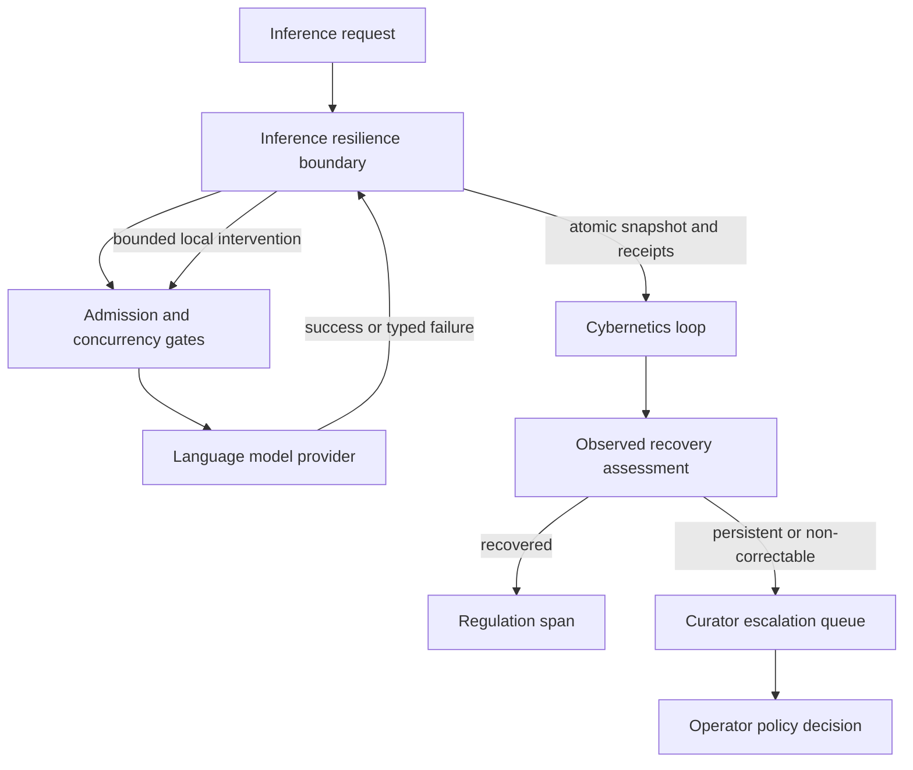

# Inference Regulation Loop Completion — Refactor Architecture Plan

## 1. Purpose and authority

This is the reviewable output of the `refactor-architecture`, `metacognition`, and `pragmatic-cybernetics` processes. It is a **plan, not an implementation record**. Implementation requires separate operator approval.

### Functional target

Inference disturbances produce real, bounded corrective behavior and an observable return path. Conditions the system cannot safely correct are escalated with evidence. The operator no longer sees “recommended but not wired,” false-success, or repeated critical alerts for healthy utilization.

There is no backward-compatibility requirement. Misleading types, settings, tests, and documentation should be removed rather than preserved behind adapters.

### Acceptance criteria

1. Every supported inference disturbance traces through sense → decide → act → observe → assess using concrete code paths.
2. Every disturbance has a wired response or a bounded escalation policy.
3. Action records distinguish proposal, execution, observation, and operator decision; none implies causal effectiveness without evidence.
4. Related dead surface and contradictory contracts are deleted, and behavior-level tests pin the resulting loop.

## 2. Recovered specification and current state

The current design is internally contradictory:

- `kask/crates/hkask-regulation/src/set_points.rs:51-67` advertises `Off`, direct `Autonomous` throttling, and `CuratorMediated` timeout fallback.
- `kask/crates/hkask-regulation/src/cybernetics_loop/cycle.rs:543-629` explicitly converts every computed non-notification action into a critical advisory because the central loop is “not an actuator.”
- `kask/crates/hkask-regulation/src/regulation_policy.rs:325-343` maps unavailable inference to `Throttle` and unavailable models to `Calibrate`, but neither effect exists.
- `kask/crates/kask_bridge/src/inference_chat.rs:329-480` owns the actual admission and concurrency semaphores, deadlines, and health counters. It exposes observation but no resilience state or control outcome.
- `kask/mcp-servers/hkask-mcp-curator/src/hkask_mcp_curator.rs:420-485` can record that an operator acted on advice and later review observations, but it does not execute the advised action.

History explains the split but does not close it. Commit `72a37d9507` introduced throttle modes already claiming direct behavior. Commit `b2f2cf99eb` made all non-native actions visible as advisories to preserve sovereignty. The latter improved failure visibility but formalized an open action path.

The governing dependency invariant remains `kask/docs/architecture/zed-host-architecture-plan.md` §13.1: hKask crates do not depend on Zed; `kask_bridge` implements Zed-facing adapters.

## 3. Cybernetic diagnosis

| Property | Current state | Evidence-based diagnosis |
|---|---|---|
| Polarity | Balancing intent only | `Throttle` is intended to counter pressure, but no state changes. |
| Delay | Excessive | Advice may wait indefinitely; no bounded corrective response occurs. |
| Gain | Zero for inference correction | `act` creates an alert, not an inference effect. |
| Closure | Open | No executed intervention identity returns to assessment. |
| Fidelity | Low | `InferenceAvailable` collapses full utilization and timeout storms into one binary condition. |

Ashby variety assessment: at least six disturbance classes are represented or observable—admission overload, sustained utilization, timeout storm, transient provider rejection, non-recoverable configuration/auth/model failure, and per-agent cap depletion. The central regulator has one effective response: human escalation. Labels such as `Throttle`, `CircuitBreak`, and `Calibrate` do not add effective variety when they share the same alert implementation.

VSM assessment: inference dispatch is S1 operations; local anti-oscillation is S2; central regulation is S3; prediction/metacognition is S4; sovereignty and operator authority are S5. The algedonic S1→S5 channel works, but S1 lacks a local resilience mechanism and S3 currently mistakes recommendations for control. The subsystem is degraded, not wholly unviable, because escalation remains available.

## 4. Selected architecture

### Decision

Do **not** add a generic central `ActionDispatcher`. It would switch on `ActionType`, `LoopId`, and loosely related payload variants, becoming a shallow router whose complexity reappears in every target subsystem.

Instead:

1. Put fast, reversible inference resilience beside the enforcement primitives in `kask_bridge`.
2. Replace the getter-style health seam with one typed, atomic observation contract carrying state transitions and intervention receipts.
3. Let `hkask-regulation` assess those receipts, measure observed recovery, and escalate prolonged or non-correctable conditions.
4. Keep spending, credential, and model-selection changes human-authorized. Automatic behavior is limited to non-spending safety controls.
5. Remove central action labels that have no handler.



### Deep module

Create an inference-resilience module at the dispatch boundary, conceptually exposing:

```rust
pub trait InferenceResilienceSource {
    async fn observe_since(
        &self,
        cursor: InterventionCursor,
    ) -> Result<InferenceObservation, InferenceObservationError>;
}

pub struct InferenceObservation {
    pub snapshot: InferenceSnapshot,
    pub interventions: Vec<InferenceInterventionReceipt>,
    pub next_cursor: InterventionCursor,
}
```

The exact names are implementation decisions, but the contract must provide one coherent snapshot rather than three independent async getters. It hides semaphore mechanics, circuit state, provider-failure classification, cooldown/hysteresis, event retention, and cursor reconciliation.

`LanguageModelInferencePort` remains the request-facing adapter. The resilience module owns the shared runtime state used by cloned ports. `CyberneticsLoop` consumes the source through the existing dependency direction; `crates/zed/src/main.rs` remains the composition root.

## 5. Disturbance-response contract

| Disturbance | Classification | Required response | Return path |
|---|---|---|---|
| Full concurrency with successful progress | Healthy utilization | No alert and no throttle | Snapshot reports utilization and completions |
| Admission capacity exhausted | Demand exceeds bounded queue | Existing fail-fast `InferenceError::Overloaded`; count rejection | Later admission/rejection ratio |
| Deadline timeout storm | Transient operational failure | Open circuit; reject new work with `InferenceError::CircuitOpen`; enter half-open after bounded cooldown | Circuit transition receipt and successful/failed probe |
| Retryable provider rejection, including rate limit/outage | Transient provider failure | Open circuit using structured category and provider retry delay when present | Provider outcome and circuit transition |
| Missing model, missing/invalid credential, permanent model error | Non-correctable locally | Deduplicated escalation with typed evidence; no retry or synthetic throttle | Operator resolution and fresh configuration observation |
| Per-agent call-cap depletion | Local governance condition | Existing per-agent cap enforcement and targeted notice | Cap status for that agent; never global inference throttle |
| Repeated circuit reopening or no recovery | Local controller exhausted | Bounded escalation after configured attempts/window | Pending escalation reconciles only against fresh recovery evidence |

The first proving slice is timeout-storm → circuit-open → half-open probe → recovered or escalated. Adaptive concurrency is **not** in the first slice. It requires queue-wait and completion-throughput evidence; utilization alone cannot justify reducing capacity.

## 6. Semantic and structural cleanup

Ranked by leverage:

1. **Delete `InferenceThrottleMode` and its fictional branches** (`Strong`). Per-agent caps already enforce local budgets; one agent’s worst remaining ratio must not globally throttle inference.
2. **Replace `InferenceHealthSource`’s getter trio** (`Strong`). Atomic snapshots prevent mixed-time readings and carry typed disturbance/state evidence.
3. **Remove unsupported central `ActionType` variants and policy mappings** (`Strong`). `OverrideEnergyBudget` and `ReplenishBudget` belong to `CuratorDirective`; `Throttle`, `CircuitBreak`, `Calibrate`, `AdjustEnergyBudget`, and `Prune` remain only if a concrete handler is introduced in the same slice.
4. **Remove or redesign action substitution** (`Strong`). Computed advisories never enter impact verification, so `try_substitute`, substitution ladders, and associated stagnation counts cannot learn about those actions.
5. **Make `SensorBus` replace sensors by metric/source identity** (`Strong`). `set_inference_health_source` currently appends on each model rewire, allowing stale and duplicate deviations. Apply the same invariant to other late-wired sources.
6. **Replace misleading loop-quality metrics** (`Worth exploring`). `gain = actions/deviations` can exceed its documented 0–1 range and counts proposals rather than effects. Report decision coverage, execution coverage, verification coverage, and observed progress separately.
7. **Rename remaining records by truth state** (`Worth exploring`). Use “intent” or “disposition” before execution, “receipt” after execution, and “observed recovery” after measurement.

## 7. Implementation program

### Slice 1 — Truthful sensing and replaceable wiring

- Introduce typed inference snapshots and disturbance classifications.
- Replace binary saturation/timeout conflation.
- Make late sensor wiring replace existing sources rather than append.
- Pin model rewire with a test proving one inference observation and one deviation per tick.

### Slice 2 — Local timeout-storm resilience

- Extract resilience state from `kask_bridge/src/inference_chat.rs` into a deep module.
- Add closed/open/half-open enforcement using the existing `CircuitOpen` error variant.
- Preserve structured provider rejection categories internally.
- Emit durable intervention receipts with unique identity and before-state.

### Slice 3 — Assessment and bounded escalation

- Feed receipts and fresh observations into `CyberneticsLoop`.
- Assess only after the intervention’s observation window; do not verify in the same tick.
- Record observed recovery without claiming causation.
- Escalate missing control sources, failed interventions, repeated reopening, and permanent failures with typed evidence.

### Slice 4 — Delete the fictional action surface

- Remove `InferenceThrottleMode`, `BudgetOption`, unsupported inference mappings, dead substitution configuration, stale coherence checks, and tests/docs that promise unwired behavior.
- Audit every remaining `ActionType` variant: handler in the same domain or deletion/escalation disposition.
- Update regulation reference, explanation, tutorial, settings reference, and `DIVERGENCE.md` for any Zed-side seam change.

### Slice 5 — Metrics and reference-model alignment

- Separate decision, execution, verification, and progress coverage.
- Add Regulation spans for circuit transitions, intervention receipts, assessment, and escalation.
- Register derived ontology rulings for “inference resilience boundary,” “intervention receipt,” and “observed recovery”; current resolver results are only coarse `5w1h_core` anchors.

## 8. Verification gates

Behavioral tests must fail on the current tree and prove:

1. Healthy full utilization with successful completions does not emit `InferenceUnavailable` or a critical alert.
2. A timeout storm opens the circuit; new requests return `CircuitOpen`; a half-open success closes it.
3. A failed half-open sequence escalates once, with typed trigger and intervention identity.
4. Auth/config/model failures escalate without retry or throttle.
5. Rewiring the model replaces the sensor/source and cannot duplicate deviations.
6. Every intervention receipt is assessed against a later fresh observation; unapplied advice remains unassessed.
7. Every remaining policy disposition has exactly one implemented route, checked by a registry-derived coverage test rather than a hardcoded filename list.

Implementation validation then runs focused crate tests, `./script/clippy`, the dependency-direction script, removed-symbol sweeps over code and docs, and `cargo check -p zed` for composition-root/API changes.

## 9. Metacognitive result and refused lazy version

The initial hypothesis was “wire `Throttle` into the existing semaphore.” The disturbance rotation falsified it: full utilization can be healthy, cap depletion is per-agent, and timeout storms require hysteresis and circuit state rather than an ambiguous throttle.

The selected calibration reduced the planning gap by separating six disturbance classes and assigning each a real local response or explicit escalation. Remaining uncertainty is parameter calibration, not architecture; thresholds must be settings with documented defaults and behavior tests, then tuned from observed outcomes.

**Refused lazy version:** add an `ActionDispatcher` that logs success after calling a generic `throttle()` method, immediately re-senses, and marks the action effective. That would preserve semantic ambiguity, create false causal attribution, and leave stale sensor duplication intact.

## 10. Reference models

- W. Ross Ashby, *An Introduction to Cybernetics* (1956): requisite variety and balancing regulation.
- Conant and Ashby, “Every Good Regulator of a System Must Be a Model of That System” (1970): disturbance-specific modeling.
- Stafford Beer, *Brain of the Firm* (1972): VSM placement of local operations, coordination, control, intelligence, and policy.
- Michael Nygard, *Release It!*: circuit breaker and bulkhead resilience patterns.
- Mike Rother, *Toyota Kata* (2010): current condition, target condition, prediction, experiment, and measured learning.
