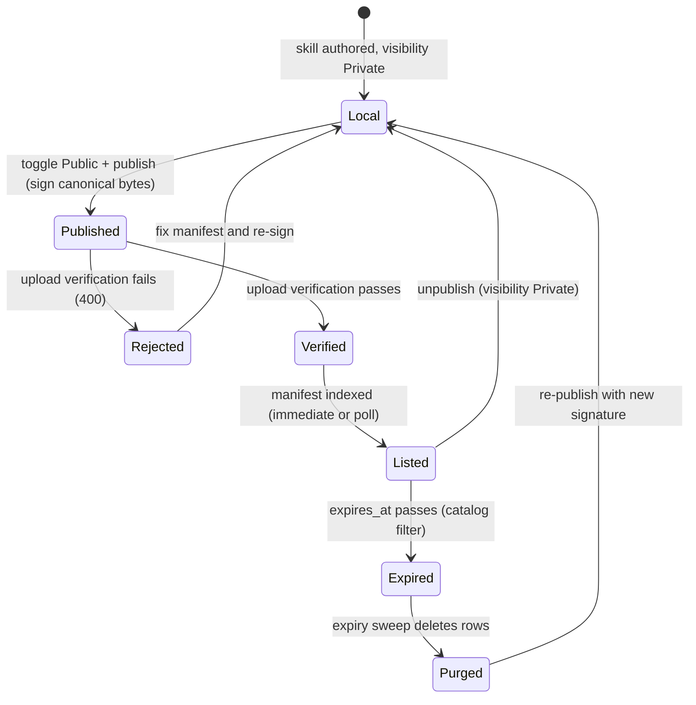

# Kask Skill Signing & Trust Model

Extends the skill marketplace ("Kask Extensions Panel & Skill Sharing" plan,
Phases 1–5 complete) with **package signing, a publisher-key trust model, and
expiration set at signing time**. Goals: (1) prevent the catalog from
accumulating stale skills, (2) give installs a cryptographic authenticity check
beyond SHA256-integrity, (3) bound the damage of a leaked or abandoned
publisher key.

**No backward-compatibility requirements.** The marketplace is rebuilt around
signed packages: the signature fields are required on the manifest, unsigned
artifacts are rejected outright, and skills published before this change are
not listed. There is no grandfathering or migration path.

## What exists today (substrate, verified 2026-08-02)

- **Client publish pipeline** — `crates/kask_extensions_ui/src/publish.rs`:
  `package_skill_for_publish` tars+gzips the skill dir, computes `tarball_sha256`,
  builds `KaskSkillManifest`; `publish_skill` uploads `archive.tar.gz` +
  `manifest.json` to the collab server's `/api/kask-skills/upload` (S3 proxy).
  Triggered by the `SkillVisibilityQueue` drain in
  `crates/settings_ui/src/pages/skills_visibility.rs`.
- **Collab server** — `crates/collab/src/api/kask_skills.rs`: upload (S3 proxy +
  immediate index), download (presigned redirect), vote, delete, and a periodic
  poll (`fetch_kask_skills_from_blob_store_periodically`, 5-min interval) that
  lists S3 `kask-skills/` objects and upserts manifests into Postgres.
- **Catalog schema** — `crates/collab/src/db/tables/{kask_skill,kask_skill_version,kask_skill_vote}.rs`
  + `db/queries/kask_skills.rs` (idempotent boot-time `ensure_kask_skill_tables`).
  Version row: `published_at`, `dependencies`, `tarball_sha256`, `download_count`.
- **Client install pipeline** — `publish.rs::install_skill`: downloads the
  tarball, verifies `tarball_sha256` from the catalog metadata, extracts into
  `~/.agents/skills/_marketplace/{source_user}/{skill_name}/`.
- **Signing primitives (landed, currently dead code)** —
  `kask/crates/hkask-keystore/src/signing.rs`: `generate_signing_keypair`,
  `derive_public_key`, `sign`, `verify`, `store_signing_key`/`load_signing_key`/
  `delete_signing_key` (keychain under `signing-keys/{publisher}`), and
  `KEY_MAX_AGE_DAYS = 120`. Types `Ed25519PublicKey`/`Ed25519Signature` in
  `kask/crates/hkask-types/src/crypto.rs`. **No production callers** — grep for
  `generate_signing_keypair|store_signing_key|verify(` in `crates/` hits only the
  keystore itself.
- **Upstream zed reuse** — `ed25519-dalek = "2"` is already a workspace dep
  (root `Cargo.toml:877`). The collab extension marketplace (`crates/collab/src/api/extensions.rs`)
  is the architectural model (S3 as source of truth, Postgres cache, presigned
  downloads) that kask already mirrors. Zed's trust model
  (`crates/project/src/trusted_worktrees.rs`) is the precedent: **trust is
  explicit, persisted, and deny-by-default** — we apply the same posture to
  skill signatures.

## Design decisions (pinned)

### D1. Sign the manifest, bind the tarball by hash

The publisher signs the **canonical manifest JSON bytes** (the exact
`manifest.json` body uploaded to S3). The manifest already carries
`tarball_sha256`, so the signature transitively binds the tarball. The signature
fields — `public_key`, `signature`, `expires_at` — travel **inside** the
manifest, keeping S3 the single source of truth: the poll and the client can
verify from the manifest alone, no out-of-band key distribution.

### D2. Expiration is set at signing

- The publisher writes an explicit `expires_at` (RFC 3339) into the manifest
  **at signing time**. The signature commits to it — tampering with `expires_at`
  invalidates the signature.
- The server enforces the window `now < expires_at <= now + KEY_MAX_AGE_DAYS`
  (120 days), evaluated against the **server's clock** at verification time.
  Uploads outside the window are rejected; polled manifests outside the window
  are skipped with a warn.
- **No rolling window, no server-side `first_seen_at`, no implicit extension.**
  Each signature is a standalone commitment with its own deadline.
  Re-publishing creates a new signature with a new `expires_at`; the old
  signature's deadline is irrelevant once superseded.
- Expired manifests are filtered from the catalog and purged by the sweep.
  Publisher keys have **no server-side lifetime** — only signatures do.

Why not rolling (expiry = last-sign + 120d)? A rolling window keeps an
actively-publishing publisher's key alive forever — the "keys expire" property
silently degrades to "unused keys expire." Set-at-signing makes the deadline
explicit, signed, tamper-proof, and lets a publisher choose a shorter lifetime
for a given release (up to the cap).

### D3. Server is the trust anchor; client verifies against the server-verified key

- **Server** verifies the manifest signature (Ed25519 over the canonical bytes,
  against the embedded `public_key`) and the `expires_at` window at two points:
  (a) on upload before indexing, and (b) on the periodic poll before upserting.
  Unverifiable or out-of-window manifests are rejected (upload → 400 with
  reason) or skipped with a `log::warn!` (poll).
- **Client** verifies at install: signature over the canonical bytes against
  the `public_key` returned by the catalog, plus a local `expires_at > now`
  check. This is authenticity (the publisher's key signed it), layered on the
  existing SHA256 integrity check.
- The catalog returns the key from the **verified manifest** (server-indexed),
  not from the tarball — the client trusts the server's key, not a key that
  could have been swapped into an unverified artifact.

### D4. Reuse existing signing; one canonical definition

- **Client** uses `hkask-keystore::signing` (keygen, sign, verify, keychain
  store/load/delete — all already implemented; `KEY_MAX_AGE_DAYS` is the cap the
  client defaults `expires_at` to). No new crypto code.
- **Server** uses `ed25519-dalek` directly (already a workspace dep) via a thin
  verify helper in `kask_skills.rs`.
- `KaskSkillManifest::canonical_signing_bytes()` lives in **`cloud_api_types`**
  — the shared dependency of both sides (verified: `kask_extensions_ui/Cargo.toml`
  and `collab/Cargo.toml` both depend on it). One definition of the signed
  payload, zero drift between client serialization and server re-serialization.

### D5. Deny-by-default, no backward compatibility

- The signature fields (`public_key`, `signature`, `expires_at`) are
  **required** on the manifest. A manifest missing them fails to deserialize —
  no `#[serde(default)]`, no `Option`.
- Uploads that are missing fields, have an invalid signature, are
  expired-at-signing, or exceed the cap are **rejected with a 400 and a
  reason** (fail closed — a missing signature must not silently publish).
- The periodic poll **skips** unverifiable/out-of-window manifests and
  `log::warn!`s with the S3 key, the failure reason, and remediation — the
  operator can distinguish "not signed" from "signed but broken."
- **No grandfathering**: skills published before this change are not listed.
  The catalog starts from signed artifacts only.

## Architecture

```mermaid
flowchart TD
    subgraph Client[zed-kask client]
        Publish[package_skill_for_publish]
        Keychain[(OS keychain - signing-keys/source_user)]
        Sign[sign canonical bytes + set expires_at]
        Install[install_skill]
        VerifyClient[verify signature vs catalog key + expires_at]
    end

    subgraph Server[collab server]
        Upload[/POST /api/kask-skills/upload/]
        Poll[periodic S3 poll]
        VerifyServer[verify signature + expires_at window]
        DB[(Postgres - kask_skill_versions + sig columns)]
        Catalog[/GET /api/kask-skills - filter expires_at > now/]
        Sweep[expiry sweep - purge expired]
    end

    subgraph S3[(S3 blob store)]
        Obj[kask-skills/.../manifest.json + archive.tar.gz]
    end

    Publish -->|load-or-generate key| Keychain
    Publish --> Sign
    Sign --> Upload
    Upload -->|proxy| S3
    Upload --> VerifyServer
    VerifyServer -->|reject 400 + reason| Upload
    VerifyServer -->|index| DB
    Poll -->|list + fetch manifests| S3
    Poll --> VerifyServer
    VerifyServer -->|upsert verified| DB
    VerifyServer -->|warn + skip| Poll
    Catalog --> DB
    Sweep --> DB
    Install -->|download + manifest| S3
    Install --> VerifyClient
    Catalog -->|public_key + signature + expires_at| VerifyClient
    VerifyClient -->|extract| Install
```

### Skill lifecycle (reference)

A skill moves through the trust model as a state machine. `expires_at` is set
at signing time (D2); verification happens at upload (fail closed, 400) and on
the poll (skip + warn); the catalog filter is the enforcement point and the
sweep is the cleanup. Re-publishing (a new signature) restarts the clock from
the new `expires_at` — the only way to relist an expired skill.



## Phased plan

### Phase 1 — Manifest fields + client signing (client-only) ✅ COMPLETE

**Tasks:**
1. Add **required** fields to `KaskSkillManifest` (`crates/cloud_api_types/src/kask_skill.rs`):
   `public_key: String`, `signature: String`, `expires_at: String`. A manifest
   without them fails to deserialize → rejected (D5). Add
   `canonical_signing_bytes()` on the manifest: `serde_json::to_string` of the
   manifest with the `signature` field cleared (canonical form: all fields
   except the signature itself, including `public_key` and `expires_at` — pin
   this ordering in a unit test).
2. In `package_skill_for_publish` (`crates/kask_extensions_ui/src/publish.rs`):
   - Load-or-generate the publisher keypair: `hkask_keystore::signing::load_signing_key(source_user)`
     or `generate_signing_keypair` + `store_signing_key(source_user, &key)`.
   - Build the manifest with `public_key = derive_public_key(&key).to_string()`
     and `expires_at = now + KEY_MAX_AGE_DAYS` (the cap; the server clamps, the
     client defaults to the cap).
   - Compute `signature = sign(canonical_signing_bytes(), &key).to_string()`.
3. Add `hkask-keystore` as a dependency of `kask_extensions_ui` (D4).

**Acceptance:** `publish_skill` uploads a manifest whose `signature` verifies
against its `public_key` over the canonical bytes and whose `expires_at` is
`now + 120d`. No unsigned publish path exists.

**Verification:** new unit test in `publish.rs`: sign → `verify` round-trip over
the canonical bytes; tampered manifest bytes fail; the canonical form excludes
the `signature` field but includes `expires_at`.

### Phase 2 — Server verification + schema ✅ COMPLETE

**Tasks:**
1. Add required columns to `kask_skill_versions`
   (`crates/collab/src/db/tables/kask_skill_version.rs` +
   `db/queries/kask_skills.rs` table statements): `public_key`, `signature`,
   `expires_at` (text). No new table — expiry is self-contained in the version
   row (D2; the `kask_publisher_keys` table was considered and deleted: no
   consumer once `first_seen_at` is gone).
2. Verify helper in `kask_skills.rs` (server side, `ed25519-dalek` directly —
   D4): `verify_manifest_signature(&manifest) -> Result<(), ManifestVerificationError>`
   with variants `MissingFields | InvalidSignature | InvalidPublicKey |
   ExpiredAtSigning | OverCap`. Re-serialize via the shared
   `canonical_signing_bytes()`; reject `ExpiredAtSigning` when `expires_at <= now`
   and `OverCap` when `expires_at > now + KEY_MAX_AGE_DAYS` (server clock).
3. `upload_kask_skill`: after parsing `manifest.json`, reject with 400 and the
   error variant's reason on any failure (fail closed, D5).
4. `fetch_kask_skill_manifest` (poll path): skip + `log::warn!` (S3 key,
   failure reason, remediation) when verification fails; only upsert verified
   manifests.

**Acceptance:** unsigned upload → 400; tampered manifest → 400 (upload) / skip +
warn (poll); `expires_at` in the past → 400 `ExpiredAtSigning`; `expires_at`
beyond cap → 400 `OverCap`.

**Verification:** `cargo check -p collab`; unit tests for
`verify_manifest_signature` (valid, tampered, missing fields, expired, over-cap);
integration test on the upload route (unsigned rejected, valid signed accepted).

### Phase 3 — Expiry enforcement (catalog + sweep) ✅ COMPLETE

**Tasks:**
1. Catalog query (`get_kask_skills_where` / `metadata_from_skill_and_version`):
   list a version only if `expires_at > now` (compare against the version row's
   `expires_at` column — no join needed, D2).
2. Sweep pass in the periodic poll (or a new timer): delete version rows whose
   `expires_at <= now`, plus now-orphaned `kask_skill` rows. Log the purged
   count with `log::warn!` — a signal, not silence (`.rules` "signal, not
   silence" trap).
3. Client-side: installed skills that expire stop receiving updates (no
   auto-uninstall — matches the plan's "updates are notify-only" posture).

**Acceptance:** a skill whose `expires_at` has passed is absent from
`GET /api/kask-skills` and purged from Postgres; re-publishing with a new
signature (new `expires_at`) relists it.

**Verification:** `cargo check -p collab`; query test: expired version absent,
fresh version present; sweep test: purge removes expired versions + orphaned
skills.

### Phase 4 — Client install verification ✅ COMPLETE

**Tasks:**
1. `KaskSkillMetadata` already flattens the manifest (`cloud_api_types/src/kask_skill.rs`)
   — the catalog response carries `public_key`, `signature`, `expires_at`
   directly. In `install_skill` (`publish.rs`), reconstruct the canonical bytes
   from the catalog metadata (build the manifest from the flattened fields,
   call `canonical_signing_bytes()`), then verify `signature` against the
   catalog's `public_key` and check `expires_at > now` **before** extracting.
   Reject the install on failure (fail closed, `.rules` "advertised invariants
   need enforcement points"). **No manifest download** — the metadata already
   has every field.
2. Keep the existing SHA256 check (integrity of the tarball bytes); the
   signature check adds authenticity of the manifest (and transitively the
   tarball via the embedded hash, D1).

**Acceptance:** installing a skill whose manifest signature does not verify, or
whose `expires_at` has passed, fails with a clear error naming the skill and
the mismatch.

**Verification:** `cargo check -p kask_extensions_ui`; unit test: signed
manifest verifies, tampered manifest rejects, expired manifest rejects.

### Phase 5 — Tests pinning deviations + docs ✅ COMPLETE

**Tasks:**
1. Pin the new deviations per the `.rules` "tests must pin deliberate
   zed-kask deviations from upstream" trap:
   - Unsigned/expired/over-cap uploads are rejected (upstream extension store
     accepts any manifest; kask requires a valid signature + in-window
     `expires_at`).
   - Expiration is set at signing and capped by the server clock (upstream
     extension marketplace has no expiry).
   - The canonical-byte rule (`signature` excluded, `expires_at` included) is
     stable.
2. Update `DIVERGENCE.md` (extend the D1 marketplace row or add a new D-seam
   row), `kask/docs/README.md` plans table, and the keystore README (signing
   section).
3. Suggested `.rules` addition for the PR description: "Kask skill manifests
   must be signed with an in-window `expires_at`; unsigned or expired uploads
   are rejected at the collab server" + "canonical manifest bytes exclude the
   `signature` field."

**Acceptance:** repo grep shows no production path publishes an unsigned
manifest; docs reference the signing flow.

## Risks & mitigations

| Risk | Impact | Mitigation |
|------|--------|-----------|
| Canonical-byte drift between client and server re-serialization | Signature verification fails on valid publishes | Single `canonical_signing_bytes()` in `cloud_api_types`, consumed by both sides; pinned ordering test (D4) |
| Client clock skew sets `expires_at` outside the window | Valid publish rejected / over-long expiry requested | Server evaluates the window against its own clock at verification; rejects `OverCap` / `ExpiredAtSigning` (D2) |
| Keychain access fails headless / CI | Publish blocked | `load_signing_key` returns `None` → generate + store; store failure logs warn with remediation (existing keystore pattern) |
| Key loss (keychain cleared) | Publisher cannot re-sign with the same key | Documented operator remediation: generate a new key and re-publish — set-at-signing makes this self-healing (new signature, new `expires_at`) |
| Existing published skills (pre-signing) | Catalog empties on rollout | Accepted: no backward-compatibility requirement; the catalog starts from signed artifacts only (D5) |

## Open questions

1. **Re-sign UX**: "expires in N days" / "renew" affordance in the extensions
   panel? v1: the drain re-publish path suffices (re-publish = new signature =
   new `expires_at`). v2: panel badge.
2. **Default lifetime**: the client defaults `expires_at` to the 120-day cap.
   Should shorter defaults (e.g. 30 days) be offered for publishers who want a
   tighter window? v1: cap default; no UI.
3. **Key rotation**: rotating to a new key on re-publish is implicit (new key,
   new signature). A first-class "manage signing keys" surface is deferred to v2.
