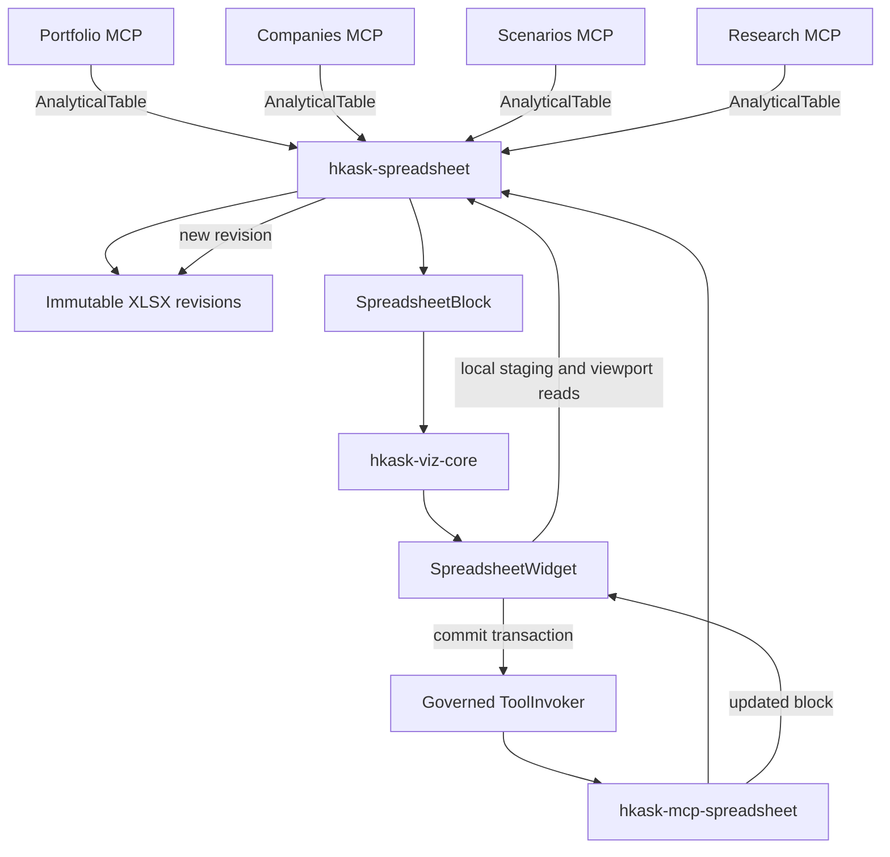

# LogiSheets Spreadsheet Capability — Refactor Architecture Plan

## 1. Purpose and status

This document is the reviewable output of the `refactor-architecture` process for introducing a shared spreadsheet capability into hKask.

It is a **plan, not an implementation record**. No implementation is authorized by this document. The plan becomes an implementation program only after explicit operator approval.

### Functional target

Analytical MCP servers can present typed row-and-column results through one native spreadsheet surface. Where useful, users can edit cells, insert formulas, undo and redo local changes, and save a derived workbook without those edits silently changing authoritative portfolio, company, scenario, research, or other domain state.

### Initial scope

The first proving slice is `portfolio_daily_returns`. Companies, scenarios, research, and other analytical producers follow through one-domain-at-a-time migration after the shared capability passes its admission and behavior gates.

## 2. Ratified distinctions and boundaries

The plan uses the following distinctions:

- **AnalyticalTable** — typed columns and rows produced by an analytical operation. It contains no GPUI or LogiSheets implementation types.
- **SpreadsheetArtifact** — a portable, user-visible workbook revision produced for inspection or editing.
- **WhatIfWorkbook** — a derived SpreadsheetArtifact whose edits do not mutate its source domain state.
- **SpreadsheetBlock** — a bounded, server-authored transport description used to render a spreadsheet inline. It carries opaque artifact identity and an initial viewport, never complete workbook bytes.
- **WorkbookService** — the deep LogiSheets-backed module that validates analytical tables, creates workbooks, extracts viewports, applies edits, recalculates formulas, and publishes immutable revisions.
- **SpreadsheetWidget** — the native GPUI adapter that renders a SpreadsheetBlock and stages user interaction.

The ontology resolver currently places these terms at the coarse `5w1h_core` rung. Before implementation names become public contracts, derived ontology concepts should be registered for the meanings above.

### Authoritative-state boundary

Spreadsheet edits and formulas modify a derived WhatIfWorkbook only. They do not update a portfolio ledger, company-data cache, scenario forecast journal, research record, or other authoritative domain store.

Applying workbook changes back to a domain is outside this plan. A future capability would require an explicit sequence:

1. Propose domain changes.
2. Show a typed diff.
3. Ask for confirmation.
4. Invoke the authoritative domain mutation tool.

## 3. Codebase ground

The plan is constrained by the following current architecture:

- `kask/docs/architecture/zed-host-architecture-plan.md` §13.1 requires hKask crates to remain free of Zed dependencies. Zed-side adapters may depend on hKask crates; the reverse dependency is prohibited.
- `kask/docs/architecture/standardized-artifact-storage.md` requires user-facing files to live beneath the visible `~/Documents/zk-data/` artifacts tree and to resolve through `hkask_types::agent_paths`.
- `crates/hkask-viz-core/src/hkask_viz_core.rs` composes all inline native widgets behind the existing D18 fenced-block renderer seam.
- `crates/hkask-tool-invoker/src/hkask_tool_invoker.rs` is the governed widget-to-MCP mutation path and distinguishes `NotWired`, `Unavailable`, `Interrupted`, and `Failed` outcomes.
- Analytical MCP servers are separate leaf processes under `kask/mcp-servers/`.
- `kask/mcp-servers/hkask-mcp-portfolio/src/server.rs::portfolio_daily_returns` already returns ordered rows containing `date`, `market_value`, `cash`, `total`, and `daily_return` but has no generic table renderer.
- Existing portfolio, scenario, graph, kanban, media, and swarm widgets provide specialized experiences and remain first-class.

## 4. Selected architecture

Build three layers:

1. `kask/crates/hkask-spreadsheet` — Zed-free spreadsheet contracts and LogiSheets-backed behavior.
2. `kask/mcp-servers/hkask-mcp-spreadsheet` — central MCP owner of persisted spreadsheet mutations and operation reconciliation.
3. `crates/hkask-spreadsheet-widget` — native GPUI presentation and interaction adapter.



### Why a central spreadsheet MCP server

Registering generic mutation tools independently in every analytical server would duplicate lifecycle behavior and risk globally colliding tool names. A central server provides one mutation owner and one reconciliation protocol:

- Analytical servers remain producers of domain data.
- `hkask-spreadsheet` owns workbook construction and artifact publication.
- `hkask-mcp-spreadsheet` owns persisted spreadsheet edits.
- The widget always dispatches persisted mutations to the same server.
- Spreadsheet origin metadata still identifies the analytical server and tool that produced the source table.

The new server uses `Some(&[])` for both credential and configuration allowlists.

## 5. Deep module design

### 5.1 `hkask-spreadsheet`

The core crate must not depend on GPUI, Zed, RMCP, or any analytical domain crate. It wraps `logisheets-rs` so callers do not learn its controller, workbook, transaction, or rendering internals.

Conceptual public surface:

```rust
pub struct AnalyticalTable;
pub struct SpreadsheetArtifactRef;
pub struct SpreadsheetBlock;
pub struct SpreadsheetViewport;
pub struct EditTransaction;
pub struct WorkbookDocument;
pub struct WorkbookService;
pub enum SpreadsheetAccess;
pub enum SpreadsheetError;

impl WorkbookService {
    pub fn publish(
        &self,
        origin: ArtifactOrigin,
        table: AnalyticalTable,
        options: PublishOptions,
    ) -> Result<SpreadsheetPublication, SpreadsheetError>;

    pub fn open(
        &self,
        artifact: &SpreadsheetArtifactRef,
    ) -> Result<WorkbookDocument, SpreadsheetError>;

    pub fn apply(
        &self,
        request: ApplyEditsRequest,
    ) -> Result<SpreadsheetPublication, SpreadsheetError>;
}

impl WorkbookDocument {
    pub fn viewport(
        &self,
        request: ViewportRequest,
    ) -> Result<SpreadsheetViewport, SpreadsheetError>;

    pub fn stage(
        &mut self,
        edits: EditTransaction,
    ) -> Result<(), SpreadsheetError>;

    pub fn undo(&mut self) -> Result<(), SpreadsheetError>;
    pub fn redo(&mut self) -> Result<(), SpreadsheetError>;
}
```

These signatures describe responsibilities, not final API names.

### Hidden complexity

The core hides:

- LogiSheets-specific types and transactions.
- Formula parsing and dependency recalculation.
- XLSX serialization.
- Cell value and formatting conversion.
- Viewport extraction and row/column geometry.
- Artifact containment and path resolution.
- Revision identity and digest calculation.
- Atomic publication.
- Idempotency and conflict detection.
- SpreadsheetBlock and display-hint serialization.
- Per-variant LogiSheets error classification.

Deleting this crate would force the same complexity into every analytical server and the widget. It therefore passes the deletion test and earns its existence.

### 5.2 Provenance contract placement

`BlockProvenance` currently lives beside GPUI-dependent `ToolInvoker` code. MCP-side block construction cannot depend on that crate.

Before spreadsheet publication:

1. Move the serializable provenance value type into `hkask-types`.
2. Keep `ToolInvoker`, `InvokeError`, and GPUI task handling in `hkask-tool-invoker`.
3. Re-export the moved type temporarily only if needed to keep the move surgical.
4. Add serialization and deserialization round-trip tests.

This produces one Zed-free, server-authoritative provenance contract.

## 6. Presentation contract

Analytical callers explicitly choose a presentation mode:

| Mode | User experience | Persistence |
|---|---|---|
| `DataOnly` | Existing JSON for agent reasoning | None |
| `InlineTable` | Native bounded sortable/scrollable table | None |
| `WorkbookWhatIf` | Editable workbook with formulas and undo/redo | Immutable XLSX revisions |

There is no hidden row-count threshold that silently changes modes. If an inline table exceeds its bounded transport limit, publication returns a typed `TooLargeForInline` error. The caller may then explicitly request `WorkbookWhatIf`.

### SpreadsheetBlock constraints

A SpreadsheetBlock carries:

- `viz: "spreadsheet"`.
- Schema version.
- Title and active sheet.
- Access mode.
- Opaque artifact and revision IDs.
- Content digest.
- Bounded initial viewport.
- Analytical origin.
- Server-authored mutation endpoint.

It must not carry:

- Absolute filesystem paths.
- Complete workbook bytes.
- Unbounded row arrays.
- Model-authored mutation authority.

The core resolves opaque identities beneath the canonical spreadsheet artifact root and rejects path escape, unknown identity, digest mismatch, or incomplete provenance.

## 7. Artifact lifecycle

Spreadsheet artifacts are owned by the spreadsheet capability and live beneath:

```text
~/Documents/zk-data/spreadsheet-mcp/workbooks/
```

Each saved state is an immutable XLSX revision. Applying edits creates a new revision and never overwrites the base.

Each mutation carries:

- Base artifact and revision IDs.
- Base content digest.
- Typed cell edits.
- Idempotency key.
- Expected access mode.

A digest mismatch returns `Conflict`. It never silently overwrites a stale base.

An interrupted mutation is reconciled through `spreadsheet_operation_get`, keyed by the idempotency identity. The widget does not automatically replay an operation whose outcome is unknown.

## 8. Native GPUI widget

Add `crates/hkask-spreadsheet-widget` and register it through `hkask-viz-core` without changing upstream Markdown rendering beyond the existing D18 seam.

### Initial interaction scope

1. Row and column headers.
2. Virtualized viewport rendering.
3. Active-cell and rectangular selection.
4. Arrow, Tab, Enter, Home, End, Page Up, and Page Down navigation.
5. Rectangular clipboard copy and paste.
6. Double-click or Enter to edit.
7. Explicit formula-bar input.
8. Local undo and redo.
9. Save status with visible conflict and interruption states.
10. Multi-sheet tabs.

The widget should paint only visible row/column intersections rather than constructing one GPUI entity per workbook cell. Cell editing uses a focused editor overlay. Workbook loading and recalculation run off the foreground thread; only resulting state updates return to GPUI.

Persisted changes always dispatch through `ToolInvoker`. The widget must visibly distinguish `NotWired`, `Unavailable`, `Interrupted`, and `Failed`.

## 9. Duplication audit

| Operation | Current or likely locations | Classification | Decision |
|---|---|---|---|
| Row data to visual table | Portfolio, companies, scenarios, research | Divergent mappings, identical intent | Parameterize through AnalyticalTable |
| Workbook creation and formula evaluation | Currently absent; would recur across producers | Identical | Centralize before migrations |
| Artifact path, digest, revision, publication | Analogous artifact producers | Identical lifecycle | Centralize in WorkbookService |
| Spreadsheet mutation | Would otherwise recur in every analytical server | Identical | Central spreadsheet MCP server |
| Domain query and calculation | Individual analytical servers | Domain-specific/pass-through | Keep in each domain |
| Portfolio and scenario dashboards | Existing widget crates | Surface-only specialization | Keep; do not replace |
| Native spreadsheet interaction | New shared UI surface | Surface-only | One GPUI widget |

Representative relationships:

```text
kask/mcp-servers/hkask-mcp-portfolio/src/server.rs
    -- publishes-via --> kask/crates/hkask-spreadsheet

kask/mcp-servers/hkask-mcp-companies/src/tools/financial_data.rs
    -- publishes-via --> kask/crates/hkask-spreadsheet

kask/mcp-servers/hkask-mcp-scenarios/src/hkask_mcp_scenarios.rs
    -- publishes-via --> kask/crates/hkask-spreadsheet

kask/mcp-servers/hkask-mcp-research/src/hkask_mcp_research.rs
    -- publishes-via --> kask/crates/hkask-spreadsheet

crates/hkask-spreadsheet-widget
    -- renders --> hkask_spreadsheet::SpreadsheetBlock

crates/hkask-spreadsheet-widget
    -- mutates-through --> crates/hkask-tool-invoker
```

## 10. Strangler migration

### Phase 0 — LogiSheets admission gate

Before production code depends on LogiSheets:

- Pin the tested `logisheets-rs` release.
- Compile it in the Rust 1.97.1 workspace.
- Confirm supported target platforms.
- Check `Send` and threading constraints.
- Measure dependency and build impact.
- Run formula and XLSX round-trip fixtures.
- Test malformed and resource-heavy workbooks.
- Check formula behavior required by the proving slice.
- Confirm output is deterministic enough for revision and digest handling.
- Record MIT attribution.

Stop if generated-workbook round-tripping or required formula recalculation fails.

### Phase 1 — Shared contracts

- Move BlockProvenance into `hkask-types`.
- Add AnalyticalTable, typed values, artifact references, viewports, edit transactions, access modes, and errors.
- Add exact serialization round-trip tests.
- Reject nonrectangular rows, duplicate column identities, invalid coordinates, and oversized inline blocks.

### Phase 2 — LogiSheets-backed core

- Add `kask/crates/hkask-spreadsheet` with `[lib] path = "src/hkask_spreadsheet.rs"`.
- Implement typed-table conversion.
- Implement formula evaluation and viewport extraction.
- Implement contained artifact resolution.
- Implement immutable atomic revision publication.
- Implement digest and idempotency validation.
- Generate server-authoritative display hints.

### Phase 3 — Spreadsheet MCP server

Add `kask/mcp-servers/hkask-mcp-spreadsheet` with the minimal tools:

- `spreadsheet_apply`.
- `spreadsheet_operation_get`.

Register it in the built-in MCP server inventory, settings surface, tool-surface checks, and documentation. Credential and configuration allowlists are both empty and explicit.

### Phase 4 — Native widget

- Add `crates/hkask-spreadsheet-widget`.
- Register it in `hkask-viz-core`.
- Extend the system prompt's display-hint instruction to spreadsheet hints.
- Update D18/D26/D45-related divergence records as required by the actual touched seams.
- Add interaction, layout, and viewport-performance tests.

### Phase 5 — Portfolio proving slice

Extend `portfolio_daily_returns` in `kask/mcp-servers/hkask-mcp-portfolio/src/server.rs` with an explicit presentation request.

Map its existing fields to AnalyticalTable:

- `date`.
- `market_value`.
- `cash`.
- `total`.
- `daily_return`.

Acceptance sequence:

1. Materialize real daily returns from a test ledger.
2. Request `WorkbookWhatIf` presentation.
3. Receive a valid server-authored spreadsheet display hint.
4. Render the workbook through the native widget.
5. Add a cumulative-return formula.
6. Commit through `spreadsheet_apply`.
7. Reopen the returned immutable revision.
8. Verify the calculated value.
9. Verify the base workbook remains unchanged.
10. Verify the portfolio ledger and materialized returns remain unchanged.

### Phase 6 — Analytical expansion

Migrate one domain per commit.

Companies candidates:

- Income statement.
- Balance sheet.
- Cash-flow statement.
- Key metrics.
- Historical prices.
- Screener results.
- DCF projection schedules.

Scenarios candidates:

- Calibration curves.
- Perspective-weight tables.
- Propagation journals.
- Scenario-assessment phases.

Event trees remain in the graph widget.

### Phase 7 — Research and remaining producers

Candidates:

- Web-search evidence tables.
- RSS entry lists.
- Source-comparison matrices.
- Evidence-evaluation matrices.

Research outputs initially use InlineTable. WorkbookWhatIf is enabled only where annotation, scoring, or derived formulas provide a concrete user benefit.

## 11. Verification requirements

### Core behavior

- AnalyticalTable to XLSX to reopen preserves values and supported styles.
- Formula edits recalculate dependent cells.
- Base revision remains unchanged after commit.
- Path traversal and unknown artifact identities are rejected.
- Digest mismatch produces Conflict.
- Repeated idempotency identity returns the same result.
- Oversized inline data returns a visible typed error.
- SpreadsheetBlock round-trips exactly.
- Unsupported formulas surface as spreadsheet errors.

### Widget behavior

- Foreign JSON does not claim the spreadsheet renderer.
- Keyboard movement reaches the intended cell.
- Copy produces rectangular tab/newline data.
- Paste stages the intended transaction.
- Formula editing displays the recalculated result.
- Missing provenance disables Save visibly.
- All ToolInvoker failure states remain distinct.
- Scrolling renders only the visible range.
- Existing graph, kanban, portfolio, scenarios, swarm, and media blocks still dispatch correctly.

### MCP behavior

- Tests construct a fully capable server, not a capability-stripped fixture.
- `spreadsheet_apply` creates a new immutable revision.
- `spreadsheet_operation_get` reconciles an interrupted operation.
- A portfolio workbook edit cannot change the ledger database.
- Artifact paths resolve only through canonical helpers.

### Repository gates

Each slice starts scoped and finishes broad:

```sh
cargo test -p hkask-spreadsheet
cargo test -p hkask-mcp-spreadsheet
cargo test -p hkask-spreadsheet-widget
cargo test -p hkask-mcp-portfolio
./script/clippy
cargo check -p zed
```

Every removal or move ends with a full symbol and documentation sweep. Every commit must leave the shared tree buildable.

## 12. Risks and controls

| Risk | Control |
|---|---|
| LogiSheets API instability | Pin the admitted version; upgrades rerun the compatibility suite |
| Feature claims exceed behavior | Golden workbook fixtures rather than README assertions |
| Artifact proliferation | Create workbooks only for explicit WorkbookWhatIf requests |
| Large model-context payloads | Bounded previews; workbook bytes stay outside chat |
| Resource-heavy formulas or workbooks | File-size, cell-count, edit-count, and evaluation limits |
| Fabricated paths | Opaque IDs resolved beneath a canonical root |
| Stale widget overwrite | Immutable revisions and base digest validation |
| Interrupted mutation | Idempotency identity and operation lookup |
| Spreadsheet edits alter domain truth | What-if-only dependency boundary |
| Generic tables erase specialized UX | Keep all existing specialized widgets |
| Zed divergence grows | Reuse D18 and update DIVERGENCE.md in the same change |

## 13. Refused shortcuts

- No WebView or Svelte embedding.
- No direct LogiSheets dependency in every analytical server or widget.
- No duplicated spreadsheet mutation tools.
- No complete workbook encoded in JSON.
- No model-authored artifact path or mutation authority.
- No automatic write-through into authoritative domain stores.
- No replacement of existing specialized widgets.
- No speculative compatibility shell.
- No implementation before the LogiSheets admission gate passes.

## 14. Planned change boundary

Expected implementation paths:

- `Cargo.toml` and `Cargo.lock`.
- `kask/crates/hkask-types/` for the Zed-free provenance contract.
- New `kask/crates/hkask-spreadsheet/`.
- New `kask/mcp-servers/hkask-mcp-spreadsheet/`.
- New `crates/hkask-spreadsheet-widget/`.
- `crates/hkask-viz-core/` for registry composition.
- `kask/crates/kask_bridge/src/mcp_servers.rs` for built-in server registration.
- `crates/agent/src/templates/system_prompt.hbs` for spreadsheet display hints.
- `kask/mcp-servers/hkask-mcp-portfolio/` for the proving slice.
- `DIVERGENCE.md` and affected architecture/reference documentation.

Explicitly outside the initial implementation boundary:

- Existing portfolio, scenario, graph, kanban, swarm, and media behavior except registry coexistence tests.
- Portfolio ledger semantics.
- Company provider APIs and valuation algorithms.
- Scenario probability algorithms.
- Research retrieval and evidence semantics.
- Upstream Markdown rendering beyond the existing D18 extension point.
- Arbitrary user-supplied workbook import.
- Applying spreadsheet edits back to authoritative domain state.

## 15. Definition of plan completion

This plan is ready for product review when:

1. The functional target and what-if boundary are explicit.
2. The core, MCP, artifact, transport, and GPUI responsibilities are separated.
3. Dependency direction is stated and checkable.
4. The proving slice and later strangler migrations are ordered.
5. Every phase has behavioral acceptance criteria.
6. Risks, stop conditions, and refused shortcuts are visible.
7. The operator can approve, reject, or amend the document without any implementation having begun.
