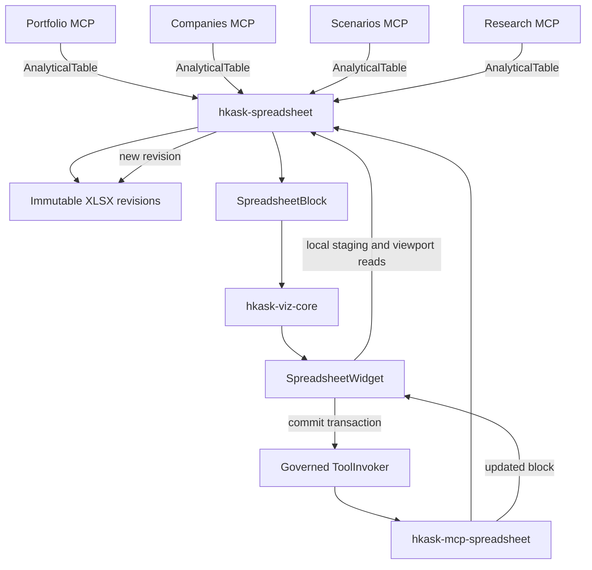

# LogiSheets Spreadsheet Capability — Refactor Architecture Plan

## 1. Purpose and status

This document is the reviewable output of the `refactor-architecture` process for introducing a shared spreadsheet capability into hKask.

It is a **plan, not an implementation record**. No implementation is authorized by this document alone. The plan became an implementation program on 2026-09-18, when the operator chartered goal `f6ae8631-2ed5-4f83-9beb-4ae20603d386` and the Phase 0 admission gate ran (record: §10).

### Functional target

Analytical MCP servers can present typed row-and-column results through one native spreadsheet surface. Where useful, users can edit cells, insert formulas, undo and redo local changes, and save a derived workbook without those edits silently changing authoritative portfolio, company, scenario, research, or other domain state.

### Initial scope

The first portfolio proving slice is investor-oriented portfolio analysis: current characteristics, absolute performance contribution, benchmark-relative performance attribution, and prospective or retrospective composition what-if reports. Daily holdings and returns may support accurate internal calculations, but daily-return monitoring is not a user-facing report or spreadsheet proving slice.

The portfolio panel keeps its specialized report viewer. When the shared spreadsheet capability is implemented, its applicable role is to stage and inspect what-if portfolio-composition changes and their derived report deltas; spreadsheet edits never define the portfolio mathematics or mutate the authoritative ledger. Companies, scenarios, research, and other analytical producers still follow through one-domain-at-a-time migration after the shared capability passes its admission and behavior gates.

## 2. Ratified distinctions and boundaries

The plan uses the following distinctions:

- **AnalyticalTable** — typed columns and rows produced by an analytical operation. It contains no GPUI or LogiSheets implementation types.
- **SpreadsheetArtifact** — a portable, user-visible workbook revision produced for inspection or editing.
- **WhatIfWorkbook** — a derived SpreadsheetArtifact whose edits do not mutate its source domain state.
- **SpreadsheetBlock** — a bounded, server-authored transport description used to render a spreadsheet inline. It carries opaque artifact identity and an initial viewport, never complete workbook bytes.
- **WorkbookService** — the deep LogiSheets-backed module that validates analytical tables, creates workbooks, extracts viewports, applies edits, recalculates formulas, and publishes immutable revisions.
- **SpreadsheetWidget** — the native GPUI adapter that renders a SpreadsheetBlock and stages user interaction.

The ontology resolver currently places these terms at the coarse `5w1h_core` rung. Before implementation names become public contracts, derived ontology concepts should be registered for the meanings above.

### Authoritative-state boundary

Spreadsheet edits and formulas modify a derived WhatIfWorkbook only. They do not update a portfolio ledger, company-data cache, scenario forecast journal, research record, or other authoritative domain store.

Applying workbook changes back to a domain is outside this plan. A future capability would require an explicit sequence:

1. Propose domain changes.
2. Show a typed diff.
3. Ask for confirmation.
4. Invoke the authoritative domain mutation tool.

## 3. Codebase ground

The plan is constrained by the following current architecture:

- `kask/docs/architecture/zed-host-architecture-plan.md` §13.1 requires hKask crates to remain free of Zed dependencies. Zed-side adapters may depend on hKask crates; the reverse dependency is prohibited.
- `kask/docs/architecture/standardized-artifact-storage.md` requires user-facing files to live beneath the visible `~/Documents/zk-data/` artifacts tree and to resolve through `hkask_types::agent_paths`.
- `crates/hkask-viz-core/src/hkask_viz_core.rs` composes all inline native widgets behind the existing D18 fenced-block renderer seam.
- `crates/hkask-tool-invoker/src/hkask_tool_invoker.rs` is the governed widget-to-MCP mutation path and distinguishes `NotWired`, `Unavailable`, `Interrupted`, and `Failed` outcomes.
- Analytical MCP servers are separate leaf processes under `kask/mcp-servers/`.
- `kask/mcp-servers/hkask-mcp-portfolio/src/server.rs::portfolio_daily_returns` already returns ordered rows containing `date`, `market_value`, `cash`, `total`, and `daily_return` but has no generic table renderer.
- Existing portfolio, scenario, graph, kanban, media, and swarm widgets provide specialized experiences and remain first-class.

## 4. Selected architecture

Build three layers:

1. `kask/crates/hkask-spreadsheet` — Zed-free spreadsheet contracts and LogiSheets-backed behavior.
2. `kask/mcp-servers/hkask-mcp-spreadsheet` — central MCP owner of persisted spreadsheet mutations and operation reconciliation.
3. `crates/hkask-spreadsheet-widget` — native GPUI presentation and interaction adapter.



<!-- DIAGRAM_ALIGNMENT
id: DIAG-ARCH-SPREADSHEET-001
verified_date: 2026-09-19
verified_against: kask/crates/hkask-types/src/spreadsheet.rs:110 (AnalyticalTable and SpreadsheetBlock contracts); kask/crates/hkask-spreadsheet/src/service.rs:156 (WorkbookService::publish); kask/crates/hkask-spreadsheet/src/artifact_store.rs (immutable revision publication); crates/hkask-viz-core/src/hkask_viz_core.rs:159-169 (viz-core spreadsheet wiring); crates/hkask-spreadsheet-widget/src/view.rs:23,151 (the widget; shared_tool_invoker import — the governed commit path); crates/hkask-tool-invoker/src/hkask_tool_invoker.rs (Invoker); kask/mcp-servers/hkask-mcp-spreadsheet/src/server.rs (SpreadsheetMcp); kask/mcp-servers/hkask-mcp-portfolio/src/server.rs:95-148 (the portfolio proving-slice producer)
reference_sources: portfolio proving slice live; companies/scenarios/research producers phased per plan §1 (one-domain-at-a-time migration)
status: VERIFIED
-->

### Why a central spreadsheet MCP server

Registering generic mutation tools independently in every analytical server would duplicate lifecycle behavior and risk globally colliding tool names. A central server provides one mutation owner and one reconciliation protocol:

- Analytical servers remain producers of domain data.
- `hkask-spreadsheet` owns workbook construction and artifact publication.
- `hkask-mcp-spreadsheet` owns persisted spreadsheet edits.
- The widget always dispatches persisted mutations to the same server.
- Spreadsheet origin metadata still identifies the analytical server and tool that produced the source table.

The new server uses `Some(&[])` for both credential and configuration allowlists.

## 5. Deep module design

### 5.1 `hkask-spreadsheet`

The core crate must not depend on GPUI, Zed, RMCP, or any analytical domain crate. It wraps `logisheets-rs` so callers do not learn its controller, workbook, transaction, or rendering internals.

Conceptual public surface:

```rust
pub struct AnalyticalTable;
pub struct SpreadsheetArtifactRef;
pub struct SpreadsheetBlock;
pub struct SpreadsheetViewport;
pub struct EditTransaction;
pub struct WorkbookDocument;
pub struct WorkbookService;
pub enum SpreadsheetAccess;
pub enum SpreadsheetError;

impl WorkbookService {
    pub fn publish(
        &self,
        origin: ArtifactOrigin,
        table: AnalyticalTable,
        options: PublishOptions,
    ) -> Result<SpreadsheetPublication, SpreadsheetError>;

    pub fn open(
        &self,
        artifact: &SpreadsheetArtifactRef,
    ) -> Result<WorkbookDocument, SpreadsheetError>;

    pub fn apply(
        &self,
        request: ApplyEditsRequest,
    ) -> Result<SpreadsheetPublication, SpreadsheetError>;
}

impl WorkbookDocument {
    pub fn viewport(
        &self,
        request: ViewportRequest,
    ) -> Result<SpreadsheetViewport, SpreadsheetError>;

    pub fn stage(
        &mut self,
        edits: EditTransaction,
    ) -> Result<(), SpreadsheetError>;

    pub fn undo(&mut self) -> Result<(), SpreadsheetError>;
    pub fn redo(&mut self) -> Result<(), SpreadsheetError>;
}
```

These signatures describe responsibilities, not final API names.

### Hidden complexity

The core hides:

- LogiSheets-specific types and transactions.
- Formula parsing and dependency recalculation.
- XLSX serialization.
- Cell value and formatting conversion.
- Viewport extraction and row/column geometry.
- Artifact containment and path resolution.
- Revision identity and digest calculation.
- Atomic publication.
- Idempotency and conflict detection.
- SpreadsheetBlock and display-hint serialization.
- Per-variant LogiSheets error classification.

Deleting this crate would force the same complexity into every analytical server and the widget. It therefore passes the deletion test and earns its existence.

### 5.2 Provenance contract placement

`BlockProvenance` currently lives beside GPUI-dependent `ToolInvoker` code. MCP-side block construction cannot depend on that crate.

Before spreadsheet publication:

1. Move the serializable provenance value type into `hkask-types`.
2. Keep `ToolInvoker`, `InvokeError`, and GPUI task handling in `hkask-tool-invoker`.
3. Re-export the moved type temporarily only if needed to keep the move surgical.
4. Add serialization and deserialization round-trip tests.

This produces one Zed-free, server-authoritative provenance contract.

## 6. Presentation contract

Analytical callers explicitly choose a presentation mode:

| Mode | User experience | Persistence |
|---|---|---|
| `DataOnly` | Existing JSON for agent reasoning | None |
| `InlineTable` | Native bounded sortable/scrollable table | None |
| `WorkbookWhatIf` | Editable workbook with formulas and undo/redo | Immutable XLSX revisions |

There is no hidden row-count threshold that silently changes modes. If an inline table exceeds its bounded transport limit, publication returns a typed `TooLargeForInline` error. The caller may then explicitly request `WorkbookWhatIf`.

### SpreadsheetBlock constraints

A SpreadsheetBlock carries:

- `viz: "spreadsheet"`.
- Schema version.
- Title and active sheet.
- Access mode.
- Opaque artifact and revision IDs.
- Content digest.
- Bounded initial viewport.
- Analytical origin.
- Server-authored mutation endpoint.

It must not carry:

- Absolute filesystem paths.
- Complete workbook bytes.
- Unbounded row arrays.
- Model-authored mutation authority.

The core resolves opaque identities beneath the canonical spreadsheet artifact root and rejects path escape, unknown identity, digest mismatch, or incomplete provenance.

## 7. Artifact lifecycle

Spreadsheet artifacts are owned by the spreadsheet capability and live beneath:

```text
~/Documents/zk-data/spreadsheet-mcp/workbooks/
```

Each saved state is an immutable XLSX revision. Applying edits creates a new revision and never overwrites the base.

Each mutation carries:

- Base artifact and revision IDs.
- Base content digest.
- Typed cell edits.
- Idempotency key.
- Expected access mode.

A digest mismatch returns `Conflict`. It never silently overwrites a stale base.

An interrupted mutation is reconciled through `spreadsheet_operation_get`, keyed by the idempotency identity. The widget does not automatically replay an operation whose outcome is unknown.

## 8. Native GPUI widget

Add `crates/hkask-spreadsheet-widget` and register it through `hkask-viz-core` without changing upstream Markdown rendering beyond the existing D18 seam.

### Initial interaction scope

1. Row and column headers.
2. Virtualized viewport rendering.
3. Active-cell and rectangular selection.
4. Arrow, Tab, Enter, Home, End, Page Up, and Page Down navigation.
5. Rectangular clipboard copy and paste.
6. Double-click or Enter to edit.
7. Explicit formula-bar input.
8. Local undo and redo.
9. Save status with visible conflict and interruption states.
10. Multi-sheet tabs.

The widget should paint only visible row/column intersections rather than constructing one GPUI entity per workbook cell. Cell editing uses a focused editor overlay. Workbook loading and recalculation run off the foreground thread; only resulting state updates return to GPUI.

Persisted changes always dispatch through `ToolInvoker`. The widget must visibly distinguish `NotWired`, `Unavailable`, `Interrupted`, and `Failed`.

## 9. Duplication audit

| Operation | Current or likely locations | Classification | Decision |
|---|---|---|---|
| Row data to visual table | Portfolio, companies, scenarios, research | Divergent mappings, identical intent | Parameterize through AnalyticalTable |
| Workbook creation and formula evaluation | Currently absent; would recur across producers | Identical | Centralize before migrations |
| Artifact path, digest, revision, publication | Analogous artifact producers | Identical lifecycle | Centralize in WorkbookService |
| Spreadsheet mutation | Would otherwise recur in every analytical server | Identical | Central spreadsheet MCP server |
| Domain query and calculation | Individual analytical servers | Domain-specific/pass-through | Keep in each domain |
| Portfolio and scenario dashboards | Existing widget crates | Surface-only specialization | Keep; do not replace |
| Native spreadsheet interaction | New shared UI surface | Surface-only | One GPUI widget |

Representative relationships:

```text
kask/mcp-servers/hkask-mcp-portfolio/src/server.rs
    -- publishes-via --> kask/crates/hkask-spreadsheet

kask/mcp-servers/hkask-mcp-companies/src/tools/financial_data.rs
    -- publishes-via --> kask/crates/hkask-spreadsheet

kask/mcp-servers/hkask-mcp-scenarios/src/hkask_mcp_scenarios.rs
    -- publishes-via --> kask/crates/hkask-spreadsheet

kask/mcp-servers/hkask-mcp-research/src/hkask_mcp_research.rs
    -- publishes-via --> kask/crates/hkask-spreadsheet

crates/hkask-spreadsheet-widget
    -- renders --> hkask_spreadsheet::SpreadsheetBlock

crates/hkask-spreadsheet-widget
    -- mutates-through --> crates/hkask-tool-invoker
```

## 10. Strangler migration

### Phase 0 — LogiSheets admission gate

Before production code depends on LogiSheets:

- Pin the tested `logisheets-rs` release.
- Compile it in the Rust 1.97.1 workspace.
- Confirm supported target platforms.
- Check `Send` and threading constraints.
- Measure dependency and build impact.
- Run formula and XLSX round-trip fixtures.
- Test malformed and resource-heavy workbooks.
- Check formula behavior required by the proving slice.
- Confirm output is deterministic enough for revision and digest handling.
- Record MIT attribution.

Stop if generated-workbook round-tripping or required formula recalculation fails.

**Admission record (2026-09-18): ADOPT.** Pinned release: `logisheets-rs =1.15.1`
(MIT, published 2026-09-17 by ImJeremyHe; upstream `github.com/logisky/LogiSheets`;
17 releases since 2026-07-07 — active but fast-moving, hence the exact pin).
Evidence (scratch harness outside the workspace, Rust 1.97.1):

- **Compile**: clean dev build 22.8s wall / 110s CPU on 16 cores; 127 unique crates;
  the optional `rpc` feature stays off (default deps: `logisheets_base`,
  `logisheets_controller`, `logisheets_workbook`).
- **Platforms**: `x86_64-unknown-linux-gnu` and `x86_64-unknown-linux-musl` both
  compile. `wasm32-unknown-unknown` does not (`getrandom` lacks a JS shim) —
  out of scope, zed-kask is Linux-only (D7).
- **Send/threading**: `Workbook` is `!Send + !Sync` (live compile failure through
  `Workbook → Controller → Status → Navigator`; Rc/RefCell internals). Design
  consequence: `WorkbookService` is a dedicated-thread actor — the `Workbook`
  lives on one engine thread; Send commands go in and Send responses (`Value`,
  `CellInfo`, bytes are all Send+Sync) come out. No `Arc`/`Mutex` sharing, no
  cross-`await` holds.
- **Round-trip and recalculation (the stop conditions): PASS.** A 17-cell fixture
  with `SUM`, `IF`, `AVERAGE`, and percentage-delta formulas survives save →
  reopen with values and formula text intact, and editing an input after reopen
  recalculates dependents correctly. Malformed inputs (empty, non-zip, zip-magic
  garbage, truncated real file) reject as typed `ZipError(InvalidArchive(..))`
  errors, no panics.
- **Determinism**: full byte-determinism — same-instance re-save, cross-instance
  construction, and reopen-resave all produce byte-identical output (identical
  SHA-256). Byte digests are safe revision identity.
- **Revision primitives**: `get_version()` is a monotonic committed-write counter
  (2 after seed → 4 after undo+redo observed); `undo()`/`redo()` revert and
  restore whole transactions.
- **Bulk-apply constraint**: `handle_action` cost is superlinear in transaction
  size — 20,000 `CellInput` payloads in one transaction took 82.6s while 20
  chunks of 1,000 took 17.2s (save 90ms, reopen 235ms). Design consequence:
  AnalyticalTable → workbook conversion chunks at ~1,000 cells per transaction.
- **MIT attribution**: license confirmed at the pinned release (crates.io and
  docs.rs); the attribution text lands in `hkask-spreadsheet` with Phase 2.

### Phase 1 — Shared contracts

- Move BlockProvenance into `hkask-types`.
- Add AnalyticalTable, typed values, artifact references, viewports, edit transactions, access modes, and errors.
- Add exact serialization round-trip tests.
- Reject nonrectangular rows, duplicate column identities, invalid coordinates, and oversized inline blocks.

**Phase 1 record (2026-09-18): COMPLETE at `90ca4a1ffa`.** `BlockProvenance`
moved to `hkask_types::block_provenance` — now `Serialize` + `PartialEq` as
well, so MCP-side block construction can author it directly;
`hkask-tool-invoker` re-exports it and all six widget/panel consumers compile
unchanged (zero call-site edits; the media server's hand-mirrored `Provenance`
duplicate in `hkask-mcp-media/media_block.rs` is now removable as
follow-up). New `hkask_types::spreadsheet` module: `AnalyticalTable` /
`TableColumn` / `TableValue` / `ColumnKind`, `CellCoordinate`,
`SpreadsheetViewport`, `SpreadsheetArtifactRef` (opaque single-segment ids —
path escape rejected at the contract), `SpreadsheetAccess`
(DataOnly/InlineTable/WorkbookWhatIf), `CellEdit` / `EditTransaction`
(idempotency key + expected access + base digest — optimistic concurrency),
`ArtifactOrigin`, `InlineTableBlock` (capped 1,000 rows / 64 cols / 10,000
cells — `TooLargeForInline`, never truncation), `SpreadsheetBlock` (§6 field
list; incomplete mutation provenance rejected), and `SpreadsheetError` (14
distinct recovery categories, no catch-alls). Non-finite numbers are rejected
at validation — `serde_json` cannot wire NaN, so the contract refuses what
the wire would silently break. Gates observed at the committed tree:
`cargo test -p hkask-types` 68+1 passed (including 22 spreadsheet and 5
provenance contract tests), `cargo test -p hkask-tool-invoker` 3 passed,
`cargo check -p zed` clean (every widget consumer), `./script/clippy -p
hkask-types` and `-p hkask-tool-invoker` clean, `cargo fmt --all -- --check`
clean. The six public-contract terms (AnalyticalTable, SpreadsheetBlock,
SpreadsheetArtifact, SpreadsheetViewport, EditTransaction, SpreadsheetError)
anchor at the coarse `5w1h_core` rung (§2); a derived-concept ruling has
been requested from the operator. Shared-tree note: this work landed inside
the operator's commit `90ca4a1ffa`, mixed with corpus changes this program
did not author or validate.

### Phase 2 — LogiSheets-backed core

- Add `kask/crates/hkask-spreadsheet` with `[lib] path = "src/hkask_spreadsheet.rs"`.
- Implement typed-table conversion.
- Implement formula evaluation and viewport extraction.
- Implement contained artifact resolution.
- Implement immutable atomic revision publication.
- Implement digest and idempotency validation.
- Generate server-authoritative display hints.

**Phase 2 record (2026-09-18): COMPLETE in the working tree (uncommitted at
record time).** The crate ships three modules over `logisheets-rs =1.15.1`:

- `artifact_store` — contained resolution beneath
  `~/Documents/zk-data/spreadsheet-mcp/workbooks/` via `agent_paths`
  (`mcp_artifacts_subdir`), atomic revision publication (temp + fsync +
  rename, base files never rewritten), SHA-256 content digests, hashed
  idempotency op records (caller keys never touch the filesystem as-is),
  per-artifact metadata (origin, title, sheet, dimensions).
- `engine` — LogiSheets operations confined to the actor thread:
  chunked table→workbook conversion (`BULK_APPLY_CHUNK_CELLS = 1,000`, per
  the Phase 0 superlinearity finding), sheet rename verified by read-back
  (the engine payload silently no-ops on a miss), formula gating via
  `check_formula`, row-major viewport extraction. Text fidelity is
  probe-pinned: `CellInput.content` auto-interprets, so text is always
  apostrophe-prefixed (`"'123"` → `Str("123")`, `"''x"` → `Str("'x")`).
- `service` — the dedicated-thread actor (`Workbook` is `!Send + !Sync`;
  commands in, futures-oneshot responses out, runtime-agnostic so the
  widget can await on GPUI without tokio), `WorkbookService::publish / open
  / apply` and `WorkbookDocument::viewport / stage / undo / redo`. Staging
  is local and undoable; persistence only through `apply`, which verifies
  the base digest (Conflict on mismatch), mints a new immutable revision,
  and records the idempotency result (repeat → same result, no new
  revision; key reuse for a different base → typed error).

§11 core behavior is pinned by 12 tests against the real engine and real
files (no stubs): value round-trip (numeric-looking text, quoted text,
booleans, empties), formula recalculation after reopen, base-unchanged-after-
apply, path-escape/unknown-id rejection, digest-mismatch Conflict at both
open and apply, idempotent replay, oversized-inline typed error, published
block byte-exact round-trip + revalidation, unsupported formulas surfacing
as errors (parse-invalid rejected pre-apply; unknown function evaluates to
a visible `#` error value), staging undo/redo with no write-through,
DataOnly rejection, and opaque-identity-only blocks (no filesystem path
leak, bounded viewport). Gates observed on the final working tree:
`cargo test -p hkask-spreadsheet` 12 passed; `./script/clippy -p
hkask-spreadsheet` clean (machete: no unused deps); `cargo fmt --all
--check` clean; `cargo check -p zed` clean. Shared-tree note: operator commit
`519e97dde0` carries a pre-clippy intermediate of this crate; the working
tree + staged diff hold the validated final state — the hash binds at the
operator's next commit.

### Phase 3 — Spreadsheet MCP server

Add `kask/mcp-servers/hkask-mcp-spreadsheet` with the minimal tools:

- `spreadsheet_apply`.
- `spreadsheet_operation_get`.

Register it in the built-in MCP server inventory, settings surface, tool-surface checks, and documentation. Credential and configuration allowlists are both empty and explicit.

**Phase 3 record (2026-09-18): COMPLETE in the working tree (uncommitted at
record time).** `hkask-mcp-spreadsheet` ships both tools over the real
engine actor (`Arc<WorkbookService>` on its dedicated thread, started at
`run()` with the production artifact root). `spreadsheet_apply` verifies the
base digest, publishes a NEW immutable revision, and returns the workbook
block as a server-authoritative ` ```spreadsheet ` display hint;
`spreadsheet_operation_get` reconciles by idempotency key — `completed`
with the recorded result or explicitly `unknown` (never "not applied"; the
response forbids blind retry). `SpreadsheetError` maps per-variant:
caller-shape errors → invalid_argument, `UnknownArtifact` → not_found,
`Conflict` → failed_precondition, `Engine` → internal. §11 MCP behavior
pinned by the fully-capable tool-behavior suite (7 tests over the real actor
+ tempdir): immutable-revision + display hint, idempotent replay (no new
file), reconciliation in both states, error-kind specificity, write
containment beneath the artifact root (the ledger-isolation invariant —
the server links no domain crate, and every write is asserted under the
root), and no-write-through staging. Registration: `BUILT_IN_MCP_SERVERS`
entry (id `spreadsheet`, appended — index-stable), a pinned
`spreadsheet_allowlist_matches_actual_reads` test, generic settings surface
(`kask.mcp.overrides` is a per-id `HashMap<String, bool>` — no settings
edit), build.rs-generated `TOOL_NAMES` + live-router pin, fleet docs updated
(README 12 servers / 376 tools + catalog row + verification line + new
`spreadsheet.md` reference page). **One deviation from this section's
letter:** the plan says both allowlists are empty; the config allowlist
carries `HKASK_ARTIFACTS_DIR` because the server reads it (via
`production_root` → `agent_paths`) and the repo's allowlist-alignment rule
plus the portfolio entry's documented trap (operator overrides silently
dropped) make an empty list a broken feedback loop. Credentials are
`Some(&[])`. Gates observed on the final working tree: `cargo test -p
hkask-mcp-spreadsheet` 1+6 passed; `cargo test -p kask_bridge` 218 passed
(including the new allowlist pin); `cargo test -p hkask-spreadsheet` 12 and
`cargo test -p hkask-types` 68+1 (regression, with JsonSchema derives added
to the ten input-reachable contract types); `./script/clippy` clean on all
four touched crates; `cargo fmt --all --check` clean; `cargo check -p zed`
clean; docs gates: 65 files (<70), 0 broken links, complete frontmatter.

### Phase 4 — Native widget

- Add `crates/hkask-spreadsheet-widget`.
- Register it in `hkask-viz-core`.
- Extend the system prompt's display-hint instruction to spreadsheet hints.
- Update D18/D26/D45-related divergence records as required by the actual touched seams.
- Add interaction, layout, and viewport-performance tests.

**Phase 4 record (2026-09-18): COMPLETE in the working tree (uncommitted at
record time).** `crates/hkask-spreadsheet-widget` ships three modules over the
shared wire contract: `block.rs` (two-stage parsing — a tolerant
`SpreadsheetBlockBody` for the viz discriminator so foreign shapes never
log as malformed, then the strict `SpreadsheetBlock` contract after the
claim, with claimed-but-malformed bodies surfacing as a visible error
state), `logic.rs` (the pure interaction core: navigation with ceiling
clamping, block-aligned window math, TSV clipboard serialization/parsing,
editor-text mapping that prefers the formula so editing never destroys
`=SUM(B2:B3)` by round-tripping its evaluated number), and `view.rs` (the
GPUI widget). §8 initial interaction scope: row/column headers, windowed
viewport rendering (≤ 64×16 = 1,024 painted cells, pinned by
`painted_cells_are_bounded_for_any_navigation`), active cell + rectangular
selection, Arrow/Tab/Enter/Home/End/PageUp/PageDown navigation, TSV
copy/paste, Enter/F2 editing (double-click dropped: `ClickEvent`'s
shape is unverified in this tree; the §8 "or Enter" arm covers it — noted
as a follow-up if double-click is wanted), unified formula-bar + cell
editor, local undo/redo with a mirrored staged-batch/redo-buffer pair
(staging clears the redo buffer, matching engine semantics), sheet tabs
over the document's real sheet list, and Save dispatch through the governed
ToolInvoker with all four `InvokeError` states rendered distinctly plus
conflict detection (failed_precondition digest mismatch). `Interrupted`
surfaces the §7 reconciliation instruction verbatim and never auto-replays.
Layout per the kask-seam-audit layout loop: 3 primary actions (≤5), fixed elements
`flex_shrink_0`, flexible text `min_w_0` + `truncate()`. Registration:
viz-core `VizWidget` impl + factory (pin updated 5→6), the upstream-side D18
fence gate in `crates/markdown/src/markdown.rs` widened with `spreadsheet`
(the viz-core fence-language pin updated in the same pass), the system
prompt's display-hint instruction extended (agent 902 tests pass), and the
DIVERGENCE.md D18 row updated (title, surface list, admitted languages,
widget list) in the same pass. Gates observed:
`cargo test -p hkask-spreadsheet-widget` 17 passed;
`cargo test -p hkask-viz-core` 10; `cargo test -p markdown` 166;
`cargo test -p agent` 902; `./script/clippy` clean on
hkask-spreadsheet-widget, hkask-viz-core, markdown, hkask-tool-invoker;
`cargo fmt --all --check` clean; `cargo check -p zed` clean.
**No-shims ruling (operator, 2026-09-18: "no backward compatibility
requirements"):** the Phase-1 `BlockProvenance` re-export in
`hkask-tool-invoker` is deleted — all ten consumer imports across six
crates point at `hkask_types::BlockProvenance`, the re-export's doc comment
died with it, and the now-unused `hkask-types` dependency was removed from
`hkask-tool-invoker` (machete clean). The `report_response`/
`report_response_with_hints` delegation collapsed into one
`report_response(extra_hints: Vec<String>)` with every call site updated.

### Phase 5 — Portfolio proving slice

The portfolio domain first publishes its specialized reports through the portfolio viewer:

- `portfolio_characteristics` — composition, concentration, classifications, metric-specific aggregates, and coverage.
- `portfolio_contribution` — absolute security/group profit contribution reconciling to portfolio return.
- `portfolio_attribution` — benchmark-relative Brinson–Fachler allocation, selection, and separately reported interaction effects.
- `portfolio_what_if` — prospective changes to current composition and resulting characteristic deltas.
- `portfolio_historical_what_if` — retrospective opportunity-cost analysis using realized subsequent prices, explicitly labelled as hindsight.

The spreadsheet capability may subsequently present the hypothetical transaction set and report deltas as a `WorkbookWhatIf`. It consumes these portfolio-authoritative calculations; it does not reimplement them.

**Phase 5 record (2026-09-18): COMPLETE in the working tree (uncommitted at
record time).** `portfolio_what_if` gained the explicit presentation choice
(`WhatIfPresentation`: `DataOnly` default — the portfolio viewer path — or
`WorkbookWhatIf`, plan §6's no-hidden-threshold rule). Under
`WorkbookWhatIf`, the server publishes the hypothetical transaction set
(pre-formatted summaries — one formatting site) and the before/after
characteristic deltas (all values computed from the authoritative
`prospective_what_if` reports; the workbook consumes them, it never
reimplements the portfolio mathematics) as an immutable workbook revision
through the server-owned `WorkbookService` actor, and appends the
` ```spreadsheet ` hint to the portfolio report hint (both widgets render;
the hint parsers scan for their own fence). The engine actor is a
**per-server-instance dependency** (a struct field like the store, moved in
via `run()`'s factory), not a process global — the initial `OnceLock`
global was deleted when the proving-slice test revealed it forced tests to
publish into the production artifacts tree. Acceptance item 10 plus the §11
ledger-isolation invariant are pinned end-to-end by
`what_if_workbook_is_immutable_and_never_touches_the_ledger`
(`tests/tool_behavior.rs`): the published block parses and validates as the
strict wire contract; the ledger is byte-identical before/after publication
and after an applied workbook edit; staged edits never write through (a
fresh open shows the published values); and an applied edit mints a new
immutable revision while the base reopens digest-intact. Gates observed:
`cargo test -p hkask-mcp-portfolio` 49 + 2 + 8 passed (including the proving
slice); `./script/clippy -p hkask-mcp-portfolio` and `-p hkask-spreadsheet`
clean; `cargo check -p zed` clean. Doc updated
(`kask/docs/reference/mcp-servers/portfolio.md`: the `portfolio_what_if`
tool row + the fleet README's spreadsheet row from Phase 3).
Phases 6–7 (companies, scenarios, research expansion) remain unchartered
post-proving-slice candidates, as the plan reserves them.

Acceptance sequence:

1. Build an actual portfolio and explicit benchmark from test ledgers.
2. Seed the dated prices required by both portfolios.
3. Verify absolute contributions reconcile to portfolio return.
4. Verify allocation, selection, and interaction reconcile to active return under the named model.
5. Supply point-in-time company observations and verify each characteristic reports its aggregation method and data coverage.
6. Stage current-composition hypothetical buys and sells and compare characteristic deltas.
7. Stage historical hypothetical buys and sells and compare actual with counterfactual terminal value and return.
8. Verify both what-if paths leave the authoritative portfolio ledger unchanged.
9. Receive valid server-authored portfolio display hints and render them in the specialized upper viewer.
10. When spreadsheet staging is added, verify immutable workbook revisions preserve the same non-write-through boundary.

### Phase 6 — Analytical expansion

Migrate one domain per commit.

Companies candidates:

- Income statement.
- Balance sheet.
- Cash-flow statement.
- Key metrics.
- Historical prices.
- Screener results.
- DCF projection schedules.

Scenarios candidates:

- Calibration curves.
- Perspective-weight tables.
- Propagation journals.
- Scenario-assessment phases.

Event trees remain in the graph widget.

### Phase 7 — Research and remaining producers

Candidates:

- Web-search evidence tables.
- RSS entry lists.
- Source-comparison matrices.
- Evidence-evaluation matrices.

Research outputs initially use InlineTable. WorkbookWhatIf is enabled only where annotation, scoring, or derived formulas provide a concrete user benefit.

## 11. Verification requirements

### Core behavior

- AnalyticalTable to XLSX to reopen preserves values and supported styles.
- Formula edits recalculate dependent cells.
- Base revision remains unchanged after commit.
- Path traversal and unknown artifact identities are rejected.
- Digest mismatch produces Conflict.
- Repeated idempotency identity returns the same result.
- Oversized inline data returns a visible typed error.
- SpreadsheetBlock round-trips exactly.
- Unsupported formulas surface as spreadsheet errors.

### Widget behavior

- Foreign JSON does not claim the spreadsheet renderer.
- Keyboard movement reaches the intended cell.
- Copy produces rectangular tab/newline data.
- Paste stages the intended transaction.
- Formula editing displays the recalculated result.
- Missing provenance disables Save visibly.
- All ToolInvoker failure states remain distinct.
- Scrolling renders only the visible range.
- Existing graph, kanban, portfolio, scenarios, swarm, and media blocks still dispatch correctly.

### MCP behavior

- Tests construct a fully capable server, not a capability-stripped fixture.
- `spreadsheet_apply` creates a new immutable revision.
- `spreadsheet_operation_get` reconciles an interrupted operation.
- A portfolio workbook edit cannot change the ledger database.
- Artifact paths resolve only through canonical helpers.

### Repository gates

Each slice starts scoped and finishes broad:

```sh
cargo test -p hkask-spreadsheet
cargo test -p hkask-mcp-spreadsheet
cargo test -p hkask-spreadsheet-widget
cargo test -p hkask-mcp-portfolio
./script/clippy
cargo check -p zed
```

Every removal or move ends with a full symbol and documentation sweep. Every commit must leave the shared tree buildable.

## 12. Risks and controls

| Risk | Control |
|---|---|
| LogiSheets API instability | Pin the admitted version; upgrades rerun the compatibility suite |
| Feature claims exceed behavior | Golden workbook fixtures rather than README assertions |
| Artifact proliferation | Create workbooks only for explicit WorkbookWhatIf requests |
| Large model-context payloads | Bounded previews; workbook bytes stay outside chat |
| Resource-heavy formulas or workbooks | File-size, cell-count, edit-count, and evaluation limits |
| Fabricated paths | Opaque IDs resolved beneath a canonical root |
| Stale widget overwrite | Immutable revisions and base digest validation |
| Interrupted mutation | Idempotency identity and operation lookup |
| Spreadsheet edits alter domain truth | What-if-only dependency boundary |
| Generic tables erase specialized UX | Keep all existing specialized widgets |
| Zed divergence grows | Reuse D18 and update DIVERGENCE.md in the same change |

## 13. Refused shortcuts

- No WebView or Svelte embedding.
- No direct LogiSheets dependency in every analytical server or widget.
- No duplicated spreadsheet mutation tools.
- No complete workbook encoded in JSON.
- No model-authored artifact path or mutation authority.
- No automatic write-through into authoritative domain stores.
- No replacement of existing specialized widgets.
- No speculative compatibility shell.
- No implementation before the LogiSheets admission gate passes.

## 14. Planned change boundary

Expected implementation paths:

- `Cargo.toml` and `Cargo.lock`.
- `kask/crates/hkask-types/` for the Zed-free provenance contract.
- New `kask/crates/hkask-spreadsheet/`.
- New `kask/mcp-servers/hkask-mcp-spreadsheet/`.
- New `crates/hkask-spreadsheet-widget/`.
- `crates/hkask-viz-core/` for registry composition.
- `kask/crates/kask_bridge/src/mcp_servers.rs` for built-in server registration.
- `crates/agent/src/templates/system_prompt.hbs` for spreadsheet display hints.
- `kask/mcp-servers/hkask-mcp-portfolio/` for the proving slice.
- `DIVERGENCE.md` and affected architecture/reference documentation.

Explicitly outside the initial implementation boundary:

- Existing portfolio, scenario, graph, kanban, swarm, and media behavior except registry coexistence tests.
- Portfolio ledger semantics.
- Company provider APIs and valuation algorithms.
- Scenario probability algorithms.
- Research retrieval and evidence semantics.
- Upstream Markdown rendering beyond the existing D18 extension point.
- Arbitrary user-supplied workbook import.
- Applying spreadsheet edits back to authoritative domain state.

## 15. Definition of plan completion

This plan is ready for product review when:

1. The functional target and what-if boundary are explicit.
2. The core, MCP, artifact, transport, and GPUI responsibilities are separated.
3. Dependency direction is stated and checkable.
4. The proving slice and later strangler migrations are ordered.
5. Every phase has behavioral acceptance criteria.
6. Risks, stop conditions, and refused shortcuts are visible.
7. The operator can approve, reject, or amend the document without any implementation having begun.
