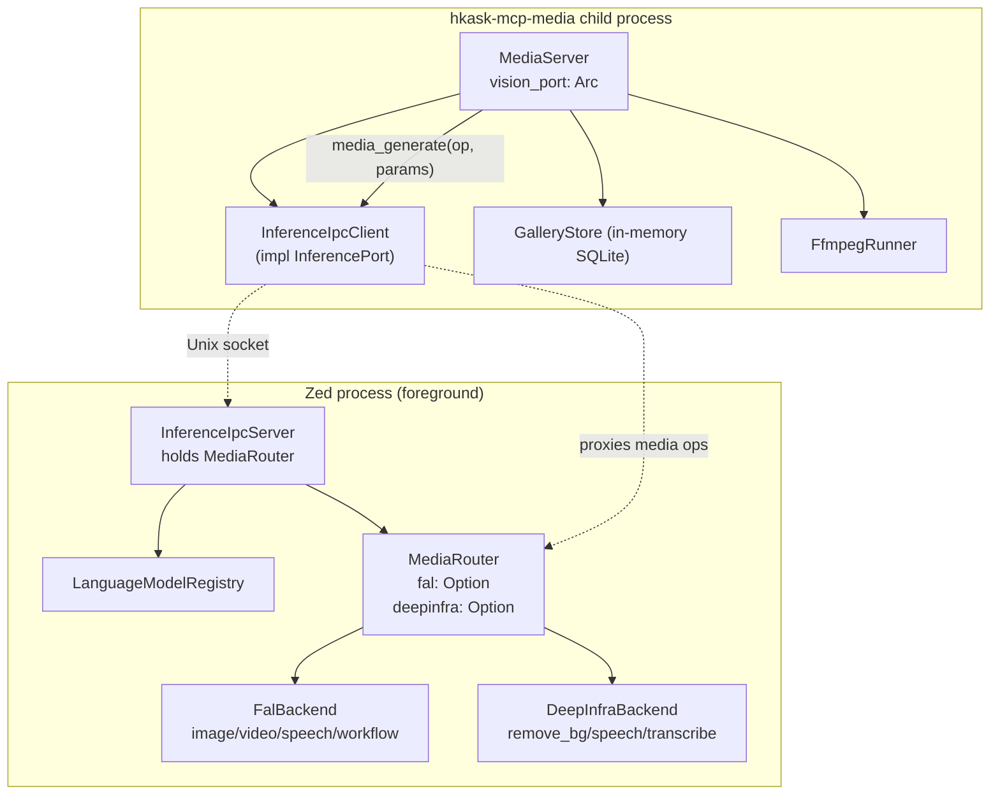

# Media System Review, Architecture Refactor, and Multi-Provider Expansion

**Status:** Design / planning document (read-only analysis; no production code changed in this pass).
**Scope:** `hkask-mcp-media` server, `hkask-inference` media backends + workflow engine, `media-workflow` skill, `media` template crate, `GalleryStore` media schema.
**Method:** Every claim below is grounded in the codebase as of this session. File:line references are included where available. Reference-baseline patterns (fal.ai, ComfyUI, OpenMontage, InvokeAI, Fooocus, AtlasCloudAI) are taken from the task's provided differentiator table; external repo internals were **not** fetched (no fabrication).

---

## 0. Executive summary

The media system is functional but **shallow at its two core seams**:

1. **`MediaRouter`** (`hkask-inference/src/media_router.rs`) hardcodes two provider fields (`fal`, `deepinfra`) and dispatches by string op name inside `media_generate`. Adding a provider means editing the struct + every dispatch arm. There is no `MediaProvider` trait and no registry.
2. **`fal_workflow.rs`** models only fal.ai's 3-node-type DAG (`Input`/`Run`/`Display`). It cannot represent ComfyUI-style node graphs, aborts on the first failing node (no partial results / retry / parallel execution of independent branches), and converges only on "all output URLs present" — never on output quality.

Beyond those seams, the system has **no asset lineage** (the gallery stores file hashes and tag provenance, but generated assets are not linked to their prompt/model/seed/params/provider), **no quality or cost feedback loops**, and **no style preset system**. Two pieces of dead/misaligned surface were verified and should be removed/fixed first: the `omc.rs` ontology bridge (zero call sites) and the `TOGETHERAI_API_KEY` credential over-grant in the media server's allowlist.

The refactoring plan below is structured as **seven vertically-sliced, independently-shippable work streams**, each with a strangler-fig migration path so production never breaks mid-refactor. The provider trait is justified from day one (two implementations: fal.ai + DeepInfra) — it is **not** speculative generality.

---

## Phase 1 — Current-state inventory (verified)

### 1.1 Architecture: the two-process split



Key facts (verified):
- The MCP server process **does not** call `MediaRouter` directly. It holds a `vision_port: Arc<dyn InferencePort>` (`hkask_mcp_media.rs:105`) resolved via `hkask_inference::resolve_inference_port()` (`hkask_inference.rs:190`). When `HKASK_INFERENCE_SOCKET` is set, this is an `InferenceIpcClient` that proxies `media_generate` over a Unix socket to the zed-side `InferenceIpcServer`, which holds the `MediaRouter` (`crates/zed/src/main.rs:1740`).
- `MediaServer` uses the **same** `vision_port` for both vision-LLM calls (describe, analyze, face validation) and media generation (image/video/speech). Vision LLMs are resolved through zed's `LanguageModelRegistry` (OpenRouter / Together AI / KiloCode / DeepInfra as language-model providers) — **not** by the media server reading those keys directly.
- Fallback (no socket): `resolve_inference_port` builds a standalone `MediaRouter` from `InferenceConfig::from_env()` — media-only; chat/vision/embed return a clear `BRIDGE_ERROR` (`media_router.rs:240`).

### 1.2 Tool inventory (~38 tools across 4 domains)

All tool methods are split into modules via the `#[tool_router]` macro and live on the single `MediaServer` struct (`hkask_mcp_media.rs:98`).

| Domain | File | Tools |
|---|---|---|
| Generation | `tools/generation.rs` | `generate_image`, `transform_image`, `upscale_image`, `generate_video`, `execute_workflow` — all route through `vision_port.media_generate(op, params)` |
| Audio | `tools/audio.rs` | `voice_design`, `generate_speech`, `transcribe`, `transcribe_bundle`, `audio_capture`, `record_and_transcribe` |
| Processing | `tools/processing.rs` | `image_remove_background`, `image_apply_style`, `image_create_collage`, `video_clip`, `video_to_gif`, `image_to_video`, `video_add_caption`, `video_remix`, `video_from_images`, `video_concat`, `video_caption`, `video_meme` |
| Gallery | `tools/gallery.rs` | `gallery_organize`, `gallery_status`, `gallery_search`, `gallery_find_similar`, `gallery_refresh`, `describe_image`, `gallery_analyze`, `gallery_name_face`, `face_validate`, `face_register`, `face_scan_folder`, `face_list`, `face_remove`, `extract_object`, `gallery_timeline` |

Local (no provider): `image_create_collage`, all `video_clip/to_gif/add_caption/remix/from_images/concat/meme`, `audio_capture`, `record_and_transcribe` (local mic). Provider-routed: generation tools + `image_remove_background`, `image_apply_style`, `image_to_video`, `extract_object`, `transcribe*`, `generate_speech`, `describe_image`, `gallery_analyze`/`gallery_find_similar` (vision LLM via IPC bridge).

### 1.3 Provider methods (verified)

**`FalBackend`** (`fal_backend.rs`) — fal.ai-specific endpoints (hardcoded app strings):
- `generate_image` → `fal-ai/flux/dev` (sync)
- `image_to_image` → `fal-ai/flux/dev/image-to-image` (sync)
- `remove_background` → `fal-ai/birefnet` (sync)
- `upscale` → `fal-ai/seedvr2` (**queue**)
- `generate_video` → `fal-ai/minimax/video-01-live` (**queue**)
- `image_to_video` → `fal-ai/seedance-2.0/image-to-video` (**queue**)
- `segment_object` → `fal-ai/florence-2-large/referring-expression-segmentation` (sync)
- `generate_speech` → `fal-ai/elevenlabs/tts/eleven-v3` (sync)
- `transcribe` → `fal-ai/whisper` (sync)
- `execute_workflow` → multi-node DAG executor

**`DeepInfraBackend`** (`deepinfra_backend.rs`) — media subset:
- `remove_background` (DeepInfra RMBG), `generate_speech` (TTS), `transcribe` (STT). Also chat/vision via OpenAI-compatible API.

**`MediaRouter` dispatch** (`media_router.rs:312` `media_generate`):
- `generate_image`, `image_to_image`, `upscale`, `generate_video`, `image_to_video`, `segment_object`, `execute_workflow` → **fal.ai only**.
- `remove_background`, `generate_speech`, `transcribe` → **DeepInfra first, fal.ai fallback** (`media_router.rs:96,160,198`) with a `tracing::warn!` on fallback.
- The DeepInfra-first/fal-fallback pattern is used **only** for the three ops where DeepInfra is cheapest (background removal, TTS, STT). Image/video generation is fal.ai-only because DeepInfra has no equivalent endpoints wired.

### 1.4 Workflow engine (`fal_workflow.rs`)

- **3 node types**: `Input { id, depends, input }`, `Run { id, depends, app, input, mode }`, `Display { id, depends, fields }`. `ExecutionMode { Sync, Queue }` (`fal_workflow.rs:29-68`).
- **Topological sort**: Kahn's algorithm, detects cycles + unknown-node refs (`fal_workflow.rs:147`).
- **`$`-reference resolution**: `$node_id.field.path` strings resolved against prior `results`; segments may be object keys or array indices (`fal_workflow.rs:212-275`). A reference to a node not in `depends` is rejected.
- **Execution** (`fal_backend.rs:588` `execute_workflow`): nodes executed **sequentially** in topological order; each `Run` node calls `fal_sync_post`/`fal_queue_post`; `?` propagates → **the workflow aborts on the first node failure**. There is **no partial-result return, no per-node retry, no parallel execution of independent branches**. `Display` only runs if all preceding `Run` nodes succeed.
- **URL extraction**: `extract_urls` walks the display fields collecting `https://` strings matching media extensions or `fal.media` (`fal_workflow.rs:283`).
- **Result**: `WorkflowResult { output_urls, output_fields, node_results, elapsed_seconds }`.

### 1.5 Gallery storage (`hkask-storage/src/gallery.rs`)

Schema (`init_schema` at `gallery.rs:137`):
- `galleries` (id, root_path, mode, image_count, total_size_bytes, timestamps)
- `gallery_images` (id, gallery_id, relative_path, absolute_path, **hash** (SHA-256), width, height, format, size_bytes, added_at) — **no generation-lineage columns** (no prompt/model/seed/params/provider/workflow_id).
- `gallery_tags` (id, image_id, tag_type, value, confidence, **model_used**, created_at) — `model_used` records *which model produced the tag*, not the asset's generation context.
- `face_registry` (id, first_name, last_name, image_id, **embedding BLOB**, status, notes, timestamps) — face embeddings stored **locally as BLOB** (user-owned; not provider-side). Good.

The media server uses an **in-memory** `GalleryStore` (`hkask_mcp_media.rs:1395` `Database::in_memory()`). Gallery state is rebuilt each server start; only the filesystem gallery persists across restarts.

### 1.6 Credentials and config env vars (verified)

**Media server process actually reads** (grep of `env::var` in `kask/mcp-servers/hkask-mcp-media`):
- `HKASK_MEDIA_TTS_MODEL`, `HKASK_MEDIA_STT_MODEL`, `HKASK_MEDIA_VISION_MODEL`, `HKASK_MEDIA_IMAGE_GEN_MODEL` (via `models::resolve`, `hkask_mcp_media.rs:73`).
- `HOME` (face folder default, `hkask_mcp_media.rs:1358`).
- `HKASK_VISION_FAMILIES` is read inside `hkask-inference` (`hkask_inference.rs:145`), reachable via the IPC path.

**Declared in the media server's `credentials` allowlist** (`kask_bridge/src/mcp_servers.rs:155`): `FALAI_API_KEY`, `DEEPINFRA_API_KEY`, `TOGETHERAI_API_KEY`.
**Declared `config_env`**: the 4 `HKASK_MEDIA_*_MODEL` vars.

### 1.7 Verified dead / misaligned surface (immediate findings)

1. **`omc.rs` is dead** (`hkask_mcp_media/src/omc.rs`). Declared `pub mod omc;` (`hkask_mcp_media.rs:16`), but `omc::` has **zero call sites** anywhere in the project (grep across `kask/` + `crates/` returns only the definition + its own unit tests). `media_op_to_omc` / `media_type_to_omc` are never invoked. This is write-only documentation masquerading as architecture — the "advertised invariants need enforcement points" trap. **Finding F-1.**

2. **`TOGETHERAI_API_KEY` is over-granted** to the media server process. The server process never reads it (no `env::var("TOGETHERAI_API_KEY")`, no TogetherAI backend). Vision routes through the IPC bridge to zed's `LanguageModelRegistry`; `MediaRouter` builds only `FalBackend` + `DeepInfraBackend`. In the no-socket fallback, `InferenceConfig::from_env()` may parse it into config, but `MediaRouter` discards it (no `together` field). A compromised media-server child process would receive a secret it cannot use. Violates "MCP server allowlists must align with actual env-var reads." **Finding F-2.** (The `require_vision` error string at `hkask_mcp_media.rs:225` mentioning `TOGETHERAI_API_KEY` is misleading — it names keys the *zed* process needs, not the media server.)

---

## Phase 2 — Gap analysis (lenses applied)

### 2.1 Deep-module lens (Ousterhout)
- **`MediaRouter` is shallow**: 2 hardcoded fields, no trait, no registry. Deletion test: deleting it reappears complexity in every tool → it should exist but be **deepened** behind a `MediaProvider` trait + registry.
- **`MediaServer` is a god object**: ~1400 lines, holds gallery state, ffmpeg, vision_port, face embeddings, Levenshtein, EXIF in one struct. The `tool_router` macro splits *methods* but not *state*. Video/ffmpeg is self-contained (good submodule candidate); gallery+face share state (stay together).

### 2.2 Essentialist lens
- **G1 (Exist)**: The fal.ai 3-type DAG is a **degenerate case** of a general typed node graph. A general graph with typed nodes + typed edges subsumes it (`Input`→source node, `Run`→compute node, `Display`→sink node). No caller depends on the `Input`/`Run`/`Display` *type names* outside `fal_workflow.rs` + the `workflow-composer.j2` template + `media-workflow.yaml` step descriptions. The general engine can preserve the fal.ai JSON shape as a serialization alias → `fal_workflow.rs` becomes a thin adapter, not deleted outright (avoids breaking the existing `execute_workflow` op). **G1 verdict: subsume, don't delete.**
- **G2 (Surface)**: 6 domains. Removing video/ffmpeg reappears ffmpeg invocation complexity in callers → keep as submodule (already is). Gallery+face share `gallery_state` + `vision_port` → keep together. Generation/processing both route through `vision_port.media_generate` → could share a provider abstraction.
- **G3 (Contract)**: `omc.rs` has **zero consumers** (verified F-1). Dead surface. **Delete or wire it.**

### 2.3 Pragmatic-semantics lens (IS vs OUGHT)
- **IS**: 2 providers, fal-locked workflow DAG, filesystem gallery with no generation lineage, cloud-only execution, 4 model-override settings, no style system, no cost tracking, no 3D/music/avatar.
- **OUGHT**: pluggable provider registry, ComfyUI-compatible workflow graph, asset lineage, local+cloud dual path, pipeline manifests, style presets, scored provider selection, budget governance, decision audit trail.

### 2.4 Pragmatic-cybernetics lens (feedback loops)
- **No quality feedback loop**: generate → return URL, no scoring. (OpenMontage: 7-dimension provider scoring + slideshow-risk + post-render self-review.)
- **No cost feedback loop**: no estimate/reserve/reconcile. (OpenMontage: budget governance with per-action threshold + total cap.)
- **No asset-lineage feedback**: gallery hashes files, doesn't link to generation params. (InvokeAI: full per-image metadata.) "Reproduce this" / "variant this" impossible today.
- **No convergence loop on workflow quality**: `media-workflow` converges on "all output URLs present" (Cauchy on presence), not output quality.

### 2.5 Grill-me lens (verified answers)
- **Recall**: 4 layers = (1) `MediaServer` MCP child process, (2) `MediaRouter` + backends (zed-side), (3) `fal_workflow` engine, (4) `GalleryStore` + skills/manifests. Dispatch: `media_generate` string-matches op → calls the named `MediaRouter` method → Fal or DeepInfra backend.
- **Mechanism**: `$references` resolve by stripping `$`, splitting on `.`, requiring the source node in `depends`, walking prior `results`. A node failure **aborts the whole workflow** (propagated via `?`); there is no continue-on-failure.
- **Rationale**: DeepInfra-first/fal-fallback only for remove_bg/speech/transcribe because DeepInfra is cheapest there and has those endpoints; image/video generation has no DeepInfra equivalent wired, so fal.ai is sole provider. Cost is the implicit dimension; latency/quality are not modeled.
- **Edge cases**: `FALAI_API_KEY` present, `DEEPINFRA_API_KEY` absent → remove_bg/speech/transcribe fall through to fal.ai (the fallback path handles missing DeepInfra via `Option`). Queue node timeout → no timeout is implemented in `fal_workflow` itself (relies on HTTP client / the manifest `timeout_seconds`); a hung queue node blocks the workflow indefinitely at the engine level. Nonexistent gallery root → `gallery_organize` returns an error; the server stays alive.
- **Synthesis**: Deleting `fal_workflow.rs` would break `execute_workflow`, `media-workflow` skill, `workflow-composer.j2`, and `media-workflow.yaml`. Deleting `omc.rs` breaks **nothing** (verified F-1). Splitting `MediaServer` into Gallery + Generation servers is blocked by shared `vision_port` (both need it) and shared `gallery_state` (face recognition reads gallery images) — so the split should be by *module*, not by *process*.

### 2.6 Reference-baseline structural patterns (ranked by impact)

| Rank | Reference | One structural pattern to adopt | Closes gap |
|---|---|---|---|
| 1 | OpenMontage | **Scored provider selection** (7-dim: task-fit/quality/control/reliability/cost/latency/continuity) + decision audit trail | Provider selection is currently hardcoded; no reasoning recorded |
| 2 | ComfyUI | **General typed node-graph workflow model** with persistence + metadata embedding | fal-locked 3-type DAG can't represent real node graphs |
| 3 | InvokeAI | **Per-asset generation lineage** (prompt/model/seed/params/workflow) | No lineage today → no reproduce/variant |
| 4 | OpenMontage | **Pipeline manifests as YAML** (pre-defined, self-contained, dual local+cloud path) | Only LLM-composed workflows today |
| 5 | OpenMontage | **Budget governance** (estimate → reserve → reconcile; per-action threshold + total cap) | No cost loop |
| 6 | Fooocus | **Style presets** (prompt augmentation + sampler params + model selection) | No style system; every request starts from scratch |
| 7 | fal.ai | **Queue-based execution for long ops** (already partially present via `ExecutionMode::Queue`) | Mostly addressed; formalize as a provider capability |
| 8 | AtlasCloudAI | **Provider aggregation gateway** (one trait, many impls) | The `MediaProvider` trait + registry |

### 2.7 Gap table

| # | Gap | Lens | Constraint force | Reference | Proposed remedy |
|---|---|---|---|---|---|
| G1 | No `MediaProvider` trait/registry; 2 hardcoded fields | deep-module | **Guardrail** | AtlasCloudAI, OpenMontage | Work stream WS-1: trait + registry, strangler-fig keeping Fal/DeepInfra as first impls |
| G2 | Workflow engine fal-locked to 3-type DAG | essentialist G1 | **Guideline** | ComfyUI | WS-2: generalize to typed node graph; fal.ai shape becomes a serialization alias |
| G3 | No asset generation lineage | cybernetics | **Guardrail** | InvokeAI | WS-3: `gallery_generation` table + lineage API; "reproduce"/"variant" |
| G4 | No pipeline manifests (only LLM-composed workflows) | task-breakdown | **Guideline** | OpenMontage | WS-4: YAML manifests for common pipelines (this pass authors 3) |
| G5 | No scored provider selection / decision audit | cybernetics | **Guardrail** | OpenMontage | WS-5: 7-dimension scoring engine + audit log |
| G6 | No budget governance (no cost loop) | cybernetics | **Guardrail** | OpenMontage | WS-6: estimate/reserve/reconcile + per-action threshold |
| G7 | No style preset system | pragmatic-semantics | **Guideline** | Fooocus | WS-7: YAML playbooks controlling prompt augmentation + params + model |
| G8 | `omc.rs` dead (zero call sites) | essentialist G3 | **Prohibition** (dead surface) | — | Delete `omc.rs` + `pub mod omc;` (or wire it; deletion preferred — see F-1) |
| G9 | `TOGETHERAI_API_KEY` over-granted to media server | pragmatic-semantics | **Prohibition** (credential hygiene) | — | Remove from media `credentials` allowlist (F-2); fix `require_vision` error string |
| G10 | Workflow aborts on first node failure; no retry/parallel | cybernetics | **Guardrail** | ComfyUI (re-execute changed parts), OpenMontage (quality gates) | WS-2: per-node failure policy + independent-branch parallelism |
| G11 | No local execution path (cloud-only) | pragmatic-semantics | **Guideline** | ComfyUI, OpenMontage (dual path) | WS-1: `MediaProvider` trait includes a `LocalBackend` impl shape (future) |
| G12 | `MediaServer` god object (~1400 lines) | deep-module | **Guideline** | — | WS-2/WS-3: extract gallery + video into submodule interfaces (state stays shared) |
| G13 | No quality feedback loop on generated output | cybernetics | **Guideline** | OpenMontage (self-review) | WS-5: optional post-generation scoring hook |
| G14 | Gallery store is in-memory (rebuilt each start) | cybernetics | **Guideline** | InvokeAI (durable metadata) | WS-3: durable gallery DB path (follow `HKASK_DB_PATH` pattern) |

---

## Phase 3 — Refactoring plan (seven work streams)

Each stream is vertically sliced and independently shippable. Strangler-fig: the existing `MediaRouter` / `fal_workflow.rs` keep working until the new path is proven.

### WS-1 — Provider trait + registry (Guardrail)

**Status: APPLIED and VALIDATED.** `kask/crates/hkask-inference/src/provider.rs` (`MediaOp` + `MediaProvider` trait + `ProviderRegistry` with runtime fallback-on-error) is implemented; `FalBackend` and `DeepInfraBackend` both `impl MediaProvider`; `MediaRouter` now holds a `ProviderRegistry` and dispatches via it (public API preserved). 11 new tests pass (6 `provider::tests`, 5 `media_router::tests`); all 62 `hkask-inference` lib tests pass with no regressions. `./script/clippy -p hkask-inference` and `./script/clippy -p hkask-mcp-media` are clean under `--deny warnings`.

**Architecture rationale (why media terminates at the hKask `MediaRouter`, not zed's `LanguageModelRegistry`):** media already routes through the kask IPC bridge to the zed process (`MediaServer` → `InferenceIpcClient` → `InferenceIpcServer` → `MediaRouter`, `inference_ipc_server.rs:565`), but zed dispatches it to the hKask `MediaRouter` rather than its `LanguageModelRegistry` because zed's `LanguageModel` trait is chat-completions-only (`stream_completion`; no `media` method — grep of `crates/language_models/**` finds none). Media generation uses non-chat APIs (fal.ai `fal.run/{app}` + `queue.fal.run` with app-id routing and queue polling; DeepInfra `/v1/inference/{model}`, `/v1/text-to-speech/{voice}` returning audio bytes, `/v1/audio/transcriptions`) that `LanguageModel` cannot represent. **Decision: do NOT preemptively build a `MediaModel` trait into upstream zed** (would require a `DIVERGENCE.md` D-seam into `crates/language_models/`). If zed later adds media handling to its router, this terminal can delegate to it instead — until then the providers live behind the `MediaProvider` trait here. This keeps the change additive (`kask/` only, no upstream edits).

**Goal:** adding a provider = implement `MediaProvider` + register; no edits to dispatch logic.

**Files touched:**
- `kask/crates/hkask-inference/src/media_router.rs` (refactor to dispatch via registry)
- `kask/crates/hkask-inference/src/fal_backend.rs`, `deepinfra_backend.rs` (impl the trait)

**New files:**
- `kask/crates/hkask-inference/src/provider.rs` — `MediaProvider` trait + `ProviderRegistry` + `MediaOp` enum (replaces string ops).
- `kask/crates/hkask-inference/src/provider/fal.rs`, `provider/deepinfra.rs` (or keep existing backends, impl trait).

**Design:**
```rust
/// A media generation capability a provider can serve.
pub enum MediaOp { GenerateImage, ImageToImage, RemoveBackground, Upscale,
    GenerateVideo, ImageToVideo, SegmentObject, GenerateSpeech, Transcribe,
    ExecuteWorkflow, /* extensible */ }

/// One provider behind the media membrane. ≥2 impls from day one
/// (Fal, DeepInfra) → not speculative generality.
pub trait MediaProvider: Send + Sync {
    fn id(&self) -> &str;
    fn supports(&self, op: MediaOp) -> bool;
    fn estimate_cost(&self, op: MediaOp, params: &MediaGenerateParams) -> Option<CostEstimate>;
    fn execute(&self, op: MediaOp, params: &MediaGenerateParams)
        -> Pin<Box<dyn Future<Output = Result<Value, InferenceError>> + Send + '_>>;
}

pub struct ProviderRegistry { providers: Vec<Arc<dyn MediaProvider>> }
impl ProviderRegistry {
    /// Scored selection (WS-5 wires the scoring; WS-1 uses simple
    /// first-supports + configured fallback order).
    fn select(&self, op: MediaOp) -> Result<&Arc<dyn MediaProvider>, InferenceError>;
}
```

**Migration (strangler-fig):**
1. Add `MediaProvider` trait; impl for `FalBackend` + `DeepInfraBackend` (existing methods unchanged).
2. `MediaRouter` gains a `registry: ProviderRegistry` field; `media_generate` dispatches via `registry.select(op).execute(...)`. The existing per-op methods (`generate_image`, etc.) become thin wrappers that call the registry, preserving the public API.
3. The DeepInfra-first/fal-fallback policy moves into `ProviderRegistry::select` as a configured fallback chain (preserves current behavior exactly).
4. Once green, the inline `match op` block in `media_generate` is deleted.

**Acceptance:** a new provider is added by implementing `MediaProvider` + pushing into the registry in `MediaRouter::new`; no `match` arm edits. Existing op behavior unchanged (pinned by tests).

**Tests to pin:**
- `provider_registry_dispatches_known_op`
- `provider_registry_fallback_chain_matches_current_behavior` (remove_bg/speech/transcribe DeepInfra-first → fal)
- `provider_registry_unknown_op_rejected`
- `media_router_public_api_unchanged` (existing callers compile + behave)
- `fal_and_deepinfra_both_implement_media_provider`

### WS-2 — Generalized workflow engine (Guideline)

**Goal:** a typed node graph that subsumes fal.ai's 3-type DAG and can represent ComfyUI-style graphs.

**Status: APPLIED and VALIDATED.** `kask/crates/hkask-inference/src/workflow/mod.rs` implements `WorkflowGraph` / `GraphNode` (`Source`/`Compute`/`Sink`) / `FailurePolicy` (`Abort` default, `Skip`, `Retry{n}`) / `NodeExecutor` trait, with deterministic topological sort, per-node failure policy, opt-in `parallel` (same-level computes run concurrently via `join_all`), and JSON persistence. `workflow/fal_adapter.rs` parses fal.ai `Input/Run/Display` JSON into the graph. `FalBackend` now `impl NodeExecutor` (sync/queue → `fal_sync_post`/`fal_queue_post`) and `execute_workflow` delegates to `graph.execute(self)` — byte-identical to the pre-refactor results (same `resolve_references`/`extract_urls` reused, same execution order). 14 new tests pass (`workflow::tests` + `workflow::fal_adapter::tests`); all 75 `hkask-inference` lib tests pass; `./script/clippy -p hkask-inference` and `-p hkask-mcp-media` clean under `--deny warnings`. `fal_workflow.rs` is kept (parsing/validation/reference-resolution reused by the adapter/engine); its inline execution loop in `fal_backend.rs` is replaced.

**Files touched:** `kask/crates/hkask-inference/src/fal_workflow.rs` (generalize).

**New files:**
- `kask/crates/hkask-inference/src/workflow/mod.rs` — `WorkflowGraph`, `Node { id, kind, inputs, depends, executor_hint }`, `Edge`, `NodeKind { Source, Compute, Sink }`.
- `kask/crates/hkask-inference/src/workflow/fal_adapter.rs` — parses fal.ai `Input/Run/Display` JSON into the general graph and back (serialization alias → existing `execute_workflow` op unchanged).

**Design:**
- `NodeKind` is the generalization of fal.ai's 3 types: `Source` ≡ `Input`, `Compute` ≡ `Run`, `Sink` ≡ `Display`. fal.ai's `mode: sync|queue` becomes a `executor_hint` on `Compute` nodes (provider-specific).
- `$reference` resolution is reused verbatim (it's already general).
- **Failure policy** (G10): per-node `on_failure: { Abort, Skip, Retry(n) }`. Default `Abort` preserves current behavior.
- **Parallelism**: independent nodes (same topological level) may execute concurrently. Default sequential preserves current behavior; opt-in via graph metadata.
- **Persistence**: `WorkflowGraph` serializes to JSON/YAML for export/import/re-execute (ComfyUI-style).

**Migration:**
1. General engine lands alongside `fal_workflow.rs`. `FalBackend::execute_workflow` calls `fal_adapter::parse` → `WorkflowGraph::execute` → `fal_adapter::format_result`. Existing `WorkflowResult` shape preserved.
2. `workflow-composer.j2` keeps emitting fal.ai JSON (parsed by the adapter). No skill change required to stay green.
3. Once stable, `fal_workflow.rs`'s execution logic is deleted (parsing/validation/reference-resolution move to the general engine; fal-adapter keeps the type mapping).

**Acceptance:** a fal.ai workflow and a ComfyUI-style graph both execute; fal.ai's `Input/Run/Display` maps to `Source/Compute/Sink`; current `execute_workflow` results byte-identical for existing workflows.

**Tests:** `fal_adapter_roundtrip_preserves_result`, `graph_executes_independent_branches_in_parallel` (opt-in), `graph_abort_policy_default_matches_current`, `graph_skip_policy_returns_partial_results`, `graph_serializes_and_reexecutes`.

### WS-3 — Asset lineage + metadata storage (Guardrail)

**Status: STORAGE + LINEAGE TOOLS APPLIED and VALIDATED; durable DB deferred.** `kask/crates/hkask-storage/src/gallery.rs` now has the `gallery_generation` + `gallery_workflow` tables (added to `init_schema`) and the `WorkflowRecord` / `GenerationRecord` structs plus `record_workflow` / `get_workflow` / `record_generation` / `get_generation` API. `kask/mcp-servers/hkask-mcp-media` now exposes three lineage MCP tools: `gallery_record_generation` (no-download write — links an existing gallery image to its generation context: op, prompt, model, provider, seed, params JSON, workflow id, parent image index), `gallery_lineage` (read the stored lineage), and `gallery_reproduce` (replay the stored op + params via `media_generate`; for image-ops it uses the current image as the source). Request structs are in `types/mod.rs`; tools are in `tools/gallery.rs`. 6 new tests pass (5 in `hkask-storage::gallery::tests` + `integration_tests::gallery_lineage_record_and_replay_round_trip` in the media server); all 23 `hkask-mcp-media` lib tests pass; `./script/clippy -p hkask-storage` and `-p hkask-mcp-media` clean under `--deny warnings`.

**Deferred (next slice):**
- **Durable gallery DB** (G14): ✅ APPLIED. `HKASK_MEDIA_DB` env support: the media server's `GalleryStore` now uses `SqliteDriver::file_pool(path)` (unencrypted, WAL, FKs on) when `HKASK_MEDIA_DB` is set; falls back to `SqliteDriver::in_memory_driver()` otherwise (with a `reg.inference`-targeted warn naming the durability gap). `HKASK_MEDIA_DB` added to the media `config_env` allowlist (`kask_bridge/src/mcp_servers.rs`). `hkask-storage::gallery::tests::gallery_lineage_survives_across_driver_instances` proves the file-backed gallery DB round-trips lineage across dropped-and-reopened driver instances. The file DB is **unencrypted** (no `HKASK_DB_PASSPHRASE`) — gallery metadata + lineage is not a secret, so this avoids leaking the global SQLCipher key to the media-server child process (credential-blast-radius `.rules`). Note: `gallery_state` (`Arc<Mutex<Option<GalleryState>>>`) is still in-memory; the user re-runs `gallery_organize` after restart to repopulate it (the file DB still has the images/lineage rows).
- **`gallery_variants(image_index, n)`** — a trivial extension of `gallery_reproduce` that re-runs with `n` new seeds (deferred until seed is a first-class `MediaGenerateParams` field or until a provider exposes seed control).

**Goal:** a generated asset is traceable to its full generation context; "reproduce" works (`gallery_reproduce`), "variant" is the deferred `gallery_variants`.

**Files touched:** `kask/crates/hkask-storage/src/gallery.rs` (schema + API) ✅, `kask/mcp-servers/hkask-mcp-media/src/types/mod.rs` (request structs) ✅, `kask/mcp-servers/hkask-mcp-media/src/tools/gallery.rs` (lineage tools) ✅, durable DB — deferred.

**New schema (`init_schema`):**
```sql
CREATE TABLE IF NOT EXISTS gallery_generation (
    id TEXT PRIMARY KEY,
    image_id TEXT REFERENCES gallery_images(id) ON DELETE CASCADE,
    op TEXT NOT NULL,                -- generate_image | image_to_image | ...
    prompt TEXT,
    model TEXT,                      -- provider-specific model id
    provider TEXT,                   -- "fal.ai" | "deepinfra" | ...
    seed INTEGER,
    params TEXT,                     -- JSON: size, strength, duration, ...
    workflow_id TEXT,                -- FK to gallery_workflow if from a workflow
    parent_image_id TEXT,            -- lineage: image this was derived from
    created_at TEXT NOT NULL
);
CREATE TABLE IF NOT EXISTS gallery_workflow (
    id TEXT PRIMARY KEY,
    graph_json TEXT NOT NULL,        -- serialized WorkflowGraph (WS-2)
    created_at TEXT NOT NULL
);
CREATE INDEX IF NOT EXISTS idx_gallery_generation_image ON gallery_generation(image_id);
```

**Design:**
- After a successful `generate_image`/`image_to_image`/`upscale`/`image_to_video`, the generation tool resolves the returned URL, downloads the asset into the gallery, creates a `gallery_images` row, and writes a `gallery_generation` row with the full context.
- New tools: `gallery_reproduce(image_index)` (re-runs the stored op+params), `gallery_variants(image_index, n)` (re-runs with new seeds).
- Durable gallery DB: follow the `HKASK_DB_PATH` / `HKASK_KANBAN_DB` pattern instead of `Database::in_memory()` (G14). Configurable via `HKASK_MEDIA_DB`.

**Acceptance:** a generated image can be traced to prompt/model/seed/params/provider; `gallery_reproduce` re-creates an equivalent image; `gallery_variants` produces n variants.

**Tests:** `generation_lineage_recorded_after_generate_image`, `reproduce_reuses_stored_params`, `variant_changes_seed`, `lineage_survives_restart_with_durable_db`.

### WS-4 — Pipeline manifests (Guideline)

**Goal:** pre-defined, self-contained YAML pipelines for common media workflows, executable by the skill cascade.

This pass authors **3 pipeline manifests** (see §5 / the manifest files) using the *current* fal.ai workflow engine (no new engine dependency), demonstrating the OpenMontage pattern: a fixed, known-good pipeline topology parameterized by user intent, rather than an LLM-composed DAG each time.

**Acceptance:** each manifest is self-contained and executes end-to-end via `media.execute_workflow` with a known-good DAG.

### WS-5 — Scored provider selection (Guardrail)

**Goal:** provider choice is logged with alternatives + scores + reasoning (OpenMontage 7-dimension).

**New files:** `kask/crates/hkask-inference/src/scoring.rs` — `ProviderScore { task_fit, quality, control, reliability, cost, latency, continuity, weighted, reasoning }`, `select_scored(registry, op, params) -> (Arc<dyn MediaProvider>, Vec<ProviderScore>)`.

**Design:** weighted sum (defaults from OpenMontage: task-fit 30 / quality 20 / control 15 / reliability 15 / cost 10 / latency 5 / continuity 5). Scores per (provider × op) are operator-configurable; defaults encode the current DeepInfra-first/fal-fallback policy so behavior is preserved until operators tune weights. The decision (chosen provider + rejected alternatives + scores) is written to a `reg.media.select` span and an audit row.

**Acceptance:** provider choice is logged with all candidate scores + reasoning; default weights reproduce current behavior.

**Tests:** `default_weights_reproduce_deepinfra_first_fal_fallback`, `scoring_logs_all_candidates`, `operator_weights_override_selection`.

### WS-6 — Budget governance (Guardrail)

**Goal:** cost estimated before execution, reserved, reconciled after; over-threshold pauses for approval.

**New files:** `kask/crates/hkask-inference/src/budget.rs` — `CostEstimate`, `BudgetLedger { estimate, reserve, reconcile, spent }`, per-action approval threshold + total cap (operator-configurable via `kask.media.budget`).

**Design:** `MediaProvider::estimate_cost` (WS-1) feeds the ledger. Before `execute`, the ledger reserves; after, it reconciles actual vs estimate and updates a per-provider cost model (the cost feedback loop). Over-threshold calls return a `BudgetApproval` error that the skill cascade surfaces as an approval prompt.

**Acceptance:** cost is estimated before execution and reconciled after; over-threshold calls pause for approval; the ledger is queryable.

**Tests:** `estimate_before_execute`, `reconcile_updates_cost_model`, `over_threshold_pauses_for_approval`, `total_cap_blocks_when_exhausted`.

### WS-7 — Style system (Guideline)

**Goal:** style presets (YAML playbooks) control prompt augmentation, sampler params, and model selection; applying a preset changes output consistently (Fooocus).

**New files:** `kask/registry/templates/media/styles/*.yaml` (presets: `default`, `anime`, `realistic`, `cinematic`, `minimal`), `kask/mcp-servers/hkask-mcp-media/src/style.rs` — `StylePreset { prompt_suffix, negative_prompt, sampler, model_override }`, applied in the generation tools before dispatch.

**Acceptance:** a style preset applied to a generation request changes prompt + params + model consistently.

**Tests:** `style_preset_augments_prompt`, `style_preset_overrides_model`, `unknown_style_rejected`.

---

## To-do (deferred / future work)

### WS-8 — AtlasCloud backend (media + inference), analogous to fal.ai

**Status: NOT STARTED — recorded for the next pass.** An `ATLASCLOUD_API_KEY`
has been added to `kask/.env` (pay-per-use media API, https://www.atlascloud.ai/).
Do NOT hardcode the key; wire it through the keychain / `InferenceConfig`
(`resolve_api_key("ATLASCLOUD_API_KEY")`), exactly as fal.ai is wired.

AtlasCloud should function analogously to fal.ai across BOTH surfaces:

1. **Inference provider (chat/vision)** — AtlasCloud is OpenAI-compatible
   (one API, many models), like fal.ai's `/v1/chat/completions`:
   - Add an `InferenceProviderDescriptor` to `INFERENCE_PROVIDERS`
     (`kask_bridge/src/inference_providers.rs`): `id: "AtlasCloud"`,
     `env_var: "ATLASCLOUD_API_KEY"`, `credential_key: "atlascloud"`,
     `api_url: "https://www.atlascloud.ai/v1"` (verify base URL),
     `dashboard_url: "https://www.atlascloud.ai/"`.
   - Add `InferenceConfig` fields `atlascloud_base_url` / `atlascloud_api_key`
     + `from_env` reading `ATLASCLOUD_API_KEY` / `ATLASCLOUD_BASE_URL`
     (`kask/crates/hkask-inference/src/config.rs`), and a
     `ProviderId::AtlasCloud` variant.
   - Reuse `openai_compatible_generate` for chat/vision (like `FalBackend::generate`).

2. **Media provider (image/video/3D/audio/ASR)** — analogous to
   `FalBackend` impl `MediaProvider` (WS-1):
   - Create `AtlasCloudBackend` (e.g. `kask/crates/hkask-inference/src/atlascloud_backend.rs`)
     that `impl MediaProvider` for the ops it serves, and register it in
     `MediaRouter::new` (`kask/crates/hkask-inference/src/media_router.rs`) —
     **no dispatch edits** (the WS-1 registry makes this a one-liner `providers.push`).
   - **Task-based (submit + poll), like fal.ai queue mode**: `generate_*` submits a
     job → returns a prediction/task id; `get_prediction` polls until the result
     URL (image/video/audio/3D file) is ready. So `AtlasCloudBackend::execute`
     should submit + poll (mirroring `FalBackend::fal_queue_post`), not a single
     sync POST. Reference API surface (from https://github.com/AtlasCloudAI/mcp-server):
     `atlas_generate_image` (images + 3D: GLB/OBJ/USDZ), `atlas_generate_video`,
     `atlas_generate_audio` (TTS + music), `atlas_transcribe_audio` (ASR),
     `atlas_get_prediction` (poll), `atlas_upload_media` (upload local file → URL
     for image-edit / image-to-video), `atlas_list_models` / `atlas_get_model_info`
     (dynamic per-model parameter schemas, validated before the request so
     invalid params fail fast without spending credits).
   - **3D is a new modality** not in the current `MediaOp` enum — extending
     `MediaProvider` to 3D requires a new `MediaOp::Generate3D` variant (WS-1
     `MediaOp` is designed to be extensible). Scope 3D as a follow-on if desired;
     image/video/audio/ASR map directly onto existing `MediaOp`s.
   - **Model discovery is dynamic** (per-model parameter schemas via
     `atlas_get_model_info`), richer than fal.ai's static app strings. For WS-8's
     first cut, hardcode the known-good model ids in the backend (as fal.ai
     does its app strings) and defer dynamic schema-driven params to a later
     pass. Do not hardcode model names in any manifest `fusion` block; use
     comments. The raw HTTP API endpoints (the MCP server wraps them) must be
     extracted from the reference repo's `src/` or the AtlasCloud docs during
     implementation — the README documents the MCP tools, not the raw HTTP paths.

3. **Credential allowlist alignment** — add `ATLASCLOUD_API_KEY` to the media
   MCP server's `credentials` allowlist (`kask_bridge/src/mcp_servers.rs`) ONLY
   because the fallback path (`resolve_inference_port` → `MediaRouter::from_env`)
   reads it via `InferenceConfig` (same justification as `FALAI_API_KEY` /
   `DEEPINFRA_API_KEY`). The media server process does NOT read it in the
   normal IPC-bridge path (vision/generation route to zed). Pin alignment with
   a `media_credentials_only_include_used_keys` assertion update (the existing
   test from Phase 6 must be extended to include `ATLASCLOUD_API_KEY`).

4. **Docs** — add `ATLASCLOUD_API_KEY` to the inference-providers env-var
   reference (`kask/docs/reference/kask-settings.md`, README, per-tool-contracts)
   and `KaskInferenceProvidersSettings::from_env` (`settings.rs`).

**Acceptance:** with `ATLASCLOUD_API_KEY` set, an AtlasCloud model is reachable
for chat/vision (via the IPC bridge → zed registry) and for media ops it
advertises (via `MediaRouter`'s registry), with no edits to media dispatch
logic. Without the key, AtlasCloud is simply absent (graceful `Option`).

**Note:** the WS-1 `MediaProvider` trait + registry was designed for exactly
this — adding AtlasCloud is the first real test that "adding a provider =
implement the trait + register, no dispatch edits." Do NOT promote the
`MediaProvider` port to a shared crate for this single new impl (the
"trait-with-one-impl is speculative generality" rule); it has ≥3 impls after
this (Fal, DeepInfra, AtlasCloud).

### WS-9 — Fooocus deep-module pattern audit (quality gate)

**Status: NOT STARTED — a final quality / tool check.** Deeply examine (the
deep-module lens, Ousterhout) the patterns Fooocus uses for media generation
and management, then compare what `hkask-mcp-media` supports vs Fooocus's
patterns/capabilities. Reference: https://github.com/lllyasviel/Fooocus (fetched
for this entry — stay within the README's documented patterns; do not
fabricate internals).

**Fooocus's core deep module** (the thing to understand): a minimal interface
(`prompt → beautiful image`, `<3` clicks, no parameter tuning, 4GB VRAM) that
hides an enormous quality pipeline. Deletion test (Ousterhout): remove the
hidden pipeline and the complexity reappears in *every* user (manual prompt
engineering + sampler tuning) → the pipeline deserves to exist, deeply, behind
the simple interface. This is the opposite of a shallow module, and the
pattern to extract is *where the depth lives* (behind the interface, not in it).

**Patterns to examine (deep-module lens) and compare to our server:**

1. **Hidden quality-enhancement pipeline** (the core deep module):
   - GPT-2-based prompt expansion (the "Fooocus V2" dynamic style) rewrites
     short prompts into rich ones before generation.
   - Native refiner swap inside one k-sampler (reuses the base model's
     momentum; vs A1111/ComfyUI's two independent samplers).
   - Negative ADM guidance + SAG (Self-Attention Guidance, anisotropic
     kernel) to remove the "plastic / overly-smooth" SDXL artifact.
   - Tuned sampler params, hard-coded best resolutions, CFG/TSNR correction,
     A1111 prompt-emphasis normalization, multi-style balancing.
   - **Our server:** none — generation is a raw pass-through to
     fal.ai/DeepInfra. **Gap: no hidden quality layer.** Note: much of this is
     SDXL-specific and lives in the provider; the portable analog for us is a
     prompt-expansion step + a tuned default-params preset (WS-7).

2. **Presets** (`default`/`anime`/`realistic`; `config.txt` with
   `default_model`, `default_refiner`, `default_cfg_scale`,
   `default_sampler`, `default_scheduler`, `default_negative_prompt`,
   `default_styles`, `default_loras`):
   - **Our server:** WS-7 (style presets as YAML playbooks) is the planned
     analog. **Compare WS-7's design to Fooocus's `config.txt` shape** — is our
     preset surface deep enough (model + params + styles + negative) or too
     shallow (prompt-suffix only)?

3. **Image management operations** — Upscale/Variation (`Vary Subtle`/
   `Vary Strong`, `Upscale 1.5x`/`2x`), Inpaint/Outpaint (pan
   up/down/left/right), Image Prompt (IP-Adapter + InsightFace FaceSwap),
   Describe (interrogate):
   - **Our server:** has `upscale_image`, `transform_image`,
     `image_remove_background`, `image_apply_style`, `describe_image`,
     `extract_object`, `face_register`/face validation. **Gaps vs Fooocus:** no
     inpaint/outpaint, no pan, no FaceSwap, no "Vary Subtle/Strong" variation
     semantics — the variation/upscale ops exist but lack Fooocus's
     inpaint/variation model semantics.

4. **Inline prompt features** — Wildcards (`__color__` → random from
   `wildcards/color.txt`), Array Processing (`[[red,green,blue]]` → one image
   per element), Inline LoRAs (`<lora:name:1.2>`):
   - **Our server:** none. **Gap: no prompt-expansion DSL** (wildcards /
   arrays / LoRA refs). Examine whether it's worth porting as a prompt-layer
   capability (WS-7 presets or a prompt-expansion template).

5. **Asset management** — offline `outputs/` dir, `config.txt` model paths,
   metadata:
   - **Our server:** filesystem gallery + WS-3 lineage. **Gap:** no metadata
   embedding in PNG/WebP (ComfyUI does this — a WS-2/WS-3 follow-on).

**Deliverable:** a gap table (Fooocus pattern → our server: `supported` /
`partial` / `gap` → recommended action → owning work stream), plus a verdict
on whether our preset (WS-7) and prompt layers are deep enough vs Fooocus's
hidden pipeline. This is the "final quality and tool check" before declaring
the media system feature-complete.

**Acceptance:** the audit lists every Fooocus generation + management pattern
with a supported/gap verdict and a concrete recommendation mapped to a work
stream (WS-7 presets, WS-3 lineage, a future inpaint/variation op set, a
future prompt-expansion DSL).

---

## Phase 4 — Asset ownership and anti-lock-in design

**Anti-lock-in contract:** *no asset is irretrievable if a provider is removed.*

| Concern | Decision | Enforcement point |
|---|---|---|
| **Storage** | Generated assets are downloaded into the **local filesystem gallery**, not left as provider URLs. Provider URLs are a *transport*, not a *store*. | WS-3 generation tools: post-generation download + `gallery_images` insert before returning. A generation that returns only a remote URL (no local copy) fails the lineage test. |
| **Metadata** | Per-asset `gallery_generation` row: prompt, model, seed, params, provider, workflow_id, parent_image_id, timestamps. | WS-3 schema + `generation_lineage_recorded_after_generate_image` test. |
| **Workflows** | `WorkflowGraph` (WS-2) serializes to JSON/YAML; import + re-execute round-trips. | `graph_serializes_and_reexecutes` test. |
| **Embeddings** | Face + semantic embeddings are **local** (`face_registry.embedding` BLOB; semantic via local `EmbeddingStore`). Never provider-side. | Existing `face_registry` schema; WS-3 keeps embeddings local. |
| **Portability** | A gallery is a directory + a SQLite DB. Copying the directory + DB to another host reproduces the full gallery (images + tags + lineage + faces). | `lineage_survives_restart_with_durable_db` test + a documented export/import path. |
| **Provider removal** | Removing a provider leaves assets intact (they're local files). `gallery_generation.provider` becomes a historical label; `gallery_reproduce` fails with a clear "provider unavailable" error if the provider is gone — the asset itself is still viewable. | `reproduce_provider_removed_returns_clear_error_asset_intact` test. |
| **Capability gate** | Media generation is governed by the existing `McpRuntime::invoke` capability-match gate + gas gate (per `.rules`). Asset ownership does not grant new capability surface. | Existing `is_valid_for` + gas tests. No new advertised invariant without an enforcement point. |

---

## Phase 5 — Skills and manifests

### 5.1 `media-workflow` skill (update, after WS-2)

The current `media-workflow.yaml` converges on "all workflow output URLs present" (Cauchy on presence). After WS-2, update:
- Step 3 validation to accept the generalized `Source/Compute/Sink` graph (and the fal.ai alias).
- Add an optional post-execution quality gate step (WS-5/WS-13): score the output (e.g., vision-LLM "is this a valid <intent>?" check) and refine if below threshold — closing the quality feedback loop.
- Update `compose-and-execute.j2` to emit the general graph format.

**This update lands WITH WS-2, not before** (no advertising a non-existent engine).

### 5.2 Pipeline manifests (authored this pass — 3)

Authored as **FlowDef templates** in the existing `media` template crate (not top-level process manifests), modeled on the shipped `logo-iterative-refine.yaml`. This format is preferred over the top-level fal.ai-workflow-JSON format because the FlowDef executor **chains tool outputs implicitly** — no `$references` and no coupling to fal.ai response-shape field paths, so the pipelines are robust and don't depend on unverified provider response JSON. They reuse the *current* tools (no WS-2 dependency) and demonstrate the OpenMontage pre-defined-pipeline pattern: a fixed, known-good topology parameterized by user intent, rather than an LLM-composed DAG each time.

- `kask/registry/templates/media/product-shot.yaml` — generate → remove background → upscale (product photography)
- `kask/registry/templates/media/stylize-upscale.yaml` — generate → style transfer → upscale (artistic stylization)
- `kask/registry/templates/media/reaction-gif.yaml` — generate → image-to-video → video-to-gif (cloud generation + local ffmpeg; the local+cloud dual path)

Registered in `kask/registry/templates/media/manifest.yaml`. Invoked via `action: flowdef` from a parent skill (e.g. `media-workflow` or a future product-photography skill).

**Acceptance:** each pipeline is a self-contained FlowDef with a fixed multi-step topology; the agent only supplies the subject/style/motion description. No `$references` or provider-response-shape coupling.

### 5.3 `media-provider-guide` skill (after WS-1)

A skill documenting the `MediaProvider` trait + registry and how to add a provider. **Deferred until WS-1 lands** — authoring it now would document a non-existent registry (the "advertised invariants need enforcement points" trap). Its content is drafted in §3 WS-1 and will become a `media-provider-guide` skill crate once the registry has an enforcement point (the `select` test).

### 5.4 `media` template crate

Add the pipeline compose templates (§5.2) to `kask/registry/templates/media/manifest.yaml`. Style presets (WS-7) add a `media/styles/*` template group later.

---

## Phase 6 — Immediate, low-risk fixes (do first)

**Status: APPLIED and VALIDATED.** The `omc.rs` deletion, the `TOGETHERAI_API_KEY` allowlist trim, the `require_vision` error-string fix, and the durability-gap comment are landed. Both pinning tests pass:
- `dead_surface_pins::omc_module_not_present` — `cargo test -p hkask-mcp-media dead_surface_pins` → ok.
- `media_credentials_only_include_used_keys` — `cargo test -p kask_bridge media_credentials_only_include_used_keys` → ok (all 103 `kask_bridge` lib tests pass, no regressions).

`./script/clippy -p hkask-mcp-media` and `./script/clippy -p kask_bridge` are both clean under `--deny warnings`.

**Build-unblock note (not part of this work):** `main` was non-compiling because commit `31c9341120` ("Remove OcapConfig and unify error mapping") removed `OcapConfig` from `bundle/config.rs` but left `manifest_loader.rs` importing it and assigning `BundleManifest.ocap`. A working-tree fix to `manifest_loader.rs` (removing the `OcapConfig` import, the `ManifestFile.ocap` field, and the `ocap:` assignment — verified that no manifest in `registry/manifests/` carries an `ocap:` block, so `deny_unknown_fields` breaks nothing) unblocked the build and allowed the `kask_bridge` test to run. That fix was not authored in this pass; commit it separately to restore a compiling `main`.

These are verified Prohibition-level findings independent of any work stream:

1. **Delete `omc.rs`** (`hkask_mcp_media/src/omc.rs`) and the `pub mod omc;` line (`hkask_mcp_media.rs:16`). Zero call sites (F-1). If ontology mapping is wanted later, wire it to a real consumer (e.g., tag provenance) rather than leaving a write-only module. *Add a grep-assertion test that `omc::` is not referenced, or re-add it only with a consumer.*
2. **Remove `TOGETHERAI_API_KEY`** from the media server's `credentials` allowlist (`kask_bridge/src/mcp_servers.rs:158`). The media server process never reads it (F-2). Fix the misleading `require_vision` error string (`hkask_mcp_media.rs:225`) to name keys the *media server* needs (`FALAI_API_KEY`, `DEEPINFRA_API_KEY`) and point vision configuration to the zed-side provider settings, not media-server env. Add a `media_credentials_only_include_used_keys` test (mirrors `swarm_credentials_only_include_abw_key`) pinning the allowlist to `FALAI_API_KEY` + `DEEPINFRA_API_KEY`.
3. **Document the gallery DB durability gap** (G14): the in-memory `GalleryStore` (`hkask_mcp_media.rs:1395`) is rebuilt each start — generated assets downloaded to disk survive, but tag/face/lineage metadata is lost. Track as WS-3 prerequisite.

---

## Acceptance-criteria traceability

| AC | Where addressed |
|---|---|
| 1. Complete current-state inventory | §1 (tool table, provider methods, workflow types, gallery schema, credentials) — all verified against codebase |
| 2. Gap table covers all 6 references with constraint-force classification | §2.7 (G1–G14, Prohibition/Guardrail/Guideline) |
| 3. Refactoring plan with vertical slices + acceptance + migration + tests | §3 (WS-1…WS-7) |
| 4. Provider abstraction allows adding a provider without editing dispatch | §3 WS-1 (trait + registry; `select` replaces the `match`) |
| 5. Workflow engine subsumes fal.ai DAG + ComfyUI graphs | §3 WS-2 (`Source/Compute/Sink` + fal adapter) |
| 6. Asset ownership model: storage, metadata, portability, anti-lock-in | §4 (table with enforcement points) |
| 7. ≥3 pipeline manifests authored | §5.2 + `media/product-shot.yaml`, `media/stylize-upscale.yaml`, `media/reaction-gif.yaml` (registered in `media/manifest.yaml`) |
| 8. No upstream Zed files modified without a D-seam | All changes are in `kask/` crates; no upstream edits proposed. `DIVERGENCE.md` unchanged. |
| 9. Every new credential env var in the allowlist is read by the server | §6 fix #2 removes the unread `TOGETHERAI_API_KEY`; WS-1/WS-3 add no new credentials. A `media_credentials_only_include_used_keys` test pins alignment. |

---

## Constraints honored

- **DIVERGENCE.md**: all proposed code is in `kask/` crates. No upstream Zed files touched; no new D-seam needed.
- **No hardcoded model names in manifest `fusion` blocks**: the pipeline manifests omit the `fusion` block entirely; model recommendations are in comments.
- **Provider credentials scoped per-server**: WS-1 adds no new credentials; §6 fix #2 tightens the allowlist. `filter_credentials_for_server` continues to enforce.
- **`MediaProvider` trait not single-impl**: two implementations (fal.ai + DeepInfra) from day one → not speculative generality.
- **Advertised invariants have enforcement points**: §4 table lists a test per invariant; `media-provider-guide` skill is deferred until the registry exists (§5.3).
- **`./script/clippy` not `cargo clippy`**: noted for the implementation pass.

---

*This document is a plan. No production code was modified to produce it. The 3 pipeline manifests in §5.2 are the only new files authored in this pass and use the existing (unchanged) workflow engine.*