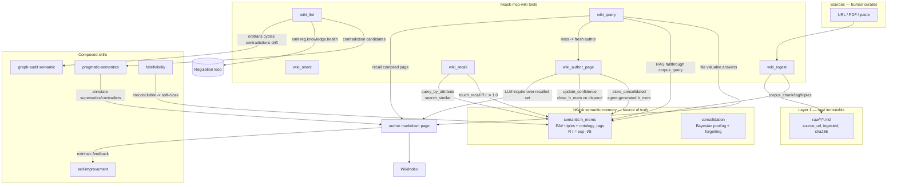

# Semantic Memory Wiki — `hkask-mcp-wiki`

A new MCP server + FlowDef skill that builds a persistent, compounding,
human-navigable knowledge base as interlinked markdown pages, where **writing
the wiki is itself the act of consolidating, correcting, and augmenting the
agent's semantic memory** — and the markdown page is the human-facing artifact
that *aligns* with that memory.

**Status:** Proposed. No code exists yet. This document is the review artifact.

**One-line pitch:** the wiki entry is the *organizing mechanism* for a
memory-augmentation loop. The agent reasons over recalled semantic h_mems,
authors a page (correcting gaps, refreshing decayed recall, appending new
synthesis), and writes the result back as new semantic h_mems. The page is both
the trace of that consolidation and the human-navigable surface that stays in
sync with the agent's memory. This composes zed-kask's existing memory,
ontology-tagging, salience, and graph-audit machinery into one loop, in a
shape grounded in the industry consensus pattern (Cognee / Mem0 / GraphRAG)
rather than any single prior model.

---

## 1. Goals & non-goals

### Goals

1. A **human-readable, browseable** knowledge surface (markdown pages +
   typed `[[wikilinks]]` + index + log) that *aligns with* the agent's semantic
   memory — a human can navigate what the agent knows.
2. **Wiki-authoring as memory work.** Writing a page is the mechanism by which
   the agent: explores the semantic neighborhood (LLM inquiry over recalled
   h_mems), completes knowledge (fills gaps), corrects inconsistencies,
   augments with new synthesis, **refreshes** decayed recall, and enriches
   relationships. The page is the *organizing scaffold* for this loop, not a
   passive read-out.
3. **Memory writeback closes the loop.** The page's synthesis is written back
   as new semantic h_mems (agent-generated facts, first-class), so the
   agent's memory and the wiki co-evolve. When the skill execution is parsed
   into memory, the composition loop closes: wiki-writing → memory-augmentation.
4. **Page-level provenance/confidence/contested** as frontmatter, *computed*
   from the underlying memory dynamics (recall strength, salience, decay) — not
   hand-labeled.
5. **Wiki lint as a Regulation sense surface** — KB health (orphans, broken
   links, contradictions, staleness, drift) as a cybernetic signal consumed by
   a regulation loop, not a periodic chore.
6. Reuse existing MCP servers (`corpus_*`) and skills (`graph-audit`,
   `pragmatic-semantics`, `falsifiability`, `self-improvement`) by composition;
   avoid reimplementing their logic.

### Non-goals (v1)

- A settings UI sub-page for `kask.wiki.*` (env vars only until a second
  consumer appears — see §13).
- Real-time streaming output blocking (the wiki is a stored artifact, not a
  stream; `GuardedStream` semantics do not apply).
- Replacing `corpus_query` RAG. The wiki query is a *recall-then-improve* layer
  over RAG, not a replacement (see §8, Idea G — reframed).
- Overwriting memory in place. Per the ADD-only lesson (§3), the loop
  *appends* temporal versions and lets retrieval rank; it does not mutate a
  single current record except for confidence correction / soft-close on hard
  disproof.

---

## 2. Prior-art survey (why this generalizes, not replicates Hermes)

The Hermes `llm-wiki` skill is one point in a spectrum. Surveying the
industry leaders (verified 2026-08-02) shows where Hermes is idiosyncratic and
where there is consensus, so the design composes the generalizable pattern.

### 2.1 The spectrum

| Project | Model | Authoring | Human artifact? |
|---|---|---|---|
| **Khoj** (`khoj-ai/khoj`, 36k⭐) | "AI second brain": RAG over your *existing* markdown/Obsidian/org/notion vault | None — reads human files | Yes (the human's own) |
| **Mem0** (`mem0ai/mem0`, 62k⭐) | Universal memory layer; **ADD-only** algorithm (Apr 2026) | Agent extracts facts, appends | No (internal store) |
| **GraphRAG** (`microsoft/graphrag`, 35k⭐) | Indexing pipeline → knowledge graph → community summaries → hierarchical retrieval | Indexing only | No (internal graph) |
| **Cognee** (`topoteretes/cognee`, 30k⭐) | Memory platform: `remember / recall / forget / improve`; graph evolves | `improve` refines the graph | Optional |
| **Hermes `llm-wiki`** | Agent authors every page; updates overwrite in place | Full authoring | Yes (markdown + wikilinks) |

### 2.2 The generalizable pattern (consensus) vs Hermes's idiosyncrasies

| Dimension | Hermes (idiosyncratic) | Consensus (Mem0/Cognee/GraphRAG) | Our design |
|---|---|---|---|
| **Mutability** | update pages in place; overwrite | ADD-only, append temporal versions; retrieval ranks the right dated instance (Mem0); graph evolves (Cognee) | **Append + temporal retrieval**; superseded pages are kept, not destroyed; `update_confidence`/soft-close only on hard disproof |
| **Memory model** | wiki files ARE the memory | memory is a graph/vector store; any artifact is a *view* (Cognee, Mem0, GraphRAG) | h_mem store is the memory; wiki is a projection **plus** a writeback surface |
| **Authoring** | agent authors every page | `improve`/`cognify` as an active refinement op (Cognee); agent-generated facts first-class (Mem0) | **Wiki-authoring IS the `improve` operation**; the page is its trace + the alignment artifact |
| **Retrieval** | read index → read pages → synthesize | multi-signal fusion (semantic + BM25 + entity) + temporal (Mem0); community + local (GraphRAG) | compiled-page-first (recall) then multi-signal RAG fallthrough; miss triggers a fresh `improve` |
| **Artifact** | markdown + wikilinks | internal graph (Khoj is the exception — reads human files) | **Both**: produce the human markdown AND drive the graph memory (none of the four does both) |
| **Ontology** | freeform tag taxonomy in SCHEMA.md | cognitive-science/ontology-grounded (Cognee); community ontology (GraphRAG) | We already have ontology anchoring (Dublin Core/PKO/FIBO/GOLEM/ESO); SCHEMA is config, not the ontology |

### 2.3 What is genuinely novel here

None of the four closes the loop as: *authoring a human-readable page IS the
act of consolidating memory, and that page is the alignment surface between
agent memory and human navigation.* Cognee improves an internal graph; Mem0
stores facts; GraphRAG indexes; Khoj reads existing files. We **author a page
that is the consolidation** and **aligns memory with a human artifact**, while
**appending** (not overwriting) per Mem0 and **improving** per Cognee.

### 2.4 Lessons applied (corrections to v0.1)

- **Idea B (was: OT-rank + demote loser)** → **append + temporal retrieval
  ranks** (Mem0 ADD-only). Keep both claims; mark the older `superseded`;
  OT-ranking *annotates* the relationship but does not *destroy* the older
  memory. `update_confidence`/`close_h_mem` only on hard disproof.
- **Idea G (was: wiki as cache)** → **wiki as recall-then-improve loop**. A
  cache miss that enriches the cache is not a cache, it's a learning loop
  (Cognee `improve`, Mem0 agent-generated-facts-first-class). A query miss
  triggers a fresh page-authoring that writes back new h_mems.
- **`touch_recall` as refresh** (grounded, new): authoring a page calls
  `SemanticMemory::touch_recall` on every h_mem pulled in — recall resets the
  decay clock `R(t)→1.0`. **Authoring the wiki is literally spaced-repetition
  for the agent's memory.** This is the mechanism behind "refreshing" in the
  goal, and it already exists in `hkask-memory/src/semantic.rs` (L226-228).

---

## 3. The central model: wiki-authoring as memory augmentation

Restating the design precisely (this replaces the v0.1 "hybrid projection"
framing):

> The wiki is a **projection of semantic memory, augmented and checked against
> LLM inquiry**, where the **composition process is itself generating semantic
> memory**. Writing the wiki is a memory-augmentation exercise — correction,
> augmentation, refreshing, enrichment — organized around producing a markdown
> wiki entry as the **organizing mechanism** to accomplish the memory work,
> AND as the **human-accessible artifact that aligns with the agent's semantic
> memory**.

Concretely, the authoring loop for one page:

```
1. RECALL   — query semantic h_mems for the page's entity/concept
              (query_by_attribute, search_similar, find_existing_by_eav)
2. REFRESH  — touch_recall on each recalled h_mem  →  R(t) := 1.0
              (authoring IS the recall that resets the forgetting clock)
3. INQUIRE  — LLM reasoning over recalled h_mems; identify gaps, conflicts,
              stale claims; cross-check against raw sources + corpus_query RAG
4. CORRECT  — for disconfirmed h_mems: update_confidence (or close_h_mem on
              hard disproof); for conflicts: append a superseding h_mem with
              temporal marker (ADD-only, not overwrite)
5. SYNTHESIZE — author the markdown page from the corrected+augmented set;
              attach provenance (h_mem_refs, sources), computed confidence,
              salience, typed wikilinks
6. WRITEBACK — store_consolidated: the page's synthesis becomes a NEW semantic
              h_mem (agent-generated fact, first-class), provenance → source
              h_mem IDs; bump page h_mem into the graph
7. ORIENT-FUTURE — update index.md + log.md; emit reg.knowledge.* spans
```

Steps 1–6 are the `improve` operation (Cognee) realized as page-authoring
(Hermes/Khoj artifact) with ADD-only writeback (Mem0). Step 2 is the novel
refresh mechanic grounded in the existing forgetting-curve primitive.

**The page is not the source of truth; the h_mem store is.** The page is the
*alignment artifact* — a human can read it to see what the agent has
consolidated, and the agent's memory and the wiki co-evolve because authoring
writes back. Deleting a page and re-authoring from h_mems reproduces an
equivalent page (regenerable), but the *h_mems the page produced* persist.

### 3.1 Projection vs augmentation — reconciled

v0.1 framed this as "hybrid projection (entity/concept projected; comparison/
query curated)." The corrected framing: **all pages are authored through the
augmentation loop**; the difference is only *who triggers* authoring:
- **Entity/Concept pages**: triggered by ingest/promotion (salience-gated) or
  by a query miss. Authored by the loop above; regenerable.
- **Comparison/Query pages**: triggered by a user question or explicit
  synthesis request. Authored by the same loop (they still recall, refresh,
  writeback); these carry more human/agent judgment in the synthesis step but
  are *not* exempt from the memory loop.

There is no "curated, never touched by memory" tier — every page refreshes and
writes back. This is cleaner and matches Cognee (everything `improve`s).

---

## 4. Data model

### 4.1 Wiki directory layout

```
<HKASK_WIKI_PATH>/              # default: kask/corpus/wiki/<domain>/  (per-userpod)
├── SCHEMA.md                   # domain config, tag taxonomy, page-threshold policy
├── index.md                    # sectioned content catalog, one-line summaries
├── log.md                      # append-only action log (rotated at 500 entries)
├── raw/                        # Layer 1 — immutable sources
│   ├── articles/  papers/  transcripts/  assets/
├── entities/                   # authored via the augmentation loop
├── concepts/
├── comparisons/
├── queries/
└── _archive/                   # superseded pages (kept, not deleted — ADD-only)
```

### 4.2 Page frontmatter

```yaml
---
title: Page Title
created: YYYY-MM-DD
updated: YYYY-MM-DD
type: entity | concept | comparison | query
tags: [TaxonomyTag, ...]        # MUST appear in SCHEMA.md taxonomy (enforced)
sources: [raw/articles/...md]   # provenance to raw
sha256: <hex>                   # body hash for drift detection
# Computed from memory dynamics (not hand-labeled):
confidence: 0.0..1.0            # aggregate of source h_mems' R(t)=exp(-t/S)
salience: 0.0..1.0             # compute_salience_batch over entity co-occurrence
last_refreshed: YYYY-MM-DD     # last time touch_recall ran on its h_mems
h_mem_refs: [HMemId, ...]      # h_mems this page was authored from
produced_h_mem: Option<HMemId>  # the agent-generated h_mem this page wrote back
# Relationship signals (set by lint/authoring):
contested: true
superseded_by: slug             # older claim; both kept (ADD-only), retrieval ranks
contradictions: [slug, ...]
---
```

### 4.3 Typed wikilinks (the graph edges)

```
[[wikilink]]                  generic
[[entity:<taxon>/<slug>]]      typed entity ref  — entity linking across memories (Mem0)
[[sources_from:raw/...]]       provenance edge
[[composes:skill]]             delegation edge (dogfood, §11 Idea I)
[[supersedes:slug]]            temporal — BOTH pages kept; cycles are lint errors
[[contradicts:slug]]           feeds contradiction annotation (Idea B, reframed)
[[supports:slug]]              corroborating edge
```

Typed links make the wiki a **second knowledge graph** that `graph-audit`'s
semantic mode audits directly (orphans, cycles on `supersedes`, redundancy,
gaps) — reusing an existing convergent skill. `[[entity:...]]` is Mem0's
"entity linking across memories" realized as a typed edge.

### 4.4 In-memory graph (mirrors `IndexPipeline`)

```
Page  { slug, path, title, created, updated, page_type, tags, sources,
        confidence, contested, contradictions, superseded_by, sha256,
        line_count, salience, last_refreshed, h_mem_refs, produced_h_mem }
Link  { from: slug, to: slug, kind: TypedRelation, provenance: Option<raw/...> }
LinkGraph { adjacency + reverse_adjacency (backlinks), like codegraph forward/reverse }
```

Persisted to `HKASK_WIKI_DB` (SQLite + `sqlite-vec` for page embeddings — same
deps as codegraph). `indexedonce: AtomicBool` + `ensure_indexed()` fast-path
copied from codegraph; `wiki_reindex` forces a fresh walk.

---

## 5. Architecture



---

## 6. Where it lives (crate layout)

```
kask/mcp-servers/hkask-mcp-wiki/
  Cargo.toml
  README.md
  src/
    hkask_mcp_wiki.rs          # mcp_server! + #[tool_router] + tools (mirrors codegraph)
    main.rs                    # run_server entry (mirrors codegraph/src/main.rs)
    wiki/
      index.rs                 # WikiIndex: parses markdown dir -> graph (mirrors IndexPipeline)
      graph.rs                 # Page/Link/LinkGraph types, traversal, orphans/backlinks/cycles
      frontmatter.rs           # YAML frontmatter schema + validation (taxonomy enforcement)
      memory.rs                # SemanticMemory handle: recall / touch_recall / writeback
      author.rs                # the augmentation loop (recall->refresh->inquire->correct->synthesize->writeback)
      drift.rs                 # sha256 re-ingest idempotency (raw/ trick)
      promote.rs               # salience-gated page promotion (Idea D)
      confidence.rs            # decayed-recall confidence aggregation (Idea C, reframed)
  tests/
    *.rs
```

`[lib] path = "src/hkask_mcp_wiki.rs"` and `[[bin] path = "src/main.rs"` —
exactly the codegraph layout (`.rules`: no `mod.rs`, `[lib] path` in
`Cargo.toml`).

**Registration touches (existing, well-trodden path):**

- `Cargo.toml` `[workspace.members]` → add `"kask/mcp-servers/hkask-mcp-wiki"`.
- `kask/scripts/build/mcp-servers.txt` → add the package (release single source
  of truth).
- `kask/crates/kask_bridge/src/mcp_servers.rs` `BUILT_IN_MCP_SERVERS` → new
  entry (§7).
- `kask/scripts/check-mcp-servers.sh` → already verifies txt↔const parity.

**No D-seam edits.** Purely additive under `kask/` (§13.1 invariant holds —
hKask crate, no zed-kask deps).

---

## 7. Server registry entry — CORRECTED (read+write memory needs the DB passphrase)

Per `.rules` ("New servers must use `Some(&[])` and add env vars as needed";
"allowlists must align with actual env-var reads"): the wiki server **reads and
writes the SQLCipher-encrypted semantic store**, so it needs the DB passphrase
as a credential — this is *not* a keyless server like codegraph.

```rust
BuiltinMcpServer {
    id: "wiki",
    binary: "hkask-mcp-wiki",
    description: "Wiki — semantic-memory knowledge base; authoring augments and aligns memory",
    credentials: Some(&["HKASK_DB_PASSPHRASE"]),   // opens the pod's SQLCipher semantic store
    config_env: Some(&[
        "HKASK_WIKI_PATH",                         // wiki root (default via resolve_under_data_dir)
        "HKASK_WIKI_DB",                           // persistent graph index (mirrors HKASK_CODEGRAPH_DB)
        "HKASK_DB_PROVIDER",                       // sqlite | postgres
        "HKASK_DB_PATH",                           // semantic store path (sqlite)
        "HKASK_DATABASE_URL",                     // semantic store URL (postgres)
        "HKASK_MEMORY_LIFE_DAYS",                 // confidence-from-decay reads S
        "HKASK_EMBEDDING_DIM",                    // re-embed new pages for semantic dedup
        "HKASK_EMBEDDING_MODEL",
        "HKASK_DATA_DIR",                          // resolve_under_data_dir for default wiki root
        "HKASK_WEBID",                             // Regulation narrative identity (semantic visibility scoping)
    ]),
},
```

**Embeddings** route through the IPC bridge (`InferenceIpcClient` → zed's
`LanguageModelEmbeddingPort`), exactly as `codegraph_index_embeddings` does —
so no provider API keys in the credentials allowlist.

### 7.1 Privacy boundary (enforced, pinned)

The wiki server reads/writes **semantic (Shared, perspective-free) h_mems
ONLY**, never episodic (Private, user-perspective). Rationale: the wiki is a
third-person knowledge surface; D6 separates episodic (Private) from semantic
(Shared). A compromised wiki process must not read user-perspective memory.
Pin by a test (§12) in the style of the existing `qa-memory-privacy-boundary`
manifest — that boundary is already a tested concern; add a wiki-specific pin.

### 7.2 Concurrency

The wiki MCP server (child process) and the `MemoryPort` (GPUI foreground via
the bridge) both open the same SQLite semantic DB. Requires WAL mode +
retry-on-`SQLITE_BUSY`. `hkask-storage` already supports concurrent access
(the `consolidation_service` reads/writes the same store the episodic loop
does). Verify WAL is enabled for the semantic store; flag as an implementation
concern, not a blocker. The wiki server uses short read transactions for
`touch_recall`/`query_*` and serialized write transactions for
`store_consolidated`/`update_confidence`.

---

## 8. Tool surface

All tools use the `#[tool(description = "...")] pub async fn ... (self,
Parameters(req): Parameters<XRequest>) -> String` + `execute_tool(self, "...",
async { ... })` pattern verbatim from codegraph.

The tool set is reorganized around the augmentation loop (recall → refresh →
inquire → correct → synthesize → writeback) rather than the v0.1
compile/cache framing.

| Tool | Purpose | Memory ops |
|---|---|---|
| `wiki_orient` | Read SCHEMA + index + last-N log. **Always first** (pinned by manifest precondition). | — |
| `wiki_ingest` | Capture a raw source → `corpus_convert`/`chunk`/`tag_chunks`/`extract_triples` → `raw/` with `source_url`/`ingested`/`sha256`. `drift.rs` skips if hash unchanged, flags if changed. | writes semantic h_mems via corpus pipeline |
| `wiki_recall` | Recall semantic h_mems for an entity/concept: `query_by_attribute`, `search_similar`, `find_existing_by_eav`. Returns the set + per-h_mem `R(t)`. | **read** |
| `wiki_refresh` | `touch_recall` on a set of h_mem IDs → `R(t):=1.0`. **Authoring IS the recall that resets the forgetting clock** (the refresh mechanic, §3 step 2). | **write (decay clock)** |
| `wiki_author_page` | The augmentation loop over one slug: recall → refresh → LLM inquire → correct → synthesize markdown → writeback. Idempotent; emits a page-set diff for convergence. ADD-only writeback. | **read + write** |
| `wiki_correct` | For a disconfirmed h_mem: `update_confidence`; for hard disproof: `close_h_mem`; for a superseding claim: `store_consolidated` (append, temporal). `pragmatic-semantics` annotates the relation; `falsifiability` for irreconcilable pairs. | **write** |
| `wiki_writeback` | `store_consolidated`: the page's synthesis becomes a NEW agent-generated semantic h_mem, provenance → source h_mem IDs. (Usually called inside `wiki_author_page`; exposed standalone for re-filed queries.) | **write** |
| `wiki_query` | **Recall-then-improve**: hit compiled pages (cheap, consistent); on miss fall through to `corpus_query` RAG AND trigger a fresh `wiki_author_page` (a miss enriches memory, §2.4 G reframed). Returns `hit: page\|rag\|fresh_author`. | read + (write on miss) |
| `wiki_backlinks` | All pages linking *to* a slug, by relation kind. | — |
| `wiki_orphans` | Pages with zero inbound links. | — |
| `wiki_contradictions` | Pairs sharing tags/entities with conflicting claims + `contested`/`contradictions` frontmatter. Candidates for `wiki_correct` (Idea B, reframed: annotate + append, not demote). | — |
| `wiki_source_drift` | Recompute sha256 for `raw/`; flag mismatches. | — |
| `wiki_lint` | Full health report: orphans + broken links + index completeness + frontmatter validity + stale (>90d past newest source OR `confidence` below threshold) + contradictions + source drift + oversized (>200 lines) + tag audit + log rotation. Emits `reg.knowledge.health` spans (Idea E). | — |
| `wiki_promote` | Salience-gated: `compute_salience_batch` over the entity co-occurrence graph; salience > threshold promotes a concept from inline-mention to a page (Idea D). Returns candidates; the *skill* decides. | — |
| `wiki_feedback` | Record which pages a `wiki_query` actually used → closes the recall/improve loop and feeds `self-improvement` (Idea H). | — |

---

## 9. Skill manifest (`knowledge-wiki.yaml`)

A FlowDef cascade like `graph-audit.yaml`: gas/rjoule/convergence blocks, OCAP
`required_capabilities` listing every `resource mcp / action call / tool wiki_*`
plus the composed skill manifests (`pragmatic-semantics`, `falsifiability`),
`ledger` emitting `reg.skill.knowledge-wiki` spans, `audit` block.

**Per `.rules` traps:**

- **No `fusion` block** (omit entirely; operator configures the panel via
  `kask.fusion.panel_models`). Comment where the block would have been to
  document any mode/skill-anchor recommendation.
- `category: skill` so it can bind as an agent `process_manifest`.
- `task` injected into cascade context (the "Skill cascade context must carry
  the user's task" trap).

**Cascade (convergent PDCA, Cauchy on the page-set + lint-severity diff):**

| ord | action | template_ref | purpose |
|---|---|---|---|
| 1 | select | `knowledge-wiki/orient` | `wiki_orient` (precondition: wiki exists) |
| 2 | select | `knowledge-wiki/ingest` | `wiki_ingest` (if sources provided) |
| 3 | compute | `kata.convergence_check` | did ingest change anything? |
| 4 | select | `knowledge-wiki/promote` | `wiki_promote` (salience gates new pages) |
| 5 | select | `knowledge-wiki/author` | `wiki_author_page` for each stale/promoted slug (the augmentation loop) |
| 6 | select | `knowledge-wiki/lint` | `wiki_lint` |
| 7 | select | `knowledge-wiki/contradict` | `wiki_contradictions` → **delegation to `pragmatic-semantics`** (annotate, not demote) + `falsifiability` (irreconcilable → `wiki_correct` soft-close) |
| 8 | select | `knowledge-wiki/query` | `wiki_query` (if user asked) + file-back to `queries/` (Idea H) |
| 9 | compute | `kata.convergence_check` | Cauchy on page-set + lint-severity diff |
| 10 | loop | — | re-enter author cycle if not converged |

Templates live in `kask/registry/templates/knowledge-wiki/*.j2`. Step 7 is
where `pragmatic-semantics` is composed for OT-ranked *annotation*
(`[[supersedes:]]`/`[[contradicts:]]`) — the corrected, ADD-only version of
Idea B: we keep both pages and let temporal retrieval rank, rather than
destroying the older one.

---

## 10. The memory-augmentation loop, grounded in existing code

| Loop step | Existing primitive | Location |
|---|---|---|
| Recall | `SemanticMemory::query_by_attribute`, `search_similar`, `find_existing_by_eav` | `hkask-memory/src/semantic.rs` L395-461, L306-329 |
| Refresh | `SemanticMemory::touch_recall` (resets decay clock `R(t):=1.0`) | `hkask-memory/src/semantic.rs` L226-228 |
| Correct (confidence) | `SemanticMemory::update_confidence` | L344-359 |
| Correct (disprove) | `SemanticMemory::close_h_mem` (soft-delete via `valid_to`) | L985-988 |
| Append (supersede) | `SemanticMemory::store_consolidated` (new h_mem, provenance) | L271-288 |
| Confidence aggregation | `hkask-memory::consolidation` (Bayesian log-odds pooling) + `memory_life_days` (Wozniak `exp(-t/S)`) | `hkask-memory/src/consolidation.rs` |
| Salience promotion | `hkask-memory::salience::compute_salience_batch` (MMR/LexRank/clustering) | `hkask-memory/src/salience.rs` |
| Raw capture | `corpus_convert`/`chunk`/`tag_chunks`/`extract_triples` | `hkask-mcp-corpus` |
| RAG fallthrough | `corpus_query` | `hkask-mcp-corpus/src/tools/storage.rs` |
| Link-graph audit | `graph-audit` semantic mode | `kask/registry/manifests/graph-audit.yaml` |
| Contradiction annotation | `pragmatic-semantics` (OT ranking) + `falsifiability` | `kask/registry/manifests/{pragmatic-semantics,falsifiability}.yaml` |
| Self-improvement closure | `self-improvement` (extrinsic evaluative feedback) | `kask/registry/manifests/self-improvement.yaml` |

Every step of the loop reuses an existing primitive; the server is the
*integration layer* that wires them into the authoring loop, not a
reimplementation.

---

## 11. Compositions (the ideas, revised)

| # | Composition | Status | Grounding |
|---|---|---|---|
| A | **Wiki-authoring as the `improve` operation** (recall→refresh→inquire→correct→synthesize→writeback) | core (v1) | Cognee `improve` + Mem0 agent-generated-facts; `hkask-memory` primitives |
| B | **Contradiction handling = annotate + append, not demote** (was: OT-rank + demote) | revised (v1) | Mem0 ADD-only; `pragmatic-semantics` annotates; `falsifiability` → soft-close on hard disproof |
| C | **Confidence from decayed recall** — page confidence = aggregate of source h_mems' `R(t)`; **authoring refreshes it via `touch_recall`** | v1 | `hkask-memory::consolidation` + `touch_recall` (L226) |
| D | **Salience-gated promotion** | v1 | `compute_salience_batch` (`hkask-memory/src/salience.rs`) |
| E | **Wiki lint as a Regulation sense surface** (`reg.knowledge.health`) | v1 (span emission); v2 (loop wiring) | `reg.*` spans; regulation loop sense input |
| F | **Typed-wikilink graph audit** via `graph-audit` semantic mode | v1 | `graph-audit` semantic mode |
| G | **Recall-then-improve** (was: cache hit-rate) — a query miss triggers fresh authoring that enriches memory | v1 | `corpus_query` + `wiki_author_page`; `wiki_feedback` records usage |
| H | **Self-improvement closure** — re-filed queries tune promotion thresholds | v2 | `self-improvement` |
| I | **Dogfood: wiki-of-skills** — point `wiki_ingest` at the 88 registry manifests; `[[composes:skill]]` edges from manifests' delegation fields for free | v1 (first corpus) | registry manifests |

---

## 12. Tests to add

Per `.rules` ("tests must pin deliberate deviations"; "advertised invariants
need enforcement points"; "`unwrap_or(0)` on regulation sense inputs is a
broken feedback loop"):

- `all_servers_have_credential_allowlist` — already covers `Some(...)` shape;
  add `wiki_credentials_only_include_db_passphrase` (the wiki server needs
  exactly one credential — the DB passphrase — and must NOT receive provider
  keys or SMTP creds).
- `wiki_reads_semantic_only_never_episodic` — **privacy boundary pin** (§7.1).
  The server must not read/write episodic (Private) h_mems.
- `wiki_frontmatter_tags_must_be_in_taxonomy` — SCHEMA enforcement point.
- `wiki_supersedes_cycle_is_lint_error` — temporal cycles caught.
- `wiki_author_is_idempotent` — same h_mem set → equivalent page; ADD-only
  writeback does not duplicate produced h_mems (dedup via
  `find_existing_by_eav`).
- `wiki_author_refreshes_recall_clock` — authoring a page sets recalled h_mems'
  `R(t):=1.0` (pins the refresh mechanic, §3 step 2).
- `wiki_correct_appends_not_overwrites` — superseding a claim creates a new
  h_mem with a temporal marker; the old one is retained (pins ADD-only, §2.4).
- `wiki_confidence_reflects_decay` — older source h_mems → lower page
  confidence; re-authoring resets (pins Idea C).
- `wiki_lint_failure_propagates_not_zero` — `reg.knowledge.health` lint
  failure = stale signal, not `unwrap_or(0)`.
- `wiki_query_recall_then_improve_on_miss` — pins the recall-then-improve
  ordering (Idea G reframed).

---

## 13. Risks, traps, and deferrals

- **The sideways `hkask-memory` dep (now read+write).** The server depends on
  `hkask-memory` and opens the pod's semantic store with the DB passphrase.
  This widens the wiki process's trust surface (it can read+write semantic
  memory) — which is its job, but must be scoped to semantic-only (§7.1, pinned).
  Alternative (keep server credentialless): add a memory-query+write IPC method
  to the bridge (like `codegraph_index_embeddings` routes embeddings). **v1
  recommendation: direct dep + passphrase** (the reframe requires writeback, and
  `touch_recall`/`store_consolidated` are cheapest in-process); promote behind
  a port only at v3 if a second consumer appears (per the "trait-with-one-impl"
  trap).
- **ADD-only vs overwrite.** The design commits to append + temporal retrieval
  (Mem0) over in-place update (Hermes). Implication: the wiki accumulates
  superseded pages in `_archive/`, and `wiki_query` must do temporal-aware
  ranking (surface the newest non-disproven version). This is more storage but
  more robust; aligns with the forgetting-curve model (old claims decay, they
  aren't deleted).
- **Concurrency (WAL).** Wiki server + MemoryPort share the SQLite semantic
  DB. Verify WAL; retry-on-busy. (§7.2)
- **Authoring cost.** `wiki_author_page` runs an LLM inquire step — gas. Gate
  behind salience promotion + staleness so only changed/stale slugs re-author
  (the convergence diff drives this). Don't re-author the whole wiki every
  turn. (Cognee and GraphRAG both warn indexing is expensive; same here.)
- **Guard layer scope.** Authoring runs inside the skill cascade, already
  wrapped by `GuardedInferencePort` (D4). `wiki_ingest`'s raw-source capture is
  an LLM input boundary — confirm the guard covers it. `GuardedStream`
  post-hoc redaction does not apply (stored artifact, not a stream).
- **Scope creep.** Regulation-surface loop wiring (E) and self-improvement
  closure (H) are compositions at the *skill* level. The server emits spans +
  records feedback; the loop wiring belongs in the manifest + a regulation
  target. Keep the server a pure tool surface.
- **`Default` impl is the single source of truth** for any settings (`.rules`
  drift trap). v1: env vars only, no `kask.wiki.*` settings section. If added,
  defaults live in a `Default` impl, not `#[serde(default=...)]` or `mcp_env()`
  literals.

---

## 14. Phasing

**v1 — augmentation-loop core + cheap compositions (MVP):**
`wiki_orient`, `wiki_ingest`, `wiki_recall`, `wiki_refresh`, `wiki_author_page`,
`wiki_correct`, `wiki_writeback`, `wiki_query`, `wiki_backlinks`,
`wiki_orphans`, `wiki_contradictions`, `wiki_source_drift`, `wiki_lint`,
`wiki_promote` (Idea D, cheap). Dogfood as wiki-of-skills (Idea I) on the 88
registry manifests as the first real corpus. This is a strong, coherent
deliverable: the agent's memory improves as it authors wiki pages about the
skill corpus.

**v2 — closures layered on:**
- Regulation sense wiring (Idea E) — a `reg.knowledge.health` target consumed
  by a regulation loop; corrective action = next author/ingest turn.
- Self-improvement closure (Idea H) — manifest step 8 file-back + threshold
  tuning from `wiki_feedback`.
- Temporal-aware retrieval ranking in `wiki_query` (full ADD-only benefit).

**v3 — port promotion:** if a second consumer of the memory primitives
materializes, promote `recall`/`touch_recall`/`store_consolidated` to a
`hkask-types` trait injected via the bridge (addresses "trait-with-one-impl").

---

## 15. Open questions for review

- **Q1 (resolved) — projection vs source-of-truth.** Neither: the wiki is a
  **memory-augmentation loop** — authoring IS memory work, the page is the
  alignment artifact + the trace, the h_mem store remains source of truth,
  writeback closes the loop. (Was "hybrid projection" in v0.1; reframed per
  reviewer direction + prior-art survey.)
- **Q2 — Where does the wiki live?** `kask/corpus/wiki/<domain>/` (per-userpod
  sovereign, matching D6) recommended. Confirm.
- **Q3 (resolved, mechanism deferred to implementer) — read memories
  directly.** The server depends on `hkask-memory`, opens a `SemanticMemory`
  handle on the pod's semantic store (path via `HKASK_DB_PATH` /
  `HKASK_DATABASE_URL`, passphrase via `HKASK_DB_PASSPHRASE`), scoped to
  **semantic-only** (privacy boundary pinned, §7.1). Uses `query_*` /
  `search_similar` / `find_existing_by_eav` (read), `touch_recall` (refresh),
  `store_consolidated` / `update_confidence` / `close_h_mem` (writeback).
  Direct-dep chosen over a bridge IPC method because the reframe requires
  writeback and the primitives are cheapest in-process; revisit at v3 if a
  second consumer appears.
- **Q4 — Is wiki-of-skills (Idea I) the v1 scope?** Recommended: yes — fastest
  path to real value, validates the design on data that already exists.
- **Q5 — Scope of ADD-only.** Confirm the design should append + temporal-rank
  (Mem0) rather than overwrite (Hermes). This commits to `_archive/`
  accumulation + temporal retrieval. (Recommended: yes.)

---

## 16. References

### Prior art (the spectrum, §2)
- Khoj — `khoj-ai/khoj` (36k⭐): AI second brain; RAG over existing
  markdown/Obsidian vault; zero authoring.
- Mem0 — `mem0ai/mem0` (62k⭐): universal memory layer; April 2026 ADD-only
  algorithm; agent-generated facts first-class; entity linking; temporal
  retrieval. Paper: arXiv:2504.19413.
- GraphRAG — `microsoft/graphrag` (35k⭐): indexing pipeline → knowledge graph
  → community summaries → hierarchical retrieval; no human artifact.
- Cognee — `topoteretes/cognee` (30k⭐): memory platform with
  `remember/recall/forget/improve`; graph evolves; ontology-grounded. Paper:
  arXiv:2505.24478 (Markovic et al., 2025).
- Hermes `llm-wiki` — `NousResearch/hermes-agent` v2.1.0: agent-authored
  markdown wiki, update-in-place (the idiosyncrasy this design corrects).

### zed-kask substrate
- `kask/mcp-servers/hkask-mcp-codegraph` — architecture to mirror (index dir →
  graph → tools; `mcp_server!` + `#[tool_router]` + `execute_tool`).
- `kask/crates/kask_bridge/src/mcp_servers.rs` — server registry + allowlist
  conventions.
- `kask/crates/hkask-memory/src/semantic.rs` — `query_by_attribute` (L395),
  `search_similar` (L455), `find_existing_by_eav` (L306), `touch_recall` (L226,
  the refresh primitive), `store_consolidated` (L271), `update_confidence`
  (L344), `close_h_mem` (L985).
- `kask/crates/hkask-memory/src/{consolidation,salience}.rs` — Bayesian pooling
  + Wozniak `exp(-t/S)`; `compute_salience_batch`.
- `kask/mcp-servers/hkask-mcp-corpus` — `corpus_*` tools composed by the wiki.
- `kask/registry/manifests/graph-audit.yaml` — FlowDef cascade + semantic-mode
  lint reuse (Idea F).
- `kask/docs/architecture/salience-specification.md` — `compute_salience_batch`
  (Idea D grounding).
- `DIVERGENCE.md` §13.1 — hKask crates never depend on zed-kask; sole
  bidirectional seam is `kask_bridge` (D8). D6 — per-pod semantic/episodic
  split (privacy boundary basis).
- `.rules` traps cited: "Kask MCP server credentials are scoped per-server";
  "MCP server allowlists must align with actual env-var reads";
  "trait-with-one-impl is speculative generality"; "advertised invariants need
  enforcement points"; "`unwrap_or(0)` on regulation sense inputs is a broken
  feedback loop"; "Manifests must not hardcode model names in the fusion block";
  "Skill cascade context must carry the user's task"; "Kask settings defaults
  must live in `Default` impls".