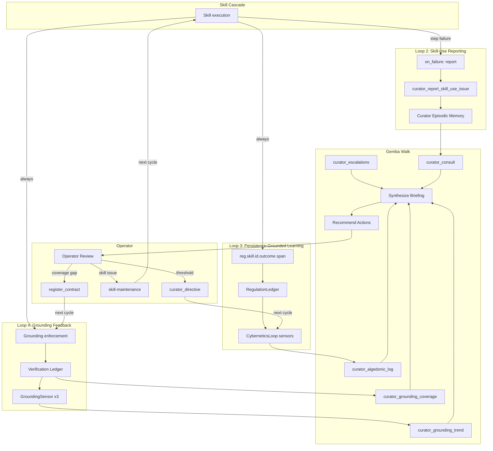

# Skill–MCP Co-Evolution Feedback Loops

> **⚠️ Deprecated 2026-08-20.** Skill execution is upstream-Zed body
> injection (`SkillTool::run` → `render_skill_envelope`).
>
> The calibration loop (Loop 1, forecast outcomes → adjusted priors) and the
> regulation-threshold loop (Loop 4) survive in reduced form. Retained for
> historical reference.

## Overview

This document describes the four feedback loops that connect skill outcomes,
grounding enforcement, and the cybernetic regulation system into a co-evolutionary
cycle. The design is **human-in-the-loop**: the system surfaces signals; the
operator decides actions. No loop autonomously modifies a skill manifest, tightens
a grounding contract, or adjusts a regulation threshold without operator approval.

The loops are grounded in the methodology of *Verification for Agent Ecologies*
(§4.1: "is this getting better?"; §6: "coverage is itself a metric") and the
Toyota Improvement Kata (grasp current condition → establish target → experiment
→ measure gap).

---

## Loop 1: Calibration (Forecast Outcomes → Adjusted Priors)

**Status:** Wired. Existing infrastructure.

**Path:**
1. A skill cascade (e.g. `superforecasting`) produces a forecast with a
   probability and a horizon.
2. When the horizon elapses, `forecast_record` records the actual outcome
   alongside the forecast.
3. `scenario_score` computes Brier scores for the forecast against the outcome.
4. `scenario_calibration` aggregates Brier scores into a calibration curve.
5. The gemba walk can query calibration curves per skill to surface
   over/under-confidence patterns.
6. The operator adjusts priors or Fermi decomposition weights in the skill's
   manifest based on the calibration signal.

**Key tools:** `forecast_record`, `scenario_score`, `scenario_calibration`,
`forecast_list`, `forecast_get`.

**Lead metric:** Brier score (lower is better). The calibration curve shows
whether the forecaster is overconfident (forecast probability > actual frequency)
or underconfident.

---

## Loop 2: Skill-Use Reporting (Skill Failures → Curator Memory → Gemba Walk)

**Status:** Wired. Existing infrastructure.

**Path:**
1. A skill cascade step fails (tool error, timeout, parse failure).
2. If the step's `on_failure` config has `action: report`, the step machine
   calls `curator_report_skill_use_issue` with the skill name, tool name,
   step ordinal, and error message.
3. The curator stores the issue as an episodic h_mem with entity
   `skill_use_issue:<skill_name>`.
4. The gemba walk's step 3 (`curator_consult`) retrieves accumulated skill-use
   issues as a proxy signal for skill health.
5. The briefing's per-skill digest classifies each skill as healthy / watch /
   intervene based on issue count and escalation references.
6. The operator decides whether to run `skill-maintenance`, issue a
   `curator_directive`, or observe further.

**Key tools:** `curator_report_skill_use_issue`, `curator_consult`,
`curator_memory_recall`.

**Lead metric:** Issue count per skill (raw count, deletion-resistant). The
health classification (healthy / watch / intervene) is derived and therefore
gameable — the raw count is the protected signal.

**Known gap:** Skill feedback spans (`reg.skill.<id>.outcome`,
`reg.skill.<id>.convergence`) live in the in-memory `RegulationLedger` and are
not exposed via MCP. The gemba walk notes this gap explicitly in the briefing's
`signal_channel_gaps` section. Exposing skill feedback aggregates via MCP is a
follow-up task.

---

## Loop 3: Persistence-Grounded Learning (Skill Outcomes → Drift Detection → Threshold Adjustments)

**Status:** Wired. Existing infrastructure.

**Path:**
1. Skill execution records `reg.skill.<id>.outcome` and
   `reg.skill.<id>.convergence` spans to the `RegulationLedger` after each
   cascade.
2. The `CyberneticsLoop`'s sensors read from the `RegulationLedger` to detect
   drift (e.g. a skill whose convergence rate is declining over time).
3. When drift is detected, the regulation loop produces an algedonic alert
   that surfaces in the gemba walk's step 1 (`curator_algedonic_log`).
4. The operator reviews the alert and decides whether to adjust thresholds
   via `curator_directive` or refine the skill via `skill-maintenance`.

**Key tools:** `RegulationLedger::record_skill_span`, `curator_algedonic_log`.

**Lead metric:** Convergence rate per skill (fraction of cascades that exit
`Converged` vs `MaxedOut` or `Escalated`). The `reg.skill.<id>.convergence`
span carries `iterations`, `exit_kind`, and `converged` fields.

**Known gap:** Same as Loop 2 — skill feedback spans are not exposed via MCP.
The `RegulationLedger` is in-memory and not queryable from the curator MCP
server. The gemba walk uses `curator_consult` (skill-use issues) as a proxy.

---

## Loop 4: Grounding Feedback (Grounding Violations → Verification Ledger → Gemba Walk → Improved Contracts)

**Status:** Wired through Phases 3 + 5. This is the new loop added by the
grounding extension.

**Path:**
1. Skill execution calls the grounding enforcement surface after each
   cascade completes (Phase 5).
2. The tool-call summary from the cascade is passed so the grounding check
   can verify that sourced fields (e.g. `deliverable_path`) were produced by
   a successful tool call.
3. Violations (nulled fields, narrative leaks) are:
   - Logged at `warn!` with `nulled_fields` and `narrative_leaks`
   - Written as `GroundingRecord`s to the central ledger (append-only,
     cross-tool, cross-server)
4. Three `GroundingSensor` instances (clean rate, coverage rate, violation
   delta) are registered in the `CyberneticsLoop`'s sensor registry. Each tick,
   they query the verification ledger and produce signals when metrics drop
   below floors.
5. The gemba walk's steps 4+5 call `curator_grounding_trend` and
   `curator_grounding_coverage` to surface grounding health.
6. The briefing includes a grounding health section with:
   - `delegations_with_zero_nulled` (lead metric — deletion-resistant, paper
     Rule 5.4)
   - `clean_rate` and `coverage_rate` (derived ratios — reported as null when
     no delegations exist, not 0.0, per "absence is not a verdict")
   - `trend_direction` (improving / stable / degrading / no_baseline)
   - `top_coverage_gaps` (agent types with delegations but no contract, paper §6)
7. The operator sees coverage gaps and degrading trends, then:
   - Registers contracts for agent types with coverage gaps
   - Queries `curator_grounding_violations` to review recent violations
   - Tightens existing contracts (adds field sources, narrows `why` requirements)
8. The next cascade's grounding enforcement uses the new/updated contracts —
   the loop closes.

**Key tools:** `curator_grounding_trend`,
`curator_grounding_coverage`, `curator_grounding_violations`,
`GroundingSensor` (3 variants).

**Lead metric:** `delegations_with_zero_nulled` (raw count, deletion-resistant).
The derived `clean_rate` ratio IS gameable (recording fewer delegations or
retiring cards with violations inflates the rate). The raw count cannot be
gamed by recording fewer delegations — it is a count of clean delegations, not
a ratio. The `curator_grounding_trend` tool surfaces this as the top-level
field before the rates.

**Env-configurable thresholds:**
- `HKASK_GROUNDING_CLEAN_RATE_FLOOR` (default 0.80) — below this, the clean-rate
  sensor fires.
- `HKASK_GROUNDING_COVERAGE_RATE_FLOOR` (default 0.50) — below this, the
  coverage-rate sensor fires.
- Both parse with `log::warn!` on failure (out-of-range and parse error),
  preserving the prior value rather than silently falling back to the default
  (the `.rules` numeric-env-var trap).

### Open gap in Loop 4

Grounding violations do **not** automatically flow to the skill-use reporting
loop (`curator_report_skill_use_issue`). The operator sees grounding violations
in the gemba walk but must manually connect "this skill produced ungrounded
output" to "this skill needs improvement."

**Proposed enhancement:** After grounding nulls a field in a skill cascade,
call `curator_report_skill_use_issue` with a "grounding violation" issue type.
This requires either:

- **Option A:** A callback from the skill execution surface to the curator
  MCP server. The executor would call `curator_report_skill_use_issue` via
  the tool port after grounding enforcement, similar to how
  `dispatch_with_retry` calls it on step failures. This closes the gap
  automatically.
- **Option B (simpler, current path):** The gemba walk's `recommend-actions`
  template already proposes `skill-maintenance` for skills with grounding
  issues (Phase 3). The operator sees the recommendation and decides to run
  `skill-maintenance`. This is the human-in-the-loop path — the operator
  connects the grounding signal to the skill improvement action.

Option B is the current design. The gemba walk's `recommend-actions` template
includes grounding-specific recommendations:
- `register_contract`: when an agent type has delegations but no contract
- `review_violations`: when the clean rate dropped or `delegations_with_zero_nulled`
  is trending down
- `investigate_leaks`: when `narrative_leaks_detected` > 0

The operator executes these recommendations in the regular conversation. This
is sufficient for the human-in-the-loop design — the operator is the decision
point, not the system.

Option A is a future enhancement that would close the gap automatically, but
it introduces a coupling between the bridge executor and the curator MCP server
that is not present today. The current design (Option B) is safer: the operator
sees both the grounding signal and the skill-use issues in the same gemba walk
briefing and makes the connection explicitly.

---

## Loop interaction diagram

---

## Design rules

1. **Human-in-the-loop.** Every loop surfaces signals to the operator via the
   gemba walk. The operator decides actions. No loop autonomously modifies a
   skill manifest, tightens a grounding contract, or adjusts a regulation
   threshold.

2. **Absence is not a verdict.** `delegations_with_zero_nulled` is the lead
   metric (deletion-resistant, paper Rule 5.4). Derived ratios (`clean_rate`,
   `coverage_rate`) are secondary and gameable. When no delegations exist,
   rates are `None`, not `0.0` — a DB outage returns `None`, not "no deviation"
   (the `.rules` broken-feedback-loop trap).

3. **Coverage is itself a metric** (paper §6). Agent types with delegations but
   no grounding contract are coverage gaps, not passes. The gemba walk surfaces
   them so the operator can register contracts.

4. **No `unwrap_or(0)` on regulation signals.** Grounding metrics are `Option`,
   not numeric with defaults. A failed query returns `None` and logs at `warn!`,
   distinguishing "not configured" from "configured but broken."

5. **The central ledger is the source of truth.** The verification ledger is
   the single source of truth for grounding records. Every MCP server that
   delegates to agents calls the grounding enforcement surface. Records are
   append-only, cross-tool, and cross-server.

6. **The six-valued grounding vocabulary** (Sourced / Inferred / Derived /
   UncommissionedInference / Narrative / Unsourced) distinguishes commissioned
   judgment from uncommissioned inference. Do not collapse
   `UncommissionedInference` into `Unsourced` — nulling an agent's legitimate
   reasoning because no tool "returned" it removes the agent's entire product.

---

## References

- *Verification for Agent Ecologies*, §4.1 ("is this getting better?"), §5.3
  (absence ≠ verdict), §5.4 (deletion-resistant metrics), §6 (coverage is a
  metric).
- Toyota Improvement Kata: grasp current condition → establish target →
  experiment → measure gap.
- `.rules` broken-feedback-loop trap: `unwrap_or(0)` on regulation signals
  returns 0 on DB outage, which the loop reads as "no deviation."
- `DIVERGENCE.md`: Kask-Zed seam definitions. Grounding changes are in `kask/`
  behind D-seams.