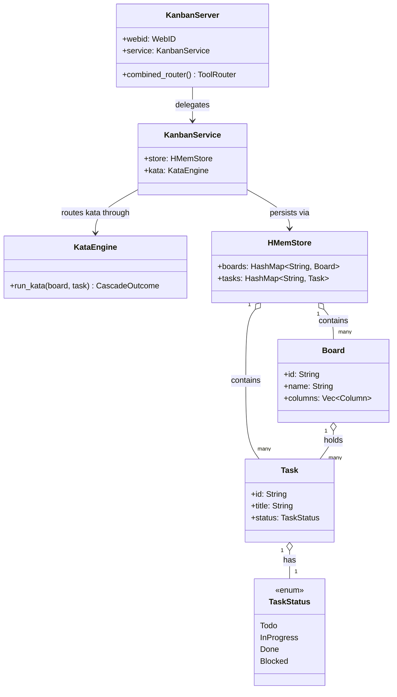

# MCP Server Registry

**Diataxis type:** Reference
**Status:** Active (v0.37.0)

> Built-in MCP servers shipped with hKask and launched by zed-kask's `context_server`
> host as child processes over stdio. Each server is a thin surface over domain crates. The binary
> entrypoint (`src/main.rs`) is a one-line `#[tokio::main]` wrapper around `<crate>::run()`; the
> library root exposes `pub async fn run()` that calls `hkask_mcp_server::run_server(name,
> version, factory, credentials)`, where `factory` receives a `ServerContext` and constructs the
> server struct. (The `McpRuntime` that dispatches and meters tool calls runs
> in-process; the MCP servers themselves are child processes over stdio.)
>
> **Hosting note (v0.32.2):** hKask runs in-process inside zed-kask. The standalone `kask mcp start
> <id>` and `kask serve` CLI surfaces have been **deleted**. MCP servers are launched by zed's
> `context_server` host as child processes over stdio; the `BUILT_IN_MCP_SERVERS` constant in
> `kask/crates/kask_bridge/src/mcp_servers.rs:330` enumerates the 10 on-disk servers. Three servers
> from the prior 13 were deleted (commit `26215d845e`): `codegraph` (folded into the `graph-audit`
> skill), `condenser` (the `hkask-condenser` crate lives; the MCP server surface was removed), and
> `media` (folded into the `logo-builder` skill's provider path). See
> [`docs/architecture/zed-host-architecture-plan.md`](../../architecture/zed-host-architecture-plan.md)
> §2.4.

## Server Catalog

10 on-disk MCP servers, **259 `#[tool]` methods** fleet-wide (verified 2026-08-20 via `grep -r "#\[tool(" kask/mcp-servers/hkask-mcp-*/src/`). The prior `tool_surface_is_exactly_N_registered_tools` pinning tests were deleted with the verification crate; counts below are `#[tool]`-attribute grep counts, not test-pinned.

| Server | Crate | Purpose | `#[tool]` methods |
|--------|-------|---------|------------------:|
| [Companies](companies.md) | `mcp-servers/hkask-mcp-companies` | FIBO-anchored financial forecasting, dual-provider routing, portfolio ledger | 45 |
| [Corpus](corpus.md) | `mcp-servers/hkask-mcp-corpus` | Corpus gathering, document processing, QA generation, style replicas | 28 |
| Curator | `mcp-servers/hkask-mcp-curator` | Curator agent metacognition (escalations, memory, regulation query, grounding trend) | 10 |
| Kata Kanban | `mcp-servers/hkask-mcp-kata-kanban` | Toyota Kata task boards | 24 |
| Portfolio | `mcp-servers/hkask-mcp-portfolio` | General-purpose transaction-ledger portfolio store (stocks, prediction-event portfolios, CMP indices) with materialized daily holdings and returns views | 14 |
| [Prediction Markets](prediction-markets.md) | `mcp-servers/hkask-mcp-prediction-markets` | Polymarket/Kalshi base rates, calibration, CMP curves, residuals | 32 |
| Research | `mcp-servers/hkask-mcp-research` | Web search, extraction, browsing, RSS feeds | 23 |
| [Scenarios](scenarios.md) | `mcp-servers/hkask-mcp-scenarios` | Event-tree forecasting (Tetlock/Schwartz/Chermack) | 21 |
| [Swarm](swarm.md) | `mcp-servers/hkask-mcp-swarm` | Agent Bestiary World swarms + Xaman Ek curator + local swarm substrate (v2 §15) | 54 |
| Training | `mcp-servers/hkask-mcp-training` | LoRA training pipeline (dataset, submit, validate, evaluate) | 8 |

> The `curator` MCP server is kept on disk but may be unloaded by default (Curator is a native
> agent, D2). All 10 build clean.

## Common Patterns

All servers follow these patterns:

1. **Bootstrap:** `main.rs` calls `<crate>::run()`, which calls `hkask_mcp_server::run_server(name, version, factory, credentials)`. The `factory: FnOnce(ServerContext) -> Result<S, McpError>` closure receives a `ServerContext` (no ambient authority — all deps injected) and constructs the server struct. There is no separate `bootstrap_mcp_server` / `MCPBootstrap` step; that API was removed along with the `HKASK_MCP_HOST` / userpod identity concept.
2. **Identity:** `ServerContext.webid: WebID` is the sole agent-identity source, resolved in transport from `HKASK_WEBID` (or an anonymous fallback). The `mcp_server!` macro generates a struct with `pub webid: WebID` plus the caller's custom domain fields — and nothing else (no `userpod`, no `daemon` field; the daemon was deleted in the 2026-07-25 cleanup and `DaemonClient` / `record_via_daemon` / `RealMemoryPort` are no longer part of the server contract).
3. **Tool dispatch:** wrap each tool body in `execute_tool(self, "tool_name", async { ... })` (or `execute_tool_semantic(self, "tool_name", Some("pko:ChangeOfStatus"), async { ... })` to tag the Regulation span with a domain ontology concept). Both emit the `reg.tool` span and serialize errors; the `reg.tool` span is the production recording surface. Thread-level memory via `RealMemoryPort` (D6) is the richer path; per-tool debug logging is available via `tracing::debug!` at the call site if a server needs it.
4. **Tool attribute:** use rmcp's built-in `#[tool(description = "...")]` on each tool method and `#[tool_router(server_handler)]` on the `impl` block that holds them (imported from `rmcp`). There is no custom `#[tool_handler(router = ...)]` attribute; per-call routing happens at the `McpRuntime` dispatch port, not on the server struct.
5. **Error type:** `McpToolError` for tool-level errors, domain `Error` enums (via `thiserror`) for computation errors.
6. **Governance:** `McpRuntime::invoke` (`crates/hkask-mcp/src/runtime.rs`) **meters and dispatches; it does not authorize.** The pipeline is: charge one call against the agent's per-tick runaway ceiling → dispatch → emit the `reg.gas.settled` span (target `reg.mcp`). Its fourth argument, `agent: WebID`, is an accounting identity, not a credential, and the only pre-dispatch refusal is `EnergyBudgetExceeded` (the runaway-loop breaker; resets each regulation tick). The former capability-match gate here was removed 2026-08-12 as vacuous — all three production mint sites derived the token's `resource_id` from the same tool name they passed to `invoke` (`security/regressions/RR-0056.yaml`). Tool authority is enforced at boundaries whose list the caller does not choose: the per-request `tool_allowlist` on the inference IPC `tool_invoke` dispatch (`crates/kask_bridge/src/inference_ipc_server.rs`, fail-closed on missing/empty), each swarm agent card's `mcp_tools` allowlist, and the per-server MCP env/credential allowlists (RR-0038). The composition root passes the `Arc<McpRuntime>` directly wherever a `ToolPort` is needed (no adapter).

## Testing standard

Every MCP server MUST include **tool-behavior contract tests** that invoke tools through their public `Parameters<T>` seam (e.g. `server.fs_read(Parameters(FsReadRequest { ... }))`), covering at minimum: the happy path, invalid input, boundary/edge cases, and error-specificity. Helper-seam-only tests (testing `sandbox_path`/services/infrastructure in isolation) are necessary but **not sufficient** — a helper-seam-only suite cannot catch tool-contract bugs (slice-index panics on bad input, canonicalize-on-non-existent, silent no-ops, error-swallowing). The kata-kanban contract test suite is the exemplar pattern.

## Cross-links

- [Companies MCP Server Reference](companies.md) — 45 `#[tool]` methods, dual-provider routing, forecast store, portfolio ledger (DIAG-RF-004 inline)
- [Corpus MCP Server Reference](corpus.md) — 28 `#[tool]` methods: corpus gathering, document processing, QA generation, style replicas
- [Prediction Markets MCP Server Reference](prediction-markets.md) — 32 `#[tool]` methods: Polymarket/Kalshi base rates, calibration loop, CMP curves
- [Scenario Forecasting Pipeline Diagram](scenarios.md) — 21 `#[tool]` methods, scenarios tool flow (DIAG-RF-005 inline)
- [Swarm MCP Server Reference](swarm.md) — 54 `#[tool]` methods (27 ABW + 25 local + 2 knowledge), dual mode (ABW cloud + local substrate), swarm-intelligence skill ecosystem (C0–C8, steering modes), consent-gated spend, algedonic wallet channel
- [Superforecasting: Layered Model](../../explanation/forecasting-and-scenarios.md) — three-layer architecture
- [MCP Tool Dispatch Sequence](../../diataxis/hkask-mcp-server/explanation.md) — MCP dispatch and governance (replaces the deleted `explanation/architecture-patterns.md`)
- Companies MCP Code Review — adversarial code review of the companies server
- Companies Semantic Graph Audit — internal module dependency graph health
- Scenarios Adversarial Review — code smell inventory for the scenarios server
- Research MCP Adversarial Review — code smell inventory for the research server
- Research MCP Adversarial Review (Follow-Up 2026-07-20) — 11 new findings: dead CapabilityContext, edit_tags feed-relabeling bug, missing transactions, stored SSRF, stub health checks; 7 follow-up items including panic-safe transactions, permissive SSRF for RSS, and circuit-breaker ADR

## Kata-Kanban Server Architecture (DIAG-IC-017)

<!-- DIAGRAM_ALIGNMENT
id: DIAG-IC-017
verified_date: 2026-08-20
verified_against: kask/mcp-servers/hkask-mcp-kata-kanban/src/hkask_mcp_kata_kanban.rs; kask/mcp-servers/hkask-mcp-kata-kanban/src/kanban/service_impl/service.rs; kask/mcp-servers/hkask-mcp-kata-kanban/src/kata.rs; kask/crates/hkask-storage/src/hmem.rs
status: VERIFIED
-->

The Kata-Kanban server pairs a kanban board store (`HMemStore` from `hkask-storage`) with a `KataEngine` that routes improvement-kata and coaching-kata skill activations against live board state. The `KataEngine` is the bridge between the skill system (D1) and the task-management surface — it reads board state as the "actual condition" and writes task transitions as the PDCA "act" step.
