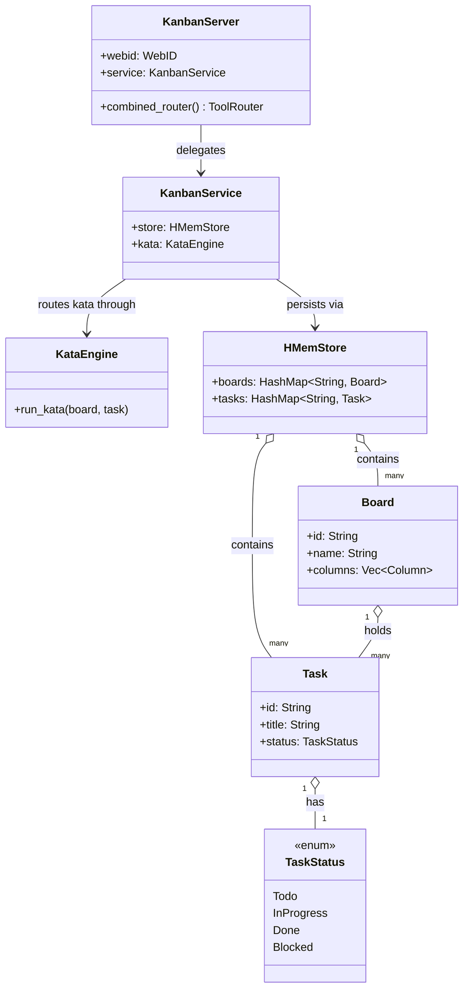

# MCP Server Registry

**Diataxis type:** Reference
**Status:** Active (v0.39.0)

> Built-in MCP servers shipped with hKask and launched by zed-kask's `context_server`
> host as child processes over stdio. Each server is a thin surface over domain crates. The binary
> entrypoint (`src/main.rs`) is a one-line `#[tokio::main]` wrapper around `<crate>::run()`; the
> library root exposes `pub async fn run()` that calls `hkask_mcp_server::run_server(name,
> version, factory, credentials)`, where `factory` receives a `ServerContext` and constructs the
> server struct. (The `McpRuntime` that dispatches and meters tool calls runs
> in-process; the MCP servers themselves are child processes over stdio.)
>
> **Hosting note (v0.32.2):** hKask runs in-process inside zed-kask. The standalone `kask mcp start
> <id>` and `kask serve` CLI surfaces have been **deleted**. MCP servers are launched by zed's
> `context_server` host as child processes over stdio; the `BUILT_IN_MCP_SERVERS` constant in
> `kask/crates/kask_bridge/src/mcp_servers.rs:55-431` enumerates the 11 on-disk servers.

## Server Catalog

11 on-disk MCP servers, **357 registered tools** fleet-wide (verified 2026-08-28; methods below).

| Server | Crate | Purpose | Tools |
|--------|-------|---------|------:|
| [Companies](companies.md) | `mcp-servers/hkask-mcp-companies` | FIBO-anchored financial forecasting, dual-provider routing, research notes and transcripts (portfolio ledger lives in the portfolio server; companies delegates to it) | 43 |
| [Corpus](corpus.md) | `mcp-servers/hkask-mcp-corpus` | Corpus gathering, document processing, QA generation, style replicas | 23 |
| Curator | `mcp-servers/hkask-mcp-curator` | Curator agent metacognition (escalations, memory, regulation query) | 17 |
| Kata Kanban | `mcp-servers/hkask-mcp-kata-kanban` | Toyota Kata task boards | 24 |
| [Media](media.md) | `mcp-servers/hkask-mcp-media` | AI media generation (image, video, audio, gallery) | 68 |
| Portfolio | `mcp-servers/hkask-mcp-portfolio` | General-purpose transaction-ledger portfolio store (stocks, prediction-event portfolios, CMP indices) with materialized daily holdings and returns views | 14 |
| [Prediction Markets](prediction-markets.md) | `mcp-servers/hkask-mcp-prediction-markets` | Polymarket/Kalshi base rates, calibration, CMP curves, residuals | 32 |
| Research | `mcp-servers/hkask-mcp-research` | Web search, extraction, browsing, RSS feeds | 24 |
| [Scenarios](scenarios.md) | `mcp-servers/hkask-mcp-scenarios` | Event-tree forecasting (Tetlock/Schwartz/Chermack) | 21 |
| [Swarm](swarm.md) | `mcp-servers/hkask-mcp-swarm` | Agent Bestiary World swarms + Xaman Ek curator + local swarm substrate (v2 §15) | 82 |
| Training | `mcp-servers/hkask-mcp-training` | LoRA training pipeline (dataset, submit, validate, evaluate) | 9 |

### Count verification methods (per row)

- **Media = 68** — pinned end-to-end by `tool_surface_is_exactly_68_registered_tools` asserting `MediaServer::combined_router().list_all().len()` (`kask/mcp-servers/hkask-mcp-media/src/hkask_mcp_media.rs:391`).
- **Companies = 43** — pinned end-to-end by `tool_surface_is_exactly_43_registered_tools` asserting `CompaniesServer::combined_router().list_all().len()` (`kask/mcp-servers/hkask-mcp-companies/src/hkask_mcp_companies.rs`). The pin also guards absence: the portfolio ledger tools (portfolio_delete, ledger_import, ledger_export, portfolio_comparison, portfolio_returns, transaction_note_append) were removed from companies when the portfolio server took ownership, and any re-introduction fails this test.
- **Scenarios = 21** — pinned end-to-end by `tool_surface_is_exactly_21_registered_tools` asserting `ScenariosServer::scenario_router().list_all().len()` (`kask/mcp-servers/hkask-mcp-scenarios/src/hkask_mcp_scenarios.rs:1963`).
- **Swarm = 82** — the build script generates the canonical tool-name list by scanning `src/*.rs` with the regex `pub\(crate\) async fn (swarm_\w+)\s*\(` (`kask/mcp-servers/hkask-mcp-swarm/build.rs:30-31`); replicating that regex over `src/` yields 82 unique `swarm_*` fns (47 in `cloud_swarm_tools.rs`, 25 in `local_tools.rs`, 3 in `a2a_tools.rs`, 4 in `knowledge_tools.rs`, 3 in `ledger_tools.rs`).
- **All others** — `#[tool`-attribute grep over `src/**/*.rs` excluding `#[cfg(test)]` regions, `#[tool_router]` attributes, and comment lines (verified 2026-08-28). This method reproduces the pinned counts exactly for media (67) and scenarios (21), and matches the swarm build.rs regex count (82), which is why it is trusted for the unpinned servers. Caveat: grep cannot catch a `#[tool]` method whose impl block is not wired into a router — only media, scenarios, and swarm have mechanical pins against that failure mode.

> The `curator` MCP server is kept on disk but may be unloaded by default (Curator is a native
> agent, D2). All 11 build clean.

## Common Patterns

All servers follow these patterns:

1. **Bootstrap:** `main.rs` calls `<crate>::run()`, which calls `hkask_mcp_server::run_server(name, version, factory, credentials)`. The `factory: FnOnce(ServerContext) -> Result<S, McpError>` closure receives a `ServerContext` (no ambient authority — all deps injected) and constructs the server struct. There is no separate `bootstrap_mcp_server` / `MCPBootstrap` step; that API was removed along with the `HKASK_MCP_HOST` / userpod identity concept.
2. **Identity:** `ServerContext.webid: WebID` is the sole agent-identity source, resolved in transport from `HKASK_WEBID` (or an anonymous fallback). The `mcp_server!` macro generates a struct with `pub webid: WebID` plus the caller's custom domain fields — and nothing else (no `userpod`, no `daemon` field; the daemon was deleted in the 2026-07-25 cleanup and `DaemonClient` / `record_via_daemon` / `RealMemoryPort` are no longer part of the server contract).
3. **Tool dispatch:** wrap each tool body in `execute_tool(self, "tool_name", async { ... })` (or `execute_tool_semantic(self, "tool_name", Some("pko:ChangeOfStatus"), async { ... })` to tag the Regulation span with a domain ontology concept). Both emit the `reg.tool` span and serialize errors; the `reg.tool` span is the production recording surface. Thread-level memory via `RealMemoryPort` (D6) is the richer path; per-tool debug logging is available via `tracing::debug!` at the call site if a server needs it.
4. **Tool attribute:** use rmcp's built-in `#[tool(description = "...")]` on each tool method and `#[tool_router(server_handler)]` on the `impl` block that holds them (imported from `rmcp`). There is no custom `#[tool_handler(router = ...)]` attribute; per-call routing happens at the `McpRuntime` dispatch port, not on the server struct.
5. **Error type:** `McpToolError` for tool-level errors, domain `Error` enums (via `thiserror`) for computation errors.
6. **Governance:** `McpRuntime::invoke` (`crates/hkask-mcp/src/runtime.rs`) **meters and dispatches; it does not authorize.** The pipeline is: charge one call against the agent's per-tick runaway ceiling → dispatch → emit the `reg.tool` span. Its fourth argument, `agent: WebID`, is an accounting identity, not a credential, and the only pre-dispatch refusal is `EnergyBudgetExceeded` (the runaway-loop breaker; resets each regulation tick). Tool authority is enforced at boundaries whose list the caller does not choose: the per-request `tool_allowlist` on the inference IPC `tool_invoke` dispatch (`crates/kask_bridge/src/inference_ipc_server.rs`, fail-closed on missing/empty), each swarm agent card's `mcp_tools` allowlist, and the per-server MCP env/credential allowlists (RR-0038). The composition root passes the `Arc<McpRuntime>` directly wherever a `ToolPort` is needed (no adapter).

## Testing standard

Every MCP server MUST include **tool-behavior contract tests** that invoke tools through their public `Parameters<T>` seam (e.g. `server.fs_read(Parameters(FsReadRequest { ... }))`), covering at minimum: the happy path, invalid input, boundary/edge cases, and error-specificity. Helper-seam-only tests (testing `sandbox_path`/services/infrastructure in isolation) are necessary but **not sufficient** — a helper-seam-only suite cannot catch tool-contract bugs (slice-index panics on bad input, canonicalize-on-non-existent, silent no-ops, error-swallowing). The kata-kanban contract test suite is the exemplar pattern.

**Visibility step when adding a suite.** The `mcp_server!` macro generates `pub struct Server { pub field: Type, ... }` and `pub fn new(...)`, but a server's field types are `pub(crate)` by default — they are internal state, not composition surface (cross-crate composition is via library modules and the MCP tool surface, not via constructing `Server::new` in another crate). To construct the server in an external `tests/` crate, widen the field types (and any transitively-required types) to `pub`; narrow any `pub` method that would then expose a `pub(crate)` type to `pub(crate)`. This is the per-server enablement step already done for kata-kanban, scenarios, curator, and research; apply the same when bringing an allowlisted server off the ratchet.

## The Forecasting Stack: Three-Layer Architecture

> Folded from the deleted `explanation/forecasting-and-scenarios.md` (2026-08-28). This section
> explains how the [scenarios](scenarios.md), [prediction-markets](prediction-markets.md), and
> [companies](companies.md) servers layer with the superforecasting skill and the
> `hkask-forecast` library.

Forecasting in hKask appears in four places — a natural-language skill, a pure-math Rust
library, and domain MCP servers — all describing the same Tetlock methodology at different
resolutions. The scenarios MCP server additionally integrates Schwartz's scenario planning
and Chermack's assessment framework.[^tetlock][^schwartz][^chermack]

### Three methodologies, one pipeline

The scenarios server implements three methodologies as an integrated pipeline:

- **Tetlock — forecast accuracy** (Tetlock & Gardner, 2015): the calibration engine —
  triage (clocklike/Goldilocks/cloudlike), Fermi decomposition, outside-view base rates
  with a shrinkage estimator, Bayesian updating, dragonfly-eye synthesis
  (inverse-Brier weighting), Brier scoring, calibration tracking.
- **Schwartz — scenario imagination** (Schwartz, 1991): the construction approach —
  focal question, STEEP driving forces, 2×2 axis matrix (the matrix is implemented in the
  companies server for financial modeling), implications. In the scenarios server this is
  the framing/brainstorming surface (`scenario_frame`, `scenario_frame_document`,
  `scenario_brainstorm`).
- **Chermack — project assessment** (Chermack, 2011): the five-phase evaluation framework
  (Preparation, Exploration, Development, Implementation, Project Assessment); the
  `scenario_assess` tool evaluates a project across all five phases.

The pipeline flows from imagination (Schwartz: `scenario_frame`, `scenario_brainstorm`,
`scenario_build`) through computation (Tetlock: `scenario_quantify`, `scenario_calibrate`,
`scenario_update`, `scenario_synthesize`, `scenario_score`, `scenario_calibration`) to
evaluation (Chermack: `scenario_assess`). The `scenario_full` tool compresses the Tetlock
stages into a single call.

### Event-tree model (MAIA)

The scenarios server uses a binomial event-tree model (MAIA methodology):[^bayesian-forecasting]
each event is a yes/no question with a deadline; events can depend on other events via
conditional probability tables; marginal probabilities are computed via full joint-table
marginalization under parent independence; the "all events occur" path probability is the
product of all-node-occur conditionals.

### The layer diagram

The separation of skill, canonical-math, and domain-server layers follows the deep-module
discipline: each module has a narrow interface and deep implementation, and domain logic
stays where it is entangled with domain types and I/O.[^ousterhout-deep]

```
┌──────────────────────────────────────────────────────────────┐
│  Skill layer  — registry/templates/superforecasting/*.j2     │
│  Natural-language Tetlock pipeline (8 stages + gate +        │
│  convergence). LLM reasoning: triage judgment, hypothesis     │
│  generation, counterfactual analysis, dragonfly synthesis,   │
│  calibration, record, quality gate. PDCA loop + quality gate.  │
└──────────────────────────────────────────────────────────────┘
                          │  documents the formulas
                          │  it relies on (conformance contract)
                          ▼
┌──────────────────────────────────────────────────────────────┐
│  Canonical-math layer  — crates/hkask-forecast                │
│  Pure-math Tetlock primitives only. No domain types, no NLP,  │
│  no I/O. calibrate_from_fermi, outside_view_adjustment,        │
│  bayesian_update, brier_score, brier_score_multi,             │
│  brier_interpretation. The single source of truth for the     │
│  deterministic core.                                           │
└──────────────────────────────────────────────────────────────┘
                          ▲  consumed via hkask_forecast::*
                          │  (adapters convert domain types)
              ┌───────────┴───────────┬─────────────────┐
              ▼                       ▼                 ▼
┌────────────────────────┐ ┌────────────────────┐ ┌────────────────────┐
│ hkask-mcp-scenarios    │ │ hkask-mcp-companies │ │ hkask-mcp-         │
│ Event-tree forecasting,│ │ FIBO-anchored       │ │ prediction-markets │
│ ForecastStore journal, │ │ financial           │ │ Polymarket/Kalshi  │
│ calibration curve,     │ │ forecasting,        │ │ base rates feeding │
│ triage heuristic,      │ │ WeightedScenario    │ │ scenario_from_     │
│ certainty tiers.       │ │ intrinsic-value     │ │ markets.           │
│                        │ │ distribution.       │ │                   │
└────────────────────────┘ └────────────────────┘ └────────────────────┘
```

### What each layer owns

**Skill layer** (`registry/templates/superforecasting/`) — owns the full Tetlock pipeline as
LLM prompts: triage into the Goldilocks zone, Fermi decomposition, outside-view base-rate
anchoring, inside-view hypothesis generation + counterfactual analysis (delegated to
`falsifiability`), Bayesian evidence update, dragonfly-eye MCDA synthesis, forward-looking
calibration, structured record, independent quality gate, and convergence check. These
stages are not reducible to pure math — "steelman the strongest opposing argument" is LLM
judgment, not a formula.

**Canonical-math layer** (`crates/hkask-forecast/`) — owns the deterministic primitives:
confidence-weighted averaging (Fermi), shrinkage estimation (outside view), Bayes' theorem
(evidence update), and Brier scoring (calibration tracking). Pure math, no domain types, no
NLP, no I/O. The MCP servers consume it via `hkask_forecast::*`.

**Domain MCP servers** (`hkask-mcp-scenarios`, `hkask-mcp-companies`,
`hkask-mcp-prediction-markets`) — own the domain applications that compose the canonical
primitives with domain-specific types and I/O. Domain logic stays here, not in
`hkask-forecast`, because it is entangled with domain types and I/O — moving it up would
violate the deep-module discipline. The prediction-markets server is the outside-view sense
arm: its `MarketRecord`s feed `scenario_from_markets` / `scenario_from_markets_set` in the
scenarios server, and `equity_duration` in the companies server pairs cash-flow maturity
profiles with prediction-market `time_to_maturity`.

### Why `SubQuestion` survives in scenarios but not in companies

Both servers once defined a local `SubQuestion { question, estimate, confidence }`
byte-identical to `hkask_forecast::FermiQuestion`. The essentialist deletion test treats
them differently:[^ousterhout-deletion]

- **Companies** used `SubQuestion` as a standalone type with no embedding. Deleting it and
  consuming `hkask_forecast::FermiQuestion` directly removed the duplicate type and the
  conversion adapter in one move. **Eliminated.**
- **Scenarios** embeds `SubQuestion` inside domain aggregates (`ScenarioEvent.sub_questions`,
  `Perspective.fermi_sub_questions`). Replacing it would be a wide type migration across many
  struct definitions for a 3-line saving. **Retained** — the adapter is the cheaper seam.

### The conformance contract

The contract lives in `registry/templates/superforecasting/README.md` as the "Deterministic
Primitives" table. It maps each skill stage to the `hkask-forecast` function that implements
its deterministic core, or marks the stage "natural-language only". The contract is
mechanically verified by `scripts/check-forecast-conformance.sh` (run in CI), which
asserts:[^fagan-inspection]

1. Every `hkask-forecast` public function is referenced in the contract table (no orphan
   primitives).
2. Every primitive the contract table names actually exists in `hkask-forecast` (no dangling
   references).

### The closed feedback loop (operational)

The Brier learning loop — Tetlock's record → score → recalibrate cycle — is operational
across the layers:[^brier-1950][^tetlock-record]

1. **Record**: `scenario_score` writes `StoredForecastRecord` entries into the
   `ForecastStore` journal.
2. **Score**: `hkask_forecast::brier_score` / `brier_score_multi` compute the Brier score
   for resolved forecasts.
3. **Calibration curve**: `compute_calibration_curve` (scenarios) bins resolved forecasts
   into 10 probability bands and derives an `overconfidence_score`.
4. **Recalibrate**: `hkask_forecast::apply_calibration_adjustment` consumes the
   overconfidence bias and regresses the next forecast's prior. `scenario_calibrate` applies
   this automatically when ≥5 resolved forecasts exist.

### The `compute` action

The deterministic `hkask_forecast::*` primitives are invoked by the model directly via the
`lisp_eval` agent tool (wrapping `hkask_lisp::eval_sandboxed_with_budget`) when a SKILL.md
instructs it to. Within the superforecasting skill's 16-step pipeline, `lisp_eval` drives
three deterministic stages and loop re-entry drives the fourth:[^deming-pdca-compute]

| Step | Tool | Form | Role |
|------|------|------|------|
| 3 | `lisp_eval` | `calibrate_from_fermi` | Fermi weighted-average of LLM-produced sub-questions → inside estimate |
| 5 | `lisp_eval` | `outside_view_adjustment` | Shrinkage blend of LLM-produced base rate with Fermi estimate → calibrated anchor |
| 10 | `lisp_eval` | `bayesian_update` | Bayes' theorem: LLM produces P(E\|H) + P(E), Rust computes the posterior |
| 16 | compute | `apply_calibration_adjustment` | Calibration feedback in loop re-entry → adjusted prior |

### Common drift and how this model prevents it

| Drift | How the model catches it |
|-------|---------------------------|
| A MCP server reimplements a canonical primitive instead of delegating. | The conformance test surfaces un-delegated math; the canonical layer is the only place the formulas live. |
| The skill describes a formula the Rust lib no longer implements. | The contract table's named functions are checked to exist; a removed function fails CI. |
| `hkask-forecast` grows a primitive the skill's pipeline doesn't use. | The conformance test flags orphan primitives. |
| Stage names diverge between the skill and the servers. | The contract table is the authoritative stage↔primitive map. |

### Non-goals

- This model does not require `hkask-forecast` to implement every Tetlock stage. Stages that
  are inherently LLM judgment (triage, inside-view hypothesis generation, synthesis, forward
  calibration, record, quality gate, convergence) have no pure-math core and correctly have
  no Rust counterpart.
- This model does not make the skill call Rust. The skill remains a natural-language
  pipeline; the contract is about consistency of formulas, not runtime invocation.
- This model does not merge the forecasting servers. They serve different domains (event
  trees vs financial valuation vs market base rates) and share only the canonical-math
  layer.

## Cross-links

- [Companies MCP Server Reference](companies.md) — 49 `#[tool]` methods, dual-provider routing, forecast store, portfolio ledger (DIAG-RF-004 inline)
- [Corpus MCP Server Reference](corpus.md) — 23 `#[tool]` methods: corpus gathering, document processing, QA generation, style replicas
- [Prediction Markets MCP Server Reference](prediction-markets.md) — 32 `#[tool]` methods: Polymarket/Kalshi base rates, calibration loop, CMP curves
- [Scenario Forecasting Pipeline Diagram](scenarios.md) — 21 `#[tool]` methods, scenarios tool flow (DIAG-RF-005 inline)
- [Swarm MCP Server Reference](swarm.md) — 82 `#[tool]` methods (47 ABW cloud + 35 local substrate), dual mode (ABW cloud + local substrate), swarm-intelligence skill ecosystem (C0–C8, steering modes), consent-gated spend, algedonic wallet channel
- [The Forecasting Stack: Three-Layer Architecture](#the-forecasting-stack-three-layer-architecture) — how scenarios + prediction-markets + companies layer over `hkask-forecast` (folded from the deleted explanation page)
- [MCP Tool Dispatch Sequence](../../diataxis/hkask-mcp-server/explanation.md) — MCP dispatch and governance (replaces the deleted `explanation/architecture-patterns.md`)
- Companies MCP Code Review — adversarial code review of the companies server
- Companies Semantic Graph Audit — internal module dependency graph health
- Scenarios Adversarial Review — code smell inventory for the scenarios server
- Research MCP Adversarial Review — code smell inventory for the research server
- Research MCP Adversarial Review (Follow-Up 2026-07-20) — 11 new findings: dead CapabilityContext, edit_tags feed-relabeling bug, missing transactions, stored SSRF, stub health checks; 7 follow-up items including panic-safe transactions, permissive SSRF for RSS, and circuit-breaker ADR

## Kata-Kanban Server Architecture (DIAG-IC-017)

<!-- DIAGRAM_ALIGNMENT
id: DIAG-IC-017
verified_date: 2026-08-20
verified_against: kask/mcp-servers/hkask-mcp-kata-kanban/src/hkask_mcp_kata_kanban.rs; kask/mcp-servers/hkask-mcp-kata-kanban/src/kanban/service_impl/service.rs; kask/mcp-servers/hkask-mcp-kata-kanban/src/kata.rs; kask/crates/hkask-storage/src/hmem.rs
status: VERIFIED
-->



The Kata-Kanban server pairs a kanban board store (`HMemStore` from `hkask-storage`) with a `KataEngine` that routes improvement-kata and coaching-kata skill activations against live board state. The `KataEngine` is the bridge between the skill system (D1) and the task-management surface — it reads board state as the "actual condition" and writes task transitions as the PDCA "act" step.

## Footnotes

[^tetlock]: Tetlock, P. E., & Gardner, D. (2015). *Superforecasting: The Art and Science of Prediction*. Crown Publishers.
    Cited as the primary methodology the forecasting stack maps onto the three-layer implementation.

[^schwartz]: Schwartz, P. (1991). *The Art of the Long View*. Doubleday.
    Cited for the scenario-construction methodology (focal question, driving forces, 2×2 axis matrix) integrated into the pipeline.

[^chermack]: Chermack, T. J. (2011). *Scenario Planning in Organizations: Breakthroughs in Decision Making*. Berrett-Koehler Publishers.
    Cited for the five-phase project-assessment framework the `scenario_assess` tool implements.

[^bayesian-forecasting]: Howson, C., & Urbach, P. (2006). *Scientific Reasoning: The Bayesian Approach* (3rd ed.). Open Court Publishing.
    Cited for the conditional-probability marginalization the event-tree model uses.

[^ousterhout-deep]: Ousterhout, J. (2018). *A Philosophy of Software Design*. Yakny Press.
    Cited for the deep-module discipline that keeps domain logic in the server layer, not in the canonical-math library.

[^ousterhout-deletion]: Ousterhout, J. (2018). *A Philosophy of Software Design*. Yakny Press.
    Cited for the deletion-test heuristic that governs whether a duplicate type is eliminated or retained as an adapter seam.

[^fagan-inspection]: Fagan, M. E. (1976). Design and code inspections to reduce errors in program development. *IBM Systems Journal*, 15(3), 182–211. https://doi.org/10.1147/sj.153.0182
    Cited for the mechanical-conformance-inspection principle the conformance contract applies to skill–library consistency.

[^brier-1950]: Brier, G. W. (1950). Verification of forecasts expressed in terms of probability. *Monthly Weather Review*, 78(1), 1–3. https://doi.org/10.1175/1520-0493(1950)078<0001:VOFERT>2.0.CO;2
    Cited for the Brier scoring formula the closed feedback loop uses to measure forecast accuracy.

[^tetlock-record]: Tetlock, P. E., & Gardner, D. (2015). *Superforecasting: The Art and Science of Prediction*. Crown Publishers.
    Cited for the record → score → recalibrate cycle that operationalizes Brier's calibration feedback.

[^deming-pdca-compute]: Deming, W. E. (1986). *Out of the Crisis*. MIT Center for Advanced Engineering Study.
    Cited for the PDCA cycle that `lisp_eval` embeds as a deterministic step within the LLM-driven skill process.
