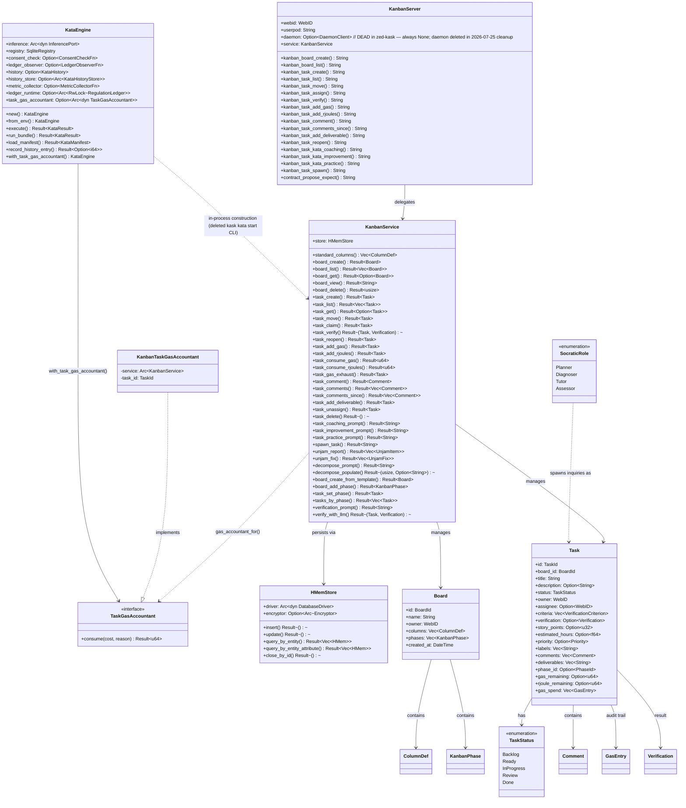

# MCP Server Registry

**Diataxis type:** Reference
**Status:** Current (v0.31.0)

Built-in MCP servers shipped with hKask and hosted in-process by zed-kask's `context_server`
infrastructure. Each server is a thin surface over domain crates, following the standard bootstrap
path (`hkask_mcp::bootstrap_mcp_server` → `hkask_mcp::run_server`).

> **Hosting note (v0.31.0):** hKask runs in-process inside zed-kask. The standalone `kask mcp start
> <id>` and `kask serve` CLI surfaces have been **deleted**. MCP servers are loaded by zed's
> `context_server` host; the `BUILTIN_SERVERS` constant in
> `kask/crates/hkask-mcp-server/src/lib.rs` enumerates the 11 on-disk servers. Five servers from
> the original 16 have been deleted: `communication` (Matrix/TTS → zed voip), `filesystem` (zed
> provides fs tools), `memory` (consolidated into the `hkask-memory` crate), `skill` (skill
> execution is native via D1), and `regulation` (consolidated into the `hkask-regulation` crate).
> See [`docs/architecture/zed-host-architecture-plan.md`](../../architecture/zed-host-architecture-plan.md)
> §2.4.

## Server Catalog

11 on-disk MCP servers:

| Server | Crate | Domain | Tools | Math Engine |
|--------|-------|--------|-------|-------------|
| CodeGraph | `mcp-servers/hkask-mcp-codegraph` | Code understanding (query, traverse, impact) | 10 | `hkask-mcp-codegraph` |
| [Companies](companies.md) | `mcp-servers/hkask-mcp-companies` | FIBO-anchored financial forecasting | 41 | `hkask-forecast` |
| [Condenser](condenser.md) | `mcp-servers/hkask-mcp-condenser` | Context condensation | 7 | — |
| Corpus / DocProc / Replica | `mcp-servers/hkask-mcp-corpus` | Corpus gathering, document processing, QA generation, style replicas | 24 | — |
| Curator | `mcp-servers/hkask-mcp-curator` | Curator agent metacognition | — | — |
| Kata Kanban | `mcp-servers/hkask-mcp-kata-kanban` | Toyota Kata task boards | 14 | `hkask-services-kata-kanban` |
| Media | `mcp-servers/hkask-mcp-media` | Fal.ai media generation | — | — |
| Replica | `mcp-servers/hkask-mcp-corpus` | Style replicas (subset of corpus server) | — | — |
| Research | `mcp-servers/hkask-mcp-research` | Web search, extraction, browsing, RSS feeds | 17 | `hkask-mcp-research` |
| [Scenarios](scenarios.md) | `mcp-servers/hkask-mcp-scenarios` | Event-tree forecasting (Tetlock/Schwartz/Chermack) | 18 | `hkask-forecast` |
| Training | `mcp-servers/hkask-mcp-training` | LoRA training pipeline | — | — |

> The `curator` MCP server is kept on disk but may be unloaded by default (Curator is a native
> agent, D2). All 11 build clean.

## Common Patterns

All servers follow these patterns:

1. **Bootstrap:** `hkask_mcp::bootstrap_mcp_server(name, target, host_env_var)` → returns `MCPBootstrap { userpod }` (resolves userpod identity only; the daemon was deleted in the 2026-07-25 cleanup, so `daemon_client` is no longer part of the bootstrap result)
2. **Struct:** `hkask_mcp::mcp_server!` macro generates the struct with `webid`, `userpod`, `daemon` fields plus domain fields. The `daemon` field is dead in zed-kask (always `None`; the daemon was deleted — `DaemonClient` is retained only for compile-stability, `record_via_daemon()` is a no-op). Thread-level memory via `RealMemoryPort` (D6) replaces daemon experience recording.
3. **Tool dispatch:** `execute_tool_semantic(self, tool_name, ontology, async { ... })` wraps each tool with Regulation span + daemon outcome recording
4. **Tool router:** `#[tool_handler(router = Self::...router())]` on the `ServerHandler` impl
5. **Error type:** `McpToolError` for tool-level errors, domain `Error` enums (via `thiserror`) for computation errors
6. **Governance:** OCAP is enforced at the dispatcher `GovernedTool` membrane (`DelegationToken` per call), not at the server. The server is the transport pipe; `shell_exec`-style tools are reachable only by agents holding the relevant capability token. See [`lib.rs` (`GovernedTool`)](../../../crates/hkask-regulation/src/governed_tool.rs) (replaces deleted `crates/hkask-pods/src/lib.rs`) and the `kask_bridge` `BridgeToolPort` adapter (`kask/crates/kask_bridge/src/tool_port.rs`, D3/D8).

## Testing standard

Every MCP server MUST include **tool-behavior contract tests** that invoke tools through their public `Parameters<T>` seam (e.g. `server.fs_read(Parameters(FsReadRequest { ... }))`), covering at minimum: the happy path, invalid input, boundary/edge cases, and error-specificity. Helper-seam-only tests (testing `sandbox_path`/services/infrastructure in isolation) are necessary but **not sufficient** — a helper-seam-only suite cannot catch tool-contract bugs (slice-index panics on bad input, canonicalize-on-non-existent, silent no-ops, error-swallowing). The kata-kanban contract test suite is the exemplar pattern. See the fleet test-seam audit for the current coverage gap across all 11 servers.

## Cross-links

- [Companies MCP Server Reference](companies.md) — 41 tools, dual-provider routing, forecast store, portfolio ledger (DIAG-RF-004 inline)
- [Condenser MCP Server Reference](condenser.md) — 7 tools, 3 compression algorithms, 2-phase condensation (DIAG-RF-006 inline)
- [Corpus MCP Server Reference](corpus.md) — corpus gathering, document processing, QA generation, style replicas
- [Scenario Forecasting Pipeline Diagram](scenarios.md) — scenarios tool flow (DIAG-RF-005 inline)
- [Superforecasting: Layered Model](../../explanation/forecasting-and-scenarios.md) — three-layer architecture
- [Architecture Patterns](../../explanation/architecture-patterns.md) — MCP dispatch sequence
- CodeGraph Adversarial Review — adversarial code review of the codegraph server (17 findings, all fixed)
- Companies MCP Code Review — adversarial code review of the companies server
- Companies Semantic Graph Audit — internal module dependency graph health
- Scenarios Adversarial Review — code smell inventory for the scenarios server
- Research MCP Adversarial Review — code smell inventory for the research server
- Research MCP Adversarial Review (Follow-Up 2026-07-20) — 11 new findings: dead CapabilityContext, edit_tags feed-relabeling bug, missing transactions, stored SSRF, stub health checks; 7 follow-up items including panic-safe transactions, permissive SSRF for RSS, and circuit-breaker ADR

## Kata-Kanban Server Architecture (DIAG-IC-017)

The `hkask-mcp-kata-kanban` MCP server (`KanbanServer`) is a thin tri-surface wrapper that delegates every tool call to `KanbanService`. The service owns an `HMemStore` (board/task persistence). Full kata execution is available through the in-process `KataEngine` (constructed directly by the agent loop or the kask panel, D10), which replaces the deleted `kask kata start` CLI command. The kanban service exposes kata prompt generation (`task_coaching_prompt` / `task_improvement_prompt` / `task_practice_prompt`) for MCP and in-process surfaces.

The `--task <id>` binding (previously a CLI flag) is now an in-process parameter that binds a `TaskGasAccountant` to the engine, closing the per-task gas feedback loop: each inference call's actual token usage is deducted from the bound kanban task's `gas_remaining` budget via `task_consume_gas`.

<!-- DIAGRAM_ALIGNMENT
id: DIAG-IC-017
verified_date: 2026-07-24
verified_against: mcp-servers/hkask-mcp-kata-kanban/src/lib.rs:29-33 (KanbanServer struct — db field deleted; daemon field retained but always None in zed-kask — dead code, R4/T3.0 refactor pending), crates/hkask-services-kata-kanban/src/kanban/service_impl/service.rs:34-37 (KanbanService struct — kata_bridge field deleted, pod_manager removed post-pivot), crates/hkask-services-kata-kanban/src/kata/mod.rs:76-94 (KataEngine struct), crates/hkask-storage/src/hmem.rs:134-138 (HMemStore struct), crates/hkask-services-kata-kanban/src/kanban/types/task.rs:9-55 (Task struct), crates/hkask-services-kata-kanban/src/kanban/types/status.rs:16-27 (TaskStatus enum), crates/hkask-services-kata-kanban/src/kanban/socratic.rs:265-270 (SocraticRole enum); KataEngine construction now in-process (deleted kask kata start CLI surface)
status: VERIFIED (v4 — daemon field annotated as dead in zed-kask; always None; daemon deleted in 2026-07-25 cleanup)
-->
