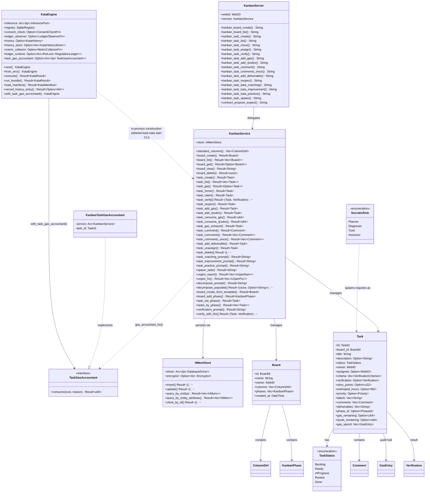

# MCP Server Registry

**Diataxis type:** Reference
**Status:** Active (v0.32.2)

> Built-in MCP servers shipped with hKask and launched by zed-kask's `context_server`
> host as child processes over stdio. Each server is a thin surface over domain crates. The binary
> entrypoint (`src/main.rs`) is a one-line `#[tokio::main]` wrapper around `<crate>::run()`; the
> library root exposes `pub async fn run()` that calls `hkask_mcp_server::run_server(name,
> version, factory, credentials)`, where `factory` receives a `ServerContext` and constructs the
> server struct. (The `McpRuntime` that governs tool calls — capability-match gate + gas — runs
> in-process; the MCP servers themselves are child processes over stdio.)
>
> **Hosting note (v0.32.2):** hKask runs in-process inside zed-kask. The standalone `kask mcp start
> <id>` and `kask serve` CLI surfaces have been **deleted**. MCP servers are launched by zed's
> `context_server` host as child processes over stdio; the `BUILT_IN_MCP_SERVERS` constant in
> `kask/crates/kask_bridge/src/mcp_servers.rs` enumerates the 13 on-disk servers. Five servers from the original 16 have been deleted: `communication` (Matrix/TTS →
> zed voip), `filesystem` (zed provides fs tools), `memory` (consolidated into the
> `hkask-memory` crate), `skill` (skill execution is native via D1), and `regulation`
> (consolidated into the `hkask-regulation` crate); `docproc` and `replica` were folded into
> `corpus`. The 11th server, `swarm` (Agent Bestiary World integration), was added 2026-08-01;
> the 12th, `prediction-markets` (Polymarket/Kalshi calibration), was added 2026-08-05; the
> 13th, `portfolio` (general-purpose transaction-ledger portfolio store), was added 2026-08-12.
> See
> [`docs/architecture/zed-host-architecture-plan.md`](../../architecture/zed-host-architecture-plan.md)
> §2.4.

## Server Catalog

13 on-disk MCP servers, **305 tools** fleet-wide. Every count is pinned by a `tool_surface_is_exactly_N_registered_tools` test (2026-08-12 re-audit) that asserts the runtime router's `list_all().len()`. This catches silent registration drops — a `#[tool]` impl block without `#[tool_router]`, or a sub-router missing from `combined_router()`, registers nothing (`cargo check` passes on an unwired orphan; the `training` server was caught this way — it registered 0 tools before its sub-routers were merged).

| Server | Crate | Purpose | Tools | Count source |
|--------|-------|---------|------:|--------------|
| CodeGraph | `mcp-servers/hkask-mcp-codegraph` | Code understanding (query, traverse, impact, context assembly) | 9 | `tool_surface_is_exactly_9_registered_tools` |
| [Companies](companies.md) | `mcp-servers/hkask-mcp-companies` | FIBO-anchored financial forecasting, dual-provider routing, portfolio ledger | 44 | `tool_surface_is_exactly_44_registered_tools` |
| [Condenser](condenser.md) | `mcp-servers/hkask-mcp-condenser` | Context condensation (thread summarization, persistence, saliency) | 4 | `tool_surface_is_exactly_4_registered_tools` |
| [Corpus](corpus.md) | `mcp-servers/hkask-mcp-corpus` | Corpus gathering, document processing, QA generation, style replicas | 27 | `tool_surface_is_exactly_27_registered_tools` |
| Curator | `mcp-servers/hkask-mcp-curator` | Curator agent metacognition (escalations, memory, regulation query) | 9 | `tool_surface_is_exactly_9_registered_tools` |
| Kata Kanban | `mcp-servers/hkask-mcp-kata-kanban` | Toyota Kata task boards | 23 | `tool_surface_is_exactly_23_registered_tools` |
| Media | `mcp-servers/hkask-mcp-media` | Fal.ai media generation (image, video, audio, gallery) | 40 | `tool_surface_is_exactly_40_registered_tools` |
| Portfolio | `mcp-servers/hkask-mcp-portfolio` | General-purpose transaction-ledger portfolio store (stocks, prediction-event portfolios, CMP indices) with materialized daily holdings and returns views | 14 | `tool_surface_is_exactly_14_registered_tools` |
| [Prediction Markets](prediction-markets.md) | `mcp-servers/hkask-mcp-prediction-markets` | Polymarket/Kalshi base rates, calibration, CMP curves, residuals | 32 | `tool_surface_is_exactly_32_registered_tools` |
| Research | `mcp-servers/hkask-mcp-research` | Web search, extraction, browsing, RSS feeds | 21 | `tool_surface_is_exactly_21_registered_tools` |
| [Scenarios](scenarios.md) | `mcp-servers/hkask-mcp-scenarios` | Event-tree forecasting (Tetlock/Schwartz/Chermack) | 21 | `tool_surface_is_exactly_21_registered_tools` |
| [Swarm](swarm.md) | `mcp-servers/hkask-mcp-swarm` | Agent Bestiary World swarms + Xaman Ek curator + local swarm substrate (v2 §15) | 53 | `tool_surface_is_exactly_53_registered_tools` |
| Training | `mcp-servers/hkask-mcp-training` | LoRA training pipeline (dataset, submit, validate, evaluate) | 8 | `tool_surface_is_exactly_8_registered_tools` |

> The `curator` MCP server is kept on disk but may be unloaded by default (Curator is a native
> agent, D2). All 13 build clean.

## Common Patterns

All servers follow these patterns:

1. **Bootstrap:** `main.rs` calls `<crate>::run()`, which calls `hkask_mcp_server::run_server(name, version, factory, credentials)`. The `factory: FnOnce(ServerContext) -> Result<S, McpError>` closure receives a `ServerContext` (no ambient authority — all deps injected) and constructs the server struct. There is no separate `bootstrap_mcp_server` / `MCPBootstrap` step; that API was removed along with the `HKASK_MCP_HOST` / userpod identity concept.
2. **Identity:** `ServerContext.webid: WebID` is the sole agent-identity source, resolved in transport from `HKASK_WEBID` (or an anonymous fallback). The `mcp_server!` macro generates a struct with `pub webid: WebID` plus the caller's custom domain fields — and nothing else (no `userpod`, no `daemon` field; the daemon was deleted in the 2026-07-25 cleanup and `DaemonClient` / `record_via_daemon` / `RealMemoryPort` are no longer part of the server contract).
3. **Tool dispatch:** wrap each tool body in `execute_tool(self, "tool_name", async { ... })` (or `execute_tool_semantic(self, "tool_name", Some("pko:ChangeOfStatus"), async { ... })` to tag the Regulation span with a domain ontology concept). Both emit the `reg.tool` span and serialize errors; the `reg.tool` span is the production recording surface. Thread-level memory via `RealMemoryPort` (D6) is the richer path; per-tool debug logging is available via `tracing::debug!` at the call site if a server needs it.
4. **Tool attribute:** use rmcp's built-in `#[tool(description = "...")]` on each tool method and `#[tool_router(server_handler)]` on the `impl` block that holds them (imported from `rmcp`). There is no custom `#[tool_handler(router = ...)]` attribute; per-call routing happens at the `McpRuntime` dispatch port, not on the server struct.
5. **Error type:** `McpToolError` for tool-level errors, domain `Error` enums (via `thiserror`) for computation errors.
6. **Governance:** `McpRuntime::invoke` (`crates/hkask-mcp/src/runtime.rs`) **meters and dispatches; it does not authorize.** The pipeline is: charge one call against the agent's per-tick runaway ceiling → dispatch → emit the `reg.gas.settled` span (target `reg.mcp`). Its fourth argument, `agent: WebID`, is an accounting identity, not a credential, and the only pre-dispatch refusal is `EnergyBudgetExceeded` (the runaway-loop breaker; resets each regulation tick). The former capability-match gate here was removed 2026-08-12 as vacuous — all three production mint sites derived the token's `resource_id` from the same tool name they passed to `invoke` (`security/regressions/RR-0056.yaml`). Tool authority is enforced at boundaries whose list the caller does not choose: the per-request `tool_allowlist` on the inference IPC `tool_invoke` dispatch (`crates/kask_bridge/src/inference_ipc_server.rs`, fail-closed on missing/empty), each swarm agent card's `mcp_tools` allowlist, and the per-server MCP env/credential allowlists (RR-0038). The composition root passes the `Arc<McpRuntime>` directly wherever a `ToolPort` is needed (no adapter).

## Testing standard

Every MCP server MUST include **tool-behavior contract tests** that invoke tools through their public `Parameters<T>` seam (e.g. `server.fs_read(Parameters(FsReadRequest { ... }))`), covering at minimum: the happy path, invalid input, boundary/edge cases, and error-specificity. Helper-seam-only tests (testing `sandbox_path`/services/infrastructure in isolation) are necessary but **not sufficient** — a helper-seam-only suite cannot catch tool-contract bugs (slice-index panics on bad input, canonicalize-on-non-existent, silent no-ops, error-swallowing). The kata-kanban contract test suite is the exemplar pattern. See the fleet test-seam audit for the current coverage gap across the 13 servers.

## Cross-links

- [Companies MCP Server Reference](companies.md) — 42 tools, dual-provider routing, forecast store, portfolio ledger (DIAG-RF-004 inline)
- [Condenser MCP Server Reference](condenser.md) — 4 tools, 3 compression algorithms, 2-phase condensation (DIAG-RF-006 inline)
- [Corpus MCP Server Reference](corpus.md) — 27 tools: corpus gathering, document processing, QA generation, style replicas
- [Prediction Markets MCP Server Reference](prediction-markets.md) — 12 tools: Polymarket/Kalshi base rates, calibration loop, CMP curves
- [Scenario Forecasting Pipeline Diagram](scenarios.md) — 21 tools, scenarios tool flow (DIAG-RF-005 inline)
- [Swarm MCP Server Reference](swarm.md) — 51 tools (27 ABW + 24 local), dual mode (ABW cloud + local substrate), swarm-intelligence skill ecosystem (C0–C8, steering modes), consent-gated spend, algedonic wallet channel
- [Superforecasting: Layered Model](../../explanation/forecasting-and-scenarios.md) — three-layer architecture
- [MCP Tool Dispatch Sequence](../../diataxis/hkask-mcp-server/explanation.md) — MCP dispatch and governance (replaces the deleted `explanation/architecture-patterns.md`)
- CodeGraph Adversarial Review — adversarial code review of the codegraph server (17 findings, all fixed)
- Companies MCP Code Review — adversarial code review of the companies server
- Companies Semantic Graph Audit — internal module dependency graph health
- Scenarios Adversarial Review — code smell inventory for the scenarios server
- Research MCP Adversarial Review — code smell inventory for the research server
- Research MCP Adversarial Review (Follow-Up 2026-07-20) — 11 new findings: dead CapabilityContext, edit_tags feed-relabeling bug, missing transactions, stored SSRF, stub health checks; 7 follow-up items including panic-safe transactions, permissive SSRF for RSS, and circuit-breaker ADR

## Kata-Kanban Server Architecture (DIAG-IC-017)

The `hkask-mcp-kata-kanban` MCP server (`KanbanServer`, a child process over stdio) is a thin tri-surface wrapper that delegates every tool call to `KanbanService`. The service owns an `HMemStore` (board/task persistence) and exposes kanban board/task tools plus kata prompt generation (`task_coaching_prompt` / `task_improvement_prompt` / `task_practice_prompt`), which render prompt text only — they do not execute a kata loop. Live kata execution (the PDCA loop) runs **in-process** via the `ManifestExecutor` (D1) executing the `kata-improvement` / `kata-coaching` skill manifests (`kask/registry/manifests/kata-*.yaml`) with their Jinja2 templates — this is the production kata path. `KataEngine` (this crate, `src/kata.rs`) is a library-level kata engine exercised only by tests (`tests/gas_feedback_loop.rs`); it is **not** wired into any production execution path — not by the agent loop, not by the kata-kanban MCP server, not by `ManifestExecutor`. The deleted `kask kata start` CLI has no direct successor.

The `--task <id>` binding (previously a CLI flag) is a library-level parameter that binds a `TaskGasAccountant` to `KataEngine` (exercised in `tests/gas_feedback_loop.rs`), closing the per-task gas feedback loop: each inference call's actual token usage is deducted from the bound kanban task's `gas_remaining` budget via `task_consume_gas`. In production, kata-skill gas is governed by the `ManifestExecutor`'s `BudgetTracker`, not this binding.

<!-- DIAGRAM_ALIGNMENT
id: DIAG-IC-017
verified_date: 2026-07-29
verified_against: mcp-servers/hkask-mcp-kata-kanban/src/hkask_mcp_kata_kanban.rs (KanbanServer struct — generated by `mcp_server!` macro with only `webid` + `service: KanbanService`; no `userpod`/`daemon` field — daemon deleted in 2026-07-25 cleanup, macro no longer generates those fields), mcp-servers/hkask-mcp-kata-kanban/src/kanban/service_impl/service.rs (KanbanService struct — kata_bridge field deleted, pod_manager removed post-pivot), mcp-servers/hkask-mcp-kata-kanban/src/kata.rs (KataEngine struct), crates/hkask-storage/src/hmem.rs (HMemStore struct), mcp-servers/hkask-mcp-kata-kanban/src/kanban/types/task.rs (Task struct), mcp-servers/hkask-mcp-kata-kanban/src/kanban/types/status.rs (TaskStatus enum), mcp-servers/hkask-mcp-kata-kanban/src/kanban/socratic.rs (SocraticRole enum); KataEngine is library-level/test-only (`KataEngine::new` called only in `tests/gas_feedback_loop.rs`; no production construction) — production kata execution is via `ManifestExecutor` (D1) + the `kata-improvement`/`kata-coaching` skill manifests (deleted `kask kata start` CLI surface)
status: VERIFIED (v5 — line numbers removed from verified_against to avoid drift; tool count updated to 23)
-->
