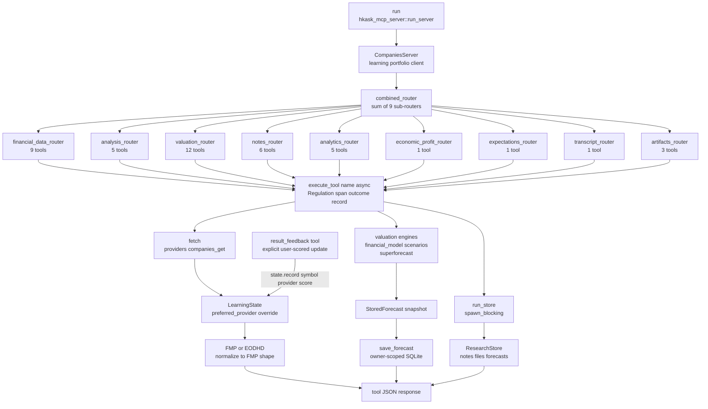

# Companies MCP Server — Reference

**Diataxis type:** Reference · **Crate:** `mcp-servers/hkask-mcp-companies` · **Server id:** `companies`

Company-finance MCP server for provider-routed market data, fundamental analysis, valuation, research retrieval, and company-scoped research artifacts (notes, file attachments, durable forecast snapshots). The portfolio ledger lives in the `portfolio` MCP server; this server reads the shared portfolio DB only for ledger context (positions, symbols) that its analytics and artifacts attach to. Tools are provider-agnostic: each financial-data tool routes to FMP or EODHD based on symbol characteristics, with automatic fallback and EODHD normalization to FMP format. This page documents the current behavior of the shipping code and the standing properties of its design. Task-oriented procedures live in this page's tool sections.

## Architecture

| Component | Role |
|-----------|------|
| `CompaniesServer` | Server struct: `webid`, `client`, FMP/EODHD keys, optional research keys (Exa/Tavily/Brave), `ResearchStore`, `LearningState` (`Arc<Mutex>`), `FermiDefaults`. Generated by `mcp_server!` (no `userpod`, no `daemon` field). |
| `combined_router` | Sums nine domain sub-routers: `financial_data_router` + `analysis_router` + `notes_router` + `analytics_router` + `valuation_router` + `economic_profit_router` + `expectations_router` + `transcript_router` + `artifacts_router` |
| `execute_tool` | Framework wrapper: emits the `reg.tool.companies.*` span (tool name + outcome); the `reg.tool` span is the production recording surface |
| `fetch` | Provider-agnostic data access; clones `LearningState` and delegates to `providers::companies_get` |
| `LearningState` | `src/learning.rs` — Beta(α+1, β+1) conjugate prior per (symbol, provider); temporal price snapshots for staleness detection; `preferred_provider` override when a provider is flaky. Updated by the explicit `result_feedback` tool (`state.record(symbol, provider, score)`), not by an automatic per-fetch hook. Chronic-staleness threshold configurable via `with_staleness_days` or `HKASK_CHRONIC_STALENESS_DAYS` |
| `ResearchStore` | SQLite-backed research store: notes, file attachments, and durable forecasts; owner-scoped by `webid`, opened on the same DB the portfolio server owns |

The framework-level `execute_tool` span (`reg.tool.companies.*`, tool name + outcome) is the production recording surface per tool call. Provider routing additionally emits `reg.tool.companies.provider.*` spans via `providers::emit_provider_reg`.


## Scenarios ↔ Companies Bridge

(Folded from `architecture/core/scenarios-companies-bridge.md`, 2026-08-28.)

# Scenarios ↔ Companies Bridge

**Diataxis type:** Architecture
**Status:** Active (v0.39.0)
**Related:** `mcp-servers/hkask-mcp-scenarios` (scenario forecasting), `mcp-servers/hkask-mcp-companies` (financial modeling)

## Purpose

The scenarios server and the companies server share the same math engine (`hkask-forecast`) but serve different domains. The companies server specializes in FIBO-anchored financial modeling (DCF, Schwartz 2×2 scenario analysis, intrinsic value distributions). The scenarios server specializes in Tetlock/Chermack forecast tracking (event trees, Brier scoring, calibration curves, project assessment).

The correct bridge direction is **scenarios → companies**: exogenous scenario events (regulatory, competitive, macro, technology) are the drivers, and the company's financial forecast is the system being impacted. The `scenario_impact_valuation` tool on the companies server implements this — the user maps each scenario node's Yes/No outcome to additive deltas on DCF assumptions, the tool enumerates all 2^N leaf paths, computes path probabilities from the CPTs, runs DCF under each path, and weights by path probability.[^anthropic-mcp]

The `scenario_from_companies` tool (companies → scenarios) has been **deleted**. It fabricated tracking events from DCF output — "Will the stock trade within 20% of intrinsic value X?" — which are not causal drivers. Scenarios don't come from companies; company forecasts come from scenarios.

## Bridge Path

### Scenarios → companies (exogenous events → financial forecast)

```
hkask-mcp-scenarios                    hkask-mcp-companies
─────────────────                      ───────────────────
scenario_quantify                      scenario_impact_valuation
  ↓                                      ↓
  Resolved event tree               Parse tree + per-node impact mappings
  (marginals, CPTs,                   ↓
   dependency edges)                Enumerate 2^N leaf paths
  ↓                                      ↓
  User authors per-node              Apply stacked deltas per path
  impact mappings (yes_deltas,         ↓
  no_deltas on DCF assumptions)      Run DCF under each path
  ↓                                      ↓
                                     Weight by path probability
                                       ↓
                                     Probability-weighted intrinsic value
                                     + per-node sensitivity
```
[^gamma-adapter]

## Ontology Translation

| Companies (FIBO) | Scenarios (Dublin Core) |
|-------------------|------------------------|
| `scenarios[].name` | `ScenarioEvent.name` |
| `intrinsic_per_share` | Drives `probability` via upside heuristic |
| `applied_growth` | `SubQuestion` — "Will revenue growth reach X%?" |
| `applied_margin` | `SubQuestion` — "Will gross margins hold at X%?" |
| `current_price` | Used to compute `upside` → probability bucket |
| — | `ScenarioEvent.basis = "financial_model"` |
| Schwartz 2×2 | `reference_class = "Company DCF scenario analysis, 2×2 Schwartz matrix"` |

[^fibo]

## Design Decisions

1. **Probability heuristic:** When Fermi sub-questions are available, `calibrate_from_fermi` determines the probability. Otherwise, a simple upside-based bucketing heuristic applies: `upside > 20% → 0.65`, `0-20% → 0.55`, `-20-0% → 0.40`, `< -20% → 0.25`.

2. **Deadline derivation:** Deadlines are computed from the `TimeHorizon` enum: Tactical = +540 days, Strategic = +1460 days, LongTerm = +2920 days.

3. **Scenario impact valuation (primary bridge):** The `scenario_impact_valuation` tool on the companies server is the primary bridge — exogenous scenario events drive the company's financial forecast. The user maps each scenario node's Yes/No outcome to additive deltas on DCF assumptions (revenue growth, gross margin, capex, etc.). The tool enumerates all 2^N leaf paths, computes each path's probability from the CPTs, applies stacked deltas, runs DCF, and weights by path probability. This is the natural composition direction: scenarios are the exogenous drivers, company financials are the endogenous system being impacted. The former forward bridge (`scenario_from_companies`) is deprecated — it fabricated tracking events from DCF output, which is the wrong direction.[^tetlock-superforecasting]

## Cross-links

- [Scenario Forecasting Pipeline Diagram](../../reference/mcp-servers/scenarios.md) — tool flow including the companies bridge entry point (DIAG-RF-005, inline)
- [Superforecasting: Layered Model](README.md#the-forecasting-stack-three-layer-architecture) — shared math engine architecture
- Scenarios Adversarial Review — code review including former `convert_companies_output` analysis (now deleted)[^anthropic-mcp]

---

## References

[^anthropic-mcp]: Anthropic, PBC. (2024). *Model context protocol specification*. https://modelcontextprotocol.io/specification
    Cited for cross-MCP-server communication patterns — the bridge between scenarios and companies servers follows the MCP tool protocol.

[^gamma-adapter]: Gamma, E., Helm, R., Johnson, R., & Vlissides, J. (1994). *Design patterns: Elements of reusable object-oriented software*. Addison-Wesley. https://www.oreilly.com/library/view/design-patterns-elements/0201633612/
    Cited for the Adapter and Bridge patterns underlying the cross-server bridging architecture.

[^fibo]: Object Management Group. (2024). *Financial Industry Business Ontology (FIBO) specification*. EDM Council. https://spec.edmcouncil.org/fibo/
    Cited as the ontology anchor for the companies server side of the translation table.

[^tetlock-superforecasting]: Tetlock, P. E., & Gardner, D. (2015). *Superforecasting: The art and science of prediction*. Crown Publishers. https://www.penguinrandomhouse.com/books/317711/superforecasting-by-philip-e-tetlock-and-dan-gardner/
    Cited for the Brier-scoring and probability-heuristic design decisions drawn from superforecasting methodology.


[^otel-companies-arch]

## Tool routing and dispatch flow

The diagram traces the dispatch seam shared by all 43 tools: `combined_router` sums nine sub-routers, every tool funnels through `execute_tool`, then branches into one of three sinks — provider-routed financial data, valuation engines that persist `StoredForecast` snapshots, or `ResearchStore` operations on `spawn_blocking`. The `result_feedback` tool feeds explicit user-scored updates back into `LearningState`. Verified against `mcp-servers/hkask-mcp-companies/src/hkask_mcp_companies.rs` and `src/tools/mod.rs`.[^mcp-spec-companies-ref]



<!-- DIAGRAM_ALIGNMENT
id: DIAG-RF-004
verified_date: 2026-07-29
verified_against: mcp-servers/hkask-mcp-companies/src/hkask_mcp_companies.rs (CompaniesServer struct via mcp_server!, combined_router, fetch, save_forecast, run_server entrypoint), mcp-servers/hkask-mcp-companies/src/tools/mod.rs (sub-router composition), mcp-servers/hkask-mcp-companies/src/providers.rs (companies_get, emit_provider_reg), mcp-servers/hkask-mcp-companies/src/research_store.rs (ResearchStore), mcp-servers/hkask-mcp-companies/src/learning.rs (LearningState.record), mcp-servers/hkask-mcp-companies/src/tools/valuation.rs (result_feedback tool). No daemon, no DaemonClient, no record_experience, no record_fetch_outcome — those nodes were removed.
status: VERIFIED (v8 — 2026-08-28: the duplicate portfolio surface (portfolio_list, portfolio_delete, ledger_import, ledger_export, transaction_note_append, portfolio_comparison, portfolio_returns) was removed from this server — the portfolio MCP server owns the ledger. Tool surface now pinned end-to-end by `tool_surface_is_exactly_43_registered_tools` asserting `CompaniesServer::combined_router().list_all().len()`; ontology coverage pinned by `ontology_anchor_covers_all_registered_tools`, which flushed out four previously unmapped tools (driver_forecast, resolve_symbol, stock_universe, company_screener). Sub-router counts: financial_data 9, analysis 5, notes 6, analytics 5, valuation 12, economic_profit 1, expectations 1, transcript 1, artifacts 3 = 43. PortfolioManager renamed ResearchStore; portfolio.rs renamed research_store.rs.)
-->

## Tools (43)

> Count pinned end-to-end by `tool_surface_is_exactly_43_registered_tools`
> (`CompaniesServer::combined_router().list_all().len()`), mirroring the
> media/scenarios/swarm pins. The tabulated groups below cover 38 tools; 5
> tools are not yet tabulated.

### Financial data (8)

| Tool | Description | Provider routing |
|------|-------------|------------------|
| `company_profile` | Company profile by symbol | FMP primary; EODHD for international symbols |
| `stock_quote` | Real-time stock quote | FMP primary; EODHD fallback |
| `income_statement` | Income statements (default limit 5) | FMP primary; EODHD normalized |
| `balance_sheet` | Balance sheet statements (default limit 5) | FMP primary; EODHD normalized |
| `cash_flow_statement` | Cash flow statements (default limit 5) | FMP primary; EODHD normalized |
| `key_metrics` | Key financial metrics (default limit 5) | FMP primary; EODHD approximated for missing fields |
| `historical_price` | Historical price data | FMP primary; EODHD fallback |
| `symbol_search` | Symbol search | FMP and EODHD search endpoints |

### Analysis and research (5)

| Tool | Description |
|------|-------------|
| `moat_check` | Competitive moat: gross-margin stability + working-capital market-power signals |
| `management_scorecard` | CEO capital allocation scorecard (ROIC vs invested capital) |
| `working_capital_cycle` | Days payable, days sales outstanding, cash-conversion cycle |
| `company_screener` | Screen companies from natural-language criteria using the FMP stock screener (bypasses `fetch`) |
| `research_search` | Search Exa, Tavily, and Brave for company-specific fundamental-research claims (bypasses `fetch`) |

### Portfolio analytics and DCF (5)

| Tool | Description |
|------|-------------|
| `portfolio_attribution` | Rank position contributions to portfolio movement |
| `portfolio_characteristics` | Weighted-average portfolio valuation, profitability, leverage, growth, and composition |
| `dcf_valuation` | Two-stage DCF (Gordon-growth terminal); returns intrinsic value and forecast ID |
| `reverse_dcf` | Solve for the revenue growth implied by the current market price |
| `scenario_analysis` | Four growth-by-margin scenarios; returns intrinsic-value range |

### Valuation and forecasting (9)

| Tool | Description |
|------|-------------|
| `comparable_analysis` | Peer valuation multiples (P/E, P/B, P/S, EV/EBITDA) with DCF overlay |
| `sensitivity_analysis` | Rank DCF inputs by their effect on intrinsic value |
| `equity_duration` | Equity duration (Macaulay-style, years) of projected FCFs plus terminal value; reports terminal/stage-1/stage-2 PV shares |
| `monte_carlo_dcf` | N-simulation Monte Carlo; returns intrinsic-value distribution |
| `calibrate_forecast` | Calibrate growth and margin estimates into scenario-weighted intrinsic value (Fermi + Bayesian) |
| `forecast_get` | Retrieve one durable forecast and its recorded outcomes for the authenticated owner |
| `forecast_list` | List an authenticated owner's durable forecasts for a symbol |
| `forecast_record` | Record a forecast outcome, Brier scores, and optional return-gap decomposition |
| `result_feedback` | Rate a previous tool result (1–5); feeds the `LearningState` Beta prior |

### Economic-profit and expectations analysis (2)

| Tool | Description |
|------|-------------|
| `ep_valuation` | Value a company from book value plus discounted future economic profit with competitive fade |
| `expectations_gap` | Compare market-implied growth with management guidance and a supplied estimate |

### Research notes and files (6)

The portfolio ledger tools that previously lived here (`portfolio_list`,
`portfolio_delete`, `ledger_import`, `ledger_export`, `transaction_note_append`,
`portfolio_comparison`, `portfolio_returns`) were removed when the portfolio
MCP server took ownership of the ledger; they are pinned absent by the
43-tool surface test.

| Tool | Description |
|------|-------------|
| `note_add` | Add a dated note to a company or security |
| `note_list` | List notes for a symbol, optionally filtered by date range or tags |
| `note_delete` | Delete a note by ID |
| `file_attach` | Attach a base64-encoded file to a company or security |
| `file_list` | List a portfolio's attached files for a symbol |
| `file_delete` | Delete an attached file by ID |

## Configuration

API keys can be configured in two ways:[^owasp-companies-config]

1. **Settings UI** (recommended): Settings → Kask → Data Services. Keys are
   stored in the system keychain and injected as env vars when the MCP server
   starts.
2. **Environment variables**: Set the vars below in your shell or `.env` file.

| Variable | Required | Description |
|----------|----------|-------------|
| `HKASK_FMP_API_KEY` | Yes | Financial Modeling Prep API key |
| `HKASK_EODHD_API_KEY` | Yes | EOD Historical Data API key |
| `HKASK_EXA_API_KEY` | No | Exa research-search provider key |
| `HKASK_TAVILY_API_KEY` | No | Tavily research-search provider key |
| `HKASK_BRAVE_API_KEY` | No | Brave research-search provider key |
| `HKASK_FERMI_DEFAULTS` | No | JSON object with `growth` and `margin` Fermi-question arrays |
| `HKASK_CHRONIC_STALENESS_DAYS` | No | Chronic-staleness threshold in days for the `LearningState` provider-learning loop (default `90`); a provider whose latest filing is older than this is bypassed by `preferred_provider` |

Example Fermi defaults:

```bash
export HKASK_FERMI_DEFAULTS='{"growth":[{"estimate":0.70,"confidence":0.8}],"margin":[{"estimate":0.30,"confidence":0.7}]}'
```

## Behavioral boundaries

- **Provider routing.** Financial-data tools route eligible symbol lookups between FMP and EODHD. `is_international_symbol` (exchange-qualified symbols such as `VOD.L`, `BMW.DE`) selects EODHD as primary. `company_screener` is FMP-specific; `research_search` uses its own research providers and bypasses `fetch`.
- **DCF projection.** The DCF is a two-stage model using a Gordon-growth terminal value. It models revenue, COGS, gross profit, D&A, EBIT, tax, NOPAT, capex, net working-capital change, and free cash flow. It does not model SG&A as a separate line item, an exit-multiple terminal method, or other non-operating assets in the equity bridge.[^gordon-companies-ref]
- **Scenario matrix.** `scenario_analysis` runs a fixed revenue-growth × gross-margin matrix (Schwartz 2×2 framing).
- **Forecast persistence.** DCF and calibrated forecasts persist as owner-scoped structured JSON snapshots. `forecast_get` retrieves one record, `forecast_list` returns a symbol's history, and `revision_of` links a same-symbol revision. `forecast_record` appends outcomes and reloads the stored snapshot for decomposition. The `revision_of` chain has no enforced depth limit — each revision references its predecessor by id, and revisions require the same owner and same symbol (`research_store.rs` `validate_forecast_revision`). Consumers should treat the chain as an unbounded linked list and cap traversal at the application layer if a bound is required.
- **Provider learning.** `LearningState` tracks a Beta(α+1, β+1) posterior per (symbol, provider). Scores 4–5 from `result_feedback` count as successes; 1–3 count as failures. A provider is flaky when P(success) < 0.70 with at least 5 observations, in which case `preferred_provider` overrides the default routing. Temporal snapshots flag chronically stale data older than the configurable threshold (default 90 days, override via `HKASK_CHRONIC_STALENESS_DAYS` or `LearningState::with_staleness_days`).
- **Beta cold-start.** A new (symbol, provider) pair starts with the Beta(1, 1) uniform prior — α=1, β=1, zero observations. With zero observations `success_probability` returns `None` and `is_flaky` returns `false`, so routing never overrides the default on cold start. The prior is symmetric: the first scored observation moves α or β by one, and at least `FLAKY_MIN_OBSERVATIONS` (5) scored observations are required before the flaky classification can fire.
- **FIBO anchoring.** Every tool output carries a top-level `"ontology"` key with the artifact's FIBO concept URI (e.g. `"fibo:Portfolio"`, `"fibo:Corporation"`, `"fibo:TransactionLedger"`). Derived responses also include a `"fibo": {...}` map for per-field display metadata (per-metric concept URIs). Raw provider payloads are returned without a FIBO mapping, and emitted identifiers are compact strings rather than a JSON-LD context. Balance-sheet items use `fibo-fbc-pas-fpas`, ratios use `fibo-fbc-fct-ra`, securities use `fibo-sec-sec-ast`, indices use `fibo-ind-ind-ind. The `"ontology"` field is the unified dispatch concept (see [Ontology Bridge](../ontology-bridge.md#unified-ontology-tag-shape)); the `"fibo"` map is the per-field display vocabulary.
- **Treasury stock.** hKask non-standard adjustment: treasury stock is treated as committed capital (not a deduction from equity).

## Trust and ownership model

- **Owner scoping.** `ResearchStore` is constructed with the authenticated `webid`. Notes, file attachments, and durable forecasts are namespaced by owner; cross-owner access is rejected at the data layer (`research_store.rs` owner-isolation tests).
- **Local persistence.** Research artifacts live in a local SQLite database per owner, opened on the same DB file the portfolio server owns (the companies-specific tables sit alongside the portfolio crate's schema). No data leaves the host.
- **Attachment limits.** `file_attach` rejects encoded payloads above `MAX_ENCODED_ATTACHMENT_BYTES` and decoded payloads above `MAX_DECODED_ATTACHMENT_BYTES`.
- **Dispatch is metered, not authorized.** `McpRuntime::invoke` / `ToolGovernance` in `crates/hkask-mcp/src/runtime.rs` charges one call against the calling agent's per-tick runaway ceiling and emits the outcome span before the request reaches this server. It performs **no** per-call capability check; `invoke`'s `agent: WebID` argument is an accounting identity, not a credential. Which tools a caller may reach at all is decided upstream, by the per-request `tool_allowlist` on the inference IPC dispatch, the calling agent card's `mcp_tools` allowlist, and the per-server env/credential allowlists (RR-0038). The companies server is the transport pipe; it does not re-check capabilities per call.[^ocap-companies-ref]
- **Per-tool outcome recording is the `reg.tool` span.** After each tool call, the framework-level `execute_tool` emits the `reg.tool.companies.*` span (the production recording surface). There is no `DaemonClient`, no daemon field, and no fire-and-forget task. Durable narrative memory for the companies domain is owned by `kask_bridge`'s `RealMemoryPort` (D6) at thread-turn completion, not by this server.

## Regulation observability

| Span | When emitted |
|------|--------------|
| `reg.tool.companies.<tool>` | Every tool call via `execute_tool` (success and error paths) |
| `reg.tool.companies.provider.<provider>` | Provider selection and outcome via `providers::emit_provider_reg` |
| `reg.tool.companies.<tool>` (debug log) | Per-tool outcome via the framework-level `execute_tool` `reg.tool` span (the production recording surface) |

## Quick start

The companies server is a builtin MCP server in zed-kask (a child process over stdio) — no
standalone CLI command is needed. It is registered alongside the other
builtin MCP servers and started automatically by the host.[^mcp-spec-companies-quickstart]

The server requires `HKASK_FMP_API_KEY` and `HKASK_EODHD_API_KEY` credentials at launch; optional research keys enable `research_search`.

## Validation

```bash
cargo test -p hkask-mcp-companies
```

The suite covers provider-error handling, EODHD normalization, valuation request validation, research-store owner isolation, attachment limits, forecast snapshot reconstruction, the Gordon-growth contract, attribution weight and contribution math, the `LearningState` flaky-provider override loop, and the tool-surface pin (`tool_surface_is_exactly_43_registered_tools`) that keeps the portfolio server's ledger tools out of this server. End-to-end MCP wire-format coverage remains future work.[^bach-bolton-companies-validation]

## Cross-links

- [MCP Server Registry](README.md) — catalog of all 11 on-disk servers
- Companies Semantic Graph Audit — internal module dependency graph health
- Companies MCP Code Review — adversarial code review of the companies server
- [Diagram Index](../../DIAGRAMS_INDEX.md) — DIAG-RF-004 registration

## Footnotes

[^otel-companies-arch]: OpenTelemetry. (2024). *OpenTelemetry Specification*. Cloud Native Computing Foundation. https://opentelemetry.io/docs/specs/otel/
    Cited for the dual-path span emission pattern the architecture table describes.

[^mcp-spec-companies-ref]: Anthropic. (2024). *Model Context Protocol Specification*. Anthropic PBC. https://modelcontextprotocol.io/specification
    Cited for the MCP tool-dispatch protocol the combined_router/execute_tool seam implements.

[^owasp-companies-config]: OWASP. (2023). *OWASP Secrets Management Cheat Sheet*. OWASP Foundation. https://cheatsheetseries.owasp.org/cheatsheets/Secrets_Management_Cheat_Sheet.html
    Cited for the two-path credential configuration design (keychain vs env vars).

[^gordon-companies-ref]: Gordon, M. J., & Shapiro, E. (1956). Capital equipment analysis: The required rate of profit. *Management Science*, 2(1), 102–110. https://doi.org/10.1287/mnsc.2.1.102
    Cited for the Gordon-growth terminal-value model the DCF projection uses.

[^ocap-companies-ref]: Miller, M. S. (2006). *Robust Composition: Towards a Unified Approach to Access Control and Concurrency Control* (Doctoral dissertation, Johns Hopkins University). http://www.erights.org/talks/thesis/markm-thesis.pdf
    Cited for the principle that authority must be separated by a list the constrained caller does not write.

[^mcp-spec-companies-quickstart]: Anthropic. (2024). *Model Context Protocol Specification*. Anthropic PBC. https://modelcontextprotocol.io/specification
    Cited for the builtin MCP server model the quick-start section describes.

[^bach-bolton-companies-validation]: Bach, J., & Bolton, M. (2019). *Rapid Software Testing*. Satisfice, Inc. https://www.satisfice.com/rapid-software-testing
    Cited for the exploratory-testing methodology the validation suite's coverage gaps reflect.