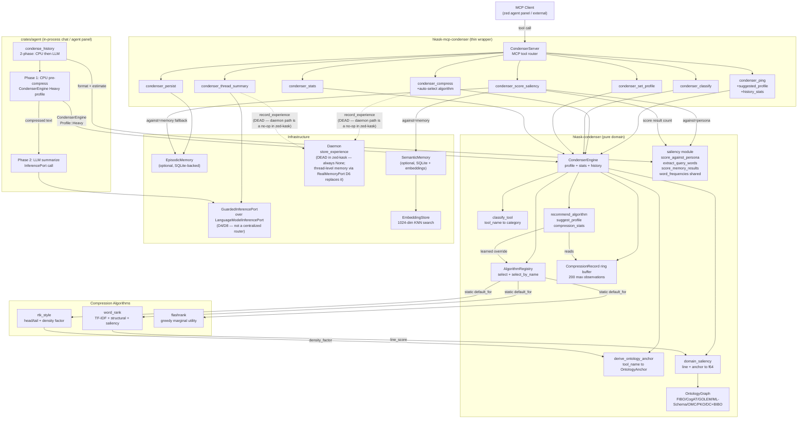

# Condenser MCP Server Reference

**Crate:** `mcp-servers/hkask-mcp-condenser` (MCP wrapper) + `crates/hkask-condenser` (pure domain)
**Tools:** 7 — `condenser_ping`, `condenser_compress`, `condenser_classify`, `condenser_set_profile`, `condenser_stats`, `condenser_persist`, `condenser_thread_summary`, `condenser_score_saliency`
**Auto-start:** Yes (one of the core servers auto-started at editor startup / agent panel initialization; not in `CORE_EXCLUDED`)

> **Hosting note (v0.31.0):** The deleted `hkask-services-chat` crate has been replaced by zed's
> in-process chat / agent panel (`crates/agent`, `crates/agent_ui`). The 2-phase `condense_history`
> flow is invoked from the in-process agent loop, not from a standalone chat service. The deleted
> REPL boot surface is replaced by editor startup / agent panel initialization.

## Pipeline Architecture (DIAG-RF-006)

The `CondenserServer` (thin MCP wrapper) delegates to `CondenserEngine` (pure domain logic), which dispatches to one of three compression algorithms based on the classified `ContextCategory`. The engine records each compression in a bounded history ring buffer; after 10+ observations per category, it auto-selects the best-performing algorithm (learning). The in-process agent loop's `condense_history` (in zed's `crates/agent`, replacing the deleted `hkask-services-chat`) uses two-phase condensation: CPU pre-compress (Phase 1) then LLM summarize (Phase 2).

<!-- DIAGRAM_ALIGNMENT
id: DIAG-RF-006
verified_date: 2026-07-24
verified_against: mcp-servers/hkask-mcp-condenser/src/lib.rs (CondenserServer tool router), crates/hkask-condenser/src/engine.rs (CondenserEngine), crates/hkask-condenser/src/algorithms.rs (AlgorithmRegistry + 3 algorithms); condense_history 2-phase now invoked from zed's crates/agent (deleted hkask-services-chat); InferencePort node relabeled to GuardedInferencePort over LanguageModelInferencePort (D4/D8); Daemon node annotated as dead (always None in zed-kask; thread-level memory via RealMemoryPort D6)
status: VERIFIED (v3 — InferencePort relabeled to GuardedInferencePort/LanguageModelInferencePort; daemon edges annotated as dead no-ops)
-->

## Key paths

- **Compress:** `condenser_compress` → `CondenserEngine` → `AlgorithmRegistry::select` (auto-select after 10+ observations per category) → algorithm (`rtk_style` / `word_rank` / `flashrank`) → `CompressionRecord` appended to ring buffer (200 max)
- **Classify:** `condenser_classify` → `classify_tool` maps tool name → `ContextCategory`
- **Saliency:** `condenser_score_saliency` → `domain_saliency` (line + `OntologyAnchor`) → against persona / memory / memory-fallback
- **Auto-condense (in-process agent loop):** `condense_history` → Phase 1 (CPU pre-compress via `CondenserEngine` Heavy profile) → Phase 2 (LLM summarize via `InferencePort`)
- **Learning loop:** The daemon `record_experience` path is **dead in zed-kask** (the daemon is deleted; `DaemonClient` is always `None`). The call is a no-op. Thread-level memory is captured via `RealMemoryPort` (D6) — the in-process `MemoryPort` trait ingests thread turns via `cx.background_spawn()` at turn completion. `recommend_algorithm` / `suggest_profile` continue to read the in-process ring buffer (200 max observations) to override the static `default_for` selection; the ring buffer is the live learning substrate, not the daemon.

## Cross-links

- [MCP Server Registry](README.md) — all 11 on-disk MCP servers
- [Architecture Patterns](../../explanation/architecture-patterns.md) — MCP bootstrap and tool dispatch sequence
- [Zed Host Architecture Plan](../../architecture/zed-host-architecture-plan.md) — D1–D10 integration seams, essentialist split (hkask-services-chat deleted; chat owned by zed's `crates/agent`)
