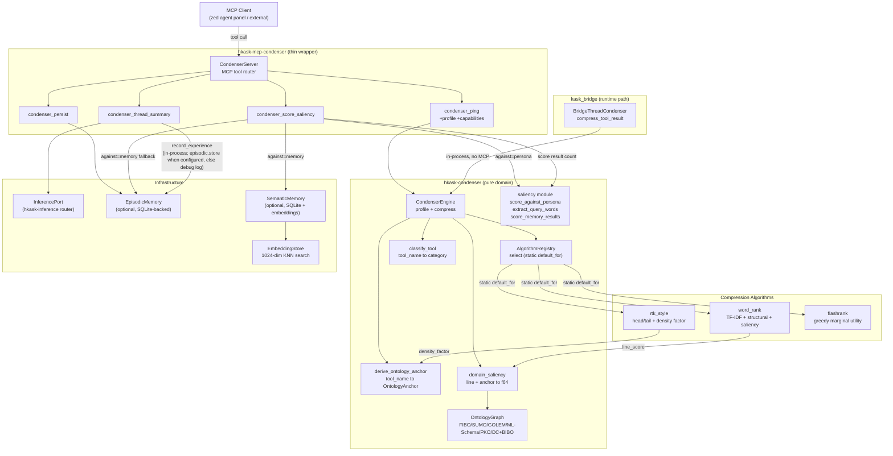

# Condenser MCP Server Reference

**Crate:** `mcp-servers/hkask-mcp-condenser` (MCP wrapper) + `crates/hkask-condenser` (pure domain)
**Tools:** 4 — `condenser_ping`, `condenser_persist`, `condenser_thread_summary`, `condenser_score_saliency`
**Auto-start:** Yes (one of the core servers auto-started at editor startup / agent panel initialization; not in `CORE_EXCLUDED`)

> **Hosting note (v0.32.1):** The runtime tool-result compression path is `BridgeThreadCondenser`
> (in `kask_bridge`), wired into zed's agent turn loop via `agent::set_thread_condenser`. It calls
> `CondenserEngine::compress` directly — no MCP round-trip. The MCP server exposes only the
> operations the agent cannot perform inline: LLM-assisted thread summarization, episodic
> persistence, and saliency scoring. The previous `condenser_compress` MCP tool was removed
> (redundant with the bridge), along with the learning/stats tools (`condenser_stats`,
> `condenser_set_profile`, `condenser_classify`) and the engine's learning subsystem (history
> ring buffer, `recommend_algorithm`, `compression_stats`, `suggest_profile`,
> `check_global_health`) — all were dormant in the default-off configuration.

## Pipeline Architecture (DIAG-RF-006)

The `CondenserServer` (thin MCP wrapper) delegates to `CondenserEngine` (pure domain logic) for
compression, and to `InferencePort` for LLM summarization. The engine selects an algorithm per
compression via the static `default_for()` mapping — no learning, no history, no stats.[^nenkova-summarization]

<!-- DIAGRAM_ALIGNMENT
id: DIAG-RF-006
verified_date: 2026-08-02
verified_against: mcp-servers/hkask-mcp-condenser/src/hkask_mcp_condenser.rs (CondenserServer tool router + record_experience), crates/hkask-condenser/src/engine.rs (CondenserEngine — no history/learning), crates/hkask-condenser/src/algorithms.rs (AlgorithmRegistry::select only — select_by_name/list_algorithms removed), kask/crates/kask_bridge/src/condenser_bridge.rs (BridgeThreadCondenser — runtime path); tool count verified at 4 #[tool] annotations
status: VERIFIED (v6 — learning subsystem + 4 MCP tools removed; BridgeThreadCondenser shown as runtime path)
-->

## Key paths

- **Runtime compression (in-process, no MCP):** `BridgeThreadCondenser::compress_tool_result` → `CondenserEngine::compress` → `AlgorithmRegistry::select` (static `default_for`) → algorithm (`rtk_style` / `word_rank` / `flashrank`). Wired via `agent::set_thread_condenser` in `crates/zed/src/main.rs`, gated on `kask.condenser.auto_compress_tool_results` (default off). Code-reading tools bypass the condenser via `NO_COMPRESS_TOOLS` in `crates/agent/src/thread.rs`.[^nenkova-key-paths]
- **Thread summary:** `condenser_thread_summary` → `inference::format_conversation_text` + `SUMMARY_SYSTEM_PROMPT` → `InferencePort::generate_with_model` → `inference::build_summary_output`.
- **Saliency:** `condenser_score_saliency` → `saliency::score_against_persona` (persona) or `saliency::extract_query_words` + memory query + `saliency::score_memory_results` (memory).
- **Persist:** `condenser_persist` → `EpisodicMemory::store` (requires `HKASK_DB_PATH` + `HKASK_DB_PASSPHRASE`).
- **Experience recording:** `condenser_thread_summary` calls `record_experience` in-process after producing a result. When episodic persistence is configured, `record_experience` builds a first-person `HMem` and stores it via `EpisodicMemory::store`; otherwise it emits a debug log (`hkask.mcp.condenser.memory`). There is no daemon and no fire-and-forget task — recording is a synchronous in-process call owned by the server.

## Cross-links

- [MCP Server Registry](README.md) — all 13 on-disk MCP servers
- [MCP Server Explanation](../../diataxis/hkask-mcp-server/explanation.md) — MCP bootstrap and tool dispatch sequence
- [Zed Host Architecture Plan](../../architecture/zed-host-architecture-plan.md) — D1–D28 integration seams

## Footnotes

[^nenkova-summarization]: Nenkova, A., & McKeown, K. (2012). A survey of text summarization techniques. In *Mining Text Data* (pp. 43–76). Springer. https://doi.org/10.1007/978-1-4614-3223-4_3
    Cited for the text-summarization taxonomy the CondenserEngine's algorithm registry draws from.

[^nenkova-key-paths]: Nenkova, A., & McKeown, K. (2012). A survey of text summarization techniques. In *Mining Text Data* (pp. 43–76). Springer. https://doi.org/10.1007/978-1-4614-3223-4_3
    Cited for the extractive-summarization algorithms (RTK-style, TF-IDF word-rank, flashrank marginal utility) the runtime compression path selects between.
