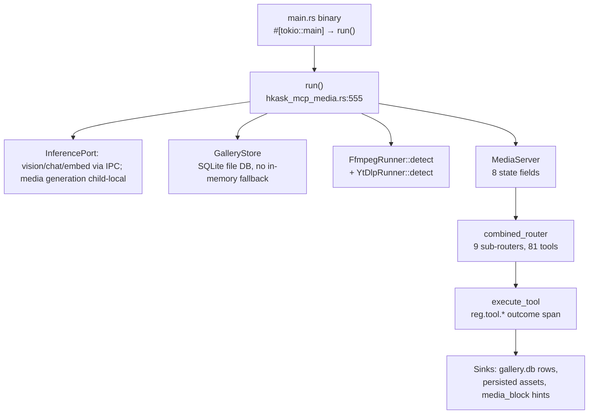

# Media MCP Server Reference

**Crate:** `kask/mcp-servers/hkask-mcp-media`
**Tools:** 80 — pinned end-to-end by `tool_surface_is_exactly_80_registered_tools` (`kask/mcp-servers/hkask-mcp-media/src/hkask_mcp_media.rs:459-467`), which asserts `MediaServer::combined_router().list_all().len() == 80`. The count includes the 15 `educt_*` transcript-layer tools and the face-registry tools. The 2026-09-03 consolidation merged `transcribe` into `transcribe_bundle`, `gallery_find_similar` into `gallery_search` (semantic mode), `gallery_add_video`+`gallery_add_audio` into `gallery_add_media`, and `generate_variants` into `generate_image` (num_images); `transcribe_and_store` was added 2026-09-04 (79→80). The test exists to catch silent registration drops: a `#[tool]` impl block without `#[tool_router]`, or a sub-router missing from `combined_router()`, silently registers nothing while `cargo check` passes (`kask/mcp-servers/hkask-mcp-media/src/hkask_mcp_media.rs:439-449`).
**Registration:** built-in server `id: "media"`, `binary: "hkask-mcp-media"` in `BUILT_IN_MCP_SERVERS` (`kask/crates/kask_bridge/src/mcp_servers.rs:468-505`).

Tool count and every tool name below were verified against `#[tool(...)]`-annotated
`pub async fn` signatures in `kask/mcp-servers/hkask-mcp-media/src/tools/*.rs` (re-verified 2026-09-15). The canonical tool-name list is code-generated by `kask/mcp-servers/hkask-mcp-media/build.rs` into `tool_names.gen.rs` and included at `kask/mcp-servers/hkask-mcp-media/src/hkask_mcp_media.rs:431-437`; `tool_names_match_live_router` pins it to the live router at `kask/mcp-servers/hkask-mcp-media/src/hkask_mcp_media.rs:469-488`.

## Architecture

The server is a thin binary over a library: `kask/mcp-servers/hkask-mcp-media/src/main.rs:6-9` calls `hkask_mcp_media::run()`, which resolves the inference port, opens the gallery DB, and hands a `MediaServer` constructor closure to `hkask_mcp_server::run_server` (`kask/mcp-servers/hkask-mcp-media/src/hkask_mcp_media.rs:555-659`). The single `InferencePort` separates two routes (D35): vision/chat/embed use the IPC bridge to zed's `LanguageModelRegistry`; `media_generate` dispatches child-locally through `LazyInferencePort` to the media process's `MediaRouter` using env-injected provider keys. Media generation never makes the IPC round-trip.

<!-- DIAGRAM_ALIGNMENT
id: DIAG-RF-006
verified_date: 2026-09-16
verified_against: kask/mcp-servers/hkask-mcp-media/src/main.rs:6-9; kask/mcp-servers/hkask-mcp-media/src/hkask_mcp_media.rs:155-175,439-466,555-659; kask/mcp-servers/hkask-mcp-media/src/tools.rs
status: VERIFIED
-->

### Server struct

`MediaServer` is declared via the `mcp_server!` macro with eight state fields (`kask/mcp-servers/hkask-mcp-media/src/hkask_mcp_media.rs:155-177`):

| Field | Role |
|-------|------|
| `vision_port: Arc<dyn InferencePort>` | Vision/chat AND media generation (image/video/speech/transcription) via `InferencePort::media_generate`; also `embed` and `list_vision_models` for the gallery embedding path |
| `gallery_state: Arc<Mutex<Option<GalleryState>>>` | Currently-organized gallery; `None` until `gallery_organize` runs |
| `gallery_store: Arc<GalleryStore>` | Durable SQLite-backed store (tags, faces, lineage, albums) |
| `template_env: minijinja::Environment` | Jinja2 prompt templates for vision calls |
| `ffmpeg: FfmpegRunner` | ffmpeg availability probe (`kask/mcp-servers/hkask-mcp-media/src/video/ffmpeg.rs:39`) |
| `ytdlp: YtDlpRunner` | yt-dlp availability probe (`kask/mcp-servers/hkask-mcp-media/src/video/ytdlp.rs:19`), used by `video_fetch` |
| `job_store: jobs::JobStore` | In-memory async generation job tracking (`kask/mcp-servers/hkask-mcp-media/src/jobs.rs:1`) |
| `serpapi_key: Option<String>` | Credential for structured YouTube search metadata; never used to download media |

### Router composition

`combined_router()` sums nine sub-routers, one per registered `tools/` module: `gallery_router` + `processing_router` + `audio_router` + `generation_router` + `models_router` + `jobs_router` + `workflows_router` + `educt_router` + `youtube_router`. The handler attribute wires that sum as the runtime surface (`kask/mcp-servers/hkask-mcp-media/src/hkask_mcp_media.rs:457-467`).

## Bootstrap and configuration

**Bootstrap pattern:** `kask/mcp-servers/hkask-mcp-media/src/main.rs:6-9` (`#[tokio::main] async fn main` → `hkask_mcp_media::run()`) → `run()` at `kask/mcp-servers/hkask-mcp-media/src/hkask_mcp_media.rs:555` → `hkask_mcp_server::run_server("hkask-mcp-media", env!("CARGO_PKG_VERSION"), ...)` at `kask/mcp-servers/hkask-mcp-media/src/hkask_mcp_media.rs:633-659`.

**Gallery DB:** durable file-backed SQLite at `{kask_data_dir}/mcp/media/gallery.db` (D28 — Standardized Artifact Storage), overridable via `HKASK_MEDIA_DB`. There is **no in-memory fallback**: a DB open failure aborts startup, because the fallback would make an outage look like an empty gallery. The file DB is unencrypted and therefore does **not** use `HKASK_DB_PASSPHRASE` (`kask/mcp-servers/hkask-mcp-media/src/hkask_mcp_media.rs:568-630`).

**Routing decision (2026-09-06):** `params.model` overrides the operation's
env model. Selectable ops require full `OpenRouter/...` or `DeepInfra/...`
qualification (ASCII case-insensitive provider name, nonempty local model,
no whitespace). No bare/short-alias fallback, scoring, registration-order
selection, or automatic cross-provider retry remains. This supersedes
`d660f3b754` and `8cc79c797e`; child-local media (`f86cf19a70`) and foreground
media behavior remain unchanged. Background removal/upscale use fixed
DeepInfra native endpoints, need only its key, and reject model overrides.
Invalid model selection maps to `invalid_argument`; missing config/key or
provider 401/403 maps to `permission_denied`. For migration, qualify saved
media model settings/replays and remove fixed-op model overrides. See the
[inference policy](../../diataxis/hkask-inference/reference.md#media-routing-policy--operator-decision-2026-09-06).

**Credentials:** the media server's registration allowlists `OPENROUTER_API_KEY`, `DEEPINFRA_API_KEY`, and `HKASK_SERPAPI_API_KEY`. The first two serve the child-local `MediaRouter`; SerpApi supplies structured YouTube discovery metadata. Vision/chat/embed use the IPC bridge to zed's `LanguageModelRegistry`. The routes are distinct — `yt-dlp` is not a metadata provider and needs no credential.

**Environment variables** (all optional; the five `HKASK_MEDIA_*_MODEL` vars resolve through the server's `models` module — `None` when unset, no constant fallback; callers fail visibly naming the env var, `kask/mcp-servers/hkask-mcp-media/src/hkask_mcp_media.rs:76-108`):

| Variable | Purpose | When unset |
|----------|---------|-------------|
| `HKASK_INFERENCE_SOCKET` | IPC bridge socket — routes vision/chat/embed through zed's `LanguageModelRegistry` | falls back to a standalone router with env-var keys |
| `HKASK_DATA_DIR` | Data dir for gallery DB path resolution | — |
| `HKASK_MEDIA_DB` | Gallery DB path override (`kask/mcp-servers/hkask-mcp-media/src/hkask_mcp_media.rs:579-587`) | `{data_dir}/mcp/media/gallery.db` |
| `HKASK_MEDIA_TTS_MODEL` | TTS model (`models::tts_model()`) | not configured — TTS calls fail visibly |
| `HKASK_MEDIA_STT_MODEL` | STT model — transcription, the educt transcript passes, and `voice_design` (`models::stt_model()`) | not configured — STT, transcript-pass, and `voice_design` calls fail visibly |
| `HKASK_MEDIA_VISION_MODEL` | Vision model (`models::vision_model()`) | not configured — vision calls fail visibly |
| `HKASK_MEDIA_IMAGE_GEN_MODEL` | Image generation model (`models::image_gen_model()`) | not configured |
| `HKASK_MEDIA_VIDEO_MODEL` | Video generation model (`models::video_model()`) | not configured |
| `HKASK_EMBEDDING_MODEL` | Embedding model for gallery similarity search (`kask/mcp-servers/hkask-mcp-media/src/hkask_mcp_media.rs:377-392`) | not configured — embedding-dependent calls fail visibly naming `kask.models.embedding_model` |
| `HKASK_SERPAPI_API_KEY` | SerpApi credential for `youtube_search` metadata | `youtube_search` returns `permission_denied` naming the missing key |

`build_model_list` lists only configured models — an unset modality is absent from the list, never a hidden default (`kask/mcp-servers/hkask-mcp-media/src/tools/models.rs:15-30`).

The kask settings UI can populate the five `HKASK_MEDIA_*_MODEL` overrides (TTS, STT, vision, image-gen, video) via `KaskMediaSettings` → `emit_media_env` (`kask/crates/kask_bridge/src/mcp_env.rs:383`; wired at `kask/crates/kask_bridge/src/settings.rs:540`). The STT model also serves the educt transcript passes and `voice_design`.

**System dependencies:**

- **ffmpeg** — required by all local video tools and `audio_trim`/`audio_concat`. `require_ffmpeg` returns `McpToolError::unavailable("ffmpeg not found on system PATH — video tools unavailable.")` when absent (`kask/mcp-servers/hkask-mcp-media/src/hkask_mcp_media.rs:339-348`). `video_info` additionally uses ffprobe, bundled with ffmpeg (`kask/mcp-servers/hkask-mcp-media/src/tools/processing.rs:1009` tool description).
- **SerpApi** — required by `youtube_search` for structured discovery metadata. Search never invokes `yt-dlp`; missing credentials return `permission_denied` naming `HKASK_SERPAPI_API_KEY`.
- **yt-dlp** — required only by `video_fetch` to retrieve media bytes for durable local publication from platform URLs (YouTube, Vimeo). It is not used for search or metadata. `require_yt_dlp` returns `unavailable` with install instructions when absent.
- **Vision-capable provider** — required by describe/analyze/caption/expand-prompt tools. `require_vision` returns `permission_denied` directing the operator to enable a vision model in the kask inference provider settings (`kask/mcp-servers/hkask-mcp-media/src/hkask_mcp_media.rs:362-368`).

**Image size cap:** gallery images larger than 32 MiB are rejected before base64 encoding to prevent OOM (`MAX_IMAGE_READ_BYTES`, `kask/mcp-servers/hkask-mcp-media/src/hkask_mcp_media.rs:61-63`).

### Resource bounds and lifecycle presentation

`hkask_types::media_limits` is the shared cardinality-policy authority. A concrete
four-slot heavy-operation admission authority is shared by direct provider,
FFmpeg/ffprobe/yt-dlp, analysis, capture/transcription, and transcript-pass RPCs
and by background jobs. Admission is try-only: the fifth combined operation
fails before external work and is never queued. Job list/status/cancel and cheap
gallery reads do not consume a slot. Requests outside cardinality bounds also
fail before allocation or external work; no caller input is clamped or silently
truncated.

| Surface | Bound |
|---|---:|
| combined direct heavy operations + background jobs | 4 active, fail-fast |
| audio/video concat inputs | 64 |
| image-sequence inputs | 256 |
| extracted keyframes | 256 |
| generated image variants | 10 |
| workflow graph JSON | 1 MiB |
| `job_list` rows | default 20, maximum 256 |
| `workflow_list` summaries | default 100, maximum 256 |

Generation and frame extraction report `completed`, `partial`, or `failed` and
retain per-item causes. Valid generation variants remain published when a
sibling fails. Extraction owns and removes its scratch batch on every terminal
path, removes failed durable copies, and aggregates failures rather than
emitting one warning per frame. Workflow listing returns bounded summaries;
`workflow_load` returns the full graph.

The media panel uses latest-request ownership for Library, Queue, Detail, and
edit calls. Both success and failure callbacks are epoch-gated; a malformed or
failed refresh preserves the atomically committed last-good snapshot. Library
pagination is user-reachable. Loading, ready/empty, degraded, and failed states
are distinct, and progress does not use error styling. Queue polling is
single-flight and uses a GPUI-native timer only while the Queue tab is active
and a nonterminal job exists; it stops on hide, terminal completion, or error.
Job responses expose `total` and `has_more`, and process-local restart loss plus
bounded terminal-record retention are disclosed.

The media widget clears stale failures on retry, synchronizes Pause/Stop into
the visible transport immediately, surfaces missing image/SVG filesystem causes,
and invalidates in-flight remote resolution when suspended so hidden media
cannot restart polling. A visible panel or inline lookup reactivates the shared
Asset without autoplay and restarts an initial load interrupted by suspension,
preventing a visible player from remaining at Loading/0:00. The production
benchmark treats cached/hidden media as a suspension case: players load visibly,
start playback, leave the render tree, and must reach suspended/no-polling rather
than completing offscreen.

## Gallery lifecycle — ratified 2026-09-06

The operator approved **retain-and-mark-missing**, not deletion or compatibility
shims. This restores the restart-hydration intent stated in `a3496b7164` and
supersedes the create-only activation / insert-only rescan behavior.

- `gallery_organize(path)` validates a canonical, readable directory, opens or
  creates that identity, reconciles, then activates it. Restart alone selects no
  gallery. Reopening preserves the existing mode and reports `requested_mode`,
  effective `mode`, and `mode_preserved`; failure preserves the prior activation.
- Identity is `(gallery_id, canonical absolute path)`. Same-path observations keep
  IDs and `added_at`; a changed hash updates physical attributes and marks retained
  annotations `metadata_stale`. Distinct paths with equal bytes remain distinct.
- Missing records retain tags, albums, face associations and lineage. Normal
  active counts/list/search/timeline/album positions exclude them; reappearance
  restores the same ID. `gallery_asset_detail` accepts exactly one of active
  `image_index` or stable `image_id`, so missing records remain inspectable.
- Scans never mutate source bytes. Only complete coverage can infer absence:
  supported images inside the root and selected depth. External imports/generated
  files, audio/video and `.hkask-gallery` metadata directories are excluded.
  Decode/read/walk errors and skipped symlinks produce a degraded report and
  suppress all absence inference for that scan.
- Active counts and size derive from SQLite rows. List and index lookup share
  `(added_at, id)` ordering. Listing exposes `gallery_id`, `id`, `missing`,
  `metadata_stale`; tag/semantic search exposes `image_id` and `metadata_stale`.
  The existing Detail inspector renders these flags without a layout redesign.
- Scans and vision target captured galleries/asset records. New records begin
  analysis-pending. Auto-analysis consumes actual added/changed/restored records,
  not guessed index ranges. Complete successful analysis clears staleness only
  when the captured hash still matches; partial analysis remains retryable and
  reports `partial`. Reanalysis atomically replaces prior model-derived tags for
  requested pipelines while preserving user-authored tags. Invalid modes,
  pipelines, bounds, and selection indices fail before inference. Structurally
  invalid vision output (missing colors array, empty composition object, blank
  caption) errors and retains staleness; legitimate empty face/object detections
  are valid.
  Generation captures the gallery at operation admission — before the first
  inference await — and that snapshot travels immutably through inference,
  downloads, and all variants; background jobs capture at submission.
- The consumer boundary carries identity: the panel reconciles listings by
  `gallery_id` (a root switch clears the old gallery's rows and pending
  selection/deletion actions), drops superseded listing responses (request
  epochs), reconciles exhausted page tails against the payload `total`, and
  addresses detail/delete by stable `image_id` (`gallery_delete_image` accepts
  exactly one of `image_id` or `image_index`). Asset deletion preserves linked
  transcripts, clears only their live gallery link in the same database statement,
  and retains immutable source identity. Index-only deletion leaves path-backed
  transcripts usable; requested file deletion fails before row deletion when the
  filesystem operation fails. Local-vs-network classification is syntactic rather
  than existence-based, so a missing local source reaches the filesystem/FFmpeg
  boundary and retains its original cause instead of becoming a URL syntax error.
- Canonicalization of an absent path resolves its existing symlink ancestors
  (deepest existing prefix canonicalized, absent remainder appended lexically),
  so alias and real spellings of a missing file denote one identity. Conflicting
  spellings that resolve to one canonical path stop the schema update with an
  explicit identity conflict.

Enforcement: `GalleryStore::{open,reconcile,persist_analysis,get_by_id,list_assets}`
in `kask/crates/hkask-storage/src/gallery.rs`; `GalleryState::scan` in
`kask/mcp-servers/hkask-mcp-media/src/gallery/state.rs`; activation in `kask/mcp-servers/hkask-mcp-media/src/tools/gallery.rs`; analysis snapshots
in `kask/mcp-servers/hkask-mcp-media/src/images.rs`; generated completion in `kask/mcp-servers/hkask-mcp-media/src/assets.rs`.

The forward schema update preserves metadata while adding status flags,
canonicalizing identities and enforcing path uniqueness. Cached count/size columns
are removed. Conflicting duplicate identities produce an explicit open failure,
not a silent merge or DB deletion. All subsequent reads use the current schema.
Storage API callers use `open` and pass one canonical asset path to insertion.
No providers, generation-job lifecycle, or D35 child-local routing changes are
part of this decision. See the server README's gallery lifecycle section for
regression test names.

## Transcript-as-timeline model

The 15 `educt_*` tools implement the interaction model published by Reduct.video:
word-timed transcript selections become media ranges; labeled highlights compose
into ordered Reel Keep operations; Cut operations implement strikethrough editing;
and render/export are non-destructive projections. This is a local implementation,
not a Reduct cloud/API integration.

Transcript, layer, document-export, and rendered-Asset relationships share the
media database. Deleting a transcript atomically removes its editable layers while
preserving document exports and rendered EDL Assets; preserved outputs retain
immutable source transcript/layer IDs while live links become null. Export
publication and canonical EDL publication record these typed relationships before
releasing rollback ownership. `educt_get_transcript` enumerates live exports and
renders, and `gallery_asset_detail` exposes a rendered Asset's transcript origin.

The latest correction layer now supplies the working transcript for inspection,
locate, semantic highlighting, SRT, and corpus export. One-to-one replacement
tokens inherit the corresponding cloned source word's timing; the stored source
bundle never changes. Cardinality-changing corrections remain readable and
text-exportable but carry an explicit unaligned state, and timing-dependent tools
return `FailedPrecondition`. Reduct can re-align these edits server-side; local
re-transcription/re-alignment remains the explicit capability gap.

Official reference surface:
<https://reduct.video/product/edit-video/> and
<https://help.reduct.video/en/articles/2528101-how-do-i-correct-a-transcript>.

## Tool reference

Grouped by full repository-relative `tools/` source path. Descriptions are condensed from each tool's current `#[tool(description = ...)]` descriptor; live registration is pinned by the router tests cited above.

**Tool-result contract (slim results).** Every tool whose `media_generate`
call produces an asset — image, video, and speech generation, transforms,
upscales, background removal, variants, region edits, `image_to_video`,
`video_meme`, `gallery_reproduce`, and the `job_submit` background path —
composes its result through `assets::persist_slim_and_enrich`
(`kask/mcp-servers/hkask-mcp-media/src/assets.rs`). The authoritative staged
publication owner decodes or downloads the provider payload exactly once,
writes a rollback-armed file under
`{artifacts_dir}/media-mcp/generated/{uuid}.{ext}`, and commits the gallery
Asset, generation Task lineage, and canonical OMC creation graph in one SQLite
transaction. The tool result carries the persisted path (`output`, plus
`outputs` for multi-image responses where every `data[]` entry is persisted)
and provider non-payload metadata — never the payload itself. Returning the
raw provider response overflowed the model's context (the 2026-08-31
context bomb: two ~65K-token base64 results breached the 262144-token
limit on the following turn). A persist failure surfaces as a tool error
(`AssetPersistence` → `internal`); the raw payload is never the fallback.

**Display-hint contract (approved wire cleanup, 2026-09-05):** `media_block`
and `media_block_with_omc` serialize JSON rather than interpolating paths.
Every indexed Asset hint carries `gallery_asset_id`; gallery listing reconciliation
injects that same ID into the renderer body, so panel and inline presentations use
one stable bounded-registry key. Renderer lookups provide a visibility heartbeat;
loading or playback suspends when the Asset stops rendering.
`display_hint` is one fenced media block; `display_hints` is an array of them.
Structured raw outputs use `hkask_types::tool_response::display_hints_from_output_value`;
the live text transport uses `display_hints_from_output_text` as its adapter.
Both viewer and widget use `MediaBlockBody` plus its media-kind resolver,
rejecting missing `src` and unsupported kinds consistently. Ontology and
provenance remain intentional optional metadata. The viewer retains the
original body, including dimensions and additional metadata. Pins:
`media_blocks_round_trip_escaped_paths` (server),
`server_hint_round_trips_through_viewer_and_widget` and
`ingest_tool_result_accepts_structured_and_text_transports` (viewer).
No routing or layout change is part of this repair.

### Gallery management (`kask/mcp-servers/hkask-mcp-media/src/tools/gallery.rs`, 26 tools)

| Tool | Description |
|------|-------------|
| `gallery_organize` | Organize a photo gallery: create the index, scan a folder for images, return status. Run before `gallery_search`. |
| `gallery_status` | Gallery status: path, mode, image count, total size. |
| `gallery_search` | Search the gallery by description. Mode `tags` (default): fuzzy-matches AI-generated tags (objects, faces, colors, composition). Mode `semantic`: caption-embedding cosine similarity against the query text or a reference `image_index` (requires `gallery_analyze` first). The former `gallery_find_similar` tool, folded in as the semantic mode. |
| `gallery_refresh` | Rescan for new/removed images and update all AI metadata; face detection OFF by default, `include_faces=true` also scans the face reference folder and auto-matches against the face registry. |
| `describe_image` | Describe an image in detail; styles: descriptive, artistic, technical, alt_text. |
| `gallery_analyze` | Analyze gallery images with AI (faces, objects, colors, composition, scene descriptions); tags are persisted and become searchable. |
| `gallery_name_face` | Name a face group from `gallery_analyze`, by free-text name or registry `face_id`; after naming, `gallery_search` finds photos of that person. |
| `face_validate` | Validate a gallery image as a face reference: exactly 1 face, coverage ≥15%, frontal pose, good lighting, no occlusion, sharp focus; structured pass/fail with reasons. |
| `face_register` | Register a face reference with a person's name; auto-validates 6 criteria, `--force` skips validation; stored in `face_registry` for matching during `gallery_refresh`. |
| `face_scan_folder` | Scan a folder of reference face images (with YAML sidecars) and register each in `face_registry`; default `mcp/media/faces/`. |
| `face_list` | List registered faces; optional status filter (valid / rejected). |
| `face_remove` | Remove a face from the registry by ID. |
| `gallery_timeline` | Organize gallery images by time period using EXIF dates; grouped by year, month, or decade. |
| `gallery_record_generation` | Record generation lineage for a gallery image (prompt, model, provider, seed, params) so it can be reproduced or varied later; image must already be indexed. |
| `gallery_lineage` | Show the recorded generation lineage for a gallery image; `lineage: null` if none recorded. |
| `gallery_list_assets` | List gallery assets in stable index order with pagination. |
| `gallery_asset_detail` | Complete details by active `image_index` or stable `image_id` (exactly one), including missing/status fields, lineage, structured OMC v2.8 creation graph, and typed transcript-render origin; the inspector-panel data source. |
| `gallery_reproduce` | Re-run the generation that produced a gallery image from its stored lineage; the current image is the source for image-ops. |
| `gallery_delete_image` | Delete an Asset from the gallery index by stable `image_id` or active `image_index` (exactly one); linked transcripts detach and survive. By default the source remains usable; `delete_file=true` removes it before database deletion and surfaces filesystem failure. |
| `gallery_add_media` | Import a video or audio file into the gallery index (media_type selects the kind); SHA-256 hash for deduplication. The former `gallery_add_video`/`gallery_add_audio` pair, merged. |
| `gallery_create_album` | Create an album; metadata-only grouping, assets stay in place, an asset can be in multiple albums. |
| `gallery_list_albums` | List all albums in the current gallery. |
| `gallery_move_to_album` | Add a gallery asset to an album; idempotent. |
| `gallery_remove_from_album` | Remove a gallery asset from an album; idempotent. |
| `gallery_delete_album` | Delete an album; assets remain in the gallery. |
| `gallery_list_album_members` | List all image indices in an album. |

### YouTube discovery (`kask/mcp-servers/hkask-mcp-media/src/tools/youtube.rs`, 1 tool)

| Tool | Description |
|------|-------------|
| `youtube_search` | Search YouTube through SerpApi and return structured ranking metadata: views, duration, channel verification, publication date, provider extensions such as `4K` or `CC`, thumbnail, and URL. It does not download media. |

### Image and video processing (`kask/mcp-servers/hkask-mcp-media/src/tools/processing.rs`, 15 tools)

| Tool | Description |
|------|-------------|
| `image_remove_background` | Remove background from a gallery image; delegates to the configured background-removal provider. |
| `image_apply_style` | Apply style transfer to a gallery image through the configured image-to-image provider (DeepInfra or OpenRouter). |
| `image_create_collage` | Create a collage from gallery images (local composition via `image` crate); three modes: `search_terms`, `similar_to_index`, or `image_indices`. |
| `video_clip` | Trim a video to start/end times using local ffmpeg, then durably publish and index the result in the gallery active when the call was admitted. |
| `video_to_gif` | Convert a video segment to GIF using local ffmpeg, then durably publish it in the admission-time gallery. |
| `image_to_video` | Animate a gallery image into a short video clip through the configured image-to-video provider (DeepInfra or OpenRouter). |
| `video_add_caption` | Add a text caption overlay with local ffmpeg, then durably publish the MP4 in the admission-time gallery. |
| `video_remix` | Clip, optionally caption, and convert to GIF; intermediates are removed before return and the final GIF is durably published. |
| `video_from_images` | Create an MP4 or GIF from gallery images using ffmpeg, then durably publish it in the admission-time gallery. |
| `video_concat` | Concatenate clips with ffmpeg, then durably publish the MP4 in the admission-time gallery. |
| `video_caption` | Describe video content by extracting keyframes and analyzing them with a vision LLM. |
| `video_extract_frames` | Extract keyframes from a video as searchable gallery assets, each with its own lineage. |
| `video_meme` | Create a meme video from a gallery image with text overlay and camera motion (text rendering + AI motion generation). |
| `video_info` | Probe a video file for metadata — duration, dimensions, codec, fps, bit rate — via ffprobe. |
| `video_fetch` | Download a selected video URL to local storage, index it in the gallery, and return a media block; yt-dlp performs platform extraction and binary retrieval, not search metadata. |

The local final-media tools `video_clip`, `video_to_gif`,
`video_add_caption`, `video_remix`, `video_from_images`, and `video_concat`
require an active gallery because their result contract includes a stable
identity. Each captures the admission-time gallery before FFmpeg runs, consumes
the processor-owned temporary MP4 or GIF into `media-mcp/generated/`, indexes
the durable path, and returns the same `gallery_asset_id` in the result object
and fenced media block. The final file therefore survives `FfmpegRunner` and
server teardown.

Each operation records generation lineage under its own tool name with complete
resolved source and effective parameter JSON. `parent_image_id` remains unset:
a source path is not a verified gallery identity, and multiple image indices
cannot truthfully become one parent. OMC (`omc:Sequence`) and invocation
provenance remain in the media block. File publication, gallery insertion, and
lineage recording form one rollback-armed operation: any failure preserves the
causal error and removes the generated file and coupled gallery row/lineage.
`video_remix` separately owns its clip, optional caption, and final-GIF temporary
paths so all intermediates are removed on success and on every error path rather
than waiting for server teardown.

### Generation (`kask/mcp-servers/hkask-mcp-media/src/tools/generation.rs`, 6 tools)

| Tool | Description |
|------|-------------|
| `generate_image` | Generate an image (or `num_images` variants) from a text prompt; variants are persisted individually with one display hint each for grid display. The former `generate_variants` tool, folded in. |
| `transform_image` | Transform an existing image with a text prompt describing the change. |
| `upscale_image` | Upscale an image to higher resolution. |
| `generate_video` | Generate a short video from a text prompt describing the scene in motion. |
| `expand_prompt` | Expand a short media prompt into a rich, detailed prompt using a vision LLM (Fooocus "V2" pattern); optional style preset (default, anime, realistic, cinematic, minimal). |
| `image_edit_region` | Region-selective edit (inpainting): mask (base64, white = edit, black = preserve) + prompt describing the edit. |

### Audio and voice (`kask/mcp-servers/hkask-mcp-media/src/tools/audio.rs`, 8 tools)

| Tool | Description |
|------|-------------|
| `voice_design` | Design a synthetic voice profile from a character description; returns a `VoiceDesign` JSON for `generate_speech`. |
| `generate_speech` | Generate speech audio from text using a voice design; returns the persisted audio file path. |
| `transcribe_bundle` | Transcribe audio into a synchronized `TranscriptBundle` with word-level timings (full_text carries the plain text) — the single transcription entry point, and the ingest format for the educt layers. The former raw-JSON `transcribe` tool was removed (the bundle is a strict superset). |
| `audio_capture` | Capture audio from the default microphone and publish it as a canonical durable WAV asset (16 kHz mono); callers cannot select an output path. |
| `record_and_transcribe` | Record from microphone and transcribe in one call; returns linked audio file path and transcript. |
| `transcribe_and_store` | Transcribe audio AND store the `TranscriptBundle` server-side in one call, returning only the transcript summary (id, words_count, has_word_timings) — the ingest entry point when the educt layers will be used afterwards. |
| `audio_trim` | Trim an audio file to start/end times and publish the result as a canonical durable WAV asset; ffmpeg stream copy is fast and lossless. |
| `audio_concat` | Concatenate audio files and publish one canonical durable WAV asset; ffmpeg uses the lossless concat demuxer. |

### Model browser (`kask/mcp-servers/hkask-mcp-media/src/tools/models.rs`, 2 tools)

| Tool | Description |
|------|-------------|
| `model_list` | List configured media generation models with provider, modality, capabilities, default status; optional provider filter. |
| `model_info` | Detailed information about a specific media model by id. |

### Async job queue (`kask/mcp-servers/hkask-mcp-media/src/tools/jobs.rs`, 4 tools)

**Lifecycle and response contract (2026-09-13):** the controller admits at
most four active jobs and retains at most 256 terminal records. `job_cancel`
enters `cancelling`, drops provider/staging work, rolls back staged or published
files and gallery rows, releases its slot, and only then returns terminal
`cancelled`; cleanup failure is surfaced instead of falsely acknowledging
cancellation. Panic and task abort become terminal `failed` states and release
the slot. `job_list` returns `{ jobs, history_scope, restart_behavior }`, newest
first, with optional status and limit. The history scope is explicitly
`ephemeral_process_local`; `job_list`, `job_status`, and `job_cancel` all expose
that restart limitation. `parse_job_list_response` consumes the shared wire
shape, and malformed data or tool errors remain visible at the panel boundary.
The controller, cancellation, staged-publication, panic/abort, retention, and
response contracts are pinned in `jobs.rs`, `tools/jobs.rs`, and `assets.rs`.

| Tool | Description |
|------|-------------|
| `job_submit` | Admit a bounded async generation job; returns a job ID or a typed rate-limit error when four jobs are active. |
| `job_list` | List retained jobs plus explicit process-local history scope and restart behavior. |
| `job_status` | Return one job and explicit history scope; missing jobs name restart data loss. |
| `job_cancel` | Cancel queued/running work and acknowledge only after teardown, rollback, and slot release. |

### Workflows (`kask/mcp-servers/hkask-mcp-media/src/tools/workflows.rs`, 4 tools)

| Tool | Description |
|------|-------------|
| `workflow_save` | Save a media generation workflow definition (serialized JSON) to the gallery; returns the workflow ID. |
| `workflow_list` | List all saved workflows, newest first. |
| `workflow_load` | Load a saved workflow by ID; returns the serialized JSON graph. |
| `workflow_delete` | Delete a saved workflow by ID; produced assets are not affected. |

### Transcript timeline (`kask/mcp-servers/hkask-mcp-media/src/tools/educt.rs`, 15 tools)

`educt_store_transcript`, `educt_list_transcripts`, `educt_get_transcript`, `educt_delete_transcript`, `educt_store_layer`, `educt_list_layers`, `educt_paragraph_pass`, `educt_speaker_pass`, `educt_correction_pass`, `educt_apply_corrections`, `educt_highlight_pass`, `educt_edl_from_highlights`, `educt_render_edl`, `educt_export`, and `educt_locate` implement the non-destructive transcript/layer/EDL model described above (`kask/mcp-servers/hkask-mcp-media/src/tools/educt.rs:289-1245`).

### Support modules (no registered tools)

Non-tool modules hold shared implementation, re-exported for the `tools/` group files (`kask/mcp-servers/hkask-mcp-media/src/hkask_mcp_media.rs:44-48`): `assets.rs` (`persist_slim_and_enrich` over the rollback-armed Asset/lineage/OMC publication aggregate), `faces.rs` (`default_face_folder`), `text.rs` (`draw_text_mut`, `load_meme_font`, `measure_text`), `style.rs`, `templates.rs` (minijinja environment), `transcript.rs` (`TranscriptBundle`, `TranscriptSegment`, `TimedWord`), `types.rs`, `gallery/state.rs` + `gallery/vision.rs`, `video/ffmpeg.rs` + `video/ytdlp.rs`, `media_block.rs` (display-hint blocks), `jobs.rs` (`JobStore` plus shared heavy-operation admission), `omc.rs` (OMC mapping).

## Error classification

`kask/mcp-servers/hkask-mcp-media/src/error.rs` replaces `Result<_, String>` with a structured `MediaError` enum (13 variants, `kask/mcp-servers/hkask-mcp-media/src/error.rs:12-68`) and classifies errors into MCP wire-level `McpToolError` kinds. Per-variant, not blanket-internal:

| Mapper | Classification |
|--------|----------------|
| `map_media_error` (`kask/mcp-servers/hkask-mcp-media/src/error.rs:96-114`) | `GalleryNotInitialized`, `ImageNotFound` → `invalid_argument` (user error); `FfmpegUnavailable`, `YtDlpUnavailable` → `unavailable`; `Io`, `FfmpegFailed`, `VisionApi`, `VisionParse`, `Template`, `AssetPersistence`, `SidecarNotFound`, `SidecarInvalid`, `FaceRegistration` → `internal` |
| `map_gallery_store_error` (`kask/mcp-servers/hkask-mcp-media/src/error.rs:120-131`) | `NotFound` → `not_found`; infra errors → shared `map_infra_error`; `InvalidMode`, `InvalidPath`, `Conflict` → `invalid_argument` (caller-fixable) |
| `map_image_open_error` (`kask/mcp-servers/hkask-mcp-media/src/error.rs:138-148`) | missing file → `not_found`; permission failure → `permission_denied`; other I/O and decode failures → `internal` |
| `classify_inference_error` (`kask/mcp-servers/hkask-mcp-media/src/error.rs:176-182`) | typed `InferenceError::NotConfigured` → `permission_denied` (missing credential/provider, matching the canonical `hkask-mcp-swarm` pattern); every other failure → `unavailable` |
| `classify_embedding_error` (`kask/mcp-servers/hkask-mcp-media/src/error.rs:189-195`) | credential-missing substrings → `permission_denied` (string-matched — `EmbeddingGenerationError` has no typed `NotConfigured` variant yet, `kask/mcp-servers/hkask-mcp-media/src/error.rs:150-160`); otherwise → `unavailable` |

## OMC ontology anchoring

Every tool maps to exactly one MovieLabs OMC concept via `omc::tool_to_omc` (`kask/mcp-servers/hkask-mcp-media/src/omc.rs:25-86`); the concept vocabulary lives in the shared `hkask-bridge-ontology` crate (`kask/mcp-servers/hkask-mcp-media/src/omc.rs:9-12`). The concept is baked into the tool output JSON's `"ontology"` field by `media_block::enrich_with_omc_and_provenance` (`kask/mcp-servers/hkask-mcp-media/src/media_block.rs`), which the media widget consumes for type-aware feedback routing. Regulation spans are emitted by the ordinary `execute_tool` path; ontology remains structured output data.

| Concept | Tools |
|---------|-------|
| `omc:CreativeWork` | `generate_image`, `generate_video`, `video_meme`, `expand_prompt`, `image_create_collage` |
| `omc:VersionInfo` | `transform_image`, `upscale_image`, `image_remove_background`, `image_apply_style`, `image_edit_region` |
| `omc:Scene` | `describe_image`, `gallery_analyze`, `video_caption` |
| `omc:Asset` | gallery management + retrieval (`gallery_search` … `youtube_search` and `video_fetch`), all face tools — faces are gallery assets (people identified within images), not OMC `Participant`, which is a production-side concept about who made the media (`kask/mcp-servers/hkask-mcp-media/src/omc.rs:22-24`) |
| `omc:Capture` | `generate_speech`, `audio_capture`, `record_and_transcribe`, `voice_design`, `transcribe_and_store`, `transcribe_bundle`, `audio_trim`, `audio_concat` |
| `omc:Sequence` | `video_clip`, `video_to_gif`, `image_to_video`, `video_concat`, `video_add_caption`, `video_remix`, `video_from_images`, `video_info` |
| `omc:Shot` | `video_extract_frames` |
| `omc:Task` | lineage (`gallery_record_generation`, `gallery_lineage`, `gallery_reproduce`), job queue (`job_submit` … `job_cancel`), workflows (`workflow_save` … `workflow_delete`) |
| `omc:Participant` | `model_list`, `model_info` — the model/provider is a participant in the creation task |

Canonical publication persists a typed creation graph per output asset using official OMC v2.8 relationships: `Asset → hasProvenance → Provenance`, `Asset → isCreatedByTask → Task`, `Task → hasState → State → hasStateDescriptor → StateDescriptor`, `Provenance → isCreatedBy → Participant`, and `Role → hasTask/hasParticipant → Task/Participant`. The participant is the hkask media service for local operations. The graph is returned by `gallery_asset_detail` and cascades with asset deletion.

Three tests pin the mapping: `omc_mapping_covers_all_registered_tools` (every registered tool maps to a concept — catches a new tool added without an `omc::tool_to_omc` arm, `kask/mcp-servers/hkask-mcp-media/src/hkask_mcp_media.rs`), `omc_mapping_distinguishes_tool_families` (nine families map to nine distinct concepts, `kask/mcp-servers/hkask-mcp-media/src/hkask_mcp_media.rs`), and `omc_module_present_with_consumer` (the `media_block::enrich_with_omc_and_provenance` call site must keep referencing `omc::tool_to_omc` — a module without a consumer is dead surface, `kask/mcp-servers/hkask-mcp-media/src/hkask_mcp_media.rs`).

## Key paths

- **Gallery lifecycle:** `gallery_organize` → `gallery_analyze` (persist tags) → `gallery_search` (tags or semantic mode) / `gallery_timeline`; `gallery_refresh` after adding files; `gallery_add_media` for non-image assets
- **Face pipeline:** `face_validate` → `face_register` (or `face_scan_folder` in bulk) → `gallery_refresh` with `include_faces=true` → `gallery_name_face` → `gallery_search` by person name. **Design decision (2026-08-29):** face recognition relies on vision-LLM calls, not local code — the implementation surface is the minijinja (j2) templates `validate_face_ref` and `match_faces` (`kask/mcp-servers/hkask-mcp-media/src/templates.rs`) dispatched through the inference port, like every other vision capability in this server. No local embedding model, no local geometric matching (an LLM-produced-"embedding" cosine path was removed — LLMs cannot emit geometrically consistent vectors, and its `face_registry.embedding` store column was dropped with it via the forward schema update). Full build-out is deferred.
- **Generation with lineage:** `generate_image` → save to gallery → `gallery_organize`/`gallery_refresh` → `gallery_record_generation` → later `gallery_reproduce` or `gallery_lineage`/`gallery_asset_detail`
- **Prompt enrichment:** `expand_prompt` → `generate_image` (`num_images` for variants) / `generate_video`
- **YouTube discovery and acquisition:** `youtube_search` (SerpApi metadata and ranking) → select URL → `video_fetch` (yt-dlp binary retrieval) → `video_clip` / `video_add_caption` / `video_to_gif` / `video_remix`; `video_extract_frames` turns keyframes back into searchable assets
- **Async generation:** `job_submit` → `job_status` (poll) → `job_cancel` if needed; `workflow_save` / `workflow_load` to persist multi-step recipes

## Cross-links

- [MCP Server Registry](README.md) — built-in server index
- [Companies MCP Server Reference](companies.md) — sibling server reference with the same `combined_router` + `execute_tool` seam (DIAG-RF-004)
- [Scenarios MCP Server Reference](scenarios.md) — sibling server reference (DIAG-RF-005)
- `kask/crates/kask_bridge/src/mcp_servers.rs` — built-in server registration, credential and env allowlists
- [Diagram Index](../../DIAGRAMS_INDEX.md) — DIAG-RF-006 registration
