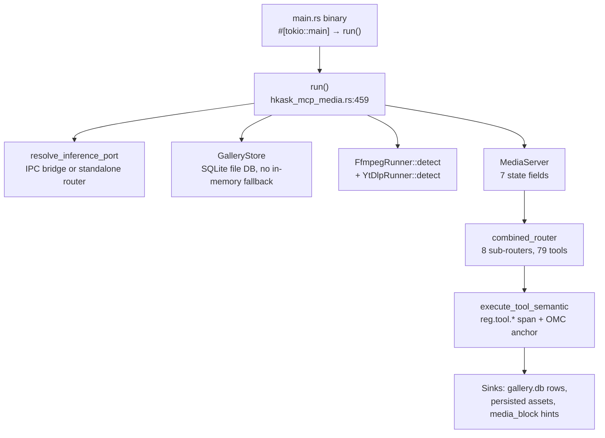

# Media MCP Server Reference

**Crate:** `mcp-servers/hkask-mcp-media`
**Tools:** 79 — pinned end-to-end by `tool_surface_is_exactly_79_registered_tools` (`src/hkask_mcp_media.rs:398-400`), which asserts `MediaServer::combined_router().list_all().len() == 79`. The count includes the 15 `educt_*` transcript-layer tools and the face-registry tools. The 2026-09-03 consolidation merged `transcribe` into `transcribe_bundle`, `gallery_find_similar` into `gallery_search` (semantic mode), `gallery_add_video`+`gallery_add_audio` into `gallery_add_media`, and `generate_variants` into `generate_image` (num_images). The test exists to catch silent registration drops: a `#[tool]` impl block without `#[tool_router]`, or a sub-router missing from `combined_router()`, silently registers nothing while `cargo check` passes (`src/hkask_mcp_media.rs:384-387`).
**Registration:** built-in server `id: "media"`, `binary: "hkask-mcp-media"` in `BUILT_IN_MCP_SERVERS` (`kask/crates/kask_bridge/src/mcp_servers.rs:431`).

Tool count and every tool name below were verified against `#[tool(...)]`-annotated
`pub async fn` signatures in `mcp-servers/hkask-mcp-media/src/tools/*.rs` (2026-08-28 audit). The canonical tool-name list is also code-generated by `build.rs` into `tool_names.gen.rs` and `include!`d at `src/hkask_mcp_media.rs:353` — consumers (e.g. `media_panel`) re-export it to verify Steer prompt tool advertisements (`src/hkask_mcp_media.rs:347-352`).

## Architecture

The server is a thin binary over a library: `src/main.rs:6-9` calls `hkask_mcp_media::run()`, which resolves the inference port, opens the gallery DB, and hands a `MediaServer` constructor closure to `hkask_mcp_server::run_server` (`src/hkask_mcp_media.rs:459-556`). All LLM and media-generation calls route through a single `InferencePort` — through zed's `LanguageModelRegistry` via the IPC bridge when `HKASK_INFERENCE_SOCKET` is set, falling back to a standalone router with env-var keys otherwise (`src/hkask_mcp_media.rs:462-468`).

<!-- DIAGRAM_ALIGNMENT
id: DIAG-RF-006
verified_date: 2026-08-28
verified_against: kask/mcp-servers/hkask-mcp-media/src/main.rs:6-9; kask/mcp-servers/hkask-mcp-media/src/hkask_mcp_media.rs:112-129 (MediaServer fields), 356-364 (combined_router), 457-556 (run); kask/mcp-servers/hkask-mcp-media/src/tools.rs (7 tool modules)
status: VERIFIED
-->

### Server struct

`MediaServer` is declared via the `mcp_server!` macro with seven state fields (`src/hkask_mcp_media.rs:112-129`):

| Field | Role |
|-------|------|
| `vision_port: Arc<dyn InferencePort>` | Vision/chat AND media generation (image/video/speech/transcription) via `InferencePort::media_generate`; also `embed` and `list_vision_models` for the gallery embedding path |
| `gallery_state: Arc<Mutex<Option<GalleryState>>>` | Currently-organized gallery; `None` until `gallery_organize` runs |
| `gallery_store: Arc<GalleryStore>` | Durable SQLite-backed store (tags, faces, lineage, albums) |
| `template_env: minijinja::Environment` | Jinja2 prompt templates for vision calls |
| `ffmpeg: FfmpegRunner` | ffmpeg availability probe (`video/ffmpeg.rs:39`) |
| `ytdlp: YtDlpRunner` | yt-dlp availability probe (`video/ytdlp.rs:19`), used by `video_fetch` |
| `job_store: jobs::JobStore` | In-memory async generation job tracking (`src/jobs.rs:1`) |

### Router composition

`combined_router()` sums seven sub-routers, one per `tools/` module (`src/hkask_mcp_media.rs:356-364`): `gallery_router` + `processing_router` + `audio_router` + `generation_router` + `models_router` + `jobs_router` + `workflows_router`. The `#[rmcp::tool_handler(router = Self::combined_router())]` attribute on the `ServerHandler` impl wires dispatch (`src/hkask_mcp_media.rs:377-378`).

## Bootstrap and configuration

**Bootstrap pattern:** `src/main.rs:6-9` (`#[tokio::main] async fn main` → `hkask_mcp_media::run()`) → `run()` at `src/hkask_mcp_media.rs:459` → `hkask_mcp_server::run_server("hkask-mcp-media", env!("CARGO_PKG_VERSION"), ...)` at `src/hkask_mcp_media.rs:535-554`. `run()` deliberately does not call `dotenvy::dotenv()` — `run_server` calls `load_dotenv` internally (`src/hkask_mcp_media.rs:460-462`).

**Gallery DB:** durable file-backed SQLite at `{kask_data_dir}/mcp/media/gallery.db` (D28 — Standardized Artifact Storage), overridable via `HKASK_MEDIA_DB` (`src/hkask_mcp_media.rs:470-489`). There is **no in-memory fallback**: a DB open failure aborts startup, because the fallback silently degraded every subsequent tool call to "gallery empty" — a broken feedback loop (`src/hkask_mcp_media.rs:473-479`). The file DB is unencrypted (gallery metadata is not a secret) and therefore does **not** use `HKASK_DB_PASSPHRASE` (`src/hkask_mcp_media.rs:479-480`).

**Credentials:** one optional credential declared to `run_server` — `OPENROUTER_API_KEY`, "OpenRouter API key for vision LLMs" (`src/hkask_mcp_media.rs:550-553`). The kask-side registration allowlists `OPENROUTER_API_KEY` and `DEEPINFRA_API_KEY` (`kask/crates/kask_bridge/src/mcp_servers.rs:413`); both are optional because vision LLMs normally route through the IPC bridge to zed's `LanguageModelRegistry`, so the media process does not read API keys directly (`kask/crates/kask_bridge/src/mcp_servers.rs:409-412`).

**Environment variables** (all optional; the eight `HKASK_MEDIA_*_MODEL` vars resolve through the server's `models` module — `None` when unset, no constant fallback; callers fail visibly naming the env var, `src/hkask_mcp_media.rs:78-116`):

| Variable | Purpose | When unset |
|----------|---------|-------------|
| `HKASK_INFERENCE_SOCKET` | IPC bridge socket — routes vision/chat/embed through zed's `LanguageModelRegistry` | falls back to a standalone router with env-var keys |
| `HKASK_DATA_DIR` | Data dir for gallery DB path resolution | — |
| `HKASK_MEDIA_DB` | Gallery DB path override (`src/hkask_mcp_media.rs:485`) | `{data_dir}/mcp/media/gallery.db` |
| `HKASK_MEDIA_TTS_MODEL` | TTS model (`models::tts_model()`) | not configured — TTS calls fail visibly |
| `HKASK_MEDIA_STT_MODEL` | STT model (`models::stt_model()`) | not configured — STT calls fail visibly |
| `HKASK_MEDIA_PASS_MODEL` | Pass (image-processing) model (`models::PASS_ENV`) | not configured |
| `HKASK_MEDIA_AUDIO_CHAT_MODEL` | Audio-chat model (`models::AUDIO_CHAT_ENV`) | not configured |
| `HKASK_MEDIA_STRUCTURED_PASS_MODEL` | Structured-pass model (`models::STRUCTURED_PASS_ENV`) | not configured |
| `HKASK_MEDIA_VISION_MODEL` | Vision model (`models::vision_model()`) | not configured — vision calls fail visibly |
| `HKASK_MEDIA_IMAGE_GEN_MODEL` | Image generation model (`models::image_gen_model()`) | not configured |
| `HKASK_MEDIA_VIDEO_MODEL` | Video generation model (`models::video_model()`) | not configured |
| `HKASK_EMBEDDING_MODEL` | Embedding model for gallery similarity search (`src/hkask_mcp_media.rs:303-314`) | not configured — embedding-dependent calls fail visibly naming `kask.models.embedding_model` |

`build_model_list` lists only configured models — an unset modality is absent from the list, never a hidden default (`src/tools/models.rs:15-30`).

The kask settings UI can populate the five `HKASK_MEDIA_*_MODEL` overrides via `KaskMediaSettings` → `emit_media_env` (`kask/crates/kask_bridge/src/mcp_env.rs:352-371`; wired at `kask/crates/kask_bridge/src/settings.rs:707`).

**System dependencies:**

- **ffmpeg** — required by all local video tools and `audio_trim`/`audio_concat`. `require_ffmpeg` returns `McpToolError::unavailable("ffmpeg not found on system PATH — video tools unavailable.")` when absent (`src/hkask_mcp_media.rs:251-259`). `video_info` additionally uses ffprobe, bundled with ffmpeg (`src/tools/processing.rs:1009` tool description).
- **yt-dlp** — required only by `video_fetch` for platform URLs (YouTube, Vimeo). `require_yt_dlp` returns `unavailable` with install instructions ("pip install yt-dlp or apt install yt-dlp on Ubuntu 24.04+") when absent (`src/hkask_mcp_media.rs:262-271`).
- **Vision-capable provider** — required by describe/analyze/caption/expand-prompt tools. `require_vision` returns `permission_denied` directing the operator to enable a vision model in the kask inference provider settings (`src/hkask_mcp_media.rs:274-282`).

**Image size cap:** gallery images larger than 32 MiB are rejected before base64 encoding to prevent OOM (`MAX_IMAGE_READ_BYTES`, `src/hkask_mcp_media.rs:54-58`).

## Tool reference

Grouped by `tools/` module. "Line" cites the `pub async fn` signature in the group's source file. Descriptions are condensed from each tool's `#[tool(description = ...)]` doc comment.

**Tool-result contract (slim results).** Every tool whose `media_generate`
call produces an asset — image, video, and speech generation, transforms,
upscales, background removal, variants, region edits, `image_to_video`,
`video_meme`, `gallery_reproduce`, and the `job_submit` background path —
composes its result through `assets::persist_and_slim_result`
(`src/assets.rs`): the provider payload (base64 / data URI / URL) is decoded
or downloaded exactly once, written under
`{artifacts_dir}/media-mcp/generated/{uuid}.{ext}`, gallery-indexed, and the
tool result carries the persisted path (`output`, plus `outputs` for
multi-image responses where every `data[]` entry is persisted) and the
provider's non-payload metadata — never the payload itself. Returning the
raw provider response overflowed the model's context (the 2026-08-31
context bomb: two ~65K-token base64 results breached the 262144-token
limit on the following turn). A persist failure surfaces as a tool error
(`AssetPersistence` → `internal`); the raw payload is never the fallback.

### Gallery management (`tools/gallery.rs`, 27 tools)

| Tool | Line | Description |
|------|------|-------------|
| `gallery_organize` | 11 | Organize a photo gallery: create the index, scan a folder for images, return status. Run before `gallery_search`. |
| `gallery_status` | 161 | Gallery status: path, mode, image count, total size. |
| `gallery_search` | 186 | Search the gallery by description. Mode `tags` (default): fuzzy-matches AI-generated tags (objects, faces, colors, composition). Mode `semantic`: caption-embedding cosine similarity against the query text or a reference `image_index` (requires `gallery_analyze` first). The former `gallery_find_similar` tool, folded in as the semantic mode. |
| `gallery_refresh` | 439 | Rescan for new/removed images and update all AI metadata; face detection OFF by default, `include_faces=true` also scans the face reference folder and auto-matches against the face registry. |
| `describe_image` | 565 | Describe an image in detail; styles: descriptive, artistic, technical, alt_text. |
| `gallery_analyze` | 602 | Analyze gallery images with AI (faces, objects, colors, composition, scene descriptions); tags are persisted and become searchable. |
| `gallery_name_face` | 681 | Name a face group from `gallery_analyze`, by free-text name or registry `face_id`; after naming, `gallery_search` finds photos of that person. |
| `face_validate` | 761 | Validate a gallery image as a face reference: exactly 1 face, coverage ≥15%, frontal pose, good lighting, no occlusion, sharp focus; structured pass/fail with reasons. |
| `face_register` | 794 | Register a face reference with a person's name; auto-validates 6 criteria, `--force` skips validation; stored in `face_registry` for matching during `gallery_refresh`. |
| `face_scan_folder` | 842 | Scan a folder of reference face images (with YAML sidecars) and register each in `face_registry`; default `mcp/media/faces/`. |
| `face_list` | 877 | List registered faces; optional status filter (valid / rejected / pending). |
| `face_remove` | 903 | Remove a face from the registry by ID. |
| `gallery_timeline` | 927 | Organize gallery images by time period using EXIF dates; grouped by year, month, or decade. |
| `gallery_record_generation` | 1026 | Record generation lineage for a gallery image (prompt, model, provider, seed, params) so it can be reproduced or varied later; image must already be indexed. |
| `gallery_lineage` | 1079 | Show the recorded generation lineage for a gallery image; `lineage: null` if none recorded. |
| `gallery_asset_detail` | 1108 | Complete details for a gallery asset — record, tags, lineage, face associations in one call; the inspector-panel data source. |
| `gallery_reproduce` | 1107 | Re-run the generation that produced a gallery image from its stored lineage; the current image is the source for image-ops. |
| `gallery_delete_image` | 1205 | Delete an image from the gallery index; by default index-only, `delete_file=true` also removes the file. |
| `gallery_add_media` | 1256 | Import a video or audio file into the gallery index (media_type selects the kind); SHA-256 hash for deduplication. The former `gallery_add_video`/`gallery_add_audio` pair, merged. |
| `gallery_create_album` | 1375 | Create an album; metadata-only grouping, assets stay in place, an asset can be in multiple albums. |
| `gallery_list_albums` | 1401 | List all albums in the current gallery. |
| `gallery_move_to_album` | 1421 | Add a gallery asset to an album; idempotent. |
| `gallery_remove_from_album` | 1448 | Remove a gallery asset from an album; idempotent. |
| `gallery_delete_album` | 1476 | Delete an album; assets remain in the gallery. |
| `gallery_list_album_members` | 1499 | List all image indices in an album. |

### Image and video processing (`tools/processing.rs`, 15 tools)

| Tool | Line | Description |
|------|------|-------------|
| `image_remove_background` | 11 | Remove background from a gallery image; delegates to the configured background-removal provider. |
| `image_apply_style` | 53 | Apply style transfer to a gallery image; delegates to fal.ai Flux dev img2img. |
| `image_create_collage` | 116 | Create a collage from gallery images (local composition via `image` crate); three modes: `search_terms`, `similar_to_index`, or `image_indices`. |
| `video_clip` | 321 | Trim a video to start/end times using local ffmpeg. |
| `video_to_gif` | 382 | Convert a video segment to GIF using local ffmpeg. |
| `image_to_video` | 435 | Animate a gallery image into a short video clip; delegates to fal.ai Seedance 2.0. |
| `video_add_caption` | 507 | Add a text caption overlay to a video using local ffmpeg. |
| `video_remix` | 566 | Generate a video remix: clip, add caption, convert to GIF. |
| `video_from_images` | 651 | Create a video or GIF from a sequence of gallery images using ffmpeg. |
| `video_concat` | 715 | Concatenate multiple video clips into one using ffmpeg. |
| `video_caption` | 763 | Describe video content by extracting keyframes and analyzing them with a vision LLM. |
| `video_extract_frames` | 833 | Extract keyframes from a video as searchable gallery assets, each with its own lineage. |
| `video_meme` | 867 | Create a meme video from a gallery image with text overlay and camera motion (text rendering + AI motion generation). |
| `video_info` | 1009 | Probe a video file for metadata — duration, dimensions, codec, fps, bit rate — via ffprobe. |
| `video_fetch` | 1036 | Download a video from a URL (YouTube, Vimeo, direct file) to local storage, index it in the gallery, return a media block; requires yt-dlp for platform URLs. |

### Generation (`tools/generation.rs`, 7 tools)

| Tool | Line | Description |
|------|------|-------------|
| `generate_image` | 9 | Generate an image (or `num_images` variants) from a text prompt; variants are persisted individually with one display hint each for grid display. The former `generate_variants` tool, folded in. |
| `transform_image` | 69 | Transform an existing image with a text prompt describing the change. |
| `upscale_image` | 127 | Upscale an image to higher resolution. |
| `generate_video` | 164 | Generate a short video from a text prompt describing the scene in motion. |
| `expand_prompt` | 217 | Expand a short media prompt into a rich, detailed prompt using a vision LLM (Fooocus "V2" pattern); optional style preset (default, anime, realistic, cinematic, minimal). |
| `image_edit_region` | 399 | Region-selective edit (inpainting): mask (base64, white = edit, black = preserve) + prompt describing the edit. |

### Audio and voice (`tools/audio.rs`, 8 tools)

| Tool | Line | Description |
|------|------|-------------|
| `voice_design` | 11 | Design a synthetic voice profile from a character description; returns a `VoiceDesign` JSON for `generate_speech`. |
| `generate_speech` | 59 | Generate speech audio from text using a voice design; returns the persisted audio file path. |
| `transcribe_bundle` | 158 | Transcribe audio into a synchronized `TranscriptBundle` with word-level timings (full_text carries the plain text) — the single transcription entry point, and the ingest format for the educt layers. The former raw-JSON `transcribe` tool was removed (the bundle is a strict superset). |
| `audio_capture` | 250 | Capture audio from the default system microphone to a WAV file optimized for Whisper transcription (16 kHz mono). |
| `record_and_transcribe` | 302 | Record from microphone and transcribe in one call; returns linked audio file path and transcript. |
| `audio_trim` | 451 | Trim an audio file to start/end times; ffmpeg stream copy, fast and lossless. |
| `audio_concat` | 493 | Concatenate audio files; ffmpeg concat demuxer, fast and lossless. |

### Model browser (`tools/models.rs`, 2 tools)

| Tool | Line | Description |
|------|------|-------------|
| `model_list` | 115 | List configured media generation models with provider, modality, capabilities, default status; optional provider filter. |
| `model_info` | 140 | Detailed information about a specific media model by id. |

### Async job queue (`tools/jobs.rs`, 4 tools)

| Tool | Line | Description |
|------|------|-------------|
| `job_submit` | 67 | Submit an async media generation job; returns a job ID immediately, poll `job_status` for completion. Accepts only asset-producing ops (generate_image, image_to_image, upscale, remove_background, generate_video, image_to_video, generate_speech). |
| `job_list` | 220 | List generation jobs with status; optional filter (queued, running, completed, failed, cancelled). |
| `job_status` | 249 | Status of a specific generation job by ID. |
| `job_cancel` | 274 | Cancel a running or queued generation job by ID. |

### Workflows (`tools/workflows.rs`, 4 tools)

| Tool | Line | Description |
|------|------|-------------|
| `workflow_save` | 17 | Save a media generation workflow definition (serialized JSON) to the gallery; returns the workflow ID. |
| `workflow_list` | 44 | List all saved workflows, newest first. |
| `workflow_load` | 65 | Load a saved workflow by ID; returns the serialized JSON graph. |
| `workflow_delete` | 90 | Delete a saved workflow by ID; produced assets are not affected. |

### Support modules (no registered tools)

Non-tool modules hold shared implementation, re-exported for the `tools/` group files (`src/hkask_mcp_media.rs:44-48`): `assets.rs` (`persist_and_slim_result` — the slim-result composition site — over `persist_generated_asset`), `faces.rs` (`default_face_folder`), `text.rs` (`draw_text_mut`, `load_meme_font`, `measure_text`), `style.rs`, `templates.rs` (minijinja environment), `transcript.rs` (`TranscriptBundle`, `TranscriptSegment`, `TimedWord`), `types.rs`, `gallery/state.rs` + `gallery/vision.rs`, `video/ffmpeg.rs` + `video/ytdlp.rs`, `media_block.rs` (display-hint blocks), `jobs.rs` (`JobStore`), `omc.rs` (OMC mapping).

## Error classification

`src/error.rs` replaces `Result<_, String>` with a structured `MediaError` enum (13 variants, `src/error.rs:12-68`) and classifies errors into MCP wire-level `McpToolError` kinds. Per-variant, not blanket-internal:

| Mapper | Classification |
|--------|----------------|
| `map_media_error` (`src/error.rs:96-114`) | `GalleryNotInitialized`, `ImageNotFound` → `invalid_argument` (user error); `FfmpegUnavailable`, `YtDlpUnavailable` → `unavailable`; `Io`, `FfmpegFailed`, `VisionApi`, `VisionParse`, `Template`, `AssetPersistence`, `SidecarNotFound`, `SidecarInvalid`, `FaceRegistration` → `internal` |
| `map_gallery_store_error` (`src/error.rs:120-131`) | `NotFound` → `not_found`; infra errors → shared `map_infra_error`; `InvalidMode`, `AlreadyExists` → `invalid_argument` (caller-fixable) |
| `map_image_open_error` (`src/error.rs:138-148`) | missing file → `not_found`; permission failure → `permission_denied`; other I/O and decode failures → `internal` |
| `classify_inference_error` (`src/error.rs:176-182`) | typed `InferenceError::NotConfigured` → `permission_denied` (missing credential/provider, matching the canonical `hkask-mcp-swarm` pattern); every other failure → `unavailable` |
| `classify_embedding_error` (`src/error.rs:189-195`) | credential-missing substrings → `permission_denied` (string-matched — `EmbeddingGenerationError` has no typed `NotConfigured` variant yet, `src/error.rs:150-160`); otherwise → `unavailable` |

## OMC ontology anchoring

Every tool maps to exactly one MovieLabs OMC concept via `omc::tool_to_omc` (`src/omc.rs:25-86`); the concept vocabulary lives in the shared `hkask-bridge-ontology` crate (`src/omc.rs:9-12`). The concept is baked into the tool output JSON's `"ontology"` field by `media_block::enrich_with_omc_and_provenance` (`src/media_block.rs`), which the media widget consumes for type-aware feedback routing. (The former `MediaServer::ontology_anchor` wrapper and the `execute_tool_semantic` span tag were removed with the reg.tool ontology-tag purge.)

| Concept | Tools |
|---------|-------|
| `omc:CreativeWork` | `generate_image`, `generate_video`, `video_meme`, `expand_prompt`, `image_create_collage` |
| `omc:VersionInfo` | `transform_image`, `upscale_image`, `image_remove_background`, `image_apply_style`, `image_edit_region` |
| `omc:Scene` | `describe_image`, `gallery_analyze`, `video_caption` |
| `omc:Asset` | gallery management + retrieval (`gallery_search` … `video_fetch`), all face tools — faces are gallery assets (people identified within images), not OMC `Participant`, which is a production-side concept about who made the media (`src/omc.rs:22-24`) |
| `omc:Capture` | `generate_speech`, `audio_capture`, `record_and_transcribe`, `voice_design`, `transcribe`, `transcribe_bundle`, `audio_trim`, `audio_concat` |
| `omc:Sequence` | `video_clip`, `video_to_gif`, `image_to_video`, `video_concat`, `video_add_caption`, `video_remix`, `video_from_images`, `video_info` |
| `omc:Shot` | `video_extract_frames` |
| `omc:Task` | lineage (`gallery_record_generation`, `gallery_lineage`, `gallery_reproduce`), job queue (`job_submit` … `job_cancel`), workflows (`workflow_save` … `workflow_delete`) |
| `omc:Participant` | `model_list`, `model_info` — the model/provider is a participant in the creation task |

Three tests pin the mapping: `omc_mapping_covers_all_registered_tools` (every registered tool maps to a concept — catches a new tool added without an `omc::tool_to_omc` arm, `src/hkask_mcp_media.rs`), `omc_mapping_distinguishes_tool_families` (nine families map to nine distinct concepts, `src/hkask_mcp_media.rs`), and `omc_module_present_with_consumer` (the `media_block::enrich_with_omc_and_provenance` call site must keep referencing `omc::tool_to_omc` — a module without a consumer is dead surface, `src/hkask_mcp_media.rs`).

## Key paths

- **Gallery lifecycle:** `gallery_organize` → `gallery_analyze` (persist tags) → `gallery_search` / `gallery_find_similar` / `gallery_timeline`; `gallery_refresh` after adding files; `gallery_add_video` / `gallery_add_audio` for non-image assets
- **Face pipeline:** `face_validate` → `face_register` (or `face_scan_folder` in bulk) → `gallery_refresh` with `include_faces=true` → `gallery_name_face` → `gallery_search` by person name. **Design decision (2026-08-29):** face recognition relies on vision-LLM calls, not local code — the implementation surface is the minijinja (j2) templates `validate_face_ref` and `match_faces` (`src/templates.rs`) dispatched through the inference port, like every other vision capability in this server. No local embedding model, no local geometric matching (an LLM-produced-"embedding" cosine path was removed — LLMs cannot emit geometrically consistent vectors). Full build-out is deferred; the store's nullable `embedding` column is unused legacy from the removed path and not part of this design.
- **Generation with lineage:** `generate_image` → save to gallery → `gallery_organize`/`gallery_refresh` → `gallery_record_generation` → later `gallery_reproduce` or `gallery_lineage`/`gallery_asset_detail`
- **Prompt enrichment:** `expand_prompt` → `generate_image` / `generate_video` / `generate_variants`
- **Video from gallery assets:** `video_fetch` (acquire) or `gallery_add_video` (import) → `video_clip` / `video_add_caption` / `video_to_gif` / `video_remix`; `video_extract_frames` to turn keyframes back into searchable assets
- **Async generation:** `job_submit` → `job_status` (poll) → `job_cancel` if needed; `workflow_save` / `workflow_load` to persist multi-step recipes

## Cross-links

- [MCP Server Registry](README.md) — built-in server index (media entry pending)
- [Companies MCP Server Reference](companies.md) — sibling server reference with the same `combined_router` + `execute_tool_semantic` seam (DIAG-RF-004)
- [Scenarios MCP Server Reference](scenarios.md) — sibling server reference (DIAG-RF-005)
- `kask/crates/kask_bridge/src/mcp_servers.rs` — built-in server registration, credential and env allowlists
- [Diagram Index](../../DIAGRAMS_INDEX.md) — DIAG-RF-006 registration
