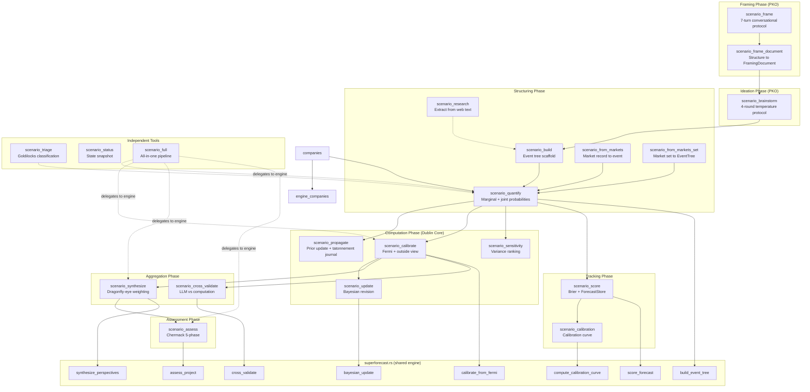

# Scenarios MCP Server Reference

**Crate:** `mcp-servers/hkask-mcp-scenarios`
**Tools:** 20 — `scenario_frame`, `scenario_frame_document`, `scenario_brainstorm`, `scenario_build`, `scenario_research`, `scenario_quantify`, `scenario_propagate`, `scenario_calibrate`, `scenario_update`, `scenario_sensitivity`, `scenario_synthesize`, `scenario_cross_validate`, `scenario_score`, `scenario_calibration`, `scenario_assess`, `scenario_triage`, `scenario_status`, `scenario_from_markets`, `scenario_from_markets_set`, `scenario_full`
**Auto-start:** No (in `CORE_EXCLUDED` — requires explicit opt-in via KaskSettings toggle (D9a); the former kask panel D10 was deleted)

Tool count verified against `#[tool(description = ...)]` annotations in
`mcp-servers/hkask-mcp-scenarios/src/hkask_mcp_scenarios.rs` (2026-08-05 audit).

## Pipeline Architecture (DIAG-RF-005)

This diagram shows the control flow between the 21 MCP tools in the scenarios server, grouped by pipeline phase. Solid arrows indicate the expected predecessor relationship enforced by `check_sequence` (warn-only, non-blocking). Dashed arrows indicate optional or independent paths. The `scenario_full` tool compresses the entire chain into a single call by delegating to the same engine functions.[^tetlock-scenarios-ref][^schwartz-scenarios-ref]

<!-- DIAGRAM_ALIGNMENT
id: DIAG-RF-005
verified_date: 2026-08-11
verified_against: mcp-servers/hkask-mcp-scenarios/src/hkask_mcp_scenarios.rs (20 tool routers + check_sequence), mcp-servers/hkask-mcp-scenarios/src/superforecast.rs (engine functions: build_event_tree, calibrate_from_fermi, bayesian_update, score_forecast, compute_calibration_curve, synthesize_perspectives, assess_project, cross_validate), mcp-servers/hkask-mcp-scenarios/src/types.rs; tool count verified at 20 #[tool] annotations
status: VERIFIED (v4 — tool count updated to 20: deleted scenario_from_companies)
-->

## Tool reference

### Framing (2)

| Tool | Description | Key params |
|------|-------------|------------|
| `scenario_frame` | Start a conversational framing session: a 7-turn protocol with behavioral-psychology openings and improv mode guidance. Run FIRST, before `scenario_brainstorm`. | `subject` |
| `scenario_frame_document` | Structure completed framing answers into a typed `FramingDocument` (focal question, decision at stake, horizon, scope, stakeholders, constraints). Feeds `scenario_brainstorm`. | `subject`, answers JSON |

### Ideation (1)

| Tool | Description | Key params |
|------|-------------|------------|
| `scenario_brainstorm` | Generate a 4-round structured brainstorming protocol (DIVERGE → GROUND → LINK → PRUNE) with persona rotation, temperature guidance, and quality gates. | `frame` (FramingDocument) |

### Structuring (2)

| Tool | Description | Key params |
|------|-------------|------------|
| `scenario_build` | Build a scenario event-tree scaffold from web research: returns an extraction template (event schema, dependency format, certainty tiers, Tetlock's 10 commandments) the LLM fills against `research_text`. | `frame`, `research_text` |
| `scenario_research` | Extract candidate scenario events from raw web research text: suggested names, yes/no framing, deadline hints, dependency hints, Fermi sub-questions. Draft output feeds `scenario_quantify`. | `subject`, `research_text` |

### Market bridges (2)

| Tool | Description | Key params |
|------|-------------|------------|
| `scenario_from_markets` | Convert a prediction-market record (from `hkask-mcp-prediction-markets` `market_lookup`/`market_match`) into a `ScenarioEvent` anchored on the market-implied base rate; applies the domain-bias correction deterministically and withholds `base_rate` on low reliability or weak match confidence. | `market_record`, `match_confidence` |
| `scenario_from_markets_set` | Compose a set of prediction-market records into a validated `EventTree` with caller-authored dependency edges; per-record gates, duplicate-question flags, cycle and CPT-size rejection; returns resolved tree (marginals, joint probability) plus warnings. | `market_records`, `match_confidences`, `dependency_specs` |

### Computation (5)

| Tool | Description | Key params |
|------|-------------|------------|
| `scenario_quantify` | Quantify an event tree: topological sort, marginal probabilities via conditional propagation, joint probability, per-event variance contribution, sensitivity ranking; detects cycles and missing parents. | `events` JSON |
| `scenario_propagate` | Update one event's prior and propagate through the tree: descendant marginals and joint probability recomputed; returns the updated tree plus a per-node before/after propagation journal (tâtonnement record). CPTs untouched. | `events`, `event_id`, `new_prior` |
| `scenario_calibrate` | Four-stage calibration (Fermi decomposition → outside view → inside view → calibration feedback from ≥5 resolved forecasts); returns calibrated probability, bounds, and certainty tier. | Fermi sub-questions, base rate |
| `scenario_update` | Bayesian update: P(H\|E) = P(E\|H) × P(H) / P(E); returns posterior and update magnitude. | `prior`, `likelihood`, `evidence_base_rate` |
| `scenario_sensitivity` | Rank events by contribution to outcome uncertainty (higher = closer to 50/50); identifies where to spend calibration effort. | `events` JSON |

### Aggregation (2)

| Tool | Description | Key params |
|------|-------------|------------|
| `scenario_synthesize` | Dragonfly-eye synthesis (Tetlock Stage 5): empirical-Bayes aggregation of ≥2 independent perspectives weighted by historical Brier; disagreement score and strongest dissent. | `perspectives` |
| `scenario_cross_validate` | Cross-validate an LLM estimate against a server-computed estimate per sub-question; flags for review when overall divergence exceeds threshold (default 0.15). | two estimate sets |

### Tracking (2)

| Tool | Description | Key params |
|------|-------------|------------|
| `scenario_score` | Brier-score a forecast against known outcomes; per-event and aggregate scores with interpretation bands (excellent <0.05 … worse_than_climatology ≥0.33). | `events`, `outcomes` |
| `scenario_calibration` | Calibration curve from stored forecasts (10 probability bins, actual hit rate vs mean forecast), optionally filtered by subject. | `subject` |

### Assessment (2)

| Tool | Description | Key params |
|------|-------------|------------|
| `scenario_assess` | Chermack Phase-5 project assessment across all five phases; combines quantitative metrics (Brier, disagreement, event count) with qualitative assessment; returns per-phase scores, gaps, and recommendations. | project data |
| `scenario_triage` | Triage a forecasting question (Tetlock Commandment 1): clarity, data availability, resolution criteria → clocklike / goldilocks / cloudlike. | `question` |

### Independent (2)

| Tool | Description | Key params |
|------|-------------|------------|
| `scenario_status` | Current server state: pipeline overview, calibration curve, cached event tree. | — |
| `scenario_full` | Run the complete pipeline in a single call (delegates to the same engine functions). | `subject` |

## Key paths

- **Standard pipeline:** `scenario_frame` → `scenario_frame_document` → `scenario_brainstorm` → `scenario_build` → `scenario_quantify` → `scenario_calibrate` → `scenario_synthesize` → `scenario_score` → `scenario_assess`[^tetlock-key-paths]
- **Research entry:** `scenario_research` → `scenario_build` (skip brainstorming if events are extracted from web text)
- **Companies bridge:** `scenario_quantify` → user authors per-node impact mappings → `scenario_impact_valuation` on `hkask-mcp-companies` (exogenous scenario events drive the company's DCF via additive assumption deltas, weighted by path probability)
- **Markets bridge:** `scenario_from_markets` (single market) or `scenario_from_markets_set` (full tree) → `scenario_quantify`; market records come from `hkask-mcp-prediction-markets` (`market_lookup` / `market_match`)
- **Update loop:** `scenario_propagate` re-propagates a tree after a prior revision; `scenario_update` applies a one-off Bayesian revision
- **Single-call:** `scenario_full` delegates to `triage_question`, `build_event_tree`, `sensitivity_ranking`, `calibrate_from_fermi`, `outside_view_adjustment`, `synthesize_perspectives`, `assess_project`
- **Independent:** `scenario_triage`, `scenario_status` callable at any point

## Cross-links

- [Prediction Markets MCP Server Reference](prediction-markets.md) — market records consumed by `scenario_from_markets` / `scenario_from_markets_set`
- [Superforecasting: Layered Model](../../explanation/forecasting-and-scenarios.md) — three-layer model (skill, math, servers)
- Scenarios Adversarial Review — code smell inventory and action items
- Scenarios Semantic Graph Audit — cross-skill/server dependency graph
- [MCP Server Registry](README.md) — built-in server index
- [Diagram Index](../../DIAGRAMS_INDEX.md) — DIAG-RF-005 registration

## Footnotes

[^tetlock-scenarios-ref]: Tetlock, P. E., & Gardner, D. (2015). *Superforecasting: The Art and Science of Prediction*. Crown Publishers.
    Cited for the calibration pipeline (Fermi decomposition, Bayesian update, Brier scoring, dragonfly-eye synthesis) the diagram traces.

[^schwartz-scenarios-ref]: Schwartz, P. (1991). *The Art of the Long View*. Doubleday.
    Cited for the scenario-framing and brainstorming phases the pipeline starts with.

[^tetlock-key-paths]: Tetlock, P. E., & Gardner, D. (2015). *Superforecasting: The Art and Science of Prediction*. Crown Publishers.
    Cited for the record → score → assess sequence the standard pipeline follows.
