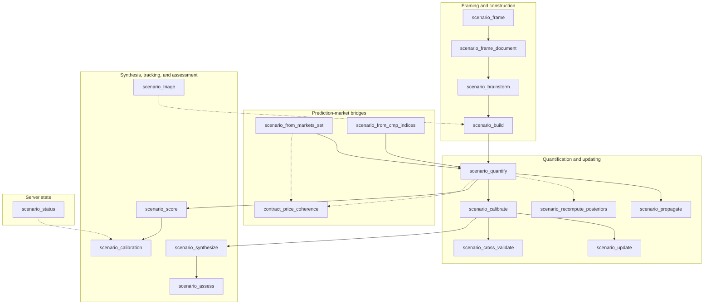

# Scenarios MCP Server Reference

**Crate:** `kask/mcp-servers/hkask-mcp-scenarios`
**Tools:** 19 — `scenario_frame`, `scenario_frame_document`, `scenario_brainstorm`, `scenario_build`, `scenario_quantify`, `scenario_propagate`, `scenario_recompute_posteriors`, `scenario_calibrate`, `scenario_update`, `scenario_synthesize`, `scenario_cross_validate`, `scenario_score`, `scenario_calibration`, `scenario_assess`, `scenario_triage`, `scenario_status`, `scenario_from_markets_set`, `scenario_from_cmp_indices`, `contract_price_coherence`. The direct market-record bridge is `scenario_from_markets_set`; a single record is passed as a set of one.
**Auto-start:** Yes by default with the full built-in set; operators can disable the fleet or this server through `kask.mcp` (`kask/crates/kask_bridge/src/settings.rs:140-165`; `kask/crates/kask_bridge/src/mcp_servers.rs:327-340,704`).

Tool count is pinned against the live `scenario_router()` by `tool_surface_is_exactly_19_registered_tools` (the `mod tests` pin in `kask/mcp-servers/hkask-mcp-scenarios/src/hkask_mcp_scenarios.rs`).

## Pipeline Architecture (DIAG-RF-005)

This diagram shows the control flow between the 19 MCP tools in the scenarios server, grouped by pipeline phase. Solid arrows indicate the expected predecessor relationship enforced by the pipeline conventions. Dashed arrows indicate optional or independent paths.[^tetlock-scenarios-ref][^schwartz-scenarios-ref]


```mermaid
flowchart TD
    subgraph Framing["Framing and construction"]
        frame["scenario_frame"] --> frame_doc["scenario_frame_document"]
        frame_doc --> brainstorm["scenario_brainstorm"] --> build["scenario_build"]
    end

    subgraph Bridges["Prediction-market bridges"]
        markets["scenario_from_markets_set"]
        cmp["scenario_from_cmp_indices"]
        coherence["contract_price_coherence"]
    end

    subgraph Computation["Quantification and updating"]
        quantify["scenario_quantify"]
        propagate["scenario_propagate"]
        posteriors["scenario_recompute_posteriors"]
        calibrate["scenario_calibrate"]
        update["scenario_update"]
        cross_validate["scenario_cross_validate"]
    end

    subgraph Synthesis["Synthesis, tracking, and assessment"]
        synthesize["scenario_synthesize"]
        score["scenario_score"]
        calibration["scenario_calibration"]
        triage["scenario_triage"]
        assess["scenario_assess"]
    end

    subgraph State["Server state"]
        status["scenario_status"]
    end

    build --> quantify
    markets --> quantify
    cmp --> quantify
    quantify --> propagate
    quantify -.-> posteriors
    quantify --> calibrate
    calibrate --> update
    calibrate --> cross_validate
    calibrate --> synthesize
    quantify --> score --> calibration
    synthesize --> assess
    triage -.-> build
    markets -.-> coherence
    quantify -.-> coherence
    status -.-> calibration
```

<!-- DIAGRAM_ALIGNMENT
id: DIAG-RF-005
verified_date: 2026-10-06
verified_against: kask/mcp-servers/hkask-mcp-scenarios/src/hkask_mcp_scenarios.rs (the 19 #[tool] handlers; tool_surface_is_exactly_19_registered_tools pin); kask/mcp-servers/hkask-mcp-scenarios/src/superforecast.rs; kask/mcp-servers/hkask-mcp-scenarios/src/types.rs
status: VERIFIED
-->

## The three Schwartz surfaces

Three distinct "Schwartz scenario" semantics live across the stack; they
share the reference model (Schwartz, *The Art of the Long View*, 1991)
and nothing else — each has its own contract:

1. **Valuation 2×2** — `scenario_analysis` on the companies server
   (`hkask-mcp-companies`): four growth×margin quadrants (Bull, Land
   Grab, Cash Cow, Bear), each run through DCF. A valuation instrument;
   the quadrants are assumption sets, not narratives.
2. **Divergent-futures narratives** — the `scenario-planning` skill's
   Phase 2b templates (`scenario-planning/axes-and-narratives` and
   siblings): Schwartz's steps 5–8 — two critical-uncertainty axes, four
   quadrant stories, implications, early-warning indicators. LLM
   judgment in skill templates; the scenarios server quantifies the
   event-tree backbone underneath them.
3. **Probability-weighted four-scenario distribution** —
   `calibrate_forecast` on the companies server: Tetlock-calibrated
   probabilities distributed across four Schwartz scenarios to produce
   a probability-weighted intrinsic value.

The scenarios server itself implements the MAIA event-based template
(event sets as yes/no questions over fixed horizons; four scenario
types, three horizons) and the Tetlock quantification; the Schwartz
narrative phases are the skill layer's.

## Design model

Twelve primitives, derived from the four reference models in the
2026-10 redesign review, define the server's shape (the review's
from-scratch verdict kept the event, tree, synthesis, journal,
calibration, impact-mapping, market-bridge, and certainty-tier
primitives substantially as built and added the project record; the
full derivation is in git history — see the Redesign record):

| Primitive | Contract | Reference-model source | Lives in |
|---|---|---|---|
| FramingDocument | the project charter: focal question, decision at stake, horizon, scope, stakeholders, success criteria, constraints, assumptions | Chermack Phase 1; Schwartz step 1 | `scenario_frame` → `scenario_frame_document`, persisted under the project record |
| BinomialEvent | yes/no question + deadline + probability + basis + Fermi sub-questions + base rate | MAIA event composition; Tetlock question discipline | `ScenarioEvent` |
| DependencyEdge | parent ids + bitmap-ordered conditional table, length 2^\|parents\| | MAIA path dependence; Bayesian-network CPT | `depends_on` |
| EventTree | marginals, topological order, joint = P(all events occur) | MAIA template; Tetlock inside view | `scenario_quantify` and the market bridges |
| Perspective + Synthesis | inverse-Brier-weighted aggregation with disagreement score | Tetlock dragonfly-eye | `scenario_synthesize` |
| ForecastRecord + journal | append-only journal + snapshot; Brier on tree marginals (schema v3) | Tetlock record/score | `ForecastStore` — `scenario_score` is the only journal writer |
| CalibrationObservation | 10-bin curve, weighted bias, isotonic second channel | Tetlock calibration | `scenario_calibration` |
| ScenarioProject | the spine: framing document, trees, assessment history, journal linkage | Chermack's unit of assessment | `ProjectStore` (see Project persistence) |
| Narrative / Implications / Indicators | quadrant stories, strategies, early-warning indicators | Schwartz steps 5–8 | the skill layer (`scenario-planning` templates) — a ruled contract, not a server primitive |
| ImpactMapping | per-node yes/no DCF deltas; 2^N paths weighted by probability | MAIA "events drive the financial forecast" | `scenario_impact_valuation` (companies server) |
| MarketBridge | market records / CMP indices → root events with provenance and gates | the CMP term-structure program | `scenario_from_markets_set` / `scenario_from_cmp_indices` |
| CertaintyTier | proximate ≥67% / probable 33–66% / possible <33% | MAIA three-level tier | `hkask_forecast` |

## Tool reference

### Framing (2)

| Tool | Description | Key params |
|------|-------------|------------|
| `scenario_frame` | Start a conversational framing session: a 7-turn protocol with behavioral-psychology openings and improv mode guidance. Run FIRST, before `scenario_brainstorm`. | `subject` |
| `scenario_frame_document` | Structure completed framing answers into a typed `FramingDocument` and persist it under the scenario project record (id defaults to the subject; a re-run updates in place). Feeds `scenario_brainstorm`. | `subject`, answers JSON, optional `project_id` |

### Ideation (1)

| Tool | Description | Key params |
|------|-------------|------------|
| `scenario_brainstorm` | Generate a 4-round structured brainstorming protocol (DIVERGE → GROUND → LINK → PRUNE) with persona rotation, temperature guidance, and quality gates. | `frame` (FramingDocument) |

### Structuring (1)

| Tool | Description | Key params |
|------|-------------|------------|
| `scenario_build` | Build a scenario event-tree scaffold from web research: returns an extraction template (event schema, dependency format, certainty tiers, Tetlock's 10 commandments) the LLM fills against `research_text`. | `frame`, `research_text` |

### Market bridges (3)

| Tool | Description | Key params |
|------|-------------|------------|
| `scenario_from_markets_set` | Compose a set of prediction-market records into a validated `EventTree` with caller-authored dependency edges; per-record gates, duplicate-question flags, cycle and CPT-size rejection; returns resolved tree (marginals, joint probability) plus warnings. | `market_records`, `match_confidences`, `dependency_specs` |
| `scenario_from_cmp_indices` | Compose provenance-carrying constant-maturity prediction indices into an `EventTree`, optionally with caller-authored dependencies. | `cmp_indices`, `observation_date`, `dependency_specs` |
| `contract_price_coherence` | Compare a tree-implied joint or marginal probability with an observed contract price and cost band. | `market_price`, `cost_band`, `tree_implied` |

### Computation (5)

| Tool | Description | Key params |
|------|-------------|------------|
| `scenario_quantify` | Quantify an event tree: topological sort, marginal probabilities via conditional propagation, joint probability, per-event variance contribution, sensitivity ranking; detects cycles and missing parents. | `events` JSON |
| `scenario_propagate` | Update one event's prior and propagate through the tree: descendant marginals and joint probability recomputed; returns the updated tree plus a per-node before/after propagation journal (tâtonnement record). CPTs untouched. | `events`, `event_id`, `new_prior` |
| `scenario_recompute_posteriors` | Recompute posteriors under evidence, in BOTH directions (forward to descendants, backward to ancestors) via the shared `hkask_forecast::posterior` engine — the same implementation the graph widget delegates to. Exact on polytrees; degrades to forward-only with a note on multiply-connected DAGs. | `events`, `evidence` (one of `observed_probability` / `occurred` / `likelihood_ratio` per entry) |
| `scenario_calibrate` | Four-stage calibration (Fermi decomposition → outside view → inside view → calibration feedback from ≥5 resolved forecasts); returns calibrated probability, bounds, and certainty tier. | Fermi sub-questions, base rate |
| `scenario_update` | Bayesian update: P(H\|E) = P(E\|H) × P(H) / P(E); returns posterior and update magnitude. | `prior`, `likelihood`, `evidence_base_rate` |

### Aggregation (2)

| Tool | Description | Key params |
|------|-------------|------------|
| `scenario_synthesize` | Dragonfly-eye synthesis (Tetlock Stage 5): empirical-Bayes aggregation of ≥2 independent perspectives weighted by historical Brier; disagreement score and strongest dissent. | `perspectives` |
| `scenario_cross_validate` | Cross-validate an LLM estimate against a server-computed estimate per sub-question; flags for review when overall divergence exceeds threshold (default 0.15). | two estimate sets |

### Tracking (2)

| Tool | Description | Key params |
|------|-------------|------------|
| `scenario_score` | Brier-score a forecast against known outcomes; per-event and aggregate scores with interpretation bands (excellent <0.05 … worse_than_climatology ≥0.33). | `events`, `outcomes` |
| `scenario_calibration` | Calibration curve from stored forecasts (10 probability bins, actual hit rate vs mean forecast), optionally filtered by subject. | `subject` |

### Assessment (2)

| Tool | Description | Key params |
|------|-------------|------------|
| `scenario_assess` | Chermack Phase-5 project assessment anchored on the project record: Preparation from the framing document, event/dependency counts from the stored tree, calibration scoped to the project's subject; caller metrics override the derived values. Unknown project id → not found. | `project_id` + optional overrides |
| `scenario_triage` | Triage a forecasting question (Tetlock Commandment 1): clarity, data availability, resolution criteria → well_specified / goldilocks / needs_refinement. | `question` |

### Independent (1)

| Tool | Description | Key params |
|------|-------------|------------|
| `scenario_status` | Current server state: pipeline overview, calibration curve, cached event tree. | — |

## Key paths

- **Standard pipeline:** `scenario_frame` → `scenario_frame_document` → `scenario_brainstorm` → `scenario_build` → `scenario_quantify` → `scenario_calibrate` → `scenario_synthesize` → `scenario_score` → `scenario_assess`[^tetlock-key-paths]
- **Research entry:** `scenario_build` with research text (skip brainstorming if events are extracted from web text)
- **Companies bridge:** `scenario_quantify` → user authors per-node impact mappings → `scenario_impact_valuation` on `hkask-mcp-companies` (exogenous scenario events drive the company's DCF via additive assumption deltas, weighted by path probability). The optional `presentation: "WorkbookWhatIf"` publishes the FULL path grid (the JSON output caps at 50 paths; the workbook carries every one) as an editable workbook revision with a ```spreadsheet display hint — the default `DataOnly` output is unchanged
- **Markets bridge:** `scenario_from_markets_set` (a single market is a set-of-1) → `scenario_quantify`; market records come from `hkask-mcp-prediction-markets` (`market_lookup` / `market_match`)
- **Update loop:** `scenario_propagate` re-propagates a tree after a prior revision; `scenario_update` applies a one-off Bayesian revision; `scenario_recompute_posteriors` recomputes under evidence in both directions (the shared `hkask_forecast::posterior` engine — the graph widget delegates to the same implementation)
- **Independent:** `scenario_triage`, `scenario_status` callable at any point

## Forecast persistence

`scenario_score` durably tracks every forecast and outcome in `ForecastStore`
(`kask/mcp-servers/hkask-mcp-scenarios/src/superforecast/store.rs`): an append-only JSON-line journal (one line per
mutation, `fsync`ed before the record is admitted to memory) plus a full
snapshot compacted from it. On load, the snapshot is applied first and the
journal is replayed on top of it, last write wins.

**Marginal scoring (schema v3, PR-02).** `scenario_score` resolves the
event tree first and Brier-scores each node's resolved MARGINAL — for a
dependent event the belief actually forecast is the marginal the tree
propagates, not the caller-supplied prior field. The journal records the
marginal with `scored_from_marginal: true` (schema v3); v2-and-earlier
records hold the caller-supplied prior and are distinguished by the
marker. The calibration curve and the domain-bias correction
consequently learn from marginals on v3 records. A re-score never
rewrites the historical forecast: the recorded probability stays the
first score's marginal.

Durability ordering — verified by regression (`kask/mcp-servers/hkask-mcp-scenarios/tests/tool_behavior.rs`):

- A failed snapshot publication leaves the journal intact, so reopening
  recovers every acknowledged record exactly once
  (`snapshot_failure_preserves_journal_for_recovery`).
- A journal write failure surfaces as a tool error before the record is
  admitted to memory or published (`journal_failure_is_surfaced_before_memory_changes`).
- A snapshot published with its journal not yet cleared — the crash window
  between publication and truncation — recovers exactly once with the
  journal's last write winning, never the stale snapshot or a duplicate
  (`snapshot_with_uncleared_journal_recovers_exactly_once`).
- Compaction writes a synced same-directory `tempfile` and publishes it by
  atomic rename before the journal is truncated (and directory-synced on
  Unix); `scenario_score` surfaces persistence errors and notes that earlier
  records may already be journaled rather than claiming request rollback.

Not claimed: the store assumes a single writing process (no multi-process
locking), and only `fsync` ordering is verified — no power-loss/crash-consistency
guarantee is tested. The property that a failed replacement leaves the previous
snapshot readable is enforced by construction (temp file + atomic rename; a
failed write cannot touch the published file), but it has no deterministic
failure-injection fixture: the only publication failure that is
privilege-independent — a directory at the destination — cannot coexist with
a prior snapshot file at that path. It is design-reviewed, not test-pinned.

## Project persistence

Scenario projects (the framing document, the last quantified tree, the
assessment history) persist in `ProjectStore`
(`kask/mcp-servers/hkask-mcp-scenarios/src/superforecast/project.rs`):
a single `projects.json` snapshot under the server's data dir
(`{kask_data_dir}/mcp/scenarios/projects.json`), published by atomic
rename per write — the same ordering as the forecast snapshot, with no
journal (projects are low-volume by design).

- `scenario_frame_document` creates/updates the project (id defaults
  to the subject; a re-run updates in place) and persists the framing
  document — Chermack Phase 1 evidence.
- The tree-caching tools (`scenario_quantify`, `scenario_propagate`,
  `scenario_from_cmp_indices`) persist the tree into the project record
  — the durable tree cache. `contract_price_coherence`'s `tree_implied`
  default falls back to it when the in-memory cache is empty, so the
  documented default survives a server restart (pinned by
  `quantified_tree_survives_a_server_restart_for_coherence`).
- `scenario_assess` is anchored on the project record: an unknown
  project id is `not_found` naming it; event/dependency counts derive
  from the stored tree, Preparation from the framing document, and the
  calibration curve is scoped to the project's subject.
  Caller-supplied metrics override the derived values.

## Testing

`tests/tool_behavior.rs` drives the tool surface through the public
`Parameters<T>` seam; the tool count is pinned against the live router by
`tool_surface_is_exactly_19_registered_tools`. The property layer
(`src/property_tests.rs`, testing-protocol layer 2) verifies the event-tree
marginalization math against two independent oracles: brute-force
marginalization of the enumerated global joint distribution (exact when
parent-independence holds — the generator enforces disjoint-ancestry parent
sets) and a test-local re-implementation of the documented noisy-OR rule for
multi-group trees. The parent-independence approximation itself (marginals
computed over parent *marginals*, per `types.rs` — exact only under
disjoint ancestries) is pinned as intentional by
`correlated_parents_keep_the_documented_independence_approximation`.

## Formal specification

The event-tree contract is machine-checked in core Lean (4.34.0, no
Mathlib) at
[`kask/lean/event_tree_marginalization.lean`](../../../lean/event_tree_marginalization.lean):
eight theorems over an abstract `OrdField` — CPT completeness and
soundness (a marginalizing table has exactly 2^|parents| entries, and
every 2^|parents|-entry table marginalizes), the bitmap order for one
and two parents, probability bounds (parents and entries in [0,1] →
marginal in [0,1]), mass conservation (the all-ones table marginalizes
to 1 whatever the parents), and noisy-OR exactness and bounds.
`lean_check` exit 0, no `sorryAx`; `noisyOr_single` depends on no
axioms. Stated assumptions: the `OrdField` class fields (the theorems
are parametric), parent independence (the same factorization the Rust
makes — its approximation character under shared ancestry is pinned
by `correlated_parents_keep_the_documented_independence_approximation`),
exact arithmetic (the f64 clamp is not modeled), and `none` = the
server's validation rejection. The property layer pins the f64
implementation against two independent oracles; the Lean pin proves
the contract for every ordered field — contract proven, implementation
property-tested.

## Redesign record (2026-10-06/07)

The server was reviewed from scratch against its four reference models
(MAIA "Time Horizons", Schwartz 1991, Tetlock & Gardner 2015, Chermack
2011) and rebuilt per a 16-proposal set. The review artifacts (plan,
findings, proposals, improvement plan) were consolidated into this
reference on 2026-10-07 and live in git history
(`8692a23520`..`e677993804`).

**Decisions with standing force:**

- **`scenario_full` removed** (operator decision, 2026-10-06): the
  one-call Tetlock batch had zero skill callers and its inline
  assessment stage was a pass-through of caller metrics; the staged
  pipeline is the only path (surface pin 20 → 19).
- **Portfolio event-exposure report deferred** (operator decision,
  2026-10-06): no consumer demands it; the recorded scenario join on
  equity forecasts (`scenario_project_id`, `scenario_tree`,
  `fused_volatility`) makes it an M effort when demand materializes.
- **Narratives and indicators live in the skill layer** (ruled): the
  server stores the project record, trees, and assessments; Schwartz's
  narrative phases are the `scenario-planning` skill's templates.

**Accepted limitations (ruled, watched):**

- The calibration curve's empty bins surface as `null` hit rates with
  bin-midpoint expecteds — cosmetic, surfaced rather than hidden.
- `scenario_score` persists a full snapshot per resolution event — a
  minor durability-ordering cost, accepted.
- `hkask_forecast::marginalize` zero-fills missing table entries while
  the server's validation rejects wrong lengths first — the lenient
  path is shielded; a future caller that skips validation inherits
  silent zero-fill (documented seam).
- `compute_marginal_probabilities` defaults a missing parent to 0.0
  with a warn — unreachable through the public path (the topological
  sort rejects unknown parents first); watched.
- Ontology anchoring is coarse (protocol tools → `pko:PROCEDURE`,
  everything else → `dc_bibo:DATASET`) — functional.

**Commit ledger:** `8692a23520` (review + Slices 1–3) → `64b2f4f6d5`
(Slices 4–6: shared posterior engine, marginal scoring, scenario
provenance) → `c03cf4aa89` (PR-10 workbook presentation) →
`b252d88b3d` (post-restart follow-ups) → `1a8c500c12` (PR-13 removal,
pin 20 → 19) → `e677993804` (closeout receipts). Live receipts: the
19-tool surface verified post-restart (`list_mcp_tools`); 39 scenarios
tests green; scoped clippy + machete clean. The execution goal
(`c84339e0`) closed through the batch-record path — its durable record
is this section plus the commits (the curator-memory batch record
`kanban:goal-retention`/`batch_prune_2026-10-07` cites this location).

## Cross-links

- [Prediction Markets MCP Server Reference](prediction-markets.md) — market records consumed by `scenario_from_markets_set`; CMP indices consumed by `scenario_from_cmp_indices`
- [The Forecasting Stack: Three-Layer Architecture](README.md#the-forecasting-stack-three-layer-architecture) — three-layer model (skill, math, servers)
- [MCP Server Registry](README.md) — built-in server index
- [Diagram Index](../../DIAGRAMS_INDEX.md) — DIAG-RF-005 registration

## Footnotes

[^tetlock-scenarios-ref]: Tetlock, P. E., & Gardner, D. (2015). *Superforecasting: The Art and Science of Prediction*. Crown Publishers.
    Cited for the calibration pipeline (Fermi decomposition, Bayesian update, Brier scoring, dragonfly-eye synthesis) the diagram traces.

[^schwartz-scenarios-ref]: Schwartz, P. (1991). *The Art of the Long View*. Doubleday.
    Cited for the scenario-framing and brainstorming phases the pipeline starts with.

[^tetlock-key-paths]: Tetlock, P. E., & Gardner, D. (2015). *Superforecasting: The Art and Science of Prediction*. Crown Publishers.
    Cited for the record → score → assess sequence the standard pipeline follows.
