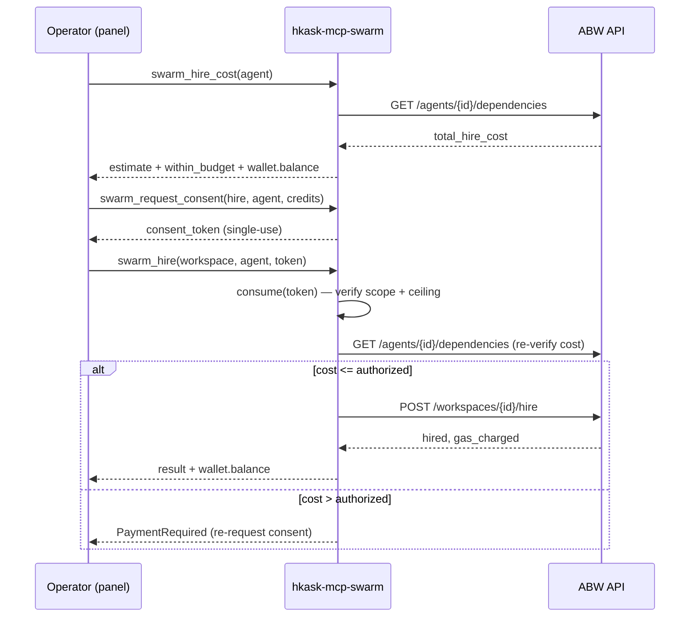

# Swarm MCP Server Reference

**Crate:** `mcp-servers/hkask-mcp-swarm`
**Tools:** 17 — catalogue, workspace, authoring, composition, curator, and consent-gated spend
**External service:** [Agent Bestiary World (ABW)](https://agent-bestiary.world) — a hosted marketplace/ecology of AI agents
**Auth:** ABW Pro-tier API key (`Authorization: Bearer`), injected as `HKASK_ABW_API_KEY`

The swarm server exposes Agent Bestiary World's agent catalogue, workspaces
("swarms"), agent authoring, team composition, and the Xaman Ek curator as MCP
tools, governed by the kask MCP runtime (OCAP capability gating, gas budgeting,
`reg.swarm.*` spans). It is the substrate for the **Agent Swarm panel**
(`crates/swarm_panel`) and the **`swarm-intelligence` skill**.

> **Integration plan:** [`docs/plans/abw-swarm-intelligence.md`](../../plans/abw-swarm-intelligence.md)
> **Audits:** [`docs/audits/abw-swarm-kali-audit.md`](../../audits/abw-swarm-kali-audit.md) (security), [`docs/audits/abw-swarm-bug-hunt.md`](../../audits/abw-swarm-bug-hunt.md)

## The three surfaces

The server's tools map onto the three things an operator does with ABW:

| Surface | What | Tools |
|---|---|---|
| **Authoring** | Create new agents | `swarm_generate_prompt`, `swarm_generate_ontology`, `swarm_create_agent`, `swarm_ontology_templates` |
| **Composition** | Group agents into teams | `swarm_create_swarm`, `swarm_create_app`, `swarm_xaman` |
| **Operation** | Browse, run, spend | `swarm_list_agents`, `swarm_get_agent`, `swarm_list_apps`, `swarm_get_swarm`, `swarm_execute_agent`, `swarm_hire`, `swarm_delegate`, `swarm_run_status`, `swarm_hire_cost`, `swarm_request_consent` |

## Tool reference

### Discovery (read-only)

| Tool | ABW endpoint | Purpose |
|---|---|---|
| `swarm_list_agents` | `GET /api/agents` | Browse the catalogue (filter by type/tag). Descriptions sanitized. Keyless-capable but auth-gated for consistency (KA-02). |
| `swarm_get_agent` | `GET /api/agents` | Full card for one agent (capabilities, dependencies, stats). |
| `swarm_list_apps` | `GET /api/apps` | Published Apps (reusable team manifests) — the sharing surface. |
| `swarm_get_swarm` | `GET /api/workspaces[/{id}]` | List workspaces or get one roster. |
| `swarm_run_status` | `GET /api/workspaces/{id}/messages` | Recent run activity. Each message sanitized. |
| `swarm_ontology_templates` | `GET /api/ontology-templates` | Seed-ontology starting points for authoring. |

### Authoring (agent creation)

| Tool | ABW endpoint | Purpose |
|---|---|---|
| `swarm_generate_prompt` | `POST /api/agents/generate-prompt` | Draft a system prompt from a description. Output sanitized. |
| `swarm_generate_ontology` | `POST /api/agents/generate-ontology` | Draft a seed ontology (Mermaid ER) for a domain. |
| `swarm_create_agent` | `POST /api/agents` | Create the agent. Builds the full card (model, temperature, tags, sample queries); supports `dependencies` for compound agents. |

### Composition (team building)

| Tool | ABW endpoint | Purpose |
|---|---|---|
| `swarm_xaman` | `POST /api/xaman/sessions[/{id}/message]` | Consult Xaman Ek (typed sessions: `composition_design`, `workspace_help`, `free`). **Consent-gated** when `curator_consent_default: false`. Output sanitized. |
| `swarm_create_app` | `POST /api/xaman/sessions/{id}/create-app` | Materialize a composition session into an App. |
| `swarm_create_swarm` | `POST /api/teams` + `/workspaces/{id}/hire` | Create a workspace and optionally hire agents (each hire consent-gated). |

### Governed spend (consent-gated)

| Tool | ABW endpoint | Purpose |
|---|---|---|
| `swarm_hire_cost` | `GET /api/agents/{id}/dependencies` | Pre-flight cost estimate. Fails closed on missing field (no fabricated zero). |
| `swarm_request_consent` | — (local) | Mint a single-use, action+target-scoped consent token after the operator confirms. `require_auth`. |
| `swarm_hire` | `POST /api/workspaces/{id}/hire` | Hire an agent. Consumes the token, **re-verifies cost against ABW** before spending. |
| `swarm_delegate` | `POST /api/workspaces/{id}/messages` | Delegate a task via @mention. Consumes the token. |
| `swarm_execute_agent` | `POST /api/agents/{name}/execute` | Text-only agent consultation (token fees). Output sanitized. |

## The consent gate (the load-bearing invariant)

Every credit spend flows through a single-use, action-scoped, target-scoped
consent token. This is the enforcement point for the cost/consent invariant —
a spend **refuses** without a valid in-scope token, not just warns.

**Properties (all pinned by tests):**
- **Single-use** — a consumed token cannot be replayed.
- **Scope-bound** — a token for hiring agent A cannot hire agent B, or delegate.
- **Ceiling-enforced** — the spend re-fetches the real cost and refuses if it exceeds the authorized ceiling (the gate validates the *spend*, not just the *token*).
- **Auth-gated mint** — `swarm_request_consent` requires the API key, so a prompt-injected agent cannot self-authorize a spend.

## Error model

`SwarmError` maps ABW HTTP errors **and body-embedded domain errors** — ABW
wraps upstream LLM failures into HTTP 200 envelopes (e.g. Anthropic credit
exhaustion passed through verbatim in a Xaman Ek response), so status-code-only
mapping is insufficient.

| Variant | Trigger | Surface |
|---|---|---|
| `Auth` | 401/403, or no key configured | `permission_denied` |
| `PaymentRequired` | 402, or actual cost > authorized | `permission_denied` (algedonic) |
| `AgentNotFunded` | 500 "not funded" — the agent's *owner* hasn't configured an LLM key | `unavailable` |
| `UpstreamModelError` | HTTP 200 with embedded provider error | `unavailable` |
| `RateLimited` | 429 | `rate_limited` |
| `CuratorUnavailable` | Xaman Ek session create fails | `unavailable` |
| `ConsentDenied` | missing/invalid/replayed/out-of-scope consent token | `permission_denied` |
| `ApiVersionMismatch` | serde parse failure (possible API drift, S4) | `internal` |
| `Unavailable` | network/transport | `unavailable` |

## The algedonic channel

Every authenticated tool response carries `wallet.balance` — the operator's live
ABW credit balance. This closes the S1→S5 feedback loop: a spend is never out
of sight. A failed balance query emits `tracing::warn!` and returns `None`
(never a fabricated zero — the `.rules` `unwrap_or(0)` trap).

## Configuration

| Setting | Env var | Default | Notes |
|---|---|---|---|
| `kask.swarm.api_url` | `HKASK_ABW_API_URL` | `https://agent-bestiary.world` | Base URL override |
| `kask.swarm.max_credits_per_dispatch` | `HKASK_ABW_MAX_CREDITS` | `50` | S3 budget gate ceiling |
| `kask.swarm.curator_consent_default` | `HKASK_ABW_CURATOR_CONSENT_DEFAULT` | `false` | When `false`, `swarm_xaman` needs a consent token (S5 policy) |
| — | `HKASK_ABW_DEFAULT_AGENT_MODEL` | `claude-haiku-4-5-20251001` | Default model for new agents (KA-05) |
| — | `HKASK_ABW_API_KEY` | — | Pro API key (keychain credential, **never** in `mcp_env`) |

`KaskSwarmSettings` follows the `Default`-as-source-of-truth pattern (no serde
attributes, `From` reads from `Default`, `mcp_env` compares against `Default`).
The API key is a keychain credential (`kask://credentials/hkask_abw_api_key`),
injected by `mcp_env_with_credentials` — it never appears in the config env map.

## Security posture

The server's defense-in-depth coverage (from the kali audit):

- **Input filtering** — `require_auth` on all handlers, `url_encode_segment` on all path params, empty-string validation on spend paths.
- **Data/instruction separation** — `sanitize_abw_response` wraps all LLM/ABW output in a `{content, source: "abw", trust: "untrusted"}` container and strips injection prefixes.
- **Capability gating (OCAP)** — single-use consent tokens, scoped, ceiling-enforced, auth-gated mint.
- **Runtime monitoring** — `with_wallet` algedonic channel, `tracing::warn!` on stale signals, `detect_embedded_error`.
- **Credential scoping** — `credentials: Some(&["HKASK_ABW_API_KEY"])` (never `None`); the server receives only the ABW key, not other kask secrets.

Out-of-scope layers (5: taint labels, 8: deception detection) are deferred by
design with documented re-entry conditions — see the plan's §14.

## Cross-links

- [Integration plan](../../plans/abw-swarm-intelligence.md) — full design, API surface, build sequence
- [`swarm-intelligence` skill](../../plans/swarm-intelligence-skill-design.md) — the composition PDCA that acts on this substrate
- [Kali security audit](../../audits/abw-swarm-kali-audit.md) — 8-layer defense map
- [MCP Server Registry](README.md) — fleet-wide patterns and the 11-server catalog
