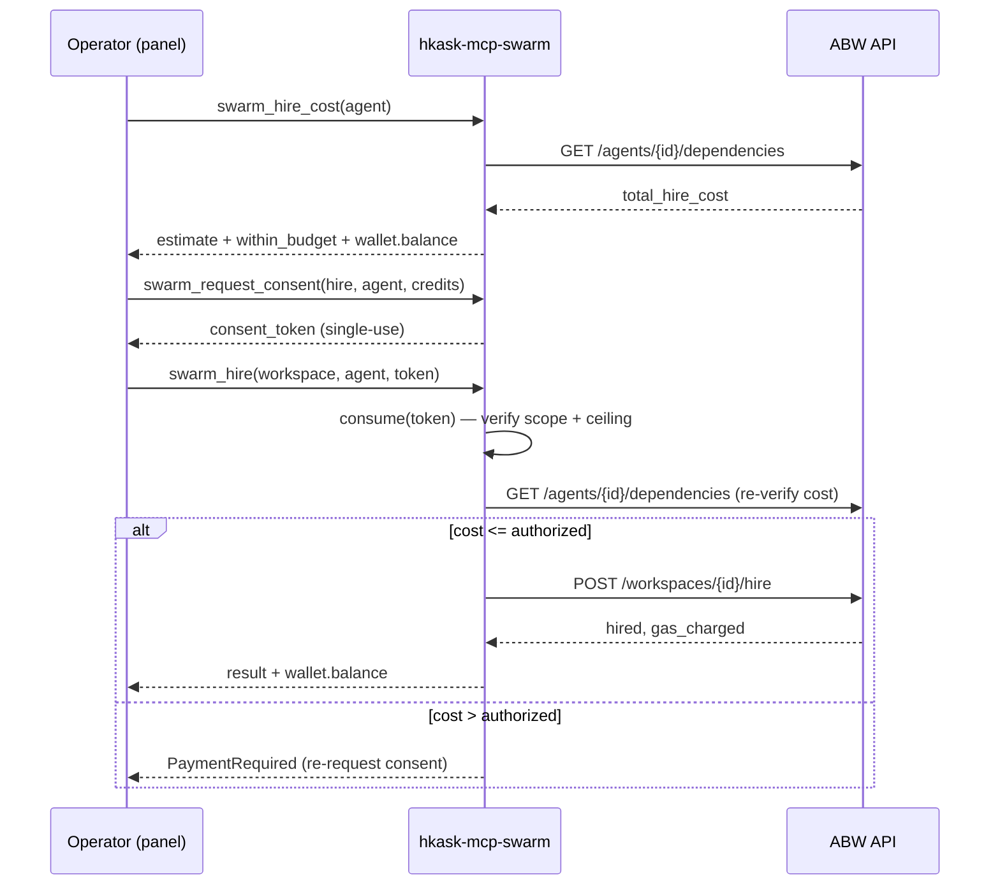

# Swarm MCP Server Reference

### Model policy

“Local swarm” names the execution substrate, not an LLM provider class. Agent
cards inherit the same host inference defaults as the curator; Settings → Kask
→ Models controls the platform default, including approved cloud models. No
smaller/local model is selected to save cost or avoid requesting permission.
Explicit per-agent overrides must be operator-selected; missing/unavailable
approved routing is an error, not permission to downgrade. The unused
`min_provider_class` metadata was removed from the Rust card type and seeds.

### Local evaluation boundary

Local evaluation supports **contains, not_contains, regex** only. Shell execution
and ambient file-existence checks have been removed, with no compatibility
fallback. These are deterministic response scores, not proof of independent
ground truth or useful improvement. Empty responses are scored; empty specs
and malformed regexes are errors. The rollout harness parses evaluators once
before inference and reuses them across repeats. Plans/suites validate supplied
specs before any delegation; direct delegation validates card evaluators first.

Per-task rates use every requested repeat, including completed incorrect
responses and delegation errors. `incorrect` is separate from `errors`.
`capture_status: "unavailable"` plus `capture_error` reports event-store open
failure; zero drop counters alone do not establish recorded evidence. Available
capture still requires checking dropped-event counters and durable records.
Pinned through the public tool by
`harness_counts_wrong_answers_and_reports_capture_unavailable` in
`/home/mdz-axolotl/Clones/zed-kask/kask/mcp-servers/hkask-mcp-swarm/src/hkask_mcp_swarm.rs`.

Implementation: `ResponseEvaluator` and `swarm_eval_agent_local` in
`/home/mdz-axolotl/Clones/zed-kask/kask/mcp-servers/hkask-mcp-swarm/src/local_tools.rs`.
Public contract tests `evaluator_admission_rejects_effectful_specs_before_agent_lookup`,
`evaluator_specs_are_validated_before_every_batch`, and
`response_evaluator_held_out_admission_matrix` live in
`/home/mdz-axolotl/Clones/zed-kask/kask/mcp-servers/hkask-mcp-swarm/src/hkask_mcp_swarm.rs`.
This follows parse-before-execute separation; Rust's bounded regex engine is
the existing implementation, not a shell-based oracle.[^response-regex]

[^response-regex]: Rust regex contributors. *regex crate: performance and untrusted input*. https://docs.rs/regex/latest/regex/#untrusted-input. Parsing is effect-free; semantic validity and held-out acceptance remain operator responsibilities.

**Crate:** `kask/mcp-servers/hkask-mcp-swarm`
**Tools:** 90 — 48 ABW cloud + 42 non-cloud, **both sets always exposed in either mode**.
Count is pinned end-to-end by `tool_surface_is_exactly_90_registered_tools`
(`kask/mcp-servers/hkask-mcp-swarm/src/hkask_mcp_swarm.rs:1029-1052`); the canonical list is build-script-generated:
`kask/mcp-servers/hkask-mcp-swarm/build.rs` scans router-annotated `swarm_*` functions
(`kask/mcp-servers/hkask-mcp-swarm/build.rs:34-81`) and emits `TOOL_NAMES`, kept in agreement with the live router by
`tool_names_const_matches_registered_surface`. The 90 functions split into 48 cloud
(`cloud_swarm_tools.rs`), 32 local plus 3 swarm-scoped thread tools (`local_tools.rs`),
3 A2A (`a2a_tools.rs`), and 4 local knowledge (`knowledge_tools.rs`);
`swarm_fleet_digest_local` and `swarm_select_agent_local` were added 2026-09-09
with the fermi absorption (grounding gate, reliance verdict, fleet digest,
agent selection; commit `256f87307c`); `swarm_update_agent` and
`swarm_get_local_agent` were added 2026-09-03
**Modes:** `kask.swarm.mode` selects the substrate — `abw` (default, ABW REST) or `local` (zed-kask's local substrate)
**ABW auth:** ABW Pro-tier API key (`Authorization: Bearer`), injected as `HKASK_ABW_API_KEY`
**Local auth:** none — local agents run on the operator's own substrate; there is no budget and no consent token

The swarm server exposes two parallel substrates for agent catalogue, team
composition, agent authoring, and governed spend:

- **ABW** (v1, default) — routes to [Agent Bestiary World (ABW)](https://agent-bestiary.world),
  a hosted marketplace/ecology of AI agents. Credit spend is consent-gated
  (`swarm_request_consent` mints single-use tokens; `swarm_hire`/`swarm_delegate`
  consume and re-verify them).
- **Local** (v2 §15) — routes to zed-kask's local substrate: `hkask-inference`
  (Ollama/cloud via the zed IPC bridge). No ABW calls, no consent token, and
  no budget: local agents run on the operator's own substrate (operator
  ruling 2026-09-04 — the budget concept is deprecated; timeouts are the
  enforcement/kill mechanism).

Both substrates dispatch through the kask MCP runtime (per-agent call metering,
`hkask.mcp.swarm` telemetry targets; tool reach itself is
bounded by the card's `mcp_tools` allowlist, not by the runtime). The server is the
substrate for the **Agent Swarm panel** (`crates/swarm_panel`), the
**`swarm-intelligence` skill** (including its local steering loop).

## The three surfaces

The server's tools map onto the three things an operator does with a swarm
substrate. ABW and local tools both fit the same three surfaces.[^reynolds-swarm-surfaces]

| Surface         | What                       | ABW tools                                                                                                                                                                                                                                                                                                                                     | Local tools                                                                                                                                                                                                                              |
| --------------- | -------------------------- | --------------------------------------------------------------------------------------------------------------------------------------------------------------------------------------------------------------------------------------------------------------------------------------------------------------------------------------------- | ---------------------------------------------------------------------------------------------------------------------------------------------------------------------------------------------------------------------------------------- |
| **Authoring**   | Create new agents          | `swarm_generate_prompt`, `swarm_generate_ontology`, `swarm_create_agent`, `swarm_ontology_templates`, `swarm_fork_agent`                                                                                                                                                                                                                      | `swarm_create_local_agent`, `swarm_reconfigure_local_agent`, `swarm_generate_prompt_local`, `swarm_generate_ontology_local`, `swarm_clone_to_local`, `swarm_ai_assist`                                                                   |
| **Composition** | Group agents into teams    | `swarm_create_swarm`, `swarm_create_app`, `swarm_xaman`, `swarm_fanout`, `swarm_publish_agent`, `swarm_publish_checks`                                                                                                                                                                                                                        | `swarm_create_local_swarm`, `swarm_list_local_swarms`, `swarm_get_local_swarm`, `swarm_delete_local_swarm`, `swarm_add_agent_local`, `swarm_remove_agent_local`, `swarm_list_local_agents`, `swarm_fanout_local`, `swarm_pipeline_local` |
| **Operation**   | Browse, run, spend, manage | `swarm_list_agents`, `swarm_get_agent`, `swarm_list_apps`, `swarm_get_swarm`, `swarm_execute_agent`, `swarm_hire`, `swarm_delegate`, `swarm_delegate_and_wait`, `swarm_run_status`, `swarm_hire_cost`, `swarm_request_consent`, `swarm_authorize_session`, `swarm_search_knowledge`, `swarm_fire`, `swarm_delete_agent`, `swarm_delete_swarm` | `swarm_delegate_local`, `swarm_a2a_send`, `swarm_a2a_card`, `swarm_search_knowledge_local`, `swarm_push_to_cloud`, `swarm_remove_local`                                |
| **Verification** | Trust, topology, selection | `swarm_execute_agent` (the trust envelope) | `swarm_workflow_check_local`, `swarm_run_workflow_local`, `swarm_observed_seams_local`, `swarm_fleet_digest_local`, `swarm_who_answers_local`, `swarm_select_agent_local` |

## Tool reference — ABW cloud (48 tools)

> The tables below document 27 core ABW tools; the canonical cloud list contains
> 48 names and is separately pinned against `cloud_swarm_router`
> (`kask/mcp-servers/hkask-mcp-swarm/src/hkask_mcp_swarm.rs:781-792`). The 21 untabulated tools are `swarm_update_agent`, the App surface (`swarm_create_app_direct`,
> `swarm_update_app`, `swarm_publish_app`, `swarm_archive_app`, `swarm_get_app`,
> `swarm_get_app_schema`, `swarm_spawn_app_workspace`, `swarm_list_app_workspaces`,
> `swarm_fork_workspace_to_app`) and the workspace file/action surface
> (`swarm_workspace_list_actions`, `swarm_workspace_pending_actions`,
> `swarm_workspace_mutate_document`, `swarm_workspace_fork_state`,
> `swarm_workspace_accept_action`, `swarm_workspace_reject_action`,
> `swarm_workspace_annotate`, `swarm_workspace_list_annotations`,
> `swarm_workspace_list_files`, `swarm_workspace_read_file`,
> `swarm_workspace_write_file` — 11 tools over `kask/mcp-servers/hkask-mcp-swarm/src/cloud_swarm_tools.rs`).

### Discovery (read-only)

| Tool                       | ABW endpoint                                                         | Purpose                                                                                                                                                                   |
| -------------------------- | -------------------------------------------------------------------- | ------------------------------------------------------------------------------------------------------------------------------------------------------------------------- |
| `swarm_list_agents`        | `GET /api/agents`                                                    | Browse the catalogue (filter by type/tag). Descriptions sanitized. Keyless.                                                                                               |
| `swarm_get_agent`          | `GET /api/agents`                                                    | Full card for one agent (capabilities, dependencies, ontology, execution stats, versions).                                                                                |
| `swarm_list_apps`          | `GET /api/apps`                                                      | Published Apps (reusable team manifests) — the sharing/discovery surface.                                                                                                 |
| `swarm_get_swarm`          | `GET /api/workspaces[/{id}]`                                         | List workspaces (budgets, agent counts) or get one full roster.                                                                                                           |
| `swarm_run_status`         | `GET /api/workspaces/{id}/messages`                                  | Recent run activity: latest chat messages and agent activity. Each message sanitized.                                                                                     |
| `swarm_ontology_templates` | `GET /api/ontology-templates`                                        | Seed-ontology (entity-relationship) starting points for authoring.                                                                                                        |
| `swarm_search_knowledge`   | `GET /api/agents/{id}/kg/rules` + `GET /api/agents/{id}/kg/entities` | Search an agent's consolidated dreaming-memory knowledge graph (rules + entities); client-side text matching against the query. fermi has no vector-search HTTP endpoint. |
| `swarm_publish_checks`     | `GET /api/agents/{id}/publish-checks`                                | Preflight an agent publish: returns `can_publish` and the list of failing checks.                                                                                         |

### Authoring (agent creation)

| Tool                      | ABW endpoint                         | Purpose                                                                                                                                                              |
| ------------------------- | ------------------------------------ | -------------------------------------------------------------------------------------------------------------------------------------------------------------------- |
| `swarm_generate_prompt`   | `POST /api/agents/generate-prompt`   | Draft an ABW system prompt from a natural-language description. Output sanitized.                                                                                    |
| `swarm_generate_ontology` | `POST /api/agents/generate-ontology` | Draft a seed ontology (Mermaid ER) for a knowledge domain.                                                                                                           |
| `swarm_create_agent`      | `POST /api/agents`                   | Create the agent (appears in your library as a draft). Builds the full card (model, temperature, tags, sample queries); supports `dependencies` for compound agents. |
| `swarm_fork_agent`        | `POST /api/agents/{id}/fork`         | Fork an agent into a derivative (`{source}_fork_{n}`) with author-royalty tracking. Source must have a slug-compliant name.                                          |
| `swarm_publish_agent`     | `POST /api/agents/{id}/publish`      | Publish an agent to the public catalogue. With `force=true` (admin), failing checks are bypassed and audited to `admin_bypass_events`.                               |

### Composition (team building)

| Tool                 | ABW endpoint                                | Purpose                                                                                                                                                                                 |
| -------------------- | ------------------------------------------- | --------------------------------------------------------------------------------------------------------------------------------------------------------------------------------------- |
| `swarm_xaman`        | `POST /api/xaman/sessions[/{id}/message]`   | Consult Xaman Ek (typed sessions: `composition_design`, `workspace_help`, `free`). **Consent-gated** when `curator_consent_default: false`. Output sanitized.                           |
| `swarm_create_app`   | `POST /api/xaman/sessions/{id}/create-app`  | Materialize a composition-design session into an App; returns the app's slug and url, or structured issues if the plan is incomplete.                                                   |
| `swarm_create_swarm` | `POST /api/teams` + `/workspaces/{id}/hire` | Create a workspace with a name and mission; optionally hire agents (each hire consent-gated via `consent_tokens`).                                                                      |
| `swarm_fanout`       | `POST /api/workspaces/{id}/messages` (×N)   | Parallel multi-agent fan-out: post N @mention delegations in one call, each with its own consent token. Fire-and-forget — responses arrive via `swarm_run_status`. Capped at 10 agents. |

### Governed spend (consent-gated)

| Tool                      | ABW endpoint                                 | Purpose                                                                                                                                                                                                                                                                     |
| ------------------------- | -------------------------------------------- | --------------------------------------------------------------------------------------------------------------------------------------------------------------------------------------------------------------------------------------------------------------------------- |
| `swarm_hire_cost`         | `GET /api/agents/{id}/dependencies`          | Pre-flight cost estimate (including the dependency team). Fails closed on missing field (no fabricated zero).                                                                                                                                                               |
| `swarm_request_consent`   | — (local)                                    | Mint a single-use, action+target-scoped consent token after the operator confirms. `require_auth`.                                                                                                                                                                          |
| `swarm_authorize_session` | — (local)                                    | Open a pre-authorized spend session for headless ABW pipelines; the session token works in place of per-spend consent tokens for `swarm_hire`/`swarm_delegate`/`swarm_fanout`, deducting from `total_credits` with the per-dispatch ceiling still gating individual spends. |
| `swarm_hire`              | `POST /api/workspaces/{id}/hire`             | Hire an agent. Consumes the token, **re-verifies cost against ABW** before spending.                                                                                                                                                                                        |
| `swarm_delegate`          | `POST /api/workspaces/{id}/messages`         | Delegate a task via @mention (full tool access, gas-charged). Consumes the token.                                                                                                                                                                                           |
| `swarm_delegate_and_wait` | `POST` + `GET /api/workspaces/{id}/messages` | Delegate, then poll `swarm_run_status` every 2s until the agent responds or `timeout_secs` (default 60, max 300). Returns the agent's response message or a timeout.                                                                                                        |
| `swarm_execute_agent`     | `POST /api/agents/{name}/execute`            | Single-shot execute via the envelope route. Returns fermi's trust envelope verbatim (after sanitization): `reliance.status` (one token for "can I use this answer?"), the enforced `document`, `grounding.stripped`, `completeness.owed`, `validation.status`, `metadata.reasoning`, `credits_charged`. Spend-gated like `swarm_delegate` — consent token (action `delegate`, target = agent name) or session token. Use when the caller needs the verification verdict; use `swarm_delegate` for workspace-embedded flows. |

### Lifecycle (teardown)

| Tool                 | ABW endpoint                     | Purpose                                                                                                                                |
| -------------------- | -------------------------------- | -------------------------------------------------------------------------------------------------------------------------------------- |
| `swarm_fire`         | `POST /api/workspaces/{id}/fire` | Remove an agent from a workspace roster (the agent itself is NOT deleted).                                                             |
| `swarm_delete_agent` | `DELETE /api/agents/{id}`        | Permanently delete an authored agent (irreversible; removes it from your library and all rosters). A synced local card is NOT touched. |
| `swarm_delete_swarm` | `DELETE /api/teams/{id}`         | Permanently delete a workspace and its roster (irreversible).                                                                          |

## Tool reference — Non-cloud (42 tools)

> The non-cloud partition is 32 local tools, 3 swarm-scoped thread tools, 4 knowledge tools, and 3 A2A tools. The source partitions are exact: `kask/mcp-servers/hkask-mcp-swarm/src/local_tools.rs:223-3138`, `kask/mcp-servers/hkask-mcp-swarm/src/knowledge_tools.rs:23-229`, and `kask/mcp-servers/hkask-mcp-swarm/src/a2a_tools.rs:30-172`. Together with the 48 cloud tools they reconcile to the pinned 90-tool router.

| Partition | Canonical tools |
|---|---|
| Local delegation and workflow | `swarm_delegate_local`, `swarm_fanout_local`, `swarm_pipeline_local`, `swarm_workflow_check_local`, `swarm_run_workflow_local`, `swarm_observed_seams_local`, `swarm_execute_plan_local` |
| Swarm-scoped threads | `swarm_delegate_in_thread_local`, `swarm_thread_local`, `swarm_list_local_threads` |
| Local fleet and evaluation | `swarm_fleet_digest_local`, `swarm_who_answers_local`, `swarm_select_agent_local`, `swarm_evaluate_local`, `swarm_task_board`, `swarm_eval_suite_local`, `swarm_eval_agent_local` |
| Local agent registry | `swarm_list_local_agents`, `swarm_get_local_agent`, `swarm_clone_to_local`, `swarm_push_to_cloud`, `swarm_remove_local`, `swarm_create_local_agent`, `swarm_reconfigure_local_agent`, `swarm_ai_assist` |
| Local swarms and synchronization | `swarm_create_local_swarm`, `swarm_list_local_swarms`, `swarm_get_local_swarm`, `swarm_delete_local_swarm`, `swarm_add_agent_local`, `swarm_remove_agent_local`, `swarm_update_local_swarm`, `swarm_clone_local_swarm`, `swarm_push_local_swarm`, `swarm_pull_swarm_to_local` |
| Knowledge | `swarm_search_knowledge_local`, `swarm_recall_local`, `swarm_generate_prompt_local`, `swarm_generate_ontology_local` |
| A2A | `swarm_a2a_send`, `swarm_a2a_card`, `swarm_a2a_broadcast` |

Local-mode tools route to zed-kask's local substrate (`hkask-inference`).
They are **always exposed regardless of `kask.swarm.mode`** — an operator in
`abw` mode can still browse local agents, or push a local agent to the
cloud. The mode only changes which substrate the _composition_ cascade uses
by default.

### Delegation (the local execution path)

| Tool                   | Purpose                                                                                                                                                                                                                                                                                                                                                                                                                               |
| ---------------------- | ------------------------------------------------------------------------------------------------------------------------------------------------------------------------------------------------------------------------------------------------------------------------------------------------------------------------------------------------------------------------------------------------------------------------------------- |
| `swarm_delegate_local` | Run a local agent against a task. The execution path is the bounded tool loop: a tool call outside the card's declared `mcp_tools` allowlist is refused in `agent_executor`; allowed calls dispatch through `McpRuntime`, which meters them against the agent's per-tick call ceiling and emits the span. Returns a `LocalDelegateResult` (see shape below). No budget or consent token — local agents run on the operator's own substrate. |
| `swarm_fanout_local`   | Parallel multi-agent fan-out: dispatch N agents in one call and aggregate. Capped at `MAX_FANOUT` (10) — the substrate-level primitive the `swarm-intelligence` CHECK step reads.                                                                                                                                                                                                           |
| `swarm_pipeline_local` | Sequential local pipeline: run N agents in order with `{prev_output}` substitution (each step's task may reference the previous step's response). Capped at 10 steps.                                                                                                                                                                                                                                                                 |
| `swarm_a2a_send`       | Send an A2A (Agent2Agent) protocol message to a local agent: wraps in A2A types (Message/Task/Artifact) and dispatches in-process. No HTTP — MCP tool dispatch is the transport. Agents declare this tool in `mcp_tools` to communicate with each other.                                                                                                                                                                              |
| `swarm_a2a_card`       | Get the A2A Agent Card for a local agent (or all local agents when `agent_name` is omitted): capabilities, skills, supported interface. A2A-compliant discovery.                                                                                                                                                                                                                                                                      |

### Local swarms (team registry)

Local swarms are the local replica of an ABW workspace: a named grouping of
local agent ids with a mission. No cost, no consent token.

| Tool                       | Purpose                                                                                                                                                          |
| -------------------------- | ---------------------------------------------------------------------------------------------------------------------------------------------------------------- |
| `swarm_create_local_swarm` | Create a local swarm (name, mission, optional seed `agents`). Local counterpart of `swarm_create_swarm`.                                                         |
| `swarm_list_local_swarms`  | List all local swarms (id, name, mission, members, created_at). Local counterpart of `swarm_get_swarm` list mode.                                                |
| `swarm_get_local_swarm`    | Get one local swarm by `swarm_id`, including its member roster. Not-found if absent.                                                                             |
| `swarm_delete_local_swarm` | Permanently delete a local swarm by `swarm_id`; the roster is dropped, member agents are NOT deleted. Local counterpart of `swarm_delete_swarm`.                 |
| `swarm_add_agent_local`    | Add a local agent to a swarm's roster by `swarm_id` + `agent_name`. Idempotent; the agent need not exist yet (roster is ids). Local counterpart of `swarm_hire`. |
| `swarm_remove_agent_local` | Remove a local agent from a swarm's roster by `swarm_id` + `agent_name`. Idempotent; does NOT delete the agent. Local counterpart of `swarm_fire`.               |

### Local agent registry

Local agent cards live at the configured `HKASK_LOCAL_AGENTS_DIR`
(default `mcp/swarm/agents/curated/` under the global data directory). The
registry is read by `swarm_list_local_agents` and
`swarm_delegate_local`.

| Tool                            | Purpose                                                                                                                                                                                                                                                                                                                                     |
| ------------------------------- | ------------------------------------------------------------------------------------------------------------------------------------------------------------------------------------------------------------------------------------------------------------------------------------------------------------------------------------------- |
| `swarm_list_local_agents`       | List local agent cards from the registry. Each card carries a `cloud_id`: present = synced with an ABW agent, absent = local-only.                                                                                                                                                                                                          |
| `swarm_create_local_agent`      | Write a new local agent card to the registry (`mcp/swarm/agents/curated/<id>/agent_card.json`) and reload the registry.                                                                                                                                                                                                                         |
| `swarm_reconfigure_local_agent` | Update an existing local agent's `system_prompt` in place (the C6 reconfigure step in the cybernetic swarm plan); preserves all other card fields.                                                                                                                                                                                          |
| `swarm_clone_to_local`          | Clone an ABW agent card into the local registry with an unset model (host platform/curator default inheritance); sets `cloud_id` to mark it as synced (the cloud→local bridge). Requires the ABW API key.                                                                                                                                                                  |
| `swarm_remove_local`            | Delete a local agent card (the local counterpart of firing). A synced card's ABW agent is NOT touched.                                                                                                                                                                                                                                      |
| `swarm_generate_prompt_local`   | Generate a system prompt for a local agent from a description (local analog of `swarm_generate_prompt`). Uses the local `InferencePort`; optionally seeded with the agent's consolidated memory.                                                                                                                      |
| `swarm_generate_ontology_local` | Generate a seed ontology (Mermaid ER) for a knowledge domain (local analog of `swarm_generate_ontology`). Uses the local `InferencePort`; optionally seeded with an agent's semantic-memory graph.                                                                                                                    |
| `swarm_search_knowledge_local`  | Search a local agent's prefix-scoped semantic memory (local analog of ABW `swarm_search_knowledge`); returns entity-attribute-value triples. Degrades to an empty result with a `memory_unconfigured` note when the store cannot be opened.                                                                                                 |
| `swarm_ai_assist`               | AI assist for the swarm panel authoring forms: suggests completions for partial inputs or validates well-formedness. `validate` runs the deterministic ABW contract checks first (`contract.rs`; the LLM cannot flip `valid`), then an inline inference prompt adds advisory notes; `suggest` uses the inline prompt only (`local_tools.rs`, `swarm_ai_assist`). The Jinja2 guidance `swarm-intelligence/swarm-compose-guide.j2` is rendered by the `swarm-intelligence` skill's authoring aid, not by this tool. The `mode` field (abw/local) tailors the guidance; no ABW calls in either mode. |

### Cloud bridge

| Tool                  | Purpose                                                                            |
| --------------------- | ---------------------------------------------------------------------------------- |
| `swarm_push_to_cloud` | Push a local agent card to ABW (the local→cloud bridge). Requires the ABW API key. |

### Swarm-intelligence support

| Tool                       | Purpose                                                                                                                                                                                                              |
| -------------------------- | -------------------------------------------------------------------------------------------------------------------------------------------------------------------------------------------------------------------- |
| `swarm_evaluate_local`     | Run a deterministic evaluator against a delegation response and return a `TaskSuccessVerdict` (pass/fail + detail). The evaluator name + spec are caller-supplied; the verdict feeds the swarm-intelligence ORIENT step. |
| `swarm_execute_plan_local` | Execute a swarm-intelligence plan: run each delegation via the local runtime, evaluate each result with a deterministic check (when an evaluator is provided), and return the collected `LocalDelegateResult` array with `task_success` verdicts stamped. Capped at 10 delegations. |
| `swarm_eval_agent_local`   | Rollout harness: run one local agent against a task set N times each, evaluate each rollout with a deterministic evaluator, and report per-task pass rates with standard error plus totals (tokens, overall pass rate). Each rollout is recorded as `model_request` + `verdict` events in the event store (`mcp/swarm/events.db`, operator-configurable via `HKASK_SWARM_EVENTS_PATH`); a store failure is counted in `events_dropped`, never swallowed. Tasks capped at 10, repeats at 10, total rollouts at 50. |

### `LocalDelegateResult` shape

Every `swarm_delegate_local` and `swarm_fanout_local` entry returns this shape.
It is the contract the `swarm-intelligence` ORIENT/CHECK steps and its steering loop consume. Absent fields are `None`/empty arrays, never
fabricated.

```json
{
  "agent_id": "string",
  "response": "string",
  "model": "string (e.g. ollama/qwen3:32b)",
  "tokens_used": 1234,
  "latency_ms": 4200,
  "tool_calls": [{ "tool": "string", "ok": true, "error": null }],
  "task_success": { "pass": true, "score": null, "detail": "evaluator=...", "provenance": "deterministic" },
  "bind_matched": true,
  "reasoning_steps": []
}
```

- `latency_ms` is the C4 latency signal `T_q`.
- `tool_calls[].ok` and the optional `task_success` verdict provide the observed execution and outcome signals; the result does not carry a separate skill-execution list.
- `task_success` is absent when the executor has not stamped a verdict; present
  when `swarm_execute_plan_local` or the Curator has run a deterministic
  evaluator. `provenance` is `deterministic` (trusted) or `llm_judged`
  (ORIENT warns, not trusts).

## The consent gate (the ABW load-bearing invariant)

Every ABW credit spend flows through a single-use, action-scoped, target-scoped
consent token. This is the enforcement point for the ABW cost/consent invariant —
an ABW spend **refuses** without a valid in-scope token, not just warns.
**Local mode does not use consent tokens** — local agents run on the
operator's own substrate, so there is nothing to gate (no token to mint, no
budget to check).[^ocap-swarm-consent]



<!-- DIAGRAM_ALIGNMENT
id: DIAG-RF-SWARM-001
verified_date: 2026-09-16
verified_against: kask/mcp-servers/hkask-mcp-swarm/src/cloud_swarm_tools.rs; kask/mcp-servers/hkask-mcp-swarm/src/spend_gate.rs; kask/mcp-servers/hkask-mcp-swarm/src/hkask_mcp_swarm.rs:731-792
status: VERIFIED
-->

**Properties (all pinned by tests):**

- **Single-use** — a consumed token cannot be replayed.
- **Scope-bound** — a token for hiring agent A cannot hire agent B, or delegate.
- **Ceiling-enforced** — the spend re-fetches the real cost and refuses if it exceeds the authorized ceiling (the gate validates the _spend_, not just the _token_).
- **Auth-gated mint** — `swarm_request_consent` requires the API key, so a prompt-injected agent cannot self-authorize a spend.
- **Reserved before dispatch** — the authorization IS the reservation: a single-use token is consumed, and a session spend's cost is atomically deducted (the store's conditional-UPDATE) at `authorize` time. Two overlapping authorizations against one session — including from separate server processes sharing the consent DB — admit at most one dispatch.
- **Settled by outcome class** (operator-ratified settlement policy, 2026-09-08) — a PROVEN pre-dispatch rejection (connection-phase/construction failure: the request never left; or any ABW error response: ABW answered and rejected) releases the reservation. An AMBIGUOUS outcome (sent, no definitive answer — timeout, connection reset, lost response; or external acceptance followed by a local failure like an unparseable 2xx body) HOLDS the reservation — the token stays consumed / the credits stay deducted — and surfaces the uncertainty to the caller; a retry cannot reuse the held capacity, and no automatic refund of uncertain external acceptance ever occurs. Success needs no further settlement: the reservation IS the spend. No external exactly-once delivery is promised — a retry after an ambiguous outcome may duplicate the @mention if the first landed; inspect the ABW workspace first.

## Error model

`SwarmError` maps ABW HTTP errors **and body-embedded domain errors** — ABW
wraps upstream LLM failures into HTTP 200 envelopes (e.g. Anthropic credit
exhaustion passed through verbatim in a Xaman Ek response), so status-code-only
mapping is insufficient. Local-mode errors map to the same variants where the
semantics match where a local analog exists.[^owasp-swarm-errors]

| Variant              | Trigger                                                                 | Surface                         |
| -------------------- | ----------------------------------------------------------------------- | ------------------------------- |
| `Auth`               | 401/403, or no ABW key configured                                       | `permission_denied`             |
| `PaymentRequired`    | 402, or actual ABW cost exceeds authorized credits                     | `permission_denied` (algedonic) |
| `AgentNotFunded`     | 500 "not funded" — the agent's _owner_ hasn't configured an LLM key     | `unavailable`                   |
| `UpstreamModelError` | HTTP 200 with embedded provider error                                   | `unavailable`                   |
| `RateLimited`        | 429                                                                     | `rate_limited`                  |
| `CuratorUnavailable` | Xaman Ek session create fails                                           | `unavailable`                   |
| `ConsentDenied`      | missing/invalid/replayed/out-of-scope consent token (ABW only)          | `permission_denied`             |
| `ApiVersionMismatch` | serde parse failure (possible API drift, S4)                            | `internal`                      |
| `Unavailable`        | network/transport; local substrate offline                              | `unavailable`                   |

## The algedonic channel

Every authenticated ABW tool response carries `wallet.balance` — the operator's
live ABW credit balance, closing the S1→S5 feedback loop: a cloud spend is
never out of sight. A failed balance query emits `tracing::warn!` and returns
`None` (never a fabricated zero — the `.rules` `unwrap_or(0)` trap). Local
delegation has no balance: local agents run on the operator's own substrate
(operator ruling 2026-09-04 — no local budget).[^beer-swarm-algedonic]

## The swarm-intelligence skill ecosystem

The swarm server is the substrate for the convergent skill that composes and
steers swarms. The skill lives in `.agents/skills/swarm-intelligence/`
(its steering loop absorbed the former `swarm-steering` skill, 2026-09-25); this
section documents how it consumes the server's tool surface.[^pso-swarm-ecosystem][^aco-swarm-ecosystem]

### The 10-step PDCA cascade (`swarm-intelligence`)

The `swarm-intelligence` skill is a 10-step PDCA cascade that senses swarm
state, orients via Ashby's requisite variety and PSO cognitive/social balance,
decides composition adjustments isomorphic to PSO velocity tuning / ACO
pheromone deposition / Reynolds separation-alignment-cohesion, acts via gated
`swarm_delegate` / `swarm_delegate_local` calls, checks spend against the
algedonic channel, and converges via a Cauchy criterion on the swarm-state
distance metric. It is **mode-aware** (v2 §15): it branches on `abw`/`local`
at SENSE, ACT, and CHECK.

| Step | Name                 | What it does                                                                                                                                     |
| ---- | -------------------- | ------------------------------------------------------------------------------------------------------------------------------------------------ |
| 1    | SENSE                | Fetch swarm state. ABW: `swarm_get_swarm` + `swarm_run_status`. Local: `swarm_list_local_agents` + `swarm_observed_seams_local` / `swarm_task_board`. |
| 2    | ORIENT               | Attribute observed tool failures and evaluator-stamped task failure from `delegate_results`; update `fault_count` deterministically.             |
| 3    | DECIDE               | Propose composition adjustments (PSO velocity / ACO pheromone / Reynolds moves).                                                                 |
| 4    | FILTER               | Drop cloud moves that violate authorized spend and local moves that violate the `mcp_tools` allowlist (`swarm.filter_proposed_moves`, deterministic). |
| 5    | ACT                  | Execute the plan. ABW: `swarm_delegate`. Local: `swarm_delegate_local` / `swarm_fanout_local`.                                                   |
| 6    | CHECK                | Read `delegate_results`, measure swarm-state distance, and surface cloud spend or local execution outcomes.                                      |
| 7    | CONVERGE_CHECK       | Cauchy criterion on the swarm-state distance metric.                                                                                             |
| 8    | CONVERGE_ACCUMULATE  | Append to `iteration_log` (`swarm.converge_accumulate` compute primitive — deterministic).                                                       |
| 9    | SECOND_ORDER_MONITOR | C1 monitor over the iteration log (`swarm.second_order_monitor` compute primitive — deterministic).                                              |
| 10   | LOOP                 | Re-invoke or terminate.                                                                                                                          |

### Cybernetic Swarm Plan components (C0–C8)

The deterministic accumulators that drive convergence live in **compute
primitives** (`swarm.converge_accumulate`, `swarm.second_order_monitor`,
`swarm.filter_proposed_moves`) — **not** in LLM templates. An LLM that
hallucinates a fault count is overruled by the deterministic counter.

| Component | Name                              | Where it lives                                                                                    |
| --------- | --------------------------------- | ------------------------------------------------------------------------------------------------- |
| C0        | Deterministic task-success        | compute primitive (the cascade's ground truth)                                                    |
| C1        | Second-order monitor              | `swarm.second_order_monitor` compute primitive                                                    |
| C2        | Go See cadence                    | the SENSE step (operator-visible)                                                                 |
| C3        | Failed-edit memory                | `failed_edits` accumulator (deterministic)                                                        |
| C4        | Latency `T_q`                     | `LocalDelegateResult.latency_ms`                                                                  |
| C5        | Fault attribution + `fault_count` | ORIENT step, fed by observed tool-call outcomes and evaluator-stamped `task_success` (deterministic) |
| C6        | `reconfigure_agent`               | ACT step, calls `swarm_reconfigure_local_agent` on the most-blamed agent                          |
| C7        | Influence-weighted rejection      | `influence_scores` accumulator (deterministic)                                                    |
| C8        | Task-gated alignment              | SENSE step `alignment` definition (OFA-MAS TAGSE port)                                            |

**Absent `delegate_results`, C5/C6 are inert** — the planning cascade emits
intents, not executed results. This is why the steering modes (below) matter:
advisory mode produces a plan with no results, so the first pass through the
cascade cannot attribute fault; the operator must feed `delegate_results`
back and re-invoke to close the loop.

### Steering modes (the execution boundary)

The `swarm-intelligence` skill's `steering_mode` setting controls who executes
the plan and feeds `delegate_results` back. This is the seam between planning
and execution.

| Mode                   | Who executes                                                    | Who feeds `delegate_results` back   | When to use                                |
| ---------------------- | --------------------------------------------------------------- | ----------------------------------- | ------------------------------------------ |
| **advisory** (default) | The operator (manually)                                         | The operator (manually)             | Human-in-the-loop; the plan IS the output. |
| **steering**           | The Kask Curator (local) or Xaman Ek (cloud, steering built-in) | The Curator / Xaman Ek autonomously | Autonomous closed-loop composition.        |

In **advisory** mode, the cascade emits `emitted_calls` (a list of
`swarm_delegate_local` invocations) and stops. The operator — or
swarm-intelligence's steering loop — executes them and feeds the resulting
`LocalDelegateResult[]` back as `delegate_results` on the next invocation. In
**steering** mode, the Curator or Xaman Ek executes the plan in-process and
feeds the results back autonomously, closing C5/C6 within a single cascade run.

### The `delegate_results` contract

The `delegate_results` input to ORIENT/CHECK is an array of
`LocalDelegateResult`-shaped objects (the same shape `swarm_delegate_local`
returns). The contract:

```json
[
  {
    "agent_id": "string",
    "response": "string",
    "model": "string",
    "tokens_used": 1234,
    "latency_ms": 4200,
    "tool_calls": [{ "tool": "string", "ok": true, "error": null }],
    "task_success": { "pass": true, "detail": "contains: expected", "provenance": "deterministic" }
  }
]
```

- ORIENT reads tool-call outcomes and an evaluator-stamped `task_success`; failures increment `fault_count` for `agent_id` deterministically.
- C6 `reconfigure_agent` targets the agent with the highest `fault_count`.
- CHECK reads `latency_ms` for C4; local delegation has no cost or balance fields.
- If `delegate_results` is absent or empty, C5/C6 are inert (the cascade emits
  intents, not executed results).

### Steering a local swarm

swarm-intelligence's "Steering a local swarm" loop (formerly the separate
`swarm-steering` skill) is the execute-and-feed-back step for local swarms:
from the plan (`emitted_calls`) it renders the `swarm-steer-direct` directive,
makes one `swarm_execute_plan_local` call, checks the ordered receipt with
`lisp_eval`, and feeds only the returned `results` back as `delegate_results`,
closing C5/C6. It sequences and collects; it never re-plans.

## Single launch path (2026-08-29 migration)

The swarm server — like all kask MCP servers — has ONE launch path: the
governed `McpRuntime` (app-global). It serves every consumer: the skill
body-injection path, the kask panel, and the agent's tool surface (routed
via `agent::set_kask_tool_source`, a process-global `KaskToolSource` wired
in `main.rs`).

The prior dual-path design (per-project `ContextServerStore` instances via
`KaskMcpDescriptor` for the agent tool picker, plus `McpRuntime` instances
for the panel) was retired: it shipped keyless per-project duplicates
whose env came from raw settings entries, and crash-looping churn with no
stop condition. `KaskMcpDescriptor` and the per-project spawn path are
deleted; `sync_kask_mcp_servers` now only defensively unregisters stale
descriptors and removes raw `context_servers` entries for kask IDs (the
namespace guard). Env for every spawn is composed exclusively by
`build_mcp_server_env` (the `ServerEnv` invariant).

## Configuration

`KaskSwarmSettings` follows the `Default`-as-source-of-truth pattern (no serde
attributes, `From` reads from `Default`, `mcp_env` compares against `Default`).
The ABW API key is a keychain credential (`kask://credentials/hkask_abw_api_key`),
injected by the governed `build_mcp_server_env` credential path — it never appears in the config env map.[^owasp-swarm-config]

| Setting                               | Env var                             | Default                          | Notes                                                         |
| ------------------------------------- | ----------------------------------- | -------------------------------- | ------------------------------------------------------------- |
| `kask.swarm.mode`                     | `HKASK_SWARM_MODE`                  | `abw`                            | `abw` or `local` (v2 §15)                                     |
| `kask.swarm.api_url`                  | `HKASK_ABW_API_URL`                 | `https://agent-bestiary.world`   | ABW base URL override                                         |
| `kask.swarm.max_credits_per_dispatch` | `HKASK_ABW_MAX_CREDITS`             | `50`                             | Per-dispatch ceiling for ABW spend; local execution is unpriced |
| `kask.swarm.curator_consent_default`  | `HKASK_ABW_CURATOR_CONSENT_DEFAULT` | `false`                          | When `false`, `swarm_xaman` needs a consent token (S5 policy) |
| `kask.swarm.default_agent_model`      | `HKASK_ABW_DEFAULT_AGENT_MODEL`     | empty                           | Default for new ABW agents and unpinned local agents. When empty, ABW chooses its own default and local execution inherits the host session model; explicit card models win. |
| `kask.swarm.a2a_http_enabled`         | `HKASK_A2A_HTTP_ENABLE`             | `false`                          | Enable A2A HTTP gateway (loopback JSON-RPC; opens a port)     |
| —                                     | `HKASK_DB_PASSPHRASE`               | `allostery`                      | The ONE shared SQLCipher passphrase (credential; the swarm memory DB opens with it) |
| `kask.swarm.embedding_dim`            | `HKASK_SWARM_EMBEDDING_DIM`         | `1024`                           | Embedding vector dimension for semantic-memory store          |
| —                                     | `HKASK_LOCAL_AGENTS_DIR`            | `mcp/swarm/agents/curated`       | Local agent cards directory (derived from global `data_dir`) |
| —                                     | `HKASK_LOCAL_SWARMS_DIR`            | `mcp/swarm/swarms`               | Local swarms directory (derived from global `data_dir`)      |
| —                                     | `HKASK_SWARM_MEMORY_DB`             | `mcp/swarm/memory.db`            | Local swarm semantic-memory DB path (derived from global `data_dir`) |
| —                                     | `HKASK_SWARM_CONSENT_STORE`         | (data dir)                       | Consent store SQLite path (operator env var only)             |
| —                                     | `HKASK_ABW_API_KEY`                 | —                                | ABW Pro API key (keychain credential, **never** in `mcp_env`) |

Local model resolution is evaluated at delegation time: a non-empty
`LocalAgentCapabilities::model` wins, otherwise the operator's non-empty
`kask.swarm.default_agent_model` is passed through the inference bridge; if
both are empty, the bridge uses the host session model. Existing local cards
remain unpinned. A model-resolution or provider error is surfaced; the
executor does not silently switch to another model.

### Local-agent execution gaps (audited 2026-09-22)

- **Declared skills: wired (2026-09-24).** A card with non-empty
  `LocalAgentCapabilities::skills` is offered the editor's own skill tools —
  `host/skill`, `host/render_template`, `host/lisp_eval` — on the existing
  allowlisted IPC tool path (`kask_bridge/src/host_skill_tools.rs` wraps the
  governed `ToolPort`; each tool calls the same function as its in-editor
  tool, over the app-published `SkillIndex` catalog the Curator reads).
  The swarm server's parent grant always includes these three tools.
  `host/skill` is limited to the card's declared names; a card without skills
  is not offered them. Pinned by `declared_skill_loads_through_the_host_skill_tool`,
  `undeclared_skill_is_refused_before_dispatch`,
  `agent_without_skills_gets_no_host_tools` (swarm) and the
  `host_skill_tools` tests (kask_bridge).
- **Declared MCP tool schemas: wired.** The executor requests each declared
  `server/tool` definition from the host before inference and advertises its
  registered description and JSON Schema; invalid names, absent metadata and
  non-object schemas fail visibly instead of receiving a placeholder. The
  lookup is server-scoped — a same-named tool on another server can neither
  answer the request nor shadow the declared one.
  `InferenceMethod::ToolDefinition` checks the card allowlist
  and parent-held grant before returning metadata, while `ToolInvoke` keeps
  its independent dispatch gate. A required-argument definition is pinned by
  the bridge/client/executor tests. This is a schema-delivery guarantee, not
  a claim that every provider will call every MCP tool correctly.
- **Round exhaustion now fails visibly.** An agent that requests tools in all
  four rounds without a final answer receives an execution error instead of
  an empty successful response. The 4-round bound still applies to reasoning
  steps and MCP tool calls together.

## Security posture

The server's defense-in-depth coverage (from the kali audit):[^owasp-swarm-security]

- **Input filtering** — `require_auth` on all handlers, `url_encode_segment` on all path params, empty-string validation on spend paths.
- **Data/instruction separation** — `sanitize_abw_response` wraps all LLM/ABW output in a `{content, source: "abw", trust: "untrusted"}` container and strips injection prefixes.
- **Capability gating** — single-use consent tokens for ABW spend; local tool reach is bounded by each card's `mcp_tools` allowlist.
- **Runtime monitoring** — `with_wallet` algedonic channel, `tracing::warn!` on stale signals, `detect_embedded_error`.
- **Credential scoping** — `credentials: Some(&["HKASK_ABW_API_KEY", "HKASK_DB_PASSPHRASE"])` (never `None`); the server receives its cloud credential and the one shared SQLCipher passphrase, not other servers' secrets (`kask/crates/kask_bridge/src/mcp_servers.rs:356-417,1218-1250`).

**Local mode adds:**

- **No local spend gate** — local execution has no credits, balance, or consent token; timeout and bounded execution constrain work.
- **`mcp_tools` allowlist** — a local agent's declared `mcp_tools` are the only tools dispatched through the governed `McpRuntime` during the tool loop. Undeclared tools are not reachable, even if the agent requests them.

Out-of-scope layers: **Layer 5 (information flow control) is absent by decision**
platform-wide — the FIDES taint machinery was deleted 2026-08-12 because both
inputs to its `Source`→`Sink` block were constants, so it could not deny. A
replacement IFC gate must first give tools real labels and propagate taint on
context write; until then the layer stays absent rather than advertised. This is
a recorded architectural choice, in the same register as Layer 3 — not a deferral
this server can close. Layer 8 (deception
detection) remains deferred by design with documented re-entry conditions — see the
plan's §14.

## Cross-links

- [Swarm system docs](../../diataxis/swarm_system/reference.md) — ABW semantics, API surface, tool tables
- [Swarm system explanation](../../diataxis/swarm_system/explanation.md) — components C0–C8, the cascade, steering modes
- [Swarm system how-to](../../diataxis/swarm_system/how-to.md) — the swarm-intelligence skill process
- [Swarm diagrams](../../diagrams/swarm.md) — server topology, the 10-step PDCA cascade, and the advisory-vs-steering loop (consolidated)
- [MCP Server Registry](README.md) — fleet-wide patterns and the 11-server catalog

## Footnotes

[^reynolds-swarm-surfaces]:
    Reynolds, C. W. (1987). Flocks, herds and schools: A distributed behavioral model. _ACM SIGGRAPH Computer Graphics_, 21(4), 25–34. https://doi.org/10.1145/37402.37406
    Cited for the three-surface model (authoring, composition, operation) that maps ABW and local tools onto the same operator actions.

[^ocap-swarm-consent]:
    Miller, M. S. (2006). _Robust Composition: Towards a Unified Approach to Access Control and Concurrency Control_ (Doctoral dissertation, Johns Hopkins University). http://www.erights.org/talks/thesis/markm-thesis.pdf
    Cited for the object-capability principle the single-use consent token enforces — authority only attenuates, never amplifies. The consent grant satisfies this because the panel mints it and the spend tool consumes it against a scope the spending caller did not choose.

[^owasp-swarm-errors]:
    OWASP. (2025). _OWASP Top 10 for Large Language Model Applications_. OWASP Foundation. https://owasp.org/www-project-top-10-for-large-language-model-applications/
    Cited for the body-embedded-error classification pattern the SwarmError model handles.

[^beer-swarm-algedonic]:
    Beer, S. (1979). _The Heart of Enterprise_. John Wiley & Sons.
    Cited for the algedonic-signal concept the wallet-balance visibility channel implements.

[^pso-swarm-ecosystem]:
    Kennedy, J., & Eberhart, R. (1995). Particle Swarm Optimization. _Proceedings of IEEE International Conference on Neural Networks_, 1942–1948. https://doi.org/10.1109/ICNN.1995.488968
    Cited for the PSO velocity-tuning metaphor the swarm-intelligence skill's DECIDE step uses.

[^aco-swarm-ecosystem]:
    Dorigo, M., & Stützle, T. (2004). _Ant Colony Optimization_. MIT Press. https://mitpress.mit.edu/9780262042192/
    Cited for the ACO pheromone-deposition metaphor the swarm-intelligence skill's DECIDE step uses.

[^mcp-spec-swarm-dual]:
    Anthropic. (2024). _Model Context Protocol Specification_. Anthropic PBC. https://modelcontextprotocol.io/specification
    Cited for the MCP server model that the dual launch paths (McpRuntime + ContextServerStore) both implement.

[^owasp-swarm-config]:
    OWASP. (2023). _OWASP Secrets Management Cheat Sheet_. OWASP Foundation. https://cheatsheetseries.owasp.org/cheatsheets/Secrets_Management_Cheat_Sheet.html
    Cited for the keychain-credential principle the ABW API key configuration follows.

[^owasp-swarm-security]:
    OWASP. (2025). _OWASP Top 10 for Large Language Model Applications_. OWASP Foundation. https://owasp.org/www-project-top-10-for-large-language-model-applications/
    Cited for the defense-in-depth security model the kali audit assesses the server against.
