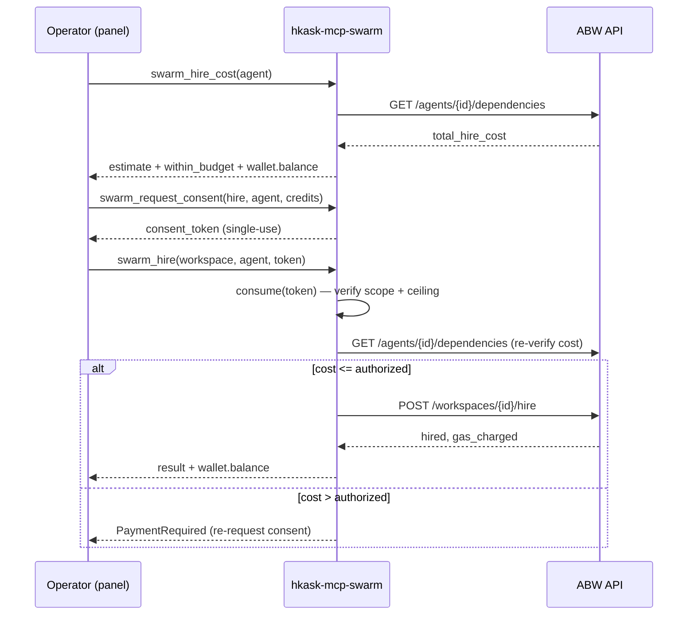

# Swarm MCP Server Reference

**Crate:** `mcp-servers/hkask-mcp-swarm`
**Tools:** 31 — 20 ABW + 11 local, **both sets always exposed in either mode**
**Modes:** `kask.swarm.mode` selects the substrate — `abw` (default, ABW REST) or `local` (zed-kask's local substrate)
**ABW auth:** ABW Pro-tier API key (`Authorization: Bearer`), injected as `HKASK_ABW_API_KEY`
**Local auth:** none — the hkask-ledger balance check is the gate (no consent token)

The swarm server exposes two parallel substrates for agent catalogue, team
composition, agent authoring, and governed spend:

- **ABW** (v1, default) — routes to [Agent Bestiary World (ABW)](https://agent-bestiary.world),
  a hosted marketplace/ecology of AI agents. Credit spend is consent-gated
  (`swarm_request_consent` mints single-use tokens; `swarm_hire`/`swarm_delegate`
  consume and re-verify them).
- **Local** (v2 §15) — routes to zed-kask's local substrate: `hkask-inference`
  (Ollama/cloud via the zed IPC bridge), `hkask-ledger` (operator-funded SQLite
  credits), `hkask-guard` (I/O scanning). No ABW calls, no consent token — the
  ledger balance check is the gate.

Both substrates are governed by the kask MCP runtime (capability-match gating,
gas/rjoule budgeting, `hkask.mcp.swarm` telemetry targets). The server is the
substrate for the **Agent Swarm panel** (`crates/swarm_panel`), the
**`swarm-intelligence` skill**, and the **`swarm-steering` skill**.

## The three surfaces

The server's tools map onto the three things an operator does with a swarm
substrate. ABW and local tools both fit the same three surfaces.

| Surface | What | ABW tools | Local tools |
|---|---|---|---|
| **Authoring** | Create new agents | `swarm_generate_prompt`, `swarm_generate_ontology`, `swarm_create_agent`, `swarm_ontology_templates` | `swarm_create_local_agent`, `swarm_reconfigure_local_agent`, `swarm_clone_to_local` |
| **Composition** | Group agents into teams | `swarm_create_swarm`, `swarm_create_app`, `swarm_xaman` | `swarm_list_local_agents`, `swarm_create_swarm` (shared), `swarm_fanout_local` |
| **Operation** | Browse, run, spend, manage | `swarm_list_agents`, `swarm_get_agent`, `swarm_list_apps`, `swarm_get_swarm`, `swarm_execute_agent`, `swarm_hire`, `swarm_delegate`, `swarm_run_status`, `swarm_hire_cost`, `swarm_request_consent`, `swarm_fire`, `swarm_delete_agent`, `swarm_delete_swarm` | `swarm_delegate_local`, `swarm_fund_local`, `swarm_balance_local`, `swarm_local_history`, `swarm_push_to_cloud`, `swarm_remove_local` |

## Tool reference — ABW (20 tools)

### Discovery (read-only)

| Tool | ABW endpoint | Purpose |
|---|---|---|
| `swarm_list_agents` | `GET /api/agents` | Browse the catalogue (filter by type/tag). Descriptions sanitized. Keyless-capable but auth-gated for consistency (KA-02). |
| `swarm_get_agent` | `GET /api/agents` | Full card for one agent (capabilities, dependencies, stats). |
| `swarm_list_apps` | `GET /api/apps` | Published Apps (reusable team manifests) — the sharing surface. |
| `swarm_get_swarm` | `GET /api/workspaces[/{id}]` | List workspaces or get one roster. |
| `swarm_run_status` | `GET /api/workspaces/{id}/messages` | Recent run activity. Each message sanitized. |
| `swarm_ontology_templates` | `GET /api/ontology-templates` | Seed-ontology starting points for authoring. |

### Authoring (agent creation)

| Tool | ABW endpoint | Purpose |
|---|---|---|
| `swarm_generate_prompt` | `POST /api/agents/generate-prompt` | Draft a system prompt from a description. Output sanitized. |
| `swarm_generate_ontology` | `POST /api/agents/generate-ontology` | Draft a seed ontology (Mermaid ER) for a domain. |
| `swarm_create_agent` | `POST /api/agents` | Create the agent. Builds the full card (model, temperature, tags, sample queries); supports `dependencies` for compound agents. |

### Composition (team building)

| Tool | ABW endpoint | Purpose |
|---|---|---|
| `swarm_xaman` | `POST /api/xaman/sessions[/{id}/message]` | Consult Xaman Ek (typed sessions: `composition_design`, `workspace_help`, `free`). **Consent-gated** when `curator_consent_default: false`. Output sanitized. |
| `swarm_create_app` | `POST /api/xaman/sessions/{id}/create-app` | Materialize a composition session into an App. |
| `swarm_create_swarm` | `POST /api/teams` + `/workspaces/{id}/hire` | Create a workspace and optionally hire agents (each hire consent-gated). |

### Governed spend (consent-gated)

| Tool | ABW endpoint | Purpose |
|---|---|---|
| `swarm_hire_cost` | `GET /api/agents/{id}/dependencies` | Pre-flight cost estimate. Fails closed on missing field (no fabricated zero). |
| `swarm_request_consent` | — (local) | Mint a single-use, action+target-scoped consent token after the operator confirms. `require_auth`. |
| `swarm_hire` | `POST /api/workspaces/{id}/hire` | Hire an agent. Consumes the token, **re-verifies cost against ABW** before spending. |
| `swarm_delegate` | `POST /api/workspaces/{id}/messages` | Delegate a task via @mention. Consumes the token. |
| `swarm_execute_agent` | `POST /api/agents/{name}/execute` | Text-only agent consultation (token fees). Output sanitized. |

### Lifecycle (teardown)

| Tool | ABW endpoint | Purpose |
|---|---|---|
| `swarm_fire` | `POST /api/workspaces/{id}/fire` | Remove an agent from a workspace roster. |
| `swarm_delete_agent` | `DELETE /api/agents/{id}` | Delete an authored agent from the catalogue. |
| `swarm_delete_swarm` | `DELETE /api/workspaces/{id}` | Delete a workspace and its roster. |

## Tool reference — Local (11 tools)

Local-mode tools route to zed-kask's local substrate (`hkask-inference`,
`hkask-ledger`, `hkask-guard`). They are **always exposed regardless of
`kask.swarm.mode`** — an operator in `abw` mode can still fund the local
ledger, browse local agents, or push a local agent to the cloud. The mode
only changes which substrate the *composition* cascade uses by default.

### Funding and balance (ledger)

| Tool | Purpose |
|---|---|
| `swarm_fund_local` | Add operator-funded credits to the local ledger (SQLite). Credits are the spend ceiling for `swarm_delegate_local`. |
| `swarm_balance_local` | Read the current ledger balance. Fails closed on a stale signal (no fabricated zero — the `.rules` `unwrap_or(0)` trap). |
| `swarm_local_history` | Read the ledger's debit/credit history (audit trail for the algedonic channel). |

### Delegation (the local execution path)

| Tool | Purpose |
|---|---|
| `swarm_delegate_local` | Run a local agent against a task. The execution path: **scan input** → **tool loop** (declared `mcp_tools` dispatched through the governed `McpRuntime`, each invocation OCAP-gated + gas-budgeted) → **guard scan output** → **ledger debit**. Returns a `LocalDelegateResult` (see shape below). |
| `swarm_fanout_local` | Delegate the same task to N local agents in parallel and collect `LocalDelegateResult[]` — the substrate-level primitive the `swarm-intelligence` CHECK step reads. |

### Local agent registry

Local agent cards live at `agents/local/curated/<id>/agent_card.json`
(`HKASK_LOCAL_AGENTS_DIR` overrides the directory; empty default resolves to
`agents/local/curated`). The registry is read by `swarm_list_local_agents` and
`swarm_delegate_local`.

| Tool | Purpose |
|---|---|
| `swarm_list_local_agents` | List local agent cards from the registry. |
| `swarm_create_local_agent` | Write a new local agent card to the registry. |
| `swarm_reconfigure_local_agent` | Update an existing local agent card (used by the C6 reconfigure step in the cybernetic swarm plan). |
| `swarm_clone_to_local` | Clone an ABW agent card into the local registry (the cloud→local bridge). |
| `swarm_remove_local` | Delete a local agent card. |

### Cloud bridge

| Tool | Purpose |
|---|---|
| `swarm_push_to_cloud` | Push a local agent card to ABW (the local→cloud bridge). Requires the ABW API key. |

### `LocalDelegateResult` shape

Every `swarm_delegate_local` and `swarm_fanout_local` entry returns this shape.
It is the contract the `swarm-intelligence` ORIENT/CHECK steps and the
`swarm-steering` skill consume. Absent fields are `None`/empty arrays, never
fabricated.

```json
{
  "agent_id": "string",
  "response": "string (guard-scanned)",
  "model": "string (e.g. ollama/qwen3:32b)",
  "tokens_used": 1234,
  "cost": 0.0012,
  "balance": 49.9988,
  "latency_ms": 4200,
  "tool_calls": [
    { "tool": "string", "ok": true, "error": null }
  ],
  "executed_skills": [
    { "skill": "string", "ok": true, "error": null }
  ]
}
```

- `latency_ms` is the C4 latency signal `T_q`.
- `tool_calls[].ok` and `executed_skills[].ok` are the C5 fault-attribution
  inputs — `false` increments `fault_count` for the blamed agent.
- `balance` is the post-debit ledger balance (the local algedonic channel).

## The consent gate (the ABW load-bearing invariant)

Every ABW credit spend flows through a single-use, action-scoped, target-scoped
consent token. This is the enforcement point for the ABW cost/consent invariant —
an ABW spend **refuses** without a valid in-scope token, not just warns.
**Local mode does not use consent tokens** — the ledger balance check is the
gate (a delegation refuses if `balance < cost`, with no token to mint).



<!-- DIAGRAM_ALIGNMENT
id: DIAG-RF-SWARM-001
verified_date: 2026-08-04
verified_against: kask/mcp-servers/hkask-mcp-swarm/src/hkask_mcp_swarm.rs; kask/mcp-servers/hkask-mcp-swarm/src/tools/swarm_hire.rs
status: VERIFIED
-->

**Properties (all pinned by tests):**
- **Single-use** — a consumed token cannot be replayed.
- **Scope-bound** — a token for hiring agent A cannot hire agent B, or delegate.
- **Ceiling-enforced** — the spend re-fetches the real cost and refuses if it exceeds the authorized ceiling (the gate validates the *spend*, not just the *token*).
- **Auth-gated mint** — `swarm_request_consent` requires the API key, so a prompt-injected agent cannot self-authorize a spend.

## Error model

`SwarmError` maps ABW HTTP errors **and body-embedded domain errors** — ABW
wraps upstream LLM failures into HTTP 200 envelopes (e.g. Anthropic credit
exhaustion passed through verbatim in a Xaman Ek response), so status-code-only
mapping is insufficient. Local-mode errors map to the same variants where the
semantics match (e.g. `PaymentRequired` for an insufficient ledger balance).

| Variant | Trigger | Surface |
|---|---|---|
| `Auth` | 401/403, or no ABW key configured | `permission_denied` |
| `PaymentRequired` | 402, or actual cost > authorized (ABW); ledger `balance < cost` (local) | `permission_denied` (algedonic) |
| `AgentNotFunded` | 500 "not funded" — the agent's *owner* hasn't configured an LLM key | `unavailable` |
| `UpstreamModelError` | HTTP 200 with embedded provider error | `unavailable` |
| `RateLimited` | 429 | `rate_limited` |
| `CuratorUnavailable` | Xaman Ek session create fails | `unavailable` |
| `ConsentDenied` | missing/invalid/replayed/out-of-scope consent token (ABW only) | `permission_denied` |
| `GuardBlocked` | hkask-guard I/O scan rejected input or output (local only) | `permission_denied` |
| `ApiVersionMismatch` | serde parse failure (possible API drift, S4) | `internal` |
| `Unavailable` | network/transport; local substrate offline | `unavailable` |

## The algedonic channel

Every authenticated ABW tool response carries `wallet.balance` — the operator's
live ABW credit balance. Every local delegation response carries `balance` —
the post-debit local ledger balance. Both close the S1→S5 feedback loop: a
spend is never out of sight. A failed balance query emits `tracing::warn!` and
returns `None` (never a fabricated zero — the `.rules` `unwrap_or(0)` trap).

## The swarm-intelligence skill ecosystem

The swarm server is the substrate for two convergent skills that compose and
steer swarms. The skills live in `.agents/skills/swarm-intelligence/` and
`.agents/skills/swarm-steering/`; this section documents how they consume the
server's tool surface.

### The 10-step PDCA cascade (`swarm-intelligence`)

The `swarm-intelligence` skill is a 10-step PDCA cascade that senses swarm
state, orients via Ashby's requisite variety and PSO cognitive/social balance,
decides composition adjustments isomorphic to PSO velocity tuning / ACO
pheromone deposition / Reynolds separation-alignment-cohesion, acts via gated
`swarm_delegate` / `swarm_delegate_local` calls, checks spend against the
algedonic channel, and converges via a Cauchy criterion on the swarm-state
distance metric. It is **mode-aware** (v2 §15): it branches on `abw`/`local`
at SENSE, ACT, and CHECK.

| Step | Name | What it does |
|---|---|---|
| 1 | SENSE | Fetch swarm state. ABW: `swarm_get_swarm` + `swarm_run_status`. Local: `swarm_list_local_agents` + `swarm_local_history`. |
| 2 | ORIENT | Attribute fault from `delegate_results[].tool_calls[].ok` / `executed_skills[].ok`; update `fault_count` (deterministic). |
| 3 | DECIDE | Propose composition adjustments (PSO velocity / ACO pheromone / Reynolds moves). |
| 4 | FILTER | Drop proposed moves that violate the budget gate or the `mcp_tools` allowlist (`swarm.filter_proposed_moves` compute primitive — deterministic). |
| 5 | ACT | Execute the plan. ABW: `swarm_delegate`. Local: `swarm_delegate_local` / `swarm_fanout_local`. |
| 6 | CHECK | Read `delegate_results`, measure swarm-state distance, debit algedonic. |
| 7 | CONVERGE_CHECK | Cauchy criterion on the swarm-state distance metric. |
| 8 | CONVERGE_ACCUMULATE | Append to `iteration_log` (`swarm.converge_accumulate` compute primitive — deterministic). |
| 9 | SECOND_ORDER_MONITOR | C1 monitor over the iteration log (`swarm.second_order_monitor` compute primitive — deterministic). |
| 10 | LOOP | Re-invoke or terminate. |

### Cybernetic Swarm Plan components (C0–C8)

The deterministic accumulators that drive convergence live in **compute
primitives** (`swarm.converge_accumulate`, `swarm.second_order_monitor`,
`swarm.filter_proposed_moves`) — **not** in LLM templates. An LLM that
hallucinates a fault count is overruled by the deterministic counter.

| Component | Name | Where it lives |
|---|---|---|
| C0 | Deterministic task-success | compute primitive (the cascade's ground truth) |
| C1 | Second-order monitor | `swarm.second_order_monitor` compute primitive |
| C2 | Go See cadence | the SENSE step (operator-visible) |
| C3 | Failed-edit memory | `failed_edits` accumulator (deterministic) |
| C4 | Latency `T_q` | `LocalDelegateResult.latency_ms` |
| C5 | Fault attribution + `fault_count` | ORIENT step, fed by `delegate_results[].tool_calls[].ok` / `executed_skills[].ok` (deterministic) |
| C6 | `reconfigure_agent` | ACT step, calls `swarm_reconfigure_local_agent` on the most-blamed agent |
| C7 | Influence-weighted rejection | `influence_scores` accumulator (deterministic) |
| C8 | Task-gated alignment | SENSE step `alignment` definition (OFA-MAS TAGSE port) |

**Absent `delegate_results`, C5/C6 are inert** — the planning cascade emits
intents, not executed results. This is why the steering modes (below) matter:
advisory mode produces a plan with no results, so the first pass through the
cascade cannot attribute fault; the operator must feed `delegate_results`
back and re-invoke to close the loop.

### Steering modes (the execution boundary)

The `swarm-intelligence` skill's `steering_mode` setting controls who executes
the plan and feeds `delegate_results` back. This is the seam between planning
and execution.

| Mode | Who executes | Who feeds `delegate_results` back | When to use |
|---|---|---|---|
| **advisory** (default) | The operator (manually) | The operator (manually) | Human-in-the-loop; the plan IS the output. |
| **steering** | The Kask Curator (local) or Xaman Ek (cloud, steering built-in) | The Curator / Xaman Ek autonomously | Autonomous closed-loop composition. |

In **advisory** mode, the cascade emits `emitted_calls` (a list of
`swarm_delegate_local` invocations) and stops. The operator — or the
`swarm-steering` skill — executes them and feeds the resulting
`LocalDelegateResult[]` back as `delegate_results` on the next invocation. In
**steering** mode, the Curator or Xaman Ek executes the plan in-process and
feeds the results back autonomously, closing C5/C6 within a single cascade run.

### The `delegate_results` contract

The `delegate_results` input to ORIENT/CHECK is an array of
`LocalDelegateResult`-shaped objects (the same shape `swarm_delegate_local`
returns). The contract:

```json
[
  {
    "agent_id": "string",
    "response": "string",
    "model": "string",
    "tokens_used": 1234,
    "cost": 0.0012,
    "balance": 49.9988,
    "latency_ms": 4200,
    "tool_calls": [
      { "tool": "string", "ok": true, "error": null }
    ],
    "executed_skills": [
      { "skill": "string", "ok": true, "error": null }
    ]
  }
]
```

- ORIENT reads `tool_calls[].ok` and `executed_skills[].ok`; any `false`
  increments `fault_count` for `agent_id` (deterministic).
- C6 `reconfigure_agent` targets the agent with the highest `fault_count`.
- CHECK reads `cost` / `balance` for the algedonic debit and `latency_ms` for C4.
- If `delegate_results` is absent or empty, C5/C6 are inert (the cascade emits
  intents, not executed results).

### The `swarm-steering` skill

`swarm-steering` is a focused, single-pass skill that codifies the
execute-and-feed-back loop for local swarms. It is the mechanical counterpart
to `swarm-intelligence`'s advisory mode: given a swarm-intelligence plan
(`emitted_calls`), it produces the `swarm_delegate_local` execution sequence,
the `delegate_results` collection shape (a `LocalDelegateResult[]`), and the
re-invoke instruction. The Kask Curator or a human in the loop executes the
directive and feeds `delegate_results` back to `swarm-intelligence`, closing
the C5/C6 feedback loop.

Anchored to PKO (procedure execution) and the Conant-Ashby Good Regulator (the
actuator must model the swarm it steers). Pairs with `swarm-intelligence` (the
planner). Emits `reg.skill.swarm-steering.*` spans. Any userpod may invoke it.

## Dual launch paths (by design — do not unify)

The swarm server — like all kask MCP servers — has two parallel launch paths
that serve different consumers. **Both launching independent instances is
correct; removing either breaks its consumers.**

| Path | Scope | Serves | Governs |
|---|---|---|---|
| **`McpRuntime`** (app-global) | One copy of each server, app-global | The skill cascade (FlowDef) + the kask panel | OCAP token verification, gas/rjoule budgeting, `reg.tool.*` spans |
| **`ContextServerStore`** (per-project) | Each project launches its own copies via `ContextServerDescriptorRegistry` descriptors | The agent tool picker | Project-scoped, no governance membrane |

The `ContextServerDescriptorRegistry` is app-level (global), but the
`ContextServerStore` that actually spawns processes is per-project. The
`KaskMcpDescriptor::command()` method resolves env vars (credentials,
inference socket) at call time. After `INFERENCE_SOCKET_PATH` is set (in a
deferred task post-login), `sync_kask_mcp_servers` must be called again so the
registry notifies `ContextServerStore` to restart servers with the updated env.

## Configuration

`KaskSwarmSettings` follows the `Default`-as-source-of-truth pattern (no serde
attributes, `From` reads from `Default`, `mcp_env` compares against `Default`).
The ABW API key is a keychain credential (`kask://credentials/hkask_abw_api_key`),
injected by `mcp_env_with_credentials` — it never appears in the config env map.

| Setting | Env var | Default | Notes |
|---|---|---|---|
| `kask.swarm.mode` | `HKASK_SWARM_MODE` | `abw` | `abw` or `local` (v2 §15) |
| `kask.swarm.api_url` | `HKASK_ABW_API_URL` | `https://agent-bestiary.world` | ABW base URL override |
| `kask.swarm.max_credits_per_dispatch` | `HKASK_ABW_MAX_CREDITS` | `50` | Per-dispatch ceiling (both modes) |
| `kask.swarm.curator_consent_default` | `HKASK_ABW_CURATOR_CONSENT_DEFAULT` | `false` | When `false`, `swarm_xaman` needs a consent token (S5 policy) |
| — | `HKASK_ABW_DEFAULT_AGENT_MODEL` | `claude-haiku-4-5-20251001` | Default model for new ABW agents (KA-05) |
| — | `HKASK_LOCAL_AGENTS_DIR` | (empty = `agents/local/curated`) | Local agent cards directory |
| — | `HKASK_SWARM_LEDGER_PATH` | (data dir) | Local ledger SQLite path |
| — | `HKASK_ABW_API_KEY` | — | ABW Pro API key (keychain credential, **never** in `mcp_env`) |

## Security posture

The server's defense-in-depth coverage (from the kali audit):

- **Input filtering** — `require_auth` on all handlers, `url_encode_segment` on all path params, empty-string validation on spend paths.
- **Data/instruction separation** — `sanitize_abw_response` wraps all LLM/ABW output in a `{content, source: "abw", trust: "untrusted"}` container and strips injection prefixes.
- **Capability gating** — single-use consent tokens (ABW), scoped, ceiling-enforced, auth-gated mint; ledger balance gate (local).
- **Runtime monitoring** — `with_wallet` algedonic channel, `tracing::warn!` on stale signals, `detect_embedded_error`.
- **Credential scoping** — `credentials: Some(&["HKASK_ABW_API_KEY"])` (never `None`); the server receives only the ABW key, not other kask secrets.

**Local mode adds:**

- **hkask-guard I/O scanning** — `scan_input` / `scan_output` runs on every `swarm_delegate_local` invocation (input before the tool loop, output before the response is returned).
- **Ledger balance gate** — no consent token; a delegation refuses if `balance < cost`. The balance is the single gate, and a failed balance read is a stale signal, not a fabricated zero.
- **`mcp_tools` allowlist** — a local agent's declared `mcp_tools` are the only tools dispatched through the governed `McpRuntime` during the tool loop. Undeclared tools are not reachable, even if the agent requests them.

Out-of-scope layers (5: taint labels, 8: deception detection) are deferred by
design with documented re-entry conditions — see the plan's §14.

## Cross-links

- [Integration plan](../../plans/abw-swarm-intelligence.md) — ABW swarm semantics, API surface, build sequence
- [Cybernetic Swarm Plan](../../plans/cybernetic-swarm-plan.md) — components C0–C8, the 10-step cascade, steering modes
- [Cybernetic Swarm Plan](../../plans/cybernetic-swarm-plan.md) — the swarm-intelligence skill design, C0–C8 components, steering modes, implementation record (Appendix C)
- [Architecture diagram](../../diagrams/flowchart-swarm-architecture.md) — the swarm server topology
- [PDCA cascade flowchart](../../diagrams/flowchart-swarm-pdca-cascade.md) — the 10-step loop
- [Steering loop sequence](../../diagrams/sequence-swarm-steering-loop.md) — advisory vs steering execution
- [Kali security audit](../../audits/abw-swarm-kali-audit.md) — 7-layer defense map
- [MCP Server Registry](README.md) — fleet-wide patterns and the 11-server catalog