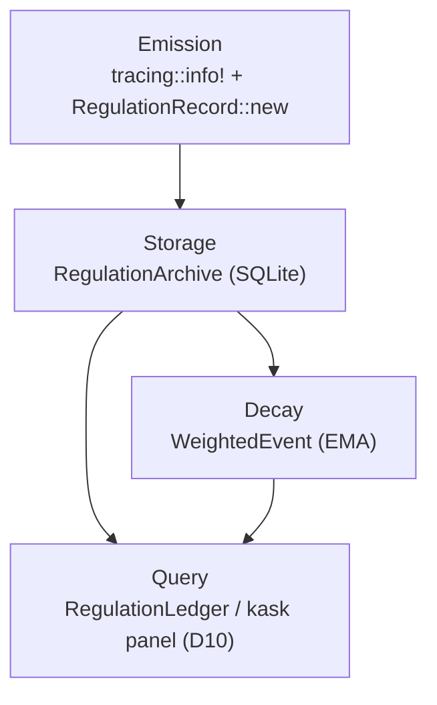

## 1. Purpose

Regulation spans are the observability substrate of hKask's Cybernetic Nervous System (Loop 6). Every operation that affects system state — tool invocations, inference calls, gas consumption, contract lifecycle events — emits a **span** through the Regulation tracing infrastructure.

> **Hosting note (v0.32.0):** hKask runs in-process inside zed-kask. The standalone `kask` CLI and
> `hkask-api` HTTP server have been **deleted**. Span query/subscribe commands previously exposed
> via `kask regulation ...` are now available through the in-process kask panel (D10) and
> programmatic `RegulationLedger` calls. Skill spans (§3.9) are now emitted by `hkask-templates`
> (which owns `ManifestExecutor` and skill execution via D1), replacing the deleted
> `hkask-services-skill`.

A **span** is a typed identifier that pins an observation to a canonical dot-separated namespace (e.g., `reg.tool.web_search`). Spans carry an **operation** verb (e.g., `invoked`, `completed`, `reserved`) and optional structured fields. They flow through two paths:

1. **tracing infrastructure** — `tracing::info!(target: "reg", reg_domain = …, operation = …)` — for structured logging
2. **ν-event persistence** — `RegulationRecord::new()` → `RegulationSink::persist()` — for the cybernetic audit trail

### Span vs. RegulationRecord

| Concept | Role | Contains |
|---|---|---|
| **ObservableSpan** (trait) | Typed span enums implement this; provides `as_str()`, `emit()`, `to_event()`, and `emit_to()` | Canonical namespace string |
| **Span** (struct) | Pair of `SpanNamespace` + path (e.g., `reg.tool` + `invoked` → `reg.tool.invoked`) | Namespace + full path |
| **SpanNamespace** (newtype) | Validated string wrapper; construction validates against `CANONICAL_NAMESPACES` | Dot-separated namespace string |
| **RegulationRecord** (struct) | Full cybernetic observation: who observed, what span, what phase, what was observed | Span, `WebID`, `CyclePhase`, `observation` (JSON), `regulation`, `outcome`, recursion depth |
| **SpanKind** (enum) | Typed constructors for common span paths (eliminates string typos) | Canonical (namespace, path) pairs |

Spans describe *what* happened; RegulationRecords describe *who observed it, when, in what context, and what they saw*.

### Span validation

All namespace strings are registered in `CANONICAL_NAMESPACES` (`crates/hkask-types/src/event.rs`) — a 243-entry array that is the single source of truth. `SpanNamespace::new()` returns `None` on unknown namespaces; `SpanNamespace::parse()` returns `None`. Domain span enums construct namespaces via `SpanNamespace::from_observable()` which also validates. Hierarchical validation: a sub-namespace like `reg.pipeline.decimation.binarize` is valid if any prefix segment is registered.

---

## 2. Span Namespace Taxonomy

Namespaces form a tree rooted at `regulation`. The namespace prefix maps to a `SpanCategory` for typed dispatch (`SpanCategory::from_short_name()`):

| Category | Prefixes | Examples |
|---|---|---|
| **Cybernetics** | `reg.variety*`, `reg.gas*`, `reg.outcome*`, `reg.alert*` | `reg.variety`, `reg.gas.reserved`, `reg.outcome.impact_verified` |
| **Curation** | `reg.curation*`, `reg.spec*` | `reg.curation.directive_acknowledged` |
| **Inference** | `reg.inference*` | `reg.inference` |
| **Episodic** | `reg.pod*`, `reg.connector*` | `reg.pod.registered` |
| **Wallet** | `reg.wallet*` | `reg.wallet.balance`, `reg.wallet.key_issued` |
| **Skill** | `reg.skill*` | `reg.skill.convergence.converged` |
| **Unknown** | Everything else | `reg.tool.web_search`, `reg.consent`, `reg.api.request` |

---

## 3. Domain-Specific Span Enums

### 3.1 RegulationSpan — Core Regulation Spans

**File:** `crates/hkask-types/src/regulation.rs`

Core spans used across 2+ crates. This is the foundational enum implementing `ObservableSpan`.

| Variant | Namespace | Meaning | Emitted When |
|---|---|---|---|
| `Tool { subsystem }` | `reg.tool.{subsystem}` | MCP tool invocation | Any MCP server dispatches a tool call. Subsystem identifies which server |
| `Inference` | `reg.inference` | LLM inference request/response | GovernedInference prepares/executes/checks an inference call |
| `AgentPod` | `reg.pod` | Agent pod lifecycle events | Pod registration, activation, deactivation |
| `Gas` | `reg.gas` | Gas (energy/budget) consumption | Gas reserved, settled, or depleted for any operation |
| `Curation` | `reg.curation` | Curation loop operations | Registry sync, pod sync, directive issuance |
| `SelfHeal` | `reg.heal` | Self-healing operation | The Regulation runtime's heal callback fires |
| `MemoryEncode` | `reg.memory.encode` | Memory encoding operation | Episodic or semantic memory encodes an observation |

**ToolSubsystem variants** for `RegulationSpan::Tool` (defined in `regulation.rs`):

`WebSearch`, `Condenser`, `Training`, `Corpus`, `Research`, `Communication`, `Registry`, `Wallet`, `Media`, `Kanban`, `Memory`, `Companies`, `Filesystem`, `Curator`, `Other` (catch-all).

> **Note on retained variants:** `Communication`, `Filesystem`, and `Memory` remain in the
> `ToolSubsystem` enum for span-name stability even though their corresponding MCP servers
> (`hkask-mcp-communication`, `hkask-mcp-filesystem`, `hkask-mcp-memory`) were deleted. The
> `ToolSubsystem::from_server_name()` mapper still recognizes `"communication"` for backward
> compatibility. The deleted servers no longer emit spans, but the namespace strings remain
> canonical so historical records remain queryable. There is no `Replica` or `Docproc` subsystem —
> the `corpus` server (which folded in `docproc`/`replica` functionality) emits under
> `reg.tool.corpus`.

### 3.2 AcpSpan — Agent Client Protocol (DELETED)

> **DELETED (2026-07-25 cleanup):** The `acp_span` module was deleted. The `AcpSpan` variants
> (`reg.acp.userpod.memory_size`, `reg.acp.ide.connection_state`) are no longer emitted via a
> typed enum, but the namespace strings `reg.acp.ide.connection_state` and
> `reg.acp.agent.memory_size` remain in `CANONICAL_NAMESPACES` for tracing-target stability.

### 3.3 ClassifySpan — Classification Operations (DELETED as typed enum)

> **DELETED as typed enum (2026-07-25 cleanup):** The `classify_span` module was deleted. The
> `ClassifySpan` variants (`reg.classify.dual_fidelity`, `reg.classify.drift`) are no longer
> emitted via a typed enum, but the namespace strings remain in `CANONICAL_NAMESPACES`.

### 3.4 ContractSpan — Spec Contract Lifecycle (DELETED as typed enum)

> **DELETED as typed enum (2026-07-25 cleanup):** The `contract_span` and `contract_events`
> modules were deleted. The `ContractSpan` variants (`reg.contract.proposed`,
> `reg.contract.accepted`, `reg.contract.rejected`, `reg.contract.violated`,
> `reg.contract.coverage`, `reg.contract.quality.violated`) are no longer emitted via a typed
> enum, but the namespace strings remain in `CANONICAL_NAMESPACES`.

### 3.5 InfraSpan — Infrastructure Spans

**File:** `crates/hkask-regulation/src/infra_span.rs`

Cross-subsystem spans used by curator, governance, and wallet components.

| Variant | Namespace | Meaning | Emitted When |
|---|---|---|---|
| `CiInvariantViolation` | `reg.ci.invariant.violation` | CI invariant check failed | CI pipeline detects a structural invariant break |
| `GuardViolation` | `reg.guard.violation` | Guard rule triggered | A prohibition or constraint guard fires |
| `CuratorConsolidation` | `reg.curator.consolidation` | Curator consolidation run | Curator consolidates pod state from Regulation telemetry |
| `Chat` | `reg.chat` | Chat/agent-panel event | Retained in the enum for compile-stability; the `reg.chat` namespace is also used by `reg.chat.condense` (condenser events). The deleted `hkask-services-chat` crate was the original emitter; chat/agent-panel events in zed-kask flow through zed's own telemetry and the in-process `MemoryPort` (D6) ingestion path |
| `WalletConversion` | `reg.wallet.conversion` | Currency conversion | rJ ↔ USDC conversion executed |

### 3.6 QaSpan — QA Repair Lifecycle

**File:** `crates/hkask-regulation/src/qa_span.rs`

Emitted by the QA test harness (`qa_script::run_script()`) and qa-script-builder.

| Variant | Namespace | Meaning | Emitted When |
|---|---|---|---|
| `QaRepairAttempted` | `reg.qa.repair_attempted` | Repair step attempted | QA script executes a repair action after a failure |
| `QaRepairVerified` | `reg.qa.repair_verified` | Repair outcome verified | Post-repair verification confirms fix or detects residual failure |
| `QaRepairExhausted` | `reg.qa.repair_exhausted` | Repair attempts exhausted | All repair strategies tried; none succeeded |

Additional QA namespaces in `CANONICAL_NAMESPACES` (emitted as tracing events, not via `QaSpan`):
`reg.qa.run`, `reg.qa.run.pass`,
`reg.qa.run.fail`, `reg.qa.run.skipped`.

### 3.7 SeamSpan — Architecture Seams (DELETED as typed enum)

> **DELETED as typed enum (2026-07-25 cleanup):** The `seam_span` and `seam_watcher` modules were
> deleted. The `SeamSpan` variants (`reg.architecture.seam.coverage`,
> `reg.architecture.seam.drift`) are no longer emitted via a typed enum, but the namespace strings
> remain in `CANONICAL_NAMESPACES`.

### 3.8 SloSpan — SLO Evaluation (DELETED as typed enum)

> **DELETED as typed enum (2026-07-25 cleanup):** The `slo_span` and `slo_manager` modules were
> deleted. The `SloSpan` variant (`reg.slo.evaluated`) is no longer emitted via a typed enum, but
> the namespace string remains in `CANONICAL_NAMESPACES`.

### 3.9 Skill Spans

**File:** `crates/hkask-types/src/event.rs` (CANONICAL_NAMESPACES) · emitted by `crates/hkask-templates/src/manifest_executor.rs` (skill execution via D1)

Skill lifecycle, registry, cascade, convergence, budget, routing, and discovery spans. All namespaced under `reg.skill.*`. Unlike other span types (which have dedicated Rust enums), skill spans are canonical namespace strings emitted as tracing events by the skill execution layer. The hierarchical `is_canonical()` function makes `reg.skill.<any-id>.*` valid without per-skill registration.

> **Ownership note (v0.32.0):** Skill execution moved from the deleted `hkask-services-skill`
> crate to `hkask-templates` (`ManifestExecutor` + registry + cascade + PDCA), invoked in-process
> via the D1 seam (`agent/tools/skill_tool.rs` → bridge.ManifestExecutor). The span emission
> points are unchanged; only the emitting crate moved.

| Namespace group | Sub-namespaces | Emitted When |
|---|---|---|
| `reg.skill.lifecycle` | `.skill_activated`, `.skills_loaded`, `.skills_discovered`, `.skill_published` | Skill lifecycle events (activation, loading, publishing) |
| `reg.skill.registry` | `.registry_validated` | Registry manifest validated successfully |
| `reg.skill.cascade` | `.step_executed`, `.compute` | Cascade step execution |
| `reg.skill.convergence` | `.converged`, `.escalated` | Cascade convergence outcomes (metric ≤ threshold, or max iterations exhausted) |
| `reg.skill.budget` | `.gas_exhausted`, `.gas_alert`, `.rjoule_exhausted`, `.rjoule_alert` | Gas and rJoule budget events |
| `reg.skill.frontmatter` | `.missing` | SKILL.md frontmatter parse errors |
| `reg.skill.manifest` | `.unparseable`, `.absent`, `.unreadable` | Registry manifest errors |
| `reg.skill.routing` | `.matched`, `.uncovered` | Skill-to-task routing (skill-router) |
| `reg.skill.discovery` | `.gap_detected`, `.searched`, `.evaluated` | Capability gap detection and candidate evaluation (skill-discovery) |

### 3.10 Wallet Spans

**File:** `crates/hkask-types/src/event.rs` (CANONICAL_NAMESPACES) · emitted as tracing events by `crates/hkask-regulation/src/cybernetics_loop.rs` and `crates/hkask-services-core/src/error/regulation_record.rs`

Wallet spans are canonical namespace strings (not a dedicated `WalletSpan` enum). The `hkask-wallet` crate was deleted in the 2026-07-25 cleanup; `gas_per_rjoule` config lives in `hkask-types::WalletConfig`. Wallet types live in `hkask-types`. The `InfraSpan::WalletConversion` variant covers the `reg.wallet.conversion` namespace; the remaining wallet spans are emitted as raw tracing events.

| Namespace | Emitted When |
|---|---|
| `reg.wallet.balance` | Wallet balance query |
| `reg.wallet.calibration` | Wallet calibration event |
| `reg.wallet.chain` | Wallet chain operation |
| `reg.wallet.chain_error` | Wallet chain error |
| `reg.wallet.conversion` | rJ ↔ USDC conversion (also `InfraSpan::WalletConversion`) |
| `reg.wallet.created` | Wallet created |
| `reg.wallet.deposit` | Deposit credited |
| `reg.wallet.deposit_shielded` | Shielded deposit |
| `reg.wallet.draw` | Gas draw from wallet |
| `reg.wallet.exhausted` | Wallet exhausted |
| `reg.wallet.key_exhausted` | Key exhausted |
| `reg.wallet.key_expired` | Key expired |
| `reg.wallet.key_issued` | Key issued |
| `reg.wallet.key_revoked` | Key revoked |
| `reg.wallet.spend` | Wallet spend |
| `reg.wallet.withdrawal` | Wallet withdrawal |

### 3.11 ApiRequestSpan — API Metering (DELETED)

> **DELETED (v0.31.0):** The `hkask-api` HTTP server and its API key auth middleware have been
> removed. hKask now runs in-process inside zed-kask; there is no HTTP API surface to meter.
> `ApiRequestSpan` is retained below as a historical reference only. The span enum and the
> `ApiMeter` learning loop are **no longer emitted**. The `reg.api.request` namespace string
> remains in `CANONICAL_NAMESPACES` for tracing-target stability. Gas consumption for in-process
> callers is settled by `McpRuntime::invoke` / `ToolGovernance` (tool) and `GovernedInference`
> (inference) and tracked via `reg.gas.*` spans (§3.1).

Historically, this was a single-variant span (`reg.api.request`) emitted for every authenticated API request after the rate limit check passed.

### 3.12 Additional Canonical Namespaces

The following namespace groups are registered in `CANONICAL_NAMESPACES` and emitted as tracing events (not via dedicated enums):

| Group | Namespaces | Emitted When |
|---|---|---|
| **Adapter** | `reg.adapter` | Adapter lifecycle |
| **Alert** | `reg.alert` | Algedonic alert emission |
| **Authorization** | `reg.authorization` | Authorization decisions |
| **Backup** | `reg.backup`, `reg.backup.variety` | Backup operations |
| **Chat/Condense** | `reg.chat`, `reg.chat.condense` | Chat and condensation events |
| **Communication** | `reg.communication.agent`, `.agent.deregistered`, `.agent.invited`, `.agent.registered`, `.listener`, `.listener.started`, `.listener.stopped`, `.message`, `.message.ignored`, `.message.observed`, `.thread`, `.thread.created`, `.thread.monitored` | Multi-agent communication (legacy; servers deleted) |
| **Condenser** | `reg.condenser` | Condenser operations |
| **Consent** | `reg.consent` | Consent decisions |
| **Consolidation** | `reg.consolidation` | Memory consolidation |
| **Cybernetics** | `reg.cybernetics`, `.backpressure`, `.substitution` | Cybernetic loop operations |
| **Email** | `reg.email` | Curator email (outbound sent + inbound received) |
| **Deploy** | `reg.deploy.backup_auto_export`, `.backup_export`, `.backup_upload`, `.session_close`, `.session_open` | Deploy/session lifecycle |
| **Goal** | `reg.goal` | Goal operations |
| **Guard** | `reg.guard`, `.canary`, `.input`, `.output`, `.runtime_policy`, `.violation` | Guard operations |
| **Heal** | `reg.heal`, `.attempt`, `.code_change_proposed`, `.dotenv`, `.escalated`, `.file_created`, `.llm_assisted`, `.retry_loop`, `.set_env`, `.strategy`, `.unmatched` | Self-healing operations |
| **Kata/Keystore** | `reg.kata`, `reg.keystore` | Kata and keystore operations |
| **MCP** | `reg.mcp`, `.health`, `.media.face` | MCP server health and media face detection |
| **Media/Memory** | `reg.media`, `reg.memory`, `.budget`, `.decay`, `.encode`, `.episodic` | Media and memory operations |
| **Multi-agent** | `reg.multi.invite.accepted`, `.invite.sent`, `.role.assigned` | Multi-agent coordination |
| **Outcome** | `reg.outcome`, `.calibration`, `.coherence`, `.predictive` | Fermi impact-gate outcomes (v0.31.0) |
| **Platform metrics** | `reg.platform.metric`, `.dora.change_fail_rate`, `.dora.deploy_freq`, `.dora.lead_time`, `.dora.mttr`, `.loyalty`, `.space.activity`, `.space.communication`, `.space.efficiency`, `.space.performance`, `.space.satisfaction` | Platform metrics (DORA, SPACE, Loyalty) |
| **Pipeline** | `reg.pipeline`, `.calibration`, `.decimation`, `.decimation.binarize`, `.ocr`, `.ocr.circuit_breaker`, `.ocr.collusion`, `.ocr.low_confidence`, `.ocr.rate_limit`, `.ocr.silent_failure`, `.ocr.trust_invert`, `.pdf_extract` | Corpus pipeline operations |
| **Semantic** | `reg.semantic.published` | Semantic publication |
| **SLO** | `reg.slo.evaluated` | SLO evaluation (typed enum deleted; namespace retained) |
| **Sovereignty** | `reg.sovereignty`, `.consent_anomaly`, `.consent_audited`, `.governance_report`, `.portability_failure`, `.portability_verified` | Sovereignty operations |
| **Spec** | `reg.spec`, `.executor` | Spec operations |
| **Storage** | `reg.storage`, `.corruption` | Storage operations |
| **Tool subsystems** | `reg.tool.communication`, `.companies`, `.condenser`, `.corpus`, `.curator`, `.filesystem`, `.kanban`, `.media`, `.memory`, `.registry`, `.research`, `.training`, `.wallet`, `.web_search` | Per-subsystem tool spans |
| **Variety** | `reg.variety` | Variety tracking |
| **Well** | `reg.well.created`, `.draw`, `.exhausted`, `.replenished` | Gas well operations |
| **Supply chain** | `reg.supply_chain`, `.select`, `.probe`, `.report`, `.convergence` | Supply-chain-sentinel skill |
| **Runtime posture** | `reg.runtime`, `.select`, `.classify`, `.regulate`, `.convergence` | Runtime-posture-monitor skill |
| **Attack taxonomy** | `reg.taxonomy`, `.select`, `.map`, `.report`, `.convergence` | kali-audit taxonomy_map phase |
| **LoRA training** | `reg.lora`, `.select`, `.audit`, `.report`, `.convergence`, `.runtime` | lora-training skill |
| **Template** | `reg.template` | Template operations |
| **Training providers** | `reg.training.provider`, `.runpod.cancel`, `.runpod.drain`, `.runpod.graphql`, `.runpod.provision`, `.runpod.status`, `.runpod.submit`, `.runpod.teardown`, `.runpod.upload` | RunPod provider HTTP observability |
| **Training checkpoint** | `reg.training.checkpoint.resume` | Pod restart → Axolotl auto-resume |
| **Agent** | `reg.agent.registered` | Agent registration |
| ~~**Meta**~~ (removed) | ~~`reg.meta`, `.circuit_breaker`, `.directive`, `.escalation`, `.self_calibration`~~ | Curator self-observation — `reg.meta.*` spans removed from `CANONICAL_NAMESPACES` |

---

## 4. Span Lifecycle



### 4.1 Emission

Spans are emitted through two mechanisms:

1. **Tracing path** (`ObservableSpan::emit()` / `RegulationSpan::emit()`): writes `tracing::info!(target: "reg", reg_domain = …, operation = …, "REG")`. Used by `RegulationSpan` variants and by domain-span enums that delegate to `ObservableSpan`.

2. **ν-event path**: constructs `RegulationRecord` with a `Span` (namespace + path), `CyclePhase`, observation JSON, and optional regulation/outcome metadata; persists via `RegulationSink::persist()`. Used by wallet Regulation manager, governed inference/tool, cybernetics loop, and consent manager.

### 4.2 Storage

RegulationRecords are persisted to a `RegulationArchive` (SQLite-backed, used directly — no port trait). The store supports:

- **`query_algedonic()`** — filtered queries by span category, time window, and agent. Used to aggregate gas consumption per tool/agent.

### 4.3 Query

The deleted `kask regulation` CLI has been replaced by the in-process kask panel (D10) and programmatic `RegulationLedger` queries:

- **kask panel (D10) → Regulation tab** — displays overall health (variety deficit, critical/warning counts), variety counter summary, active algedonic alerts, and energy budget status.
- **kask panel (D10) → Regulation tab → Alerts** — lists only active algedonic alerts.
- **kask panel (D10) → Regulation tab → Variety** — prints per-namespace variety counters.
- **Live event stream** — in-process subscribers register via `RegulationLedger::subscribe()` filtered to specific span namespaces.
- `RegulationLedger::variety()` — programmatic `HashMap<SpanNamespace, u64>`.
- `RegulationLedger::health()` — `LedgerHealth` struct with aggregate deficit and alert counts.
- `GasReport` — programmatic gas consumption aggregation over time windows.

### 4.4 Decay

Variety tracking uses a **sliding window with exponential moving average (EMA)**:

- **Window:** 60 seconds (`DEFAULT_VARIETY_WINDOW_SECS`)
- **EMA decay factor α:** 0.1 per window reset
- **Formula:** new EMA = 0.9 × old EMA + 0.1 × current raw variety
- **Rationale:** The EMA survives window resets, distinguishing "spiked and died" from sustained low variety

Outcome tracking (success/failure distribution) uses a hard-reset window — no EMA. Counts are cleared on each 60s window expiry.

`DecayConfig` defines per-category exponential decay constants: cybernetics has a 5-minute half-life, curation 15 minutes, inference 2 minutes, episodic 10 minutes. Events below `weight_threshold` (default 0.001) are not replayed.

### 4.5 Algedonic Alerting

When `increment_variety()` is called, the `AlgedonicManager` checks each domain:

| Deficit vs Threshold | Severity | Action |
|---|---|---|
| deficit ≤ threshold/2 | Info | No escalation |
| deficit > threshold/2, ≤ threshold | Warning | `warn!` log |
| deficit > threshold | **Critical** | `error!` log + `DepletionSignal` broadcast to subscribers |

The default threshold is `DEFAULT_VARIETY_MAX_DEFICIT`. Per-domain expected variety can be set via `AlgedonicManager::set_expected_variety()`.

---

## 5. How to Read Spans

### In-process (kask panel D10)

The deleted `kask regulation` CLI has been replaced by the in-process kask panel (D10). The
equivalent panel surfaces are:

```text
# Overall Regulation health with span count summary
#   kask panel (D10) → Regulation tab → Health
#   Equivalent in-process call: RegulationLedger::health().await

# Active algedonic alerts
#   kask panel (D10) → Regulation tab → Alerts
#   Equivalent in-process call: RegulationLedger::alerts().await

# Per-namespace variety counters
#   kask panel (D10) → Regulation tab → Variety
#   Equivalent in-process call: RegulationLedger::variety().await

# Subscribe to live events for specific spans
#   In-process: RegulationLedger::subscribe(filter) — filtered to span namespaces
#   e.g. filter to reg.tool.web_search, reg.inference
```

### Programmatic

```rust
use hkask_regulation::RegulationLedger;

let rt = RegulationLedger::with_threshold(100);
let variety = rt.variety().await; // HashMap<SpanNamespace, u64>
let health = rt.health().await;   // LedgerHealth
let alerts = rt.alerts().await;   // Vec<RuntimeAlert>
```

### Adding a New Span

1. Create or extend a domain span enum implementing `ObservableSpan`
2. Add the namespace string to `CANONICAL_NAMESPACES` in `crates/hkask-types/src/event.rs`
3. Add a test verifying `SpanNamespace::new(span.as_str())` succeeds
4. Emit through `SpanNamespace::from_observable()` → `Span::new()` → `RegulationRecord::new()` → `sink.persist()`
5. (Optional) If the span should trigger algedonic alerts, call `RegulationLedger::increment_variety(domain, state_name)`

---

## 6. Cross-Reference: ObservableSpan vs RegulationRecord

| | ObservableSpan (trait) | RegulationRecord (struct) |
|---|---|---|
| **What it is** | A typed span identifier with a canonical namespace string | A full cybernetic observation record |
| **Implements** | `Display + Debug + Send + Sync + 'static` | `Serialize + Deserialize + Clone` |
| **Key fields** | `as_str() -> &'static str`, `emit(operation)`, `to_event(operation, observer, phase, observation) -> Option<RegulationRecord>`, `emit_to(sink, operation, observer, phase, observation)` | `id` (EventID), `span` (Span), `observer_webid` (WebID), `phase` (CyclePhase), `observation` (JSON Value), `regulation`, `outcome`, `recursion_depth` |
| **How emitted** | `tracing::info!(target: "reg", reg_domain = ..., operation = ...)` | Constructed explicitly, persisted via `RegulationSink` |
| **Validation** | Namespace string validated at `SpanNamespace` construction against `CANONICAL_NAMESPACES` | None beyond serde deserialization |
| **Purpose** | Lightweight, type-safe span emission | Persistent audit trail with full provenance |
| **Example** | `RegulationSpan::Tool { subsystem: ToolSubsystem::WebSearch }.emit("invoked")` | `RegulationRecord::new(webid, span, CyclePhase::Act, observation, 0)` |

RegulationRecords *contain* spans. The `Span` inside a RegulationRecord holds a `SpanNamespace` constructed from an `ObservableSpan` implementation via `SpanNamespace::from_observable()`. The reverse is not true — RegulationRecords are the persistent record; ObservableSpans are the typed factory for constructing them.
