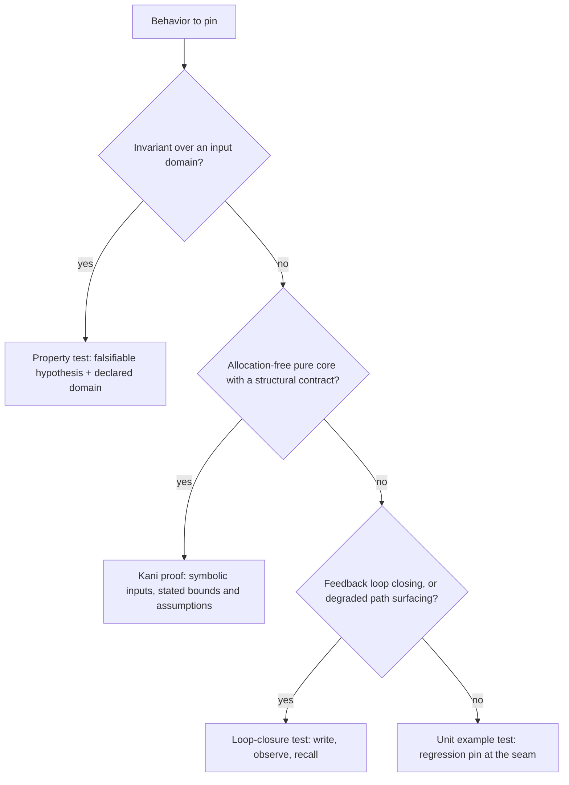

# kask Testing Protocol — Layer Assignment

This protocol answers one question: **given a behavior to pin, which test layer owns it.**
It extends — does not replace — the MCP tool-behavior standard
(`kask/docs/reference/mcp-servers/README.md` §Testing standard), which already
governs the loop-closure layer's construction rules (real tool seam over
in-memory stores, error-envelope specificity).

Grounding: the 2026-09-18 Phase 0 inventory measured ~2,377 example tests
across kask core and MCP server crates, 5 property-test sites, completed
Kani proof work on one extracted core (`hkask-mcp-training` `MathDecisions`),
and 9 of 10 enumerated feedback loops closed by loop-closure tests. The
deficit is concentrated in the property and proof layers, not the loop layer.

## Assignment procedure

1. Name the failure class the test must catch (the trap it pins).
2. Walk the decision flow below; a behavior may be pinned at more than one
   layer when its failure class warrants it.
3. When the proof layer wants a target that allocates or formats, extract the
   allocation-free core and prove that — do not weaken checks or raise
   budgets to make an impure target fit.

## The four layers

### 1. Unit / example tests

- **Belongs when:** the check is a specific known input-to-output behavior or
  a module-seam contract — a regression pin. Naming convention stays the
  existing one: sentence names that state the contract
  (`record_resolution_feeds_calibration_read`, `extracts_array_of_objects`).
- **Cannot prove:** behavior on unseen inputs; domain-wide invariants;
  absence of panics anywhere in a domain.

### 2. Property tests (proptest)

- **Belongs when:** the check is an invariant over an input domain — parser
  contracts, arithmetic conservation, normalization, serialization
  round-trips over generated values. Each property is stated as a falsifiable
  hypothesis with its declared input domain; counterexamples must shrink.
  Dependency: the workspace `proptest` (1.10.0, git-pinned) as a dev-dependency.
- **Cannot prove:** exhaustive coverage (proptest samples; a passing property
  is evidence, not proof); cross-crate wiring; degraded-path surfacing.

### 3. Proof layer (Kani, pinned 0.68.0 / CBMC 6.11.0)

- **Belongs when:** the check is panic-freedom or a structural contract of an
  **allocation-free pure core** — no String formatting, no Vec allocation,
  no I/O. Harnesses live in `#[cfg(kani)] mod proofs` beside the code;
  `cfg(kani)` is already whitelisted in the workspace check-cfg list, and the
  crates.io `kani` crate is never added as a dependency
  (Gödel plan R2 mandate). Pinned budgets per harness, matching
  `kask/scripts/check-bounded-proofs.sh`: `--default-unwind 12`, 2 GiB
  address-space limit, 120-second wall limit, all default safety and
  unwinding checks on. Evidence: exit code, per-harness logs, source
  identity (sha256), manifest — a failed or resource-exhausted run is
  recorded as `Unknown`, never as a pass.
- **Cannot prove:** allocation and formatting surfaces — the R2 record shows
  four harnesses over formatting code exhaust the 2 GiB budget; the extracted
  pure core verifies within it. Anything beyond the stated unwind bound or
  input bound is not covered by a run.

### 4. Loop-closure tests

- **Belongs when:** the check is a feedback loop closing (write → observe →
  recall) or a degraded path being surfaced — a degradation is asserted as a
  note/status/mode naming the reason, never as empty-equals-success.
  Construction follows the MCP testing standard: real tool seam over
  in-memory stores with the capability under test.
- **Cannot prove:** input-domain invariants or formal contracts.

## Worked example: the JSON extraction multi-layer pin

The `.rules` corpus-batching trap (an array-parsing drop that silently
discards all but the first object) is pinned at three layers in
`kask/crates/hkask-types/src/json_extract.rs`:

| Layer | Pin |
| --- | --- |
| Unit | `extracts_array_of_objects` — the exact regression case |
| Property | `array_with_preamble_extracts_the_full_array` — the generalized hypothesis over generated arrays and reasoning preambles |
| Proof | `balanced_result_is_container_delimited` + `balanced_scan_never_panics_on_valid_utf8` — the allocation-free scan core `find_balanced_json`, bounded symbolic inputs |

The fence-stripping wrapper (`strip_json_fences`, String allocation) stays
at the property and example layers by rule 3 of the procedure.

## Provenance

[^pyramid]: Ham Vocke, "The Practical Test Pyramid", 2020, https://martinfowler.com/articles/practical-test-pyramid.html — layered testing.
[^quickcheck]: Koen Claessen and John Hughes, "QuickCheck: A Lightweight Tool for Random Testing of Haskell Programs", ICFP 2000, https://doi.org/10.1145/351240.351266 — property-based testing with shrinking.
[^kani]: Kani contributors, "Kani Rust Verifier", https://github.com/model-checking/kani — bounded model checking.
[^goedel]: Gödel-machine gap closure plan, `kask/docs/plans/goedel-gap-closure-plan.md` §R2 — the allocation-surface cost record and pinned proof budgets.
[^phase0]: Phase 0 decision brief, 2026-09-18 (this session) — the inventory and gradient analysis grounding this protocol.