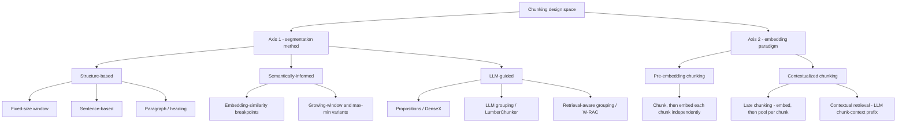
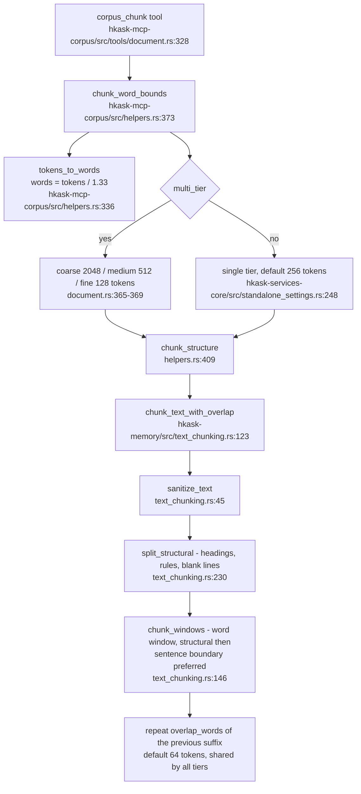

# Text Chunking for RAG — Canonical Design Patterns and Reference Models

> **IS/OUGHT boundary.** Sections 3–6 and 7.1 are *current-state* claims
> about the research literature and about the shipping corpus pipeline,
> each carrying a `file:line` or external citation. Section 7.2 onward is
> *recommendation* — none of it is implemented, and none of it should be
> read as a description of the tree as it stands.

## 1. Purpose and scope

The corpus pipeline segments source documents into retrievable passages and
embeds them. The segmentation step (chunking) is a design choice with a large
but poorly-documented design space: practitioners have converged on several
disjoint families of methods, evaluated on benchmarks with minimal overlap,
which makes like-for-like comparison difficult.[^chunktax] This document
records the canonical patterns and reference models that a corpus ingestion
pipeline should treat as prior art, and assesses where the hKask corpus
pipeline currently sits against them.

In scope: segmentation method, embedding paradigm, chunk granularity,
overlap, contextualization, hierarchy, and chunk-quality evaluation.

Out of scope: embedding-model selection, vector-index construction, reranking,
and prompt assembly — except where chunking choices interact with them.

## 2. Method and provenance

The findings were produced through the research MCP server
([`../reference/mcp-servers/research.md`](../reference/mcp-servers/research.md)),
driven over stdio JSON-RPC as specified by the Model Context Protocol.[^mcp]
A server-side research-run ledger recorded every source the tools actually
returned, so the evidence base is non-repudiable rather than reconstructed:

- **Run id** `2d5544c4d4bc43b3` — "What are the canonical design patterns and
  reference models for text chunking in retrieval-augmented generation (RAG)
  that a corpus ingestion pipeline should adopt?"
- **95 sources** recorded by the server. **13 pivotal sources** were annotated
  `verified` with the basis *"extracted verbatim from the source via
  `web_extract`"* — the abstract or method description quoted in this
  document was read from the source itself, not recalled.
- Search used reciprocal-rank fusion across three scholarly providers.[^rrf]

**Coverage limitation.** No commercial search-provider credentials were
resolvable in that session, so the run queried only the free scholarly
providers (Semantic Scholar, arXiv, OpenAlex). Coverage of the peer-reviewed
and preprint literature is therefore strong; coverage of practitioner
framework documentation is weak — the framework references in §4 marked
*reference implementation* are named from domain knowledge and were **not**
verified by extraction in this run. They are recorded as prior-art markers,
not as verified findings.

## 3. The canonical design space

The unifying account is a two-axis taxonomy: segmentation methods on one axis,
and the embedding paradigm — the *timing* of chunking relative to embedding —
on the other.[^chunktax]

<!-- DIAGRAM_ALIGNMENT
id: DIAG-RES-CHUNK-001
verified_date: 2026-09-16
verified_against: https://arxiv.org/abs/2602.16974; https://arxiv.org/abs/2409.04701; https://www.anthropic.com/engineering/contextual-retrieval; research run 2d5544c4d4bc43b3
reference_sources: chunktax, latechunk, ctxretr, densex
status: VERIFIED
-->

The segmentation axis partitions into three families. **Structure-based**
methods cut on the document's own boundaries — a fixed-size window, sentence
ends, or paragraph/heading structure. **Semantically-informed** methods cut
where a similarity signal between adjacent text units shifts, most commonly an
embedding-similarity breakpoint above a percentile threshold. **LLM-guided**
methods delegate the cut: propositions are atomic self-contained factoids;[^densex]
LumberChunker emits boundaries directly; retrieval-aware chunking uses the model
only to *group* pre-identified, ID-addressable units and never to generate
text.[^wrac]

The embedding axis is the higher-leverage one, because it determines what the
vector actually represents. Under **pre-embedding chunking** each chunk is
encoded in isolation, so its vector is blind to surrounding context.
**Contextualized chunking** fixes that in one of two ways: *late chunking*
embeds the whole document with a long-context encoder and applies chunk
boundaries after the transformer, just before pooling, so each chunk vector
carries document context at no extra inference cost;[^latechunk] *contextual
retrieval* has a model generate a short situating prefix for each chunk and
embeds the concatenation, at a cost of one generation call per chunk.[^ctxretr]

Two further families are orthogonal to both axes. **Hierarchical** chunking
links a small retrieval unit to a larger enclosing unit — parent/child,
small-to-big, or DFS grouping of a reconstructed document tree.[^multidoc]
**Layout- and modality-aware** chunking parses document *regions* rather than
character streams, so tables, figures, and headings survive as units rather
than being flattened into prose.[^pdfchunk]

## 4. Reference models

| Pattern | Canonical reference | Mechanism | Verification |
|---|---|---|---|
| Fixed-size window | Multi-dataset chunk-size analysis[^chunksize] | Cut every N tokens | verified |
| Recursive / structure-based | Unified chunking taxonomy[^chunktax] | Separator hierarchy, prefer structural ends | verified |
| Semantic (embedding breakpoints) | Semantic-chunking cost study[^semcost] | Split at similarity shifts above a percentile | verified |
| Propositional / LLM-guided | Dense X Retrieval[^densex] | Atomic self-contained factoids as retrieval units | verified |
| Contextual retrieval | Anthropic contextual retrieval[^ctxretr] | LLM chunk-context prefix, embedded with the chunk | verified |
| Late chunking | Günther et al.[^latechunk] | Embed long text, then pool per chunk | verified |
| Hierarchical / multimodal | MultiDocFusion[^multidoc] | Region detection, OCR, section tree, DFS grouping | verified |
| Decoupled extraction and planning | W-RAC[^wrac] | ID-addressable units; model groups, never writes | verified |
| Metadata-as-text | Metadata-aware retrieval study[^metadata] | Prefix/suffix metadata into the embedded text | verified |
| Heuristic PDF parsing and chunking | ChunkNorris[^chunknorris] | ML-free heuristics over parser output | verified |
| Intrinsic chunk-quality metrics | Adaptive Chunking[^adaptive] | RC, ICC, DCC, BI, SC — label-free | verified |
| Recursive character splitting | LangChain `RecursiveCharacterTextSplitter` | Reference implementation | **not verified by extraction** |
| Sentence-window / hierarchy | LlamaIndex `SentenceWindowNodeParser`, `HierarchicalNodeParser` | Reference implementation | **not verified by extraction** |

## 5. Evidence on the contested choices

Three findings should shape any adoption decision, and all three cut *against*
the intuitive choice.

**Semantic chunking is not cost-justified.** A systematic evaluation across
document retrieval, evidence retrieval, and retrieval-based answer generation
found that the computational cost of semantic chunking is not repaid by
consistent performance gains over fixed-size chunking.[^semcost] An independent
evaluation on long, structured academic theses reached the same conclusion:
cluster-based chunking did not outperform fixed-size or recursive chunking
under the tested configuration.[^academic]

**Structure-based methods win the in-corpus retrieval task.** The unified
taxonomy's reproduction found that optimal chunking is task-dependent — simple
structure-based methods outperform LLM-guided alternatives for in-corpus
retrieval, while LLM-guided methods win in-document (needle-in-a-haystack)
retrieval. Contextualized chunking improves in-corpus effectiveness but
*degrades* in-document retrieval.[^chunktax] A corpus pipeline serves the
in-corpus task, which is the case where the cheap methods win.

**Chunk size must be co-tuned with the embedding model and the task.** Smaller
chunks (64–128 tokens) are optimal for datasets with concise fact-based
answers, larger chunks (512–1024 tokens) for datasets needing broader
contextual understanding; embedding models exhibit distinct chunk
sensitivities, so the optimum is model-specific.[^chunksize] Chunk size also
interacts with the number of retrieved passages, which means tuning it in
isolation is ill-posed.[^effectsize]

The contextualization choice is a genuine trade-off rather than a clear win:
contextual retrieval preserves semantic coherence more effectively but costs
more compute, while late chunking is more efficient but sacrifices relevance
and completeness.[^reconstruct]

## 6. The corpus pipeline's current chunking surface

<!-- DIAGRAM_ALIGNMENT
id: DIAG-RES-CHUNK-002
verified_date: 2026-09-16
verified_against: kask/mcp-servers/hkask-mcp-corpus/src/tools/document.rs:328-630; kask/mcp-servers/hkask-mcp-corpus/src/helpers.rs:336-425; kask/crates/hkask-memory/src/text_chunking.rs:45-198; kask/crates/hkask-services-core/src/standalone_settings.rs:248-277
status: VERIFIED
-->

Traceability of each capability to its canonical pattern:

| Capability | Location | Canonical pattern |
|---|---|---|
| Structural + sentence-preferring windows | `kask/crates/hkask-memory/src/text_chunking.rs:146` | Structure-based segmentation |
| Paragraph/heading/rule split | `kask/crates/hkask-memory/src/text_chunking.rs:230` | Structure-based segmentation |
| Sentence-end detection | `kask/crates/hkask-memory/src/text_chunking.rs:204` | Sentence-based segmentation |
| Overlap, in words | `kask/crates/hkask-memory/src/text_chunking.rs:123` | Overlap window |
| Multi-tier coarse/medium/fine | `kask/mcp-servers/hkask-mcp-corpus/src/tools/document.rs:365` | Hierarchical, delivered as parallel tiers |
| Control-character sanitization | `kask/crates/hkask-memory/src/text_chunking.rs:45` | Ingestion hygiene |
| Corrupted-encoding detection | `kask/crates/hkask-memory/src/text_chunking.rs:20` | Ingestion hygiene |
| Boilerplate and front/back-matter filter | `kask/crates/hkask-memory/src/text_chunking.rs:404` | Ingestion hygiene |
| Deduplication and LLM consolidation | `kask/mcp-servers/hkask-mcp-corpus/src/tools/corpus.rs:43` | Post-processing |
| Ontology-tag prefix on embedding input | `kask/mcp-servers/hkask-mcp-corpus/src/tools/semantic.rs:296` | Metadata-as-text, partial |

The structural splitter, the sentence-end fallback, and the boilerplate
filtering are a well-executed instance of the structure-based family that §5
identifies as the right default for in-corpus retrieval, and the heuristic-only
posture is consistent with evidence that machine-learning-free parsing and
chunking heuristics are competitive on retrieval accuracy at a fraction of the
compute.[^chunknorris]

## 7. Assessment

### 7.1 Alignment

The pipeline already implements, correctly, the patterns the evidence favours:
structure-based segmentation with sentence-end fallback, overlap, ingestion
hygiene, and multi-tier output that is structurally the hierarchical pattern.
The deliberate absence of semantic chunking is consistent with §5.[^semcost]

The chunk-size approximation — `floor(tokens / 1.33)` whitespace words
(`kask/mcp-servers/hkask-mcp-corpus/src/helpers.rs:336`) — deliberately avoids
a tokenizer dependency. It is an English-prose heuristic: the ratio is
calibrated to English text, so the effective budget drifts for
morphologically richer languages and for code, where a whitespace-delimited
word carries more tokens than the ratio assumes. The budget therefore bounds
retrieval granularity rather than enforcing a hard model limit, and the
question of whether a configured budget can exceed the configured embedding
model's input length — and whether the embedder truncates visibly or silently
in that case — is **not verified here** and belongs in the instrument proposed
in §8.1.

### 7.2 Gaps

**No chunk-quality evaluation gate.** The evidence base repeatedly stresses that
the design space is poorly understood because there is no dedicated evaluation
framework, and proposes five label-free intrinsic metrics — References
Completeness, Intrachunk Cohesion, Document Contextual Coherence, Block
Integrity, Size Compliance — that assess chunking quality without
downstream-task labels.[^adaptive] The pipeline has no such instrument, so its
defaults (256 tokens, 64 overlap, minimum window of one quarter of the maximum)
are unfalsified. This is the highest-value gap.

**One overlap constant across three tiers.** `corpus_chunk` resolves a single
`overlap_tokens` and passes it to every tier
(`kask/mcp-servers/hkask-mcp-corpus/src/tools/document.rs:365-369`). At the
default 64 tokens the repetition fraction is roughly 3% of a coarse tier,
13% of a medium tier, and **50% of a fine tier** — the smallest tier carries the
highest redundancy. Overlap is also known to interact with parser and chunking
choice rather than being independently optimizable.[^pdfchunk]

**Metadata prefixing exists, but is narrow and opt-in.** Ontology tags are
prepended to the embedded text when `tagged_jsonl` is supplied, with a neutral
`[unclassified] ` prefix for chunks that carry no tags
(`kask/mcp-servers/hkask-mcp-corpus/src/tools/semantic.rs:296-304`). Two gaps
remain. First, the prefix carries ontology tags only — not structural
provenance such as source file or section heading. Second, the chunk-time index
path behind `corpus_chunk(index: true)` embeds bare passage text
(`kask/mcp-servers/hkask-mcp-corpus/src/services/convert.rs:447`), so the same
corpus produces different vectors depending on which entry point loaded it.
Prefixing metadata into the embedded text is the strongest-performing simple
metadata strategy reported.[^metadata]

**No contextualized embedding paradigm.** The pipeline is uniformly
pre-embedding: each chunk is embedded independently, so chunk vectors are blind
to their document context — the failure mode both contextualized paradigms
exist to fix.[^ctxretr][^latechunk] For an in-corpus retrieval task this is the
case where the evidence says contextualization helps.[^chunktax]

**Tiers are parallel, not linked.** Multi-tier output emits three independent
arrays. The canonical hierarchical pattern links a fine retrieval unit to its
enclosing parent so retrieval can expand deterministically.[^multidoc]

**Layout and tables are flattened.** PDF text arrives via extraction
(`kask/crates/hkask-memory/src/text_chunking.rs:20` exists precisely because
extraction is lossy), so tables and figures are not preserved as units. This is
a substantially larger investment than the items above and is flagged rather
than recommended.

## 8. Recommended adoption sequence

Ordered by value per unit of effort. None of these are implemented; each names
a `file:line` where the change would land.

1. **Build the chunk-quality instrument first.** Implement the five label-free
   intrinsic metrics and score the existing defaults against the operator's own
   corpus.[^adaptive] Every subsequent item is unfalsifiable without it. This is
   the change that converts §7.2's unvalidated defaults into measured ones.
2. **Resolve overlap per tier.** Replace the single constant passed at
   `kask/mcp-servers/hkask-mcp-corpus/src/tools/document.rs:365-369` with a
   per-tier overlap, or a per-tier fraction, and evaluate it.
3. **Generalize the metadata prefix and apply it on both embed paths.** Extend
   the existing tag prefix (`kask/mcp-servers/hkask-mcp-corpus/src/tools/semantic.rs:296-304`)
   to carry structural provenance — source file and section heading — and apply
   the same composition on the chunk-time index path
   (`kask/mcp-servers/hkask-mcp-corpus/src/services/convert.rs:447`), which
   currently embeds bare text.[^metadata] Changing the embedded string changes
   every vector, so this item implies a re-embed of any corpus already loaded, and
   it must not be landed without the instrument from §8.1 to show the change is
   an improvement.
4. **Add contextual-retrieval prefixing as an optional stage.** One cached
   generation per chunk via the existing inference router; surface an explicit
   degraded mode when inference is unavailable.[^ctxretr] Prefer this over late
   chunking when coherence matters more than cost.[^reconstruct]
5. **Link the tiers.** Emit a parent reference from each fine chunk to its
   enclosing coarse chunk so retrieval can expand deterministically.[^multidoc]
6. **Re-derive the default budget per embedding model and corpus.** Chunk size
   is model- and task-specific,[^chunksize] so the default should follow from
   item 1 rather than being fixed in settings.

## 9. Explicit non-recommendations

- **Do not adopt semantic chunking as a default.** The cost is not repaid by
  consistent gains,[^semcost] and it does not beat simpler strategies on
  structured documents.[^academic] If it is ever added, it belongs behind the
  instrument from §8.1 as an opt-in alternative.
- **Do not let a model generate chunk text.** The retrievable passage must
  remain verbatim source text; models should only *group* or *select*
  pre-existing units, which is what the existing consolidation stage does as a
  labelled post-processing step.[^wrac]
- **Do not replace the word-window engine wholesale.** It is the family the
  evidence favours for this task; the gaps above are configuration and
  instrumentation gaps, not engine gaps.

## 10. Verification checklist

Publication gate per the corpus documentation standards, following the
information-process maturity discipline of organising review criteria as an
explicit checklist.[^hackos]

- [x] Six-field metadata header present, with `mds_categories`
- [x] Every `##` section carries an external footnoted citation
- [x] Every current-state Mermaid block has adjacent `DIAGRAM_ALIGNMENT` metadata
- [x] Both diagram IDs registered in [`../DIAGRAMS_INDEX.md`](../DIAGRAMS_INDEX.md)
- [x] Internal cross-references are repository-relative and resolve
- [x] Current-state and recommended content are separated by an explicit IS/OUGHT statement
- [x] Sources annotated in the research-run ledger; unverified framework references are labelled as such
- [x] `last_updated` reflects the final edit

## References

[^adaptive]: de Moura Júnior, P. R., Lelong, J., & Blangero, A. (2026). *Adaptive Chunking: Optimizing Chunking-Method Selection for RAG*. arXiv:2603.25333. https://arxiv.org/abs/2603.25333 — source of the five label-free intrinsic chunk-quality metrics.
[^academic]: Kreileder, V. J. J., Reisinger, J., & Fischer, A. (2026). *Evaluating Chunking Strategies for Retrieval-Augmented Generation on Academic Texts*. arXiv:2607.01852. https://arxiv.org/abs/2607.01852
[^chunknorris]: Ciancone, M., Varangot-Reille, C., & Schaeffer, M. (2025). *ChunkNorris: A High-Performance and Low-Energy Approach to PDF Parsing and Chunking*. arXiv:2602.00010. https://arxiv.org/abs/2602.00010
[^chunksize]: Bhat, S. R., Rudat, M., Spiekermann, J., & Flores-Herr, N. (2025). *Rethinking Chunk Size For Long-Document Retrieval: A Multi-Dataset Analysis*. arXiv:2505.21700. https://arxiv.org/abs/2505.21700
[^chunktax]: Zhou, Y., Wang, S., Koopman, B., & Zuccon, G. (2026). *Beyond Chunk-Then-Embed: A Comprehensive Taxonomy and Evaluation of Document Chunking Strategies for Information Retrieval*. arXiv:2602.16974. https://arxiv.org/abs/2602.16974 — the two-axis taxonomy used in §3.
[^ctxretr]: Anthropic. (2024). *Introducing Contextual Retrieval*. https://www.anthropic.com/engineering/contextual-retrieval
[^densex]: Chen, T., Wang, H., Chen, S., Yu, W., Ma, K., Zhao, X., Zhang, H., & Yu, D. (2024). *Dense X Retrieval: What Retrieval Granularity Should We Use?* Proceedings of EMNLP 2024. https://arxiv.org/abs/2312.06648
[^effectsize]: Garrido-Lestache Belinchon, G., & Garrido-Lestache Belinchon, H. (2026). *The Effect of Text Chunk Size on Retrieval-Augmented Generation Performance*. arXiv:2607.24767. https://arxiv.org/abs/2607.24767
[^hackos]: Hackos, J. T. (2007). *Information Process Maturity Model*. Comtech Services. https://www.comtech-serv.com/ipmm.shtml
[^latechunk]: Günther, M., Mohr, I., Williams, D. J., Wang, B., & Xiao, H. (2024). *Late Chunking: Contextual Chunk Embeddings Using Long-Context Embedding Models*. arXiv:2409.04701. https://arxiv.org/abs/2409.04701
[^mcp]: Anthropic. (2024). *Model Context Protocol — Specification, revision 2024-11-05*. https://modelcontextprotocol.io/specification/2024-11-05
[^metadata]: Bin Yousuf, R., Xu, S., Sharma, M., Neeser, A., Latimer, C., & Ramakrishnan, N. (2026). *Utilizing Metadata for Better Retrieval-Augmented Generation*. arXiv:2601.11863. https://arxiv.org/abs/2601.11863
[^multidoc]: Shin, J., Park, C., Park, J., Seo, J., & Lim, H. (2026). *MultiDocFusion: Hierarchical and Multimodal Chunking Pipeline for Enhanced RAG on Long Industrial Documents*. arXiv:2604.12352. https://arxiv.org/abs/2604.12352
[^pdfchunk]: El Bachyr, O., Song, Y., Ezzini, S., Klein, J., Bissyandé, T. F., Zilali, A., Ble, U., & Goujon, A. (2026). *Empirical Evaluation of PDF Parsing and Chunking for Financial Question Answering with RAG*. arXiv:2604.12047. https://arxiv.org/abs/2604.12047
[^reconstruct]: Merola, C., & Singh, J. (2025). *Reconstructing Context: Evaluating Advanced Chunking Strategies for Retrieval-Augmented Generation*. arXiv:2504.19754. https://arxiv.org/abs/2504.19754
[^rrf]: Cormack, G. V., Clarke, C. L. A., & Buettcher, S. (2009). *Reciprocal Rank Fusion outperforms Condorcet and individual Rank Learning Methods*. Proceedings of SIGIR 2009. https://doi.org/10.1145/1571941.1572114
[^semcost]: Qu, R., Tu, R., & Bao, F. (2024). *Is Semantic Chunking Worth the Computational Cost?* Findings of NAACL 2025. https://arxiv.org/abs/2410.13070
[^wrac]: Allu, U., Kedia, S., Odapally, T., & Ahmed, B. (2026). *Web Retrieval-Aware Chunking (W-RAC) for Efficient and Cost-Effective Retrieval-Augmented Generation Systems*. arXiv:2604.04936. https://arxiv.org/abs/2604.04936
