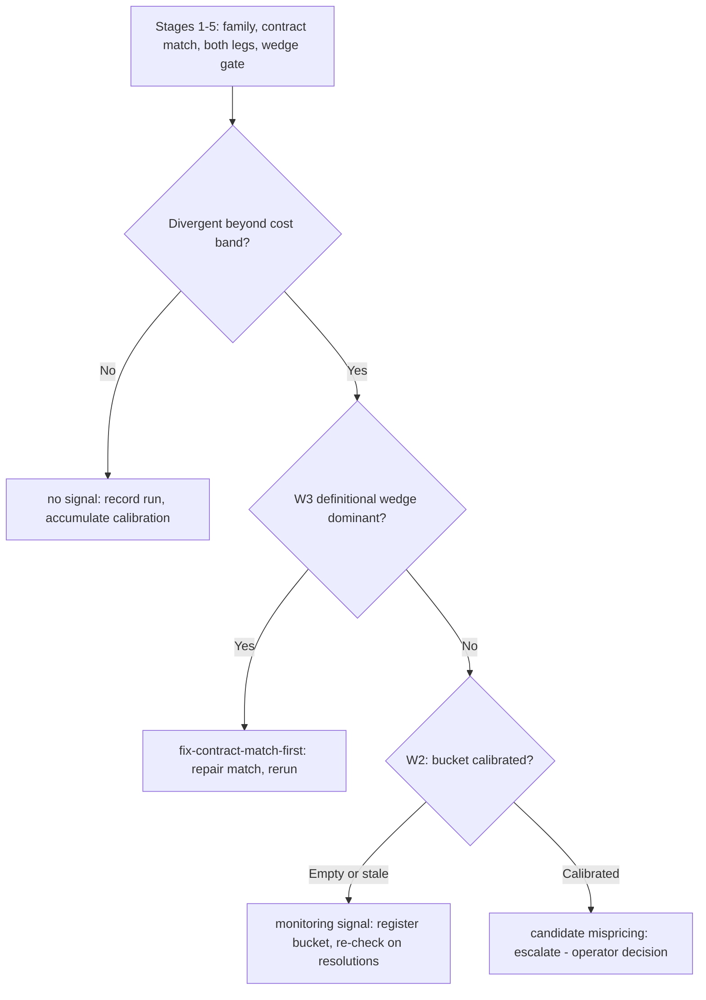

# Expectations-Gap Methodology: Prediction Markets vs Traditional Markets

**Status**: v1.0, 2026-09-19. Process-level spec; run 1 (recession family) is the first worked instance (report: `~/Documents/zk-data/companies-mcp/reports/cmp-gap-run1-recession.json`, goal `824c7f78`, judged done 2026-09-19).

**Scope**: the repeatable process for detecting, measuring, and interpreting gaps between the expectations priced into prediction markets (Polymarket, Kalshi) and those priced into traditional financial markets (rates, FX, equities) and published macro data.

**Executor**: the `cmp-term-structure` skill runs the CMP (Constant-Maturity Prediction) stages inside this process — tenor ladder, economic context, index construction, event-tree composition, coherence testing, duration matching. This document is the surrounding process. Promoting the full process to a skill is an open operator decision.

**Ontology**: `term_structure` (FIBO `fibo-ind-ind-ind:TermStructure`) and `interest rate` (FIBO `fibo-fnd-acc-cur:InterestRate`) resolve at the FIBO domain-supplement rung (fixture refresh 2026-09-20, commit `105b650e46`); `risk_premium` (Mehra & Prescott 1985) and `expectations_gap` (Rappaport & Mauboussin, *Expectations Investing*, 2001) resolve live at the derived rung via `onto_anchor` (commit `7aa15ac78e`). The former `term_structure` derived-rung stopgap is retired; its aliases ("cmp term structure", "probability term structure") now resolve to the core ground with the ruling note rather than a false FIBO pin.

## 1. Purpose and output

Prediction markets and traditional markets price overlapping real events through different mechanisms — thin retail-driven limit-order books on one side; deep dealer/derivatives markets and published macro data on the other. When both venues price the same event, a persistent divergence has exactly three candidate explanations:

1. **mispricing** — one venue's price is wrong relative to the other's information set;
2. **venue calibration error** — one venue systematically misprices this class of events (no Brier evidence, or poor evidence, yet);
3. **definitional mismatch** — the two "same" events are not the same event (resolution criteria, horizon, conditioning).

This process measures the divergence and separates those explanations **before** any capital decision. Every run routes to exactly one verdict:

- **candidate mispricing** — divergent beyond the cost band, calibration evidence adequate; escalate for investigation and sizing (capital is the operator's call);
- **monitoring signal** — divergent, but the calibration bucket is empty or stale; register the bucket and re-check as resolutions accumulate;
- **no signal** — inside the cost band; record and accumulate calibration;
- **fix-contract-match-first** — the definitional wedge dominates; no interpretation until the contract match is repaired.

The process is venue-agnostic and family-generic: a new family (rate-path, inflation, currency, equity) plugs in by selecting a traditional analog from the preference order (§3), not by redefining the process.

## 2. Venue-to-analog mapping

| Family | Prediction-market side | Traditional analog (§3 order) | Status |
|---|---|---|---|
| Recession | "US recession by end of 2026?" — Polymarket 609655, series `us-recession-by-end-of-2026` | (a) none direct; (b) SAHM-band conditional onset frequency (SAHMREALTIME × USREC); (c) Chauvet–Piger (RECPROUSM156N), SEP | Run 1 done — monitoring signal |
| Rate path | Fed-decision and target-range contracts | (a) fed funds futures-implied odds (CME FedWatch, web read); (c) SEP medians / FEDTARMD | Run 2 recommended — first full CMP-ladder family |
| Inflation | CPI-print and level contracts | (a) T10YIE / 5y5y forward breakevens, inflation swaps; (c) SPF / SEP | Run 3 candidate — W1 is the point |
| Currency | FX-level contracts ("EUR/USD above X by date") | (a) FX options risk reversals / implied distributions; (b) conditional frequency | Run 4 candidate |
| Equity events | Single-name and index level contracts | (a) options-implied distribution (Breeden–Litzenberger); companies server `expectations_gap` / `calibrate_forecast` for fundamentals-vs-price | Scoping pending (operator) |

External (a)-legs sourced off-platform are web reads; record provenance in the run report. The companies server covers the equity fundamentals leg natively.

## 3. Traditional-leg preference order

The traditional leg estimates **p_t** — the probability implied by non-prediction-market sources for the same event definition and horizon as the market contract.

**(a) Direct market-implied.** Breakevens (T10YIE, 5y5y), futures-implied policy odds (fed funds futures), options-implied distributions (risk reversals, smiles). Preferred when available: it prices the way the prediction market prices — risk-bearing — so venue-mechanism differences stay small. It carries its own premia; that is W1.

**(b) Transparent conditional frequency.** From published data: define the conditioning event, sample window, and outcome event; count mechanically. Fully reproducible; the run-1 method. Weakness: assumes the historical regime is informative (a W3/W4 review point).

**(c) Published model/policymaker output.** SEP medians and dot plot, Chauvet–Piger probabilities, SPF. Last resort: opaque internal assumptions, stale vintages, horizon mismatches. Use as corroboration or when (a)/(b) are unavailable, and record the horizon mismatch.

Prefer (a); use (b) when (a) is unavailable or as a cross-check on (a); use (c) as corroboration or fallback only.

## 4. Process — Stage 0 through Stage 8

The eight working stages (1–8) carry a Stage-0 ontology precondition.

### Stage 0 — Anchor the terms

Anchor every domain term the run names — family, wedge components, measures — with `onto_anchor` before computing. No private definitions: a term absent from the ladder is added at the derived rung with its authority (as `risk_premium` and `expectations_gap` were; commit `7aa15ac78e`), never used unanchored; a derived entry is a stopgap, retired when the published vocabulary adopts the term (`term_structure` graduated to the FIBO domain-supplement rung, 2026-09-20, commit `105b650e46`). A coarse (core-rung) anchor carries the ruling path; request the ruling.

### Stage 1 — Select the family

A family is admissible when (i) an active prediction-market contract exists with clear written resolution criteria; (ii) a traditional analog exists in the §3 order; (iii) both legs can be expressed as probabilities of the same event at the same horizon — or the horizon mismatch is explicitly W4-measured.

### Stage 2 — Match the contract, align the horizon

- Resolve the market contract (`market_lookup` / `market_match`); record verbatim: question, resolution criteria, deadline, price and price method, spread, volume, liquidity, reliability tier, resolution source.
- Read the resolution criteria against the traditional analog's event definition **now** — this is the W3 preview. If the definitions cannot be matched within the eventual cost band, route to fix-contract-match-first immediately.
- Align horizons. Contract-ladder families use the CMP tenor grid (7d/30d/90d/180d/1y/2y) via `market_ladder` / `market_cmp_indices`; the economic context for a CMP family is operator-accepted (`market_cmp_context_suggest` — never silently the curated default); tenors without cohort coverage are reported unknown, never filled. Duration-match equity legs with `equity_duration` (`cmp_tenor_gaps`).
- CMP tools require the series registered in `HKASK_PREDICTION_MARKETS_BASE_EVENTS`; single-contract families stay on `market_lookup` raw records (run 1 did).

### Stage 3 — Price the market leg

p_m = contract mid (or last trade, method recorded). The spread is the base cost band; widen with `market_volatility` (DR-AS) only when informative — in run 1, adverse selection (2.847) dominated deadline resolution (0.0039) and the interval was degenerate, so the spread remained the band. Record the honest microstructure verdict. Snapshot the price at observation: it is the pre-resolution probability the calibration loop needs.

### Stage 4 — Price the traditional leg

Compute p_t per §3. For (b) transparent conditional frequency:

- define the conditioning event, outcome event, and sample window (months whose outcome is not yet knowable are excluded from the denominator);
- **mechanical data path (mandatory)**: fetch source data directly to disk (`https://fred.stlouisfed.org/graph/fredgraph.csv?id=<SERIES>` via curl), date-keyed joins (awk), zero hand transcription — model-relayed transcription is the demonstrated corruption vector;
- **reconciliation gate (mandatory)**: independently verify row counts and event counts against the fetched source (awk tallies) before any computed claim; ship the gate output in the run report;
- corroborate with adjacent indicators (run 1: T10Y2Y, SEP medians, FEDTARMD, Chauvet–Piger) — recorded as context, not as the leg.

### Stage 5 — Measure the wedge

divergence = |p_m − p_t|; gate with `contract_price_coherence` (tree_implied = p_t, market_price = p_m, cost_band). Coherent (inside band) → no signal. Divergent → the gap is the signal. The same tool serves the within-CMP parlay coherence check (`cmp-term-structure` phase 3); here it is the cross-venue gate.

### Stage 6 — Decompose before interpreting (W1–W4)

- **W1 — risk-premium/measure wedge.** Contract prices are not probabilities. Prediction-market Yes prices carry a premium for bearing event risk (longshot bias pushes the market leg up); traditional market-implied measures carry their own premia (breakevens include inflation risk premium). When the market leg is premium-inflated, W1 shrinks the true gap. Measure when a premium estimate exists; otherwise record unmeasured.
- **W2 — calibration evidence.** Read `market_calibration(bucket)`: Brier, sample size, staleness. An empty or stale bucket caps the verdict at monitoring signal.
- **W3 — definitional wedge.** Resolution-criteria asymmetry between the legs. Compare the market's written criteria against the traditional analog's event definition; recompute the traditional estimate on the market-event basis where possible (run 1: onset basis 0.03145 → market-event basis 0.02516; the market event is strictly rarer). W3 can widen or shrink the true gap.
- **W4 — horizon wedge.** Deadline vs sample-window mismatch. Match with the CMP tenor grid or duration matching; where impossible, record the mismatch and treat the reading as context (run 1: Chauvet–Piger is a current-state model — horizon-mismatched context, not a leg).

### Stage 7 — Route

| Condition | Verdict | Action |
|---|---|---|
| Divergent + bucket calibrated (non-stale) | candidate mispricing | Escalate: investigate, size, position — operator decision |
| Divergent + bucket empty or stale | monitoring signal | Register bucket for calibration accumulation; re-check on resolutions |
| Inside cost band | no signal | Record run; accumulate calibration |
| W3 dominant | fix-contract-match-first | No interpretation; repair the contract match; rerun |

### Stage 8 — Record and calibrate

- Persist the run report via `report_save` (companies-mcp reports: `cmp-gap-runN-<family>.json`) carrying: contract identity (verbatim criteria), both legs with data provenance, reconciliation-gate output, wedge, decomposition, verdict, known degradations, followups.
- Accumulate calibration: `market_check_resolutions` (pre-resolution snapshots), `market_subscribe_resolutions` (resolution events), `market_record_resolution` (manual observations). The next run's W2 reads `market_calibration(bucket)`.
- Judge the run against its goal criteria (`kanban_goal_judge`); score on operator confirmation (`kanban_goal_score`).

## 5. Server roles

| Server | Role in the process |
|---|---|
| prediction-markets | Stage 2: `market_lookup`, `market_match`, `market_ladder`; Stages 2–3: `market_cmp_context_suggest`, `market_cmp_indices`, `market_cmp_index`; Stage 3: `market_volatility` (DR-AS); Stage 5: `contract_price_coherence`; Stage 8: `market_check_resolutions`, `market_subscribe_resolutions`, `market_record_resolution`, `market_calibration` |
| scenarios | `scenario_from_markets_set` / `scenario_from_cmp_indices` (event-tree composition), `scenario_quantify`, `scenario_propagate` (Bayesian propagation), `scenario_cross_validate` (estimate cross-validation), `scenario_calibration` (forecast calibration curve) |
| companies | Equity legs: `expectations_gap`, `calibrate_forecast`; durable forecast records with Brier scoring: `forecast_persist` / `forecast_record`; `equity_duration` for horizon matching; `report_save` for durable run reports |
| FRED / DBnomics / World Bank / web | Traditional-leg data via the observations path (`fred_get_series_info` currently returns empty metadata for several valid series IDs — degradation logged, warn-log fix pending); web reads for off-platform (a)-legs and published models |
| lisp_eval / awk | Deterministic gate arithmetic and count checks. `lisp_eval` is fragile on large arrays (run 1: 2× max_steps at 500k on ~650-element arrays, 2× type errors; skill-use issue filed); awk for arrays over ~100 elements |

## 6. Worked example — run 1: recession family

**Contract (market leg).** Polymarket 609655 (event 48802), "US recession by end of 2026?": last-trade 0.08, spread 0.02, deadline 2027-01-31 (0.364y to maturity), reliability high, UMA oracle. Resolution: two consecutive negative BEA SAAR quarters within Q2 2025–Q4 2026 (advance estimates considered) OR an NBER recession announcement for 2025/2026 by the Q4-2026 advance release; hard fallback 2027-06-30.

**Traditional leg (preference (b)).** Conditioning: SAHMREALTIME in [−0.17, +0.03] (±0.10 around the then-current −0.07) and USREC = 0. Outcome: USREC → 1 (month-after-peak convention) within the following 4 months. Window 2000-01..2026-04 (the last 4 knowable months excluded from the denominator). Data: fredgraph.csv to disk, date-keyed awk join; SAHM 320 rows (2025-10 empty, excluded); USREC 320 rows, 28 recession months (2001-04..11: 8; 2008-01..2009-06: 18; 2020-03..04: 2).

**Counts.** n_band = 159; n_onset = 5 (2000-12; 2019-11..2020-02) → onset frequency 0.03145. Market-event analog frequency 0.02516 (the two-quarter/NBER criterion is strictly rarer than USREC onset; the only non-COVID qualifying precedent, 2000-12 → 2001, fails the two-quarter criterion). Non-COVID frequency 0.00629 (W3 magnitude context).

**Corroboration (context, not the leg).** T10Y2Y 0.25 (2026-09-18); September 2026 SEP medians — real GDP 2.3, unemployment 4.1, PCE 3.7, core PCE 3.4, fed funds 4.1 (June projection 3.8); FEDTARMD 2026–2029 [4.1, 4.1, 3.9, 3.6]; Chauvet–Piger (RECPROUSM156N) 0.76% (2026-07) — current-state model, horizon-mismatched.

**Microstructure.** DR-AS uninformative at these inputs (adverse selection 2.847 dominates deadline resolution 0.0039; degenerate 95% interval) → cost band stays at spread ± 0.02.

**Wedge.** `contract_price_coherence`: divergence 0.04855 > cost band 0.02 → coherent = false. Gap 4.86pp; market 2.54× the traditional read; 2.43× the executable spread. Direction: the market is more pessimistic than the traditional indicators.

**Decomposition.** W1 shrinks (event-risk premium in Yes prices — unmeasured); W2 empty (recession bucket sample_size 0, stale); W3 widens (market-event-basis gap 5.48pp); W4 matched (4-month onset window ≈ 4.5-month remaining determination window).

**Verdict: monitoring signal, not a trade.** Direction real; magnitude uncertain. The run also proved the data gates: a corrupt hand-assembled scratch file (36 USREC ones at wrong spans vs the series' 28, ~57k spurious lines) was caught by the mandatory reconciliation gate before any number was published; the rebuild was mechanical, zero hand transcription.

## 7. Calibration loop — current state (honest)

The recession bucket (`market_calibration("recession")`) reads Brier null, sample_size 0, stale. Registration status as of 2026-09-19:

- The resolution-scan loop **executes**: broad `market_check_resolutions` scans return nonzero snapshots (5 snapshotted at limit 5; 25 at limit 25) and detect resolved markets without prior snapshots.
- **Targeted registration is not verifiable**: series-scoped scans (`series="recession"` and the exact slug `us-recession-by-end-of-2026`) return silent zeros — all counts 0, no warnings — so the `series` filter semantics are unknown. Successive broad scans show `already_known: 0` (enumeration churn and snapshot non-persistence are indistinguishable), and scan responses carry counts only, not market identities, so per-market accumulation cannot be verified.
- The websocket path (`market_subscribe_resolutions`) needs Polymarket CLOB asset IDs, which `market_lookup` does not expose.
- The durable pre-resolution observation survives in the run-1 report (p = 0.08, re-checked 2026-09-20T00:54Z). W2 stays "empty bucket" until resolutions accumulate.

Followups filed (prediction-markets server): surface the reason a series-scoped scan records zero (a silent no-op violates the surfaced-degradation rule); return snapshotted market identities in scan responses; expose CLOB asset IDs in lookup records; document the `series` filter semantics.

## 8. Roadmap

- **Run 2 — rate-path family (recommended next).** Policy-path prediction markets vs (a) fed funds futures-implied odds and (c) SEP/FEDTARMD medians. First family to exercise the full CMP ladder and a real (a)-leg. **Registered 2026-09-20**: `economics:KXFEDDECISION` in `prediction_markets.base_events` (user settings), live-verified — the registration gate passes and `market_cmp_indices` resolves family `policy_interest_rate` (55 contracts fetched). **Probe found two gaps.** (1) Strike extraction: the builder rejected all 55 decision-style contracts with surfaced reasons (`no extractable strike from 'Will the Federal Reserve Hike rates by 25bps…'`) — `extract_strike` parses level-space titles only ($X, X%, above/below/at); decision-delta contracts (H0/H25/H26/C25/C26) need a bp-change branch before the rate-path CMP ladder can run — approved by the operator 2026-09-20 ("please proceed"), implementation in flight. (2) Context staleness: the curated default context for the rates family is Q3-2024 vintage (reference 5.375) — a live operator-accepted context is mandatory (DFF 3.88 as of 2026-09-17 after a +25bp move; FEDTARMD/SEP path 4.1 → 3.9 → 3.6). Filed followup: `market_cmp_context_suggest` classifies through the text classifier and cannot read a bare series ticker (family 'unknown', generic default for KXFEDDECISION) while `market_cmp_indices` uses the catalog classifier — the proposal side should classify through the same catalog path.
- **Run 3 — inflation family.** CPI-print markets vs T10YIE / 5y5y breakevens; the W1 (inflation risk premium) decomposition is the point of this run.
- **Run 4 — currency family.** FX-level markets vs options-implied distributions.
- **Equity leg — decided 2026-09-20 (operator: "please proceed").** Native-first: the companies-server path (`expectations_gap` / reverse-DCF / `calibrate_forecast`) as v1, exercising the native server with no external data dependency; external options-implied distributions as a later tier-(a) upgrade.
- **Process structure (decided 2026-09-20, operator-endorsed via roadmap approval).** This document is the process spec — the single source of truth for the gap methodology; the `cmp-term-structure` skill is the CMP-stage executor within it, not a separate process; no new full-process skill. Runs execute per §4.
- **Calibration.** Periodic `market_check_resolutions` scans; the §7 followups unblock verified per-market registration.
- **Ontology.** Landed 2026-09-20 (commit `105b650e46`): TermStructure (`fibo-ind-ind-ind`, IND/Indicators/Indicators.rdf L230) and InterestRate (`fibo-fnd-acc-cur`, FND/Accounting/CurrencyAmount.rdf L258) mechanically verified against the FIBO master tarball (codeload HEAD, default branch master) and added to the fixture; the term_structure derived-rung stopgap and its test are deleted; ladder pins added at the FIBO rung with the alias-loss degradation pinned honestly.

## 9. Recorded traps (methodology-binding)

1. **Mechanical data path is mandatory.** The demonstrated corruption vector is model-relayed hand transcription. Source data goes directly to disk; joins are date-keyed; no number is hand-copied.
2. **Reconciliation gate is mandatory.** Row counts and event counts are independently tallied against the fetched source before any computed claim; the gate output ships in the run report.
3. **Honest degradation.** `fred_get_series_info` returns empty metadata for valid series IDs while the observations path works; believed-not-verified attributions are labeled as such. The scan-side silent-zero behavior is recorded in §7, not papered over.
4. **Deterministic tool limits.** `lisp_eval` failed on ~650-element arrays during run-1 verification (2× max_steps at 500k; 2× type errors); awk is the fallback for arrays over ~100 elements.
5. **Microstructure honesty.** When DR-AS is uninformative (degenerate interval), say so and keep the spread as the cost band; never manufacture a narrower band.
6. **No false closure.** A wedge with an empty calibration bucket is a monitoring signal, never an arbitrage claim; an unregistrable bucket is recorded as such, never assumed registered.
