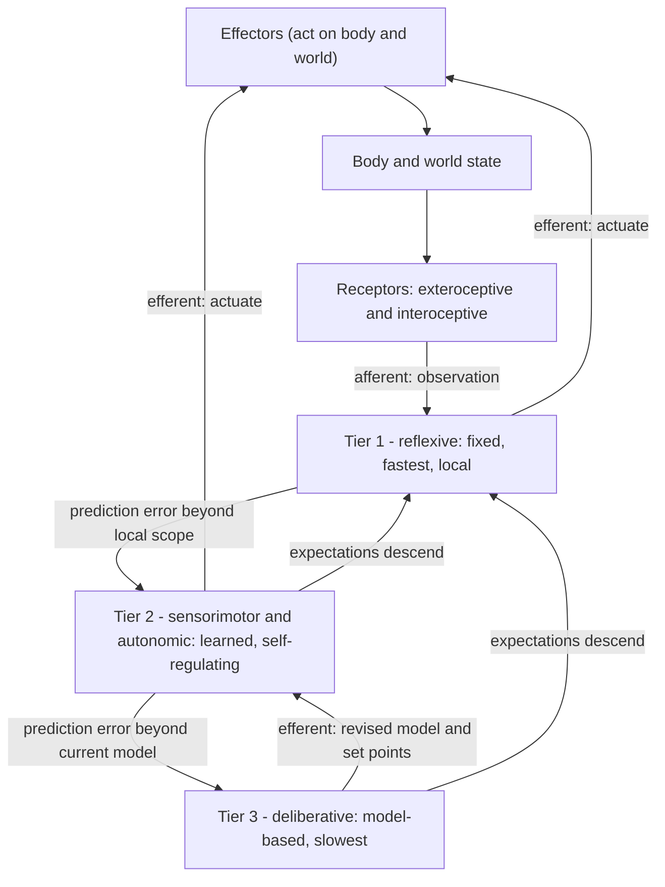
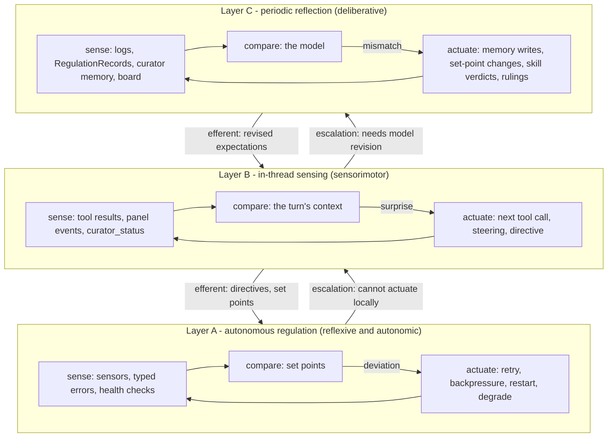

# Cybernetic Nervous System — Reference Model (Draft)

## 1. Purpose, scope, and status

This paper is the reference model for treating zed-kask's canonical loops
(`loop-register.md`, rows L1–L25) as a **three-layer cybernetic nervous
system**: every loop's state sensed, reported, and actuated through one
canonical pathway per layer, with the log carrying the delta between
expectation and observation — surprise, not raw activity — so feedback
cost scales with surprise.

**Scope boundary (held throughout).** The model describes the *abstract
structure of the mammal nervous system* — afferent/efferent pathways,
expectation vs. prediction-error signaling, and the
reflexive/sensorimotor/deliberative processing tiers. It is
**mammal-general, not human-specific** (no language, self-model, or
consciousness claims), and it is **structure, not brain internals** (no
anatomy beyond the tier abstraction; no claims about particular nuclei or
cortical areas). Where a cited source uses human evidence, the paper cites
it for the general principle, not the species-specific anatomy.

**Status.** **Admitted** to the project's reference-model set by operator
ruling 2026-09-30 ("proceed as proposed — confirmed"); §7 records the
ruling. Citations were resolved through research run `4b9a3b3ed05bf860`
(2026-09-30; 13 load-bearing sources verified, 0 resolution failures;
Powers 1973 is cited only through the resolved Mansell & Marken 2015
review).

## 2. The abstract structure

### 2.1 Afferent/efferent pathways

The nervous system's signaling is directionally disciplined. **Afferent**
(sensory) pathways carry observations from receptors — exteroceptive
(world) and interoceptive (body interior) — up toward integrating
structures; **efferent** (motor/autonomic) pathways carry actuation
commands down to effectors. Behavior that looks like a stimulus-response
pair is in fact a closed loop: the efferent arm changes the very state the
afferent arm observes (Shannon 1948's feedback-channel framing; Ashby
1956's basic feedback loop). The Thousand Brains Project frames the whole
of intelligence as one such loop repeated at scale: "all aspects of
intelligence are created by the same sensorimotor mechanism," implemented
in a repeating unit modeled on mammalian cortical columns (Clay,
Leadholm & Hawkins 2024, arXiv:2412.18354; Hawkins 2021).

### 2.2 Expectation vs. prediction-error signaling

The load a pathway carries is not the raw observation. In the predictive
processing account, the signal that matters is the **prediction error**:
the difference between what the system's model expected and what the
afferent arm observed (Clark 2013; Friston 2010). Expectations descend
from the model; only the residual — the surprise — needs to propagate.
Clark (2023) develops this as the "experience machine": a brain that
ceaselessly predicts its sensory streams and spends its bandwidth on the
departures. The body's interior runs the same economy: **allostasis** is
regulation by anticipatory adjustment — the system predicts its own
needs and pre-acts, rather than reacting to deviations after the fact
(Sterling 2012); interoceptive cortex predicts body signals on the same
predictive principles as exteroceptive cortex (Barrett & Simmons 2015).

The cybernetic literature formalized the same structure earlier and
independently: the **TOTE unit** (Test–Operate–Test–Exit) makes the
expectation an explicit stored reference — Test compares state against
it, Operate acts while the comparison fails, Exit rests when it passes
(Miller, Galanter & Pribram 1960). Control theory in psychology
generalized this into discrepancy-reducing feedback loops (Carver &
Scheier 1982; 2012), and perceptual control theory inverted the
causality — behavior exists to control perception against an internal
reference (Mansell & Marken 2015, reviewing the family including
Powers). Two properties recur across all of these:

1. **The expectation is stored** — a set point, reference, or model —
   not implicit in the actuation.
2. **The propagated signal is the delta** — error, discrepancy,
   prediction error — not the raw observation.

### 2.3 The three processing tiers

Mammalian feedback processing stratifies by latency, fixity, and scope
(Hawkins 2021; Sterling 2012; Clark 2023):

| Tier | Character | Speed | Change mechanism |
| --- | --- | --- | --- |
| Reflexive | fixed, local, hardwired arcs; no learning required | fastest | evolution (never revised in the animal) |
| Sensorimotor / autonomic | learned, self-regulating loops; homeostatic and allostatic control; skilled action | fast | practice (slowly tuned) |
| Deliberative | model-based; integrates many loops; plans and revises the model itself | slow | reflection (the model changes, which changes what the other tiers expect) |

Hawkins (2021) draws the mammal-general line precisely here: the
evolutionarily ancient structures implement fast, hardwired survival
behaviors, while the neocortex — uniform across mammals — is the
slow-learning, model-building organ whose output is *better predictions*,
not faster actions. Sterling (2012) places the body's autonomic economy
in the middle tier: anticipatory regulation that is self-running but
tunable by the slower tier's model of what is coming. Clark (2023) and
Friston (2010) make the tiering hierarchical in the predictive sense:
higher tiers send expectations down; lower tiers send prediction errors
up.

<!-- DIAGRAM_ALIGNMENT
id: DIAG-RES-CNS-001
verified_date: 2026-09-30
verified_against: arXiv:2412.18354 (Clay, Leadholm & Hawkins 2024 — the sensorimotor-loop and repeating-unit framing); Sterling (2012) Physiology & Behavior 106:5-15 (allostasis as predictive regulation)
reference_sources: Clark 2023; Hawkins 2021; Friston 2010
status: VERIFIED
-->

The two directions are the invariant skeleton: **observations flow up
(afferent), authority flows down (efferent)**, and each tier compares its
afferent input against the expectation handed down from the tier above
before deciding whether the signal stops there or escalates.

## 3. Mapping to zed-kask's layers A/B/C

The operator's fixed definitions (loop-register.md, Pass 3 header) map
one-to-one onto the three tiers:

| zed-kask layer | Nervous-system tier | Why |
| --- | --- | --- |
| **Layer A — autonomous regulation** (fast, deterministic, in-code: retries, degradation surfacing, backpressure, self-healing) | Reflexive + autonomic | Fixed-in-code arcs with stored references (set points) and local, bounded responses; the regulation loop is homeostatic by construction (`hkask-regulation/src/set_points.rs:439`; `loops/signals.rs:332-343` — `Deviation` is the stored-expectation delta) |
| **Layer B — in-thread sensing** (conscious, in-process; surfaced to agent/human inside the active thread) | Sensorimotor | The agent's turn is a sensorimotor loop: act (tool call), observe (result), adjust — within one ongoing interaction; the TBP's repeating sensorimotor unit (Clay et al. 2024) |
| **Layer C — periodic reflection** (curator + human reviewing logs and curator memory via therapy / algedonic-review) | Deliberative | Slow, model-revising; its output is a changed model (memories, set points, skill verdicts) that changes what A and B expect next |

### Named invariants of the mapping

These are the invariants Phase 3's gap table scores against. They are
properties of the *nervous system*, not of any one loop:

- **INV1 — one canonical pathway per layer.** Each layer has exactly one
  canonical sense → report → actuate pathway; every mechanism of that
  layer routes through it. (The mammal analogue: one afferent pathway per
  modality; the good-regulator theorem makes the pathway a model of the
  regulated system — Conant & Ashby 1970.)
- **INV2 — expectation carriage.** Every actuation carries an expectation
  (a stored reference: set point, predicted outcome, acceptance
  criterion), and the report records expectation, observation, and the
  delta — the TOTE's Test result (Miller et al. 1960), not just the
  Operate.
  *Scope (operator ruling 2026-10-01, closing the alignment plan's
  O3):* the invariant governs **actuation** — pathways acting against
  a stored reference. The fleet's scored loops hold it (L2's
  set-points, the Brier-scored priors, L22's digest, L24's
  predictions, and the board cards' deficit/threshold pair);
  event-record pathways (raw logs, tool traces, work-state cards) are
  afferent surfaces, not actuations, and stay expectation-free by
  design.
- **INV3 — surprise-gated reporting.** The report channel carries
  prediction error, not raw activity; exact steady state is coalesced
  with a counted liveness heartbeat. (Information argument in §4.)
- **INV4 — escalation, never silent drop.** A tier that cannot actuate a
  signal escalates it one tier up; no signal vanishes between tiers.
  (Prediction errors that exceed a tier's scope propagate upward —
  Clark 2013; the algedonic S1→S5 escalation is the in-tree shape,
  `hkask-regulation/src/algedonic.rs:68`.)
- **INV5 — model revision at the top.** The slow tier's efferent output
  is a revised model — set points, memories, skill verdicts — not a
  one-off action; Layer C changes what A and B expect (Hawkins 2021's
  cortex-as-model-organ; Sterling 2012's allostasis being *tuned by
  prediction*).
- **INV6 — afferent/efferent direction discipline.** Observations flow
  up, authority flows down; a pathway that mixes the two directions in
  one channel is a seam defect.

<!-- DIAGRAM_ALIGNMENT
id: DIAG-RES-CNS-002
verified_date: 2026-09-30
verified_against: kask/crates/hkask-regulation/src/cybernetics_loop/cycle.rs:305,:450 (Layer-A sense/actuate stages); crates/agent/src/tools/curator_tools.rs:57 (Layer-B curator_status); kask/crates/hkask-memory/src/memory_store.rs:288 (Layer-C store)
status: VERIFIED
-->

## 4. The expectation/surprise logging principle

**Principle.** Every actuation carries an expectation; the log records
the prediction-error delta. What the log carries is surprise, not raw
activity.

**Information-efficiency argument.** Shannon (1948) measures the
information an event carries as −log(1/p): an event that is fully
expected (p → 1) carries ~zero bits; a rare event carries many. A log
that records raw activity spends storage, bandwidth, and — decisively —
*reviewer attention* on zero-bit entries, in direct proportion to system
throughput. A log that records only prediction errors has volume
proportional to the mismatch between the system's model and the world —
exactly the bits the system needs in order to learn, and no others.
Friston (2010) gives the same economy its processing form: a system that
minimizes free energy is one whose states carry minimal surprise, and
the signals worth propagating are the residuals. In TOTE terms (Miller
et al. 1960): a log without the Test result cannot teach, because
nothing distinguishes the Operate that worked from the one that failed.

**Consequence for feedback cost.** Layer C's review cost (operator time,
curator attention, memory ingest) is bounded by the actual news, not by
the activity rate. A quiet system produces a quiet log; a mis-modelled
system produces a loud one — which is the correct diagnostic signal in
both directions.

**In-tree precedent (IS).** The regulation loop's loop-quality telemetry
coalescer already implements INV3 exactly: "Coalesce only semantically
identical persistent deviation/advisory cycles. Changed values, clearing,
and rollout measurements always emit" — exact repeats accumulate into a
suppressed count, and an hourly heartbeat re-announces liveness with
that count (`kask/crates/hkask-regulation/src/cybernetics_loop.rs:895-968`).
The algedonic binary-threshold escalation (`algedonic.rs:247+`) is the
coarser ancestor of the same gate. The gap the register records (Pass 3
premise verdict) is that this principle governs exactly one of the
twelve report pathways.

## 5. Citations (all resolved; research run `4b9a3b3ed05bf860`)

- Ashby, W. R. (1956). *An Introduction to Cybernetics*. Chapman & Hall,
  London.
- Barrett, L. F., & Simmons, W. K. (2015). Interoceptive predictions in
  the brain. *Nature Reviews Neuroscience*, 16, 419–429.
  doi:10.1038/nrn3950.
- Carver, C. S., & Scheier, M. F. (1982). Control theory: A useful
  conceptual framework for personality–social, clinical, and health
  psychology. *Psychological Bulletin*, 92(1), 111–135.
- Carver, C. S., & Scheier, M. F. (2012). Cybernetic control processes
  and the self-regulation of behavior. In *The Oxford Handbook of Human
  Motivation* (Oxford University Press).
- Clark, A. (2013). Whatever next? Predictive brains, situated agents,
  and the future of cognitive science. *Behavioral and Brain Sciences*,
  36(3), 181–204. doi:10.1017/S0140525X12000477.
- Clark, A. (2023). *The Experience Machine: How Our Minds Predict and
  Shape Reality*. Riverhead Books. (Title verified: "The Experience
  Machine" — the working name "expectation machine" is not the title.)
- Clay, V., Leadholm, N., & Hawkins, J. (2024). The Thousand Brains
  Project: A New Paradigm for Sensorimotor Intelligence. arXiv:2412.18354.
- Conant, R. C., & Ashby, W. R. (1970). Every good regulator of a system
  must be a model of that system. *International Journal of Systems
  Science*, 1(2), 89–97.
- Friston, K. (2010). The free-energy principle: a unified brain theory?
  *Nature Reviews Neuroscience*, 11, 127–138.
- Hawkins, J. (2021). *A Thousand Brains: A New Theory of Intelligence*.
  Basic Books.
- Hawkins, J., & Leadholm, N. (2025). The Thousand Brains Theory 2.0: An
  Extension for the Long-Range Connections of the Neocortical
  Heterarchy. arXiv:2507.05888.
- Mansell, W., & Marken, R. S. (2015). The Origins and Future of Control
  Theory in Psychology. *Review of General Psychology*, 19(4), 421–434.
  (Resolved secondary for the perceptual-control-theory family, including
  Powers 1973, which is cited only through this review.)
- Miller, G. A., Galanter, E., & Pribram, K. H. (1960). *Plans and the
  Structure of Behavior*. Henry Holt. (The TOTE model.)
- Shannon, C. E. (1948). A Mathematical Theory of Communication. *Bell
  System Technical Journal*, 27(3), 379–423; 27(4), 623–656.
- Sterling, P. (2012). Allostasis: A model of predictive regulation.
  *Physiology & Behavior*, 106, 5–15.

## 6. What this model is NOT

- Not a claim that zed-kask's loops are neurons or that crates map to
  brain regions — the tiers are latency/fixity/scope classes, and the
  mapping is functional, not anatomical.
- Not a proposal to add "expectation" fields to every log line by fiat —
  the Phase 1 naming survey (loop-register.md, Pass 3) found the existing
  vocabulary (`Sensor`, `set_point`, `Deviation`, `advisory`,
  `algedonic`, `RegulationRecord`), and code-facing names for the
  expectation-signal category are proposed only after that survey, in the
  alignment plan, under the deletion test.
- Not an audit verdict — the per-row alignment verdicts are recorded in
  the register (Pass 3 per-row blocks), not here.

## 7. Admission proposal (operator checkpoint)

Admitting this paper to the reference-model set is an operator decision.
If admitted, it would anchor:

1. **The register's layer taxonomy** — the A/B/C definitions and the
   INV1–INV6 invariants become the scoring rubric for every row's
   classification and gap verdict (Pass 3, D3).
2. **The reference-model anchor ledger** — rows currently recorded as
   GAP (L1, L3, L7, L8, L11, L12, L14, L15, L21, L23) would gain a
   shared structural anchor; row-specific anchors (L2's
   pragmatic-cybernetics, L9's kanban-board-reference-models, L17's
   scenario-planning, L19's portfolio-review, L22's spreadsheet plan)
   remain the finer-grained records this model complements, not replaces.
3. **The alignment plan's target condition** — "one canonical pathway
   per layer; every actuation carries an expectation; the log carries
   the delta" (Pass 4, D4) would trace to §3's invariants rather than to
   an unanchored aspiration.
4. **Future code-facing naming** — the expectation-signal category's
   name would be chosen against the surveyed vocabulary, with this model
   as the concept's definition.

Requested ruling: admit as-is, admit with amendments, or keep as an
unanchored draft (the register's gap table then continues to record the
absence per its no-invented-anchors rule).

**Ruling (2026-09-30): ADMITTED as-is** ("proceed as proposed —
confirmed"). The model now anchors the register's layer taxonomy and
INV1–INV6 scoring (`loop-register.md` Pass 3), the alignment plan's
target condition, and the expectation-signal category's definition for
future code-facing naming. The pass-2 anchor ledger's GAP rows gain
this shared structural anchor alongside their row-specific records.
