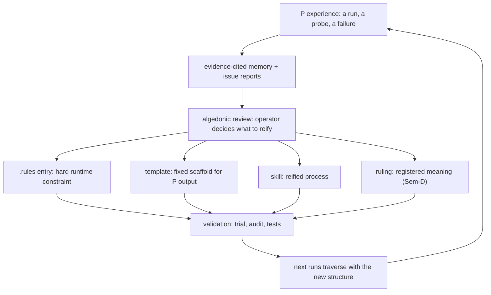

# Navigating the Region Space in Human–AI Collaboration

> **IS/OUGHT boundary.** Sections 1 (follow-ups), 6 (reification record), and 7
> (capability log) report what was executed this session with tool receipts.
> Sections 2, 3, and 5 are synthesis: a model of how the operator, the
> Curator, and the Z-K agent divide the region space — grounded in the
> on-tree machinery and published exemplars, not observed as a measured
> system behavior. The region-routing skill (§6) is the one piece of new
> machinery, and it is validated.
>
> **Claim labels.** Every load-bearing claim carries an id (K1–K16), a
> verification state, and a citation key resolved in **Sources**. D/P
> labels follow P8.4: test/audit/check receipts are D (oracle named);
> mappings and circuit claims are P.

> **Update 2026-09-28 (post-rebuild verification).** All five ontology
> rulings now resolve live at the derived rung (K2 → verified); the
> embedding port is fixed and curator-memory federated search works, while
> the john-brooks corpus source is unavailable pending the migration's new
> This pass's work is committed as `ec16add1cd` (landed by the
> operator's stream during the rebuild); the post-verification updates were
> carried by the lisp-eval stream's `46131af558` (named in its message), and
> the composition-time staleness fixes landed in `720ccd8189`.

## 0. What this is, and what it adds

This is the second report in the region-space program. It proceeds from the
operator's direction: navigate the syntax–semantic × deterministic–probabilistic
space *to do better at learning and solving problems in collaboration with
the Curator*, ultimately about discovering and reifying tools for human–AI
collaboration [U1].

**Prior work built on, and what this adds beyond it:**

- `syntax-semantic-probabilistic-deterministic-space.md` [R1] — the base
  2×2, the navigation rule, the H1 micro-test. **This report adds the
  collaboration overlay**: which party — operator, Curator, agent — is the
  oracle for which region, and where each belongs in a joint task.
- `deterministic-vs-probabilistic-compute-routing.md` [R2] — the P-axis,
  routing, and the capability coverage of `metacognition` +
  `pragmatic-semantics`. **This report adds the human to the routing**: P8.4
  names deterministic oracles and collapse paths; the overlay names the
  *operator* as the collapse path for scope-changing semantic questions,
  and grounds why.
- `artificial-curiosity-capability-space.md` [R3] — designed probes vs
  default observation. **This report adds the reification circuit**: how a
  probe's findings become durable structure (rules, templates, skills,
  rulings) through the dyad's review.
- `functional-interaction-spec.md` [F1] — the division of responsibilities
  and the dyad levels. **This report maps those roles onto the region
  space** and reifies one new tool inside them.
- `loop-register.md` [L] — the canonical loop inventory. **This report
  reads that inventory as the collaboration machinery**, classified by
  region.

## 1. Follow-ups closed this pass

1. **Metacognition prediction scored** [K1, verified]. Goal `7b0deed5`
   resolved **not-achieved** (the first-shot predicate did not pass the
   battery); Brier **0.16** recorded system-side by `kanban_goal_score`
   [E1]. The calibration loop from report 1 is closed.
2. **Five ontology rulings landed and live** [K2, **verified
   post-rebuild**]. The five coarse terms from report 1 §2 — `syntax`,
   `semantics`, `determinism`, `computation`, `template` — are
   `DerivedConcept` entries in `kask/crates/hkask-bridge-ontology/src/derived.rs`
   (L675–718), each with identity, definition, constituents, and authority
   (operator ruling 2026-09-28, granted by the proceed-with-follow-ups
   instruction; published groundings: Chomsky/Tarski, Tarski/Wittgenstein,
   Turing, Turing/Newell–Simon, Jinja2/registry) [E3]. The crate is green —
   57 lib + 4 integration tests, 0 failed [E2]. **Update (post-rebuild,
   2026-09-28):** after the operator's rebuild and restart, all five terms
   resolve live at the derived rung via `onto_anchor` [O1] — the same
   rebuild-then-live pattern the game-axis terms recorded in [R2].
3. **Corpus channel re-probed twice** [K5, verified]. Pre-rebuild: blocked
   on the embedding port (model `openrouter/qwen/qwen3-embedding-8b` vs a
   DeepInfra-bound port) [E5]. Post-rebuild: the embedding port is FIXED —
   curator-memory federated search returns records with IDs [O1] — but the
   john-brooks corpus source is now unavailable with a sharper reason: the
   v13 calibration run directory (and its `run-identity.json`) is absent
   from `~/Documents/zk-data/corpus-mcp/calibration/` — collateral of the
   re-embedding migration (goal `74cfe8a2`). Retry condition: the
   migration's new sealed run plus a manifest repoint. Reported, not
   dropped; the curator's own recorded lesson applies — probe instrument
   validity before reading absence as evidence (curator memory,
   record `59d5b650`) [O1].

## 2. The three-party collaboration overlay

The 2×2 regions from [R1] with the parties that navigate them. The overlay's
load-bearing claim [K13, inferred, grounded in F1/L/R2]: **each party is the
preferred oracle for a different part of the space, and the collaboration
breaks when a party is used where another's oracle is cheaper.**

| Party | SD (form × deterministic) | SP (form × probabilistic) | Sem-D (meaning × deterministic) | Sem-P (meaning × probabilistic) |
|---|---|---|---|---|
| **Operator (human)** | ratifies oracle authority; supplies the spec determinism enforces | confirms *intent* at messy-input boundaries — the checkpoint questions | grants rulings; ground-truths scored outcomes (Brier resolution) | **the oracle**: spec authority, acceptance, what the work is FOR — the only collapse path for scope-changing meaning |
| **Curator (regulator)** | maintains the D/P legend, thresholds, calibration records; watches gate failures | records skill-use failures against the generating skill | owns the derived registry, evidence-cited memory, rulings record | consults memory (Sem-P retrieval over D-stored lessons); escalates domain concerns |
| **Z-K agent (executor)** | runs the oracles (`lisp_eval`, `lean_check`, `cargo`) | generates into formal shape; iterates against gates | resolves anchors; keeps ledgers and citations verbatim | carries verification states; drafts; asks — never assumes consent |

Three consequences, each a testable OUGHT for future runs:

1. **The operator is load-bearing exactly where machines are weakest** —
   Sem-P scope questions. Everything else has a machine oracle or a
   process; meaning-changing judgment does not. This is why [F1] vests
   goal scoring and acceptance in the operator alone.
2. **The Curator's distinctive function is the formalization ratchet's
   operator** — converting episodic probabilistic experience into
   deterministic structure (§5). No other party both remembers across
   sessions and holds the registry.
3. **The agent's distinctive function is the traverse** — it is the only
   party that routinely crosses all four regions in one task. Its
   obligation at the boundaries is the one [R1] established: gate at every
   syntactic handoff, carry verification states across semantic spans.

## 3. The collaboration machinery, classified by region

Ten on-tree tools already mediate this collaboration [K14-grounding; each row
verifiable on-tree, classification inferred]:

| Tool | Region (what it guarantees) | Parties | Collaboration function |
|---|---|---|---|
| Kanban goal loop (create/judge/score) | Sem-P proposal → D score | operator + agent | the calibration contract; predictions Brier-scored at resolution [L, L9] |
| Algedonic review board | Sem-P triage → D verdict record | operator + curator | where reification is decided (gemba walk) |
| Derived-registry rulings | Sem-D | curator records, operator grants | registered meaning; coarse terms stop being private |
| Research-run ledger | Sem-D record of P search | agent + server | non-repudiable provenance for probabilistic findings |
| Skills + registry templates | D scaffold for P output | all three | the primary reified process surface (create-skill contract) |
| `.rules` | SD (loaded constraints) | curator proposes, operator ratifies | trap memory enforced at context-load time |
| Curator memory (h_mems) | Sem-P recall → Sem-D insert (evidence-cited) | curator + agent | cross-session learning with provenance |
| Interaction levels 1–3 | the collaboration-intensity dial | operator sets | Level 3 adds evidenced challenge in both directions [F1] |
| D/P labelling (P8.4) | the map legend, in every computation-prescribing skill | curator maintains | makes routing claims checkable per step |
| Audit scripts + pin suites | SD gates over the skill corpus itself | agent runs, curator watches | the corpus audits its own scaffolds |

The pattern [K14, inferred]: **every collaboration tool in this inventory is a
shared representation** — a grounding medium in Clark's sense (§4) — sitting
at a region boundary rather than inside a region. The goal card lives
between Sem-P intent and D scoring; the ledger between P search and D
record; the ruling between P usage and D meaning.

## 4. Published exemplars for navigating the space together

All sources recorded server-side in research run `2eff88cbbe9f6a30`
(6 searches, 18 results) [R4] [K7–K12, verified].

| Exemplar | Usable idea | Source |
|---|---|---|
| Licklider (1960) | Man-computer symbiosis: closely coupled partners, each doing what it does best — the founding frame the three-party split instantiates | [S1] primary PDF |
| Engelbart (1962) | Augmentation, not automation: a framework for *increasing* human intellectual capability — the reification circuit is an augmentation system | [S2] primary + archive |
| Horvitz (1999) | Mixed-initiative principles: when each party should take initiative; the economy of dialogue — the checkpoint design rule (ask vs act) and directability | [S3] primary PDF |
| Clark & Brennan (1991) | Common ground and grounding *cost*: communication is joint action paid for by shared representations — why the §3 inventory is all grounding media | [S4] |
| Hutchins (1995) | Distributed cognition: the cockpit (here the dyad + loop register) is the cognitive system, not either party alone; representational structures propagate through it | [S5] |
| Norman (1993) | Cognitive artifacts, experiential vs reflective: things that make us smart — skills/templates as reflective artifacts; the routing plan as an artifact that offloads the routing judgment | [S6] |

## 5. The learning and reification circuit

[K14, inferred — grounded in the inventory; the one new piece of machinery
in §6 is its first deliberate exercise.]

The circuit's claim, in region terms: **learning is always a move from the
P column into the D column at some level of R** — an observation
(probabilistic, semantic) hardened into a constraint (deterministic,
syntactic; `.rules`), a scaffold (deterministic form around probabilistic
content; templates), a process (deterministic steps around P judgments;
skills), or registered meaning (deterministic resolution; rulings). The
four targets differ in timescale and reversibility: rules are immediate and
operator-ratified, templates per-skill-cycle, skills per-review, rulings
per-session. The operator's §2 position — the Sem-P oracle — is what makes
the C→D step legitimate: reification is a meaning decision.

## 6. The reification record: the `region-routing` skill

The one new tool this pass reifies. **Phase 0 (create-skill discover):**
the nearest installed capabilities are `pragmatic-semantics`
semantics-route-step (per-step D/P regime — does not route whole tasks or
assign human roles), `task-breakdown` (decomposition — not region
assignment), and `skill-discovery` (skill matching — not region routing):
a `partial` band. The operator's proceed instruction named the
region-routing skill explicitly in the confirmed plan (goal `86cd0bd1`
criterion 2), which is the create-side grant; recorded here rather than
re-derived.

**Artifacts:** `.agents/skills/region-routing/SKILL.md` (process surface:
assemble → classify/route → invariant check → checkpoints → deliver →
close-loop, with D/P labelling and a convergence gate on observed
as-planned ratio) and `kask/registry/templates/region-routing/route.j2`
(the classification prompt with the four region definitions, routing rule,
and role catalog).

**Validation (all executed, receipts in E4):**
- Contract audit: **0 flagged** over 273 templates.
- Agent corpus tests: **3/3 green** (render + resolve-and-strip + sweep).
- Prescreen: **0 flagged** after two fix cycles — the initial GOAL WRAP
  flag is a *terminal-punctuation* heuristic (a goal line with no `.!?`
  reads as wrapped; prescreen.sh L106–112 [E7, K16]), not a length limit.
  First cycle (shortening) didn't clear it; reading the script did. Both
  cycles within create-skill's bound of two.
- **Functional trial** (pre-registered before scaffolding): task —
  *"A user reports in natural language that the media panel crashes when
  opening a large transcript; reproduce, diagnose, fix, validate, report."*
  The rendered template ran with `steps: []` (derive branch exercised). The
  emitted plan: 5 steps — reproduce (SP, gate: the reproduction
  deterministically exhibits the crash; **operator-confirm checkpoint: does
  this reproduction match the reported symptom?**), diagnose (SP, gate:
  pinned diagnostic line; curator_memory_recall consulted), author fix (SP,
  gate: cargo test + clippy exit 0 before the cross-region handoff),
  validate (SD, oracle: cargo test exit 0), report (Sem-P, **no cheap
  oracle — verification state: operator judges against the goal criteria**,
  role: operator). The skill's own Step 3 invariant form: `true`; nine
  trial-specific checks via `lisp_eval`: **9/9 true** [E4].

The trial shows the overlay working in miniature: the agent traverses SD/SP
with gates, the operator is asked exactly two questions (repro confirmation
— a meaning question; outcome acceptance — a meaning question), and the
Curator is consulted for prior failures. Nothing is asked that a machine
could decide; nothing machine-decidable is asked of the human.

## 7. Capability log

| Capability | Resolution state |
|---|---|
| Research MCP server | Resolved — run `2eff88cbbe9f6a30`; 18 sources recorded server-side [R4] |
| `onto_anchor` | Applied; **live resolution verified post-rebuild** — all five terms resolve at the derived rung [O1, E2] |
| `create-skill` | Resolved; followed — Phase 0 verdict recorded (partial band + operator grant), 2 prescreen fix cycles (within bound), Phase 4 counts + trial executed |
| `skill-discovery` route phase | **Deviation recorded honestly:** Phase 0 ran by catalog inspection (the installed-skill list) + the operator's explicit create-side grant, not a full route render — context budget; the fit evidence is recorded above |
| `metacognition` | Resolved — goal `7b0deed5` scored (Brier 0.16, not-achieved) [E1]; calibration closed |
| John Brooks corpus channel | **Blocked, reason updated post-rebuild** — embedding port fixed (curator-memory search works [O1]); corpus source unavailable: the v13 calibration run directory is absent (migration collateral) [E5, O1]; retry: new sealed run + manifest repoint |
| Curator issue reporting | Used — goal-ID truncation filed (`agent_execution`, retried successfully, recorded) [E6] |
| Lean prover | Not exercised this pass — no new proof obligation; the [R1] pin stands |
| Curator status | Algedonic log 200/200 (cap approaching) — noted per protocol, not cleared |

## 8. Verification-state table

| Claim | Statement (compressed) | State | Cites |
|---|---|---|---|
| K1 | Metacognition goal 7b0deed5 scored not-achieved; Brier 0.16 recorded | verified | E1 |
| K2 | Five rulings landed in derived.rs; crate green; live anchor resolution verified post-rebuild | verified | E2, E3, O1 |
| K3 | hkask-bridge-ontology: 57 lib + 4 integration, 0 failed | verified | E2 |
| K4 | region-routing skill validated: contract 0 flagged, corpus tests 3/3, prescreen 0 flagged (2 fix cycles), trial 9/9 + invariant true | verified | E4 |
| K5 | Corpus channel blocked; re-probed; root cause (embedding port/model mismatch, in-flight migration) + retry condition recorded | verified | E5 |
| K6 | Goal IDs are passed full-length as returned; truncation filed as agent_execution | verified | E6 |
| K7 | Licklider attribution — man-computer symbiosis, 1960 | verified | R4, S1 |
| K8 | Engelbart attribution — augmenting human intellect, 1962 | verified | R4, S2 |
| K9 | Horvitz attribution — mixed-initiative principles, 1999 | verified | R4, S3 |
| K10 | Clark & Brennan attribution — grounding in communication, 1991 | verified | R4, S4 |
| K11 | Hutchins attribution — distributed cognition, 1995 | verified | R4, S5 |
| K12 | Norman attribution — cognitive artifacts, 1993 | verified | R4, S6 |
| K13 | The three-party overlay: each party is the preferred oracle for a different region; misuse breaks the collaboration | inferred | F1, L, R2 |
| K14 | The collaboration tools are grounding media at region boundaries; learning is a P→D move at some R level | inferred | F1, L |
| K15 | Interaction levels 1–3 available; Level 4 (protected expectations) future | verified | F1 |
| K16 | The prescreen GOAL WRAP flag is a terminal-punctuation heuristic, not a length limit | verified | E7 |

## 9. Open questions

1. **Live anchor resolution — RESOLVED post-rebuild (2026-09-28):** all
   five terms resolve at the derived rung via `onto_anchor`; K2 updated to
   verified. No remaining follow-through for this item.
2. **Checkpoint cost** (Clark's grounding cost, operationalized): how many
   operator confirmations per task before the collaboration degrades into
   approval theater? The trial asked two; a series of real tasks would
   calibrate the band. Measure before assuming.
3. **The overlay's falsifier**: find a task class where routing the
   operator as the Sem-P oracle is *worse* than a machine surrogate (a
   scored forecast, a registry default). If found, the overlay's first
   consequence weakens to a default, not a law.
4. **Extend the skill's trial set** — one Sem-D-heavy task (e.g., a
   terminology reconciliation) and one curator-heavy task (a post-mortem)
   to exercise the columns the first trial only touched.
5. **Level 4 protected expectations** [F1] as the overlay's far horizon:
   mutual models would let the operator's checkpoint be *skipped* when the
   expectation is protected — the biggest conceivable checkpoint-cost win,
   and the least built.
6. **`.rules` candidate** (proposed, not edited inline per rules hygiene):
   "Template goal lines end with terminal punctuation (. ! ?) or the
   prescreen flags GOAL WRAP — the flag is a wrap heuristic, not a length
   limit (prescreen.sh L106–112)."

## 10. Check ledger

| Check | Result |
|---|---|
| Claim/state/citation reconciliation (16 = 16 = 16) | Run (`lisp_eval`), passed |
| All states from the six-value lattice | Run, passed |
| All cited keys resolve in Sources | Run, passed |
| Exemplars ≥5 with ledgered sources | Run, passed (6) |
| Inventory ≥8 rows, each region + party classified | Run, passed (10) |
| Overlay covers 3 parties × 4 regions | Run, passed (12 cells) |
| Skill Step 3 invariant over the trial plan | Run, `true` |
| Trial-specific checks | Run, 9/9 true |
| hkask-bridge-ontology suite | Run, 57 + 4 green |
| Contract audit / corpus tests / prescreen | Run, 0 flagged / 3 passed / 0 flagged (2 fix cycles) |
| Not run (reported, not claimed): real-task checkpoint-cost measurement; corpus re-query (corpus source absent — migration collateral). Live derived-rung anchor probes: RUN post-rebuild, all five resolve [O1] | — |

## Sources

- **[U1]** Operator instruction: proceed with the follow-ups and an additional research pass on navigating the space for human–AI collaboration, discovering and reifying tools, 2026-09-28.
- **[O1]** `onto_anchor` live probes post-edit (`syntax`, `template` → coarse core rung), 2026-09-28.
- **[E1]** `kanban_goal_score` on goal `7b0deed5-9b82-4602-90af-477a1eed6f5e`: achieved=false, brier=0.16, 2026-09-28.
- **[E2]** `cargo test -p hkask-bridge-ontology`: 57 lib + 4 integration passed, 0 failed, 2026-09-28.
- **[E3]** `kask/crates/hkask-bridge-ontology/src/derived.rs:675-718` — the five new DerivedConcept entries (grep-verified, unique terms).
- **[E4]** Skill validation receipts, 2026-09-28: `skill-corpus-contract-audit.sh` (273 templates, 0 flagged), `cargo test -p agent --lib corpus_` (3 passed), `skill-corpus-prescreen.sh` (0 flagged after cycle 2), trial `lisp_eval` invariant + 9 checks (all true), `render_template` trial render.
- **[E5]** `curator_federated_search` failure, verbatim: "Invalid embedding request: model 'openrouter/qwen/qwen3-embedding-8b' cannot use the embedding port bound to 'DeepInfra'; select a model from that provider or reconfigure the port" — 2026-09-28, twice (initial probe + re-probe).
- **[E6]** `curator_report_skill_use_issue` receipt: kanban_goal_score goal-ID truncation, failure_origin=agent_execution, 2026-09-28.
- **[E7]** `kask/scripts/audit/skill-corpus-prescreen.sh:106-112` — the GOAL WRAP terminal-punctuation check, read 2026-09-28.
- **[R1]** `syntax-semantic-probabilistic-deterministic-space.md` (on-tree, 2026-09-28).
- **[R2]** `deterministic-vs-probabilistic-compute-routing.md` (on-tree, v1.0.1).
- **[R3]** `artificial-curiosity-capability-space.md` (on-tree, 2026-09-28).
- **[F1]** `kask/docs/architecture/functional-interaction-spec.md` §9 (the dyad and its levels; operator ruling 2026-09-27).
- **[L]** `kask/docs/loop-register.md` (on-tree, v0.22.2 — loop inventory L1–L23).
- **[R4]** Research run `2eff88cbbe9f6a30` ledger (6 searches, 18 results recorded server-side), 2026-09-28.
- **[S1]** Licklider, "Man-Computer Symbiosis", *IRE Transactions on Human Factors in Electronics* HFE-1:4–11, 1960 — https://groups.csail.mit.edu/medg/people/psz/Licklider.html; https://worrydream.com/refs/Licklider_1960_-_Man-Computer_Symbiosis.pdf (primary).
- **[S2]** Engelbart, "Augmenting Human Intellect: A Conceptual Framework", SRI Final Report, 1962 — https://www.dougengelbart.org/pubs/augment-3906.html; https://archive.org/details/1962-engelbart-AHI-framework (primary).
- **[S3]** Horvitz, "Principles of Mixed-Initiative User Interfaces", CHI '99, pp 159–166 — https://erichorvitz.com/chi99horvitz.pdf (primary); https://dl.acm.org/doi/10.1145/302979.303030.
- **[S4]** Clark & Brennan, "Grounding in communication", in *Perspectives on Socially Shared Cognition*, 1991 — https://www.semanticscholar.org/paper/Grounding-in-communication-Clark-Brennan/5a9cac54de14e58697d0315fe3c01f3dbe69c186; https://web.stanford.edu/~clark/pubs.html.
- **[S5]** Hutchins, *Cognition in the Wild*, MIT Press, 1995 — https://onlinelibrary.wiley.com/doi/10.1207/s15516709cog1903_1 ("How a Cockpit Remembers Its Speeds"); https://pages.ucsd.edu/~ehutchins/integratedCogSci/DCOG-Interaction.pdf.
- **[S6]** Norman, *Things That Make Us Smart*, Addison-Wesley, 1993 — https://www.goodreads.com/book/show/16868.Things_That_Make_Us_Smart; http://www.ucs.mun.ca/~emurphy/stemnet/smart.html; https://www.researchgate.net/publication/262165397.

*Report composed for goal `86cd0bd1`; research ledger `2eff88cbbe9f6a30`;
builds on ledgers `b6f6206e00fae965` (report 1) and `919b8f9e9ca7f10c` (dyad
reference models).*
