# Manifest Executor Architecture Review — Systems/Kernel Programmer Lens

**Mode:** `fix_mode: none` (review-only)
**Date:** 2026-08-08
**Reviewer:** Zed coding agent (GLM 5.2), applying `refactor-architecture` + 6 perspective-rotation skills
**Target:** `kask/crates/hkask-templates/src/executor.rs` (the `ManifestExecutor`)

---

## 1. Target Summary

| Artifact | Location | Lines |
|---|---|---|
| `ManifestExecutor` struct + impl | `kask/crates/hkask-templates/src/executor.rs:128-1799` | ~1670 |
| `extract_final_step_result` (templates) | `kask/crates/hkask-templates/src/executor.rs:1886-1907` | 22 |
| `extract_final_step_result` (bridge) | `kask/crates/kask_bridge/src/skill_executor.rs:848-857` | 10 (delegates to templates) |
| Supporting: `convergence.rs` | `kask/crates/hkask-templates/src/convergence.rs` | 1167 |
| Supporting: `budget.rs` | `kask/crates/hkask-templates/src/budget.rs` | 390 |
| Supporting: `condition.rs` | `kask/crates/hkask-templates/src/condition.rs` | 273 |
| Supporting: `input_mapping.rs` | `kask/crates/hkask-templates/src/input_mapping.rs` | 100 |
| Supporting: `output_schema.rs` | `kask/crates/hkask-templates/src/output_schema.rs` | 454 |
| Supporting: `template_renderer.rs` | `kask/crates/hkask-templates/src/template_renderer.rs` | 445 |

**Public surface of `executor.rs` (7 items — at the deep-module limit):**
1. `pub struct ManifestExecutor` (L128)
2. `pub fn new` (L170)
3. `pub fn with_terminal_check` (L198)
4. `pub fn with_template_base_path` (L206)
5. `pub fn with_runtime_policy` (L217)
6. `pub async fn execute_manifest` (L467)
7. `pub fn extract_final_step_result` (L1886)

**Verification of `.rules` convention priors** (per "Convention priors drawn from `.rules` must be verified against the codebase"):
- ✅ `ManifestExecutor::execute_manifest` exists and returns `HashMap<String, Value>` (L467-474).
- ✅ `extract_final_step_result` exists in both `kask_bridge/src/skill_executor.rs:848` and `hkask-templates/src/executor.rs:1886`. The bridge version delegates to the templates version (L849: `hkask_templates::extract_final_step_result(result)`). Both use ordinal-keyed extraction, not `HashMap::values().last()`.
- ✅ The ordinal-keyed selector (`extract_final_step_entry`, L1896) parses `step_N_result` keys and picks `max_by_key(ordinal)`. The `.rules` trap is mitigated.

**Mechanical validation:**
- `./script/clippy -p hkask-templates` → clean (no warnings).
- `cargo machete` → no unused deps.
- Lib root (`hkask_templates.rs`) compiles clean. Individual-file diagnostics on `executor.rs` (L440, L573) are **stale** per `.rules` "Stale diagnostics after bulk edits" — the lib root is authoritative and shows no errors.

---

## 2. Hot-Path Diagram — Per-Step Execution

The per-step hot path is the inner `while step_idx < steps.len()` loop in `run_cascade` (L553-945). Every step invocation traverses:

```mermaid
flowchart TD
    A[step_idx &lt; steps.len?] --> B[Read step = steps&#91;step_idx&#93;]
    B --> C{condition?}
    C -- Some --> C1[Render &#123;&#123; &#125;&#125; if present]
    C1 --> C2[evaluate_step_condition]
    C2 -- false --> Z[step_idx += 1, continue]
    C -- None --> D
    C2 -- true --> D{profile?}
    D -- Some --> D1[terminal_check or discover_tools]
    D1 -- terminal available --> FAIL[return Err]
    D -- None --> E
    D1 -- no terminal --> E
    E{action} --> F[dispatch: select/populate/execute/compute/render/flowdef/choice/loop/abort/escalate]
    F --> G[Track last_result_ordinal for result-emitting actions]
    G --> H{action == select AND template_ref?}
    H -- yes --> H1[extract_feedback_phase + emit reg.skill span]
    H -- no --> I{branching?}
    I -- yes --> I1[Read routing field, jump to target ordinal]
    I -- no --> Z
    I1 -- jump --> J[step_idx = pos, continue]
```

**Operations on the hot path that are justified (every invocation):**
- Step read (`&steps[step_idx]`) — borrow, no clone. ✅
- `info!` span emission (`reg.skill.cascade.step_executed`) — structured tracing, fast path when disabled. ✅
- Condition render + evaluate — only if `step.condition` is `Some`. ✅
- Profile/terminal check — only if `step.profile` is `Some` (0 manifests declare it). ✅
- `extract_feedback_phase` substring scan — only for `select` steps with `template_ref`, after the LLM round-trip (negligible cost). ✅
- `branching` routing — only if `step.branching` is `Some` (12 manifests). ✅

**Operations on the hot path that are NOT on every invocation (conditional):**
- `taint_labels` lock — only on `loop` (snapshot), `execute_tool_invoke` (Source label), `execute_flowdef` (label copy), `check_untrusted_input` (read). Not on every step. ✅

**Verdict:** The hot path is minimal. No unjustified per-step work found. The LLM round-trip in `select` dominates every other operation by 3-4 orders of magnitude.

---

## 3. Findings by Perspective

### 3.1 Essentialist (Gate 1-3 deletion test)

Applied to every module/struct/trait/function in the executor.

#### `ManifestExecutor` struct (L128-161)
- **G1 (Exist):** Behavior IS lost on deletion — the cascade orchestration, taint propagation, profile gate, and budget threading all live here. Complexity would reappear in callers. **PASS.**
- **G2 (Surface):** 7 public items (at the limit). Each earns its keep: `new` (construct), 3 builders (terminal/template/policy wiring — optional, cannot be constructor args because they're `Option`), `execute_manifest` (entry), `extract_final_step_result` (free fn, used by bridge). **PASS.**
- **G3 (Contract):** No single-use traits, no pass-through wrappers. `taint_labels: Arc<Mutex<...>>` is load-bearing for `Send + Sync` (see §3.2). **PASS.**
- **Verdict: KEEP.**

#### `evaluate_choice` (L1188-1251)
- **G1 (Exist):** The `choice` action is declared in the canonical action set (skill-maintenance SKILL.md). But: (a) only 1 manifest uses `action: choice` (`replica-discovery.yaml`), (b) that manifest's `choices:` field is silently dropped by serde (`BundleManifestStep` has no `choices` field — verified `kask/crates/hkask-templates/src/bundle/manifest.rs`), (c) `evaluate_choice` reads `input_mapping.branches` which no manifest populates (grep `branches:` in `kask/registry/manifests/` → 0 hits). So `evaluate_choice` is **dead production code** — its only manifest caller is malformed and silently no-ops.
- **G2 (Surface):** Private fn, 1 caller (the `"choice"` match arm at L677). Not a public surface concern.
- **G3 (Contract):** The `"abort" | "escalate"` branch returns `Ok(None)` with comment "Handled by subsequent abort/escalate step; return None to continue" — an advertised contract (the `choice` action can route to abort/escalate) with **no enforcement point**. The function silently falls through.
- **Verdict: MERGE / WARN.** The `choice` action is a contract primitive (documented in the canonical action set), so deleting it would break the advertised contract. But the executor silently accepts a malformed `choice` step (no `branches` in `input_mapping`) and returns `Ok(None)` — a "fails open with no diagnostic" trap (per `.rules`). **Recommendation: emit a `warn!` when a `choice` step has no `branches` in its `input_mapping`, mirroring the `branching` misconfiguration warn at L1043.** Do not delete `evaluate_choice` — it's a contract primitive with a broken caller, not dead by intent.

#### `ConvergenceTracker` methods: `push_kata_cycle`, `push_signal`, `signal_history`, `brier_history` (convergence.rs L208-227, L193-198)
- **G1 (Exist):** Grep across `kask/crates/` excluding `convergence.rs` and tests: **zero production callers**. Only test callers in `kask/crates/hkask-templates/tests/executor_properties.rs`. `push_cycle_from_context` (the production path, L229) inlines the logic of `push_kata_cycle`/`push_signal` rather than calling them.
- **G2 (Surface):** `ConvergenceTracker` has 16 public methods — over the ≤7 deep-module limit. But 4 of them (`push_kata_cycle`, `push_signal`, `signal_history`, `brier_history`) are test-only surface.
- **G3 (Contract):** Per `.rules` "Convention helpers with only test callers are dead code": these are dead production surface. The convention (Kata trajectory history) is pinned by tests but not load-bearing in production.
- **Verdict: MERGE.** Two options: (a) have `push_cycle_from_context` call `push_kata_cycle`/`push_signal` so they become production-load-bearing, or (b) mark `#[allow(dead_code)]` with a doc note "test-only; production path is `push_cycle_from_context`". Option (a) is cleaner — it removes the duplication between `push_cycle_from_context` and the test-only methods.

#### `escalate` action (L651-672)
- **G1 (Exist):** 0 manifests use `action: escalate` as a step action (grep `action: escalate` in `kask/registry/manifests/` → 0). But `escalate` is a documented canonical action (skill-maintenance SKILL.md "Canonical Action Set") and the `on_not_reached: escalate` config field triggers the same `ConvergenceStatus::Escalated` path. The step action is a contract primitive.
- **Verdict: KEEP.** Contract primitive, not dead by intent. Removing it would break the advertised action set.

#### `extract_feedback_phase` (L74-103), `spotlight_tool_output` (L1937-1943), `parse_json_response` (L1913-1928), `extract_final_step_entry` (L1896-1907)
- **G1-G3:** All private free functions, each with a single internal caller, each encoding genuine logic (not pass-through). `extract_final_step_entry` is the ordinal-keyed selector behind the public `extract_final_step_result` — factored out so the taint-label copy in `execute_flowdef` (L1639) can reuse the ordinal parse without re-implementing it (the `.rules` trap this guards against).
- **Verdict: KEEP all.**

#### `taint_labels: Arc<std::sync::Mutex<HashMap<String, ToolTaint>>>` (L151)
- **G1:** The `Mutex` is not protecting against concurrent access in practice — `run_cascade` is `&self` and the recursive `execute_flowdef` call is awaited (not spawned), so there's no concurrent access from a single task. No `tokio::spawn` of `run_cascade` exists (grep confirmed).
- **G3:** BUT — `ManifestExecutor` is moved into a `tokio::spawn` by the bridge (`kask/crates/kask_bridge/src/skill_executor.rs:199`), so `ManifestExecutor` must be `Send + Sync`. The `Arc<Mutex<...>>` provides `Sync`. A `RefCell` would break `Send`. The `Mutex` is load-bearing for the trait bound, not for actual contention.
- **Verdict: KEEP.** The `Mutex` is justified by `Send + Sync`, not by contention. Not removable. The `unwrap_or_else(|e| e.into_inner())` poison recovery is the sanctioned pattern (not `unwrap()`).

**Essentialism score:** 2 units with reduction potential out of ~12 reviewed = ~17% (minor reduction). The executor is **already close to minimal**. The two reductions (`evaluate_choice` warn, `ConvergenceTracker` test-only methods) are surface-area trims, not structural.

---

### 3.2 Idiomatic-Rust (Hoare principles, compiler/clippy as oracle)

**Extrinsic oracle results:**
- `./script/clippy -p hkask-templates` → clean.
- `cargo machete` → no unused deps.
- Lib root compiles clean. Individual-file diagnostics on `executor.rs` (L440, L573) are stale per `.rules` — phantom errors, not real.

**Hoare principle assessment:**

| Principle | Status | Evidence |
|---|---|---|
| P1 (invalid states unrepresentable) | Mostly OK | `ConvergenceStatus` enum, `BudgetExhaustion` enum — good. `action: &str` is a stringly-typed dispatch (L641 `match step.action.as_str()`) — an enum would make unknown actions unrepresentable, but the `other =>` arm (L937) catches them at runtime with a clear error. Acceptable trade-off (manifests are YAML, parsed at load). |
| P2 (ownership is architecture) | OK | `context: HashMap` moved by value through `execute_select/populate/compute/render/flowdef` (cheap — 3-pointer move), borrowed as `&mut` in `execute_tool_invoke`. No ownership confusion. |
| P5 (explicit) | OK | `depth: u8` threaded through `run_cascade` for matryoshka guard. `last_result_ordinal: Option<u32>` for O(1) final-result extraction. Explicit. |
| P7 (errors as values) | OK | `Result<T>` throughout. No `unwrap()` in production paths. `unwrap_or_else(|e| e.into_inner())` for Mutex poison is the sanctioned recovery. |
| P8 (unsafe as contract) | N/A | `#![forbid(unsafe_code)]` in lib root. |

**Findings:**
1. **`action: &str` stringly-typed dispatch (L641).** The `match step.action.as_str()` has 11 arms + `other =>` error. An `enum ManifestAction { Select, Populate, Execute, Compute, Render, Flowdef, Choice, Loop, Abort, Escalate, Feedback, Validate, Retrieve }` with `serde` derive would make unknown actions a parse-time error (caught by `load_manifest_from_yaml`) instead of a runtime error (caught at execution). This is a **Guardrail** (idiomatic-rust P1). Risk: low (serde enum deserialization is straightforward). Effort: medium (touches `BundleManifestStep`, all match arms). **Not recommending** — the current `other =>` arm gives a clear runtime error, and the YAML is authored by humans who benefit from the string form. The trade-off is documented and acceptable.

2. **`LLMParameters::clone()` per select step (L1281).** `LLMParameters` is a small struct of floats (~10 words). Clone is a memcpy. Negligible vs the LLM round-trip. **Not a finding.**

3. **`schema.clone()` in `execute_select` (L1296).** The output schema is cloned once per select step if present. Necessary because `build_structured_output_tool` takes ownership. Negligible vs LLM call. **Not a finding.**

**No-finding attestation:** The executor is idiomatic Rust. Clippy clean, no `unwrap()` in production, errors as values, ownership clear. The one stylistic observation (stringly-typed action dispatch) is an acceptable trade-off.

---

### 3.3 Pragmatic-Cybernetics (feedback loop analysis)

The executor is a feedback loop: **sense** (manifest input + step results) → **orient** (step resolution + condition/profile gate) → **decide** (gas/rjoule budget gate) → **act** (template render + inference/tool/compute) → **check** (convergence threshold + Cauchy).

#### Loop 1: Gas budget feedback loop
- **Sense:** `budget.snapshot()` reads `gas_used` / `rjoule_used` (L519, L540, L637, etc.).
- **Decide:** `budget.check_exhausted(iteration)` (L849, L1080).
- **Act:** `budget.charge_iteration()` / `budget.charge_rjoule(cost)` (L1346-1349).
- **Return path:** `check_exhausted` fires after each `select` and at end-of-pass.
- **5 properties:**
  - Polarity: **negative** (more gas used → less remaining → earlier exit). ✅
  - Delay: **one step** (gas charged after select, checked after). ✅
  - Gain: **1:1** (each iteration deducts `gas_cost_per_iteration`). ✅
  - Closure: **closed** (budget tracker is per-cascade, deducted on every charge). ✅
  - Fidelity: **DEGRADED** in the `flowdef` path. See Finding C1.

**Finding C1 (gas feedback loop distortion in `execute_flowdef`):**
- **Location:** `executor.rs:1655-1656` (`let gas_consumed = sub_gas_cap; let rjoule_consumed = sub_rjoule_cap;`).
- **IS:** The sub-cascade's gas consumption is reported as the **capped cap** (`sub_gas_cap`), not the actual usage. The doc comment at L1648-1655 admits this: "we use the capped cap as an upper bound — the parent deducts the sub-cascade's budget allocation. This is conservative (may over-count) but safe (never under-counts)."
- **OUGHT:** A feedback loop should report the actual measurement, not an upper bound. Over-counting gas consumption means a parent cascade that invokes a sub-cascade which converges in 1 iteration (using 100 gas of a 5000 cap) still deducts 5000 from its own budget. This can prematurely exhaust the parent's budget, causing `MaxedOut` before the parent's real budget is spent.
- **Constraint force:** Guardrail (cybernetic fidelity). The loop is closed but the signal is distorted.
- **Root cause:** `run_cascade` returns `(context, last_result_ordinal)` but not gas accounting. The sub-cascade's `BudgetTracker` is local to `run_cascade` and dropped on return.
- **Proposed change:** Have `run_cascade` return `(context, last_result_ordinal, BudgetSnapshot)` so `execute_flowdef` can report `snapshot.gas_used` / `snapshot.rjoule_used` as the actual consumption. Risk: low (additive return value, no behavior change for `execute_manifest` which discards it). Effort: small (thread one more return value through 1 call site).
- **Impact:** Medium — affects every `flowdef` step (currently 2 in `logo-builder.yaml`, but the primitive is the composability mechanism).

#### Loop 2: Convergence feedback loop (Kata model)
- **Sense:** `push_cycle_from_context` reads `convergence_signal` + `kata_brier` from context (convergence.rs L229-270).
- **Decide:** `check_met` → `check_kata_met` reads `signal_history` (convergence.rs L318-324).
- **Act:** `finalize_report` writes `_convergence` to context.
- **Return path:** next iteration's `push_cycle_from_context` reads the updated context.
- **5 properties:**
  - Polarity: **negative** (signal decreases → convergence). ✅
  - Delay: **one iteration**. ✅
  - Gain: **1:1** (each push appends one reading). ✅
  - Closure: **closed** (push → check → exit or loop). ✅
  - Fidelity: **BROKEN** in the `loop` action path. See Finding C2.

**Finding C2 (stale convergence signal in `loop` arm — push-before-bind ordering bug):**
- **Location:** `executor.rs:762` (`convergence.push_cycle_from_context(&context)`) is called BEFORE the loop's `input_mapping` is bound at `executor.rs:790-805`.
- **IS:** In the `loop` action arm, `push_cycle_from_context` reads `convergence_signal` from the context at L762. The loop step's `input_mapping` (which binds `convergence_signal`, e.g. `replica-discovery.yaml` ordinal 15: `convergence_signal: "{{ step_14_result }}"`) is bound at L790 — AFTER the push. So the push reads the **previous iteration's** `convergence_signal` (or NaN on the first iteration), not the current one. `check_met` at L765 then reads the same stale signal from `signal_history`.
- **OUGHT:** The convergence signal should be bound BEFORE the push, so the Cauchy check sees the current iteration's reading.
- **Constraint force:** Prohibition (broken feedback loop — the `.rules` "unwrap_or(0) on regulation-loop sense inputs is a broken feedback loop" trap generalizes: a stale sense input is the same class of failure). The loop sees a one-iteration-delayed signal and may converge on stale data or fail to converge on fresh data.
- **Root cause:** The `loop` arm's ordering is: push (L762) → check_met (L765) → bind input_mapping (L790) → snapshot prev_step (L813) → re-enter. The bind should happen before the push.
- **Evidence:** `replica-discovery.yaml` ordinal 15 binds `convergence_signal: "{{ step_14_result }}"`. On iteration 1, `convergence_signal` is absent → `push_cycle_from_context` pushes NaN (with a `warn!`). On iteration 2, `convergence_signal` holds iteration 1's `step_14_result` (stale). The Cauchy window sees `[NaN, stale_1, stale_2, ...]` instead of `[fresh_1, fresh_2, ...]`.
- **Proposed change:** Move the `input_mapping` binding block (L790-805) to BEFORE `push_cycle_from_context` (L762). Risk: low (the binding only adds context keys; the push reads them). Effort: small (reorder two blocks in the same arm).
- **Impact:** High — every manifest using an explicit `loop` action with a `convergence_signal` binding (the Kata-model pattern) has a stale convergence signal. This is the primary loop-convergence mechanism.

**No-finding attestation:** The end-of-pass convergence path (L1128 push → L1161 check) is correctly ordered (push reads post-binding context). The `budget` loop (Loop 1) is correctly closed except for the `flowdef` fidelity issue (C1). The `abort`/`escalate` paths exit cleanly.

---

### 3.4 Pragmatic-Semantics (IS/OUGHT, advertised invariants)

Classifying every doc-comment claim and type invariant in the executor.

**Finding S1 (stale doc comment — "six canonical phases"):**
- **Location:** `executor.rs:78` doc comment: "Returns None if the segment doesn't match one of the six canonical phases."
- **IS:** The code at L86-103 matches 8 phases (Classify, Gather, Draft, Evaluate, Convergence, OperatorFeedback, Write, Outcome). `SkillFeedbackSpan` (verified `kask/crates/hkask-regulation/src/skill_span.rs:34`) has 8 variants.
- **OUGHT:** The doc should say "eight canonical phases" or drop the count.
- **Constraint force:** Guideline (doc drift). Provenance: Implementation (the enum has 8 variants). Confidence: 0.95 (direct verification).
- **Impact:** Low — misleading but not load-bearing.

**Finding S2 (misleading "order matters" comment):**
- **Location:** `executor.rs:82` comment: "Order matters: check longer/more-specific patterns first to avoid false positives (e.g. 'convergence' before 'converge', 'operator_feedback' before 'feedback')."
- **IS:** `convergence` and `converge` both map to `SkillFeedbackSpan::Convergence` (L95). `operator_feedback` and `feedback` both map to `SkillFeedbackSpan::OperatorFeedback` (L97). Since the paired substrings map to the **same** phase, the order between them does NOT matter. The order only matters between substrings mapping to *different* phases (e.g. if "feedback" appeared in a template named "evaluate-feedback", it would incorrectly match OperatorFeedback before Evaluate — but "evaluate" is checked first at L94, so this is safe).
- **OUGHT:** The comment should clarify that order matters between *different-phase* substrings, not the paired same-phase ones.
- **Constraint force:** Guideline (doc clarity). Confidence: 0.85.

**Finding S3 (advertised contract with no enforcement — `evaluate_choice` abort/escalate):**
- **Location:** `executor.rs:1238-1241` — the `"abort" | "escalate"` branch returns `Ok(None)` with comment "Handled by subsequent abort/escalate step; return None to continue."
- **IS:** The `choice` action advertises (via the comment) that a branch can route to `abort` or `escalate`. But the code returns `Ok(None)` (fall through to next step). There is no enforcement that a subsequent `abort`/`escalate` step exists. If the manifest author writes a `choice` branch with `action: abort` but no following `abort` step, the cascade silently continues.
- **OUGHT:** Per `.rules` "Advertised invariants need enforcement points" — either the `choice` action should directly emit the `abort`/`escalate` behavior, or the comment should say "not enforced — manifest must follow with an explicit abort/escalate step."
- **Constraint force:** Guardrail (advertised invariant without enforcement). Provenance: Implementation. Confidence: 0.90.
- **Note:** This is compounded by Finding E1 (the `choice` action is effectively dead — no manifest has a functional `choice` step). The contract is advertised but unexercised.

**Finding S4 (advertised invariant — `extract_final_step_result` ordinal-keying — ENFORCED):**
- **Location:** `executor.rs:1878-1907`.
- **IS:** The doc comment claims "HashMap iteration order is randomized, so `values().last()` would pick an arbitrary step." The code uses `extract_final_step_entry` which parses ordinals and picks `max_by_key`. The `.rules` trap is mitigated.
- **OUGHT:** Advertised invariant is enforced at L1896-1907. ✅
- **Constraint force:** Evidence (enforced invariant). Confidence: 0.95.

**Finding S5 (advertised invariant — taint propagation — ENFORCED):**
- **Location:** `propagate_taint_for_binding` (L268-291) is called at every `resolve_mapping_value` site (select L1278, populate L1399, render L1455, flowdef L1577, compute L1774, loop L795). The `.rules` "input_mapping bindings must propagate taint before `context.insert`" trap is mitigated.
- **OUGHT:** Enforced. ✅
- **Constraint force:** Evidence. Confidence: 0.95.

**No-finding attestation:** The cancel-safety doc comment (L451-466) accurately describes the non-cancel-safe semantics. The matryoshka guard doc (L476-482) accurately distinguishes recursive nesting from iterative loop re-entry. These are accurate IS-statements.

---

### 3.5 Bug-Hunt (exploratory charter)

**Charter:** Explore the manifest executor to discover threats to the quality criterion "skill cascades execute as the manifest author intended." Beizer focus: `requirements` (silent no-ops), `coding` (ordering bugs), `data` (stale signals).

**Finding B1 (CRITICAL — `replica-discovery.yaml` `choice` step is non-functional):**
- **Location:** `kask/registry/manifests/replica-discovery.yaml:325-353` (ordinal 13, `action: choice`).
- **IS:** The step declares `choices:` (a list of `{approve, modify, abort}` with `restart_at:`). But `BundleManifestStep` (verified `kask/crates/hkask-templates/src/bundle/manifest.rs:34-83`) has no `choices` field — serde silently drops it. The step also has `condition: "${input.mode == 'curated'}"` — but the condition renderer (L566) only handles `{{ }}`, not `${ }`. `parse_step_comparison` (condition.rs L76) splits `${input.mode == 'curated'}` on `==` into lhs=`${input.mode` and rhs=`'curated'}`, neither resolves to a context value → both become `String` → `String == String` is false (different strings). So the condition is **always false** → the step is **always skipped**. Even if it ran, `evaluate_choice` reads `input_mapping.branches` (not `choices`) → returns `Ok(None)` → falls through.
- **OUGHT:** Either the manifest should use `input_mapping.branches` (the executor's contract) and `{{ }}` conditions, or the executor should warn when a `choice` step has no `branches` in its `input_mapping`.
- **Verdict:** Tier 1 BUG, confidence 0.92, reproducibility `reproduced` (static analysis confirms every link in the chain). Beizer category: `requirements` (silent no-op — the manifest author's intent is silently discarded).
- **Pattern signature:** `action: choice` + `choices:` (not `input_mapping.branches`) + `condition: ${...}` (not `{{...}}`).
- **Note:** This is a manifest bug, but the executor silently accepts it (no warning). The executor's `evaluate_choice` returns `Ok(None)` on missing `branches` without diagnostic — the "fails open with no diagnostic" trap.

**Finding B2 (HIGH — `loop` arm push-before-bind ordering, merges with C2):**
- See Finding C2 above. Same root cause, same location. Bug-hunt confirms the cybernetics finding: the convergence signal is stale by one iteration in the `loop` path.
- **Verdict:** Tier 1 BUG, confidence 0.88, reproducibility `reproducible` (static analysis + manifest trace). Beizer category: `coding` (ordering bug).

**Finding B3 (MEDIUM — `evaluate_choice` silent no-op on missing `branches`, merges with E1/S3):**
- **Location:** `executor.rs:1205-1251` (`evaluate_choice` returns `Ok(None)` when `input_mapping` is `None` or has no `branches` key).
- **IS:** A `choice` step with no `input_mapping` or no `branches` in `input_mapping` silently returns `Ok(None)` (continue to next step). No warning emitted.
- **OUGHT:** The executor warns on `branching` misconfiguration (L1043-1057) but not on `choice` misconfiguration. Symmetry suggests a `warn!` here too.
- **Verdict:** Tier 2 POTENTIAL_BUG, confidence 0.75, reproducibility `reproducible`. Beizer category: `requirements` (silent no-op).

**No-finding attestation:** The `extract_final_step_result` ordinal-keying (the `.rules` trap) is correctly implemented — no `HashMap::values().last()` found anywhere in the executor or bridge. The `taint_labels` Mutex is not held across any `await` (grep confirmed — all lock guards are dropped before `Box::pin(self.run_cascade)` at L1597). No deadlock risk.

---

### 3.6 Metacognition (Brier-scored predictions)

**Current condition:** The review has identified 5 distinct findings (C1, C2, S1, S2, S3/E1/B3) across 5 perspectives, with 2 merges (C2=B2, E1=S3=B3). Confidence is high on the cybernetic findings (C1, C2) due to direct code tracing and manifest verification. Confidence is medium on the semantic findings (S1, S2) — they're doc drift, not behavior bugs.

**Predictions and Brier scores:**

| Perspective | Prediction | Outcome | Brier |
|---|---|---|---|
| Essentialist | "The executor is close to minimal; expect <25% reduction" | Confirmed — 2/12 units reducible (~17%) | 0.02 (predicted 0.85 confidence of <25%, outcome true) |
| Idiomatic-rust | "Clippy will be clean; no structural type issues" | Confirmed — clippy clean, lib root compiles | 0.01 (predicted 0.90, outcome true) |
| Pragmatic-cybernetics | "The gas feedback loop has a fidelity issue in flowdef" | Confirmed (C1) + unexpected: convergence loop also broken (C2) | 0.12 (predicted 0.70 for gas-only; the convergence finding was unexpected — under-predicted) |
| Pragmatic-semantics | "Doc comments will have drift; advertised invariants mostly enforced" | Confirmed — 2 doc drifts (S1, S2), 1 unenforced contract (S3), 2 enforced (S4, S5) | 0.04 (predicted 0.80, outcome true) |
| Bug-hunt | "The choice action is dead; the loop path has an ordering bug" | Confirmed (B1, B2) | 0.03 (predicted 0.85, outcome true) |

**Overall calibration:** Mean Brier 0.044 — well-calibrated, with one under-prediction (cybernetics: did not predict the convergence loop bug, only the gas loop). The cybernetics perspective was the most productive (2 findings, 1 unexpected).

**Remaining obstacles:** None. All findings are grounded in file:line citations and verified against the codebase.

---

### 3.7 Grill-Me (decoupled critic — interrogating the review)

**Recall:** "What is the executor's public surface count?"
- **Answer:** 7 items (struct + new + 3 builders + execute_manifest + extract_final_step_result). At the deep-module limit. **Solid.**

**Mechanism:** "How does `execute_flowdef` report gas consumption to the parent?"
- **Answer:** It returns `sub_gas_cap` (the capped cap, not actual usage) as `gas_consumed` (L1655). The parent deducts this via `budget.consume_child` (L945). The doc comment admits this is conservative (over-counts). **Solid.**

**Rationale:** "Why is the `taint_labels` Mutex justified despite no concurrent access?"
- **Answer:** `ManifestExecutor` must be `Send + Sync` because the bridge moves it into `tokio::spawn` (`kask_bridge/src/skill_executor.rs:199`). `Arc<Mutex<...>>` provides `Sync`. A `RefCell` would break `Send`. The Mutex is load-bearing for the trait bound, not for contention. **Solid.**

**Edge Cases:** "What happens if a manifest has a `loop` step with no `convergence_signal` binding?"
- **Answer:** `push_cycle_from_context` reads `convergence_signal` from context, gets `None`, pushes NaN with a `warn!` (convergence.rs L251-265). The Cauchy check filters NaN readings, so a flat `[NaN, NaN, NaN]` history never converges → `MaxedOut` at `max_iterations`. This is the documented degradation. **Solid.** But — the `loop` arm's push-before-bind ordering (C2) means even WITH a `convergence_signal` binding, the first iteration pushes NaN and subsequent iterations push the stale (previous) signal. So the "with binding" case is also degraded. **Solid on the edge case, confirms C2.**

**Synthesis:** "Is the review's end-to-end conclusion coherent?"
- **Assessment:** The review identifies 5 findings, prioritized by impact. The top 2 (C2, C1) are cybernetic feedback-loop issues — the same loop-health lens that the cybernetics perspective applies. The next 2 (B1, B3/E1/S3) are about silent no-ops — the "fails open with no diagnostic" trap. The last (S1, S2) are doc drift. The review does not fabricate simplifications — the essentialist verdict is "already close to minimal" (17% reduction potential, all surface-area trims). The review correctly identifies the `taint_labels` Mutex as justified (not a finding) and the hot path as minimal. The one under-prediction (cybernetics: convergence loop bug) is acknowledged in the Brier scoring. **Solid on Synthesis.**

**Grill-me verdict:** **Solid on Recall + Mechanism + Synthesis.** The review is end-to-end coherent. The findings are grounded, the no-fabrication invariant is upheld (essentialist explicitly says "already close to minimal"), and the prioritization reflects impact.

---

## 4. Merged & Prioritized Recommendations (Top 5)

Ranked by (impact × confidence) / (effort to implement).

### #1 — Fix `loop` arm push-before-bind ordering (stale convergence signal)
- **Finding:** C2 / B2 (cybernetics + bug-hunt)
- **Root cause:** `executor.rs:762` pushes the convergence signal BEFORE the loop's `input_mapping` binds `convergence_signal` at L790. The Cauchy check reads a one-iteration-stale signal.
- **Proposed change:** Move the `input_mapping` binding block (L790-805) to before `push_cycle_from_context` (L762).
- **Risk:** Low — the binding only adds context keys; the push reads them. No behavior change for manifests that don't bind `convergence_signal` (they push NaN either way).
- **Effort:** Small (reorder two blocks in the same arm, ~15 lines moved).
- **Impact:** High — every Kata-model manifest with an explicit `loop` + `convergence_signal` binding has a stale signal. This is the primary loop-convergence mechanism.
- **Verification:** Add a test that a `loop` step binding `convergence_signal: "{{ step_N_result }}"` pushes the current iteration's value, not the previous one.

### #2 — Report actual gas usage from `execute_flowdef`, not the capped cap
- **Finding:** C1 (cybernetics)
- **Root cause:** `executor.rs:1655` returns `sub_gas_cap` as `gas_consumed`. The sub-cascade's actual usage (tracked in its `BudgetTracker`) is dropped on return.
- **Proposed change:** Have `run_cascade` return `(context, last_result_ordinal, BudgetSnapshot)` so `execute_flowdef` can report `snapshot.gas_used` / `snapshot.rjoule_used`. `execute_manifest` discards the snapshot (no change to public API).
- **Risk:** Low — additive return value, no behavior change for the public `execute_manifest`.
- **Effort:** Small (thread one more return value through `run_cascade` → `execute_flowdef`).
- **Impact:** Medium — affects every `flowdef` step (currently 2 in `logo-builder.yaml`). Prevents premature parent budget exhaustion.
- **Verification:** Add a test that a parent cascade invoking a sub-cascade which converges early deducts only the actual usage, not the full cap.

### #3 — Warn on malformed `choice` step (no `branches` in `input_mapping`)
- **Finding:** E1 / S3 / B3 (essentialist + semantics + bug-hunt)
- **Root cause:** `evaluate_choice` (L1205) returns `Ok(None)` silently when `input_mapping` is `None` or has no `branches`. The `branching` misconfiguration warn at L1043 has no `choice` counterpart.
- **Proposed change:** Add a `warn!` at the top of `evaluate_choice` (or in the `"choice"` match arm) when `step.input_mapping` is `None` or has no `branches` key, mirroring the `branching` warn at L1043-1057.
- **Risk:** Low — diagnostic only, no behavior change.
- **Effort:** Small (~10 lines).
- **Impact:** Medium — surfaces the `replica-discovery.yaml` malformed `choice` step (B1) which is currently a silent no-op.
- **Verification:** Add a test that a `choice` step with no `branches` emits a warn.

### #4 — Fix `replica-discovery.yaml` `choice` step (manifest bug)
- **Finding:** B1 (bug-hunt)
- **Root cause:** `kask/registry/manifests/replica-discovery.yaml:325-353` uses `choices:` (not `input_mapping.branches`) and `condition: ${...}` (not `{{...}}`). Both are silently dropped/no-op.
- **Proposed change:** Rewrite the `choice` step to use `input_mapping.branches` and `{{ }}` conditions, OR replace it with a `select` step + `branching` (the production routing mechanism used by 12 manifests). This is a manifest fix, not an executor fix.
- **Risk:** Low — manifest edit, no executor change.
- **Effort:** Small (rewrite one step).
- **Impact:** Medium — makes the curated-mode gate functional (currently always skipped).
- **Note:** This is outside the executor (the review target), but the executor's silent acceptance (Finding #3) is why it went undetected. Fix #3 first, then this becomes visible.

### #5 — Merge `ConvergenceTracker` test-only methods into the production path
- **Finding:** E2 (essentialist)
- **Root cause:** `push_kata_cycle`, `push_signal`, `signal_history`, `brier_history` (convergence.rs L208-227, L193-198) have zero production callers. `push_cycle_from_context` (the production path) inlines their logic.
- **Proposed change:** Have `push_cycle_from_context` call `push_kata_cycle`/`push_signal` so they become production-load-bearing. This removes the duplication and reduces `ConvergenceTracker`'s public surface from 16 to 12 methods (still over the ≤7 limit, but the accessors are a cohesive state-machine interface).
- **Risk:** Low — refactor, no behavior change.
- **Effort:** Small (~10 lines in convergence.rs).
- **Impact:** Low — removes dead production surface, satisfies `.rules` "Convention helpers with only test callers are dead code."
- **Verification:** Existing tests on `push_kata_cycle`/`push_signal` still pass (they now test the production path).

---

## 5. Confidence and Calibration

See §3.6 Metacognition. Mean Brier score 0.044 — well-calibrated. The cybernetics perspective was the most productive (2 findings, 1 unexpected). The essentialist and idiomatic-rust perspectives correctly identified the executor as "already close to minimal" — no fabricated simplifications.

---

## 6. Grill-Me Verdict

**Solid on Recall + Mechanism + Synthesis.** The review is end-to-end coherent:
- Every finding cites file:line (no-fiction).
- Every `.rules` convention prior was verified against the codebase before use.
- The essentialist verdict ("already close to minimal") is upheld — no fabricated simplifications.
- The hot path is diagrammed and every operation is justified.
- The top-5 recommendations are ranked by impact × confidence / effort.
- The one under-prediction (cybernetics: convergence loop bug) is acknowledged in Brier scoring.

---

## 7. No-Finding Attestations

- **Idiomatic-rust:** No structural type issues. Clippy clean. The one stylistic observation (stringly-typed `action` dispatch) is an acceptable trade-off (YAML-authored manifests, clear runtime error on unknown action). Not a finding.
- **Hot path:** No unjustified per-step work. The LLM round-trip dominates.
- **`extract_final_step_result` ordinal-keying:** The `.rules` trap is mitigated. No `HashMap::values().last()` anywhere.
- **`taint_labels` Mutex:** Justified by `Send + Sync`, not removable.
- **`escalate` action:** 0 manifest users but a contract primitive. Keep.
- **Cancel-safety / matryoshka guard docs:** Accurate IS-statements.

---

## Appendix — Findings Not in Top 5

- **S1 (doc drift — "six canonical phases"):** `executor.rs:78` says "six" but there are 8. Fix: update doc. Effort: trivial. Impact: low.
- **S2 (misleading "order matters" comment):** `executor.rs:82` — the paired substrings map to the same phase, so order between them doesn't matter. Fix: clarify comment. Effort: trivial. Impact: low.

---

**Review complete.** The manifest executor is well-structured and close to minimal. The two cybernetic findings (C1 gas fidelity, C2 stale convergence signal) are the highest-impact issues — both are feedback-loop fidelity problems where the loop is closed but the signal is distorted. The silent-no-op findings (B1, B3) are the "fails open with no diagnostic" trap. The doc drift (S1, S2) is minor. No fabricated simplifications — the executor earns its 7-item public surface.
