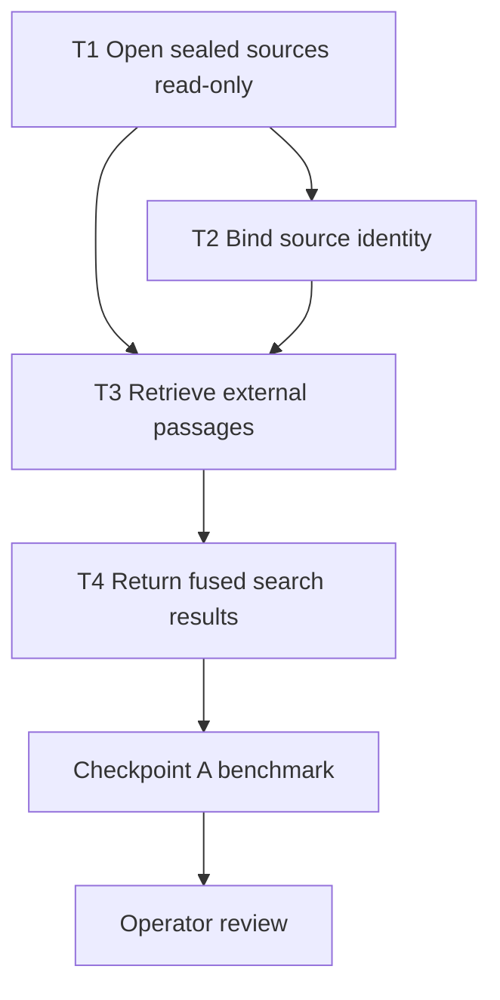

# Phase 1 source-aware federated retrieval

## Target condition

One explicit Curator tool searches Curator memory and configured sealed corpus sources without physically merging stores. Results preserve record-level provenance, project only corpus passage text, reserve result capacity per healthy source, and surface source failures. Retrieval cannot mutate a corpus database or depend on `corpus_query`'s process-global warm index.

Automatic prompt injection and lesson promotion are explicitly out of scope until the operator reviews the Phase 1 benchmark.

## Recovered specification

- `kask/docs/architecture/memory-system-specification.md`: Curator recall is an experiential feedback loop; injected memories update recall clocks and co-occurrence links.
- `kask/docs/reference/mcp-servers/corpus.md`: `corpus_query(db_path=...)` hydrates only an empty process-global index and cannot switch databases while warm.
- `kask/mcp-servers/hkask-mcp-corpus/src/index.rs`: durable corpus passages retain original `passage_text` and separate `method_signals` h_mems.
- Sealed-v9 `run-identity.json` binds the reference database to a run ID, actual embedding model, and index SHA-256.

## Architecture decisions

1. **Separate stores remain authoritative.** No rows move or copy between Curator and corpus databases.
2. **Read-only is enforced at SQLite open.** A sealed source uses `SQLITE_OPEN_READ_ONLY`, no parent creation, maintenance lock, WAL configuration, schema initialization, migration, repair, recall touch, link write, or delete.
3. **The shared memory layer owns federation primitives.** `hkask-memory` gains a small source-aware module for read-only passage retrieval and deterministic fusion. It does not open arbitrary paths or depend on either MCP leaf server.
4. **Curator exposes the explicit tool.** `hkask-mcp-curator` loads an exact configured manifest, embeds once, obtains untouched Curator candidates plus read-only corpus candidates, and returns source-labeled results.
5. **Rank, do not normalize unlike scores.** Each source preserves its internal ranking; balanced reserved quotas and reciprocal-rank fusion prevent one store from crowding out the other. Raw Curator distance and corpus distance remain diagnostic fields, not one claimed probability scale.
6. **Corpus projection is `passage_text` only.** `method_signals` never enter federated results.
7. **Configuration presence is the toggle.** No `*_enabled` setting is introduced. An absent manifest produces an explicit `unconfigured` source status.
8. **Failures stay source-local and visible.** A failed source cannot erase healthy-source results or masquerade as an empty successful search.
9. **Current contracts only.** The loader accepts only the current manifest, run-identity, database-schema, and exact model identities. Older shapes are rejected; no fallback parser, alias mapping, shim, migration, or abandoned path is retained for federation.

## Refused lazy implementation

Do not copy 119,684 corpus h_mems into `curator.db`, call `corpus_query` twice with cache clears, pass an arbitrary database path on every search, compare raw scores as though calibrated, silently skip incompatible embeddings, or open a sealed source through `open_or_repair`.

## Dependency graph

## Tasks

### T1 — Open sealed sources read-only

**Scope:** M. **Dependencies:** none.

**Likely files:**
- `kask/crates/hkask-storage/src/core/connection.rs`
- `kask/crates/hkask-storage/src/core.rs`
- `kask/crates/hkask-storage/src/hkask_storage.rs`
- `kask/crates/hkask-memory/src/memory_store.rs`

**Acceptance criteria:**
- Opening an existing SQLCipher database read-only runs no schema initialization, migration, maintenance inventory, or lock-file creation.
- A read query and sqlite-vec search work; every write attempt fails.
- Missing files, wrong keys, and after-read digest/metadata checks are fail-visible and leave the source unchanged.

**Verification:** encrypted file fixture; pre/post bytes, metadata, and sidecar inventory; real `EmbeddingStore::search`; attempted insert.

### T2 — Bind source identity

**Scope:** M. **Dependencies:** T1.

**Likely files:**
- new source-manifest types in `hkask-memory`
- `kask/mcp-servers/hkask-mcp-curator/src/types.rs`
- Curator configuration tests

**Acceptance criteria:**
- A source descriptor points to an exact DB plus existing run-identity and representation manifests; the loader derives run ID, index digest, model, prefix, and dimension rather than duplicating them.
- Wrong schema version, digest, index name, exact model metadata, prefix, or missing file yields a typed per-source failure; legacy shapes are rejected rather than adapted.
- The implementation contains no John Brooks path, model literal, or corpus-specific identifier.

**Verification:** temporary manifests and encrypted fixtures; one valid control and one failure per bound identity field.

### T3 — Retrieve external passages

**Scope:** M. **Dependencies:** T1, T2.

**Likely files:**
- new `kask/crates/hkask-memory/src/federated_recall.rs`
- `kask/crates/hkask-memory/src/hkask_memory.rs`
- module tests

**Acceptance criteria:**
- Given a query vector, the source returns ranked `passage_text` hits with source ID, run ID, embedding ID, entity ref, model, and distance.
- Empty text, dimension mismatch, model incompatibility, and query failure are counted or surfaced; they are never ordinary zero-match success.
- No h_mem join occurs, so `method_signals` cannot enter results.

**Verification:** encrypted source fixture containing text and method-signals h_mems; result projection and no-write assertions.

### T4 — Return fused search results

**Scope:** M. **Dependencies:** T3.

**Likely files:**
- Curator federated-search module
- `kask/mcp-servers/hkask-mcp-curator/src/hkask_mcp_curator.rs`
- `kask/mcp-servers/hkask-mcp-curator/src/types.rs`
- `kask/mcp-servers/hkask-mcp-curator/tests/tool_behavior.rs`
- `kask/crates/kask_bridge/src/mcp_servers.rs` only for the manifest env allowlist

**Acceptance criteria:**
- `curator_federated_search` returns reserved, source-labeled Curator and corpus results with complete provenance and deterministic ordering.
- Exact duplicate text keeps Curator provenance and drops the external duplicate; one failed source leaves healthy-source results plus a visible status.
- Unconfigured sources, incompatible identity, and embedding failure are distinguishable from no matches.

**Verification:** public tool tests with encrypted fixtures plus a live sealed-v9 read-only smoke.

## Checkpoint A — mixed retrieval benchmark

Seed queries cover Curator-local decisions, corpus-grounded concepts, both-source questions, negative controls, missing source, wrong key, and dimension/model mismatch.

The checkpoint passes only when:

- a relevant hit inside an individual source's reserved quota survives federation;
- every result has source and record identity;
- corpus `method_signals` pollution is zero;
- a source outage remains visible while healthy results survive;
- no corpus DB bytes, timestamps, row counts, or sidecar files change;
- repeated queries do not hydrate the corpus server's process-global index;
- focused tests, affected crate suites, `./script/clippy`, and `cargo check -p zed` pass.

The operator reviews Checkpoint A before automatic context injection or promotion work begins.

## Risks

| Risk | Impact | Mitigation |
|---|---|---|
| Read-only path still writes PRAGMAs or lock files | Sealed evidence is modified | SQLite read-only flags, separate pool initializer, byte/metadata/sidecar oracle |
| Model identity differs from the sealed run | False ranking | Require an exact current requested/actual model identity; reject aliases and legacy names visibly |
| One source crowds out the other | Curator or corpus value disappears | Reserved quotas plus rank fusion; benchmark both directions |
| Corpus text contains instructions | Prompt injection when Phase 2 arrives | Preserve existing data-boundary framing; Phase 1 returns data only |
| Manifest drifts from DB | False provenance | Bind run ID, index SHA-256, prefix, model, dimension; cache only while file identity is unchanged |
| New tool silently degrades | Broken feedback loop | Per-source status and typed tool-level errors |

## Open decisions

None block Phase 1. At Checkpoint A the operator decides whether explicit federation earns opt-in automatic Curator context injection.

## PKO anchors

- Plan: `pko:Procedure` → source-aware federated retrieval target.
- T1–T4: `pko:Step`.
- Each acceptance/verification block: `pko:StepVerification`.
- Checkpoint A: `pko:UserFeedbackOccurrence`.
- Risks: `pko:IssueOccurrence`.
