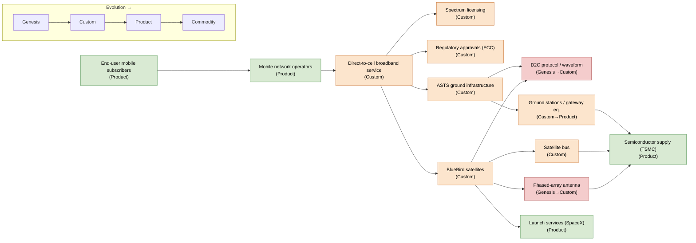

> Methodology: Wardley mapping per Simon Wardley's framework. Evolution axis runs
> Genesis → Custom → Product → Commodity. Value chain runs visible user need (left)
> → invisible infrastructure (right). Component positions are grounded in ASTS SEC
> filings, FCC orders, and ASTS press releases where available; positions not directly
> attested in primary sources are flagged **Inference-tier** in the Legend.

## Components

| # | Component | Evolution Stage | Value-Chain Position | Source Tier |
|---|-----------|-----------------|----------------------|-------------|
| 1 | End-user mobile subscribers (consumer need: connectivity everywhere) | Product | Visible (need) | Public filing [^asts10k] |
| 2 | Mobile network operators (MNOs — AT&T, Verizon, FirstNet, stc, Rakuten, etc.) | Product | Visible (customer) | Public filing [^asts10k]; press [^verizon_definitive] |
| 3 | Direct-to-cell / space-based cellular broadband service (the ASTS service itself) | Custom | Visible (service) | Public filing [^asts10k]; FCC order [^fcc_scs] |
| 4 | ASTS BlueBird satellites (Block 1 & Block 2) | Custom | Mid-chain (asset) | Public filing [^asts10k]; press [^block2_launch] |
| 5 | Phased-array antenna (2,400 sq ft, largest commercial array in LEO) | Genesis → Custom | Mid-chain (asset) | Public filing [^asts10k]; press [^bluebird6] |
| 6 | Satellite bus / spacecraft platform | Custom | Mid-chain (asset) | **Inference-tier** (component-level detail not isolated in 10-K) |
| 7 | ASTS ground infrastructure (gateways, TT&C, NOC) | Custom | Mid-chain (asset) | Public filing [^asts10k] |
| 8 | Ground stations / gateway equipment | Custom → Product | Mid-chain (asset) | **Inference-tier** (decomposed from "ground infrastructure" line item) |
| 9 | Direct-to-cell protocol / waveform & air-interface | Genesis → Custom | Mid-chain (capability) | **Inference-tier** (3GPP NTN convergence inferred; ASTS does not publish protocol spec) |
| 10 | Spectrum licensing (MNO partner spectrum + ASTS S-band/MSS) | Custom | Mid-chain (regulated asset) | Public filing [^asts10k]; FCC [^fcc_scs] |
| 11 | Regulatory approvals (FCC SCS authority, ITU, national regulators) | Custom | Mid-chain (regulated gate) | Public filing [^asts10k]; FCC [^fcc_scs] |
| 12 | Launch services (SpaceX Falcon 9, Blue Origin New Glenn, ISRO) | Product | Invisible (infrastructure) | Public filing [^asts10k]; press [^block2_launch] |
| 13 | Semiconductor supply (TSMC ASIC tape-out, FPGAs, Cadence EDA) | Product | Invisible (infrastructure) | Press [^asic_tsmc]; **Inference-tier** for margin-impact classification |

## Wardley Map

> Reading note: left-to-right approximates visible→invisible; node fill encodes
> evolution stage (red=Genesis, orange=Custom, green=Product, blue=Commodity).
> Edges show dependency direction (consumer of upstream capability → supplier).

## Strategic Movement

**Antenna & satellite bus moving Genesis → Custom.** The phased-array antenna
is the load-bearing differentiator: at ~2,400 sq ft per Block 2 BlueBird it is the
"largest commercial communications array ever deployed in LEO" [^bluebird6]. Wardley
doctrine says Genesis-stage components carry the most strategic optionality but also
the most execution risk. ASTS is actively pushing the antenna down the evolution
axis via the modular "micron" building-block architecture (≈9 sq ft tiles) and
in-house Midland, TX manufacturing at up to six satellites/month [^asts10k]. Each
Block 2 launch (BlueBirds 8–10 in June 2026, 11–13 in August 2026 [^block2_launch])
is a data point that the antenna is leaving Genesis and entering Custom — still
bespoke, no longer experimental.

**Direct-to-cell protocol moving Genesis → Custom, with a fork.** The protocol
layer is bifurcating: (a) ASTS's proprietary waveform optimized for unmodified
handsets, and (b) the 3GPP NTN standards track that competitors (Starlink D2D,
Lynk) also target. ASTS's filings emphasize compatibility with *unmodified*
smartphones across multiple frequency bands [^asts10k], which is the protocol's
moat — but standardization pressure will pull this toward Product over a 3–5 year
horizon, eroding ASTS's protocol-level differentiation. **Inference-tier**: the
specific rate of standardization-driven commoditization is not disclosed in
filings.

**Spectrum & regulatory: Custom, moving slowly.** Spectrum access is a regulated
asset, not a technology, so it does not commoditize — it accumulates. ASTS has
stacked: 60 MHz of company-licensed S-band MSS globally, 45 MHz MSS mid-band in
North America, 80+ MHz U.S. satellite+terrestrial, and 1,150 MHz of tunable MNO
partner spectrum across 50+ operators [^asts_q1_2026]. The April 2026 FCC
Supplemental Coverage from Space (SCS) authorization for up to 248 satellites on
700/800 MHz with AT&T, Verizon, and FirstNet [^fcc_scs] is the single largest
strategic movement event of the period — it converts a regulatory gate into a
deployable asset. Movement here is *lateral* (more jurisdictions, more bands)
rather than evolutionary.

**Launch services moving Product → Commodity.** Falcon 9 is already Product;
the announced diversification to Blue Origin New Glenn and ISRO [^block2_launch]
is classic Wardley "multi-source a Product to push it toward Commodity." This is
favorable to ASTS as a buyer — launch cost per kg trends down — but it removes
any launch-side moat. ASTS captures no margin here; it is pure COGS.

**Semiconductor supply moving Custom → Product.** The 2024 TSMC ASIC tape-out
[^asic_tsmc] and the FPGA-to-ASIC migration path disclosed by management
[^spacenews_fpga] move the chip layer from Custom (early FPGAs, scarce) toward
Product (purpose-built ASIC, second-sourceable). This de-risks the supply chain
but, like launch, is infrastructure ASTS buys rather than a margin pool it owns —
except insofar as the ASIC design itself is a Custom IP asset that competitors
cannot buy off the shelf. **Inference-tier**: the ASIC's contribution to per-satellite
margin is not separately disclosed.

**MNO partnerships moving Product → Commodity (relationship layer).** The
definitive Verizon commercial agreement (Oct 2025) [^verizon_definitive] and the
stc $175M prepayment (Oct 2025) [^asts10k] show the MNO channel is productizing.
As more MNOs sign, the *relationship* becomes less differentiating (any operator
can get D2D from ASTS or a competitor) — but the *integration depth* (spectrum
coordination, core-network interconnect) remains Custom per-carrier and is where
ASTS's switching cost is built.

## Margin Capture

ASTS captures margin at three layers, in descending order of defensibility:

1. **Phased-array antenna + BlueBird platform (Custom, in-house).** This is the
   deepest moat. The antenna is Genesis→Custom, purpose-built, vertically
   integrated at Midland, and not buyable from any supplier. Per-satellite
   capacity (Block 2 ≈ 10× Block 1 throughput, per company materials [^asts_q1_2026])
   flows directly from this layer. Margin here is structural: ASTS is the only
   supplier of the asset that enables the service.

2. **Regulatory + spectrum stack (Custom, accumulated).** The FCC SCS authority
   [^fcc_scs] and the 50+ MNO spectrum arrangements [^asts10k] are non-replicable
   without years of filings. This is a *regulatory* moat, not a tech moat — it
   depreciates only if regulators open the band to competitors (Starlink D2D is
   the live threat). Margin here is captured as *access rent*: ASTS can offer a
   service competitors legally cannot yet offer in the same bands.

3. **MNO commercial agreements (Product, relationship-layer).** The Verizon
   definitive agreement [^verizon_definitive] and stc prepayment convert the
   regulatory moat into contracted revenue. Margin here is *take-rate* on the
   service, shared with the MNO. Defensibility is medium: switching cost is real
   (core-network integration, spectrum coordination) but the relationship itself
   is not unique per-carrier over a 5+ year horizon.

**Where ASTS does NOT capture margin:** launch services (SpaceX/Blue Origin/ISRO
are suppliers; ASTS is price-taker), semiconductor fabrication (TSMC is supplier;
ASTS is buyer), and the consumer handset (owned by Apple/Samsung/Google — ASTS
explicitly targets *unmodified* devices, so it captures zero device margin by
design [^asts10k]).

**Strategic implication:** Margin durability is highest at the antenna/satellite
layer and the regulatory layer, and lowest at the launch and chip layers. The
protocol layer is the swing factor: if 3GPP NTN standardizes D2C fully, ASTS's
protocol advantage compresses toward Product and the antenna+regulatory stack
must carry the moat alone. **Inference-tier**: the relative weight of these
layers in realized unit economics is not disclosed in 10-K segment reporting
(ASTS reports a single segment).

## Legend

**Source tiers:**
- **Public filing** — grounded in ASTS SEC EDGAR filings (10-K, 10-Q, 8-K) or
  ASTS-issued press releases / IR materials cited inline.
- **Inference-tier** — position derived from analyst convention, industry
  structure, or decomposition of an aggregated 10-K line item. Not directly
  attested in a primary source. Presented as inference, not observation.

**Inference-tier components in this map:**
- **Satellite bus** — 10-K discusses BlueBird satellites as integrated units;
  the bus is not isolated as a separately sourced component. Position inferred
  from industry convention (satellite buses are typically Custom for a
  constellation of this specificity).
- **Ground stations / gateway equipment** — decomposed from the 10-K's
  "ground infrastructure" aggregate; the gateway-vs.-TT&C split and supplier
  mix are not separately disclosed.
- **Direct-to-cell protocol / waveform** — ASTS filings describe the *service*
  (direct-to-standard-cellphone broadband) but do not publish the air-interface
  specification; protocol-stage classification is inferred from public technical
  commentary and 3GPP NTN context.
- **Semiconductor margin-impact** — the TSMC ASIC tape-out is public [^asic_tsmc],
  but the ASIC's contribution to per-satellite unit margin is not disclosed.

**Evolution-stage color key (Mermaid):**
- Red = Genesis (novel, uncertain, bespoke)
- Orange = Custom (built-to-order, emerging standardization)
- Green = Product (rentable, multi-source, defined)
- Blue = Commodity (utility, ubiquitous, low-margin)

---

### Sources

[^asts10k]: AST SpaceMobile, Inc. (2026). *Form 10-K Annual Report for fiscal year ended December 31, 2025.* SEC EDGAR. https://www.sec.gov/Archives/edgar/data/1780312/000178031226000006/R1.htm

[^asts_q1_2026]: AST SpaceMobile, Inc. (2026). *Q1 2026 Quarterly Business Update* [Investor presentation]. AST SpaceMobile IR. https://irp.cdn-website.com/bbb776b9/files/uploaded/AST+SpaceMobile+Q1+2026+Quarterly+Business+Update_vFF.pdf

[^fcc_scs]: AST SpaceMobile, Inc. (2026, April 22). *FCC Grants AST SpaceMobile Commercial Authority to Deliver Direct-to-Device Cellular Broadband from Space* [Press release]. Business Wire. https://www.businesswire.com/news/home/20260422147378/en/FCC-Grants-AST-SpaceMobile-Commercial-Authority-to-Deliver-Direct-to-Device-Cellular-Broadband-from-Space-Advancing-Nationwide-Resilient-Cellular-Broadband-Connectivity-in-the-United-States

[^verizon_definitive]: AST SpaceMobile, Inc. (2025, October 8). *AST SpaceMobile Announces Definitive Commercial Agreement with Verizon to Support Space-Based Cellular Broadband Across the Continental United States* [Press release]. Business Wire. https://www.businesswire.com/news/home/20251008175159/en/AST-SpaceMobile-Announces-Definitive-Commercial-Agreement-with-Verizon-to-Support-Space-Based-Cellular-Broadband-Across-the-Continental-United-States

[^block2_launch]: AST SpaceMobile, Inc. (2026, August 5). *AST SpaceMobile Announces Successful Orbital Launch of BlueBirds 11, 12, and 13* [Press release]. Barchart. https://www.barchart.com/story/news/3661753/ast-spacemobile-announces-successful-orbital-launch-of-bluebirds-11-12-and-13

[^bluebird6]: AST SpaceMobile, Inc. (2026, February 11). *AST SpaceMobile Successfully Completes Unfolding of BlueBird 6, the Largest Commercial Communications Array Antenna Ever Deployed in Low Earth Orbit* [Press release]. Stock Titan. https://www.stocktitan.net/news/ASTS/ast-space-mobile-successfully-completes-unfolding-of-blue-bird-6-the-3h9gj2d4syej.html

[^asic_tsmc]: AST SpaceMobile, Inc. (2024, March 27). *AST SpaceMobile ASIC Chip Enters Tape-Out Phase in Collaboration with TSMC* [Press release]. Business Wire. https://www.businesswire.com/news/home/20240327367837/en/AST-SpaceMobile-ASIC-Chip-Enters-Tape-Out-Phase-in-Collaboration-with-TSMC

[^spacenews_fpga]: Rainbow, J. (2022). *Operational AST SpaceMobile satellites could proceed without prototype.* SpaceNews. https://spacenews.com/operational-ast-spacemobile-satellites-could-proceed-without-prototype
