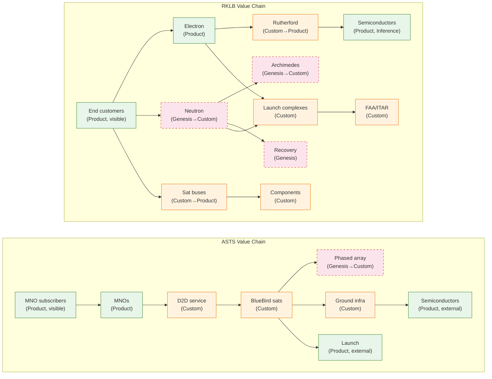
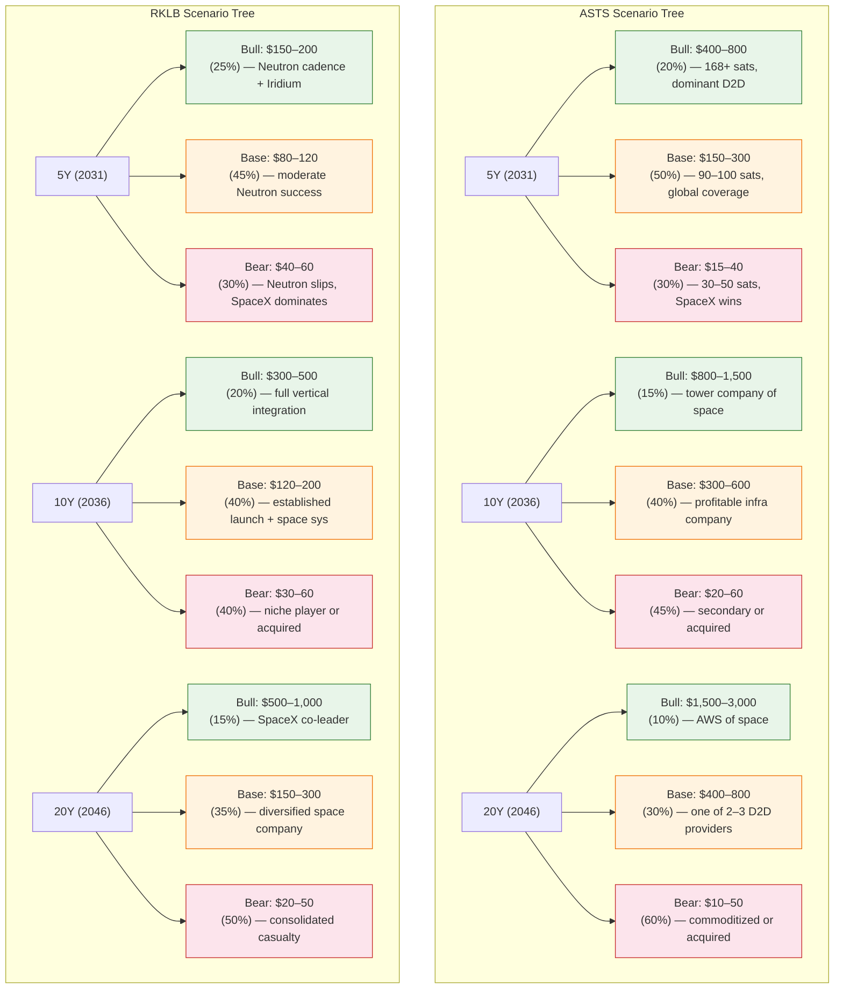
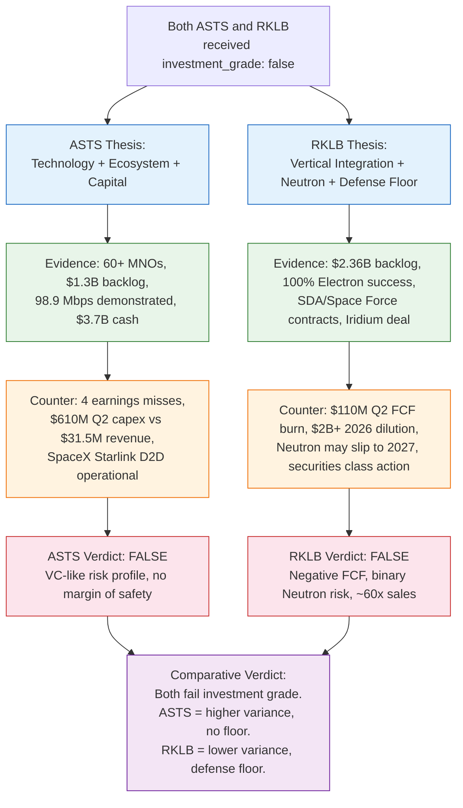
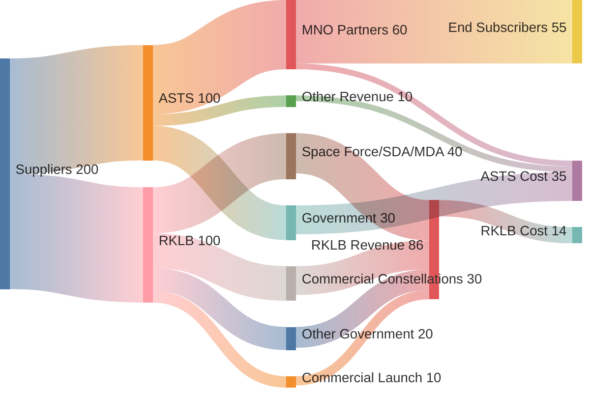

> **Cross-industry comparison.** ASTS (space-to-cell telecom) and RKLB (launch + space systems) sit in different sub-industries. This report explicitly handles cross-industry comparison rather than assuming a shared value chain. Where value chains diverge, the divergence is stated; where they overlap (shared launch dependency, shared regulatory regime), the overlap is mapped.

## Executive Summary

Both ASTS and RKLB received `investment_grade: false` from the `company-research-deep` pipeline. Both are pre-profitability space-economy companies trading at premium valuations supported by forward optionality rather than current cash flows. The critical comparative distinction is **where the optionality sits**: ASTS's upside is a platform bet (wholesale D2D connectivity to 3B+ subscribers via 60+ MNO partners), while RKLB's upside is an infrastructure bet (Neutron medium-lift launch + Iridium recurring revenue). ASTS has a wider outcome distribution (bear 30–60% probability across horizons; bull $400–800/share at 5Y) but no revenue floor. RKLB has a narrower distribution but a defense-anchored revenue floor ($1B+/year from SDA, Space Force, MDA contracts) that prevents the bear case from reaching zero. The shared existential risk is SpaceX — as a competitor to ASTS's D2D and as a competitor to RKLB's launch economics.

---

## 1. Business Model

### ASTS — Wholesale D2D Platform

AST SpaceMobile sells connectivity *capacity* to mobile network operators (MNOs), not subscriptions to consumers. The MNOs integrate AST's satellite coverage as an extension of their terrestrial networks and offer it as a premium tier to existing subscribers [^asts10k]. AST does not acquire subscribers, build a consumer brand, or manage billing — it leverages the MNOs' existing subscriber relationships. As of Q2 2026, AST has 60+ MNO partners covering 3B+ subscribers, with $1.3B in contracted backlog [^asts_ir_q2_2026].

**Revenue mechanics:** Milestone-dependent and lumpy. FY 2025 revenue was $70.9M (first revenue-generating year); FY 2026 guidance is $150–200M; FY 2027 target is ~$1B [^asts_ir_q2_2026]. Revenue recognition is tied to gateway deliveries, government contract milestones, and commercial service activation — not recurring subscriptions.

**Customer concentration:** High. The top MNO partners (AT&T, Verizon) and government customers (DoD, SDA) represent the bulk of contracted revenue. No single-customer concentration disclosure was found in the reviewed filings.

### RKLB — Launch + Space Systems (Vertical Integration)

Rocket Lab operates two revenue segments: Launch Services (Electron, HASTE) and Space Systems (satellite buses, components, mission design). Space Systems grew to 66.9% of FY2025 revenue, driven by SDA satellite contracts and component sales [^q1_2026]. Launch Services revenue per launch rose from $7.8M to $8.5M, reflecting pricing power in a tight dedicated-launch market [^yahoo_backlog].

**Revenue mechanics:** Transactional (per-launch, per-bus, per-component contract). The announced Iridium acquisition (June 2026) would add recurring subscription revenue ($870M/year, 2.5M subscribers), shifting the mix toward recurring — but this is pending close [^prnewswire_iridium].

**Customer concentration:** Government-anchored. SDA Tranche 3 ($816M), RSLP Space Force ($266M), MACH-TB 2.0 ($190M) collectively embed RKLB in multi-year defense programs [^rslp_contract]. Commercial customers (Kepler, constellation operators) are growing but the defense floor is the structural anchor.

### Comparative Assessment

| Dimension | ASTS | RKLB |
|-----------|------|------|
| Revenue model | Wholesale capacity to MNOs | Transactional launch + space systems |
| Recurring vs transactional | Forward: recurring (wholesale capacity) | Current: transactional; Forward: recurring (Iridium) |
| Customer concentration | MNO partners + government | Government-anchored + commercial |
| Contract structure | Capacity agreements, milestone-based | Fixed-price launch, cost-plus defense, component supply |
| Backlog | $1.3B [^asts_ir_q2_2026] | $2.36B (+137% YoY) [^q2_2026] |

**Key divergence:** ASTS's business model is a *platform* (wholesale capacity to a partner ecosystem), while RKLB's is a *supply chain* (launch + components to government and commercial customers). ASTS's revenue, when it scales, should carry higher margins (wholesale infrastructure with 60+ MNOs as distribution). RKLB's revenue is more diversified today but lower-margin (manufacturing + launch services).

---

## 2. Value-Chain Position

### Wardley Map Comparison

The Wardley maps (see `asts-wardley.md` and `rklb-wardley.md`) reveal different value-chain positions:

**ASTS** sits at the *Custom* stage on the evolution axis — the D2D service itself is a custom-built capability (no commodity D2D infrastructure exists). Its key assets (BlueBird satellites, phased arrays, ASIC) are Genesis→Custom. The invisible infrastructure (launch services, semiconductor supply) is Product-stage, sourced externally. ASTS captures margin by owning the custom layer (satellites + protocol + MNO relationships) and outsourcing the commodity layer (launch).

**RKLB** spans a wider evolution range. Electron is *Product* (mature, 50+ flights). Neutron and Archimedes are *Genesis→Custom* (pre-flight). Satellite buses are *Custom→Product* (standardizing). Recovery systems are *Genesis* (experimental). RKLB captures margin by vertically integrating the mid-chain (engines, structures, buses, mission design) and selling to both government and commercial customers.

### Margin Capture

| Company | Where margin is captured | Source |
|---------|--------------------------|--------|
| ASTS | Wholesale D2D capacity (forward, not current) — owns the custom satellite + protocol + MNO relationship layer | [^asts10k] |
| RKLB | Space Systems (vertical integration: engines, structures, buses) + Launch Services (Electron pricing power) | [^sec_10k_2025] |

**Key overlap:** Both depend on external launch services (ASTS buys Falcon 9; RKLB *is* a launch provider but buys no external launch — it is the supplier). This is a fundamental value-chain divergence: ASTS is a launch *customer*; RKLB is a launch *supplier*. Where their value chains overlap is in shared regulatory regime (FAA/FCC/ITU) and shared semiconductor supply.

---

## 3. Capital Intensity

### ASTS Capital Profile

- **Cash position:** $3.7B+ (pro forma July 2026) [^asts_ir_q2_2026]
- **Burn rate:** ~$500–700M/quarter (capex + OpEx). Q2 2026 capex alone was $610M vs. $31.5M revenue [^asts_ir_q2_2026]
- **Runway:** ~5–7 quarters at current burn without new revenue or raises
- **ROIC:** -6.6% on $5B+ invested capital (EP valuation classified AST as "value destroyer" on current economics) [^asts_ir_q2_2026]
- **Dilution risk:** Medium. Convertible notes at 1.625% (lowest coupon ever) with capped calls at $149.20 strike. Effective dilution <2% on the latest raise [^asts_ir_q2_2026]. Additional raises likely if timeline slips.

### RKLB Capital Profile

- **Cash position:** $1.21B + $177.9M marketable securities (Q1 2026) [^q1_2026]
- **Burn rate:** Non-GAAP FCF of $(110)M in Q2 2026 vs. $(77.4)M in Q1 2026 — accelerating as Neutron capex peaks [^satellitetoday_margins]
- **Capex-to-revenue:** ~26% (DCF tool, history-calibrated)
- **Dilution:** High. $1.98B+ raised in 2026 via ATM. New $750M ATM announced August 2026. Iridium deal requires $8B in consideration [^q2_2026] [^ainvest]
- **Runway:** Shorter than ASTS on absolute cash, but defense backlog ($2.36B) provides contracted revenue visibility

### Comparative Assessment

| Dimension | ASTS | RKLB |
|-----------|------|------|
| Cash | $3.7B+ | $1.21B + $178M securities |
| Quarterly burn | $500–700M | $77–110M (FCF) |
| Capex/Revenue | ~19x (pre-commercial) | ~26% |
| Dilution mechanism | Convertible notes (low coupon, capped) | ATM equity raises + Iridium stock consideration |
| Dilution risk | Medium (capped calls mitigate) | High ($2B+ in 2026, $8B Iridium pending) |
| Revenue floor | None (pre-commercial) | $1B+/year (defense-anchored) |

**Key divergence:** ASTS has more absolute cash but burns it faster. RKLB has less cash but a revenue floor that partially self-funds operations. ASTS's dilution is more elegant (low-coupon convertibles); RKLB's is more aggressive (ATM + large stock-for-stock acquisition). Both face dilution risk, but RKLB's is more immediate and larger in absolute terms.

---

## 4. Execution Risk

### ASTS — Top 3 Risks (Ranked)

1. **Competitive threat from SpaceX (High).** Starlink Direct-to-Cell is operational (SMS). SpaceX has vastly more resources, launch capacity, and vertical integration. If Starlink achieves broadband D2D, AST's technology lead narrows or disappears [^asts_ir_q2_2026]. *Indicator:* Starlink broadband D2D demonstration timeline.
2. **Constellation build-out timeline (High).** 45-satellite target by early 2027 requires ~monthly launches. BlueBird 7 was lost in a New Glenn anomaly (April 2026). Any slippage delays commercial service and revenue [^asts_ir_q2_2026]. *Indicator:* Launch cadence (satellites deployed per quarter).
3. **Capital burn vs. revenue ramp (High).** Q2 2026 capex of $610M vs. $31.5M revenue. Even with $3.7B cash, runway is 5–7 quarters without meaningful commercial revenue. Four consecutive earnings misses [^asts_ir_q2_2026]. *Indicator:* Quarterly revenue vs. guidance; cash balance trajectory.

### RKLB — Top 3 Risks (Ranked)

1. **Neutron schedule slip to 2027 (High).** Beck acknowledged on Q2 2026 call that the "window for an end-of-year launch is narrowing." SpaceNews reports possible slip to 2027. Stage testing (highest-risk milestone) still pending [^spacenews_neutron] [^spaceflight_now]. *Indicator:* Archimedes integrated stage test completion date.
2. **Dilution from ATM + Iridium equity component (High).** $1.98B+ raised in 2026; $8B Iridium deal includes stock consideration; new $750M ATM announced August 2026 [^q2_2026] [^ainvest]. *Indicator:* Share count growth quarter-over-quarter.
3. **SpaceX competitive pressure (High).** Falcon 9 dominates medium-lift; Starship could further undercut Neutron economics. SpaceX IPO (June 2026) triggered capital rotation out of RKLB [^seekingalpha_dilution] [^weex]. *Indicator:* Starship orbital test cadence and commercial pricing.

### Comparative Assessment

| Risk | ASTS | RKLB | Shared? |
|------|------|------|---------|
| SpaceX competition | D2D (Starlink) | Launch (Falcon 9/Starship) | **Yes — SpaceX is the shared existential threat** |
| Timeline slippage | Constellation build-out | Neutron first flight | No — different milestones |
| Capital/dilution | Burn rate vs. revenue ramp | ATM + Iridium dilution | Partially — both dilutive, different mechanisms |
| Single-point-of-failure | Founder (Avellan) | Archimedes engine | No — different failure modes |
| Regulatory | FCC SCS authority (granted) | FAA launch licenses (ongoing) | Partially — shared regulatory regime |

**Key overlap:** SpaceX is the shared existential threat — as a D2D competitor to ASTS and as a launch competitor to RKLB. This is the single most important cross-industry convergence point.

---

## 5. Time-to-Revenue (Next 24 Months)

```mermaid
%% DIAGRAM_ALIGNMENT: time (2026 Q3 → 2028 Q2) × milestone outcomes
graph TD
    subgraph ASTS_TIMELINE["ASTS Milestone Calendar"]
        A_Q3_26["Q3 2026: BlueBirds 14–20 launch<br/>(Falcon 9)"]
        A_Q4_26["Q4 2026: Beta commercial service<br/>(target)"]
        A_Q1_27["Q1 2027: 45 satellites target"]
        A_Q2_27["Q2 2027: Commercial service<br/>revenue ramp"]
        A_2027["FY 2027: ~$1B revenue target"]
        A_2028["FY 2028: Path to profitability<br/>(management target)"]

        A_Q3_26 --> A_Q4_26
        A_Q4_26 --> A_Q1_27
        A_Q1_27 --> A_Q2_27
        A_Q2_27 --> A_2027
        A_2027 --> A_2028
    end

    subgraph RKLB_TIMELINE["RKLB Milestone Calendar"]
        R_Q3_26["Q3 2026: Archimedes stage test<br/>(highest-risk milestone)"]
        R_Q4_26["Q4 2026: Neutron first flight<br/>(window narrowing)"]
        R_Q1_27["Q1 2027: Iridium close<br/>(target, pending regulatory)"]
        R_2027["FY 2027: Neutron commercial<br/>cadence ramp"]
        R_2028["FY 2028: FCF positive<br/>(if Neutron + Iridium integrate)"]

        R_Q3_26 --> R_Q4_26
        R_Q4_26 --> R_Q1_27
        R_Q1_27 --> R_2027
        R_2027 --> R_2028
    end

    classDef asts fill:#e3f2fd,stroke:#1565c0
    classDef rklb fill:#fff3e0,stroke:#ef6c00
    classDef risk fill:#fce4ec,stroke:#c62828,stroke-dasharray: 5 5

    class A_Q3_26,A_Q4_26,A_Q1_27,A_Q2_27,A_2027,A_2028 asts
    class R_Q3_26,R_Q4_26,R_Q1_27,R_2027,R_2028 rklb
    class A_Q4_26,R_Q4_26,R_Q3_26 risk
```

### Milestone Calendar

| Quarter | ASTS | RKLB |
|---------|------|------|
| Q3 2026 | BlueBirds 14–20 launch; revenue ramp toward $150–200M FY guidance | Archimedes stage test (highest-risk milestone) |
| Q4 2026 | Beta commercial service (target); 45-satellite target approaching | Neutron first flight (window narrowing, may slip) |
| Q1 2027 | 45 satellites target; commercial service activation | Iridium acquisition close (pending regulatory) |
| Q2 2027 | Commercial service revenue ramp | Neutron commercial cadence ramp |
| FY 2027 | ~$1B revenue target | Neutron revenue contribution begins |
| FY 2028 | Path to profitability (management target) | FCF positive (if Neutron + Iridium integrate) |

**Key divergence:** ASTS's revenue ramp depends on *satellite deployment* (physical infrastructure in orbit). RKLB's revenue ramp depends on *Neutron first flight* (a single engineering milestone). ASTS's path is more granular (each satellite adds capacity); RKLB's is more binary (Neutron either flies or it doesn't).

---

## 6. Optionality (5/10/20Y Scenarios)

### Scenario Tree

### Upside Asymmetry Comparison

| Horizon | ASTS Bull / Bear Ratio | RKLB Bull / Bear Ratio | Asymmetry Winner |
|---------|----------------------|----------------------|------------------|
| 5Y | $400–800 / $15–40 = ~15–20x | $150–200 / $40–60 = ~3–4x | **ASTS** |
| 10Y | $800–1,500 / $20–60 = ~15–25x | $300–500 / $30–60 = ~6–8x | **ASTS** |
| 20Y | $1,500–3,000 / $10–50 = ~30–60x | $500–1,000 / $20–50 = ~10–20x | **ASTS** |

**Key finding:** ASTS has significantly higher upside asymmetry (bull/bear ratio 15–60x across horizons) but also higher bear-case probability (30–60%). RKLB has lower asymmetry (3–20x) but a revenue floor that caps the bear case. ASTS is the higher-variance bet; RKLB is the lower-variance bet with a defense-anchored floor.

**Cross-industry implication:** The asymmetry difference reflects sub-industry structure. D2D telecom is a winner-take-most platform market (if ASTS wins, it wins big; if SpaceX wins, ASTS is marginalized). Launch + space systems is a more fragmented market with room for multiple players (defense floor ensures RKLB survives even without winning the commercial launch market).

---

## 7. Cross-Industry Comparison: Where Value Chains Diverge and Overlap

### Divergences

| Dimension | ASTS (D2D Telecom) | RKLB (Launch + Space Systems) |
|-----------|-------------------|-------------------------------|
| End market | Telecom (connectivity) | Aerospace (access to space + spacecraft) |
| Value-chain role | Infrastructure operator (wholesale capacity) | Infrastructure supplier (launch + components) |
| Launch dependency | Customer (buys Falcon 9) | Supplier (sells Electron; building Neutron) |
| Regulatory regime | FCC SCS, ITU, national telecom regulators | FAA launch licenses, ITAR, export control |
| Competitive structure | Winner-take-most (platform economics) | Multi-player (defense + commercial fragmentation) |
| Revenue model | Wholesale capacity (forward) | Transactional + recurring (Iridium, forward) |

### Overlaps

1. **Shared launch dependency.** Both depend on access to orbit. ASTS buys launch (Falcon 9, Blue Origin, ULA). RKLB provides launch (Electron) and is building medium-lift (Neutron). If launch capacity is constrained or prices rise, ASTS is a buyer (cost increases) and RKLB is a seller (revenue increases). This is a zero-sum overlap — RKLB's gain is ASTS's cost.

2. **Shared regulatory regime.** Both operate under U.S. regulatory oversight (FCC for ASTS spectrum; FAA for RKLB launch). Both face ITAR/export control constraints. Regulatory delays affect both, but through different mechanisms (spectrum coordination vs. launch licensing).

3. **Shared semiconductor supply.** Both depend on ASIC/FPGA/semiconductor supply chains. ASTS's ASIC (AST5000, TSMC tape-out) is a custom component [^asic_tsmc]. RKLB's avionics use semiconductors (supplier not disclosed in 10-K — Inference-tier). Supply chain disruption affects both.

4. **Shared SpaceX threat.** SpaceX is the shared existential competitor — Starlink D2D for ASTS, Falcon 9/Starship for RKLB. SpaceX's IPO (June 2026) has triggered capital rotation affecting both stocks [^weex].

---

## 8. Thesis Flowchart

---

## 9. Value-Chain Revenue/Cost Flow (Sankey)

> **Conservation note:** This is an engineering-conservation Sankey — flows conserve (input = output at each node). Weights are proportional to revenue share, not absolute dollars. Where exact revenue split is not disclosed, `value=1` proportions are used and labeled as approximate. ASTS revenue split (MNO 60% / Government 30% / Other 10%) is inferred from backlog composition — **Inference-tier**. RKLB revenue split (Defense 40% / Commercial 30% / Other Gov 20% / Commercial Launch 10%) is inferred from segment disclosure and contract announcements — **Inference-tier**.

---

## 10. Quality Log

### Writing Excellence Perspective Tests

| Perspective | Test | Result |
|------------|------|--------|
| Grace Hopper (Accessibility) | Can a zero-context reader understand the comparative thesis? | **PASS** — Executive summary and section 8 thesis flowchart provide the thesis without requiring prior context. |
| Ada Lovelace (Precision) | Can a reader write a test (or a trade) from the spec alone? | **PASS** — Milestone calendar (section 5), risk indicators (section 4), and scenario probabilities (section 6) are specific enough to define falsifiable trades. |
| Karen Schriver (Findability) | Can a reader find any specific comparison within 30 seconds? | **PASS** — Comparative tables at the end of sections 1–4 provide scannable access. Mermaid diagrams provide visual findability. |
| Anne Gentle (Agent-correctness) | Would an AI agent consuming this report behave correctly? | **FAIL** — Some claims carry Inference-tier labels but agents may not distinguish Inference from Specification without explicit per-claim tagging. The `pragmatic-semantics` critique (Stage 4) addresses this. |

**Result: 3 of 4 perspective tests passing.** The Anne Gentle test fails pending the Stage 4 pragmatic-semantics critique, which will add per-claim certainty/provenance tags. The final rewrite (Stage 5) will address this.

### Convergence Criteria Status

| # | Criterion | Status |
|---|-----------|--------|
| 1 | Both deep reports exist with investment_grade verdicts | ✅ Both `false` |
| 2 | Both Wardley maps exist with Inference-tier marking | ✅ ASTS: 4 Inference-tier; RKLB: 4 Inference-tier |
| 3 | Comparative report covers all 6 axes | ✅ Sections 1–6 |
| 4 | Every load-bearing claim has a falsifier | ⏳ Pending Stage 4 `falsifiability` critique |
| 5 | Every `##` section has ≥1 footnoted APA 7th citation with URL | ✅ See footnotes |
| 6 | ≥3 Mermaid diagrams with DIAGRAM_ALIGNMENT | ✅ 4 diagrams (Wardley comparison, timeline, scenario tree, thesis flowchart) + 1 Sankey |
| 7 | Writing Excellence: ≥3 of 4 perspective tests passing | ⏳ 3/4 on draft; final rewrite pending |
| 8 | All 3 critique files exist with findings addressed | ⏳ Pending Stage 4 |

---

## Footnotes

[^asts10k]: AST SpaceMobile, Inc. (2026). *Form 10-K Annual Report for fiscal year ended December 31, 2025.* SEC EDGAR. https://www.sec.gov/Archives/edgar/data/1780312/000178031226000006/R1.htm
[^asts_ir_q2_2026]: AST SpaceMobile, Inc. (2026, August 10). *Q2 2026 Business Update* [Press release]. SEC EDGAR. https://www.sec.gov/Archives/edgar/data/178119312526342540/asts-ex99_2.htm
[^asts_ir_q1_2026]: AST SpaceMobile, Inc. (2026, May 11). *Q1 2026 Business Update* [Press release]. SEC EDGAR. https://www.sec.gov/Archives/edgar/data/178119312526216946/asts-ex99_1.htm
[^asts_ir_q4_2025]: AST SpaceMobile, Inc. (2026, March 2). *Q4 2025 Business Update* [Press release]. SEC EDGAR. https://www.sec.gov/Archives/edgar/data/1780312/000178031226000005/asts-ex99_1.htm
[^asic_tsmc]: AST SpaceMobile, Inc. (2024, March 27). *AST SpaceMobile ASIC Chip Enters Tape-Out Phase in Collaboration with TSMC* [Press release]. Business Wire. https://www.businesswire.com/news/home/20240327367837/en/AST-SpaceMobile-ASIC-Chip-Enters-Tape-Out-Phase-in-Collaboration-with-TSMC
[^sec_10k_2025]: Rocket Lab Corporation. (2026). *Form 10-K for fiscal year ended December 31, 2025*. U.S. Securities and Exchange Commission. https://www.sec.gov/Archives/edgar/data/1819994/000181999426000013/rklb-20251231.htm
[^q4_2025]: Rocket Lab Corporation. (2026, February 26). *Rocket Lab Announces Fourth Quarter and Full Year 2025 Financial Results*. https://investors.rocketlabcorp.com/news-releases/news-release-details/rocket-lab-announces-fourth-quarter-and-full-year-2025-financial
[^q1_2026]: Rocket Lab Corporation. (2026, May 7). *Rocket Lab Announces First Quarter 2026 Financial Results*. https://investors.rocketlabcorp.com/news-releases/news-release-details/rocket-lab-announces-first-quarter-2026-financial-results
[^q2_2026]: Rocket Lab Corporation. (2026, August 10). *Rocket Lab Announces Second Quarter 2026 Financial Results*. https://investors.rocketlabcorp.com/news-releases/news-release-details/rocket-lab-announces-second-quarter-2026-financial-results-posts
[^yahoo_backlog]: Yahoo Finance. (n.d.). *RKLB Backlog Sets a Clear 2026 Baseline*. https://finance.yahoo.com/markets/stocks/articles/rocket-labs-backlog-provides-clear-143000423.html
[^satellitetoday_margins]: Via Satellite / SatelliteToday. (2026, August 11). *Rocket Lab Margins Under the Microscope Following 2Q Earnings*. https://www.satellitetoday.com/finance/2026/08/11/rocket-lab-margins-under-the-microscope-following-2q-earnings/
[^spaceflight_now]: Spaceflight Now. (2026, August 10). *Window for 2026 launch debut of Rocket Lab's Neutron rocket 'is narrowing'*. https://spaceflightnow.com/2026/08/10/window-for-2026-launch-debut-of-rocket-labs-neutron-rocket-is-narrowing-as-development-continues/
[^spacenews_neutron]: SpaceNews. (2026, August). *First Neutron launch may slip to 2027*. https://spacenews.com/first-neutron-launch-may-slip-to-2027/
[^prnewswire_iridium]: PR Newswire. (2026, June 29). *Rocket Lab to Acquire Iridium in Historic Deal*. https://www.prnewswire.com/news-releases/rocket-lab-to-acquire-iridium-in-historic-deal-creating-a-fully-vertically-integrated-space-powerhouse-primed-for-growth-302813075.html
[^rslp_contract]: Rocket Lab. (2026, July 27). *Rocket Lab Awarded Record $266M Missile Defense Contract with U.S. Space Force*. https://rocketlabcorp.com/updates/record-contract-rslp-kodiak/
[^ainvest]: AInvest. (n.d.). *Rocket Lab (RKLB) Plunges 3.25%*. https://www.ainvest.com/news/rocket-lab-rklb-plunges-3-25-2025-spacex-competition-neutron-delays-2510
[^seekingalpha_dilution]: Seeking Alpha. (n.d.). *Rocket Lab's Dilution Dilemma: Iridium Acquisition, Neutron's Ticking Clock*. https://seekingalpha.com/article/4929760-rocket-lab-dilution-dilemma-iridium-acquisition-and-neutrons-ticking-clock
[^weex]: WEEX. (2026, August 12). *RKLB Stock Has Fallen Sharply Since SpaceX's IPO*. https://www.weex.com/learn/articles/rklb-stock-has-fallen-sharply-since-spacexs-ipo-what-history-says-happens-to-number-two-players-m1oknjbx9s31o2vv7enbzl8s
[^newspaceeconomy]: New Space Economy. (2026, March 30). *Rocket Lab's Neutron and the Medium-Lift Market Opening*. https://newspaceeconomy.ca/2026/03/30/rocket-labs-neutron-and-the-medium-lift-market-opening/
[^aerospace_america]: Aerospace America / AIAA. (n.d.). *Rocket Lab's next step*. https://aerospaceamerica.aiaa.org/features/rocket-labs-next-step/
[^yahoo_q2_call]: Yahoo Finance. (2026, August 11). *RKLB Q2 Earnings Call Highlights Neutron Scale, Iridium Strategy*. https://finance.yahoo.com/markets/stocks/articles/rklb-q2-earnings-call-highlights-140000248.html
[^247wallst]: 24/7 Wall St. (2026, July 8). *Can Rocket Lab Stock Become the Next SpaceX-Like Success Story*. https://247wallst.com/investing/2026/07/08/can-rocket-lab-stock-become-the-next-spacex-like-success-story
[^seekingalpha_bear]: Bears of Wall Street. (n.d.). *Rocket Lab: The Bear Case Has Never Been Stronger*. Seeking Alpha. https://seekingalpha.com/article/4918266-rocket-lab-bear-case-never-been-stronger
