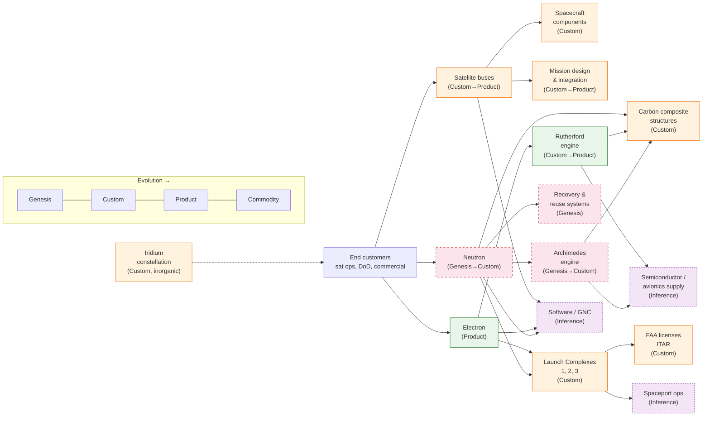

> Methodology: Wardley mapping per Simon Wardley's framework. Evolution axis runs
> Genesis → Custom → Product → Commodity. Value chain runs visible user need (left)
> → invisible infrastructure (right). Component positions are grounded in RKLB SEC
> filings, IR press releases, and FAA records where available; positions not directly
> attested in primary sources are flagged **Inference-tier** in the Legend.

## Components

| # | Component | Evolution Stage | Value-Chain Position | Source Tier |
|---|-----------|-----------------|----------------------|-------------|
| 1 | End customers — satellite operators, DoD/government, commercial constellations | Product | Visible (need) | Public filing [^sec_10k_2025]; press [^q4_2025] |
| 2 | Launch services — Electron (small-lift, operational) | Product | Visible (service) | Public filing [^sec_10k_2025]; press [^q2_2026] |
| 3 | Launch services — Neutron (medium-lift, in development) | Genesis → Custom | Visible (service, pre-revenue) | Public filing [^sec_10k_2025]; press [^spaceflight_now] |
| 4 | Space Systems — satellite buses (Standard, Explorer, Heritage) | Custom → Product | Mid-chain (asset) | Public filing [^sec_10k_2025]; press [^q1_2026] |
| 5 | Space Systems — spacecraft components & subsystems | Custom | Mid-chain (asset) | Public filing [^sec_10k_2025] |
| 6 | Rutherford engine (3D-printed, electric pump-fed, Electron) | Custom → Product | Mid-chain (capability) | Public filing [^sec_10k_2025]; press [^rocketlab_about] |
| 7 | Archimedes engine (reusable, Neutron first stage — 2× per vehicle) | Genesis → Custom | Mid-chain (capability, pre-flight) | Public filing [^sec_10k_2025]; press [^spaceflight_now] |
| 8 | Carbon composite structures (rocket airframes, fairings, tanks) | Custom | Mid-chain (asset) | Public filing [^sec_10k_2025] |
| 9 | Launch infrastructure — Launch Complex 1 (NZ), LC-2 (VA), LC-3 (AK) | Custom | Mid-chain (asset) | Public filing [^sec_10k_2025] |
| 10 | Recovery & reuse systems (Neutron first-stage recovery, mid-air capture for Electron) | Genesis | Mid-chain (capability, experimental) | Public filing [^sec_10k_2025]; press [^aerospace_america] |
| 11 | Mission design & integration services (spacecraft integration, mission management) | Custom → Product | Mid-chain (service) | Public filing [^sec_10k_2025] |
| 12 | Regulatory approvals — FAA launch licenses, range safety, export control (ITAR) | Custom | Mid-chain (regulated gate) | Public filing [^sec_10k_2025] |
| 13 | Spaceport operations & range logistics | Custom | Invisible (infrastructure) | **Inference-tier** (operational detail not isolated in 10-K) |
| 14 | Semiconductor / avionics / electronics supply chain | Product | Invisible (infrastructure) | **Inference-tier** (component-level sourcing not disclosed in 10-K) |
| 15 | Software / flight control / GNC (guidance, navigation, control) | Custom → Product | Invisible (infrastructure) | **Inference-tier** (software stack not separately described in 10-K) |
| 16 | Iridium satellite constellation (post-acquisition, announced June 2026) | Custom | Mid-chain (asset, inorganic) | Press [^prnewswire_iridium]; **Inference-tier** for Wardley position (deal pending close) |

## Wardley Map

## Strategic Movement

| Component | Current | Direction | Driver |
|-----------|---------|-----------|--------|
| Neutron launch service | Genesis→Custom | → Custom (2026 debut, may slip to 2027) | First flight window narrowing [^spaceflight_now] |
| Archimedes engine | Genesis→Custom | → Custom (hot-fire testing underway) | Reuse requirement for Neutron economics [^sec_10k_2025] |
| Recovery & reuse | Genesis | → Custom (mid-air capture demonstrated on Electron; Neutron recovery unproven) | Cost-reduction thesis [^aerospace_america] |
| Satellite buses | Custom→Product | → Product (standardized bus lines, high cadence) | Space Systems revenue growth [^q1_2026] |
| Rutherford engine | Custom→Product | → Product (mature, 50+ flights) | Electron flight heritage [^rocketlab_about] |
| Iridium constellation | Custom (inorganic) | → integration with Space Systems | Acquisition announced June 2026 [^prnewswire_iridium] |
| Launch infrastructure | Custom | → Custom (LC-3 Alaska coming online) | DoD/government demand [^rslp_contract] |

The dominant strategic movement is **horizontal**: Rocket Lab is pushing Neutron and Archimedes from Genesis toward Custom, which would unlock the medium-lift market and reduce per-launch cost via reuse. The Iridium acquisition (if closed) represents a **vertical** move — owning a downstream satellite operator, not just the launch and bus.

## Margin Capture

Rocket Lab captures margin in two segments, both disclosed in the 10-K [^sec_10k_2025]:

1. **Launch Services (Electron)** — Revenue per launch disclosed (~$7–8M average). Gross margin compressed in 2026 Q2 due to mix and fixed-cost absorption at lower cadence [^satellitetoday_margins]. Electron is a Product-stage offering with established pricing but limited scale economics (small-lift niche).

2. **Space Systems** — Higher revenue than Launch Services in recent quarters [^q1_2026] [^q2_2026]. Margin capture comes from vertically integrated component manufacturing (Rutherford, carbon composites, avionics). The Space Systems segment benefits from custom bus and component contracts with DoD and commercial constellation customers.

3. **Neutron (forward, not current)** — Margin capture depends on Archimedes reuse economics, which are unproven. If Neutron achieves first launch in 2026–2027 and recovery works, the medium-lift market opens with a cost structure potentially below Falcon 9 [^newspaceeconomy]. This is the primary upside lever and is **not yet revenue**.

4. **Iridium (forward, contingent)** — The announced Iridium acquisition [^prnewswire_iridium] would add a recurring-service revenue layer (satellite connectivity subscriptions), shifting RKLB's margin profile from transactional (per-launch, per-bus) toward recurring. This is pending close and regulatory approval — **Inference-tier** for margin impact.

## Legend

- **Public filing tier** — Component position attested in RKLB 10-K, 10-Q, 8-K, or IR press release. Sources cited inline.
- **Inference-tier** — Component position inferred from industry convention, analyst commentary, or decomposition of aggregated 10-K line items. NOT directly attested in primary filings. These positions should not be treated as observed.

### Inference-tier components

| # | Component | Reason for Inference-tier |
|---|-----------|---------------------------|
| 13 | Spaceport operations & range logistics | Operational detail not isolated in 10-K; aggregated under launch infrastructure |
| 14 | Semiconductor / avionics / electronics supply chain | Component-level sourcing not disclosed in 10-K; inferred from industry supply structure |
| 15 | Software / flight control / GNC | Software stack not separately described in 10-K; inferred as a distinct capability |
| 16 | Iridium constellation (Wardley position) | Deal announced [^prnewswire_iridium] but pending close; Wardley position contingent on regulatory approval |

## Footnotes

[^sec_10k_2025]: Rocket Lab Corporation. (2026). *Form 10-K for fiscal year ended December 31, 2025*. U.S. Securities and Exchange Commission. https://www.sec.gov/Archives/edgar/data/1819994/000181999426000013/rklb-20251231.htm
[^q4_2025]: Rocket Lab Corporation. (2026, February 26). *Rocket Lab Announces Fourth Quarter and Full Year 2025 Financial Results*. https://investors.rocketlabcorp.com/news-releases/news-release-details/rocket-lab-announces-fourth-quarter-and-full-year-2025-financial
[^q1_2026]: Rocket Lab Corporation. (2026, May 7). *Rocket Lab Announces First Quarter 2026 Financial Results*. https://investors.rocketlabcorp.com/news-releases/news-release-details/rocket-lab-announces-first-quarter-2026-financial-results
[^q2_2026]: Rocket Lab Corporation. (2026, August 10). *Rocket Lab Announces Second Quarter 2026 Financial Results*. https://investors.rocketlabcorp.com/news-releases/news-release-details/rocket-lab-announces-second-quarter-2026-financial-results-posts
[^rocketlab_about]: Rocket Lab. (n.d.). *About Us*. https://rocketlabcorp.com/about/about-us/
[^spaceflight_now]: Spaceflight Now. (2026, August 10). *Window for 2026 launch debut of Rocket Lab's Neutron rocket 'is narrowing'*. https://spaceflightnow.com/2026/08/10/window-for-2026-launch-debut-of-rocket-labs-neutron-rocket-is-narrowing-as-development-continues/
[^aerospace_america]: Aerospace America / AIAA. (n.d.). *Rocket Lab's next step*. https://aerospaceamerica.aiaa.org/features/rocket-labs-next-step/
[^satellitetoday_margins]: Via Satellite / SatelliteToday. (2026, August 11). *Rocket Lab Margins Under the Microscope Following 2Q Earnings*. https://www.satellitetoday.com/finance/2026/08/11/rocket-lab-margins-under-the-microscope-following-2q-earnings/
[^prnewswire_iridium]: PR Newswire. (2026, June 29). *Rocket Lab to Acquire Iridium in Historic Deal*. https://www.prnewswire.com/news-releases/rocket-lab-to-acquire-iridium-in-historic-deal-creating-a-fully-vertically-integrated-space-powerhouse-primed-for-growth-302813075.html
[^rslp_contract]: Rocket Lab. (2026, July 27). *Rocket Lab Awarded Record $266M Missile Defense Contract with U.S. Space Force*. https://rocketlabcorp.com/updates/record-contract-rslp-kodiak/
[^newspaceeconomy]: New Space Economy. (2026, March 30). *Rocket Lab's Neutron and the Medium-Lift Market Opening*. https://newspaceeconomy.ca/2026/03/30/rocket-labs-neutron-and-the-medium-lift-market-opening/
